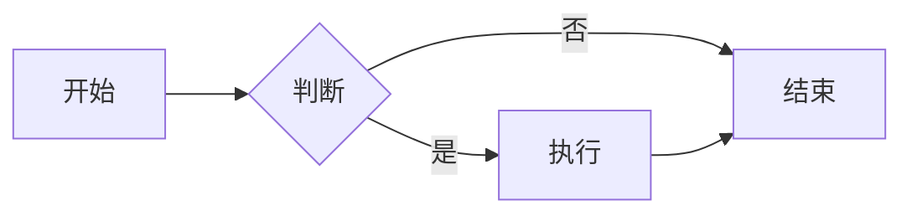
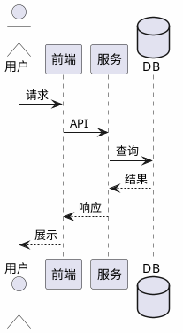
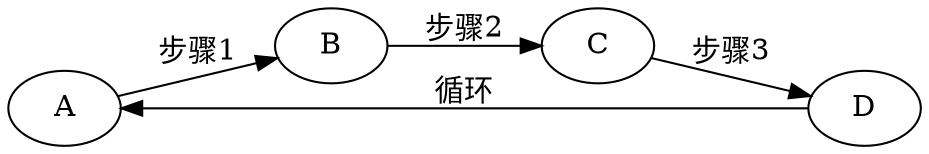

# 导出验收测试文档

本文档用于覆盖各种导出格式与转换的验收测试，包含：网络图片、本地相对/绝对路径图片、块级/行内公式、常见 Markdown 语法、Mermaid / ECharts / PlantUML / Mindmap / Graphviz 图表。

---

## 1. 图片

### 1.1 网络图片


错误的网络图片：


### 1.2 本地图片（相对路径）


### 1.3 本地图片（相对路径另一种写法）


### 1.4 占位图（黄、紫）


---

## 2. 公式

### 2.1 行内公式

行内公式示例：$E = mc^2$，以及 $e^{i\pi}+1=0$，还有 $\sum_{n=1}^{\infty} \frac{1}{n^2} = \frac{\pi^2}{6}$。

### 2.2 块级公式

$$
\int_{-\infty}^{+\infty} e^{-x^2} dx = \sqrt{\pi}
$$

$$
\nabla \times \mathbf{E} = -\frac{\partial \mathbf{B}}{\partial t}
$$

---

## 3. Markdown 语法

### 3.1 标题层级

二级标题、三级标题、**粗体**、*斜体*、`行内代码`。

### 3.2 列表

- 无序项 A
- 无序项 B
  - 嵌套项 B1
  - 嵌套项 B2

1. 有序第一
2. 有序第二
3. 有序第三

### 3.3 引用

> 这是一段引用文本。
> 多行引用。

### 3.4 表格


| 列1 | 列2 | 列3 |
| --- | --- | --- |
| A1  | A2  | A3  |
| B1  | B2  | B3  |

### 3.5 代码块（非图表）

```text
纯文本代码块，用于测试代码高亮与导出。
```

---

## 4. Mermaid 图



---

## 5. ECharts 图（JSON 格式）

```echarts
{
  "title": { "text": "最近 30 天" },
  "tooltip": { "trigger": "axis", "axisPointer": { "lineStyle": { "width": 0 } } },
  "legend": { "data": ["帖子", "用户", "回帖"] },
  "xAxis": [{
      "type": "category",
      "boundaryGap": false,
      "data": ["2019-05-08","2019-05-09","2019-05-10","2019-05-11","2019-05-12","2019-05-13","2019-05-14","2019-05-15","2019-05-16","2019-05-17","2019-05-18","2019-05-19","2019-05-20","2019-05-21","2019-05-22","2019-05-23","2019-05-24","2019-05-25","2019-05-26","2019-05-27","2019-05-28","2019-05-29","2019-05-30","2019-05-31","2019-06-01","2019-06-02","2019-06-03","2019-06-04","2019-06-05","2019-06-06","2019-06-07"],
      "axisTick": { "show": false },
      "axisLine": { "show": false }
  }],
  "yAxis": [{ "type": "value", "axisTick": { "show": false }, "axisLine": { "show": false }, "splitLine": { "lineStyle": { "color": "rgba(0, 0, 0, .38)", "type": "dashed" } } }],
  "series": [
    {
      "name": "帖子", "type": "line", "smooth": true, "itemStyle": { "color": "#d23f31" }, "areaStyle": { "normal": {} }, "z": 3,
      "data": ["18","14","22","9","7","18","10","12","13","16","6","9","15","15","12","15","8","14","9","10","29","22","14","22","9","10","15","9","9","15","0"]
    },
    {
      "name": "用户", "type": "line", "smooth": true, "itemStyle": { "color": "#f1e05a" }, "areaStyle": { "normal": {} }, "z": 2,
      "data": ["31","33","30","23","16","29","23","37","41","29","16","13","39","23","38","136","89","35","22","50","57","47","36","59","14","23","46","44","51","43","0"]
    },
    {
      "name": "回帖", "type": "line", "smooth": true, "itemStyle": { "color": "#4285f4" }, "areaStyle": { "normal": {} }, "z": 1,
      "data": ["35","42","73","15","43","58","55","35","46","87","36","15","44","76","130","73","50","20","21","54","48","73","60","89","26","27","70","63","55","37","0"]
    }
  ]
}
```

---

## 6. PlantUML（稍复杂）



---

## 7. Mindmap

```mindmap
- 教程
- 语法指导
  - 普通内容
  - 提及用户
  - 表情符号 Emoji
    - 一些表情例子
  - 大标题 - Heading 3
    - Heading 4
      - Heading 5
        - Heading 6
  - 图片
  - 代码块
    - 普通
    - 语法高亮支持
      - 演示 Go 代码高亮
      - 演示 Java 高亮
  - 有序、无序、任务列表
    - 无序列表
    - 有序列表
    - 任务列表
  - 表格
  - 隐藏细节
  - 段落
  - 链接引用
  - 数学公式
  - 脑图
  - 流程图
  - 时序图
  - 甘特图
  - 图表
  - 五线谱
  - Graphviz
  - 多媒体
  - 脚注
- 快捷键
```

---

## 8. Graphviz 图



---

## 9. 水平线与强调

---

**加粗**、*斜体*、***粗斜体***、~~删除线~~。

---

*文档结束。用于自动化导出验收测试。*
