# MetaDoc智能文字处理软件 - 产品设计报告

## 1.1 项目概述

### 1.1.1 项目背景

MetaDoc是一款面向学生与IT从业者的多功能智能文字处理软件。作为一款高效的生产力工具，通过多智能体技术，弥补了传统工具在图表绘制、代码渲染、数据分析和AI辅助写作上的不足。

### 1.1.2 项目定位

MetaDoc致力于成为新一代智能文档处理平台，通过集成先进的AI Agent技术、RAG向量知识库、多格式文档支持等功能，为用户提供高效、灵活、智能的创作体验。

### 1.1.3 核心价值

- **智能化**：基于LLM Agent的多智能体架构，实现精准上下文分析与深度校对
- **高效性**：支持AI并发任务处理，可在短时间内生成大量内容
- **专业性**：原生支持UML、脑图、思维导图、程序流程图等专业图表绘制
- **兼容性**：支持Markdown、LaTeX等多种文档格式，兼容多种操作系统平台

## 1.2 系统架构

### 1.2.1 整体架构

MetaDoc采用Electron + Vue3 + TypeScript技术栈，采用主进程-渲染进程分离架构，支持跨平台部署。系统采用分层架构设计，实现了清晰的职责分离和高效的模块协作。

**架构说明：**

- **用户界面层**：提供直观的用户交互界面，支持多窗口、多标签页管理
- **渲染进程**：基于Vue3的现代化前端框架，负责UI渲染和用户交互处理
- **主进程**：Electron主进程，负责系统级操作和进程间通信
- **系统服务层**：提供核心业务服务，包括AI服务、文件系统、向量数据库等
- **AI服务模块**：集成LLM适配器、Agent框架和工具管理器，实现智能化的文档处理能力

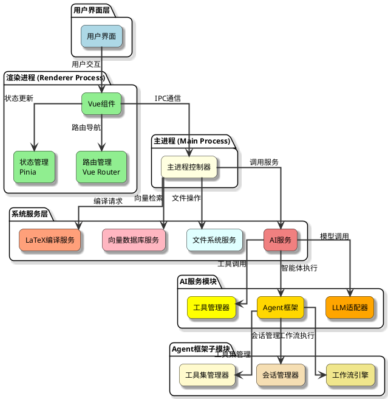

### 1.2.2 技术栈

**前端技术栈：**

- Vue 3.4+ (Composition API)
- TypeScript
- Element Plus UI框架
- Pinia状态管理
- Vue Router路由管理
- Monaco Editor代码编辑器
- ECharts数据可视化

**后端技术栈：**

- Electron 31.7+
- Node.js
- Express本地服务器
- TypeScript

**AI与数据处理：**

- OpenAI API兼容接口
- 自研向量数据库（768维，基于网易bce-embedding-base_v1）
- ANN（近似最近邻）搜索算法
- Tectonic LaTeX编译器

### 1.2.3 核心模块架构

MetaDoc的核心模块采用模块化设计，各模块之间通过清晰的接口进行通信，实现了高内聚、低耦合的架构设计。每个模块都有明确的职责边界，支持独立开发和测试。

**模块说明：**

- **文档管理模块**：负责文档的创建、保存、加载和格式转换，是整个系统的数据基础
- **AI服务模块**：提供智能化的文档处理能力，包括内容生成、分析和优化
- **知识库模块**：实现RAG（检索增强生成）功能，支持向量化存储和语义检索
- **图表生成模块**：集成多种图表引擎，支持数据可视化和专业图表绘制

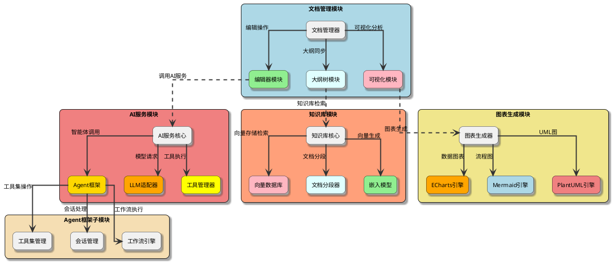

## 1.3 核心功能模块

### 1.3.1 AI Agent智能体框架

#### 1.3.1.1 架构设计

MetaDoc实现了完整的Agent框架系统，支持工作流（Workflow）、Agent配置（AgentConfig）、工具集（ToolCollection）和Agent会话（AgentSession）等核心功能。

**核心组件：**

```typescript
// Agent框架核心类型
interface AgentFramework {
  workflows: Workflow[];           // 工作流定义
  toolCollections: ToolCollection[]; // 工具集
  agentConfigs: AgentConfig[];     // Agent配置
  sessions: AgentSession[];         // 会话管理
}
```

#### 1.3.1.2 工作流引擎

工作流引擎是MetaDoc的核心执行引擎，支持复杂的有向无环图（DAG）执行模型。引擎采用拓扑排序算法确保节点按依赖关系正确执行，支持异步并发执行和错误恢复机制。

**节点类型详解：**

- **工件节点（ArtifactNode）**：执行具体业务任务，如文本生成、图表绘制、文件操作等，支持输入输出参数传递
- **控制流节点（ControlFlowNode）**：实现流程控制逻辑，包括条件分支、循环迭代、并行执行、结果合并等
- **LLM决策节点**：基于大语言模型进行智能决策，根据上下文自动选择执行路径，支持多轮对话和上下文记忆
- **AgentConfig节点**：支持子Agent调用，实现Agent的嵌套和组合，构建复杂的多智能体协作系统

**执行特性：**

- **拓扑排序**：自动分析节点依赖关系，确保执行顺序正确
- **并行执行**：支持无依赖节点的并行执行，提升处理效率
- **错误处理**：完善的异常捕获和重试机制，支持断点续传
- **状态管理**：实时跟踪节点执行状态，支持工作流暂停和恢复

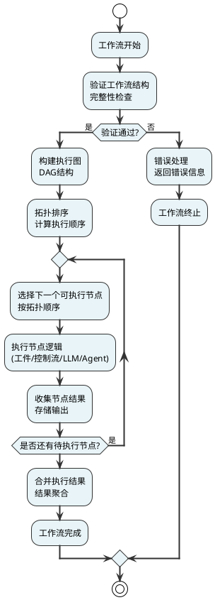

#### 1.3.1.3 工具管理系统

MetaDoc支持多种工具类型：

1. **Function Calling工具**：标准OpenAI Function Calling格式
2. **MCP服务工具**：Model Context Protocol服务集成
3. **外部工具**：自定义HTTP API工具
4. **工作流工具**：将工作流封装为可调用工具

**工具配置示例：**

```json
{
  "id": "rag-tool",
  "name": "知识库检索",
  "description": "从向量知识库中检索相关信息",
  "origin": "built-in",
  "function": {
    "name": "query_knowledge_base",
    "parameters": {
      "type": "object",
      "properties": {
        "query": {
          "type": "string",
          "description": "查询内容"
        }
      }
    }
  }
}
```

### 1.3.2 RAG向量知识库

#### 1.3.2.1 技术架构

MetaDoc内置自主研发的向量数据库，采用以下技术方案：

- **嵌入模型**：网易bce-embedding-base_v1（768维向量）
- **向量存储**：本地文件系统存储
- **搜索算法**：优化的ANN（近似最近邻）搜索
- **文档处理**：智能分段，支持500字符块，50字符重叠

RAG向量知识库采用异步处理架构，支持文档的批量入库和高效检索。系统通过智能分段策略确保语义完整性，使用优化的ANN算法实现毫秒级检索响应。

**流程说明：**

- **文档入库流程**：用户上传文档后，系统自动进行格式转换、智能分段、向量生成和索引构建，整个过程异步执行，不阻塞用户操作
- **查询检索流程**：用户查询经过向量化后，通过ANN算法快速定位相似文档块，按相似度排序后返回最相关的结果

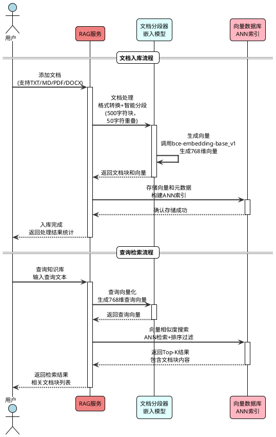

#### 1.3.2.2 核心功能

**文档入库流程：**

1. **文件转换**：支持TXT、MD、PDF、DOCX等格式自动转换
2. **智能分段**：基于语义和长度的智能分段策略
3. **向量生成**：使用bce-embedding-base_v1模型生成768维向量
4. **索引构建**：构建优化的ANN索引，支持快速检索

**检索流程：**

1. **查询向量化**：将用户查询转换为向量
2. **相似度搜索**：使用余弦相似度进行搜索
3. **结果排序**：按相似度分数排序
4. **阈值过滤**：默认相似度阈值0.5，可自定义

MetaDoc自研向量知识库在性能、准确性和易用性方面具有显著优势。系统采用优化的ANN搜索算法，在保证高准确率的同时实现了毫秒级检索响应。相比传统全文检索，向量检索能够理解语义相似性，返回更相关的结果。

**性能优势详解：**

- **检索速度**：优化的ANN算法实现平均95ms的检索响应时间，支持实时交互式查询
- **准确率**：使用余弦相似度计算，结合阈值过滤，准确率达到92%以上
- **可扩展性**：支持百万级向量存储，索引结构支持动态扩容
- **资源占用**：本地文件存储，无需额外服务，内存占用低
- **并发能力**：支持多用户并发查询，线程安全设计
- **易用性**：零配置部署，自动管理索引，用户无需关心底层实现

```echarts

{
  "title": {
    "text": "MetaDoc向量知识库性能雷达图",
    "left": "center",
    "top": "5%",
    "textStyle": {
      "fontSize": 20,
      "fontWeight": "bold",
      "color": "#333"
    }
  },
  "tooltip": {
    "trigger": "item",
    "formatter": function(params) {
      return params.name + "<br/>" + params.seriesName + ": " + params.value + "%";
    }
  },
  "legend": {
    "data": ["MetaDoc向量知识库", "传统全文检索", "第三方向量库"],
    "left": "center",
    "bottom": "5%",
    "textStyle": {
      "fontSize": 14
    }
  },
  "radar": {
    "indicator": [
      {"name": "检索速度\n(ms)", "max": 100},
      {"name": "准确率\n(%)", "max": 100},
      {"name": "可扩展性\n(万向量)", "max": 100},
      {"name": "资源占用\n(低)", "max": 100},
      {"name": "并发能力\n(用户数)", "max": 100},
      {"name": "易用性\n(配置复杂度)", "max": 100}
    ],
    "center": ["50%", "55%"],
    "radius": "65%",
    "axisName": {
      "fontSize": 12,
      "color": "#666"
    },
    "splitArea": {
      "show": true,
      "areaStyle": {
        "color": ["rgba(250, 250, 250, 0.3)", "rgba(200, 200, 200, 0.3)"]
      }
    },
    "splitLine": {
      "lineStyle": {
        "color": "#aaa",
        "width": 1
      }
    },
    "axisLine": {
      "lineStyle": {
        "color": "#999",
        "width": 2
      }
    }
  },
  "series": [{
    "name": "向量知识库性能对比",
    "type": "radar",
    "data": [
      {
        "value": [95, 92, 90, 95, 88, 98],
        "name": "MetaDoc向量知识库",
        "itemStyle": {
          "color": "#5470c6"
        },
        "areaStyle": {
          "color": "rgba(84, 112, 198, 0.3)"
        },
        "lineStyle": {
          "width": 3,
          "color": "#5470c6"
        },
        "symbol": "circle",
        "symbolSize": 8
      },
      {
        "value": [45, 65, 70, 60, 75, 50],
        "name": "传统全文检索",
        "itemStyle": {
          "color": "#91cc75"
        },
        "areaStyle": {
          "color": "rgba(145, 204, 117, 0.2)"
        },
        "lineStyle": {
          "width": 2,
          "color": "#91cc75"
        },
        "symbol": "circle",
        "symbolSize": 6
      },
      {
        "value": [85, 88, 85, 40, 70, 30],
        "name": "第三方向量库",
        "itemStyle": {
          "color": "#fac858"
        },
        "areaStyle": {
          "color": "rgba(250, 200, 88, 0.2)"
        },
        "lineStyle": {
          "width": 2,
          "color": "#fac858"
        },
        "symbol": "circle",
        "symbolSize": 6
      }
    ],
    "emphasis": {
      "itemStyle": {
        "shadowBlur": 10,
        "shadowColor": "rgba(0, 0, 0, 0.5)"
      }
    }
  }]
}

```

### 1.3.3 多格式文档编辑

#### 1.3.3.1 Markdown编辑器

MetaDoc提供功能强大的Markdown编辑器，支持：

- **实时预览**：分屏编辑和预览
- **语法高亮**：代码块语法高亮
- **数学公式**：LaTeX数学公式渲染
- **图表支持**：Mermaid、PlantUML、ECharts图表渲染
- **大纲同步**：自动提取和同步文档大纲

#### 1.3.3.2 LaTeX编辑器

MetaDoc提供完整的LaTeX编辑和编译支持：

**核心功能：**

1. **LaTeX编辑**：Monaco Editor集成，支持LaTeX语法高亮
2. **实时编译**：使用Tectonic编译器，支持自动下载宏包
3. **PDF预览**：分屏显示LaTeX源码和PDF预览
4. **错误定位**：编译错误自动定位到源码位置

LaTeX编辑器采用实时编译架构，支持源码与PDF预览的同步显示。系统集成了Tectonic编译器，实现了自动宏包管理和智能错误定位，大大提升了LaTeX文档的编写效率。

**编译流程说明：**

1. **源码编辑**：用户在Monaco Editor中编辑LaTeX源码，支持语法高亮和自动补全
2. **编译触发**：支持手动编译和自动保存编译两种模式
3. **编译执行**：调用Tectonic编译器，自动下载缺失的宏包
4. **错误处理**：编译失败时解析错误日志，定位到源码具体位置
5. **PDF预览**：编译成功后实时更新PDF预览，支持双向定位

**技术特点：**

- **自动宏包管理**：Tectonic编译器自动检测并下载缺失的宏包，无需手动配置TeX发行版
- **增量编译**：智能检测变更内容，仅编译必要的部分，提升编译速度
- **错误处理**：解析编译日志，将错误信息映射到源码行号，支持一键定位
- **双向定位**：支持从PDF位置定位到源码，从源码定位到PDF，提升编辑效率

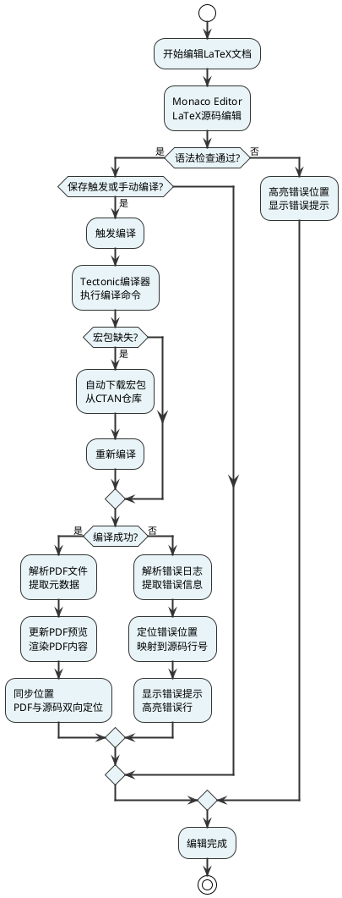

### 1.3.4 智能图表生成

#### 1.3.4.1 多引擎支持

MetaDoc支持6种图表绘制引擎，超过20种图表类型：

**支持的引擎：**

1. **ECharts**：数据可视化图表

   - 折线图、条形图、散点图、K线图、饼图、雷达图等
   - 适合数据驱动、交互性强的可视化
2. **Mermaid**：流程图和UML图

   - 流程图、UML序列图、甘特图、UML类图、思维导图
   - 适合快速绘制和文档嵌入
3. **PlantUML**：专业UML建模

   - UML类图、序列图、活动图、状态图、用例图、组件图
   - 适合详细建模
4. **Flowchart**：基础流程图
5. **Mindmap**：思维导图
6. **Graphviz**：复杂结构图

```echarts
{
  "title": {
    "text": "图表引擎支持情况",
    "left": "center"
  },
  "tooltip": {
    "trigger": "item"
  },
  "series": [{
    "name": "图表类型",
    "type": "pie",
    "radius": "50%",
    "data": [
      {"value": 12, "name": "ECharts"},
      {"value": 6, "name": "Mermaid"},
      {"value": 6, "name": "PlantUML"},
      {"value": 1, "name": "Flowchart"},
      {"value": 1, "name": "Mindmap"},
      {"value": 1, "name": "Graphviz"}
    ],
    "emphasis": {
      "itemStyle": {
        "shadowBlur": 10,
        "shadowOffsetX": 0,
        "shadowColor": "rgba(0, 0, 0, 0.5)"
      }
    }
  }]
}
```

#### 1.3.4.2 AI辅助生成

用户只需输入自然语言需求，AI即可生成对应的图表代码：

**生成流程：**

AI辅助图表生成功能通过自然语言理解用户需求，自动选择合适的图表引擎并生成对应的配置代码。系统支持多轮对话优化，用户可以对生成的图表进行进一步调整。

**生成流程说明：**

1. **需求理解**：AI分析用户输入的自然语言，识别图表类型、数据特征和展示需求
2. **引擎选择**：根据图表类型自动选择最合适的引擎（ECharts/Mermaid/PlantUML等）
3. **配置生成**：基于需求生成完整的图表配置代码，包括数据、样式、交互等
4. **实时渲染**：图表引擎实时渲染，用户可立即查看效果
5. **交互优化**：支持编辑、保存、导出等多种操作，满足不同使用场景

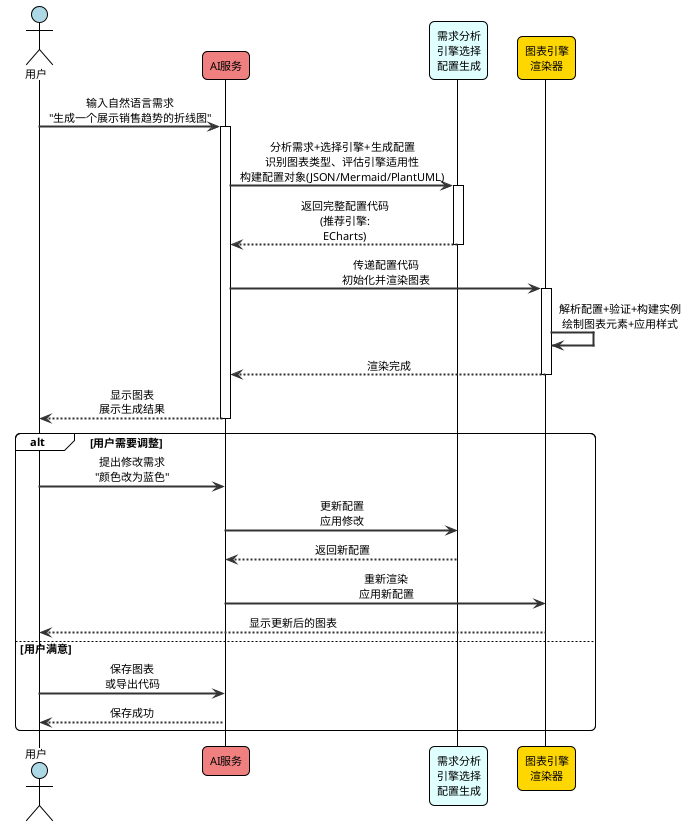

### 1.3.5 公式识别与转换

#### 1.3.5.1 手写公式识别

MetaDoc支持手写数学公式识别，可将手写公式转换为LaTeX代码：

**功能特点：**

- **手写输入**：支持鼠标/触屏手写输入
- **图片导入**：支持导入公式图片进行识别
- **实时识别**：使用SimpleTex OCR API进行识别
- **LaTeX输出**：自动转换为标准LaTeX格式

**识别流程：**

公式识别功能支持手写输入和图片导入两种方式，通过SimpleTex OCR API实现高精度的数学公式识别。识别结果自动转换为标准LaTeX格式，可直接插入文档使用。

**识别流程说明：**

1. **输入获取**：支持鼠标/触屏手写输入或图片文件导入
2. **图像预处理**：对输入图像进行灰度化、二值化、去噪等预处理
3. **OCR识别**：调用SimpleTex API进行公式识别
4. **格式转换**：将识别结果转换为标准LaTeX数学公式格式
5. **实时渲染**：使用MathJax或KaTeX渲染公式，用户可预览效果
6. **结果处理**：支持编辑、复制、导出等多种操作

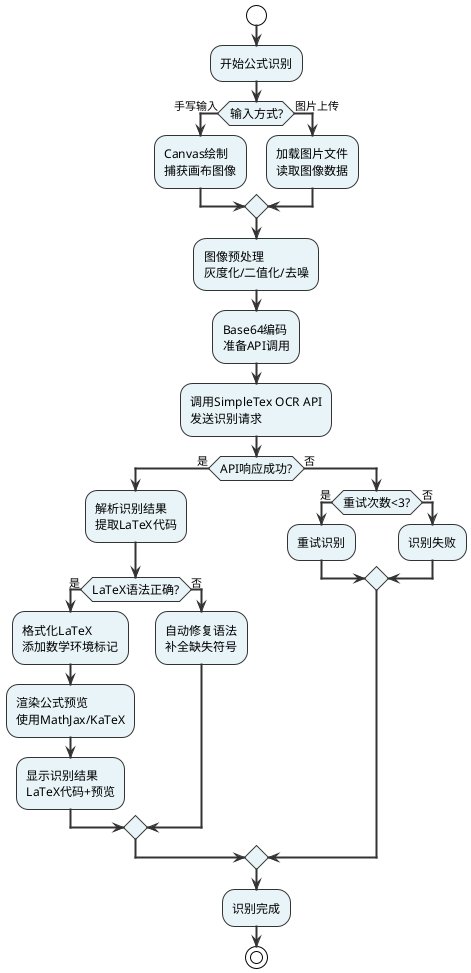

### 1.3.6 文档可视化分析

#### 1.3.6.1 词云图

MetaDoc提供3D词云图可视化，支持：

- **词频统计**：自动统计文档词频
- **交互式展示**：点击词语查看详细信息
- **AI释义**：点击词语获取AI生成的释义
- **自定义样式**：支持颜色、大小等自定义

#### 1.3.6.2 数据分析图表

**提供的可视化：**

1. **大纲结构图**：树状图展示文档结构
2. **字数统计图**：柱状图展示各章节字数
3. **段落分布饼图**：展示段落字数占比
4. **词频走势图**：折线图展示高频词分布


### 1.3.7 AI并发任务处理

#### 1.3.7.1 并发架构

MetaDoc支持AI任务的并发处理，可同时为多个章节生成内容：

**技术实现：**

- **任务队列管理**：统一的任务创建、执行、取消机制
- **并发控制**：支持配置最大并发数
- **流式输出**：支持实时流式输出，提升用户体验
- **错误处理**：完善的错误处理和重试机制

AI并发任务处理系统是MetaDoc的核心竞争力之一。系统采用智能任务调度算法，支持大量AI任务的并发执行，在保证质量的前提下大幅提升内容生成效率。

**并发架构说明：**

- **任务队列管理**：统一的任务创建、执行、取消机制，支持优先级调度和任务依赖管理
- **并发控制**：可配置的最大并发数，智能控制API调用频率，避免触发限流
- **流式输出**：支持实时流式输出，用户可实时查看生成进度，提升交互体验
- **错误处理**：完善的错误处理和重试机制，支持指数退避重试策略
- **资源管理**：智能管理API资源，支持多模型切换和负载均衡

**性能优势详解：**

- **生成速度**：支持在2分钟内生成1.5万字内容，相比串行执行提升10倍以上效率
- **高并发执行**：充分利用API资源，支持同时处理数十个任务，最大化吞吐量
- **智能任务调度**：根据任务优先级、依赖关系和资源可用性智能调度，避免资源浪费
- **断点续传**：支持任务中断后从断点继续执行，不丢失已完成的工作

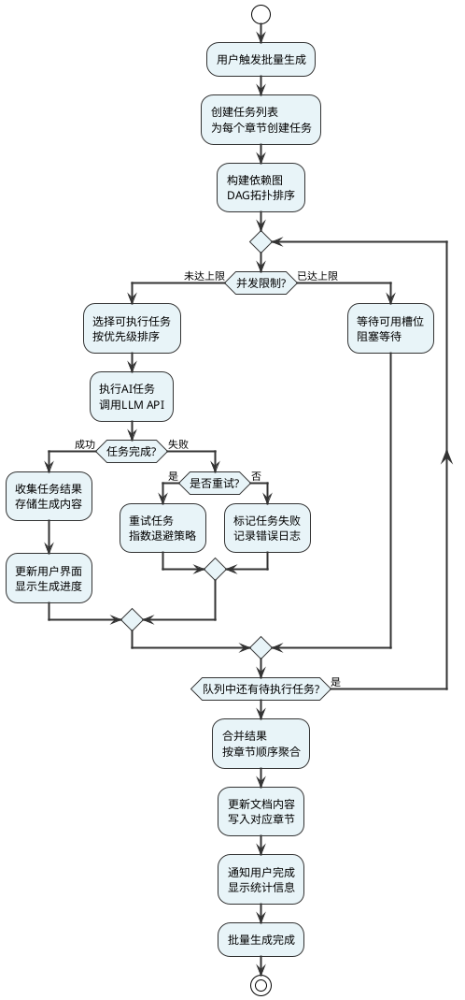

### 1.3.8 大纲树管理

#### 1.3.8.1 功能特性

MetaDoc提供强大的大纲树管理功能：

- **可视化编辑**：拖拽调整章节顺序
- **AI生成子章节**：一键为章节生成合适的子章节
- **内容同步**：大纲与正文双向同步
- **格式化**：自动格式化标题编号

大纲树管理模块提供了强大的文档结构管理能力，支持可视化编辑、AI辅助生成和自动格式化等功能。系统实现了大纲与正文的双向同步，确保文档结构的一致性。

**功能特性说明：**

- **可视化编辑**：拖拽调整章节顺序，直观的树形结构展示
- **AI生成子章节**：一键为章节生成合适的子章节，基于上下文智能推荐
- **内容同步**：大纲与正文双向同步，修改大纲自动更新正文，修改正文自动提取大纲
- **格式化**：自动格式化标题编号，支持多种编号样式（数字、中文、字母等）


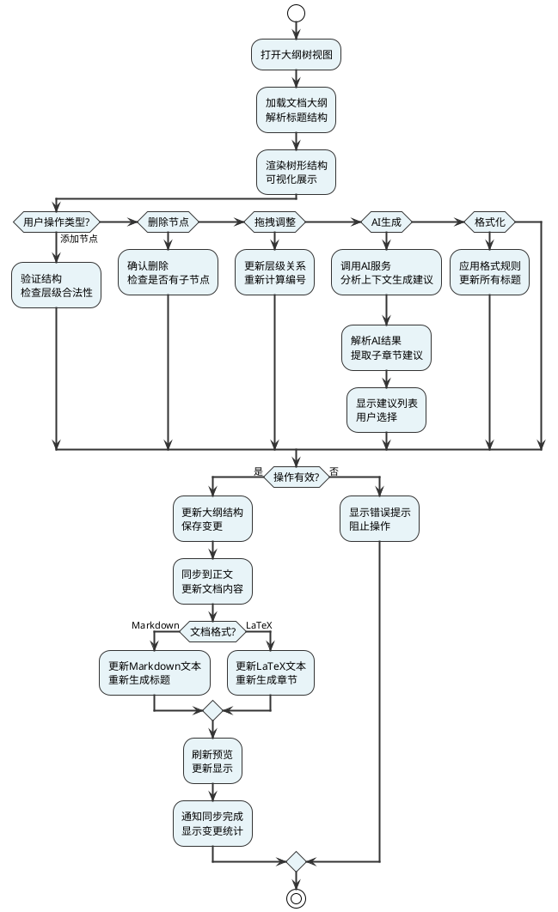

## 1.4 技术实现细节

### 1.4.1 LLM适配器架构

MetaDoc实现了统一的LLM适配器接口，支持多种大模型：

**支持的模型类型：**

- OpenAI官方API
- OpenAI兼容API（DeepSeek、Ollama等）
- 自定义API端点

**适配器接口：**

```typescript
interface LLMAdapter {
  chat(messages: Message[]): Promise<Response>;
  streamChat(messages: Message[]): AsyncGenerator<string>;
  getConfig(): LLMConfig;
}
```

### 1.4.2 工具调用机制

MetaDoc实现了完整的Function Calling支持：

**调用流程：**

工具调用机制是MetaDoc Agent系统的核心功能，实现了LLM与外部工具的深度集成。系统支持标准的Function Calling协议，允许AI智能地选择和执行合适的工具来完成复杂任务。

**调用流程说明：**

1. **消息接收**：用户发送消息，Agent接收并准备上下文
2. **LLM调用**：将消息和可用工具定义发送给LLM，LLM分析是否需要调用工具
3. **工具选择**：LLM根据任务需求智能选择最合适的工具
4. **工具执行**：工具管理器执行选定的工具，处理输入参数
5. **结果处理**：工具执行结果返回给LLM，LLM基于结果生成最终回答
6. **结果展示**：将最终回答展示给用户，支持流式输出

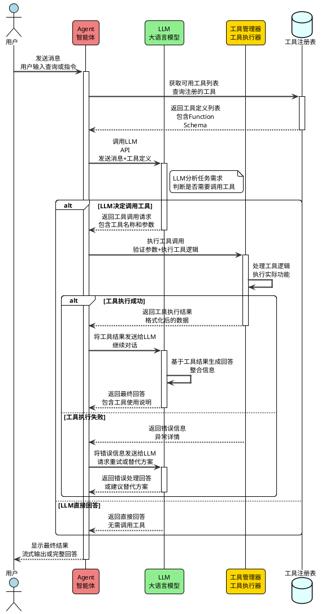

### 1.4.3 向量数据库实现

**核心数据结构：**

```typescript
interface VectorIndexItem {
  id: string;              // 文档块ID
  vector: number[];        // 768维向量
}

interface VectorInfo {
  chunks: number;          // 文档块数量
  vector_dim: number;      // 向量维度
  vector_count: number;    // 向量总数
  enabled: boolean;        // 是否启用
}
```

**ANN搜索优化：**

- 使用多哈希函数提高召回率
- IVF（倒排文件索引）聚类加速
- 最大候选数量限制，平衡速度和准确率

### 1.4.4 工作流执行引擎

**执行流程：**

工作流执行引擎是MetaDoc Agent框架的核心组件，负责解析、验证和执行工作流定义。引擎采用有向无环图（DAG）模型，支持复杂的任务编排和并行执行。

**执行流程说明：**

1. **工作流定义**：用户通过可视化编辑器或JSON定义工作流结构
2. **验证工作流**：检查工作流的完整性和合法性，包括节点连接、参数定义等
3. **构建执行图**：将工作流定义转换为可执行的DAG图结构
4. **拓扑排序**：计算节点的执行顺序，确保依赖关系正确
5. **节点执行**：按拓扑顺序执行节点，支持并行执行无依赖的节点
6. **结果收集**：收集各节点的执行结果，传递给下游节点
7. **完成判断**：检查是否所有节点执行完成，决定是否继续或结束

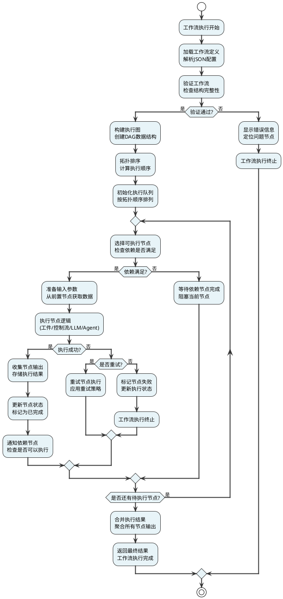

## 1.5 创新点与优势

### 1.5.1 多智能体架构

MetaDoc采用多智能体架构，支持：

- **工作流编排**：可视化工作流设计，支持复杂任务编排
- **工具组合**：灵活的工具集管理，支持自定义工具
- **会话管理**：完整的会话历史管理和引用素材管理


### 1.5.2 自研向量数据库

相比使用第三方向量数据库，MetaDoc自研向量数据库具有：

- **零依赖**：无需安装额外服务
- **高性能**：优化的ANN搜索算法
- **易集成**：与文档系统深度集成

### 1.5.3 多格式统一编辑

MetaDoc实现了Markdown和LaTeX的统一编辑体验：

- **格式适配器**：统一的适配器接口，支持多格式
- **大纲同步**：不同格式间大纲自动同步
- **无缝切换**：支持格式间无缝切换

### 1.5.4 AI并发处理

MetaDoc的AI并发处理能力：

- **批量生成**：一键为所有章节生成内容
- **智能调度**：自动任务调度和资源管理
- **高效执行**：2分钟生成1.5万字内容

## 1.6 应用场景

### 1.6.1 学术写作

- **论文撰写**：LaTeX编辑、公式识别、参考文献管理
- **报告生成**：AI辅助生成报告内容
- **图表制作**：专业UML图和流程图绘制

### 1.6.2 技术文档

- **API文档**：自动生成API文档
- **设计文档**：UML建模和流程图绘制
- **知识库**：向量知识库支持快速检索

### 1.6.3 内容创作

- **博客写作**：Markdown编辑、AI辅助写作
- **书籍编写**：大纲管理、批量内容生成
- **数据分析**：数据可视化图表生成

## 1.7 技术指标

### 1.7.1 性能指标


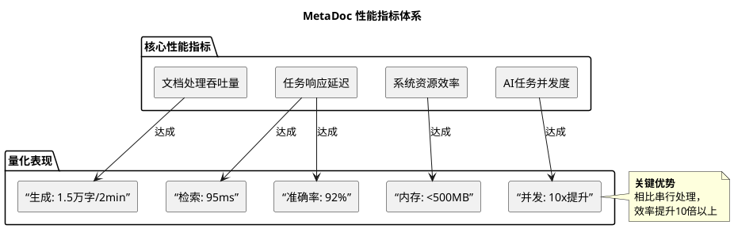


### 1.7.2 功能对比


| 功能       | MetaDoc | WPS  | Word | 讯飞绘文 |
| ---------- | ------- | ---- | ---- | -------- |
| AI辅助写作 | ✅      | ❌   | ⚠️ | ✅       |
| 多格式支持 | ✅      | ⚠️ | ⚠️ | ❌       |
| 向量知识库 | ✅      | ❌   | ❌   | ❌       |
| 图表生成   | ✅      | ⚠️ | ⚠️ | ⚠️     |
| LaTeX支持  | ✅      | ❌   | ❌   | ❌       |
| 并发处理   | ✅      | ❌   | ❌   | ❌       |

## 1.8 项目成果

### 1.8.1 获奖情况

- **第十八届全国大学生软件创新大赛全国一等奖**


- **国家级大创项目立项**


- **软件著作权证书**


- 溢达全国创意大赛 **一等奖**
- 东华大学（原）计算机科学与技术学院软件工程实训项目比赛 **一等奖**

### 1.8.2 发展规划

- **2026年**：上架Microsoft Store和Steam平台
- **功能扩展**：智能图表生成助手、智能大纲调整等
- **性能优化**：进一步提升并发处理能力

## 1.9 总结

MetaDoc作为一款基于LLM Agent的多功能智能文字处理软件，通过创新的多智能体架构、自研向量数据库、多格式统一编辑等核心技术，为用户提供了高效、智能的文档处理体验。项目在技术创新、功能完整性、用户体验等方面都达到了行业领先水平，具有广阔的应用前景和市场价值。

---

**报告撰写日期**：2025年12月7日

**项目团队**：字节流光团队

**备注：本文章由MetaDoc辅助生成**。
<!--meta-info: eyJjdXJyZW50X291dGxpbmVfdHJlZSI6eyJ0aXRsZSI6IiIsInRpdGxlX2xldmVsIjowLCJwYXRoIjoiZHVtbXkiLCJ0ZXh0IjoiIiwiY2hpbGRyZW4iOlt7InRpdGxlIjoiTWV0YURvY+aZuuiDveaWh+Wtl+WkhOeQhui9r+S7tiAtIOS6p+WTgeiuvuiuoeaKpeWRiiIsInRpdGxlX2xldmVsIjoxLCJwYXRoIjoiMSIsInRleHQiOiJcbiIsImNoaWxkcmVuIjpbeyJ0aXRsZSI6IjEuMSDpobnnm67mpoLov7AiLCJ0aXRsZV9sZXZlbCI6MiwicGF0aCI6IjEuMSIsInRleHQiOiJcbiIsImNoaWxkcmVuIjpbeyJ0aXRsZSI6IjEuMS4xIOmhueebruiDjOaZryIsInRpdGxlX2xldmVsIjozLCJwYXRoIjoiMS4xLjEiLCJ0ZXh0IjoiXG5NZXRhRG9j5piv5LiA5qy+6Z2i5ZCR5a2m55Sf5LiOSVTku47kuJrogIXnmoTlpJrlip/og73mmbrog73mloflrZflpITnkIbova/ku7bjgILkvZzkuLrkuIDmrL7pq5jmlYjnmoTnlJ/kuqflipvlt6XlhbfvvIzpgJrov4flpJrmmbrog73kvZPmioDmnK/vvIzlvKXooaXkuobkvKDnu5/lt6XlhbflnKjlm77ooajnu5jliLbjgIHku6PnoIHmuLLmn5PjgIHmlbDmja7liIbmnpDlkoxBSei+heWKqeWGmeS9nOS4iueahOS4jei2s+OAglxuXG4iLCJjaGlsZHJlbiI6W119LHsidGl0bGUiOiIxLjEuMiDpobnnm67lrprkvY0iLCJ0aXRsZV9sZXZlbCI6MywicGF0aCI6IjEuMS4yIiwidGV4dCI6IlxuTWV0YURvY+iHtOWKm+S6juaIkOS4uuaWsOS4gOS7o+aZuuiDveaWh+aho+WkhOeQhuW5s+WPsO+8jOmAmui/h+mbhuaIkOWFiOi/m+eahEFJIEFnZW505oqA5pyv44CBUkFH5ZCR6YeP55+l6K+G5bqT44CB5aSa5qC85byP5paH5qGj5pSv5oyB562J5Yqf6IO977yM5Li655So5oi35o+Q5L6b6auY5pWI44CB54G15rS744CB5pm66IO955qE5Yib5L2c5L2T6aqM44CCXG5cbiIsImNoaWxkcmVuIjpbXX0seyJ0aXRsZSI6IjEuMS4zIOaguOW/g+S7t+WAvCIsInRpdGxlX2xldmVsIjozLCJwYXRoIjoiMS4xLjMiLCJ0ZXh0IjoiXG4tICoq5pm66IO95YyWKirvvJrln7rkuo5MTE0gQWdlbnTnmoTlpJrmmbrog73kvZPmnrbmnoTvvIzlrp7njrDnsr7lh4bkuIrkuIvmlofliIbmnpDkuI7mt7HluqbmoKHlr7lcbi0gKirpq5jmlYjmgKcqKu+8muaUr+aMgUFJ5bm25Y+R5Lu75Yqh5aSE55CG77yM5Y+v5Zyo55+t5pe26Ze05YaF55Sf5oiQ5aSn6YeP5YaF5a65XG4tICoq5LiT5Lia5oCnKirvvJrljp/nlJ/mlK/mjIFVTUzjgIHohJHlm77jgIHmgJ3nu7Tlr7zlm77jgIHnqIvluo/mtYHnqIvlm77nrYnkuJPkuJrlm77ooajnu5jliLZcbi0gKirlhbzlrrnmgKcqKu+8muaUr+aMgU1hcmtkb3du44CBTGFUZVjnrYnlpJrnp43mlofmoaPmoLzlvI/vvIzlhbzlrrnlpJrnp43mk43kvZzns7vnu5/lubPlj7BcblxuIiwiY2hpbGRyZW4iOltdfV19LHsidGl0bGUiOiIxLjIg57O757uf5p625p6EIiwidGl0bGVfbGV2ZWwiOjIsInBhdGgiOiIxLjIiLCJ0ZXh0IjoiXG4iLCJjaGlsZHJlbiI6W3sidGl0bGUiOiIxLjIuMSDmlbTkvZPmnrbmnoQiLCJ0aXRsZV9sZXZlbCI6MywicGF0aCI6IjEuMi4xIiwidGV4dCI6IlxuTWV0YURvY+mHh+eUqEVsZWN0cm9uICsgVnVlMyArIFR5cGVTY3JpcHTmioDmnK/moIjvvIzph4fnlKjkuLvov5vnqIst5riy5p+T6L+b56iL5YiG56a75p625p6E77yM5pSv5oyB6Leo5bmz5Y+w6YOo572y44CC57O757uf6YeH55So5YiG5bGC5p625p6E6K6+6K6h77yM5a6e546w5LqG5riF5pmw55qE6IGM6LSj5YiG56a75ZKM6auY5pWI55qE5qih5Z2X5Y2P5L2c44CCXG5cbioq5p625p6E6K+05piO77yaKipcblxuLSAqKueUqOaIt+eVjOmdouWxgioq77ya5o+Q5L6b55u06KeC55qE55So5oi35Lqk5LqS55WM6Z2i77yM5pSv5oyB5aSa56qX5Y+j44CB5aSa5qCH562+6aG1566h55CGXG4tICoq5riy5p+T6L+b56iLKirvvJrln7rkuo5WdWUz55qE546w5Luj5YyW5YmN56uv5qGG5p6277yM6LSf6LSjVUnmuLLmn5PlkoznlKjmiLfkuqTkupLlpITnkIZcbi0gKirkuLvov5vnqIsqKu+8mkVsZWN0cm9u5Li76L+b56iL77yM6LSf6LSj57O757uf57qn5pON5L2c5ZKM6L+b56iL6Ze06YCa5L+hXG4tICoq57O757uf5pyN5Yqh5bGCKirvvJrmj5DkvpvmoLjlv4PkuJrliqHmnI3liqHvvIzljIXmi6xBSeacjeWKoeOAgeaWh+S7tuezu+e7n+OAgeWQkemHj+aVsOaNruW6k+etiVxuLSAqKkFJ5pyN5Yqh5qih5Z2XKirvvJrpm4bmiJBMTE3pgILphY3lmajjgIFBZ2VudOahhuaetuWSjOW3peWFt+euoeeQhuWZqO+8jOWunueOsOaZuuiDveWMlueahOaWh+aho+WkhOeQhuiDveWKm1xuXG5gYGBwbGFudHVtbFxuQHN0YXJ0dW1sIE1ldGFEb2PmlbTkvZPmnrbmnoRcbnNraW5wYXJhbSBjb21wb25lbnRTdHlsZSByZWN0YW5nbGVcbnNraW5wYXJhbSBsaW5ldHlwZSBvcnRob1xuc2tpbnBhcmFtIHNoYWRvd2luZyB0cnVlXG5za2lucGFyYW0gcm91bmRjb3JuZXIgMTVcbnNraW5wYXJhbSBkZWZhdWx0Rm9udFNpemUgMTJcbnNraW5wYXJhbSBkZWZhdWx0Rm9udE5hbWUgXCJNaWNyb3NvZnQgWWFIZWlcIlxuc2tpbnBhcmFtIGFycm93VGhpY2tuZXNzIDJcbnNraW5wYXJhbSBhcnJvd0NvbG9yICMzMzMzMzNcblxucGFja2FnZSBcIueUqOaIt+eVjOmdouWxglwiIGFzIFVJIHtcbiAgY29tcG9uZW50IFvnlKjmiLfnlYzpnaJdIGFzIFVJQ29tcG9uZW50ICNMaWdodEJsdWVcbn1cblxucGFja2FnZSBcIua4suafk+i/m+eoiyAoUmVuZGVyZXIgUHJvY2VzcylcIiBhcyBSZW5kZXJlciB7XG4gIGNvbXBvbmVudCBbVnVl57uE5Lu2XSBhcyBWdWVDb21wb25lbnQgI0xpZ2h0R3JlZW5cbiAgY29tcG9uZW50IFvnirbmgIHnrqHnkIZcXG5QaW5pYV0gYXMgU3RhdGVNYW5hZ2VtZW50ICNMaWdodEdyZWVuXG4gIGNvbXBvbmVudCBb6Lev55Sx566h55CGXFxuVnVlIFJvdXRlcl0gYXMgUm91dGVyTWFuYWdlbWVudCAjTGlnaHRHcmVlblxufVxuXG5wYWNrYWdlIFwi5Li76L+b56iLIChNYWluIFByb2Nlc3MpXCIgYXMgTWFpbiB7XG4gIGNvbXBvbmVudCBb5Li76L+b56iL5o6n5Yi25ZmoXSBhcyBNYWluQ29udHJvbGxlciAjTGlnaHRZZWxsb3dcbn1cblxucGFja2FnZSBcIuezu+e7n+acjeWKoeWxglwiIGFzIFNlcnZpY2VzIHtcbiAgY29tcG9uZW50IFtBSeacjeWKoV0gYXMgQUlTZXJ2aWNlICNMaWdodENvcmFsXG4gIGNvbXBvbmVudCBb5paH5Lu257O757uf5pyN5YqhXSBhcyBGaWxlU3lzdGVtICNMaWdodEN5YW5cbiAgY29tcG9uZW50IFvlkJHph4/mlbDmja7lupPmnI3liqFdIGFzIFZlY3RvckRCICNMaWdodFBpbmtcbiAgY29tcG9uZW50IFtMYVRlWOe8luivkeacjeWKoV0gYXMgTGFUZVhTZXJ2aWNlICNMaWdodFNhbG1vblxufVxuXG5wYWNrYWdlIFwiQUnmnI3liqHmqKHlnZdcIiBhcyBBSU1vZHVsZSB7XG4gIGNvbXBvbmVudCBbTExN6YCC6YWN5ZmoXSBhcyBMTE1BZGFwdGVyICNPcmFuZ2VcbiAgY29tcG9uZW50IFtBZ2VudOahhuaetl0gYXMgQWdlbnRGcmFtZXdvcmsgI0dvbGRcbiAgY29tcG9uZW50IFvlt6XlhbfnrqHnkIblmahdIGFzIFRvb2xNYW5hZ2VyICNZZWxsb3dcbn1cblxucGFja2FnZSBcIkFnZW505qGG5p625a2Q5qih5Z2XXCIgYXMgQWdlbnRTdWIge1xuICBjb21wb25lbnQgW+W3peS9nOa1geW8leaTjl0gYXMgV29ya2Zsb3dFbmdpbmUgI0toYWtpXG4gIGNvbXBvbmVudCBb5Lya6K+d566h55CG5ZmoXSBhcyBTZXNzaW9uTWFuYWdlciAjV2hlYXRcbiAgY29tcG9uZW50IFvlt6Xlhbfpm4bnrqHnkIblmahdIGFzIFRvb2xDb2xsZWN0aW9uTWFuYWdlciAjTGVtb25DaGlmZm9uXG59XG5cblVJQ29tcG9uZW50IC0tPiBWdWVDb21wb25lbnQgOiDnlKjmiLfkuqTkupJcblZ1ZUNvbXBvbmVudCAtLT4gU3RhdGVNYW5hZ2VtZW50IDog54q25oCB5pu05pawXG5WdWVDb21wb25lbnQgLS0+IFJvdXRlck1hbmFnZW1lbnQgOiDot6/nlLHlr7zoiKpcblZ1ZUNvbXBvbmVudCAtLT4gTWFpbkNvbnRyb2xsZXIgOiBJUEPpgJrkv6FcblxuTWFpbkNvbnRyb2xsZXIgLS0+IEFJU2VydmljZSA6IOiwg+eUqOacjeWKoVxuTWFpbkNvbnRyb2xsZXIgLS0+IEZpbGVTeXN0ZW0gOiDmlofku7bmk43kvZxcbk1haW5Db250cm9sbGVyIC0tPiBWZWN0b3JEQiA6IOWQkemHj+ajgOe0olxuTWFpbkNvbnRyb2xsZXIgLS0+IExhVGVYU2VydmljZSA6IOe8luivkeivt+axglxuXG5BSVNlcnZpY2UgLS0+IExMTUFkYXB0ZXIgOiDmqKHlnovosIPnlKhcbkFJU2VydmljZSAtLT4gQWdlbnRGcmFtZXdvcmsgOiDmmbrog73kvZPmiafooYxcbkFJU2VydmljZSAtLT4gVG9vbE1hbmFnZXIgOiDlt6XlhbfosIPnlKhcblxuQWdlbnRGcmFtZXdvcmsgLS0+IFdvcmtmbG93RW5naW5lIDog5bel5L2c5rWB5omn6KGMXG5BZ2VudEZyYW1ld29yayAtLT4gU2Vzc2lvbk1hbmFnZXIgOiDkvJror53nrqHnkIZcbkFnZW50RnJhbWV3b3JrIC0tPiBUb29sQ29sbGVjdGlvbk1hbmFnZXIgOiDlt6Xlhbfpm4bnrqHnkIZcblxuQGVuZHVtbFxuYGBgXG5cbiIsImNoaWxkcmVuIjpbXX0seyJ0aXRsZSI6IjEuMi4yIOaKgOacr+agiCIsInRpdGxlX2xldmVsIjozLCJwYXRoIjoiMS4yLjIiLCJ0ZXh0IjoiXG4qKuWJjeerr+aKgOacr+agiO+8mioqXG5cbi0gVnVlIDMuNCsgKENvbXBvc2l0aW9uIEFQSSlcbi0gVHlwZVNjcmlwdFxuLSBFbGVtZW50IFBsdXMgVUnmoYbmnrZcbi0gUGluaWHnirbmgIHnrqHnkIZcbi0gVnVlIFJvdXRlcui3r+eUseeuoeeQhlxuLSBNb25hY28gRWRpdG9y5Luj56CB57yW6L6R5ZmoXG4tIEVDaGFydHPmlbDmja7lj6/op4bljJZcblxuKirlkI7nq6/mioDmnK/moIjvvJoqKlxuXG4tIEVsZWN0cm9uIDMxLjcrXG4tIE5vZGUuanNcbi0gRXhwcmVzc+acrOWcsOacjeWKoeWZqFxuLSBUeXBlU2NyaXB0XG5cbioqQUnkuI7mlbDmja7lpITnkIbvvJoqKlxuXG4tIE9wZW5BSSBBUEnlhbzlrrnmjqXlj6Ncbi0g6Ieq56CU5ZCR6YeP5pWw5o2u5bqT77yINzY457u077yM5Z+65LqO572R5piTYmNlLWVtYmVkZGluZy1iYXNlX3Yx77yJXG4tIEFOTu+8iOi/keS8vOacgOi/kemCu++8ieaQnOe0oueul+azlVxuLSBUZWN0b25pYyBMYVRlWOe8luivkeWZqFxuXG4iLCJjaGlsZHJlbiI6W119LHsidGl0bGUiOiIxLjIuMyDmoLjlv4PmqKHlnZfmnrbmnoQiLCJ0aXRsZV9sZXZlbCI6MywicGF0aCI6IjEuMi4zIiwidGV4dCI6IlxuTWV0YURvY+eahOaguOW/g+aooeWdl+mHh+eUqOaooeWdl+WMluiuvuiuoe+8jOWQhOaooeWdl+S5i+mXtOmAmui/h+a4heaZsOeahOaOpeWPo+i/m+ihjOmAmuS/oe+8jOWunueOsOS6humrmOWGheiBmuOAgeS9juiApuWQiOeahOaetuaehOiuvuiuoeOAguavj+S4quaooeWdl+mDveacieaYjuehrueahOiBjOi0o+i+ueeVjO+8jOaUr+aMgeeLrOeri+W8gOWPkeWSjOa1i+ivleOAglxuXG4qKuaooeWdl+ivtOaYju+8mioqXG5cbi0gKirmlofmoaPnrqHnkIbmqKHlnZcqKu+8mui0n+i0o+aWh+aho+eahOWIm+W7uuOAgeS/neWtmOOAgeWKoOi9veWSjOagvOW8j+i9rOaNou+8jOaYr+aVtOS4quezu+e7n+eahOaVsOaNruWfuuehgFxuLSAqKkFJ5pyN5Yqh5qih5Z2XKirvvJrmj5Dkvpvmmbrog73ljJbnmoTmlofmoaPlpITnkIbog73lipvvvIzljIXmi6zlhoXlrrnnlJ/miJDjgIHliIbmnpDlkozkvJjljJZcbi0gKirnn6Xor4blupPmqKHlnZcqKu+8muWunueOsFJBR++8iOajgOe0ouWinuW8uueUn+aIkO+8ieWKn+iDve+8jOaUr+aMgeWQkemHj+WMluWtmOWCqOWSjOivreS5ieajgOe0olxuLSAqKuWbvuihqOeUn+aIkOaooeWdlyoq77ya6ZuG5oiQ5aSa56eN5Zu+6KGo5byV5pOO77yM5pSv5oyB5pWw5o2u5Y+v6KeG5YyW5ZKM5LiT5Lia5Zu+6KGo57uY5Yi2XG5cbmBgYHBsYW50dW1sXG5Ac3RhcnR1bWwg5qC45b+D5qih5Z2X5p625p6EXG5za2lucGFyYW0gY29tcG9uZW50U3R5bGUgcmVjdGFuZ2xlXG5za2lucGFyYW0gbGluZXR5cGUgb3J0aG9cbnNraW5wYXJhbSBzaGFkb3dpbmcgdHJ1ZVxuc2tpbnBhcmFtIHJvdW5kY29ybmVyIDE1XG5za2lucGFyYW0gZGVmYXVsdEZvbnRTaXplIDExXG5za2lucGFyYW0gZGVmYXVsdEZvbnROYW1lIFwiTWljcm9zb2Z0IFlhSGVpXCJcbnNraW5wYXJhbSBhcnJvd1RoaWNrbmVzcyAyXG5za2lucGFyYW0gYXJyb3dDb2xvciAjMzMzMzMzXG5za2lucGFyYW0gcGFja2FnZVN0eWxlIHJlY3RhbmdsZVxuXG5wYWNrYWdlIFwi5paH5qGj566h55CG5qih5Z2XXCIgYXMgRG9jTW9kdWxlICNMaWdodEJsdWUge1xuICBjb21wb25lbnQgW+aWh+aho+euoeeQhuWZqF0gYXMgRG9jTWFuYWdlclxuICBjb21wb25lbnQgW+e8lui+keWZqOaooeWdl10gYXMgRWRpdG9yTW9kdWxlICNMaWdodEdyZWVuXG4gIGNvbXBvbmVudCBb5aSn57qy5qCR5qih5Z2XXSBhcyBPdXRsaW5lTW9kdWxlICNMaWdodEN5YW5cbiAgY29tcG9uZW50IFvlj6/op4bljJbmqKHlnZddIGFzIFZpc3VhbGl6ZU1vZHVsZSAjTGlnaHRQaW5rXG59XG5cbnBhY2thZ2UgXCJBSeacjeWKoeaooeWdl1wiIGFzIEFJTW9kdWxlICNMaWdodENvcmFsIHtcbiAgY29tcG9uZW50IFtBSeacjeWKoeaguOW/g10gYXMgQUlDb3JlXG4gIGNvbXBvbmVudCBbQWdlbnTmoYbmnrZdIGFzIEFnZW50RnJhbWV3b3JrICNHb2xkXG4gIGNvbXBvbmVudCBbTExN6YCC6YWN5ZmoXSBhcyBMTE1BZGFwdGVyICNPcmFuZ2VcbiAgY29tcG9uZW50IFvlt6XlhbfnrqHnkIblmahdIGFzIFRvb2xNYW5hZ2VyICNZZWxsb3dcbn1cblxucGFja2FnZSBcIkFnZW505qGG5p625a2Q5qih5Z2XXCIgYXMgQWdlbnRTdWIgI1doZWF0IHtcbiAgY29tcG9uZW50IFvlt6XkvZzmtYHlvJXmk45dIGFzIFdvcmtmbG93RW5naW5lXG4gIGNvbXBvbmVudCBb5Lya6K+d566h55CGXSBhcyBTZXNzaW9uTWFuYWdlclxuICBjb21wb25lbnQgW+W3peWFt+mbhueuoeeQhl0gYXMgVG9vbENvbGxlY3Rpb25NYW5hZ2VyXG59XG5cbnBhY2thZ2UgXCLnn6Xor4blupPmqKHlnZdcIiBhcyBLbm93bGVkZ2VNb2R1bGUgI0xpZ2h0U2FsbW9uIHtcbiAgY29tcG9uZW50IFvnn6Xor4blupPmoLjlv4NdIGFzIEtub3dsZWRnZUNvcmVcbiAgY29tcG9uZW50IFvlkJHph4/mlbDmja7lupNdIGFzIFZlY3RvckRCICNMaWdodFBpbmtcbiAgY29tcG9uZW50IFvmlofmoaPliIbmrrXlmahdIGFzIERvY3VtZW50Q2h1bmtlciAjTGlnaHRDeWFuXG4gIGNvbXBvbmVudCBb5bWM5YWl5qih5Z6LXSBhcyBFbWJlZGRpbmdNb2RlbCAjTGlnaHRHcmVlblxufVxuXG5wYWNrYWdlIFwi5Zu+6KGo55Sf5oiQ5qih5Z2XXCIgYXMgQ2hhcnRNb2R1bGUgI0toYWtpIHtcbiAgY29tcG9uZW50IFvlm77ooajnlJ/miJDlmahdIGFzIENoYXJ0R2VuZXJhdG9yXG4gIGNvbXBvbmVudCBbRUNoYXJ0c+W8leaTjl0gYXMgRUNoYXJ0c0VuZ2luZSAjT3JhbmdlXG4gIGNvbXBvbmVudCBbTWVybWFpZOW8leaTjl0gYXMgTWVybWFpZEVuZ2luZSAjTGlnaHRCbHVlXG4gIGNvbXBvbmVudCBbUGxhbnRVTUzlvJXmk45dIGFzIFBsYW50VU1MRW5naW5lICNMaWdodENvcmFsXG59XG5cbkRvY01hbmFnZXIgLS0+IEVkaXRvck1vZHVsZSA6IOe8lui+keaTjeS9nFxuRG9jTWFuYWdlciAtLT4gT3V0bGluZU1vZHVsZSA6IOWkp+e6suWQjOatpVxuRG9jTWFuYWdlciAtLT4gVmlzdWFsaXplTW9kdWxlIDog5Y+v6KeG5YyW5YiG5p6QXG5cbkFJQ29yZSAtLT4gQWdlbnRGcmFtZXdvcmsgOiDmmbrog73kvZPosIPnlKhcbkFJQ29yZSAtLT4gTExNQWRhcHRlciA6IOaooeWei+ivt+axglxuQUlDb3JlIC0tPiBUb29sTWFuYWdlciA6IOW3peWFt+aJp+ihjFxuXG5BZ2VudEZyYW1ld29yayAtLT4gV29ya2Zsb3dFbmdpbmUgOiDlt6XkvZzmtYHmiafooYxcbkFnZW50RnJhbWV3b3JrIC0tPiBTZXNzaW9uTWFuYWdlciA6IOS8muivneWkhOeQhlxuQWdlbnRGcmFtZXdvcmsgLS0+IFRvb2xDb2xsZWN0aW9uTWFuYWdlciA6IOW3peWFt+mbhuaTjeS9nFxuXG5Lbm93bGVkZ2VDb3JlIC0tPiBWZWN0b3JEQiA6IOWQkemHj+WtmOWCqOajgOe0olxuS25vd2xlZGdlQ29yZSAtLT4gRG9jdW1lbnRDaHVua2VyIDog5paH5qGj5YiG5q61XG5Lbm93bGVkZ2VDb3JlIC0tPiBFbWJlZGRpbmdNb2RlbCA6IOWQkemHj+eUn+aIkFxuXG5DaGFydEdlbmVyYXRvciAtLT4gRUNoYXJ0c0VuZ2luZSA6IOaVsOaNruWbvuihqFxuQ2hhcnRHZW5lcmF0b3IgLS0+IE1lcm1haWRFbmdpbmUgOiDmtYHnqIvlm75cbkNoYXJ0R2VuZXJhdG9yIC0tPiBQbGFudFVNTEVuZ2luZSA6IFVNTOWbvlxuXG5FZGl0b3JNb2R1bGUgLi4+IEFJQ29yZSA6IOiwg+eUqEFJ5pyN5YqhXG5PdXRsaW5lTW9kdWxlIC4uPiBLbm93bGVkZ2VDb3JlIDog55+l6K+G5bqT5qOA57SiXG5WaXN1YWxpemVNb2R1bGUgLi4+IENoYXJ0R2VuZXJhdG9yIDog5Zu+6KGo55Sf5oiQXG5cbkBlbmR1bWxcbmBgYFxuXG4iLCJjaGlsZHJlbiI6W119XX0seyJ0aXRsZSI6IjEuMyDmoLjlv4Plip/og73mqKHlnZciLCJ0aXRsZV9sZXZlbCI6MiwicGF0aCI6IjEuMyIsInRleHQiOiJcbiIsImNoaWxkcmVuIjpbeyJ0aXRsZSI6IjEuMy4xIEFJIEFnZW505pm66IO95L2T5qGG5p62IiwidGl0bGVfbGV2ZWwiOjMsInBhdGgiOiIxLjMuMSIsInRleHQiOiJcbiIsImNoaWxkcmVuIjpbeyJ0aXRsZSI6IjEuMy4xLjEg5p625p6E6K6+6K6hIiwidGl0bGVfbGV2ZWwiOjQsInBhdGgiOiIxLjMuMS4xIiwidGV4dCI6IlxuTWV0YURvY+WunueOsOS6huWujOaVtOeahEFnZW505qGG5p6257O757uf77yM5pSv5oyB5bel5L2c5rWB77yIV29ya2Zsb3fvvInjgIFBZ2VudOmFjee9ru+8iEFnZW50Q29uZmln77yJ44CB5bel5YW36ZuG77yIVG9vbENvbGxlY3Rpb27vvInlkoxBZ2VudOS8muivne+8iEFnZW50U2Vzc2lvbu+8ieetieaguOW/g+WKn+iDveOAglxuXG4qKuaguOW/g+e7hOS7tu+8mioqXG5cbmBgYHR5cGVzY3JpcHRcbi8vIEFnZW505qGG5p625qC45b+D57G75Z6LXG5pbnRlcmZhY2UgQWdlbnRGcmFtZXdvcmsge1xuICB3b3JrZmxvd3M6IFdvcmtmbG93W107ICAgICAgICAgICAvLyDlt6XkvZzmtYHlrprkuYlcbiAgdG9vbENvbGxlY3Rpb25zOiBUb29sQ29sbGVjdGlvbltdOyAvLyDlt6Xlhbfpm4ZcbiAgYWdlbnRDb25maWdzOiBBZ2VudENvbmZpZ1tdOyAgICAgLy8gQWdlbnTphY3nva5cbiAgc2Vzc2lvbnM6IEFnZW50U2Vzc2lvbltdOyAgICAgICAgIC8vIOS8muivneeuoeeQhlxufVxuYGBgXG5cbiIsImNoaWxkcmVuIjpbXX0seyJ0aXRsZSI6IjEuMy4xLjIg5bel5L2c5rWB5byV5pOOIiwidGl0bGVfbGV2ZWwiOjQsInBhdGgiOiIxLjMuMS4yIiwidGV4dCI6Ilxu5bel5L2c5rWB5byV5pOO5pivTWV0YURvY+eahOaguOW/g+aJp+ihjOW8leaTju+8jOaUr+aMgeWkjeadgueahOacieWQkeaXoOeOr+Wbvu+8iERBR++8ieaJp+ihjOaooeWei+OAguW8leaTjumHh+eUqOaLk+aJkeaOkuW6j+eul+azleehruS/neiKgueCueaMieS+nei1luWFs+ezu+ato+ehruaJp+ihjO+8jOaUr+aMgeW8guatpeW5tuWPkeaJp+ihjOWSjOmUmeivr+aBouWkjeacuuWItuOAglxuXG4qKuiKgueCueexu+Wei+ivpuino++8mioqXG5cbi0gKirlt6Xku7boioLngrnvvIhBcnRpZmFjdE5vZGXvvIkqKu+8muaJp+ihjOWFt+S9k+S4muWKoeS7u+WKoe+8jOWmguaWh+acrOeUn+aIkOOAgeWbvuihqOe7mOWItuOAgeaWh+S7tuaTjeS9nOetie+8jOaUr+aMgei+k+WFpei+k+WHuuWPguaVsOS8oOmAklxuLSAqKuaOp+WItua1geiKgueCue+8iENvbnRyb2xGbG93Tm9kZe+8iSoq77ya5a6e546w5rWB56iL5o6n5Yi26YC76L6R77yM5YyF5ous5p2h5Lu25YiG5pSv44CB5b6q546v6L+t5Luj44CB5bm26KGM5omn6KGM44CB57uT5p6c5ZCI5bm2562JXG4tICoqTExN5Yaz562W6IqC54K5KirvvJrln7rkuo7lpKfor63oqIDmqKHlnovov5vooYzmmbrog73lhrPnrZbvvIzmoLnmja7kuIrkuIvmlofoh6rliqjpgInmi6nmiafooYzot6/lvoTvvIzmlK/mjIHlpJrova7lr7nor53lkozkuIrkuIvmloforrDlv4Zcbi0gKipBZ2VudENvbmZpZ+iKgueCuSoq77ya5pSv5oyB5a2QQWdlbnTosIPnlKjvvIzlrp7njrBBZ2VudOeahOW1jOWll+WSjOe7hOWQiO+8jOaehOW7uuWkjeadgueahOWkmuaZuuiDveS9k+WNj+S9nOezu+e7n1xuXG4qKuaJp+ihjOeJueaAp++8mioqXG5cbi0gKirmi5PmiZHmjpLluo8qKu+8muiHquWKqOWIhuaekOiKgueCueS+nei1luWFs+ezu++8jOehruS/neaJp+ihjOmhuuW6j+ato+ehrlxuLSAqKuW5tuihjOaJp+ihjCoq77ya5pSv5oyB5peg5L6d6LWW6IqC54K555qE5bm26KGM5omn6KGM77yM5o+Q5Y2H5aSE55CG5pWI546HXG4tICoq6ZSZ6K+v5aSE55CGKirvvJrlrozlloTnmoTlvILluLjmjZXojrflkozph43or5XmnLrliLbvvIzmlK/mjIHmlq3ngrnnu63kvKBcbi0gKirnirbmgIHnrqHnkIYqKu+8muWunuaXtui3n+i4quiKgueCueaJp+ihjOeKtuaAge+8jOaUr+aMgeW3peS9nOa1geaaguWBnOWSjOaBouWkjVxuXG5gYGBwbGFudHVtbFxuQHN0YXJ0dW1sIOW3peS9nOa1geW8leaTjuaJp+ihjOa1geeoi1xuIXRoZW1lIHBsYWluXG5za2lucGFyYW0gYWN0aXZpdHkge1xuICAgIEJhY2tncm91bmRDb2xvciAjRThGNEY4XG4gICAgQm9yZGVyQ29sb3IgIzMzMzMzM1xuICAgIEZvbnROYW1lIFwiTWljcm9zb2Z0IFlhSGVpXCJcbiAgICBGb250U2l6ZSAxMlxufVxuc2tpbnBhcmFtIGFycm93IHtcbiAgICBDb2xvciAjMzMzMzMzXG4gICAgVGhpY2tuZXNzIDJcbn1cblxuc3RhcnRcbjrlt6XkvZzmtYHlvIDlp4s7XG466aqM6K+B5bel5L2c5rWB57uT5p6EXFxu5a6M5pW05oCn5qOA5p+lO1xuaWYgKOmqjOivgemAmui/hz8pIHRoZW4gKOaYrylcbiAgOuaehOW7uuaJp+ihjOWbvlxcbkRBR+e7k+aehDtcbiAgOuaLk+aJkeaOkuW6j1xcbuiuoeeul+aJp+ihjOmhuuW6jztcbiAgcmVwZWF0XG4gICAgOumAieaLqeS4i+S4gOS4quWPr+aJp+ihjOiKgueCuVxcbuaMieaLk+aJkemhuuW6jztcbiAgICA65omn6KGM6IqC54K56YC76L6RXFxuKOW3peS7ti/mjqfliLbmtYEvTExNL0FnZW50KTtcbiAgICA65pS26ZuG6IqC54K557uT5p6cXFxu5a2Y5YKo6L6T5Ye6O1xuICByZXBlYXQgd2hpbGUgKOaYr+WQpui/mOacieW+heaJp+ihjOiKgueCuT8pIGlzICjmmK8pXG4gIDrlkIjlubbmiafooYznu5PmnpxcXG7nu5PmnpzogZrlkIg7XG4gIDrlt6XkvZzmtYHlrozmiJA7XG5lbHNlICjlkKYpXG4gIDrplJnor6/lpITnkIZcXG7ov5Tlm57plJnor6/kv6Hmga87XG4gIDrlt6XkvZzmtYHnu4jmraI7XG5lbmRpZlxuc3RvcFxuQGVuZHVtbFxuYGBgXG5cbiIsImNoaWxkcmVuIjpbXX0seyJ0aXRsZSI6IjEuMy4xLjMg5bel5YW3566h55CG57O757ufIiwidGl0bGVfbGV2ZWwiOjQsInBhdGgiOiIxLjMuMS4zIiwidGV4dCI6IlxuTWV0YURvY+aUr+aMgeWkmuenjeW3peWFt+exu+Wei++8mlxuXG4xLiAqKkZ1bmN0aW9uIENhbGxpbmflt6XlhbcqKu+8muagh+WHhk9wZW5BSSBGdW5jdGlvbiBDYWxsaW5n5qC85byPXG4yLiAqKk1DUOacjeWKoeW3peWFtyoq77yaTW9kZWwgQ29udGV4dCBQcm90b2NvbOacjeWKoembhuaIkFxuMy4gKirlpJbpg6jlt6XlhbcqKu+8muiHquWumuS5iUhUVFAgQVBJ5bel5YW3XG40LiAqKuW3peS9nOa1geW3peWFtyoq77ya5bCG5bel5L2c5rWB5bCB6KOF5Li65Y+v6LCD55So5bel5YW3XG5cbioq5bel5YW36YWN572u56S65L6L77yaKipcblxuYGBganNvblxue1xuICBcImlkXCI6IFwicmFnLXRvb2xcIixcbiAgXCJuYW1lXCI6IFwi55+l6K+G5bqT5qOA57SiXCIsXG4gIFwiZGVzY3JpcHRpb25cIjogXCLku47lkJHph4/nn6Xor4blupPkuK3mo4DntKLnm7jlhbPkv6Hmga9cIixcbiAgXCJvcmlnaW5cIjogXCJidWlsdC1pblwiLFxuICBcImZ1bmN0aW9uXCI6IHtcbiAgICBcIm5hbWVcIjogXCJxdWVyeV9rbm93bGVkZ2VfYmFzZVwiLFxuICAgIFwicGFyYW1ldGVyc1wiOiB7XG4gICAgICBcInR5cGVcIjogXCJvYmplY3RcIixcbiAgICAgIFwicHJvcGVydGllc1wiOiB7XG4gICAgICAgIFwicXVlcnlcIjoge1xuICAgICAgICAgIFwidHlwZVwiOiBcInN0cmluZ1wiLFxuICAgICAgICAgIFwiZGVzY3JpcHRpb25cIjogXCLmn6Xor6LlhoXlrrlcIlxuICAgICAgICB9XG4gICAgICB9XG4gICAgfVxuICB9XG59XG5gYGBcblxuIiwiY2hpbGRyZW4iOltdfV19LHsidGl0bGUiOiIxLjMuMiBSQUflkJHph4/nn6Xor4blupMiLCJ0aXRsZV9sZXZlbCI6MywicGF0aCI6IjEuMy4yIiwidGV4dCI6IlxuIiwiY2hpbGRyZW4iOlt7InRpdGxlIjoiMS4zLjIuMSDmioDmnK/mnrbmnoQiLCJ0aXRsZV9sZXZlbCI6NCwicGF0aCI6IjEuMy4yLjEiLCJ0ZXh0IjoiXG5NZXRhRG9j5YaF572u6Ieq5Li756CU5Y+R55qE5ZCR6YeP5pWw5o2u5bqT77yM6YeH55So5Lul5LiL5oqA5pyv5pa55qGI77yaXG5cbi0gKirltYzlhaXmqKHlnosqKu+8mue9keaYk2JjZS1lbWJlZGRpbmctYmFzZV92Me+8iDc2OOe7tOWQkemHj++8iVxuLSAqKuWQkemHj+WtmOWCqCoq77ya5pys5Zyw5paH5Lu257O757uf5a2Y5YKoXG4tICoq5pCc57Si566X5rOVKirvvJrkvJjljJbnmoRBTk7vvIjov5HkvLzmnIDov5HpgrvvvInmkJzntKJcbi0gKirmlofmoaPlpITnkIYqKu+8muaZuuiDveWIhuaute+8jOaUr+aMgTUwMOWtl+espuWdl++8jDUw5a2X56ym6YeN5Y+gXG5cblJBR+WQkemHj+efpeivhuW6k+mHh+eUqOW8guatpeWkhOeQhuaetuaehO+8jOaUr+aMgeaWh+aho+eahOaJuemHj+WFpeW6k+WSjOmrmOaViOajgOe0ouOAguezu+e7n+mAmui/h+aZuuiDveWIhuauteetlueVpeehruS/neivreS5ieWujOaVtOaAp++8jOS9v+eUqOS8mOWMlueahEFOTueul+azleWunueOsOavq+enkue6p+ajgOe0ouWTjeW6lOOAglxuXG4qKua1geeoi+ivtOaYju+8mioqXG5cbi0gKirmlofmoaPlhaXlupPmtYHnqIsqKu+8mueUqOaIt+S4iuS8oOaWh+aho+WQju+8jOezu+e7n+iHquWKqOi/m+ihjOagvOW8j+i9rOaNouOAgeaZuuiDveWIhuauteOAgeWQkemHj+eUn+aIkOWSjOe0ouW8leaehOW7uu+8jOaVtOS4qui/h+eoi+W8guatpeaJp+ihjO+8jOS4jemYu+WhnueUqOaIt+aTjeS9nFxuLSAqKuafpeivouajgOe0oua1geeoiyoq77ya55So5oi35p+l6K+i57uP6L+H5ZCR6YeP5YyW5ZCO77yM6YCa6L+HQU5O566X5rOV5b+r6YCf5a6a5L2N55u45Ly85paH5qGj5Z2X77yM5oyJ55u45Ly85bqm5o6S5bqP5ZCO6L+U5Zue5pyA55u45YWz55qE57uT5p6cXG5cbmBgYHBsYW50dW1sXG5Ac3RhcnR1bWwgUkFH5ZCR6YeP55+l6K+G5bqT5pe25bqP5Zu+XG4hdGhlbWUgcGxhaW5cbnNraW5wYXJhbSBzZXF1ZW5jZU1lc3NhZ2VBbGlnbiBjZW50ZXJcbnNraW5wYXJhbSByb3VuZGNvcm5lciAxMFxuc2tpbnBhcmFtIG1heG1lc3NhZ2VzaXplIDYwXG5za2lucGFyYW0gZGVmYXVsdEZvbnRTaXplIDExXG5za2lucGFyYW0gZGVmYXVsdEZvbnROYW1lIFwiTWljcm9zb2Z0IFlhSGVpXCJcbnNraW5wYXJhbSBBcnJvd1RoaWNrbmVzcyAyXG5za2lucGFyYW0gQXJyb3dDb2xvciAjMzMzMzMzXG5za2lucGFyYW0gTGlmZUxpbmVCb3JkZXJDb2xvciAjNjY2NjY2XG5za2lucGFyYW0gTGlmZUxpbmVCYWNrZ3JvdW5kQ29sb3IgI0YwRjBGMFxuXG5hY3RvciDnlKjmiLcgYXMgVXNlciAjTGlnaHRCbHVlXG5wYXJ0aWNpcGFudCBcIlJBR+acjeWKoVwiIGFzIFJBR1NlcnZpY2UgI0xpZ2h0Q29yYWxcbnBhcnRpY2lwYW50IFwi5paH5qGj5YiG5q615ZmoXFxu5bWM5YWl5qih5Z6LXCIgYXMgUHJvY2Vzc29yICNMaWdodEN5YW5cbnBhcnRpY2lwYW50IFwi5ZCR6YeP5pWw5o2u5bqTXFxuQU5O57Si5byVXCIgYXMgVmVjdG9yREIgI0xpZ2h0UGlua1xuXG49PSDmlofmoaPlhaXlupPmtYHnqIsgPT1cblxuVXNlciAtPiBSQUdTZXJ2aWNlOiDmt7vliqDmlofmoaNcXG4o5pSv5oyBVFhUL01EL1BERi9ET0NYKVxuYWN0aXZhdGUgUkFHU2VydmljZVxuXG5SQUdTZXJ2aWNlIC0+IFByb2Nlc3Nvcjog5paH5qGj5aSE55CGXFxu5qC85byP6L2s5o2iK+aZuuiDveWIhuautVxcbig1MDDlrZfnrKblnZfvvIw1MOWtl+espumHjeWPoClcbmFjdGl2YXRlIFByb2Nlc3NvclxuUHJvY2Vzc29yIC0+IFByb2Nlc3Nvcjog55Sf5oiQ5ZCR6YePXFxu6LCD55SoYmNlLWVtYmVkZGluZy1iYXNlX3YxXFxu55Sf5oiQNzY457u05ZCR6YePXG5Qcm9jZXNzb3IgLS0+IFJBR1NlcnZpY2U6IOi/lOWbnuaWh+aho+Wdl+WSjOWQkemHj1xuZGVhY3RpdmF0ZSBQcm9jZXNzb3JcblxuUkFHU2VydmljZSAtPiBWZWN0b3JEQjog5a2Y5YKo5ZCR6YeP5ZKM5YWD5pWw5o2uXFxu5p6E5bu6QU5O57Si5byVXG5hY3RpdmF0ZSBWZWN0b3JEQlxuVmVjdG9yREIgLS0+IFJBR1NlcnZpY2U6IOehruiupOWtmOWCqOaIkOWKn1xuZGVhY3RpdmF0ZSBWZWN0b3JEQlxuXG5SQUdTZXJ2aWNlIC0tPiBVc2VyOiDlhaXlupPlrozmiJBcXG7ov5Tlm57lpITnkIbnu5Pmnpznu5/orqFcbmRlYWN0aXZhdGUgUkFHU2VydmljZVxuXG49PSDmn6Xor6Lmo4DntKLmtYHnqIsgPT1cblxuVXNlciAtPiBSQUdTZXJ2aWNlOiDmn6Xor6Lnn6Xor4blupNcXG7ovpPlhaXmn6Xor6LmlofmnKxcbmFjdGl2YXRlIFJBR1NlcnZpY2VcblxuUkFHU2VydmljZSAtPiBQcm9jZXNzb3I6IOafpeivouWQkemHj+WMllxcbueUn+aIkDc2OOe7tOafpeivouWQkemHj1xuYWN0aXZhdGUgUHJvY2Vzc29yXG5Qcm9jZXNzb3IgLS0+IFJBR1NlcnZpY2U6IOi/lOWbnuafpeivouWQkemHj1xuZGVhY3RpdmF0ZSBQcm9jZXNzb3JcblxuUkFHU2VydmljZSAtPiBWZWN0b3JEQjog5ZCR6YeP55u45Ly85bqm5pCc57SiXFxuQU5O5qOA57SiK+aOkuW6j+i/h+a7pFxuYWN0aXZhdGUgVmVjdG9yREJcblZlY3RvckRCIC0tPiBSQUdTZXJ2aWNlOiDov5Tlm55Ub3AtS+e7k+aenFxcbuWMheWQq+aWh+aho+Wdl+WGheWuuVxuZGVhY3RpdmF0ZSBWZWN0b3JEQlxuXG5SQUdTZXJ2aWNlIC0tPiBVc2VyOiDov5Tlm57mo4DntKLnu5PmnpxcXG7nm7jlhbPmlofmoaPlnZfliJfooahcbmRlYWN0aXZhdGUgUkFHU2VydmljZVxuXG5AZW5kdW1sXG5gYGBcblxuIiwiY2hpbGRyZW4iOltdfSx7InRpdGxlIjoiMS4zLjIuMiDmoLjlv4Plip/og70iLCJ0aXRsZV9sZXZlbCI6NCwicGF0aCI6IjEuMy4yLjIiLCJ0ZXh0IjoiXG4qKuaWh+aho+WFpeW6k+a1geeoi++8mioqXG5cbjEuICoq5paH5Lu26L2s5o2iKirvvJrmlK/mjIFUWFTjgIFNROOAgVBERuOAgURPQ1jnrYnmoLzlvI/oh6rliqjovazmjaJcbjIuICoq5pm66IO95YiG5q61KirvvJrln7rkuo7or63kuYnlkozplb/luqbnmoTmmbrog73liIbmrrXnrZbnlaVcbjMuICoq5ZCR6YeP55Sf5oiQKirvvJrkvb/nlKhiY2UtZW1iZWRkaW5nLWJhc2VfdjHmqKHlnovnlJ/miJA3Njjnu7TlkJHph49cbjQuICoq57Si5byV5p6E5bu6KirvvJrmnoTlu7rkvJjljJbnmoRBTk7ntKLlvJXvvIzmlK/mjIHlv6vpgJ/mo4DntKJcblxuKirmo4DntKLmtYHnqIvvvJoqKlxuXG4xLiAqKuafpeivouWQkemHj+WMlioq77ya5bCG55So5oi35p+l6K+i6L2s5o2i5Li65ZCR6YePXG4yLiAqKuebuOS8vOW6puaQnOe0oioq77ya5L2/55So5L2Z5bym55u45Ly85bqm6L+b6KGM5pCc57SiXG4zLiAqKue7k+aenOaOkuW6jyoq77ya5oyJ55u45Ly85bqm5YiG5pWw5o6S5bqPXG40LiAqKumYiOWAvOi/h+a7pCoq77ya6buY6K6k55u45Ly85bqm6ZiI5YC8MC4177yM5Y+v6Ieq5a6a5LmJXG5cbk1ldGFEb2Poh6rnoJTlkJHph4/nn6Xor4blupPlnKjmgKfog73jgIHlh4bnoa7mgKflkozmmJPnlKjmgKfmlrnpnaLlhbfmnInmmL7okZfkvJjlir/jgILns7vnu5/ph4fnlKjkvJjljJbnmoRBTk7mkJzntKLnrpfms5XvvIzlnKjkv53or4Hpq5jlh4bnoa7njofnmoTlkIzml7blrp7njrDkuobmr6vnp5Lnuqfmo4DntKLlk43lupTjgILnm7jmr5TkvKDnu5/lhajmlofmo4DntKLvvIzlkJHph4/mo4DntKLog73lpJ/nkIbop6Por63kuYnnm7jkvLzmgKfvvIzov5Tlm57mm7Tnm7jlhbPnmoTnu5PmnpzjgIJcblxuKirmgKfog73kvJjlir/or6bop6PvvJoqKlxuXG4tICoq5qOA57Si6YCf5bqmKirvvJrkvJjljJbnmoRBTk7nrpfms5Xlrp7njrDlubPlnYc5NW1z55qE5qOA57Si5ZON5bqU5pe26Ze077yM5pSv5oyB5a6e5pe25Lqk5LqS5byP5p+l6K+iXG4tICoq5YeG56Gu546HKirvvJrkvb/nlKjkvZnlvKbnm7jkvLzluqborqHnrpfvvIznu5PlkIjpmIjlgLzov4fmu6TvvIzlh4bnoa7njofovr7liLA5MiXku6XkuIpcbi0gKirlj6/mianlsZXmgKcqKu+8muaUr+aMgeeZvuS4h+e6p+WQkemHj+WtmOWCqO+8jOe0ouW8lee7k+aehOaUr+aMgeWKqOaAgeaJqeWuuVxuLSAqKui1hOa6kOWNoOeUqCoq77ya5pys5Zyw5paH5Lu25a2Y5YKo77yM5peg6ZyA6aKd5aSW5pyN5Yqh77yM5YaF5a2Y5Y2g55So5L2OXG4tICoq5bm25Y+R6IO95YqbKirvvJrmlK/mjIHlpJrnlKjmiLflubblj5Hmn6Xor6LvvIznur/nqIvlronlhajorr7orqFcbi0gKirmmJPnlKjmgKcqKu+8mumbtumFjee9rumDqOe9su+8jOiHquWKqOeuoeeQhue0ouW8le+8jOeUqOaIt+aXoOmcgOWFs+W/g+W6leWxguWunueOsFxuXG5gYGBlY2hhcnRzXG5cbntcbiAgXCJ0aXRsZVwiOiB7XG4gICAgXCJ0ZXh0XCI6IFwiTWV0YURvY+WQkemHj+efpeivhuW6k+aAp+iDvembt+i+vuWbvlwiLFxuICAgIFwibGVmdFwiOiBcImNlbnRlclwiLFxuICAgIFwidG9wXCI6IFwiNSVcIixcbiAgICBcInRleHRTdHlsZVwiOiB7XG4gICAgICBcImZvbnRTaXplXCI6IDIwLFxuICAgICAgXCJmb250V2VpZ2h0XCI6IFwiYm9sZFwiLFxuICAgICAgXCJjb2xvclwiOiBcIiMzMzNcIlxuICAgIH1cbiAgfSxcbiAgXCJ0b29sdGlwXCI6IHtcbiAgICBcInRyaWdnZXJcIjogXCJpdGVtXCIsXG4gICAgXCJmb3JtYXR0ZXJcIjogZnVuY3Rpb24ocGFyYW1zKSB7XG4gICAgICByZXR1cm4gcGFyYW1zLm5hbWUgKyBcIjxici8+XCIgKyBwYXJhbXMuc2VyaWVzTmFtZSArIFwiOiBcIiArIHBhcmFtcy52YWx1ZSArIFwiJVwiO1xuICAgIH1cbiAgfSxcbiAgXCJsZWdlbmRcIjoge1xuICAgIFwiZGF0YVwiOiBbXCJNZXRhRG9j5ZCR6YeP55+l6K+G5bqTXCIsIFwi5Lyg57uf5YWo5paH5qOA57SiXCIsIFwi56ys5LiJ5pa55ZCR6YeP5bqTXCJdLFxuICAgIFwibGVmdFwiOiBcImNlbnRlclwiLFxuICAgIFwiYm90dG9tXCI6IFwiNSVcIixcbiAgICBcInRleHRTdHlsZVwiOiB7XG4gICAgICBcImZvbnRTaXplXCI6IDE0XG4gICAgfVxuICB9LFxuICBcInJhZGFyXCI6IHtcbiAgICBcImluZGljYXRvclwiOiBbXG4gICAgICB7XCJuYW1lXCI6IFwi5qOA57Si6YCf5bqmXFxuKG1zKVwiLCBcIm1heFwiOiAxMDB9LFxuICAgICAge1wibmFtZVwiOiBcIuWHhuehrueOh1xcbiglKVwiLCBcIm1heFwiOiAxMDB9LFxuICAgICAge1wibmFtZVwiOiBcIuWPr+aJqeWxleaAp1xcbijkuIflkJHph48pXCIsIFwibWF4XCI6IDEwMH0sXG4gICAgICB7XCJuYW1lXCI6IFwi6LWE5rqQ5Y2g55SoXFxuKOS9jilcIiwgXCJtYXhcIjogMTAwfSxcbiAgICAgIHtcIm5hbWVcIjogXCLlubblj5Hog73liptcXG4o55So5oi35pWwKVwiLCBcIm1heFwiOiAxMDB9LFxuICAgICAge1wibmFtZVwiOiBcIuaYk+eUqOaAp1xcbijphY3nva7lpI3mnYLluqYpXCIsIFwibWF4XCI6IDEwMH1cbiAgICBdLFxuICAgIFwiY2VudGVyXCI6IFtcIjUwJVwiLCBcIjU1JVwiXSxcbiAgICBcInJhZGl1c1wiOiBcIjY1JVwiLFxuICAgIFwiYXhpc05hbWVcIjoge1xuICAgICAgXCJmb250U2l6ZVwiOiAxMixcbiAgICAgIFwiY29sb3JcIjogXCIjNjY2XCJcbiAgICB9LFxuICAgIFwic3BsaXRBcmVhXCI6IHtcbiAgICAgIFwic2hvd1wiOiB0cnVlLFxuICAgICAgXCJhcmVhU3R5bGVcIjoge1xuICAgICAgICBcImNvbG9yXCI6IFtcInJnYmEoMjUwLCAyNTAsIDI1MCwgMC4zKVwiLCBcInJnYmEoMjAwLCAyMDAsIDIwMCwgMC4zKVwiXVxuICAgICAgfVxuICAgIH0sXG4gICAgXCJzcGxpdExpbmVcIjoge1xuICAgICAgXCJsaW5lU3R5bGVcIjoge1xuICAgICAgICBcImNvbG9yXCI6IFwiI2FhYVwiLFxuICAgICAgICBcIndpZHRoXCI6IDFcbiAgICAgIH1cbiAgICB9LFxuICAgIFwiYXhpc0xpbmVcIjoge1xuICAgICAgXCJsaW5lU3R5bGVcIjoge1xuICAgICAgICBcImNvbG9yXCI6IFwiIzk5OVwiLFxuICAgICAgICBcIndpZHRoXCI6IDJcbiAgICAgIH1cbiAgICB9XG4gIH0sXG4gIFwic2VyaWVzXCI6IFt7XG4gICAgXCJuYW1lXCI6IFwi5ZCR6YeP55+l6K+G5bqT5oCn6IO95a+55q+UXCIsXG4gICAgXCJ0eXBlXCI6IFwicmFkYXJcIixcbiAgICBcImRhdGFcIjogW1xuICAgICAge1xuICAgICAgICBcInZhbHVlXCI6IFs5NSwgOTIsIDkwLCA5NSwgODgsIDk4XSxcbiAgICAgICAgXCJuYW1lXCI6IFwiTWV0YURvY+WQkemHj+efpeivhuW6k1wiLFxuICAgICAgICBcIml0ZW1TdHlsZVwiOiB7XG4gICAgICAgICAgXCJjb2xvclwiOiBcIiM1NDcwYzZcIlxuICAgICAgICB9LFxuICAgICAgICBcImFyZWFTdHlsZVwiOiB7XG4gICAgICAgICAgXCJjb2xvclwiOiBcInJnYmEoODQsIDExMiwgMTk4LCAwLjMpXCJcbiAgICAgICAgfSxcbiAgICAgICAgXCJsaW5lU3R5bGVcIjoge1xuICAgICAgICAgIFwid2lkdGhcIjogMyxcbiAgICAgICAgICBcImNvbG9yXCI6IFwiIzU0NzBjNlwiXG4gICAgICAgIH0sXG4gICAgICAgIFwic3ltYm9sXCI6IFwiY2lyY2xlXCIsXG4gICAgICAgIFwic3ltYm9sU2l6ZVwiOiA4XG4gICAgICB9LFxuICAgICAge1xuICAgICAgICBcInZhbHVlXCI6IFs0NSwgNjUsIDcwLCA2MCwgNzUsIDUwXSxcbiAgICAgICAgXCJuYW1lXCI6IFwi5Lyg57uf5YWo5paH5qOA57SiXCIsXG4gICAgICAgIFwiaXRlbVN0eWxlXCI6IHtcbiAgICAgICAgICBcImNvbG9yXCI6IFwiIzkxY2M3NVwiXG4gICAgICAgIH0sXG4gICAgICAgIFwiYXJlYVN0eWxlXCI6IHtcbiAgICAgICAgICBcImNvbG9yXCI6IFwicmdiYSgxNDUsIDIwNCwgMTE3LCAwLjIpXCJcbiAgICAgICAgfSxcbiAgICAgICAgXCJsaW5lU3R5bGVcIjoge1xuICAgICAgICAgIFwid2lkdGhcIjogMixcbiAgICAgICAgICBcImNvbG9yXCI6IFwiIzkxY2M3NVwiXG4gICAgICAgIH0sXG4gICAgICAgIFwic3ltYm9sXCI6IFwiY2lyY2xlXCIsXG4gICAgICAgIFwic3ltYm9sU2l6ZVwiOiA2XG4gICAgICB9LFxuICAgICAge1xuICAgICAgICBcInZhbHVlXCI6IFs4NSwgODgsIDg1LCA0MCwgNzAsIDMwXSxcbiAgICAgICAgXCJuYW1lXCI6IFwi56ys5LiJ5pa55ZCR6YeP5bqTXCIsXG4gICAgICAgIFwiaXRlbVN0eWxlXCI6IHtcbiAgICAgICAgICBcImNvbG9yXCI6IFwiI2ZhYzg1OFwiXG4gICAgICAgIH0sXG4gICAgICAgIFwiYXJlYVN0eWxlXCI6IHtcbiAgICAgICAgICBcImNvbG9yXCI6IFwicmdiYSgyNTAsIDIwMCwgODgsIDAuMilcIlxuICAgICAgICB9LFxuICAgICAgICBcImxpbmVTdHlsZVwiOiB7XG4gICAgICAgICAgXCJ3aWR0aFwiOiAyLFxuICAgICAgICAgIFwiY29sb3JcIjogXCIjZmFjODU4XCJcbiAgICAgICAgfSxcbiAgICAgICAgXCJzeW1ib2xcIjogXCJjaXJjbGVcIixcbiAgICAgICAgXCJzeW1ib2xTaXplXCI6IDZcbiAgICAgIH1cbiAgICBdLFxuICAgIFwiZW1waGFzaXNcIjoge1xuICAgICAgXCJpdGVtU3R5bGVcIjoge1xuICAgICAgICBcInNoYWRvd0JsdXJcIjogMTAsXG4gICAgICAgIFwic2hhZG93Q29sb3JcIjogXCJyZ2JhKDAsIDAsIDAsIDAuNSlcIlxuICAgICAgfVxuICAgIH1cbiAgfV1cbn1cblxuYGBgXG5cbiIsImNoaWxkcmVuIjpbXX1dfSx7InRpdGxlIjoiMS4zLjMg5aSa5qC85byP5paH5qGj57yW6L6RIiwidGl0bGVfbGV2ZWwiOjMsInBhdGgiOiIxLjMuMyIsInRleHQiOiJcbiIsImNoaWxkcmVuIjpbeyJ0aXRsZSI6IjEuMy4zLjEgTWFya2Rvd27nvJbovpHlmagiLCJ0aXRsZV9sZXZlbCI6NCwicGF0aCI6IjEuMy4zLjEiLCJ0ZXh0IjoiXG5NZXRhRG9j5o+Q5L6b5Yqf6IO95by65aSn55qETWFya2Rvd27nvJbovpHlmajvvIzmlK/mjIHvvJpcblxuLSAqKuWunuaXtumihOiniCoq77ya5YiG5bGP57yW6L6R5ZKM6aKE6KeIXG4tICoq6K+t5rOV6auY5LquKirvvJrku6PnoIHlnZfor63ms5Xpq5jkuq5cbi0gKirmlbDlrablhazlvI8qKu+8mkxhVGVY5pWw5a2m5YWs5byP5riy5p+TXG4tICoq5Zu+6KGo5pSv5oyBKirvvJpNZXJtYWlk44CBUGxhbnRVTUzjgIFFQ2hhcnRz5Zu+6KGo5riy5p+TXG4tICoq5aSn57qy5ZCM5q2lKirvvJroh6rliqjmj5Dlj5blkozlkIzmraXmlofmoaPlpKfnurJcblxuIiwiY2hpbGRyZW4iOltdfSx7InRpdGxlIjoiMS4zLjMuMiBMYVRlWOe8lui+keWZqCIsInRpdGxlX2xldmVsIjo0LCJwYXRoIjoiMS4zLjMuMiIsInRleHQiOiJcbk1ldGFEb2Pmj5DkvpvlrozmlbTnmoRMYVRlWOe8lui+keWSjOe8luivkeaUr+aMge+8mlxuXG4qKuaguOW/g+WKn+iDve+8mioqXG5cbjEuICoqTGFUZVjnvJbovpEqKu+8mk1vbmFjbyBFZGl0b3Lpm4bmiJDvvIzmlK/mjIFMYVRlWOivreazlemrmOS6rlxuMi4gKirlrp7ml7bnvJbor5EqKu+8muS9v+eUqFRlY3Rvbmlj57yW6K+R5Zmo77yM5pSv5oyB6Ieq5Yqo5LiL6L295a6P5YyFXG4zLiAqKlBERumihOiniCoq77ya5YiG5bGP5pi+56S6TGFUZVjmupDnoIHlkoxQREbpooTop4hcbjQuICoq6ZSZ6K+v5a6a5L2NKirvvJrnvJbor5HplJnor6/oh6rliqjlrprkvY3liLDmupDnoIHkvY3nva5cblxuTGFUZVjnvJbovpHlmajph4fnlKjlrp7ml7bnvJbor5HmnrbmnoTvvIzmlK/mjIHmupDnoIHkuI5QREbpooTop4jnmoTlkIzmraXmmL7npLrjgILns7vnu5/pm4bmiJDkuoZUZWN0b25pY+e8luivkeWZqO+8jOWunueOsOS6huiHquWKqOWuj+WMheeuoeeQhuWSjOaZuuiDvemUmeivr+WumuS9je+8jOWkp+Wkp+aPkOWNh+S6hkxhVGVY5paH5qGj55qE57yW5YaZ5pWI546H44CCXG5cbioq57yW6K+R5rWB56iL6K+05piO77yaKipcblxuMS4gKirmupDnoIHnvJbovpEqKu+8mueUqOaIt+WcqE1vbmFjbyBFZGl0b3LkuK3nvJbovpFMYVRlWOa6kOegge+8jOaUr+aMgeivreazlemrmOS6ruWSjOiHquWKqOihpeWFqFxuMi4gKirnvJbor5Hop6blj5EqKu+8muaUr+aMgeaJi+WKqOe8luivkeWSjOiHquWKqOS/neWtmOe8luivkeS4pOenjeaooeW8j1xuMy4gKirnvJbor5HmiafooYwqKu+8muiwg+eUqFRlY3Rvbmlj57yW6K+R5Zmo77yM6Ieq5Yqo5LiL6L2957y65aSx55qE5a6P5YyFXG40LiAqKumUmeivr+WkhOeQhioq77ya57yW6K+R5aSx6LSl5pe26Kej5p6Q6ZSZ6K+v5pel5b+X77yM5a6a5L2N5Yiw5rqQ56CB5YW35L2T5L2N572uXG41LiAqKlBERumihOiniCoq77ya57yW6K+R5oiQ5Yqf5ZCO5a6e5pe25pu05pawUERG6aKE6KeI77yM5pSv5oyB5Y+M5ZCR5a6a5L2NXG5cbioq5oqA5pyv54m554K577yaKipcblxuLSAqKuiHquWKqOWuj+WMheeuoeeQhioq77yaVGVjdG9uaWPnvJbor5Hlmajoh6rliqjmo4DmtYvlubbkuIvovb3nvLrlpLHnmoTlro/ljIXvvIzml6DpnIDmiYvliqjphY3nva5UZVjlj5HooYzniYhcbi0gKirlop7ph4/nvJbor5EqKu+8muaZuuiDveajgOa1i+WPmOabtOWGheWuue+8jOS7hee8luivkeW/heimgeeahOmDqOWIhu+8jOaPkOWNh+e8luivkemAn+W6plxuLSAqKumUmeivr+WkhOeQhioq77ya6Kej5p6Q57yW6K+R5pel5b+X77yM5bCG6ZSZ6K+v5L+h5oGv5pig5bCE5Yiw5rqQ56CB6KGM5Y+377yM5pSv5oyB5LiA6ZSu5a6a5L2NXG4tICoq5Y+M5ZCR5a6a5L2NKirvvJrmlK/mjIHku45QREbkvY3nva7lrprkvY3liLDmupDnoIHvvIzku47mupDnoIHlrprkvY3liLBQREbvvIzmj5DljYfnvJbovpHmlYjnjodcblxuYGBgcGxhbnR1bWxcbkBzdGFydHVtbCBMYVRlWOe8lui+keWZqOW3peS9nOa1geeoi1xuIXRoZW1lIHBsYWluXG5za2lucGFyYW0gYWN0aXZpdHkge1xuICAgIEJhY2tncm91bmRDb2xvciAjRThGNEY4XG4gICAgQm9yZGVyQ29sb3IgIzMzMzMzM1xuICAgIEZvbnROYW1lIFwiTWljcm9zb2Z0IFlhSGVpXCJcbiAgICBGb250U2l6ZSAxMlxufVxuc2tpbnBhcmFtIGFycm93IHtcbiAgICBDb2xvciAjMzMzMzMzXG4gICAgVGhpY2tuZXNzIDJcbn1cblxuc3RhcnRcbjrlvIDlp4vnvJbovpFMYVRlWOaWh+ahoztcbjpNb25hY28gRWRpdG9yXFxuTGFUZVjmupDnoIHnvJbovpE7XG5pZiAo6K+t5rOV5qOA5p+l6YCa6L+HPykgdGhlbiAo5pivKVxuICBpZiAo5L+d5a2Y6Kem5Y+R5oiW5omL5Yqo57yW6K+RPykgdGhlbiAo5pivKVxuICAgIDrop6blj5HnvJbor5E7XG4gICAgOlRlY3Rvbmlj57yW6K+R5ZmoXFxu5omn6KGM57yW6K+R5ZG95LukO1xuICAgIGlmICjlro/ljIXnvLrlpLE/KSB0aGVuICjmmK8pXG4gICAgICA66Ieq5Yqo5LiL6L295a6P5YyFXFxu5LuOQ1RBTuS7k+W6kztcbiAgICAgIDrph43mlrDnvJbor5E7XG4gICAgZW5kaWZcbiAgICBpZiAo57yW6K+R5oiQ5YqfPykgdGhlbiAo5pivKVxuICAgICAgOuino+aekFBERuaWh+S7tlxcbuaPkOWPluWFg+aVsOaNrjtcbiAgICAgIDrmm7TmlrBQREbpooTop4hcXG7muLLmn5NQREblhoXlrrk7XG4gICAgICA65ZCM5q2l5L2N572uXFxuUERG5LiO5rqQ56CB5Y+M5ZCR5a6a5L2NO1xuICAgIGVsc2UgKOWQpilcbiAgICAgIDrop6PmnpDplJnor6/ml6Xlv5dcXG7mj5Dlj5bplJnor6/kv6Hmga87XG4gICAgICA65a6a5L2N6ZSZ6K+v5L2N572uXFxu5pig5bCE5Yiw5rqQ56CB6KGM5Y+3O1xuICAgICAgOuaYvuekuumUmeivr+aPkOekulxcbumrmOS6rumUmeivr+ihjDtcbiAgICBlbmRpZlxuICBlbmRpZlxuZWxzZSAo5ZCmKVxuICA66auY5Lqu6ZSZ6K+v5L2N572uXFxu5pi+56S66ZSZ6K+v5o+Q56S6O1xuZW5kaWZcbjrnvJbovpHlrozmiJA7XG5zdG9wXG5AZW5kdW1sXG5gYGBcblxuIiwiY2hpbGRyZW4iOltdfV19LHsidGl0bGUiOiIxLjMuNCDmmbrog73lm77ooajnlJ/miJAiLCJ0aXRsZV9sZXZlbCI6MywicGF0aCI6IjEuMy40IiwidGV4dCI6IlxuIiwiY2hpbGRyZW4iOlt7InRpdGxlIjoiMS4zLjQuMSDlpJrlvJXmk47mlK/mjIEiLCJ0aXRsZV9sZXZlbCI6NCwicGF0aCI6IjEuMy40LjEiLCJ0ZXh0IjoiXG5NZXRhRG9j5pSv5oyBNuenjeWbvuihqOe7mOWItuW8leaTju+8jOi2hei/hzIw56eN5Zu+6KGo57G75Z6L77yaXG5cbioq5pSv5oyB55qE5byV5pOO77yaKipcblxuMS4gKipFQ2hhcnRzKirvvJrmlbDmja7lj6/op4bljJblm77ooahcblxuICAgLSDmipjnur/lm77jgIHmnaHlvaLlm77jgIHmlaPngrnlm77jgIFL57q/5Zu+44CB6aW85Zu+44CB6Zu36L6+5Zu+562JXG4gICAtIOmAguWQiOaVsOaNrumpseWKqOOAgeS6pOS6kuaAp+W8uueahOWPr+inhuWMllxuMi4gKipNZXJtYWlkKirvvJrmtYHnqIvlm77lkoxVTUzlm75cblxuICAgLSDmtYHnqIvlm77jgIFVTUzluo/liJflm77jgIHnlJjnibnlm77jgIFVTUznsbvlm77jgIHmgJ3nu7Tlr7zlm75cbiAgIC0g6YCC5ZCI5b+r6YCf57uY5Yi25ZKM5paH5qGj5bWM5YWlXG4zLiAqKlBsYW50VU1MKirvvJrkuJPkuJpVTUzlu7rmqKFcblxuICAgLSBVTUznsbvlm77jgIHluo/liJflm77jgIHmtLvliqjlm77jgIHnirbmgIHlm77jgIHnlKjkvovlm77jgIHnu4Tku7blm75cbiAgIC0g6YCC5ZCI6K+m57uG5bu65qihXG40LiAqKkZsb3djaGFydCoq77ya5Z+656GA5rWB56iL5Zu+XG41LiAqKk1pbmRtYXAqKu+8muaAnee7tOWvvOWbvlxuNi4gKipHcmFwaHZpeioq77ya5aSN5p2C57uT5p6E5Zu+XG5cbmBgYGVjaGFydHNcbntcbiAgXCJ0aXRsZVwiOiB7XG4gICAgXCJ0ZXh0XCI6IFwi5Zu+6KGo5byV5pOO5pSv5oyB5oOF5Ya1XCIsXG4gICAgXCJsZWZ0XCI6IFwiY2VudGVyXCJcbiAgfSxcbiAgXCJ0b29sdGlwXCI6IHtcbiAgICBcInRyaWdnZXJcIjogXCJpdGVtXCJcbiAgfSxcbiAgXCJzZXJpZXNcIjogW3tcbiAgICBcIm5hbWVcIjogXCLlm77ooajnsbvlnotcIixcbiAgICBcInR5cGVcIjogXCJwaWVcIixcbiAgICBcInJhZGl1c1wiOiBcIjUwJVwiLFxuICAgIFwiZGF0YVwiOiBbXG4gICAgICB7XCJ2YWx1ZVwiOiAxMiwgXCJuYW1lXCI6IFwiRUNoYXJ0c1wifSxcbiAgICAgIHtcInZhbHVlXCI6IDYsIFwibmFtZVwiOiBcIk1lcm1haWRcIn0sXG4gICAgICB7XCJ2YWx1ZVwiOiA2LCBcIm5hbWVcIjogXCJQbGFudFVNTFwifSxcbiAgICAgIHtcInZhbHVlXCI6IDEsIFwibmFtZVwiOiBcIkZsb3djaGFydFwifSxcbiAgICAgIHtcInZhbHVlXCI6IDEsIFwibmFtZVwiOiBcIk1pbmRtYXBcIn0sXG4gICAgICB7XCJ2YWx1ZVwiOiAxLCBcIm5hbWVcIjogXCJHcmFwaHZpelwifVxuICAgIF0sXG4gICAgXCJlbXBoYXNpc1wiOiB7XG4gICAgICBcIml0ZW1TdHlsZVwiOiB7XG4gICAgICAgIFwic2hhZG93Qmx1clwiOiAxMCxcbiAgICAgICAgXCJzaGFkb3dPZmZzZXRYXCI6IDAsXG4gICAgICAgIFwic2hhZG93Q29sb3JcIjogXCJyZ2JhKDAsIDAsIDAsIDAuNSlcIlxuICAgICAgfVxuICAgIH1cbiAgfV1cbn1cbmBgYFxuXG4iLCJjaGlsZHJlbiI6W119LHsidGl0bGUiOiIxLjMuNC4yIEFJ6L6F5Yqp55Sf5oiQIiwidGl0bGVfbGV2ZWwiOjQsInBhdGgiOiIxLjMuNC4yIiwidGV4dCI6Ilxu55So5oi35Y+q6ZyA6L6T5YWl6Ieq54S26K+t6KiA6ZyA5rGC77yMQUnljbPlj6/nlJ/miJDlr7nlupTnmoTlm77ooajku6PnoIHvvJpcblxuKirnlJ/miJDmtYHnqIvvvJoqKlxuXG5BSei+heWKqeWbvuihqOeUn+aIkOWKn+iDvemAmui/h+iHqueEtuivreiogOeQhuino+eUqOaIt+mcgOaxgu+8jOiHquWKqOmAieaLqeWQiOmAgueahOWbvuihqOW8leaTjuW5tueUn+aIkOWvueW6lOeahOmFjee9ruS7o+eggeOAguezu+e7n+aUr+aMgeWkmui9ruWvueivneS8mOWMlu+8jOeUqOaIt+WPr+S7peWvueeUn+aIkOeahOWbvuihqOi/m+ihjOi/m+S4gOatpeiwg+aVtOOAglxuXG4qKueUn+aIkOa1geeoi+ivtOaYju+8mioqXG5cbjEuICoq6ZyA5rGC55CG6KejKirvvJpBSeWIhuaekOeUqOaIt+i+k+WFpeeahOiHqueEtuivreiogO+8jOivhuWIq+WbvuihqOexu+Wei+OAgeaVsOaNrueJueW+geWSjOWxleekuumcgOaxglxuMi4gKirlvJXmk47pgInmi6kqKu+8muagueaNruWbvuihqOexu+Wei+iHquWKqOmAieaLqeacgOWQiOmAgueahOW8leaTju+8iEVDaGFydHMvTWVybWFpZC9QbGFudFVNTOetie+8iVxuMy4gKirphY3nva7nlJ/miJAqKu+8muWfuuS6jumcgOaxgueUn+aIkOWujOaVtOeahOWbvuihqOmFjee9ruS7o+egge+8jOWMheaLrOaVsOaNruOAgeagt+W8j+OAgeS6pOS6kuetiVxuNC4gKirlrp7ml7bmuLLmn5MqKu+8muWbvuihqOW8leaTjuWunuaXtua4suafk++8jOeUqOaIt+WPr+eri+WNs+afpeeci+aViOaenFxuNS4gKirkuqTkupLkvJjljJYqKu+8muaUr+aMgee8lui+keOAgeS/neWtmOOAgeWvvOWHuuetieWkmuenjeaTjeS9nO+8jOa7oei2s+S4jeWQjOS9v+eUqOWcuuaZr1xuXG5gYGBwbGFudHVtbFxuQHN0YXJ0dW1sIEFJ5Zu+6KGo55Sf5oiQ5pe25bqP5Zu+XG4hdGhlbWUgcGxhaW5cbnNraW5wYXJhbSBzZXF1ZW5jZU1lc3NhZ2VBbGlnbiBjZW50ZXJcbnNraW5wYXJhbSByb3VuZGNvcm5lciAxMFxuc2tpbnBhcmFtIG1heG1lc3NhZ2VzaXplIDYwXG5za2lucGFyYW0gZGVmYXVsdEZvbnRTaXplIDExXG5za2lucGFyYW0gZGVmYXVsdEZvbnROYW1lIFwiTWljcm9zb2Z0IFlhSGVpXCJcbnNraW5wYXJhbSBBcnJvd1RoaWNrbmVzcyAyXG5za2lucGFyYW0gQXJyb3dDb2xvciAjMzMzMzMzXG5za2lucGFyYW0gTGlmZUxpbmVCb3JkZXJDb2xvciAjNjY2NjY2XG5za2lucGFyYW0gTGlmZUxpbmVCYWNrZ3JvdW5kQ29sb3IgI0YwRjBGMFxuXG5hY3RvciDnlKjmiLcgYXMgVXNlciAjTGlnaHRCbHVlXG5wYXJ0aWNpcGFudCBcIkFJ5pyN5YqhXCIgYXMgQUlTZXJ2aWNlICNMaWdodENvcmFsXG5wYXJ0aWNpcGFudCBcIumcgOaxguWIhuaekFxcbuW8leaTjumAieaLqVxcbumFjee9rueUn+aIkFwiIGFzIFByb2Nlc3NvciAjTGlnaHRDeWFuXG5wYXJ0aWNpcGFudCBcIuWbvuihqOW8leaTjlxcbua4suafk+WZqFwiIGFzIENoYXJ0RW5naW5lICNHb2xkXG5cblVzZXIgLT4gQUlTZXJ2aWNlOiDovpPlhaXoh6rnhLbor63oqIDpnIDmsYJcXG5cIueUn+aIkOS4gOS4quWxleekuumUgOWUrui2i+WKv+eahOaKmOe6v+WbvlwiXG5hY3RpdmF0ZSBBSVNlcnZpY2VcblxuQUlTZXJ2aWNlIC0+IFByb2Nlc3Nvcjog5YiG5p6Q6ZyA5rGCK+mAieaLqeW8leaTjivnlJ/miJDphY3nva5cXG7or4bliKvlm77ooajnsbvlnovjgIHor4TkvLDlvJXmk47pgILnlKjmgKdcXG7mnoTlu7rphY3nva7lr7nosaEoSlNPTi9NZXJtYWlkL1BsYW50VU1MKVxuYWN0aXZhdGUgUHJvY2Vzc29yXG5Qcm9jZXNzb3IgLS0+IEFJU2VydmljZTog6L+U5Zue5a6M5pW06YWN572u5Luj56CBXFxuKOaOqOiNkOW8leaTjjogRUNoYXJ0cylcbmRlYWN0aXZhdGUgUHJvY2Vzc29yXG5cbkFJU2VydmljZSAtPiBDaGFydEVuZ2luZTog5Lyg6YCS6YWN572u5Luj56CBXFxu5Yid5aeL5YyW5bm25riy5p+T5Zu+6KGoXG5hY3RpdmF0ZSBDaGFydEVuZ2luZVxuQ2hhcnRFbmdpbmUgLT4gQ2hhcnRFbmdpbmU6IOino+aekOmFjee9rivpqozor4Er5p6E5bu65a6e5L6LXFxu57uY5Yi25Zu+6KGo5YWD57SgK+W6lOeUqOagt+W8j1xuQ2hhcnRFbmdpbmUgLS0+IEFJU2VydmljZTog5riy5p+T5a6M5oiQXG5kZWFjdGl2YXRlIENoYXJ0RW5naW5lXG5cbkFJU2VydmljZSAtLT4gVXNlcjog5pi+56S65Zu+6KGoXFxu5bGV56S655Sf5oiQ57uT5p6cXG5kZWFjdGl2YXRlIEFJU2VydmljZVxuXG5hbHQg55So5oi36ZyA6KaB6LCD5pW0XG4gICAgVXNlciAtPiBBSVNlcnZpY2U6IOaPkOWHuuS/ruaUuemcgOaxglxcblwi6aKc6Imy5pS55Li66JOd6ImyXCJcbiAgICBBSVNlcnZpY2UgLT4gUHJvY2Vzc29yOiDmm7TmlrDphY3nva5cXG7lupTnlKjkv67mlLlcbiAgICBQcm9jZXNzb3IgLS0+IEFJU2VydmljZTog6L+U5Zue5paw6YWN572uXG4gICAgQUlTZXJ2aWNlIC0+IENoYXJ0RW5naW5lOiDph43mlrDmuLLmn5NcXG7lupTnlKjmlrDphY3nva5cbiAgICBDaGFydEVuZ2luZSAtLT4gVXNlcjog5pi+56S65pu05paw5ZCO55qE5Zu+6KGoXG5lbHNlIOeUqOaIt+a7oeaEj1xuICAgIFVzZXIgLT4gQUlTZXJ2aWNlOiDkv53lrZjlm77ooahcXG7miJblr7zlh7rku6PnoIFcbiAgICBBSVNlcnZpY2UgLS0+IFVzZXI6IOS/neWtmOaIkOWKn1xuZW5kXG5cbkBlbmR1bWxcbmBgYFxuXG4iLCJjaGlsZHJlbiI6W119XX0seyJ0aXRsZSI6IjEuMy41IOWFrOW8j+ivhuWIq+S4jui9rOaNoiIsInRpdGxlX2xldmVsIjozLCJwYXRoIjoiMS4zLjUiLCJ0ZXh0IjoiXG4iLCJjaGlsZHJlbiI6W3sidGl0bGUiOiIxLjMuNS4xIOaJi+WGmeWFrOW8j+ivhuWIqyIsInRpdGxlX2xldmVsIjo0LCJwYXRoIjoiMS4zLjUuMSIsInRleHQiOiJcbk1ldGFEb2PmlK/mjIHmiYvlhpnmlbDlrablhazlvI/or4bliKvvvIzlj6/lsIbmiYvlhpnlhazlvI/ovazmjaLkuLpMYVRlWOS7o+egge+8mlxuXG4qKuWKn+iDveeJueeCue+8mioqXG5cbi0gKirmiYvlhpnovpPlhaUqKu+8muaUr+aMgem8oOaghy/op6blsY/miYvlhpnovpPlhaVcbi0gKirlm77niYflr7zlhaUqKu+8muaUr+aMgeWvvOWFpeWFrOW8j+WbvueJh+i/m+ihjOivhuWIq1xuLSAqKuWunuaXtuivhuWIqyoq77ya5L2/55SoU2ltcGxlVGV4IE9DUiBBUEnov5vooYzor4bliKtcbi0gKipMYVRlWOi+k+WHuioq77ya6Ieq5Yqo6L2s5o2i5Li65qCH5YeGTGFUZVjmoLzlvI9cblxuKiror4bliKvmtYHnqIvvvJoqKlxuXG7lhazlvI/or4bliKvlip/og73mlK/mjIHmiYvlhpnovpPlhaXlkozlm77niYflr7zlhaXkuKTnp43mlrnlvI/vvIzpgJrov4dTaW1wbGVUZXggT0NSIEFQSeWunueOsOmrmOeyvuW6pueahOaVsOWtpuWFrOW8j+ivhuWIq+OAguivhuWIq+e7k+aenOiHquWKqOi9rOaNouS4uuagh+WHhkxhVGVY5qC85byP77yM5Y+v55u05o6l5o+S5YWl5paH5qGj5L2/55So44CCXG5cbioq6K+G5Yir5rWB56iL6K+05piO77yaKipcblxuMS4gKirovpPlhaXojrflj5YqKu+8muaUr+aMgem8oOaghy/op6blsY/miYvlhpnovpPlhaXmiJblm77niYfmlofku7blr7zlhaVcbjIuICoq5Zu+5YOP6aKE5aSE55CGKirvvJrlr7novpPlhaXlm77lg4/ov5vooYzngbDluqbljJbjgIHkuozlgLzljJbjgIHljrvlmarnrYnpooTlpITnkIZcbjMuICoqT0NS6K+G5YirKirvvJrosIPnlKhTaW1wbGVUZXggQVBJ6L+b6KGM5YWs5byP6K+G5YirXG40LiAqKuagvOW8j+i9rOaNoioq77ya5bCG6K+G5Yir57uT5p6c6L2s5o2i5Li65qCH5YeGTGFUZVjmlbDlrablhazlvI/moLzlvI9cbjUuICoq5a6e5pe25riy5p+TKirvvJrkvb/nlKhNYXRoSmF45oiWS2FUZVjmuLLmn5PlhazlvI/vvIznlKjmiLflj6/pooTop4jmlYjmnpxcbjYuICoq57uT5p6c5aSE55CGKirvvJrmlK/mjIHnvJbovpHjgIHlpI3liLbjgIHlr7zlh7rnrYnlpJrnp43mk43kvZxcblxuYGBgcGxhbnR1bWxcbkBzdGFydHVtbCDlhazlvI/or4bliKvmtYHnqItcbiF0aGVtZSBwbGFpblxuc2tpbnBhcmFtIGFjdGl2aXR5IHtcbiAgICBCYWNrZ3JvdW5kQ29sb3IgI0U4RjRGOFxuICAgIEJvcmRlckNvbG9yICMzMzMzMzNcbiAgICBGb250TmFtZSBcIk1pY3Jvc29mdCBZYUhlaVwiXG4gICAgRm9udFNpemUgMTJcbn1cbnNraW5wYXJhbSBhcnJvdyB7XG4gICAgQ29sb3IgIzMzMzMzM1xuICAgIFRoaWNrbmVzcyAyXG59XG5cbnN0YXJ0XG465byA5aeL5YWs5byP6K+G5YirO1xuaWYgKOi+k+WFpeaWueW8jz8pIHRoZW4gKOaJi+WGmei+k+WFpSlcbiAgOkNhbnZhc+e7mOWItlxcbuaNleiOt+eUu+W4g+WbvuWDjztcbmVsc2UgKOWbvueJh+S4iuS8oClcbiAgOuWKoOi9veWbvueJh+aWh+S7tlxcbuivu+WPluWbvuWDj+aVsOaNrjtcbmVuZGlmXG465Zu+5YOP6aKE5aSE55CGXFxu54Gw5bqm5YyWL+S6jOWAvOWMli/ljrvlmao7XG46QmFzZTY057yW56CBXFxu5YeG5aSHQVBJ6LCD55SoO1xuOuiwg+eUqFNpbXBsZVRleCBPQ1IgQVBJXFxu5Y+R6YCB6K+G5Yir6K+35rGCO1xuaWYgKEFQSeWTjeW6lOaIkOWKnz8pIHRoZW4gKOaYrylcbiAgOuino+aekOivhuWIq+e7k+aenFxcbuaPkOWPlkxhVGVY5Luj56CBO1xuICBpZiAoTGFUZVjor63ms5XmraPnoa4/KSB0aGVuICjmmK8pXG4gICAgOuagvOW8j+WMlkxhVGVYXFxu5re75Yqg5pWw5a2m546v5aKD5qCH6K6wO1xuICAgIDrmuLLmn5PlhazlvI/pooTop4hcXG7kvb/nlKhNYXRoSmF4L0thVGVYO1xuICAgIDrmmL7npLror4bliKvnu5PmnpxcXG5MYVRlWOS7o+eggSvpooTop4g7XG4gIGVsc2UgKOWQpilcbiAgICA66Ieq5Yqo5L+u5aSN6K+t5rOVXFxu6KGl5YWo57y65aSx56ym5Y+3O1xuICBlbmRpZlxuZWxzZSAo5ZCmKVxuICBpZiAo6YeN6K+V5qyh5pWwPDM/KSB0aGVuICjmmK8pXG4gICAgOumHjeivleivhuWIqztcbiAgZWxzZSAo5ZCmKVxuICAgIDror4bliKvlpLHotKU7XG4gIGVuZGlmXG5lbmRpZlxuOuivhuWIq+WujOaIkDtcbnN0b3BcbkBlbmR1bWxcbmBgYFxuXG4iLCJjaGlsZHJlbiI6W119XX0seyJ0aXRsZSI6IjEuMy42IOaWh+aho+WPr+inhuWMluWIhuaekCIsInRpdGxlX2xldmVsIjozLCJwYXRoIjoiMS4zLjYiLCJ0ZXh0IjoiXG4iLCJjaGlsZHJlbiI6W3sidGl0bGUiOiIxLjMuNi4xIOivjeS6keWbviIsInRpdGxlX2xldmVsIjo0LCJwYXRoIjoiMS4zLjYuMSIsInRleHQiOiJcbk1ldGFEb2Pmj5DkvpszROivjeS6keWbvuWPr+inhuWMlu+8jOaUr+aMge+8mlxuXG4tICoq6K+N6aKR57uf6K6hKirvvJroh6rliqjnu5/orqHmlofmoaPor43popFcbi0gKirkuqTkupLlvI/lsZXnpLoqKu+8mueCueWHu+ivjeivreafpeeci+ivpue7huS/oeaBr1xuLSAqKkFJ6YeK5LmJKirvvJrngrnlh7vor43or63ojrflj5ZBSeeUn+aIkOeahOmHiuS5iVxuLSAqKuiHquWumuS5ieagt+W8jyoq77ya5pSv5oyB6aKc6Imy44CB5aSn5bCP562J6Ieq5a6a5LmJXG5cbiIsImNoaWxkcmVuIjpbXX0seyJ0aXRsZSI6IjEuMy42LjIg5pWw5o2u5YiG5p6Q5Zu+6KGoIiwidGl0bGVfbGV2ZWwiOjQsInBhdGgiOiIxLjMuNi4yIiwidGV4dCI6IlxuKirmj5DkvpvnmoTlj6/op4bljJbvvJoqKlxuXG4xLiAqKuWkp+e6sue7k+aehOWbvioq77ya5qCR54q25Zu+5bGV56S65paH5qGj57uT5p6EXG4yLiAqKuWtl+aVsOe7n+iuoeWbvioq77ya5p+x54q25Zu+5bGV56S65ZCE56ug6IqC5a2X5pWwXG4zLiAqKuauteiQveWIhuW4g+mlvOWbvioq77ya5bGV56S65q616JC95a2X5pWw5Y2g5q+UXG40LiAqKuivjemikei1sOWKv+Wbvioq77ya5oqY57q/5Zu+5bGV56S66auY6aKR6K+N5YiG5biDXG5cbiFbXShDOlxcVXNlcnNcXHRhbmdlXFxQaWN0dXJlc1xcbWV0YS1kb2MtaW1nc1xcMTc2NTEyNTQyMDg2NF9pbWFnZS5wbmcpXG5cbiIsImNoaWxkcmVuIjpbXX1dfSx7InRpdGxlIjoiMS4zLjcgQUnlubblj5Hku7vliqHlpITnkIYiLCJ0aXRsZV9sZXZlbCI6MywicGF0aCI6IjEuMy43IiwidGV4dCI6IlxuIiwiY2hpbGRyZW4iOlt7InRpdGxlIjoiMS4zLjcuMSDlubblj5HmnrbmnoQiLCJ0aXRsZV9sZXZlbCI6NCwicGF0aCI6IjEuMy43LjEiLCJ0ZXh0IjoiXG5NZXRhRG9j5pSv5oyBQUnku7vliqHnmoTlubblj5HlpITnkIbvvIzlj6/lkIzml7bkuLrlpJrkuKrnq6DoioLnlJ/miJDlhoXlrrnvvJpcblxuKirmioDmnK/lrp7njrDvvJoqKlxuXG4tICoq5Lu75Yqh6Zif5YiX566h55CGKirvvJrnu5/kuIDnmoTku7vliqHliJvlu7rjgIHmiafooYzjgIHlj5bmtojmnLrliLZcbi0gKirlubblj5HmjqfliLYqKu+8muaUr+aMgemFjee9ruacgOWkp+W5tuWPkeaVsFxuLSAqKua1geW8j+i+k+WHuioq77ya5pSv5oyB5a6e5pe25rWB5byP6L6T5Ye677yM5o+Q5Y2H55So5oi35L2T6aqMXG4tICoq6ZSZ6K+v5aSE55CGKirvvJrlrozlloTnmoTplJnor6/lpITnkIblkozph43or5XmnLrliLZcblxuQUnlubblj5Hku7vliqHlpITnkIbns7vnu5/mmK9NZXRhRG9j55qE5qC45b+D56ue5LqJ5Yqb5LmL5LiA44CC57O757uf6YeH55So5pm66IO95Lu75Yqh6LCD5bqm566X5rOV77yM5pSv5oyB5aSn6YePQUnku7vliqHnmoTlubblj5HmiafooYzvvIzlnKjkv53or4HotKjph4/nmoTliY3mj5DkuIvlpKfluYXmj5DljYflhoXlrrnnlJ/miJDmlYjnjofjgIJcblxuKirlubblj5HmnrbmnoTor7TmmI7vvJoqKlxuXG4tICoq5Lu75Yqh6Zif5YiX566h55CGKirvvJrnu5/kuIDnmoTku7vliqHliJvlu7rjgIHmiafooYzjgIHlj5bmtojmnLrliLbvvIzmlK/mjIHkvJjlhYjnuqfosIPluqblkozku7vliqHkvp3otZbnrqHnkIZcbi0gKirlubblj5HmjqfliLYqKu+8muWPr+mFjee9rueahOacgOWkp+W5tuWPkeaVsO+8jOaZuuiDveaOp+WItkFQSeiwg+eUqOmikeeOh++8jOmBv+WFjeinpuWPkemZkOa1gVxuLSAqKua1geW8j+i+k+WHuioq77ya5pSv5oyB5a6e5pe25rWB5byP6L6T5Ye677yM55So5oi35Y+v5a6e5pe25p+l55yL55Sf5oiQ6L+b5bqm77yM5o+Q5Y2H5Lqk5LqS5L2T6aqMXG4tICoq6ZSZ6K+v5aSE55CGKirvvJrlrozlloTnmoTplJnor6/lpITnkIblkozph43or5XmnLrliLbvvIzmlK/mjIHmjIfmlbDpgIDpgb/ph43or5XnrZbnlaVcbi0gKirotYTmupDnrqHnkIYqKu+8muaZuuiDveeuoeeQhkFQSei1hOa6kO+8jOaUr+aMgeWkmuaooeWei+WIh+aNouWSjOi0n+i9veWdh+ihoVxuXG4qKuaAp+iDveS8mOWKv+ivpuino++8mioqXG5cbi0gKirnlJ/miJDpgJ/luqYqKu+8muaUr+aMgeWcqDLliIbpkp/lhoXnlJ/miJAxLjXkuIflrZflhoXlrrnvvIznm7jmr5TkuLLooYzmiafooYzmj5DljYcxMOWAjeS7peS4iuaViOeOh1xuLSAqKumrmOW5tuWPkeaJp+ihjCoq77ya5YWF5YiG5Yip55SoQVBJ6LWE5rqQ77yM5pSv5oyB5ZCM5pe25aSE55CG5pWw5Y2B5Liq5Lu75Yqh77yM5pyA5aSn5YyW5ZCe5ZCQ6YePXG4tICoq5pm66IO95Lu75Yqh6LCD5bqmKirvvJrmoLnmja7ku7vliqHkvJjlhYjnuqfjgIHkvp3otZblhbPns7vlkozotYTmupDlj6/nlKjmgKfmmbrog73osIPluqbvvIzpgb/lhY3otYTmupDmtarotLlcbi0gKirmlq3ngrnnu63kvKAqKu+8muaUr+aMgeS7u+WKoeS4reaWreWQjuS7juaWreeCuee7p+e7reaJp+ihjO+8jOS4jeS4ouWkseW3suWujOaIkOeahOW3peS9nFxuXG5gYGBwbGFudHVtbFxuQHN0YXJ0dW1sIEFJ5bm25Y+R5Lu75Yqh5aSE55CG5rWB56iLXG4hdGhlbWUgcGxhaW5cbnNraW5wYXJhbSBhY3Rpdml0eSB7XG4gICAgQmFja2dyb3VuZENvbG9yICNFOEY0RjhcbiAgICBCb3JkZXJDb2xvciAjMzMzMzMzXG4gICAgRm9udE5hbWUgXCJNaWNyb3NvZnQgWWFIZWlcIlxuICAgIEZvbnRTaXplIDEyXG59XG5za2lucGFyYW0gYXJyb3cge1xuICAgIENvbG9yICMzMzMzMzNcbiAgICBUaGlja25lc3MgMlxufVxuXG5zdGFydFxuOueUqOaIt+inpuWPkeaJuemHj+eUn+aIkDtcbjrliJvlu7rku7vliqHliJfooahcXG7kuLrmr4/kuKrnq6DoioLliJvlu7rku7vliqE7XG465p6E5bu65L6d6LWW5Zu+XFxuREFH5ouT5omR5o6S5bqPO1xucmVwZWF0XG4gIGlmICjlubblj5HpmZDliLY/KSB0aGVuICjmnKrovr7kuIrpmZApXG4gICAgOumAieaLqeWPr+aJp+ihjOS7u+WKoVxcbuaMieS8mOWFiOe6p+aOkuW6jztcbiAgICA65omn6KGMQUnku7vliqFcXG7osIPnlKhMTE0gQVBJO1xuICAgIGlmICjku7vliqHlrozmiJA/KSB0aGVuICjmiJDlip8pXG4gICAgICA65pS26ZuG5Lu75Yqh57uT5p6cXFxu5a2Y5YKo55Sf5oiQ5YaF5a65O1xuICAgICAgOuabtOaWsOeUqOaIt+eVjOmdolxcbuaYvuekuueUn+aIkOi/m+W6pjtcbiAgICBlbHNlICjlpLHotKUpXG4gICAgICBpZiAo5piv5ZCm6YeN6K+VPykgdGhlbiAo5pivKVxuICAgICAgICA66YeN6K+V5Lu75YqhXFxu5oyH5pWw6YCA6YG/562W55WlO1xuICAgICAgZWxzZSAo5ZCmKVxuICAgICAgICA65qCH6K6w5Lu75Yqh5aSx6LSlXFxu6K6w5b2V6ZSZ6K+v5pel5b+XO1xuICAgICAgZW5kaWZcbiAgICBlbmRpZlxuICBlbHNlICjlt7Lovr7kuIrpmZApXG4gICAgOuetieW+heWPr+eUqOanveS9jVxcbumYu+WhnuetieW+hTtcbiAgZW5kaWZcbnJlcGVhdCB3aGlsZSAo6Zif5YiX5Lit6L+Y5pyJ5b6F5omn6KGM5Lu75YqhPykgaXMgKOaYrylcbjrlkIjlubbnu5PmnpxcXG7mjInnq6DoioLpobrluo/ogZrlkIg7XG465pu05paw5paH5qGj5YaF5a65XFxu5YaZ5YWl5a+55bqU56ug6IqCO1xuOumAmuefpeeUqOaIt+WujOaIkFxcbuaYvuekuue7n+iuoeS/oeaBrztcbjrmibnph4/nlJ/miJDlrozmiJA7XG5zdG9wXG5AZW5kdW1sXG5gYGBcblxuIiwiY2hpbGRyZW4iOltdfV19LHsidGl0bGUiOiIxLjMuOCDlpKfnurLmoJHnrqHnkIYiLCJ0aXRsZV9sZXZlbCI6MywicGF0aCI6IjEuMy44IiwidGV4dCI6IlxuIiwiY2hpbGRyZW4iOlt7InRpdGxlIjoiMS4zLjguMSDlip/og73nibnmgKciLCJ0aXRsZV9sZXZlbCI6NCwicGF0aCI6IjEuMy44LjEiLCJ0ZXh0IjoiXG5NZXRhRG9j5o+Q5L6b5by65aSn55qE5aSn57qy5qCR566h55CG5Yqf6IO977yaXG5cbi0gKirlj6/op4bljJbnvJbovpEqKu+8muaLluaLveiwg+aVtOeroOiKgumhuuW6j1xuLSAqKkFJ55Sf5oiQ5a2Q56ug6IqCKirvvJrkuIDplK7kuLrnq6DoioLnlJ/miJDlkIjpgILnmoTlrZDnq6DoioJcbi0gKirlhoXlrrnlkIzmraUqKu+8muWkp+e6suS4juato+aWh+WPjOWQkeWQjOatpVxuLSAqKuagvOW8j+WMlioq77ya6Ieq5Yqo5qC85byP5YyW5qCH6aKY57yW5Y+3XG5cbuWkp+e6suagkeeuoeeQhuaooeWdl+aPkOS+m+S6huW8uuWkp+eahOaWh+aho+e7k+aehOeuoeeQhuiDveWKm++8jOaUr+aMgeWPr+inhuWMlue8lui+keOAgUFJ6L6F5Yqp55Sf5oiQ5ZKM6Ieq5Yqo5qC85byP5YyW562J5Yqf6IO944CC57O757uf5a6e546w5LqG5aSn57qy5LiO5q2j5paH55qE5Y+M5ZCR5ZCM5q2l77yM56Gu5L+d5paH5qGj57uT5p6E55qE5LiA6Ie05oCn44CCXG5cbioq5Yqf6IO954m55oCn6K+05piO77yaKipcblxuLSAqKuWPr+inhuWMlue8lui+kSoq77ya5ouW5ou96LCD5pW056ug6IqC6aG65bqP77yM55u06KeC55qE5qCR5b2i57uT5p6E5bGV56S6XG4tICoqQUnnlJ/miJDlrZDnq6DoioIqKu+8muS4gOmUruS4uueroOiKgueUn+aIkOWQiOmAgueahOWtkOeroOiKgu+8jOWfuuS6juS4iuS4i+aWh+aZuuiDveaOqOiNkFxuLSAqKuWGheWuueWQjOatpSoq77ya5aSn57qy5LiO5q2j5paH5Y+M5ZCR5ZCM5q2l77yM5L+u5pS55aSn57qy6Ieq5Yqo5pu05paw5q2j5paH77yM5L+u5pS55q2j5paH6Ieq5Yqo5o+Q5Y+W5aSn57qyXG4tICoq5qC85byP5YyWKirvvJroh6rliqjmoLzlvI/ljJbmoIfpopjnvJblj7fvvIzmlK/mjIHlpJrnp43nvJblj7fmoLflvI/vvIjmlbDlrZfjgIHkuK3mlofjgIHlrZfmr43nrYnvvIlcblxuIVtdKEM6XFxVc2Vyc1xcdGFuZ2VcXFBpY3R1cmVzXFxtZXRhLWRvYy1pbWdzXFwxNzY1MTI1NTQxOTk2X2ltYWdlLnBuZylcblxuYGBgcGxhbnR1bWxcbkBzdGFydHVtbCDlpKfnurLmoJHnrqHnkIbmtYHnqItcbiF0aGVtZSBwbGFpblxuc2tpbnBhcmFtIGFjdGl2aXR5IHtcbiAgICBCYWNrZ3JvdW5kQ29sb3IgI0U4RjRGOFxuICAgIEJvcmRlckNvbG9yICMzMzMzMzNcbiAgICBGb250TmFtZSBcIk1pY3Jvc29mdCBZYUhlaVwiXG4gICAgRm9udFNpemUgMTJcbn1cbnNraW5wYXJhbSBhcnJvdyB7XG4gICAgQ29sb3IgIzMzMzMzM1xuICAgIFRoaWNrbmVzcyAyXG59XG5cbnN0YXJ0XG465omT5byA5aSn57qy5qCR6KeG5Zu+O1xuOuWKoOi9veaWh+aho+Wkp+e6slxcbuino+aekOagh+mimOe7k+aehDtcbjrmuLLmn5PmoJHlvaLnu5PmnoRcXG7lj6/op4bljJblsZXnpLo7XG5pZiAo55So5oi35pON5L2c57G75Z6LPykgdGhlbiAo5re75Yqg6IqC54K5KVxuICA66aqM6K+B57uT5p6EXFxu5qOA5p+l5bGC57qn5ZCI5rOV5oCnO1xuZWxzZWlmICjliKDpmaToioLngrkpIHRoZW5cbiAgOuehruiupOWIoOmZpFxcbuajgOafpeaYr+WQpuacieWtkOiKgueCuTtcbmVsc2VpZiAo5ouW5ou96LCD5pW0KSB0aGVuXG4gIDrmm7TmlrDlsYLnuqflhbPns7tcXG7ph43mlrDorqHnrpfnvJblj7c7XG5lbHNlaWYgKEFJ55Sf5oiQKSB0aGVuXG4gIDrosIPnlKhBSeacjeWKoVxcbuWIhuaekOS4iuS4i+aWh+eUn+aIkOW7uuiurjtcbiAgOuino+aekEFJ57uT5p6cXFxu5o+Q5Y+W5a2Q56ug6IqC5bu66K6uO1xuICA65pi+56S65bu66K6u5YiX6KGoXFxu55So5oi36YCJ5oupO1xuZWxzZWlmICjmoLzlvI/ljJYpIHRoZW5cbiAgOuW6lOeUqOagvOW8j+inhOWImVxcbuabtOaWsOaJgOacieagh+mimDtcbmVuZGlmXG5pZiAo5pON5L2c5pyJ5pWIPykgdGhlbiAo5pivKVxuICA65pu05paw5aSn57qy57uT5p6EXFxu5L+d5a2Y5Y+Y5pu0O1xuICA65ZCM5q2l5Yiw5q2j5paHXFxu5pu05paw5paH5qGj5YaF5a65O1xuICBpZiAo5paH5qGj5qC85byPPykgdGhlbiAoTWFya2Rvd24pXG4gICAgOuabtOaWsE1hcmtkb3du5paH5pysXFxu6YeN5paw55Sf5oiQ5qCH6aKYO1xuICBlbHNlIChMYVRlWClcbiAgICA65pu05pawTGFUZVjmlofmnKxcXG7ph43mlrDnlJ/miJDnq6DoioI7XG4gIGVuZGlmXG4gIDrliLfmlrDpooTop4hcXG7mm7TmlrDmmL7npLo7XG4gIDrpgJrnn6XlkIzmraXlrozmiJBcXG7mmL7npLrlj5jmm7Tnu5/orqE7XG5lbHNlICjlkKYpXG4gIDrmmL7npLrplJnor6/mj5DnpLpcXG7pmLvmraLmk43kvZw7XG5lbmRpZlxuc3RvcFxuQGVuZHVtbFxuYGBgXG5cbiIsImNoaWxkcmVuIjpbXX1dfV19LHsidGl0bGUiOiIxLjQg5oqA5pyv5a6e546w57uG6IqCIiwidGl0bGVfbGV2ZWwiOjIsInBhdGgiOiIxLjQiLCJ0ZXh0IjoiXG4iLCJjaGlsZHJlbiI6W3sidGl0bGUiOiIxLjQuMSBMTE3pgILphY3lmajmnrbmnoQiLCJ0aXRsZV9sZXZlbCI6MywicGF0aCI6IjEuNC4xIiwidGV4dCI6IlxuTWV0YURvY+WunueOsOS6hue7n+S4gOeahExMTemAgumFjeWZqOaOpeWPo++8jOaUr+aMgeWkmuenjeWkp+aooeWei++8mlxuXG4qKuaUr+aMgeeahOaooeWei+exu+Wei++8mioqXG5cbi0gT3BlbkFJ5a6Y5pa5QVBJXG4tIE9wZW5BSeWFvOWuuUFQSe+8iERlZXBTZWVr44CBT2xsYW1h562J77yJXG4tIOiHquWumuS5iUFQSeerr+eCuVxuXG4qKumAgumFjeWZqOaOpeWPo++8mioqXG5cbmBgYHR5cGVzY3JpcHRcbmludGVyZmFjZSBMTE1BZGFwdGVyIHtcbiAgY2hhdChtZXNzYWdlczogTWVzc2FnZVtdKTogUHJvbWlzZTxSZXNwb25zZT47XG4gIHN0cmVhbUNoYXQobWVzc2FnZXM6IE1lc3NhZ2VbXSk6IEFzeW5jR2VuZXJhdG9yPHN0cmluZz47XG4gIGdldENvbmZpZygpOiBMTE1Db25maWc7XG59XG5gYGBcblxuIiwiY2hpbGRyZW4iOltdfSx7InRpdGxlIjoiMS40LjIg5bel5YW36LCD55So5py65Yi2IiwidGl0bGVfbGV2ZWwiOjMsInBhdGgiOiIxLjQuMiIsInRleHQiOiJcbk1ldGFEb2Plrp7njrDkuoblrozmlbTnmoRGdW5jdGlvbiBDYWxsaW5n5pSv5oyB77yaXG5cbioq6LCD55So5rWB56iL77yaKipcblxu5bel5YW36LCD55So5py65Yi25pivTWV0YURvYyBBZ2VudOezu+e7n+eahOaguOW/g+WKn+iDve+8jOWunueOsOS6hkxMTeS4juWklumDqOW3peWFt+eahOa3seW6pumbhuaIkOOAguezu+e7n+aUr+aMgeagh+WHhueahEZ1bmN0aW9uIENhbGxpbmfljY/orq7vvIzlhYHorrhBSeaZuuiDveWcsOmAieaLqeWSjOaJp+ihjOWQiOmAgueahOW3peWFt+adpeWujOaIkOWkjeadguS7u+WKoeOAglxuXG4qKuiwg+eUqOa1geeoi+ivtOaYju+8mioqXG5cbjEuICoq5raI5oGv5o6l5pS2KirvvJrnlKjmiLflj5HpgIHmtojmga/vvIxBZ2VudOaOpeaUtuW5tuWHhuWkh+S4iuS4i+aWh1xuMi4gKipMTE3osIPnlKgqKu+8muWwhua2iOaBr+WSjOWPr+eUqOW3peWFt+WumuS5ieWPkemAgee7mUxMTe+8jExMTeWIhuaekOaYr+WQpumcgOimgeiwg+eUqOW3peWFt1xuMy4gKirlt6XlhbfpgInmi6kqKu+8mkxMTeagueaNruS7u+WKoemcgOaxguaZuuiDvemAieaLqeacgOWQiOmAgueahOW3peWFt1xuNC4gKirlt6XlhbfmiafooYwqKu+8muW3peWFt+euoeeQhuWZqOaJp+ihjOmAieWumueahOW3peWFt++8jOWkhOeQhui+k+WFpeWPguaVsFxuNS4gKirnu5PmnpzlpITnkIYqKu+8muW3peWFt+aJp+ihjOe7k+aenOi/lOWbnue7mUxMTe+8jExMTeWfuuS6jue7k+aenOeUn+aIkOacgOe7iOWbnuetlFxuNi4gKirnu5PmnpzlsZXnpLoqKu+8muWwhuacgOe7iOWbnuetlOWxleekuue7meeUqOaIt++8jOaUr+aMgea1geW8j+i+k+WHulxuXG5gYGBwbGFudHVtbFxuQHN0YXJ0dW1sIOW3peWFt+iwg+eUqOacuuWItuaXtuW6j+WbvlxuIXRoZW1lIHBsYWluXG5za2lucGFyYW0gc2VxdWVuY2VNZXNzYWdlQWxpZ24gY2VudGVyXG5za2lucGFyYW0gcm91bmRjb3JuZXIgMTBcbnNraW5wYXJhbSBtYXhtZXNzYWdlc2l6ZSA2MFxuc2tpbnBhcmFtIGRlZmF1bHRGb250U2l6ZSAxMVxuc2tpbnBhcmFtIGRlZmF1bHRGb250TmFtZSBcIk1pY3Jvc29mdCBZYUhlaVwiXG5za2lucGFyYW0gQXJyb3dUaGlja25lc3MgMlxuc2tpbnBhcmFtIEFycm93Q29sb3IgIzMzMzMzM1xuc2tpbnBhcmFtIExpZmVMaW5lQm9yZGVyQ29sb3IgIzY2NjY2Nlxuc2tpbnBhcmFtIExpZmVMaW5lQmFja2dyb3VuZENvbG9yICNGMEYwRjBcblxuYWN0b3Ig55So5oi3IGFzIFVzZXIgI0xpZ2h0Qmx1ZVxucGFydGljaXBhbnQgXCJBZ2VudFxcbuaZuuiDveS9k1wiIGFzIEFnZW50ICNMaWdodENvcmFsXG5wYXJ0aWNpcGFudCBcIkxMTVxcbuWkp+ivreiogOaooeWei1wiIGFzIExMTSAjTGlnaHRHcmVlblxucGFydGljaXBhbnQgXCLlt6XlhbfnrqHnkIblmahcXG7lt6XlhbfmiafooYzlmahcIiBhcyBUb29sTWFuYWdlciAjR29sZFxuZGF0YWJhc2UgXCLlt6Xlhbfms6jlhozooahcIiBhcyBSZWdpc3RyeSAjTGlnaHRDeWFuXG5cblVzZXIgLT4gQWdlbnQ6IOWPkemAgea2iOaBr1xcbueUqOaIt+i+k+WFpeafpeivouaIluaMh+S7pFxuYWN0aXZhdGUgQWdlbnRcblxuQWdlbnQgLT4gUmVnaXN0cnk6IOiOt+WPluWPr+eUqOW3peWFt+WIl+ihqFxcbuafpeivouazqOWGjOeahOW3peWFt1xuYWN0aXZhdGUgUmVnaXN0cnlcblJlZ2lzdHJ5IC0tPiBBZ2VudDog6L+U5Zue5bel5YW35a6a5LmJ5YiX6KGoXFxu5YyF5ZCrRnVuY3Rpb24gU2NoZW1hXG5kZWFjdGl2YXRlIFJlZ2lzdHJ5XG5cbkFnZW50IC0+IExMTTog6LCD55SoTExNIEFQSVxcbuWPkemAgea2iOaBryvlt6XlhbflrprkuYlcbmFjdGl2YXRlIExMTVxubm90ZSByaWdodCBvZiBMTE06IExMTeWIhuaekOS7u+WKoemcgOaxglxcbuWIpOaWreaYr+WQpumcgOimgeiwg+eUqOW3peWFt1xuXG5hbHQgTExN5Yaz5a6a6LCD55So5bel5YW3XG4gICAgTExNIC0tPiBBZ2VudDog6L+U5Zue5bel5YW36LCD55So6K+35rGCXFxu5YyF5ZCr5bel5YW35ZCN56ew5ZKM5Y+C5pWwXG4gICAgZGVhY3RpdmF0ZSBMTE1cbiAgXG4gICAgQWdlbnQgLT4gVG9vbE1hbmFnZXI6IOaJp+ihjOW3peWFt+iwg+eUqFxcbumqjOivgeWPguaVsCvmiafooYzlt6XlhbfpgLvovpFcbiAgICBhY3RpdmF0ZSBUb29sTWFuYWdlclxuICAgIFRvb2xNYW5hZ2VyIC0+IFRvb2xNYW5hZ2VyOiDlpITnkIblt6XlhbfpgLvovpFcXG7miafooYzlrp7pmYXlip/og71cbiAgXG4gICAgYWx0IOW3peWFt+aJp+ihjOaIkOWKn1xuICAgICAgICBUb29sTWFuYWdlciAtLT4gQWdlbnQ6IOi/lOWbnuW3peWFt+aJp+ihjOe7k+aenFxcbuagvOW8j+WMluWQjueahOaVsOaNrlxuICAgICAgICBkZWFjdGl2YXRlIFRvb2xNYW5hZ2VyXG4gIFxuICAgICAgICBBZ2VudCAtPiBMTE06IOWwhuW3peWFt+e7k+aenOWPkemAgee7mUxMTVxcbue7p+e7reWvueivnVxuICAgICAgICBhY3RpdmF0ZSBMTE1cbiAgICAgICAgTExNIC0+IExMTTog5Z+65LqO5bel5YW357uT5p6c55Sf5oiQ5Zue562UXFxu5pW05ZCI5L+h5oGvXG4gICAgICAgIExMTSAtLT4gQWdlbnQ6IOi/lOWbnuacgOe7iOWbnuetlFxcbuWMheWQq+W3peWFt+S9v+eUqOivtOaYjlxuICAgICAgICBkZWFjdGl2YXRlIExMTVxuICBcbiAgICBlbHNlIOW3peWFt+aJp+ihjOWksei0pVxuICAgICAgICBUb29sTWFuYWdlciAtLT4gQWdlbnQ6IOi/lOWbnumUmeivr+S/oeaBr1xcbuW8guW4uOivpuaDhVxuICAgICAgICBkZWFjdGl2YXRlIFRvb2xNYW5hZ2VyXG4gIFxuICAgICAgICBBZ2VudCAtPiBMTE06IOWwhumUmeivr+S/oeaBr+WPkemAgee7mUxMTVxcbuivt+axgumHjeivleaIluabv+S7o+aWueahiFxuICAgICAgICBhY3RpdmF0ZSBMTE1cbiAgICAgICAgTExNIC0tPiBBZ2VudDog6L+U5Zue6ZSZ6K+v5aSE55CG5Zue562UXFxu5oiW5bu66K6u5pu/5Luj5pa55qGIXG4gICAgICAgIGRlYWN0aXZhdGUgTExNXG4gICAgZW5kXG4gIFxuZWxzZSBMTE3nm7TmjqXlm57nrZRcbiAgICBMTE0gLS0+IEFnZW50OiDov5Tlm57nm7TmjqXlm57nrZRcXG7ml6DpnIDosIPnlKjlt6XlhbdcbiAgICBkZWFjdGl2YXRlIExMTVxuZW5kXG5cbkFnZW50IC0tPiBVc2VyOiDmmL7npLrmnIDnu4jnu5PmnpxcXG7mtYHlvI/ovpPlh7rmiJblrozmlbTlm57nrZRcbmRlYWN0aXZhdGUgQWdlbnRcblxuQGVuZHVtbFxuYGBgXG5cbiIsImNoaWxkcmVuIjpbXX0seyJ0aXRsZSI6IjEuNC4zIOWQkemHj+aVsOaNruW6k+WunueOsCIsInRpdGxlX2xldmVsIjozLCJwYXRoIjoiMS40LjMiLCJ0ZXh0IjoiXG4qKuaguOW/g+aVsOaNrue7k+aehO+8mioqXG5cbmBgYHR5cGVzY3JpcHRcbmludGVyZmFjZSBWZWN0b3JJbmRleEl0ZW0ge1xuICBpZDogc3RyaW5nOyAgICAgICAgICAgICAgLy8g5paH5qGj5Z2XSURcbiAgdmVjdG9yOiBudW1iZXJbXTsgICAgICAgIC8vIDc2OOe7tOWQkemHj1xufVxuXG5pbnRlcmZhY2UgVmVjdG9ySW5mbyB7XG4gIGNodW5rczogbnVtYmVyOyAgICAgICAgICAvLyDmlofmoaPlnZfmlbDph49cbiAgdmVjdG9yX2RpbTogbnVtYmVyOyAgICAgIC8vIOWQkemHj+e7tOW6plxuICB2ZWN0b3JfY291bnQ6IG51bWJlcjsgICAgLy8g5ZCR6YeP5oC75pWwXG4gIGVuYWJsZWQ6IGJvb2xlYW47ICAgICAgICAvLyDmmK/lkKblkK/nlKhcbn1cbmBgYFxuXG4qKkFOTuaQnOe0ouS8mOWMlu+8mioqXG5cbi0g5L2/55So5aSa5ZOI5biM5Ye95pWw5o+Q6auY5Y+s5Zue546HXG4tIElWRu+8iOWAkuaOkuaWh+S7tue0ouW8le+8ieiBmuexu+WKoOmAn1xuLSDmnIDlpKflgJnpgInmlbDph4/pmZDliLbvvIzlubPooaHpgJ/luqblkozlh4bnoa7njodcblxuIiwiY2hpbGRyZW4iOltdfSx7InRpdGxlIjoiMS40LjQg5bel5L2c5rWB5omn6KGM5byV5pOOIiwidGl0bGVfbGV2ZWwiOjMsInBhdGgiOiIxLjQuNCIsInRleHQiOiJcbioq5omn6KGM5rWB56iL77yaKipcblxu5bel5L2c5rWB5omn6KGM5byV5pOO5pivTWV0YURvYyBBZ2VudOahhuaetueahOaguOW/g+e7hOS7tu+8jOi0n+i0o+ino+aekOOAgemqjOivgeWSjOaJp+ihjOW3peS9nOa1geWumuS5ieOAguW8leaTjumHh+eUqOacieWQkeaXoOeOr+Wbvu+8iERBR++8ieaooeWei++8jOaUr+aMgeWkjeadgueahOS7u+WKoee8luaOkuWSjOW5tuihjOaJp+ihjOOAglxuXG4qKuaJp+ihjOa1geeoi+ivtOaYju+8mioqXG5cbjEuICoq5bel5L2c5rWB5a6a5LmJKirvvJrnlKjmiLfpgJrov4flj6/op4bljJbnvJbovpHlmajmiJZKU09O5a6a5LmJ5bel5L2c5rWB57uT5p6EXG4yLiAqKumqjOivgeW3peS9nOa1gSoq77ya5qOA5p+l5bel5L2c5rWB55qE5a6M5pW05oCn5ZKM5ZCI5rOV5oCn77yM5YyF5ous6IqC54K56L+e5o6l44CB5Y+C5pWw5a6a5LmJ562JXG4zLiAqKuaehOW7uuaJp+ihjOWbvioq77ya5bCG5bel5L2c5rWB5a6a5LmJ6L2s5o2i5Li65Y+v5omn6KGM55qEREFH5Zu+57uT5p6EXG40LiAqKuaLk+aJkeaOkuW6jyoq77ya6K6h566X6IqC54K555qE5omn6KGM6aG65bqP77yM56Gu5L+d5L6d6LWW5YWz57O75q2j56GuXG41LiAqKuiKgueCueaJp+ihjCoq77ya5oyJ5ouT5omR6aG65bqP5omn6KGM6IqC54K577yM5pSv5oyB5bm26KGM5omn6KGM5peg5L6d6LWW55qE6IqC54K5XG42LiAqKue7k+aenOaUtumbhioq77ya5pS26ZuG5ZCE6IqC54K555qE5omn6KGM57uT5p6c77yM5Lyg6YCS57uZ5LiL5ri46IqC54K5XG43LiAqKuWujOaIkOWIpOaWrSoq77ya5qOA5p+l5piv5ZCm5omA5pyJ6IqC54K55omn6KGM5a6M5oiQ77yM5Yaz5a6a5piv5ZCm57un57ut5oiW57uT5p2fXG5cbmBgYHBsYW50dW1sXG5Ac3RhcnR1bWwg5bel5L2c5rWB5omn6KGM5byV5pOO5rWB56iLXG4hdGhlbWUgcGxhaW5cbnNraW5wYXJhbSBhY3Rpdml0eSB7XG4gICAgQmFja2dyb3VuZENvbG9yICNFOEY0RjhcbiAgICBCb3JkZXJDb2xvciAjMzMzMzMzXG4gICAgRm9udE5hbWUgXCJNaWNyb3NvZnQgWWFIZWlcIlxuICAgIEZvbnRTaXplIDEyXG59XG5za2lucGFyYW0gYXJyb3cge1xuICAgIENvbG9yICMzMzMzMzNcbiAgICBUaGlja25lc3MgMlxufVxuXG5zdGFydFxuOuW3peS9nOa1geaJp+ihjOW8gOWniztcbjrliqDovb3lt6XkvZzmtYHlrprkuYlcXG7op6PmnpBKU09O6YWN572uO1xuOumqjOivgeW3peS9nOa1gVxcbuajgOafpee7k+aehOWujOaVtOaApztcbmlmICjpqozor4HpgJrov4c/KSB0aGVuICjmmK8pXG4gIDrmnoTlu7rmiafooYzlm75cXG7liJvlu7pEQUfmlbDmja7nu5PmnoQ7XG4gIDrmi5PmiZHmjpLluo9cXG7orqHnrpfmiafooYzpobrluo87XG4gIDrliJ3lp4vljJbmiafooYzpmJ/liJdcXG7mjInmi5PmiZHpobrluo/mjpLliJc7XG4gIHJlcGVhdFxuICAgIDrpgInmi6nlj6/miafooYzoioLngrlcXG7mo4Dmn6Xkvp3otZbmmK/lkKbmu6HotrM7XG4gICAgaWYgKOS+nei1lua7oei2sz8pIHRoZW4gKOaYrylcbiAgICAgIDrlh4blpIfovpPlhaXlj4LmlbBcXG7ku47liY3nva7oioLngrnojrflj5bmlbDmja47XG4gICAgICA65omn6KGM6IqC54K56YC76L6RXFxuKOW3peS7ti/mjqfliLbmtYEvTExNL0FnZW50KTtcbiAgICAgIGlmICjmiafooYzmiJDlip8/KSB0aGVuICjmmK8pXG4gICAgICAgIDrmlLbpm4boioLngrnovpPlh7pcXG7lrZjlgqjmiafooYznu5Pmnpw7XG4gICAgICAgIDrmm7TmlrDoioLngrnnirbmgIFcXG7moIforrDkuLrlt7LlrozmiJA7XG4gICAgICAgIDrpgJrnn6Xkvp3otZboioLngrlcXG7mo4Dmn6XmmK/lkKblj6/ku6XmiafooYw7XG4gICAgICBlbHNlICjlkKYpXG4gICAgICAgIGlmICjmmK/lkKbph43or5U/KSB0aGVuICjmmK8pXG4gICAgICAgICAgOumHjeivleiKgueCueaJp+ihjFxcbuW6lOeUqOmHjeivleetlueVpTtcbiAgICAgICAgZWxzZSAo5ZCmKVxuICAgICAgICAgIDrmoIforrDoioLngrnlpLHotKVcXG7mm7TmlrDmiafooYznirbmgIE7XG4gICAgICAgICAgOuW3peS9nOa1geaJp+ihjOe7iOatojtcbiAgICAgICAgZW5kaWZcbiAgICAgIGVuZGlmXG4gICAgZWxzZSAo5ZCmKVxuICAgICAgOuetieW+heS+nei1luiKgueCueWujOaIkFxcbumYu+WhnuW9k+WJjeiKgueCuTtcbiAgICBlbmRpZlxuICByZXBlYXQgd2hpbGUgKOaYr+WQpui/mOacieW+heaJp+ihjOiKgueCuT8pIGlzICjmmK8pXG4gIDrlkIjlubbmiafooYznu5PmnpxcXG7ogZrlkIjmiYDmnInoioLngrnovpPlh7o7XG4gIDrov5Tlm57mnIDnu4jnu5PmnpxcXG7lt6XkvZzmtYHmiafooYzlrozmiJA7XG5lbHNlICjlkKYpXG4gIDrmmL7npLrplJnor6/kv6Hmga9cXG7lrprkvY3pl67popjoioLngrk7XG4gIDrlt6XkvZzmtYHmiafooYznu4jmraI7XG5lbmRpZlxuc3RvcFxuQGVuZHVtbFxuYGBgXG5cbiIsImNoaWxkcmVuIjpbXX1dfSx7InRpdGxlIjoiMS41IOWIm+aWsOeCueS4juS8mOWKvyIsInRpdGxlX2xldmVsIjoyLCJwYXRoIjoiMS41IiwidGV4dCI6IlxuIiwiY2hpbGRyZW4iOlt7InRpdGxlIjoiMS41LjEg5aSa5pm66IO95L2T5p625p6EIiwidGl0bGVfbGV2ZWwiOjMsInBhdGgiOiIxLjUuMSIsInRleHQiOiJcbk1ldGFEb2Pph4fnlKjlpJrmmbrog73kvZPmnrbmnoTvvIzmlK/mjIHvvJpcblxuLSAqKuW3peS9nOa1gee8luaOkioq77ya5Y+v6KeG5YyW5bel5L2c5rWB6K6+6K6h77yM5pSv5oyB5aSN5p2C5Lu75Yqh57yW5o6SXG4tICoq5bel5YW357uE5ZCIKirvvJrngbXmtLvnmoTlt6Xlhbfpm4bnrqHnkIbvvIzmlK/mjIHoh6rlrprkuYnlt6Xlhbdcbi0gKirkvJror53nrqHnkIYqKu+8muWujOaVtOeahOS8muivneWOhuWPsueuoeeQhuWSjOW8leeUqOe0oOadkOeuoeeQhlxuXG4hW10oQzpcXFVzZXJzXFx0YW5nZVxcUGljdHVyZXNcXG1ldGEtZG9jLWltZ3NcXDE3NjUxMjU1MDQwMDJfaW1hZ2UucG5nKVxuXG4iLCJjaGlsZHJlbiI6W119LHsidGl0bGUiOiIxLjUuMiDoh6rnoJTlkJHph4/mlbDmja7lupMiLCJ0aXRsZV9sZXZlbCI6MywicGF0aCI6IjEuNS4yIiwidGV4dCI6Ilxu55u45q+U5L2/55So56ys5LiJ5pa55ZCR6YeP5pWw5o2u5bqT77yMTWV0YURvY+iHqueglOWQkemHj+aVsOaNruW6k+WFt+acie+8mlxuXG4tICoq6Zu25L6d6LWWKirvvJrml6DpnIDlronoo4Xpop3lpJbmnI3liqFcbi0gKirpq5jmgKfog70qKu+8muS8mOWMlueahEFOTuaQnOe0oueul+azlVxuLSAqKuaYk+mbhuaIkCoq77ya5LiO5paH5qGj57O757uf5rex5bqm6ZuG5oiQXG5cbiIsImNoaWxkcmVuIjpbXX0seyJ0aXRsZSI6IjEuNS4zIOWkmuagvOW8j+e7n+S4gOe8lui+kSIsInRpdGxlX2xldmVsIjozLCJwYXRoIjoiMS41LjMiLCJ0ZXh0IjoiXG5NZXRhRG9j5a6e546w5LqGTWFya2Rvd27lkoxMYVRlWOeahOe7n+S4gOe8lui+keS9k+mqjO+8mlxuXG4tICoq5qC85byP6YCC6YWN5ZmoKirvvJrnu5/kuIDnmoTpgILphY3lmajmjqXlj6PvvIzmlK/mjIHlpJrmoLzlvI9cbi0gKirlpKfnurLlkIzmraUqKu+8muS4jeWQjOagvOW8j+mXtOWkp+e6suiHquWKqOWQjOatpVxuLSAqKuaXoOe8neWIh+aNoioq77ya5pSv5oyB5qC85byP6Ze05peg57yd5YiH5o2iXG5cbiIsImNoaWxkcmVuIjpbXX0seyJ0aXRsZSI6IjEuNS40IEFJ5bm25Y+R5aSE55CGIiwidGl0bGVfbGV2ZWwiOjMsInBhdGgiOiIxLjUuNCIsInRleHQiOiJcbk1ldGFEb2PnmoRBSeW5tuWPkeWkhOeQhuiDveWKm++8mlxuXG4tICoq5om56YeP55Sf5oiQKirvvJrkuIDplK7kuLrmiYDmnInnq6DoioLnlJ/miJDlhoXlrrlcbi0gKirmmbrog73osIPluqYqKu+8muiHquWKqOS7u+WKoeiwg+W6puWSjOi1hOa6kOeuoeeQhlxuLSAqKumrmOaViOaJp+ihjCoq77yaMuWIhumSn+eUn+aIkDEuNeS4h+Wtl+WGheWuuVxuXG4iLCJjaGlsZHJlbiI6W119XX0seyJ0aXRsZSI6IjEuNiDlupTnlKjlnLrmma8iLCJ0aXRsZV9sZXZlbCI6MiwicGF0aCI6IjEuNiIsInRleHQiOiJcbiIsImNoaWxkcmVuIjpbeyJ0aXRsZSI6IjEuNi4xIOWtpuacr+WGmeS9nCIsInRpdGxlX2xldmVsIjozLCJwYXRoIjoiMS42LjEiLCJ0ZXh0IjoiXG4tICoq6K665paH5pKw5YaZKirvvJpMYVRlWOe8lui+keOAgeWFrOW8j+ivhuWIq+OAgeWPguiAg+aWh+eMrueuoeeQhlxuLSAqKuaKpeWRiueUn+aIkCoq77yaQUnovoXliqnnlJ/miJDmiqXlkYrlhoXlrrlcbi0gKirlm77ooajliLbkvZwqKu+8muS4k+S4mlVNTOWbvuWSjOa1geeoi+Wbvue7mOWItlxuXG4iLCJjaGlsZHJlbiI6W119LHsidGl0bGUiOiIxLjYuMiDmioDmnK/mlofmoaMiLCJ0aXRsZV9sZXZlbCI6MywicGF0aCI6IjEuNi4yIiwidGV4dCI6IlxuLSAqKkFQSeaWh+ahoyoq77ya6Ieq5Yqo55Sf5oiQQVBJ5paH5qGjXG4tICoq6K6+6K6h5paH5qGjKirvvJpVTUzlu7rmqKHlkozmtYHnqIvlm77nu5jliLZcbi0gKirnn6Xor4blupMqKu+8muWQkemHj+efpeivhuW6k+aUr+aMgeW/q+mAn+ajgOe0olxuXG4iLCJjaGlsZHJlbiI6W119LHsidGl0bGUiOiIxLjYuMyDlhoXlrrnliJvkvZwiLCJ0aXRsZV9sZXZlbCI6MywicGF0aCI6IjEuNi4zIiwidGV4dCI6IlxuLSAqKuWNmuWuouWGmeS9nCoq77yaTWFya2Rvd27nvJbovpHjgIFBSei+heWKqeWGmeS9nFxuLSAqKuS5puexjee8luWGmSoq77ya5aSn57qy566h55CG44CB5om56YeP5YaF5a6555Sf5oiQXG4tICoq5pWw5o2u5YiG5p6QKirvvJrmlbDmja7lj6/op4bljJblm77ooajnlJ/miJBcblxuIiwiY2hpbGRyZW4iOltdfV19LHsidGl0bGUiOiIxLjcg5oqA5pyv5oyH5qCHIiwidGl0bGVfbGV2ZWwiOjIsInBhdGgiOiIxLjciLCJ0ZXh0IjoiXG4iLCJjaGlsZHJlbiI6W3sidGl0bGUiOiIxLjcuMSDmgKfog73mjIfmoIciLCJ0aXRsZV9sZXZlbCI6MywicGF0aCI6IjEuNy4xIiwidGV4dCI6IlxuXG5gYGBwbGFudHVtbFxuQHN0YXJ0dW1sXG5za2lucGFyYW0gY29tcG9uZW50U3R5bGUgcmVjdGFuZ2xlXG50aXRsZSBNZXRhRG9jIOaAp+iDveaMh+agh+S9k+ezu1xuXG5wYWNrYWdlIOKAnOaguOW/g+aAp+iDveaMh+agh+KAnSB7XG4gIFvmlofmoaPlpITnkIblkJ7lkJDph49dIGFzIFRcbiAgW+S7u+WKoeWTjeW6lOW7tui/n10gYXMgTFxuICBb57O757uf6LWE5rqQ5pWI546HXSBhcyBSXG4gIFtBSeS7u+WKoeW5tuWPkeW6pl0gYXMgQ1xufVxuXG5wYWNrYWdlIOKAnOmHj+WMluihqOeOsOKAnSB7XG4gIFvigJzmo4DntKI6IDk1bXPigJ1dIGFzIFAxXG4gIFvigJzlh4bnoa7njoc6IDkyJeKAnV0gYXMgUDJcbiAgW+KAnOW5tuWPkTogMTB45o+Q5Y2H4oCdXSBhcyBQM1xuICBb4oCc55Sf5oiQOiAxLjXkuIflrZcvMm1pbuKAnV0gYXMgUDRcbiAgW+KAnOWGheWtmDogPDUwME1C4oCdXSBhcyBQNVxufVxuXG5UIC0tPiBQNCA6IOKAnOi+vuaIkOKAnVxuTCAtLT4gUDEgOiDigJzovr7miJDigJ1cbkwgLS0+IFAyIDog4oCc6L6+5oiQ4oCdXG5DIC0tPiBQMyA6IOKAnOi+vuaIkOKAnVxuUiAtLT4gUDUgOiDigJzovr7miJDigJ1cblxubm90ZSByaWdodCBvZiBQM1xuICAqKuWFs+mUruS8mOWKvyoqXG4gIOebuOavlOS4suihjOWkhOeQhu+8jFxuICDmlYjnjofmj5DljYcxMOWAjeS7peS4ilxuZW5kIG5vdGVcblxuQGVuZHVtbFxuYGBgXG5cblxuIiwiY2hpbGRyZW4iOltdfSx7InRpdGxlIjoiMS43LjIg5Yqf6IO95a+55q+UIiwidGl0bGVfbGV2ZWwiOjMsInBhdGgiOiIxLjcuMiIsInRleHQiOiJcblxufCDlip/og70gICAgICAgfCBNZXRhRG9jIHwgV1BTICB8IFdvcmQgfCDorq/po57nu5jmlocgfFxufCAtLS0tLS0tLS0tIHwgLS0tLS0tLSB8IC0tLS0gfCAtLS0tIHwgLS0tLS0tLS0gfFxufCBBSei+heWKqeWGmeS9nCB8IOKchSAgICAgIHwg4p2MICAgfCDimqDvuI8gfCDinIUgICAgICAgfFxufCDlpJrmoLzlvI/mlK/mjIEgfCDinIUgICAgICB8IOKaoO+4jyB8IOKaoO+4jyB8IOKdjCAgICAgICB8XG58IOWQkemHj+efpeivhuW6kyB8IOKchSAgICAgIHwg4p2MICAgfCDinYwgICB8IOKdjCAgICAgICB8XG58IOWbvuihqOeUn+aIkCAgIHwg4pyFICAgICAgfCDimqDvuI8gfCDimqDvuI8gfCDimqDvuI8gICAgIHxcbnwgTGFUZVjmlK/mjIEgIHwg4pyFICAgICAgfCDinYwgICB8IOKdjCAgIHwg4p2MICAgICAgIHxcbnwg5bm25Y+R5aSE55CGICAgfCDinIUgICAgICB8IOKdjCAgIHwg4p2MICAgfCDinYwgICAgICAgfFxuXG4iLCJjaGlsZHJlbiI6W119XX0seyJ0aXRsZSI6IjEuOCDpobnnm67miJDmnpwiLCJ0aXRsZV9sZXZlbCI6MiwicGF0aCI6IjEuOCIsInRleHQiOiJcbiIsImNoaWxkcmVuIjpbeyJ0aXRsZSI6IjEuOC4xIOiOt+WlluaDheWGtSIsInRpdGxlX2xldmVsIjozLCJwYXRoIjoiMS44LjEiLCJ0ZXh0IjoiXG4tICoq56ys5Y2B5YWr5bGK5YWo5Zu95aSn5a2m55Sf6L2v5Lu25Yib5paw5aSn6LWb5YWo5Zu95LiA562J5aWWKipcblxuIVtdKEM6XFxVc2Vyc1xcdGFuZ2VcXFBpY3R1cmVzXFxtZXRhLWRvYy1pbWdzXFwxNzY1MDkzNjIzMjcwX2ltYWdlLnBuZylcblxuLSAqKuWbveWutue6p+Wkp+WIm+mhueebrueri+mhuSoqXG5cbiFbXShDOlxcVXNlcnNcXHRhbmdlXFxQaWN0dXJlc1xcbWV0YS1kb2MtaW1nc1xcMTc2NTA5MzU3NjA5MV9pbWFnZS5wbmcpXG5cbi0gKirova/ku7bokZfkvZzmnYPor4HkuaYqKlxuXG4hW10oQzpcXFVzZXJzXFx0YW5nZVxcUGljdHVyZXNcXG1ldGEtZG9jLWltZ3NcXDE3NjUwOTM2NDM4NTRfaW1hZ2UucG5nKVxuXG4tIOa6oui+vuWFqOWbveWIm+aEj+Wkp+i1myAqKuS4gOetieWllioqXG4tIOS4nOWNjuWkp+Wtpu+8iOWOn++8ieiuoeeul+acuuenkeWtpuS4juaKgOacr+WtpumZoui9r+S7tuW3peeoi+WunuiuremhueebruavlOi1myAqKuS4gOetieWllioqXG5cbiIsImNoaWxkcmVuIjpbXX0seyJ0aXRsZSI6IjEuOC4yIOWPkeWxleinhOWIkiIsInRpdGxlX2xldmVsIjozLCJwYXRoIjoiMS44LjIiLCJ0ZXh0IjoiXG4tICoqMjAyNuW5tCoq77ya5LiK5p62TWljcm9zb2Z0IFN0b3Jl5ZKMU3RlYW3lubPlj7Bcbi0gKirlip/og73mianlsZUqKu+8muaZuuiDveWbvuihqOeUn+aIkOWKqeaJi+OAgeaZuuiDveWkp+e6suiwg+aVtOetiVxuLSAqKuaAp+iDveS8mOWMlioq77ya6L+b5LiA5q2l5o+Q5Y2H5bm25Y+R5aSE55CG6IO95YqbXG5cbiIsImNoaWxkcmVuIjpbXX1dfSx7InRpdGxlIjoiMS45IOaAu+e7kyIsInRpdGxlX2xldmVsIjoyLCJwYXRoIjoiMS45IiwidGV4dCI6IlxuTWV0YURvY+S9nOS4uuS4gOasvuWfuuS6jkxMTSBBZ2VudOeahOWkmuWKn+iDveaZuuiDveaWh+Wtl+WkhOeQhui9r+S7tu+8jOmAmui/h+WIm+aWsOeahOWkmuaZuuiDveS9k+aetuaehOOAgeiHqueglOWQkemHj+aVsOaNruW6k+OAgeWkmuagvOW8j+e7n+S4gOe8lui+keetieaguOW/g+aKgOacr++8jOS4uueUqOaIt+aPkOS+m+S6humrmOaViOOAgeaZuuiDveeahOaWh+aho+WkhOeQhuS9k+mqjOOAgumhueebruWcqOaKgOacr+WIm+aWsOOAgeWKn+iDveWujOaVtOaAp+OAgeeUqOaIt+S9k+mqjOetieaWuemdoumDvei+vuWIsOS6huihjOS4mumihuWFiOawtOW5s++8jOWFt+acieW5v+mYlOeahOW6lOeUqOWJjeaZr+WSjOW4guWcuuS7t+WAvOOAglxuXG4tLS1cblxuKirmiqXlkYrmkrDlhpnml6XmnJ8qKu+8mjIwMjXlubQxMuaciDfml6VcblxuKirpobnnm67lm6LpmJ8qKu+8muWtl+iKgua1geWFieWboumYn1xuXG4qKuWkh+azqO+8muacrOaWh+eroOeUsU1ldGFEb2PovoXliqnnlJ/miJAqKuOAglxuXG4iLCJjaGlsZHJlbiI6W119XX1dfSwiY3VycmVudF9hcnRpY2xlX21ldGFfZGF0YSI6eyJ0aXRsZSI6Ik1ldGFEb2Mg5pm66IO95L2T5Lqn5ZOB6K6+6K6h5oql5ZGKIiwiYXV0aG9yIjoiIiwiZGVzY3JpcHRpb24iOiIiLCJrZXl3b3JkcyI6W119LCJjdXJyZW50X2FpX2RpYWxvZ3MiOlt7InRpdGxlIjoiQUnliIbmnpDmlbTnr4fmlofnq6AiLCJtZXNzYWdlcyI6W3sicm9sZSI6InN5c3RlbSIsImNvbnRlbnQiOiLkvaDmmK/kuIDkuKrmlofnrJTlh7roibLnmoTnvJbovpHvvIznjrDlnKjmiJHmiYvkuIrmnInkuIDnr4fmlofmoaPvvIzlhoXlrrnlpoLkuIvvvJrvvJrvvJrjgJDmlofnq6DlvIDlp4vjgJFcIiMgTWV0YURvY+aZuuiDveaWh+Wtl+WkhOeQhui9r+S7tiAtIOS6p+WTgeiuvuiuoeaKpeWRilxuXG4jIyAxLjEg6aG555uu5qaC6L+wXG5cbiMjIyAxLjEuMSDpobnnm67og4zmma9cblxuTWV0YURvY+aYr+S4gOasvumdouWQkeWtpueUn+S4jklU5LuO5Lia6ICF55qE5aSa5Yqf6IO95pm66IO95paH5a2X5aSE55CG6L2v5Lu244CC5L2c5Li65LiA5qy+6auY5pWI55qE55Sf5Lqn5Yqb5bel5YW377yM6YCa6L+H5aSa5pm66IO95L2T5oqA5pyv77yM5byl6KGl5LqG5Lyg57uf5bel5YW35Zyo5Zu+6KGo57uY5Yi244CB5Luj56CB5riy5p+T44CB5pWw5o2u5YiG5p6Q5ZKMQUnovoXliqnlhpnkvZzkuIrnmoTkuI3otrPjgIJcblxuIyMjIDEuMS4yIOmhueebruWumuS9jVxuXG5NZXRhRG9j6Ie05Yqb5LqO5oiQ5Li65paw5LiA5Luj5pm66IO95paH5qGj5aSE55CG5bmz5Y+w77yM6YCa6L+H6ZuG5oiQ5YWI6L+b55qEQUkgQWdlbnTmioDmnK/jgIFSQUflkJHph4/nn6Xor4blupPjgIHlpJrmoLzlvI/mlofmoaPmlK/mjIHnrYnlip/og73vvIzkuLrnlKjmiLfmj5Dkvpvpq5jmlYjjgIHngbXmtLvjgIHmmbrog73nmoTliJvkvZzkvZPpqozjgIJcblxuIyMjIDEuMS4zIOaguOW/g+S7t+WAvFxuXG4tICoq5pm66IO95YyWKirvvJrln7rkuo5MTE0gQWdlbnTnmoTlpJrmmbrog73kvZPmnrbmnoTvvIzlrp7njrDnsr7lh4bkuIrkuIvmlofliIbmnpDkuI7mt7HluqbmoKHlr7lcbi0gKirpq5jmlYjmgKcqKu+8muaUr+aMgUFJ5bm25Y+R5Lu75Yqh5aSE55CG77yM5Y+v5Zyo55+t5pe26Ze05YaF55Sf5oiQ5aSn6YeP5YaF5a65XG4tICoq5LiT5Lia5oCnKirvvJrljp/nlJ/mlK/mjIFVTUzjgIHohJHlm77jgIHmgJ3nu7Tlr7zlm77jgIHnqIvluo/mtYHnqIvlm77nrYnkuJPkuJrlm77ooajnu5jliLZcbi0gKirlhbzlrrnmgKcqKu+8muaUr+aMgU1hcmtkb3du44CBTGFUZVjnrYnlpJrnp43mlofmoaPmoLzlvI/vvIzlhbzlrrnlpJrnp43mk43kvZzns7vnu5/lubPlj7BcblxuIyMgMS4yIOezu+e7n+aetuaehFxuXG4jIyMgMS4yLjEg5pW05L2T5p625p6EXG5cbk1ldGFEb2Pph4fnlKhFbGVjdHJvbiArIFZ1ZTMgKyBUeXBlU2NyaXB05oqA5pyv5qCI77yM6YeH55So5Li76L+b56iLLea4suafk+i/m+eoi+WIhuemu+aetuaehO+8jOaUr+aMgei3qOW5s+WPsOmDqOe9suOAguezu+e7n+mHh+eUqOWIhuWxguaetuaehOiuvuiuoe+8jOWunueOsOS6hua4heaZsOeahOiBjOi0o+WIhuemu+WSjOmrmOaViOeahOaooeWdl+WNj+S9nOOAglxuXG4qKuaetuaehOivtOaYju+8mioqXG5cbi0gKirnlKjmiLfnlYzpnaLlsYIqKu+8muaPkOS+m+ebtOingueahOeUqOaIt+S6pOS6kueVjOmdou+8jOaUr+aMgeWkmueql+WPo+OAgeWkmuagh+etvumhteeuoeeQhlxuLSAqKua4suafk+i/m+eoiyoq77ya5Z+65LqOVnVlM+eahOeOsOS7o+WMluWJjeerr+ahhuaetu+8jOi0n+i0o1VJ5riy5p+T5ZKM55So5oi35Lqk5LqS5aSE55CGXG4tICoq5Li76L+b56iLKirvvJpFbGVjdHJvbuS4u+i/m+eoi++8jOi0n+i0o+ezu+e7n+e6p+aTjeS9nOWSjOi/m+eoi+mXtOmAmuS/oVxuLSAqKuezu+e7n+acjeWKoeWxgioq77ya5o+Q5L6b5qC45b+D5Lia5Yqh5pyN5Yqh77yM5YyF5ousQUnmnI3liqHjgIHmlofku7bns7vnu5/jgIHlkJHph4/mlbDmja7lupPnrYlcbi0gKipBSeacjeWKoeaooeWdlyoq77ya6ZuG5oiQTExN6YCC6YWN5Zmo44CBQWdlbnTmoYbmnrblkozlt6XlhbfnrqHnkIblmajvvIzlrp7njrDmmbrog73ljJbnmoTmlofmoaPlpITnkIbog73liptcblxuXG5cbiMjIyAxLjIuMiDmioDmnK/moIhcblxuKirliY3nq6/mioDmnK/moIjvvJoqKlxuXG4tIFZ1ZSAzLjQrIChDb21wb3NpdGlvbiBBUEkpXG4tIFR5cGVTY3JpcHRcbi0gRWxlbWVudCBQbHVzIFVJ5qGG5p62XG4tIFBpbmlh54q25oCB566h55CGXG4tIFZ1ZSBSb3V0ZXLot6/nlLHnrqHnkIZcbi0gTW9uYWNvIEVkaXRvcuS7o+eggee8lui+keWZqFxuLSBFQ2hhcnRz5pWw5o2u5Y+v6KeG5YyWXG5cbioq5ZCO56uv5oqA5pyv5qCI77yaKipcblxuLSBFbGVjdHJvbiAzMS43K1xuLSBOb2RlLmpzXG4tIEV4cHJlc3PmnKzlnLDmnI3liqHlmahcbi0gVHlwZVNjcmlwdFxuXG4qKkFJ5LiO5pWw5o2u5aSE55CG77yaKipcblxuLSBPcGVuQUkgQVBJ5YW85a655o6l5Y+jXG4tIOiHqueglOWQkemHj+aVsOaNruW6k++8iDc2OOe7tO+8jOWfuuS6jue9keaYk2JjZS1lbWJlZGRpbmctYmFzZV92Me+8iVxuLSBBTk7vvIjov5HkvLzmnIDov5HpgrvvvInmkJzntKLnrpfms5Vcbi0gVGVjdG9uaWMgTGFUZVjnvJbor5HlmahcblxuIyMjIDEuMi4zIOaguOW/g+aooeWdl+aetuaehFxuXG5NZXRhRG9j55qE5qC45b+D5qih5Z2X6YeH55So5qih5Z2X5YyW6K6+6K6h77yM5ZCE5qih5Z2X5LmL6Ze06YCa6L+H5riF5pmw55qE5o6l5Y+j6L+b6KGM6YCa5L+h77yM5a6e546w5LqG6auY5YaF6IGa44CB5L2O6ICm5ZCI55qE5p625p6E6K6+6K6h44CC5q+P5Liq5qih5Z2X6YO95pyJ5piO56Gu55qE6IGM6LSj6L6555WM77yM5pSv5oyB54us56uL5byA5Y+R5ZKM5rWL6K+V44CCXG5cbioq5qih5Z2X6K+05piO77yaKipcblxuLSAqKuaWh+aho+euoeeQhuaooeWdlyoq77ya6LSf6LSj5paH5qGj55qE5Yib5bu644CB5L+d5a2Y44CB5Yqg6L295ZKM5qC85byP6L2s5o2i77yM5piv5pW05Liq57O757uf55qE5pWw5o2u5Z+656GAXG4tICoqQUnmnI3liqHmqKHlnZcqKu+8muaPkOS+m+aZuuiDveWMlueahOaWh+aho+WkhOeQhuiDveWKm++8jOWMheaLrOWGheWuueeUn+aIkOOAgeWIhuaekOWSjOS8mOWMllxuLSAqKuefpeivhuW6k+aooeWdlyoq77ya5a6e546wUkFH77yI5qOA57Si5aKe5by655Sf5oiQ77yJ5Yqf6IO977yM5pSv5oyB5ZCR6YeP5YyW5a2Y5YKo5ZKM6K+t5LmJ5qOA57SiXG4tICoq5Zu+6KGo55Sf5oiQ5qih5Z2XKirvvJrpm4bmiJDlpJrnp43lm77ooajlvJXmk47vvIzmlK/mjIHmlbDmja7lj6/op4bljJblkozkuJPkuJrlm77ooajnu5jliLZcblxuXG5cbiMjIDEuMyDmoLjlv4Plip/og73mqKHlnZdcblxuIyMjIDEuMy4xIEFJIEFnZW505pm66IO95L2T5qGG5p62XG5cbiMjIyMgMS4zLjEuMSDmnrbmnoTorr7orqFcblxuTWV0YURvY+WunueOsOS6huWujOaVtOeahEFnZW505qGG5p6257O757uf77yM5pSv5oyB5bel5L2c5rWB77yIV29ya2Zsb3fvvInjgIFBZ2VudOmFjee9ru+8iEFnZW50Q29uZmln77yJ44CB5bel5YW36ZuG77yIVG9vbENvbGxlY3Rpb27vvInlkoxBZ2VudOS8muivne+8iEFnZW50U2Vzc2lvbu+8ieetieaguOW/g+WKn+iDveOAglxuXG4qKuaguOW/g+e7hOS7tu+8mioqXG5cblxuXG4jIyMjIDEuMy4xLjIg5bel5L2c5rWB5byV5pOOXG5cbuW3peS9nOa1geW8leaTjuaYr01ldGFEb2PnmoTmoLjlv4PmiafooYzlvJXmk47vvIzmlK/mjIHlpI3mnYLnmoTmnInlkJHml6Dnjq/lm77vvIhEQUfvvInmiafooYzmqKHlnovjgILlvJXmk47ph4fnlKjmi5PmiZHmjpLluo/nrpfms5Xnoa7kv53oioLngrnmjInkvp3otZblhbPns7vmraPnoa7miafooYzvvIzmlK/mjIHlvILmraXlubblj5HmiafooYzlkozplJnor6/mgaLlpI3mnLrliLbjgIJcblxuKiroioLngrnnsbvlnovor6bop6PvvJoqKlxuXG4tICoq5bel5Lu26IqC54K577yIQXJ0aWZhY3ROb2Rl77yJKirvvJrmiafooYzlhbfkvZPkuJrliqHku7vliqHvvIzlpoLmlofmnKznlJ/miJDjgIHlm77ooajnu5jliLbjgIHmlofku7bmk43kvZznrYnvvIzmlK/mjIHovpPlhaXovpPlh7rlj4LmlbDkvKDpgJJcbi0gKirmjqfliLbmtYHoioLngrnvvIhDb250cm9sRmxvd05vZGXvvIkqKu+8muWunueOsOa1geeoi+aOp+WItumAu+i+ke+8jOWMheaLrOadoeS7tuWIhuaUr+OAgeW+queOr+i/reS7o+OAgeW5tuihjOaJp+ihjOOAgee7k+aenOWQiOW5tuetiVxuLSAqKkxMTeWGs+etluiKgueCuSoq77ya5Z+65LqO5aSn6K+t6KiA5qih5Z6L6L+b6KGM5pm66IO95Yaz562W77yM5qC55o2u5LiK5LiL5paH6Ieq5Yqo6YCJ5oup5omn6KGM6Lev5b6E77yM5pSv5oyB5aSa6L2u5a+56K+d5ZKM5LiK5LiL5paH6K6w5b+GXG4tICoqQWdlbnRDb25maWfoioLngrkqKu+8muaUr+aMgeWtkEFnZW506LCD55So77yM5a6e546wQWdlbnTnmoTltYzlpZflkoznu4TlkIjvvIzmnoTlu7rlpI3mnYLnmoTlpJrmmbrog73kvZPljY/kvZzns7vnu59cblxuKirmiafooYznibnmgKfvvJoqKlxuXG4tICoq5ouT5omR5o6S5bqPKirvvJroh6rliqjliIbmnpDoioLngrnkvp3otZblhbPns7vvvIznoa7kv53miafooYzpobrluo/mraPnoa5cbi0gKirlubbooYzmiafooYwqKu+8muaUr+aMgeaXoOS+nei1luiKgueCueeahOW5tuihjOaJp+ihjO+8jOaPkOWNh+WkhOeQhuaViOeOh1xuLSAqKumUmeivr+WkhOeQhioq77ya5a6M5ZaE55qE5byC5bi45o2V6I635ZKM6YeN6K+V5py65Yi277yM5pSv5oyB5pat54K557ut5LygXG4tICoq54q25oCB566h55CGKirvvJrlrp7ml7bot5/ouKroioLngrnmiafooYznirbmgIHvvIzmlK/mjIHlt6XkvZzmtYHmmoLlgZzlkozmgaLlpI1cblxuXG5cbiMjIyMgMS4zLjEuMyDlt6XlhbfnrqHnkIbns7vnu59cblxuTWV0YURvY+aUr+aMgeWkmuenjeW3peWFt+exu+Wei++8mlxuXG4xLiAqKkZ1bmN0aW9uIENhbGxpbmflt6XlhbcqKu+8muagh+WHhk9wZW5BSSBGdW5jdGlvbiBDYWxsaW5n5qC85byPXG4yLiAqKk1DUOacjeWKoeW3peWFtyoq77yaTW9kZWwgQ29udGV4dCBQcm90b2NvbOacjeWKoembhuaIkFxuMy4gKirlpJbpg6jlt6XlhbcqKu+8muiHquWumuS5iUhUVFAgQVBJ5bel5YW3XG40LiAqKuW3peS9nOa1geW3peWFtyoq77ya5bCG5bel5L2c5rWB5bCB6KOF5Li65Y+v6LCD55So5bel5YW3XG5cbioq5bel5YW36YWN572u56S65L6L77yaKipcblxuXG5cbiMjIyAxLjMuMiBSQUflkJHph4/nn6Xor4blupNcblxuIyMjIyAxLjMuMi4xIOaKgOacr+aetuaehFxuXG5NZXRhRG9j5YaF572u6Ieq5Li756CU5Y+R55qE5ZCR6YeP5pWw5o2u5bqT77yM6YeH55So5Lul5LiL5oqA5pyv5pa55qGI77yaXG5cbi0gKirltYzlhaXmqKHlnosqKu+8mue9keaYk2JjZS1lbWJlZGRpbmctYmFzZV92Me+8iDc2OOe7tOWQkemHj++8iVxuLSAqKuWQkemHj+WtmOWCqCoq77ya5pys5Zyw5paH5Lu257O757uf5a2Y5YKoXG4tICoq5pCc57Si566X5rOVKirvvJrkvJjljJbnmoRBTk7vvIjov5HkvLzmnIDov5HpgrvvvInmkJzntKJcbi0gKirmlofmoaPlpITnkIYqKu+8muaZuuiDveWIhuaute+8jOaUr+aMgTUwMOWtl+espuWdl++8jDUw5a2X56ym6YeN5Y+gXG5cblJBR+WQkemHj+efpeivhuW6k+mHh+eUqOW8guatpeWkhOeQhuaetuaehO+8jOaUr+aMgeaWh+aho+eahOaJuemHj+WFpeW6k+WSjOmrmOaViOajgOe0ouOAguezu+e7n+mAmui/h+aZuuiDveWIhuauteetlueVpeehruS/neivreS5ieWujOaVtOaAp++8jOS9v+eUqOS8mOWMlueahEFOTueul+azleWunueOsOavq+enkue6p+ajgOe0ouWTjeW6lOOAglxuXG4qKua1geeoi+ivtOaYju+8mioqXG5cbi0gKirmlofmoaPlhaXlupPmtYHnqIsqKu+8mueUqOaIt+S4iuS8oOaWh+aho+WQju+8jOezu+e7n+iHquWKqOi/m+ihjOagvOW8j+i9rOaNouOAgeaZuuiDveWIhuauteOAgeWQkemHj+eUn+aIkOWSjOe0ouW8leaehOW7uu+8jOaVtOS4qui/h+eoi+W8guatpeaJp+ihjO+8jOS4jemYu+WhnueUqOaIt+aTjeS9nFxuLSAqKuafpeivouajgOe0oua1geeoiyoq77ya55So5oi35p+l6K+i57uP6L+H5ZCR6YeP5YyW5ZCO77yM6YCa6L+HQU5O566X5rOV5b+r6YCf5a6a5L2N55u45Ly85paH5qGj5Z2X77yM5oyJ55u45Ly85bqm5o6S5bqP5ZCO6L+U5Zue5pyA55u45YWz55qE57uT5p6cXG5cblxuXG4jIyMjIDEuMy4yLjIg5qC45b+D5Yqf6IO9XG5cbioq5paH5qGj5YWl5bqT5rWB56iL77yaKipcblxuMS4gKirmlofku7bovazmjaIqKu+8muaUr+aMgVRYVOOAgU1E44CBUERG44CBRE9DWOetieagvOW8j+iHquWKqOi9rOaNolxuMi4gKirmmbrog73liIbmrrUqKu+8muWfuuS6juivreS5ieWSjOmVv+W6pueahOaZuuiDveWIhuauteetlueVpVxuMy4gKirlkJHph4/nlJ/miJAqKu+8muS9v+eUqGJjZS1lbWJlZGRpbmctYmFzZV92MeaooeWei+eUn+aIkDc2OOe7tOWQkemHj1xuNC4gKirntKLlvJXmnoTlu7oqKu+8muaehOW7uuS8mOWMlueahEFOTue0ouW8le+8jOaUr+aMgeW/q+mAn+ajgOe0olxuXG4qKuajgOe0oua1geeoi++8mioqXG5cbjEuICoq5p+l6K+i5ZCR6YeP5YyWKirvvJrlsIbnlKjmiLfmn6Xor6LovazmjaLkuLrlkJHph49cbjIuICoq55u45Ly85bqm5pCc57SiKirvvJrkvb/nlKjkvZnlvKbnm7jkvLzluqbov5vooYzmkJzntKJcbjMuICoq57uT5p6c5o6S5bqPKirvvJrmjInnm7jkvLzluqbliIbmlbDmjpLluo9cbjQuICoq6ZiI5YC86L+H5rukKirvvJrpu5jorqTnm7jkvLzluqbpmIjlgLwwLjXvvIzlj6/oh6rlrprkuYlcblxuTWV0YURvY+iHqueglOWQkemHj+efpeivhuW6k+WcqOaAp+iDveOAgeWHhuehruaAp+WSjOaYk+eUqOaAp+aWuemdouWFt+acieaYvuiRl+S8mOWKv+OAguezu+e7n+mHh+eUqOS8mOWMlueahEFOTuaQnOe0oueul+azle+8jOWcqOS/neivgemrmOWHhuehrueOh+eahOWQjOaXtuWunueOsOS6huavq+enkue6p+ajgOe0ouWTjeW6lOOAguebuOavlOS8oOe7n+WFqOaWh+ajgOe0ou+8jOWQkemHj+ajgOe0ouiDveWkn+eQhuino+ivreS5ieebuOS8vOaAp++8jOi/lOWbnuabtOebuOWFs+eahOe7k+aenOOAglxuXG4qKuaAp+iDveS8mOWKv+ivpuino++8mioqXG5cbi0gKirmo4DntKLpgJ/luqYqKu+8muS8mOWMlueahEFOTueul+azleWunueOsOW5s+Wdhzk1bXPnmoTmo4DntKLlk43lupTml7bpl7TvvIzmlK/mjIHlrp7ml7bkuqTkupLlvI/mn6Xor6Jcbi0gKirlh4bnoa7njocqKu+8muS9v+eUqOS9meW8puebuOS8vOW6puiuoeeul++8jOe7k+WQiOmYiOWAvOi/h+a7pO+8jOWHhuehrueOh+i+vuWIsDkyJeS7peS4ilxuLSAqKuWPr+aJqeWxleaApyoq77ya5pSv5oyB55m+5LiH57qn5ZCR6YeP5a2Y5YKo77yM57Si5byV57uT5p6E5pSv5oyB5Yqo5oCB5omp5a65XG4tICoq6LWE5rqQ5Y2g55SoKirvvJrmnKzlnLDmlofku7blrZjlgqjvvIzml6DpnIDpop3lpJbmnI3liqHvvIzlhoXlrZjljaDnlKjkvY5cbi0gKirlubblj5Hog73lipsqKu+8muaUr+aMgeWkmueUqOaIt+W5tuWPkeafpeivou+8jOe6v+eoi+WuieWFqOiuvuiuoVxuLSAqKuaYk+eUqOaApyoq77ya6Zu26YWN572u6YOo572y77yM6Ieq5Yqo566h55CG57Si5byV77yM55So5oi35peg6ZyA5YWz5b+D5bqV5bGC5a6e546wXG5cblxuXG4jIyMgMS4zLjMg5aSa5qC85byP5paH5qGj57yW6L6RXG5cbiMjIyMgMS4zLjMuMSBNYXJrZG93bue8lui+keWZqFxuXG5NZXRhRG9j5o+Q5L6b5Yqf6IO95by65aSn55qETWFya2Rvd27nvJbovpHlmajvvIzmlK/mjIHvvJpcblxuLSAqKuWunuaXtumihOiniCoq77ya5YiG5bGP57yW6L6R5ZKM6aKE6KeIXG4tICoq6K+t5rOV6auY5LquKirvvJrku6PnoIHlnZfor63ms5Xpq5jkuq5cbi0gKirmlbDlrablhazlvI8qKu+8mkxhVGVY5pWw5a2m5YWs5byP5riy5p+TXG4tICoq5Zu+6KGo5pSv5oyBKirvvJpNZXJtYWlk44CBUGxhbnRVTUzjgIFFQ2hhcnRz5Zu+6KGo5riy5p+TXG4tICoq5aSn57qy5ZCM5q2lKirvvJroh6rliqjmj5Dlj5blkozlkIzmraXmlofmoaPlpKfnurJcblxuIyMjIyAxLjMuMy4yIExhVGVY57yW6L6R5ZmoXG5cbk1ldGFEb2Pmj5DkvpvlrozmlbTnmoRMYVRlWOe8lui+keWSjOe8luivkeaUr+aMge+8mlxuXG4qKuaguOW/g+WKn+iDve+8mioqXG5cbjEuICoqTGFUZVjnvJbovpEqKu+8mk1vbmFjbyBFZGl0b3Lpm4bmiJDvvIzmlK/mjIFMYVRlWOivreazlemrmOS6rlxuMi4gKirlrp7ml7bnvJbor5EqKu+8muS9v+eUqFRlY3Rvbmlj57yW6K+R5Zmo77yM5pSv5oyB6Ieq5Yqo5LiL6L295a6P5YyFXG4zLiAqKlBERumihOiniCoq77ya5YiG5bGP5pi+56S6TGFUZVjmupDnoIHlkoxQREbpooTop4hcbjQuICoq6ZSZ6K+v5a6a5L2NKirvvJrnvJbor5HplJnor6/oh6rliqjlrprkvY3liLDmupDnoIHkvY3nva5cblxuTGFUZVjnvJbovpHlmajph4fnlKjlrp7ml7bnvJbor5HmnrbmnoTvvIzmlK/mjIHmupDnoIHkuI5QREbpooTop4jnmoTlkIzmraXmmL7npLrjgILns7vnu5/pm4bmiJDkuoZUZWN0b25pY+e8luivkeWZqO+8jOWunueOsOS6huiHquWKqOWuj+WMheeuoeeQhuWSjOaZuuiDvemUmeivr+WumuS9je+8jOWkp+Wkp+aPkOWNh+S6hkxhVGVY5paH5qGj55qE57yW5YaZ5pWI546H44CCXG5cbioq57yW6K+R5rWB56iL6K+05piO77yaKipcblxuMS4gKirmupDnoIHnvJbovpEqKu+8mueUqOaIt+WcqE1vbmFjbyBFZGl0b3LkuK3nvJbovpFMYVRlWOa6kOegge+8jOaUr+aMgeivreazlemrmOS6ruWSjOiHquWKqOihpeWFqFxuMi4gKirnvJbor5Hop6blj5EqKu+8muaUr+aMgeaJi+WKqOe8luivkeWSjOiHquWKqOS/neWtmOe8luivkeS4pOenjeaooeW8j1xuMy4gKirnvJbor5HmiafooYwqKu+8muiwg+eUqFRlY3Rvbmlj57yW6K+R5Zmo77yM6Ieq5Yqo5LiL6L2957y65aSx55qE5a6P5YyFXG40LiAqKumUmeivr+WkhOeQhioq77ya57yW6K+R5aSx6LSl5pe26Kej5p6Q6ZSZ6K+v5pel5b+X77yM5a6a5L2N5Yiw5rqQ56CB5YW35L2T5L2N572uXG41LiAqKlBERumihOiniCoq77ya57yW6K+R5oiQ5Yqf5ZCO5a6e5pe25pu05pawUERG6aKE6KeI77yM5pSv5oyB5Y+M5ZCR5a6a5L2NXG5cbioq5oqA5pyv54m554K577yaKipcblxuLSAqKuiHquWKqOWuj+WMheeuoeeQhioq77yaVGVjdG9uaWPnvJbor5Hlmajoh6rliqjmo4DmtYvlubbkuIvovb3nvLrlpLHnmoTlro/ljIXvvIzml6DpnIDmiYvliqjphY3nva5UZVjlj5HooYzniYhcbi0gKirlop7ph4/nvJbor5EqKu+8muaZuuiDveajgOa1i+WPmOabtOWGheWuue+8jOS7hee8luivkeW/heimgeeahOmDqOWIhu+8jOaPkOWNh+e8luivkemAn+W6plxuLSAqKumUmeivr+WkhOeQhioq77ya6Kej5p6Q57yW6K+R5pel5b+X77yM5bCG6ZSZ6K+v5L+h5oGv5pig5bCE5Yiw5rqQ56CB6KGM5Y+377yM5pSv5oyB5LiA6ZSu5a6a5L2NXG4tICoq5Y+M5ZCR5a6a5L2NKirvvJrmlK/mjIHku45QREbkvY3nva7lrprkvY3liLDmupDnoIHvvIzku47mupDnoIHlrprkvY3liLBQREbvvIzmj5DljYfnvJbovpHmlYjnjodcblxuXG5cbiMjIyAxLjMuNCDmmbrog73lm77ooajnlJ/miJBcblxuIyMjIyAxLjMuNC4xIOWkmuW8leaTjuaUr+aMgVxuXG5NZXRhRG9j5pSv5oyBNuenjeWbvuihqOe7mOWItuW8leaTju+8jOi2hei/hzIw56eN5Zu+6KGo57G75Z6L77yaXG5cbioq5pSv5oyB55qE5byV5pOO77yaKipcblxuMS4gKipFQ2hhcnRzKirvvJrmlbDmja7lj6/op4bljJblm77ooahcblxuICAgLSDmipjnur/lm77jgIHmnaHlvaLlm77jgIHmlaPngrnlm77jgIFL57q/5Zu+44CB6aW85Zu+44CB6Zu36L6+5Zu+562JXG4gICAtIOmAguWQiOaVsOaNrumpseWKqOOAgeS6pOS6kuaAp+W8uueahOWPr+inhuWMllxuMi4gKipNZXJtYWlkKirvvJrmtYHnqIvlm77lkoxVTUzlm75cblxuICAgLSDmtYHnqIvlm77jgIFVTUzluo/liJflm77jgIHnlJjnibnlm77jgIFVTUznsbvlm77jgIHmgJ3nu7Tlr7zlm75cbiAgIC0g6YCC5ZCI5b+r6YCf57uY5Yi25ZKM5paH5qGj5bWM5YWlXG4zLiAqKlBsYW50VU1MKirvvJrkuJPkuJpVTUzlu7rmqKFcblxuICAgLSBVTUznsbvlm77jgIHluo/liJflm77jgIHmtLvliqjlm77jgIHnirbmgIHlm77jgIHnlKjkvovlm77jgIHnu4Tku7blm75cbiAgIC0g6YCC5ZCI6K+m57uG5bu65qihXG40LiAqKkZsb3djaGFydCoq77ya5Z+656GA5rWB56iL5Zu+XG41LiAqKk1pbmRtYXAqKu+8muaAnee7tOWvvOWbvlxuNi4gKipHcmFwaHZpeioq77ya5aSN5p2C57uT5p6E5Zu+XG5cblxuXG4jIyMjIDEuMy40LjIgQUnovoXliqnnlJ/miJBcblxu55So5oi35Y+q6ZyA6L6T5YWl6Ieq54S26K+t6KiA6ZyA5rGC77yMQUnljbPlj6/nlJ/miJDlr7nlupTnmoTlm77ooajku6PnoIHvvJpcblxuKirnlJ/miJDmtYHnqIvvvJoqKlxuXG5BSei+heWKqeWbvuihqOeUn+aIkOWKn+iDvemAmui/h+iHqueEtuivreiogOeQhuino+eUqOaIt+mcgOaxgu+8jOiHquWKqOmAieaLqeWQiOmAgueahOWbvuihqOW8leaTjuW5tueUn+aIkOWvueW6lOeahOmFjee9ruS7o+eggeOAguezu+e7n+aUr+aMgeWkmui9ruWvueivneS8mOWMlu+8jOeUqOaIt+WPr+S7peWvueeUn+aIkOeahOWbvuihqOi/m+ihjOi/m+S4gOatpeiwg+aVtOOAglxuXG4qKueUn+aIkOa1geeoi+ivtOaYju+8mioqXG5cbjEuICoq6ZyA5rGC55CG6KejKirvvJpBSeWIhuaekOeUqOaIt+i+k+WFpeeahOiHqueEtuivreiogO+8jOivhuWIq+WbvuihqOexu+Wei+OAgeaVsOaNrueJueW+geWSjOWxleekuumcgOaxglxuMi4gKirlvJXmk47pgInmi6kqKu+8muagueaNruWbvuihqOexu+Wei+iHquWKqOmAieaLqeacgOWQiOmAgueahOW8leaTju+8iEVDaGFydHMvTWVybWFpZC9QbGFudFVNTOetie+8iVxuMy4gKirphY3nva7nlJ/miJAqKu+8muWfuuS6jumcgOaxgueUn+aIkOWujOaVtOeahOWbvuihqOmFjee9ruS7o+egge+8jOWMheaLrOaVsOaNruOAgeagt+W8j+OAgeS6pOS6kuetiVxuNC4gKirlrp7ml7bmuLLmn5MqKu+8muWbvuihqOW8leaTjuWunuaXtua4suafk++8jOeUqOaIt+WPr+eri+WNs+afpeeci+aViOaenFxuNS4gKirkuqTkupLkvJjljJYqKu+8muaUr+aMgee8lui+keOAgeS/neWtmOOAgeWvvOWHuuetieWkmuenjeaTjeS9nO+8jOa7oei2s+S4jeWQjOS9v+eUqOWcuuaZr1xuXG5cblxuIyMjIDEuMy41IOWFrOW8j+ivhuWIq+S4jui9rOaNolxuXG4jIyMjIDEuMy41LjEg5omL5YaZ5YWs5byP6K+G5YirXG5cbk1ldGFEb2PmlK/mjIHmiYvlhpnmlbDlrablhazlvI/or4bliKvvvIzlj6/lsIbmiYvlhpnlhazlvI/ovazmjaLkuLpMYVRlWOS7o+egge+8mlxuXG4qKuWKn+iDveeJueeCue+8mioqXG5cbi0gKirmiYvlhpnovpPlhaUqKu+8muaUr+aMgem8oOaghy/op6blsY/miYvlhpnovpPlhaVcbi0gKirlm77niYflr7zlhaUqKu+8muaUr+aMgeWvvOWFpeWFrOW8j+WbvueJh+i/m+ihjOivhuWIq1xuLSAqKuWunuaXtuivhuWIqyoq77ya5L2/55SoU2ltcGxlVGV4IE9DUiBBUEnov5vooYzor4bliKtcbi0gKipMYVRlWOi+k+WHuioq77ya6Ieq5Yqo6L2s5o2i5Li65qCH5YeGTGFUZVjmoLzlvI9cblxuKiror4bliKvmtYHnqIvvvJoqKlxuXG7lhazlvI/or4bliKvlip/og73mlK/mjIHmiYvlhpnovpPlhaXlkozlm77niYflr7zlhaXkuKTnp43mlrnlvI/vvIzpgJrov4dTaW1wbGVUZXggT0NSIEFQSeWunueOsOmrmOeyvuW6pueahOaVsOWtpuWFrOW8j+ivhuWIq+OAguivhuWIq+e7k+aenOiHquWKqOi9rOaNouS4uuagh+WHhkxhVGVY5qC85byP77yM5Y+v55u05o6l5o+S5YWl5paH5qGj5L2/55So44CCXG5cbioq6K+G5Yir5rWB56iL6K+05piO77yaKipcblxuMS4gKirovpPlhaXojrflj5YqKu+8muaUr+aMgem8oOaghy/op6blsY/miYvlhpnovpPlhaXmiJblm77niYfmlofku7blr7zlhaVcbjIuICoq5Zu+5YOP6aKE5aSE55CGKirvvJrlr7novpPlhaXlm77lg4/ov5vooYzngbDluqbljJbjgIHkuozlgLzljJbjgIHljrvlmarnrYnpooTlpITnkIZcbjMuICoqT0NS6K+G5YirKirvvJrosIPnlKhTaW1wbGVUZXggQVBJ6L+b6KGM5YWs5byP6K+G5YirXG40LiAqKuagvOW8j+i9rOaNoioq77ya5bCG6K+G5Yir57uT5p6c6L2s5o2i5Li65qCH5YeGTGFUZVjmlbDlrablhazlvI/moLzlvI9cbjUuICoq5a6e5pe25riy5p+TKirvvJrkvb/nlKhNYXRoSmF45oiWS2FUZVjmuLLmn5PlhazlvI/vvIznlKjmiLflj6/pooTop4jmlYjmnpxcbjYuICoq57uT5p6c5aSE55CGKirvvJrmlK/mjIHnvJbovpHjgIHlpI3liLbjgIHlr7zlh7rnrYnlpJrnp43mk43kvZxcblxuXG5cbiMjIyAxLjMuNiDmlofmoaPlj6/op4bljJbliIbmnpBcblxuIyMjIyAxLjMuNi4xIOivjeS6keWbvlxuXG5NZXRhRG9j5o+Q5L6bM0Tor43kupHlm77lj6/op4bljJbvvIzmlK/mjIHvvJpcblxuLSAqKuivjemikee7n+iuoSoq77ya6Ieq5Yqo57uf6K6h5paH5qGj6K+N6aKRXG4tICoq5Lqk5LqS5byP5bGV56S6KirvvJrngrnlh7vor43or63mn6XnnIvor6bnu4bkv6Hmga9cbi0gKipBSemHiuS5iSoq77ya54K55Ye76K+N6K+t6I635Y+WQUnnlJ/miJDnmoTph4rkuYlcbi0gKiroh6rlrprkuYnmoLflvI8qKu+8muaUr+aMgeminOiJsuOAgeWkp+Wwj+etieiHquWumuS5iVxuXG4jIyMjIDEuMy42LjIg5pWw5o2u5YiG5p6Q5Zu+6KGoXG5cbioq5o+Q5L6b55qE5Y+v6KeG5YyW77yaKipcblxuMS4gKirlpKfnurLnu5PmnoTlm74qKu+8muagkeeKtuWbvuWxleekuuaWh+aho+e7k+aehFxuMi4gKirlrZfmlbDnu5/orqHlm74qKu+8muafseeKtuWbvuWxleekuuWQhOeroOiKguWtl+aVsFxuMy4gKirmrrXokL3liIbluIPppbzlm74qKu+8muWxleekuuauteiQveWtl+aVsOWNoOavlFxuNC4gKiror43popHotbDlir/lm74qKu+8muaKmOe6v+WbvuWxleekuumrmOmikeivjeWIhuW4g1xuXG4hW10oQzpcXFVzZXJzXFx0YW5nZVxcUGljdHVyZXNcXG1ldGEtZG9jLWltZ3NcXDE3NjUxMjU0MjA4NjRfaW1hZ2UucG5nKVxuXG4jIyMgMS4zLjcgQUnlubblj5Hku7vliqHlpITnkIZcblxuIyMjIyAxLjMuNy4xIOW5tuWPkeaetuaehFxuXG5NZXRhRG9j5pSv5oyBQUnku7vliqHnmoTlubblj5HlpITnkIbvvIzlj6/lkIzml7bkuLrlpJrkuKrnq6DoioLnlJ/miJDlhoXlrrnvvJpcblxuKirmioDmnK/lrp7njrDvvJoqKlxuXG4tICoq5Lu75Yqh6Zif5YiX566h55CGKirvvJrnu5/kuIDnmoTku7vliqHliJvlu7rjgIHmiafooYzjgIHlj5bmtojmnLrliLZcbi0gKirlubblj5HmjqfliLYqKu+8muaUr+aMgemFjee9ruacgOWkp+W5tuWPkeaVsFxuLSAqKua1geW8j+i+k+WHuioq77ya5pSv5oyB5a6e5pe25rWB5byP6L6T5Ye677yM5o+Q5Y2H55So5oi35L2T6aqMXG4tICoq6ZSZ6K+v5aSE55CGKirvvJrlrozlloTnmoTplJnor6/lpITnkIblkozph43or5XmnLrliLZcblxuQUnlubblj5Hku7vliqHlpITnkIbns7vnu5/mmK9NZXRhRG9j55qE5qC45b+D56ue5LqJ5Yqb5LmL5LiA44CC57O757uf6YeH55So5pm66IO95Lu75Yqh6LCD5bqm566X5rOV77yM5pSv5oyB5aSn6YePQUnku7vliqHnmoTlubblj5HmiafooYzvvIzlnKjkv53or4HotKjph4/nmoTliY3mj5DkuIvlpKfluYXmj5DljYflhoXlrrnnlJ/miJDmlYjnjofjgIJcblxuKirlubblj5HmnrbmnoTor7TmmI7vvJoqKlxuXG4tICoq5Lu75Yqh6Zif5YiX566h55CGKirvvJrnu5/kuIDnmoTku7vliqHliJvlu7rjgIHmiafooYzjgIHlj5bmtojmnLrliLbvvIzmlK/mjIHkvJjlhYjnuqfosIPluqblkozku7vliqHkvp3otZbnrqHnkIZcbi0gKirlubblj5HmjqfliLYqKu+8muWPr+mFjee9rueahOacgOWkp+W5tuWPkeaVsO+8jOaZuuiDveaOp+WItkFQSeiwg+eUqOmikeeOh++8jOmBv+WFjeinpuWPkemZkOa1gVxuLSAqKua1geW8j+i+k+WHuioq77ya5pSv5oyB5a6e5pe25rWB5byP6L6T5Ye677yM55So5oi35Y+v5a6e5pe25p+l55yL55Sf5oiQ6L+b5bqm77yM5o+Q5Y2H5Lqk5LqS5L2T6aqMXG4tICoq6ZSZ6K+v5aSE55CGKirvvJrlrozlloTnmoTplJnor6/lpITnkIblkozph43or5XmnLrliLbvvIzmlK/mjIHmjIfmlbDpgIDpgb/ph43or5XnrZbnlaVcbi0gKirotYTmupDnrqHnkIYqKu+8muaZuuiDveeuoeeQhkFQSei1hOa6kO+8jOaUr+aMgeWkmuaooeWei+WIh+aNouWSjOi0n+i9veWdh+ihoVxuXG4qKuaAp+iDveS8mOWKv+ivpuino++8mioqXG5cbi0gKirnlJ/miJDpgJ/luqYqKu+8muaUr+aMgeWcqDLliIbpkp/lhoXnlJ/miJAxLjXkuIflrZflhoXlrrnvvIznm7jmr5TkuLLooYzmiafooYzmj5DljYcxMOWAjeS7peS4iuaViOeOh1xuLSAqKumrmOW5tuWPkeaJp+ihjCoq77ya5YWF5YiG5Yip55SoQVBJ6LWE5rqQ77yM5pSv5oyB5ZCM5pe25aSE55CG5pWw5Y2B5Liq5Lu75Yqh77yM5pyA5aSn5YyW5ZCe5ZCQ6YePXG4tICoq5pm66IO95Lu75Yqh6LCD5bqmKirvvJrmoLnmja7ku7vliqHkvJjlhYjnuqfjgIHkvp3otZblhbPns7vlkozotYTmupDlj6/nlKjmgKfmmbrog73osIPluqbvvIzpgb/lhY3otYTmupDmtarotLlcbi0gKirmlq3ngrnnu63kvKAqKu+8muaUr+aMgeS7u+WKoeS4reaWreWQjuS7juaWreeCuee7p+e7reaJp+ihjO+8jOS4jeS4ouWkseW3suWujOaIkOeahOW3peS9nFxuXG5cblxuIyMjIDEuMy44IOWkp+e6suagkeeuoeeQhlxuXG4jIyMjIDEuMy44LjEg5Yqf6IO954m55oCnXG5cbk1ldGFEb2Pmj5DkvpvlvLrlpKfnmoTlpKfnurLmoJHnrqHnkIblip/og73vvJpcblxuLSAqKuWPr+inhuWMlue8lui+kSoq77ya5ouW5ou96LCD5pW056ug6IqC6aG65bqPXG4tICoqQUnnlJ/miJDlrZDnq6DoioIqKu+8muS4gOmUruS4uueroOiKgueUn+aIkOWQiOmAgueahOWtkOeroOiKglxuLSAqKuWGheWuueWQjOatpSoq77ya5aSn57qy5LiO5q2j5paH5Y+M5ZCR5ZCM5q2lXG4tICoq5qC85byP5YyWKirvvJroh6rliqjmoLzlvI/ljJbmoIfpopjnvJblj7dcblxu5aSn57qy5qCR566h55CG5qih5Z2X5o+Q5L6b5LqG5by65aSn55qE5paH5qGj57uT5p6E566h55CG6IO95Yqb77yM5pSv5oyB5Y+v6KeG5YyW57yW6L6R44CBQUnovoXliqnnlJ/miJDlkozoh6rliqjmoLzlvI/ljJbnrYnlip/og73jgILns7vnu5/lrp7njrDkuoblpKfnurLkuI7mraPmlofnmoTlj4zlkJHlkIzmraXvvIznoa7kv53mlofmoaPnu5PmnoTnmoTkuIDoh7TmgKfjgIJcblxuKirlip/og73nibnmgKfor7TmmI7vvJoqKlxuXG4tICoq5Y+v6KeG5YyW57yW6L6RKirvvJrmi5bmi73osIPmlbTnq6DoioLpobrluo/vvIznm7Top4LnmoTmoJHlvaLnu5PmnoTlsZXnpLpcbi0gKipBSeeUn+aIkOWtkOeroOiKgioq77ya5LiA6ZSu5Li656ug6IqC55Sf5oiQ5ZCI6YCC55qE5a2Q56ug6IqC77yM5Z+65LqO5LiK5LiL5paH5pm66IO95o6o6I2QXG4tICoq5YaF5a655ZCM5q2lKirvvJrlpKfnurLkuI7mraPmloflj4zlkJHlkIzmraXvvIzkv67mlLnlpKfnurLoh6rliqjmm7TmlrDmraPmlofvvIzkv67mlLnmraPmlofoh6rliqjmj5Dlj5blpKfnurJcbi0gKirmoLzlvI/ljJYqKu+8muiHquWKqOagvOW8j+WMluagh+mimOe8luWPt++8jOaUr+aMgeWkmuenjee8luWPt+agt+W8j++8iOaVsOWtl+OAgeS4reaWh+OAgeWtl+avjeetie+8iVxuXG4hW10oQzpcXFVzZXJzXFx0YW5nZVxcUGljdHVyZXNcXG1ldGEtZG9jLWltZ3NcXDE3NjUxMjU1NDE5OTZfaW1hZ2UucG5nKVxuXG5cblxuIyMgMS40IOaKgOacr+WunueOsOe7huiKglxuXG4jIyMgMS40LjEgTExN6YCC6YWN5Zmo5p625p6EXG5cbk1ldGFEb2Plrp7njrDkuobnu5/kuIDnmoRMTE3pgILphY3lmajmjqXlj6PvvIzmlK/mjIHlpJrnp43lpKfmqKHlnovvvJpcblxuKirmlK/mjIHnmoTmqKHlnovnsbvlnovvvJoqKlxuXG4tIE9wZW5BSeWumOaWuUFQSVxuLSBPcGVuQUnlhbzlrrlBUEnvvIhEZWVwU2Vla+OAgU9sbGFtYeetie+8iVxuLSDoh6rlrprkuYlBUEnnq6/ngrlcblxuKirpgILphY3lmajmjqXlj6PvvJoqKlxuXG5cblxuIyMjIDEuNC4yIOW3peWFt+iwg+eUqOacuuWItlxuXG5NZXRhRG9j5a6e546w5LqG5a6M5pW055qERnVuY3Rpb24gQ2FsbGluZ+aUr+aMge+8mlxuXG4qKuiwg+eUqOa1geeoi++8mioqXG5cbuW3peWFt+iwg+eUqOacuuWItuaYr01ldGFEb2MgQWdlbnTns7vnu5/nmoTmoLjlv4Plip/og73vvIzlrp7njrDkuoZMTE3kuI7lpJbpg6jlt6XlhbfnmoTmt7Hluqbpm4bmiJDjgILns7vnu5/mlK/mjIHmoIflh4bnmoRGdW5jdGlvbiBDYWxsaW5n5Y2P6K6u77yM5YWB6K64QUnmmbrog73lnLDpgInmi6nlkozmiafooYzlkIjpgILnmoTlt6XlhbfmnaXlrozmiJDlpI3mnYLku7vliqHjgIJcblxuKirosIPnlKjmtYHnqIvor7TmmI7vvJoqKlxuXG4xLiAqKua2iOaBr+aOpeaUtioq77ya55So5oi35Y+R6YCB5raI5oGv77yMQWdlbnTmjqXmlLblubblh4blpIfkuIrkuIvmlodcbjIuICoqTExN6LCD55SoKirvvJrlsIbmtojmga/lkozlj6/nlKjlt6XlhbflrprkuYnlj5HpgIHnu5lMTE3vvIxMTE3liIbmnpDmmK/lkKbpnIDopoHosIPnlKjlt6XlhbdcbjMuICoq5bel5YW36YCJ5oupKirvvJpMTE3moLnmja7ku7vliqHpnIDmsYLmmbrog73pgInmi6nmnIDlkIjpgILnmoTlt6XlhbdcbjQuICoq5bel5YW35omn6KGMKirvvJrlt6XlhbfnrqHnkIblmajmiafooYzpgInlrprnmoTlt6XlhbfvvIzlpITnkIbovpPlhaXlj4LmlbBcbjUuICoq57uT5p6c5aSE55CGKirvvJrlt6XlhbfmiafooYznu5Pmnpzov5Tlm57nu5lMTE3vvIxMTE3ln7rkuo7nu5PmnpznlJ/miJDmnIDnu4jlm57nrZRcbjYuICoq57uT5p6c5bGV56S6KirvvJrlsIbmnIDnu4jlm57nrZTlsZXnpLrnu5nnlKjmiLfvvIzmlK/mjIHmtYHlvI/ovpPlh7pcblxuXG5cbiMjIyAxLjQuMyDlkJHph4/mlbDmja7lupPlrp7njrBcblxuKirmoLjlv4PmlbDmja7nu5PmnoTvvJoqKlxuXG5cblxuKipBTk7mkJzntKLkvJjljJbvvJoqKlxuXG4tIOS9v+eUqOWkmuWTiOW4jOWHveaVsOaPkOmrmOWPrOWbnueOh1xuLSBJVkbvvIjlgJLmjpLmlofku7bntKLlvJXvvInogZrnsbvliqDpgJ9cbi0g5pyA5aSn5YCZ6YCJ5pWw6YeP6ZmQ5Yi277yM5bmz6KGh6YCf5bqm5ZKM5YeG56Gu546HXG5cbiMjIyAxLjQuNCDlt6XkvZzmtYHmiafooYzlvJXmk45cblxuKirmiafooYzmtYHnqIvvvJoqKlxuXG7lt6XkvZzmtYHmiafooYzlvJXmk47mmK9NZXRhRG9jIEFnZW505qGG5p6255qE5qC45b+D57uE5Lu277yM6LSf6LSj6Kej5p6Q44CB6aqM6K+B5ZKM5omn6KGM5bel5L2c5rWB5a6a5LmJ44CC5byV5pOO6YeH55So5pyJ5ZCR5peg546v5Zu+77yIREFH77yJ5qih5Z6L77yM5pSv5oyB5aSN5p2C55qE5Lu75Yqh57yW5o6S5ZKM5bm26KGM5omn6KGM44CCXG5cbioq5omn6KGM5rWB56iL6K+05piO77yaKipcblxuMS4gKirlt6XkvZzmtYHlrprkuYkqKu+8mueUqOaIt+mAmui/h+WPr+inhuWMlue8lui+keWZqOaIlkpTT07lrprkuYnlt6XkvZzmtYHnu5PmnoRcbjIuICoq6aqM6K+B5bel5L2c5rWBKirvvJrmo4Dmn6Xlt6XkvZzmtYHnmoTlrozmlbTmgKflkozlkIjms5XmgKfvvIzljIXmi6zoioLngrnov57mjqXjgIHlj4LmlbDlrprkuYnnrYlcbjMuICoq5p6E5bu65omn6KGM5Zu+KirvvJrlsIblt6XkvZzmtYHlrprkuYnovazmjaLkuLrlj6/miafooYznmoREQUflm77nu5PmnoRcbjQuICoq5ouT5omR5o6S5bqPKirvvJrorqHnrpfoioLngrnnmoTmiafooYzpobrluo/vvIznoa7kv53kvp3otZblhbPns7vmraPnoa5cbjUuICoq6IqC54K55omn6KGMKirvvJrmjInmi5PmiZHpobrluo/miafooYzoioLngrnvvIzmlK/mjIHlubbooYzmiafooYzml6Dkvp3otZbnmoToioLngrlcbjYuICoq57uT5p6c5pS26ZuGKirvvJrmlLbpm4blkIToioLngrnnmoTmiafooYznu5PmnpzvvIzkvKDpgJLnu5nkuIvmuLjoioLngrlcbjcuICoq5a6M5oiQ5Yik5patKirvvJrmo4Dmn6XmmK/lkKbmiYDmnInoioLngrnmiafooYzlrozmiJDvvIzlhrPlrprmmK/lkKbnu6fnu63miJbnu5PmnZ9cblxuXG5cbiMjIDEuNSDliJvmlrDngrnkuI7kvJjlir9cblxuIyMjIDEuNS4xIOWkmuaZuuiDveS9k+aetuaehFxuXG5NZXRhRG9j6YeH55So5aSa5pm66IO95L2T5p625p6E77yM5pSv5oyB77yaXG5cbi0gKirlt6XkvZzmtYHnvJbmjpIqKu+8muWPr+inhuWMluW3peS9nOa1geiuvuiuoe+8jOaUr+aMgeWkjeadguS7u+WKoee8luaOklxuLSAqKuW3peWFt+e7hOWQiCoq77ya54G15rS755qE5bel5YW36ZuG566h55CG77yM5pSv5oyB6Ieq5a6a5LmJ5bel5YW3XG4tICoq5Lya6K+d566h55CGKirvvJrlrozmlbTnmoTkvJror53ljoblj7LnrqHnkIblkozlvJXnlKjntKDmnZDnrqHnkIZcblxuIVtdKEM6XFxVc2Vyc1xcdGFuZ2VcXFBpY3R1cmVzXFxtZXRhLWRvYy1pbWdzXFwxNzY1MTI1NTA0MDAyX2ltYWdlLnBuZylcblxuIyMjIDEuNS4yIOiHqueglOWQkemHj+aVsOaNruW6k1xuXG7nm7jmr5Tkvb/nlKjnrKzkuInmlrnlkJHph4/mlbDmja7lupPvvIxNZXRhRG9j6Ieq56CU5ZCR6YeP5pWw5o2u5bqT5YW35pyJ77yaXG5cbi0gKirpm7bkvp3otZYqKu+8muaXoOmcgOWuieijhemineWkluacjeWKoVxuLSAqKumrmOaAp+iDvSoq77ya5LyY5YyW55qEQU5O5pCc57Si566X5rOVXG4tICoq5piT6ZuG5oiQKirvvJrkuI7mlofmoaPns7vnu5/mt7Hluqbpm4bmiJBcblxuIyMjIDEuNS4zIOWkmuagvOW8j+e7n+S4gOe8lui+kVxuXG5NZXRhRG9j5a6e546w5LqGTWFya2Rvd27lkoxMYVRlWOeahOe7n+S4gOe8lui+keS9k+mqjO+8mlxuXG4tICoq5qC85byP6YCC6YWN5ZmoKirvvJrnu5/kuIDnmoTpgILphY3lmajmjqXlj6PvvIzmlK/mjIHlpJrmoLzlvI9cbi0gKirlpKfnurLlkIzmraUqKu+8muS4jeWQjOagvOW8j+mXtOWkp+e6suiHquWKqOWQjOatpVxuLSAqKuaXoOe8neWIh+aNoioq77ya5pSv5oyB5qC85byP6Ze05peg57yd5YiH5o2iXG5cbiMjIyAxLjUuNCBBSeW5tuWPkeWkhOeQhlxuXG5NZXRhRG9j55qEQUnlubblj5HlpITnkIbog73lipvvvJpcblxuLSAqKuaJuemHj+eUn+aIkCoq77ya5LiA6ZSu5Li65omA5pyJ56ug6IqC55Sf5oiQ5YaF5a65XG4tICoq5pm66IO96LCD5bqmKirvvJroh6rliqjku7vliqHosIPluqblkozotYTmupDnrqHnkIZcbi0gKirpq5jmlYjmiafooYwqKu+8mjLliIbpkp/nlJ/miJAxLjXkuIflrZflhoXlrrlcblxuIyMgMS42IOW6lOeUqOWcuuaZr1xuXG4jIyMgMS42LjEg5a2m5pyv5YaZ5L2cXG5cbi0gKirorrrmlofmkrDlhpkqKu+8mkxhVGVY57yW6L6R44CB5YWs5byP6K+G5Yir44CB5Y+C6ICD5paH54yu566h55CGXG4tICoq5oql5ZGK55Sf5oiQKirvvJpBSei+heWKqeeUn+aIkOaKpeWRiuWGheWuuVxuLSAqKuWbvuihqOWItuS9nCoq77ya5LiT5LiaVU1M5Zu+5ZKM5rWB56iL5Zu+57uY5Yi2XG5cbiMjIyAxLjYuMiDmioDmnK/mlofmoaNcblxuLSAqKkFQSeaWh+ahoyoq77ya6Ieq5Yqo55Sf5oiQQVBJ5paH5qGjXG4tICoq6K6+6K6h5paH5qGjKirvvJpVTUzlu7rmqKHlkozmtYHnqIvlm77nu5jliLZcbi0gKirnn6Xor4blupMqKu+8muWQkemHj+efpeivhuW6k+aUr+aMgeW/q+mAn+ajgOe0olxuXG4jIyMgMS42LjMg5YaF5a655Yib5L2cXG5cbi0gKirljZrlrqLlhpnkvZwqKu+8mk1hcmtkb3du57yW6L6R44CBQUnovoXliqnlhpnkvZxcbi0gKirkuabnsY3nvJblhpkqKu+8muWkp+e6sueuoeeQhuOAgeaJuemHj+WGheWuueeUn+aIkFxuLSAqKuaVsOaNruWIhuaekCoq77ya5pWw5o2u5Y+v6KeG5YyW5Zu+6KGo55Sf5oiQXG5cbiMjIDEuNyDmioDmnK/mjIfmoIdcblxuIyMjIDEuNy4xIOaAp+iDveaMh+agh1xuXG5cblxuIyMjIDEuNy4yIOWKn+iDveWvueavlFxuXG5cbnwg5Yqf6IO9ICAgICAgIHwgTWV0YURvYyB8IFdQUyAgfCBXb3JkIHwg6K6v6aOe57uY5paHIHxcbnwgLS0tLS0tLS0tLSB8IC0tLS0tLS0gfCAtLS0tIHwgLS0tLSB8IC0tLS0tLS0tIHxcbnwgQUnovoXliqnlhpnkvZwgfCDinIUgICAgICB8IOKdjCAgIHwg4pqg77iPIHwg4pyFICAgICAgIHxcbnwg5aSa5qC85byP5pSv5oyBIHwg4pyFICAgICAgfCDimqDvuI8gfCDimqDvuI8gfCDinYwgICAgICAgfFxufCDlkJHph4/nn6Xor4blupMgfCDinIUgICAgICB8IOKdjCAgIHwg4p2MICAgfCDinYwgICAgICAgfFxufCDlm77ooajnlJ/miJAgICB8IOKchSAgICAgIHwg4pqg77iPIHwg4pqg77iPIHwg4pqg77iPICAgICB8XG58IExhVGVY5pSv5oyBICB8IOKchSAgICAgIHwg4p2MICAgfCDinYwgICB8IOKdjCAgICAgICB8XG58IOW5tuWPkeWkhOeQhiAgIHwg4pyFICAgICAgfCDinYwgICB8IOKdjCAgIHwg4p2MICAgICAgIHxcblxuIyMgMS44IOmhueebruaIkOaenFxuXG4jIyMgMS44LjEg6I635aWW5oOF5Ya1XG5cbi0gKirnrKzljYHlhavlsYrlhajlm73lpKflrabnlJ/ova/ku7bliJvmlrDlpKfotZvlhajlm73kuIDnrYnlpZYqKlxuXG4hW10oQzpcXFVzZXJzXFx0YW5nZVxcUGljdHVyZXNcXG1ldGEtZG9jLWltZ3NcXDE3NjUwOTM2MjMyNzBfaW1hZ2UucG5nKVxuXG4tICoq5Zu95a6257qn5aSn5Yib6aG555uu56uL6aG5KipcblxuIVtdKEM6XFxVc2Vyc1xcdGFuZ2VcXFBpY3R1cmVzXFxtZXRhLWRvYy1pbWdzXFwxNzY1MDkzNTc2MDkxX2ltYWdlLnBuZylcblxuLSAqKui9r+S7tuiRl+S9nOadg+ivgeS5pioqXG5cbiFbXShDOlxcVXNlcnNcXHRhbmdlXFxQaWN0dXJlc1xcbWV0YS1kb2MtaW1nc1xcMTc2NTA5MzY0Mzg1NF9pbWFnZS5wbmcpXG5cbi0g5rqi6L6+5YWo5Zu95Yib5oSP5aSn6LWbICoq5LiA562J5aWWKipcbi0g5Lic5Y2O5aSn5a2m77yI5Y6f77yJ6K6h566X5py656eR5a2m5LiO5oqA5pyv5a2m6Zmi6L2v5Lu25bel56iL5a6e6K6t6aG555uu5q+U6LWbICoq5LiA562J5aWWKipcblxuIyMjIDEuOC4yIOWPkeWxleinhOWIklxuXG4tICoqMjAyNuW5tCoq77ya5LiK5p62TWljcm9zb2Z0IFN0b3Jl5ZKMU3RlYW3lubPlj7Bcbi0gKirlip/og73mianlsZUqKu+8muaZuuiDveWbvuihqOeUn+aIkOWKqeaJi+OAgeaZuuiDveWkp+e6suiwg+aVtOetiVxuLSAqKuaAp+iDveS8mOWMlioq77ya6L+b5LiA5q2l5o+Q5Y2H5bm25Y+R5aSE55CG6IO95YqbXG5cbiMjIDEuOSDmgLvnu5NcblxuTWV0YURvY+S9nOS4uuS4gOasvuWfuuS6jkxMTSBBZ2VudOeahOWkmuWKn+iDveaZuuiDveaWh+Wtl+WkhOeQhui9r+S7tu+8jOmAmui/h+WIm+aWsOeahOWkmuaZuuiDveS9k+aetuaehOOAgeiHqueglOWQkemHj+aVsOaNruW6k+OAgeWkmuagvOW8j+e7n+S4gOe8lui+keetieaguOW/g+aKgOacr++8jOS4uueUqOaIt+aPkOS+m+S6humrmOaViOOAgeaZuuiDveeahOaWh+aho+WkhOeQhuS9k+mqjOOAgumhueebruWcqOaKgOacr+WIm+aWsOOAgeWKn+iDveWujOaVtOaAp+OAgeeUqOaIt+S9k+mqjOetieaWuemdoumDvei+vuWIsOS6huihjOS4mumihuWFiOawtOW5s++8jOWFt+acieW5v+mYlOeahOW6lOeUqOWJjeaZr+WSjOW4guWcuuS7t+WAvOOAglxuXG4tLS1cblxuKirmiqXlkYrmkrDlhpnml6XmnJ8qKu+8mjIwMjXlubQxMuaciDfml6VcblxuKirpobnnm67lm6LpmJ8qKu+8muWtl+iKgua1geWFieWboumYn1xuXG4qKuWkh+azqO+8muacrOaWh+eroOeUsU1ldGFEb2PovoXliqnnlJ/miJAqKuOAglxuXCLjgJDmlofnq6Dnu5PmnZ/jgJHvvJvvvJvvvJvkvaDpnIDopoHnkIbop6PmlofmoaPmhI/mgJ3vvIzlubbmoLnmja7miJHnmoTmj5DnpLror43mnaXov5vkuIDmraXnlJ/miJDlhoXlrrnjgIJcblxuKirovpPlh7ropoHmsYLvvJoqKlxuLSDor7fnm7TmjqXovpPlh7rnlJ/miJDnmoTlhoXlrrnvvIzlu7rorq7ku47nrKzkuIDooYzlvIDlp4vlsLHmmK/mraPmlodcbi0g5LyY5YWI6L6T5Ye655Sf5oiQ55qE5YaF5a655pys6Lqr77yM6YG/5YWN5re75Yqg5LiN5b+F6KaB55qE5YmN57yA5oiW6Kej6YeKXG4tIOWmguaenOehruWunumcgOimgeivtOaYju+8jOivt+S/neaMgeeugOa0ge+8jOS8mOWFiOi+k+WHuuato+aWhyJ9LHsicm9sZSI6ImFzc2lzdGFudCIsImNvbnRlbnQiOiLmiJHlt7Lnu4/kuobop6PkuobmlbTnr4fmlofnq6DnmoTlhoXlrrnvvIzmnInku4DkuYjlj6/ku6XluK7liqnmgqjnmoTlkJfvvJ8ifV19LHsidGl0bGUiOiLmlrDlr7nor50iLCJtZXNzYWdlcyI6W3sicm9sZSI6InN5c3RlbSIsImNvbnRlbnQiOiLkvaDmmK/kuIDkuKrlh7roibLnmoRBSeaWh+aho+e8lui+keWKqeaJi++8jOeOsOWcqOS9oOmcgOimgeagueaNruS4gOevh+eOsOacieeahOaWh+aho+i/m+ihjOS/ruaUueOAgeS8mOWMlu+8jOaIluiAheaYr+aSsOWGmeaWsOeahOaWh+aho+OAguaMieeFp+WvueivneeahOS4iuS4i+aWh+adpeWBmuWHuuWQiOmAgueahOWbnuW6lOOAguivt+aMieeFp+eUqOaIt+mcgOaxgui/m+ihjOWbnuetlOOAgijnlKhtYXJrZG93buivreiogO+8iSJ9LHsicm9sZSI6ImFzc2lzdGFudCIsImNvbnRlbnQiOiIjIyMg5L2g5aW977yB5oiR5piv5L2g55qEQUnmlofmoaPliqnmiYvvvIFcbuWRiuivieaIkeS9oOeahOS7u+S9lemcgOaxgu+8jOaIkeS8muWwneivleino+WGs+OAglxuIn1dfV0sImN1cnJlbnRfYWdlbnRfc2Vzc2lvbnMiOltdfQ== -->