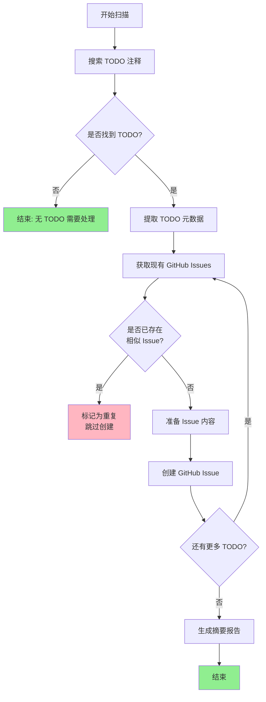
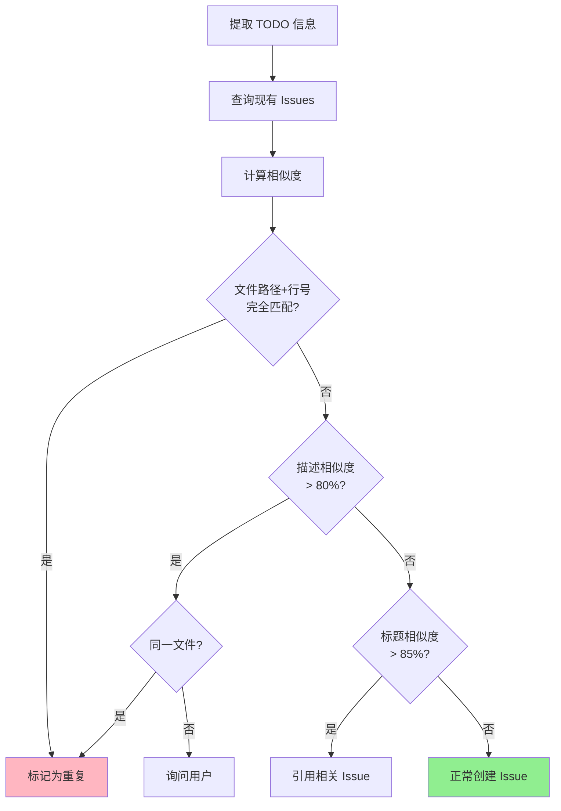

# TODO 到 GitHub Issue 自动化流程

扫描代码库中的 TODO 注释，智能去重后创建结构化的 GitHub Issues。

## 何时使用本 Skill

- 新接手项目，需要了解技术债务状况
- 定期扫描和同步 TODO 到项目管理工具
- 代码审计时记录待办事项
- 为即将发布的版本创建任务清单

## 前置条件

- GitHub CLI (`gh`) 已安装并登录
- 仓库有写入 Issue 的权限
- 代码库存在 TODO/FIXME/XXX/HACK 等注释

---

## 核心流程图



---

## 第一阶段：探索 TODO

### 1.1 搜索模式

**必须搜索的注释类型：**

| 类型     | 模式                   | 优先级 | 说明           |
| -------- | ---------------------- | ------ | -------------- |
| TODO     | `TODO`, `todo`, `Todo` | 高     | 待办事项       |
| FIXME    | `FIXME`, `fixme`       | 高     | 需要修复的问题 |
| XXX      | `XXX`, `xxx`           | 中     | 需要注意的代码 |
| HACK     | `HACK`, `hack`         | 中     | 临时解决方案   |
| BUG      | `BUG`, `bug`           | 高     | 已知缺陷       |
| OPTIMIZE | `OPTIMIZE`, `optimize` | 低     | 性能优化建议   |

**搜索范围：**

- 源代码文件：`.ts`, `.tsx`, `.js`, `.vue`, `.py`, `.java`, `.go`, `.rs`
- 配置文件：`.json`, `.yml`, `.yaml`, `.toml`
- 文档：`.md`（仅限代码块内的 TODO）
- **排除**：`node_modules/`, `dist/`, `.git/`, `*.min.js`, 第三方库

### 1.2 并行搜索策略

使用多个 explore agent 并行搜索：

```
Agent 1: 搜索 src/ 目录下的 TODO/FIXME
Agent 2: 搜索 main/ 和 renderer/ 目录
Agent 3: 搜索 docs/ 和 scripts/ 目录
Agent 4: 分析 GitHub 仓库结构和现有 Issues
```

### 1.3 提取 TODO 元数据

对每个找到的 TODO，提取以下信息：

```typescript
interface TodoItem {
  // 位置信息
  filePath: string // 文件路径（相对于仓库根目录）
  lineNumber: number // 行号
  column?: number // 列号（可选）

  // 内容信息
  originalText: string // 原始注释文本
  description: string // TODO 描述（清理后的）
  context: string // 上下文代码（前后5行）

  // 分类信息
  type: 'TODO' | 'FIXME' | 'XXX' | 'HACK' | 'BUG' | 'OPTIMIZE'
  category: 'feature' | 'bugfix' | 'refactor' | 'docs' | 'performance'
  priority: 'critical' | 'high' | 'medium' | 'low'

  // GitHub Issue 相关
  suggestedTitle: string
  suggestedLabels: string[]
  suggestedAssignees?: string[]
}
```

### 1.4 分类规则

**按注释类型分类：**

```
FIXME/BUG -> category: 'bugfix', priority: 'high'
TODO + "实现" -> category: 'feature', priority: 'medium'
TODO + "优化" -> category: 'performance', priority: 'low'
XXX -> category: 'refactor', priority: 'medium'
HACK -> category: 'refactor', priority: 'high'
```

**按文件路径分类：**

```
src/renderer/... -> label: 'renderer'
src/main/... -> label: 'main'
src/common/... -> label: 'common'
tests/... -> label: 'tests'
docs/... -> label: 'documentation'
```

---

## 第二阶段：重复检测（关键步骤）

### 2.1 必须执行：获取现有 Issues

**在创建任何 Issue 之前，必须先检查是否已存在相似的 Issue。**

```bash
# 获取所有开放的 issues
gh issue list --repo <owner>/<repo> --state open --limit 100 --json number,title,body,labels

# 按标签过滤
gh issue list --repo <owner>/<repo> --label enhancement --state open
gh issue list --repo <owner>/<repo> --label bug --state open
```

### 2.2 重复检测算法

**检测维度（按优先级排序）：**

1. **文件路径 + 行号完全匹配** → 100% 重复
2. **文件路径匹配 + 描述相似度 > 80%** → 高度疑似重复
3. **描述相似度 > 90%** → 疑似重复（不同文件可能相同问题）
4. **标题相似度 > 85%** → 可能重复

**相似度计算方法：**

```typescript
// 使用 Levenshtein 距离或 Jaccard 相似度
function calculateSimilarity(str1: string, str2: string): number {
  // 归一化：去除空格、标点、转换为小写
  const normalize = (s: string) => s.toLowerCase().replace(/[\s\p{P}]/gu, '')

  const a = normalize(str1)
  const b = normalize(str2)

  // 计算相似度 (0-1)
  return similarityScore(a, b)
}
```

### 2.3 重复处理策略

| 相似度 | 策略     | 操作                                   |
| ------ | -------- | -------------------------------------- |
| 100%   | 完全重复 | 跳过创建，记录日志                     |
| 80-99% | 高度疑似 | 检查是否同一行，是则跳过；否则询问用户 |
| 50-79% | 可能相关 | 在新 Issue 中引用相关 Issue            |
| <50%   | 不相关   | 正常创建                               |

### 2.4 重复检测流程图



---

## 第三阶段：创建 GitHub Issues

### 3.1 Issue 标题格式

遵循仓库现有的 Issue 命名规范：

```
[类型] 简短描述 - 文件路径:行号

示例：
- [代码规范] 制定 ESLint 规则修复计划 - .eslintrc.cjs:76
- [关键功能] 实现 MCP 客户端调用 - src/utils/plugin.ts:138
- [UI 功能] 实现搜索结果滚动定位 - src/components/Search.vue:42
```

**类型标签：**

- `[关键功能]` - 核心功能缺失，会抛出错误或返回占位符
- `[新功能]` - 新增功能开发
- `[功能增强]` - 现有功能改进
- `[功能扩展]` - 功能范围扩展
- `[功能优化]` - 性能或体验优化
- `[代码规范]` - 代码风格、lint 规则
- `[架构改进]` - 架构层面优化
- `[UI 功能]` - 界面相关
- `[UI 配置]` - 配置选项
- `[兼容性]` - 跨平台/环境兼容
- `[Bug修复]` - 修复已知问题

### 3.2 Issue 正文模板

````markdown
## 代码位置

- 文件: `{{filePath}}`
- 行号: 第 {{lineNumber}} 行

## TODO 描述

`{{originalText}}`

## 背景说明

{{contextDescription}}

## 建议实现思路

{{implementationIdeas}}

## 相关标签

{{suggestedLabels}}

## 代码上下文

```{{language}}
{{contextCode}}
```
````

````

### 3.3 Agent 身份披露（强制）

**所有通过 `gh` 命令创建的 Issues、评论和关闭操作，必须在正文末尾添加以下免责声明：**

```
（本条消息由 Agent 发布，也许是幻觉请仔细甄别）
```

**获取当前登录用户：**
```bash
gh api user -q '.login'
```

**示例（创建 Issue）：**
```bash
gh issue create \
  --repo <owner>/<repo> \
  --title "[类型] 描述 - 文件路径:行号" \
  --body $'正文内容\n\n（本条消息由 Agent 发布，也许是幻觉请仔细甄别）' \
  --label "enhancement"
```

**示例（添加评论）：**
```bash
gh issue comment <number> --repo <owner>/<repo> \
  --body $'评论内容\n\n（本条消息由 Agent 发布，也许是幻觉请仔细甄别）'
```

### 3.4 创建命令

```bash
gh issue create \
  --repo <owner>/<repo> \
  --title "[类型] 描述 - 文件路径:行号" \
  --body "..." \
  --label "enhancement" \
  --label "bug" \
  # 可选: --assignee <username>
````

---

## 第四阶段：摘要报告

创建完成后，生成结构化报告：

```markdown
## 📊 TODO Issue 创建报告

### 统计信息

- 扫描文件数: {{scannedFiles}}
- 发现 TODO 数: {{foundTodos}}
- 已存在 Issue: {{existingIssues}}
- 新创建 Issue: {{createdIssues}}
- 跳过（重复）: {{skippedDuplicates}}

### 创建的 Issues

| Issue # | 标题                       | 优先级 | URL    |
| ------- | -------------------------- | ------ | ------ |
| #8      | [代码规范] ESLint 规则修复 | 中     | [链接] |
| #12     | [关键功能] MCP 客户端实现  | 高     | [链接] |

### 按模块分布

- Agent Framework: 4 issues
- Export Adapters: 2 issues
- UI Components: 3 issues

### 下一步建议

1. 优先处理标记为"关键功能"的 Issues
2. 考虑创建 `refactor` 和 `tech-debt` 标签
3. 设置自动化 TODO 扫描（CI/CD）
```

---

## 完整执行清单

### 执行前检查

- [ ] GitHub CLI (`gh`) 已安装
- [ ] 已登录：`gh auth status` 显示已登录
- [ ] 有仓库访问权限：`gh repo view <owner>/<repo>`
- [ ] 了解现有标签：`gh label list`

### Phase 1: 探索

- [ ] 启动多个 explore agent 并行搜索
- [ ] 搜索 TODO/FIXME/XXX/HACK/BUG/OPTIMIZE
- [ ] 提取元数据（文件、行号、描述、上下文）
- [ ] 分类和优先级标记

### Phase 2: 重复检测 ⭐关键

- [ ] **必须执行**: 获取所有现有 open issues
- [ ] 对每个 TODO，检查是否已存在相似 Issue
- [ ] 计算相似度（文件路径、描述、标题）
- [ ] 标记重复项，记录跳过原因

### Phase 3: 创建

- [ ] 准备 Issue 标题（遵循仓库规范）
- [ ] 准备 Issue 正文（包含代码位置、描述、实现思路）
- [ ] **在正文末尾添加 Agent 免责声明**：`（本条消息由 Agent 发布，也许是幻觉请仔细甄别）`
- [ ] 获取当前 GitHub 用户：`gh api user -q '.login'`
- [ ] 选择合适的标签
- [ ] 执行 `gh issue create` 命令（确保包含免责声明）
- [ ] 验证创建成功（获取 Issue URL）

### Phase 4: 报告

- [ ] 统计创建结果
- [ ] 生成摘要报告
- [ ] 提供下一步建议

---

## 注意事项

### ⚠️ 重要提醒

1. **重复检测是强制步骤** - 不要在没有检查的情况下创建 Issue
2. **遵循现有规范** - Issue 标题和标签要符合仓库风格
3. **包含完整上下文** - Issue 正文要有足够信息供开发者理解
4. **保护敏感信息** - 如果 TODO 包含敏感内容，脱敏后创建 Issue
5. **Agent 身份披露** - 所有创建的 Issues 和评论必须包含免责声明：`（本条消息由 Agent 发布，也许是幻觉请仔细甄别）`

### 常见错误

- ❌ 不检查现有 Issues 直接创建 → 产生重复
- ❌ 忽略代码上下文 → Issue 难以理解
- ❌ 使用英文标题在中文仓库 → 风格不一致
- ❌ 不标记优先级 → 无法区分轻重缓急

### 进阶用法

**添加自定义标签：**

```bash
# 创建 tech-debt 标签
gh label create tech-debt --color "cccccc" --description "Technical debt items"

# 创建 refactor 标签
gh label create refactor --color "a0c4ff" --description "Code refactoring tasks"
```

**批量创建后更新：**

```bash
# 为新创建的 issues 添加里程碑
gh issue edit <number> --milestone "v1.2.0"
```

---

## 参考实现

本 Skill 的使用示例：

```
用户: 扫描代码库中的所有 TODO 并创建 GitHub Issues

你:
1. 使用本 Skill 的流程
2. 启动 explore agents 搜索 TODO
3. 获取现有 Issues 检查重复
4. 创建新 Issues（跳过重复）
5. 生成摘要报告
```
