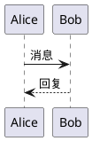

# 手册文档检查

## 概述

MetaDoc 在构建前会自动检查所有手册文档，确保其中的 PlantUML、Mermaid 图表语法正确，以及 Demo 组件配置正确。

## 检查内容

### 1. PlantUML 图表语法检查

检查项目：

- ✅ 是否包含 `@startuml` 开始标记
- ✅ 是否包含 `@enduml` 结束标记
- ✅ 标记顺序是否正确（`@startuml` 必须在 `@enduml` 之前）
- ✅ 是否只有一个 `@startuml` 和 `@enduml`
- ✅ 箭头语法是否正确

### 2. Mermaid 图表语法检查

检查项目：

- ✅ 图表类型是否有效（graph、flowchart、sequenceDiagram 等）
- ✅ graph 类型是否有方向声明（TD、LR、TB 等）
- ✅ 括号是否匹配（方括号、圆括号、花括号）

### 3. Demo 组件检查

检查项目：

- ⚠️ 组件是否设置了 `mode` 属性（警告级别，不阻断构建）

## 使用方法

### 运行所有检查

```bash
npm run lint
```

这会同时运行代码检查（ESLint）和手册文档检查。

### 单独运行手册文档检查

```bash
npm run lint:manuals
```

### 自动修复代码格式

```bash
npm run format
```

### 检查代码格式（不自动修复）

```bash
npm run format:check
```

## 构建前强制检查

在运行 `npm run build` 或任何构建命令之前，系统会自动执行：

1. `npm run format:check` - 检查代码格式
2. `npm run lint` - 运行代码和文档检查

如果任何检查失败，构建将被终止。

## 错误输出格式

当检查发现问题时，会输出以下格式的错误信息：

```
╔═══════════════════════════════════════════════════════════════
║ ❌ 文档检查错误
╠═══════════════════════════════════════════════════════════════
║ 文件: src/renderer/src/manuals/zh_CN/charts/plantuml.md:14
║ 类型: PlantUML 语法错误
║ 错误: PlantUML 图表 #1 缺少 @startuml 开始标记
╠═══════════════════════════════════════════════════════════════
║ 上下文:
║   Alice -> Bob: 消息
╚═══════════════════════════════════════════════════════════════
```

## 常见问题

### Q: 构建时提示手册文档检查失败怎么办？

A: 根据错误提示修复文档中的图表语法错误，然后重新运行构建命令。

### Q: 可以跳过手册文档检查吗？

A: **不建议跳过**。如果确实需要临时跳过（仅限开发调试），可以运行：

```bash
npm run temp-build
```

但请注意，这不会运行任何检查，可能导致构建包含错误的文档。

### Q: 如何添加新的图表类型支持？

A: 编辑 `scripts/lint-manuals.js` 文件，在 `checkMermaid` 函数的 `validTypes` 数组中添加新的图表类型。

### Q: 检查脚本在哪里？

A: 检查脚本位于 `scripts/lint-manuals.js`。

## CI/CD 集成

在持续集成环境中，建议添加以下步骤：

```yaml
# GitHub Actions 示例
- name: Check Code Format
  run: npm run format:check

- name: Lint Code and Manuals
  run: npm run lint

- name: Build
  run: npm run build
```

## 技术细节

### 支持的 Mermaid 图表类型

- `graph` / `flowchart` - 流程图
- `sequenceDiagram` - 序列图
- `classDiagram` - 类图
- `stateDiagram` - 状态图
- `erDiagram` - 实体关系图
- `gantt` - 甘特图
- `pie` - 饼图
- `gitgraph` - Git 图
- `journey` - 用户旅程图
- `mindmap` - 思维导图
- `timeline` - 时间线

### PlantUML 必需标记

所有 PlantUML 图表必须包含：

- `@startuml` - 图表开始
- `@enduml` - 图表结束

示例：


