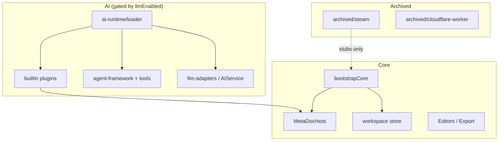

# 模块清单：Core / AI / Archived

本文档按**开源默认构建**所需程度对主要模块分类。判断标准：

- **Core** — 无 LLM 亦可编辑、导出、管理文档与窗口
- **AI** — 依赖 `llmEnabled` 或 `loadAiRuntime()`，可通过插件卸载
- **Archived** — 已移出 `meta-doc/`，不参与 OSS 默认构建

---

## Core（核心）

### 主进程 `src/main/`

| 模块 | 路径 | 说明 |
|------|------|------|
| IPC 中枢 | `main-calls.ts` | Electron `handle` 注册（历史单体，新功能宜拆分） |
| 窗口 / 标签 | `window-manager.ts`, `drag-manager.ts` | 多窗口与跨窗拖拽 |
| 导出服务 | `export/` | 服务端 DOCX / PDF 等 |
| 数据库 | `database/` | SQLite + sqlite-vec |
| 工具服务 | `utils/`（非 legacy） | OCR、拼写、LaTeX 等 |
| Express | `express-server.ts` | 单实例与外部控制（已去除 legacy 副本） |
| Steam 桩 | `steam/*.stub.ts` | 空实现，保持 import 可解析 |

### 渲染进程 `src/renderer/src/`

| 模块 | 路径 | 说明 |
|------|------|------|
| 启动 | `main.js`, `core/bootstrap.ts` | Vue 挂载与核心初始化 |
| Host 层 | `host-api/`, `core/host-runtime.ts`, `core/plugin-loader.ts` | 插件与贡献点基础设施 |
| 状态 | `stores/workspace.ts`, `stores/document.ts`, … | Pinia |
| 编辑器 | `views/MarkdownEditor.vue`, `LaTeXEditor.vue`, `editor/` | Monaco + Vditor |
| 工作区 UI | `components/workspace/`, `views/Main.vue` | 标签、侧栏、文档视图容器 |
| 导出 | `services/export-adapters/` | 客户端导出策略 |
| 主题 / i18n | `utils/themes.js`, `locales/` | 深浅色与多语言 |
| 设置（非 LLM 专节） | `views/setting/SettingBasicSection.vue` 等 | 基础、主题、关于等 |

### 共享与资源

| 模块 | 路径 |
|------|------|
| 公共常量 | `src/common/`（无 `steam-*`，已归档） |
| 预加载 | `src/preload/` |
| 用户手册 | `src/renderer/src/manuals/` |
| 内部文档 | `docs/`（除已迁云的 `cloud/`） |

---

## AI（可延迟加载）

以下模块在 `llmEnabled === false` 时不应阻塞首屏；由 `ai-runtime/loader.ts` 统一门控。

| 模块 | 路径 | 加载时机 |
|------|------|----------|
| AI 运行时加载器 | `ai-runtime/loader.ts` | `syncAiRuntimeWithSettings()` |
| 内置 AI 插件 | `plugins/builtin/*` | `loadBuiltinPlugins()` |
| Agent 框架 | `utils/agent-framework/` | `initializeAgentTools()` |
| Agent 工具 | `utils/agent-tools/` | 同上 |
| LLM 适配器 | `utils/llm-adapters/` | AIService / createAiTask |
| AI 任务 | `utils/ai_tasks.ts` | `attachLlmHost` |
| AI 服务 | `services/AIService.ts` | LLM 可用性检测 |
| RAG | 主进程 RAG + `KnowledgeBase.vue` | knowledge-rag 插件 |
| AI 相关视图 | `AgentView.vue`, `ProofreadView.vue`, `AIChat.vue` 等 | 插件 `registerDocumentView` / 事件 |
| LLM 设置 | `views/setting/SettingLlmSection.vue` | 始终可访问；切换触发 `ai-runtime-toggle` |
| Prompt | `utils/prompts.ts`, `locale_prompts/` | Agent / 补全 |

### 内置插件 ID 一览

见 [06-BUILTIN-PLUGIN-MATRIX.md](./06-BUILTIN-PLUGIN-MATRIX.md)。

---

## Archived（已归档）

位于仓库根 `archived/`，原路径见 [02-CLEANUP-LOG.md](./02-CLEANUP-LOG.md) 与 [03-ARCHIVE-GUIDE.md](./03-ARCHIVE-GUIDE.md)。

| 类别 | `archived/` 路径 | 原 `meta-doc` 位置 |
|------|------------------|-------------------|
| Cloudflare Worker | `cloudflare-worker/` | `meta-doc/cloudflare-worker/` |
| Steam 主进程 | `steam/main/` | `src/main/steam/`（非 stub） |
| Steam 渲染端 | `steam/renderer/` | 托盘、云文档、MTX、Workshop 等 |
| Steam 公共定义 | `steam/common/` | `src/common/steam-*.ts` |
| Steam 第三方 SDK | `steam/third-party/` | `third-party/steam-*` |
| Steam 构建 / CI | `electron-builder.steam.yml`, `ci/` | 根 workflows |
| 云与定价文档 | `docs/cloud/`, `docs/RELEASE_AND_STEAM.md` | `meta-doc/docs/cloud/` 等 |

### 已从树中删除（非归档）

| 项 | 说明 |
|----|------|
| `capacitor.config.ts` | Android Capacitor 配置移除 |
| `db/init_table.sql` | 根级 DB 初始化脚本 |
| `meta-doc/scripts/*`（部分） | 一次性补丁 / 验证脚本 |
| `express-server-legacy.ts`, `rag-service-legacy.ts`, `legacy-exports.js` | 主进程 legacy 副本 |
| `agent-framework/docs/*` | 开发期 Agent 实现笔记（12 篇） |

---

## 依赖关系简图

---

## 分类维护约定

1. 新增 **Steam / 官方云 / MTX** 代码 → 放 `archived/` 或私有 fork，不在 `meta-doc/src` 增加 Greenworks 引用。
2. 新增 **AI 功能入口** → 优先新建 `plugins/builtin/<feature>.ts`，避免直接改 `LeftMenu.vue` 硬编码。
3. 新增 **文档编辑 / 导出** 能力 → Core，不得依赖 `host.llm`。
