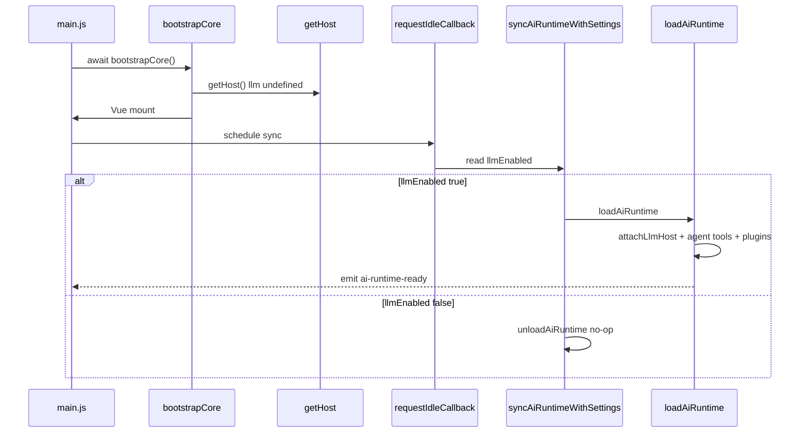

# AI 延迟加载（`llmEnabled`）

用户关闭 LLM 时，渲染进程**不**加载 Agent 工具链、不挂载 `LlmHost`、不激活内置 AI 插件，以降低启动内存与 bundle 执行成本。

---

## 设置项

| 键 | 默认值 | 说明 |
|----|--------|------|
| `llmEnabled` | `false` | 是否启用 AI 功能总开关 |

定义于 [`utils/settings.js`](../../src/renderer/src/utils/settings.js)。UI：`SettingLlmSection.vue`、引导流程 `OnboardingLlmPanel.vue`。

---

## 启动时序



### 代码路径

**1. 核心先启动** — [`main.js`](../../src/renderer/src/main.js)

```javascript
await bootstrapCore()
// idle 或 setTimeout 后：
void syncAiRuntimeWithSettings()
```

**2. 同步设置** — [`ai-runtime/loader.ts`](../../src/renderer/src/ai-runtime/loader.ts)

```typescript
export async function syncAiRuntimeWithSettings(): Promise<void> {
  const enabled = (await getSetting('llmEnabled')) === true
  if (enabled) {
    await loadAiRuntime()
  } else {
    await unloadAiRuntime()
  }
}
```

**3. 加载 AI 栈** — `loadAiRuntime()`

- 动态 `import` `ai_tasks`、`AIService`
- `attachLlmHost({ isAvailable, createTask })`
- `initializeAgentTools()`
- `loadBuiltinPlugins(builtinPluginLoaders)`
- `eventBus.emit('ai-runtime-ready')`

**4. 卸载** — `unloadAiRuntime()`

- `clearAiTasks()`
- `deactivateAllPlugins()` + `clearPluginContributions()`
- `attachLlmHost(undefined)`
- `eventBus.emit('ai-runtime-unloaded')`

---

## 运行时切换

用户在设置中切换 LLM 开关时：

```typescript
// SettingLlmSection.vue
setSetting('llmEnabled', enabled)
eventBus.emit('ai-runtime-toggle')
```

[`registerAiRuntimeToggleListener()`](../../src/renderer/src/ai-runtime/loader.ts) 在 `main.js` 启动时注册，收到事件后再次调用 `syncAiRuntimeWithSettings()`。

---

## UI 门控

| 位置 | 门控方式 |
|------|----------|
| `Main.vue` shell overlays | `aiRuntimeReady` + `isAiRuntimeLoaded()` |
| `WorkspaceDocumentViews.vue` | 插件 document views 仅在 `isAiRuntimeLoaded()` 时渲染 |
| `SettingLlmSection.vue` | LLM 配置网格 `v-if="settings.llmEnabled"` |
| `host.settings.isLlmEnabled()` | 插件内异步查询 |
| `host.llm` | 未加载时为 `undefined` |

`Main.vue` 监听：

```typescript
eventBus.on('ai-runtime-ready', () => { aiRuntimeReady.value = true })
eventBus.on('ai-runtime-unloaded', () => { aiRuntimeReady.value = false })
```

---

## 与 AIService 的关系

`AIService.isLLMAvailable()` 同时检查 `llmEnabled` 与是否已选择 LLM 配置。即使运行时已加载，未配置 API 时 `host.llm.isAvailable()` 仍为 `false`。

插件应：

```typescript
if (!(await host.settings.isLlmEnabled())) return
if (!(await host.llm?.isAvailable())) {
  // 提示用户配置 LLM
  return
}
```

---

## `isAiRuntimeActive` / `isAiRuntimeLoaded`

| 函数 | 位置 | 含义 |
|------|------|------|
| `isAiRuntimeLoaded()` | `ai-runtime/loader.ts` | 是否已完成 `loadAiRuntime` |
| `isAiRuntimeActive()` | `host-runtime.ts` | `llmHost != null` |

二者在正常运行时应一致；测试时可分别 mock。

---

## 默认关闭的意义

1. **开源用户** — 可无 API Key 使用文档编辑与导出
2. **合规 / 离线** — 明确 opt-in 后再发起外网 LLM 请求
3. **性能** — 避免首屏拉取 agent-tools、大型 Vue 视图注册

---

## 调试

```javascript
// 渲染进程控制台
import { loadAiRuntime, syncAiRuntimeWithSettings } from './ai-runtime/loader'
await loadAiRuntime()
// 或强制同步设置
await syncAiRuntimeWithSettings()
```

监听：

```javascript
eventBus.on('ai-runtime-ready', () => console.log('AI ready'))
eventBus.on('ai-runtime-unloaded', () => console.log('AI unloaded'))
```

---

## 相关文档

- [06-BUILTIN-PLUGIN-MATRIX.md](./06-BUILTIN-PLUGIN-MATRIX.md) — 哪些 UI 依赖 AI 运行时
- [04-HOST-API-SPEC.md](./04-HOST-API-SPEC.md) — `LlmHost` 与 `SettingsHost`
