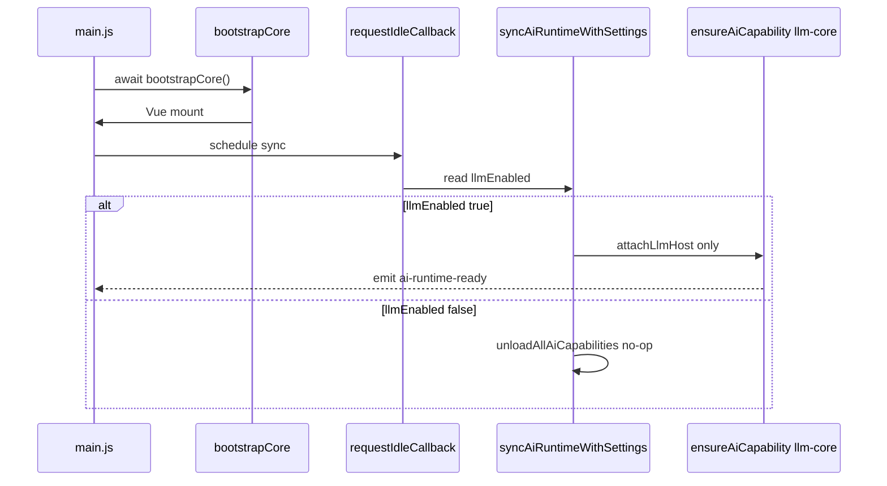

# AI 延迟加载（`llmEnabled` + Capability 按需）

用户关闭 LLM 时，渲染进程**不**加载 Agent 工具链、不挂载 `LlmHost`、不激活内置 AI 插件，以降低启动内存与 bundle 执行成本。

开启 `llmEnabled` 后仅加载 **`llm-core`**（LLM 设置 + `AIService` 连通性 + 最小 `LlmHost`）。Agent、RAG、校对、补全、工具窗等在各功能**首次入口**时通过 `ensureAiCapability(id)` 加载。

---

## 设置项

| 键 | 默认值 | 说明 |
|----|--------|------|
| `llmEnabled` | `false` | 是否启用 AI 功能总开关 |

定义于 [`utils/settings.js`](../../src/renderer/src/utils/settings.js)。UI：`SettingLlmSection.vue`、引导流程 `OnboardingLlmPanel.vue`。

---

## Capability 分层

| Capability ID | 加载内容 | 首次触发入口 |
|---------------|----------|--------------|
| `llm-core` | `AIService` + `attachLlmHost`；**不**调用 `initializeAgentTools` | `syncAiRuntimeWithSettings`（`llmEnabled=true`）；打开设置 LLM 分区 |
| `agent` | `metadoc.builtin.agent` + `shell-overlays` + `initializeAgentTools` | 左菜单 Agent / `switch-document-view` agent |
| `rag` | `metadoc.builtin.knowledge-rag`；主进程 `rag:ensure-ready` | 知识库 Tab / `open-knowledge-base` |
| `completion` | `metadoc.builtin.completion` | 启用自动补全 / 首次触发补全 |
| `editor-ai` | section-optimizer、translate、outline-ai、proofread、ai-chat | 右键 AI / 大纲 AI / 校对视图 |
| `tool-windows` | `metadoc.builtin.tool-windows` | OCR、数据分析等工具 Tab |

核心 API — [`ai-runtime/loader.ts`](../../src/renderer/src/ai-runtime/loader.ts) / [`ai-runtime/capabilities/`](../../src/renderer/src/ai-runtime/capabilities/)：

```typescript
export async function ensureAiCapability(id: AiCapabilityId): Promise<void>
export function isAiCapabilityLoaded(id: AiCapabilityId): boolean
export async function syncAiRuntimeWithSettings(): Promise<void> {
  // llmEnabled=true  → ensureAiCapability('llm-core') only
  // llmEnabled=false → unloadAllAiCapabilities()
}
```

入口 UX 包装 — [`ai-runtime/ensure-for-entry.ts`](../../src/renderer/src/ai-runtime/ensure-for-entry.ts)：`ensureAiCapabilityWithFeedback`。

事件：`ai-capability-loaded` / `ai-capability-unloaded`（payload: capability id）；`ai-runtime-ready` 在 `llm-core` 加载后发出（兼容旧监听）。

---

## 启动时序



### 代码路径

**1. 核心先启动** — [`main.js`](../../src/renderer/src/main.js)

```javascript
await bootstrapCore()
void syncAiRuntimeWithSettings()
```

**2. 同步设置** — `syncAiRuntimeWithSettings()` 仅 `ensureAiCapability('llm-core')` 或 `unloadAllAiCapabilities()`。

**3. 冷启动去静态 import** — [`tab-content-config.ts`](../../src/renderer/src/config/tab-content-config.ts) 使用 `defineAsyncComponent`；`App.vue` / `Setting.vue` / `BottomMenu.vue` / `LaTeXEditor.vue` 避免顶层 `ai_tasks` / Agent store。

**4. 卸载** — `unloadAllAiCapabilities()`：按 capability 反序 deactivate 插件、`clearAiTasks`、`attachLlmHost(undefined)`、`clearPluginContributions()`。

---

## 运行时切换

```typescript
// SettingLlmSection.vue — 开启
await setSetting('llmEnabled', true)
await ensureAiCapability('llm-core')

// 关闭
eventBus.emit('ai-runtime-toggle') // → syncAiRuntimeWithSettings → 全量卸载
```

---

## UI 门控

| 位置 | 门控方式 |
|------|----------|
| `Main.vue` shell overlays | `aiRuntimeReady` + agent capability（`shell-overlays` 插件） |
| `WorkspaceDocumentViews.vue` | 插件 document views 在对应 capability 加载后注册 |
| `SettingLlmSection.vue` | 懒加载 chunk + `ensureAiCapability('llm-core')` |
| `BottomMenu.vue` AI 任务数 | 仅 `isAiCapabilityLoaded('agent')` 时订阅 `useAiTasks` |
| `host.llm` | 未加载 `llm-core` 时为 `undefined` |

---

## `isAiRuntimeLoaded` 语义

`isAiRuntimeLoaded()` === `isAiCapabilityLoaded('llm-core')`。插件左菜单/设置分区在对应 capability 激活后才出现在 `pluginRegistry`。

---

## 主进程 RAG

向量库不在启动时初始化。渲染进程 `ensureAiCapability('rag')` 调用 IPC `rag:ensure-ready` → `ensureUtilsInitialized()`。

---

## E2E

[`e2e/run-oss-gate.mjs`](../../e2e/run-oss-gate.mjs)：

1. 默认无 AI 运行时
2. `llmEnabled=true` → 仅 `llm-core`，无 agent 插件
3. `ensureAgentCapability` → agent 插件激活
4. 关闭 LLM → 贡献清零

[`core/e2e-hooks.ts`](../../src/renderer/src/core/e2e-hooks.ts) 快照含 `loadedCapabilities`。

---

## 调试

```javascript
import { ensureAiCapability, getLoadedAiCapabilities } from './ai-runtime/loader'
await ensureAiCapability('agent')
console.log(getLoadedAiCapabilities())
```

---

## 相关文档

- [06-BUILTIN-PLUGIN-MATRIX.md](./06-BUILTIN-PLUGIN-MATRIX.md)
- [04-HOST-API-SPEC.md](./04-HOST-API-SPEC.md)
