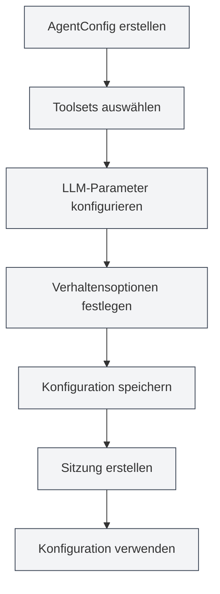

# Agent-Konfigurationsverwaltung

## Übersicht

Die Agent-Konfiguration (AgentConfig) ist eine Kernkomponente des Agent-Frameworks und dient zur Definition der Identität und des Fähigkeitsbereichs eines Agents. Jede AgentConfig ist mit einer Gruppe von Toolsets verknüpft, die bestimmen, welche Tools der Agent verwenden kann, und ermöglicht die Konfiguration von LLM-Parametern und Verhaltensoptionen.

Durch den Mechanismus der Toolset-Schnittmenge steuert die AgentConfig flexibel den Fähigkeitsbereich des Agents und ermöglicht es Ihnen, spezielle Agent-Konfigurationen für verschiedene Szenarien zu erstellen.

<AgentView mode="demo" />

## Kernkonzepte

### AgentConfig-Struktur

Eine AgentConfig umfasst folgende Hauptteile:

- **Grundinformationen**: ID, Name, Beschreibung, Versionsnummer
- **Toolset-Verknüpfung**: Liste der verknüpften Toolset-IDs (Schnittmenge)
- **LLM-Konfiguration**: Modell, Temperatur, maximale Token-Anzahl, System-Prompt usw.
- **Verhaltenskonfiguration**: Ob Tool-Aufrufe erlaubt sind, maximale Aufrufanzahl usw.
- **Szenariotyp**: outline, editor, analysis, visualization, custom

### Toolset-Schnittmenge

Wenn eine AgentConfig mit mehreren Toolsets verknüpft ist, sind die verfügbaren Tools die Schnittmenge aller Toolsets:

- Toolset A enthält: `[tool1, tool2, tool3]`
- Toolset B enthält: `[tool2, tool3, tool4]`
- Verfügbare Tools für AgentConfig: `[tool2, tool3]`

Dieser Mechanismus ermöglicht eine präzise Kontrolle des Fähigkeitsbereichs des Agents.

<AgentConfigManager mode="demo" />

## AgentConfig erstellen

### Neue Konfiguration erstellen

Schritte zum Erstellen einer AgentConfig:

1. **Agent-Verwaltung öffnen**: In der Agent-Ansicht auf "Verwalten" → "Agent-Konfiguration" klicken
2. **Konfiguration erstellen**: Auf die Schaltfläche "Neue Konfiguration" klicken
3. **Grundinformationen ausfüllen**:
   - Name: Name der Konfiguration (mehrsprachig unterstützt)
   - Beschreibung: Beschreibung der Konfiguration (mehrsprachig unterstützt)
4. **Toolsets auswählen**: Ein oder mehrere Toolsets aus der Dropdown-Liste auswählen
5. **LLM konfigurieren** (optional):
   - System-Prompt: Benutzerdefinierter System-Prompt
   - Zeitstempel einfügen: Ob der aktuelle Zeitstempel in den System-Prompt eingefügt werden soll
6. **Verhalten festlegen** (optional):
   - Maximale Tool-Aufrufe: Begrenzt die Anzahl der Tool-Aufrufe des Agents (null bedeutet unbegrenzt)
7. **Konfiguration speichern**: Auf die Schaltfläche "Speichern" klicken

<AgentView mode="demo" />

Sie können über die Seitenleiste auf die Agent-Ansicht zugreifen:

### Standardkonfiguration

Das System stellt eine Standard-AgentConfig (`default-agent-config`) bereit, die alle integrierten Tools enthält. Sie kann nicht gelöscht, aber kopiert werden.

## AgentConfig bearbeiten

### Bearbeitungsvorgang

Vorhandene AgentConfig bearbeiten:

1. **Verwaltungsoberfläche öffnen**: In der Agent-Konfigurationsverwaltung die zu bearbeitende Konfiguration finden
2. **Bearbeiten klicken**: Auf die Schaltfläche "Bearbeiten" auf der Konfigurationskarte klicken
3. **Konfiguration ändern**: Name, Beschreibung, Toolsets, LLM-Konfiguration oder Verhaltenskonfiguration ändern
4. **Änderungen speichern**: Auf die Schaltfläche "Speichern" klicken

**Hinweis**: Die Standardkonfiguration (`default-agent-config`) kann nicht bearbeitet, aber kopiert und dann bearbeitet werden.

<AgentConfigManager mode="demo" />

## AgentConfig löschen

### Löschvorgang

Nicht benötigte AgentConfig löschen:

1. **Verwaltungsoberfläche öffnen**: In der Agent-Konfigurationsverwaltung die zu löschende Konfiguration finden
2. **Löschen klicken**: Auf die Schaltfläche "Löschen" auf der Konfigurationskarte klicken
3. **Löschen bestätigen**: Im daraufhin erscheinenden Bestätigungsdialog das Löschen bestätigen

<AgentConfigManager mode="demo" />

**Hinweis**:

- Die Standardkonfiguration (`default-agent-config`) kann nicht gelöscht werden.
- Das Löschen einer Konfiguration beeinflusst nicht bereits erstellte Sitzungen, aber neue Sitzungen können diese Konfiguration nicht mehr verwenden.
- Falls die Konfiguration von einer Sitzung verwendet wird, erfolgt vor dem Löschen eine Warnung.

## AgentConfig kopieren

### Kopiervorgang

Vorhandene AgentConfig kopieren:

1. **Verwaltungsoberfläche öffnen**: In der Agent-Konfigurationsverwaltung die zu kopierende Konfiguration finden
2. **Kopieren klicken**: Auf die Schaltfläche "Kopieren" auf der Konfigurationskarte klicken
3. **Kopie bearbeiten**: Das System erstellt eine Kopie, deren Name automatisch das Suffix " (Kopie)" erhält
4. **Änderungen speichern**: Die Kopie nach Bedarf ändern und speichern

<AgentView mode="demo" />

Das Kopieren einer Konfiguration übernimmt alle Einstellungen, einschließlich Toolset-Verknüpfungen, LLM-Konfiguration und Verhaltenskonfiguration.

## AgentConfig importieren/exportieren

### Konfiguration exportieren

AgentConfig als JSON-Datei exportieren:

1. **Verwaltungsoberfläche öffnen**: In der Agent-Konfigurationsverwaltung die zu exportierende Konfiguration finden
2. **Exportieren klicken**: Auf die Schaltfläche "Exportieren" auf der Konfigurationskarte klicken
3. **Speicherort wählen**: Speicherort und Dateiname auswählen
4. **Datei speichern**: Klicken, um die Konfiguration zu exportieren und zu speichern

Die exportierte JSON-Datei enthält alle Informationen der Konfiguration und kann für Backups oder zum Teilen verwendet werden.

<AgentConfigManager mode="demo" />

### Konfiguration importieren

AgentConfig aus einer JSON-Datei importieren:

1. **Verwaltungsoberfläche öffnen**: In der Agent-Konfigurationsverwaltung
2. **Importieren klicken**: Auf die Schaltfläche "Konfiguration importieren" klicken
3. **Datei auswählen**: Die zu importierende JSON-Datei auswählen
4. **Daten validieren**: Das System überprüft das Dateiformat und den Inhalt
5. **Konfiguration importieren**: Nach erfolgreichem Import wird eine neue Konfiguration erstellt

Die importierte Konfiguration erhält eine neue ID und überschreibt keine vorhandene Konfiguration (es sei denn, der Überschreibmodus wird verwendet).

## LLM-Konfiguration

### System-Prompt

Die AgentConfig kann einen benutzerdefinierten System-Prompt konfigurieren:

- **Standard-Prompt**: Wenn nicht gesetzt, wird der Standard-System-Prompt des Agent-Frameworks verwendet
- **Benutzerdefinierter Prompt**: Ein spezieller System-Prompt kann gesetzt werden, um die Rolle und das Verhalten des Agents zu definieren
- **Zeitstempel-Einfügung**: Es kann gewählt werden, ob der aktuelle Zeitstempel in den System-Prompt eingefügt werden soll

### LLM-Parameter

Die AgentConfig kann die globalen LLM-Einstellungen überschreiben:

- **Modell**: Gibt das zu verwendende LLM-Modell an
- **Temperatur**: Steuert die Zufälligkeit der Ausgabe (0-2)
- **Maximale Token-Anzahl**: Begrenzt die maximale Token-Anzahl pro Aufruf

**Hinweis**: Wenn die AgentConfig keine LLM-Parameter gesetzt hat, werden die globalen LLM-Einstellungen verwendet.

<AgentConfigManager mode="demo" />

## Verhaltenskonfiguration

### Tool-Aufrufsteuerung

Die AgentConfig kann das Tool-Aufrufverhalten steuern:

- **Tool-Aufrufe erlauben**: Ob der Agent Tools aufrufen darf (standardmäßig erlaubt)
- **Maximale Tool-Aufrufe**: Begrenzt die maximale Anzahl von Tool-Aufrufen pro Aufgabe (null bedeutet unbegrenzt)
- **Workflow-Aufrufe erlauben**: Ob der Agent Workflows aufrufen darf (standardmäßig erlaubt)

### Anwendungsszenarien

Verschiedene Verhaltenskonfigurationen eignen sich für unterschiedliche Szenarien:

- **Reines Dialogszenario**: Tool-Aufrufe deaktivieren, nur Dialog führen
- **Begrenztes Tool-Szenario**: Tool-Aufrufe begrenzen, um übermäßige Aufrufe zu vermeiden
- **Vollfunktionsszenario**: Alle Tool-Aufrufe erlauben, unbegrenzt

<AgentConfigManager mode="demo" />

## Szenariotypen

Die AgentConfig kann einen Szenariotyp festlegen, der zur Kategorisierung und Verwaltung dient:

- **outline**: Gliederungsszenario, für auf Dokumentstruktur bezogene Aufgaben
- **editor**: Editorszenario, für Dokumentbearbeitungsaufgaben
- **analysis**: Analysenszenario, für Dokumentanalyseaufgaben
- **visualization**: Visualisierungsszenario, für Diagrammerstellungsaufgaben
- **custom**: Benutzerdefiniertes Szenario

Der Szenariotyp dient hauptsächlich der Kategorisierung und beeinflusst nicht das tatsächliche Verhalten des Agents.

## Anwendungstipps

### Konfigurationsorganisation

1. **Namenskonvention**: Klare Namen verwenden, wie "Datenanalyse-Agent", "Dokumentenbearbeitungs-Agent"
2. **Szenariokategorisierung**: Szenariotypen zur kategorisierten Verwaltung nutzen
3. **Toolset-Auswahl**: Passende Toolset-Kombinationen basierend auf den Aufgabenanforderungen auswählen

<AgentConfigManager mode="demo" />

### Toolset-Schnittmenge

1. **Präzise Steuerung**: Die Schnittmenge mehrerer Toolsets nutzen, um die Fähigkeiten des Agents präzise zu steuern
2. **Toolset-Design**: Spezielle Toolsets entwerfen und dann durch Schnittmengen kombinieren
3. **Test und Validierung**: Nach Erstellung der Konfiguration testen, ob die Toolset-Schnittmenge korrekt ist

<AgentConfigManager mode="demo" />

### LLM-Konfiguration

1. **System-Prompt**: Spezielle System-Prompts für verschiedene Szenarien schreiben
2. **Parameteroptimierung**: Temperatur und maximale Token-Anzahl basierend auf den Aufgabenmerkmalen anpassen
3. **Zeitstempel-Einfügung**: Für zeitabhängige Aufgaben die Zeitstempel-Einfügung aktivieren

## Häufig gestellte Fragen

### F: Wie erstelle ich eine spezielle Agent-Konfiguration?

A: Erstellen Sie eine neue Konfiguration, wählen Sie spezielle Toolsets aus und legen Sie einen benutzerdefinierten System-Prompt sowie Verhaltenskonfigurationen fest. Zum Beispiel: Erstellen Sie einen "Datenanalyse-Agent", verknüpfen Sie ihn mit Datenanalyse-Toolsets und setzen Sie einen speziellen System-Prompt.

### F: Was bedeutet Toolset-Schnittmenge?

A: Wenn eine AgentConfig mit mehreren Toolsets verknüpft ist, sind die verfügbaren Tools die Schnittmenge aller Toolsets. Beispiel: Toolset A enthält `[tool1, tool2, tool3]`, Toolset B enthält `[tool2, tool3, tool4]`, dann sind die verfügbaren Tools für die AgentConfig `[tool2, tool3]`.

### F: Kann ich die Standardkonfiguration ändern?

A: Die Standardkonfiguration (`default-agent-config`) kann nicht bearbeitet, aber kopiert und dann bearbeitet werden. Kopieren Sie die Standardkonfiguration und ändern Sie die Kopie.

### F: Wie verhalten sich LLM-Konfiguration und globale Konfiguration zueinander?

A: Wenn die AgentConfig LLM-Parameter gesetzt hat, werden diese verwendet; andernfalls werden die globalen LLM-Einstellungen verwendet. Die Einstellungen der AgentConfig haben höhere Priorität.

### F: Wie begrenze ich die Anzahl der Tool-Aufrufe eines Agents?

A: In der Verhaltenskonfiguration der AgentConfig die "Maximale Tool-Aufrufe" setzen. Auf eine bestimmte Zahl (z.B. 10) setzen, um die Aufrufe zu begrenzen, oder auf null setzen für unbegrenzt.

### F: Beeinflusst das Löschen einer Konfiguration bestehende Sitzungen?

A: Das Löschen einer Konfiguration beeinflusst nicht bereits erstellte Sitzungen, aber neue Sitzungen können diese Konfiguration nicht mehr verwenden. Falls die Konfiguration von einer Sitzung verwendet wird, erfolgt vor dem Löschen eine Warnung.

<AgentView mode="demo" />

## Verwandte Dokumentation

- [[agent.introduction|Agent-Framework-Übersicht]]
- [[agent.tools|Toolset-Verwaltung]]
- [[agent.session|Agent-Sitzungsverwaltung]]
- [[agent.engine|Agent-Engine-Verwaltung]]
