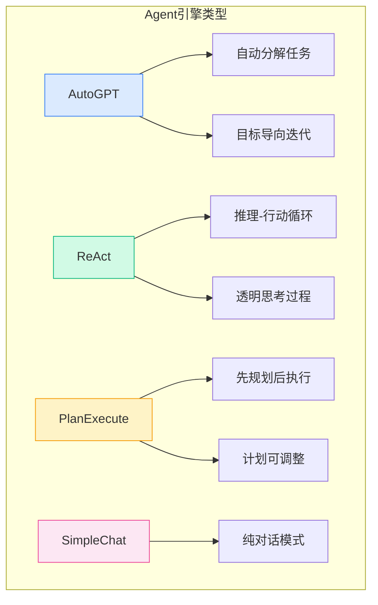
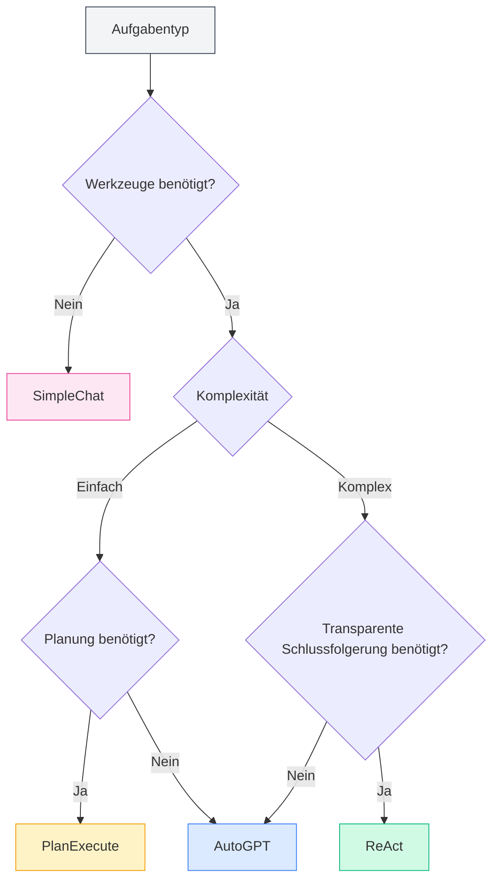
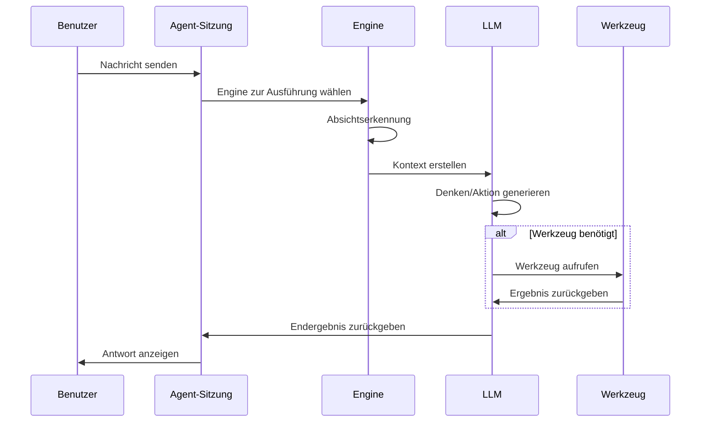

# Agent-Engine-Management

## Übersicht

Die Agent-Engine definiert die Ausführungsstrategie und das Verhalten eines Agents. MetaDoc bietet mehrere integrierte Engines, die jeweils unterschiedliche KI-Ausführungsparadigmen verwenden und für verschiedene Aufgabenszenarien geeignet sind. Durch die Auswahl einer geeigneten Engine können Sie den Agenten auf die für die spezifische Aufgabe am besten geeignete Weise arbeiten lassen.

<AgentView mode="demo" />

## Engine-Typen

MetaDoc unterstützt die folgenden Agent-Engines:

| Engine-Name    | Merkmale                     | Geeignete Szenarien      |
| -------------- | ---------------------------- | ------------------------ |
| **AutoGPT**    | Automatische Aufgabenzerlegung, zielorientierte Iteration | Komplexe, mehrstufige Aufgaben |
| **ReAct**      | Reasoning-Action-Zyklus, transparenter Denkprozess | Aufgaben, die detaillierte Schlussfolgerungen erfordern |
| **PlanExecute**| Erst planen, dann ausführen, Plan anpassbar | Strukturierte Aufgaben   |
| **SimpleChat** | Reiner Dialog, keine Tool-Aufrufe | Einfache Frage-Antwort   |



## Engine-Details

### AutoGPT-Engine

**Merkmale**:

- **Automatische Aufgabenzerlegung**: Zerlegt komplexe Aufgaben automatisch in Teilaufgaben
- **Zielorientiert**: Iterative Ausführung rund um das Endziel
- **Autonome Entscheidungsfindung**: Der Agent entscheidet autonom über die nächste Aktion

<AgentView mode="demo" />
<AgentEngineManager mode="demo" />

**Geeignete Szenarien**:

- Recherche und Informationsbeschaffung
- Mehrstufige Dokumentenverarbeitung
- Offene kreative Aufgaben

**Beispiel**:

```
Benutzer: Hilf mir, einen Übersichtsartikel über künstliche Intelligenz zu schreiben
Agent: [Automatisch zerlegt in: 1. Material sammeln 2. Gliederung erstellen 3. Inhalt verfassen 4. Überarbeiten und polieren]
```

### ReAct-Engine

**Merkmale**:

- **Reasoning-Action-Zyklus**: Zeigt den Denkprozess (Reasoning) und die Aktion (Action) explizit an
- **Nachvollziehbar**: Jeder Schritt hat eine klare Begründung
- **Transparent und steuerbar**: Benutzer können die Logik des Agenten nachvollziehen

<AgentView mode="demo" />
<AgentEngineManager mode="demo" />

**Geeignete Szenarien**:

- Aufgaben, die eine Erklärung des Schlussfolgerungsprozesses erfordern
- Logische Analyseaufgaben
- Lehr- und Demonstrationsszenarien

**Beispiel**:

```
Denken: Der Benutzer möchte, dass ich die Funktion dieses Codes erkläre
Aktion: Code-Analyse-Tool aufrufen
Beobachtung: [Tool gibt Ergebnis zurück]
Denken: Basierend auf dem Analyseergebnis kann ich erklären...
```

### PlanExecute-Engine

**Merkmale**:

- **Erst planen, dann ausführen**: Zuerst einen vollständigen Plan erstellen, dann gemäß Plan ausführen
- **Plan anpassbar**: Der Plan kann während der Ausführung angepasst werden
- **Strukturierte Ausgabe**: Ausgabeformat ist standardisiert und leicht verständlich

<AgentView mode="demo" />
<AgentEngineManager mode="demo" />

**Geeignete Szenarien**:

- Projektmanagement-Aufgaben
- Strukturierte Dokumentenerstellung
- Prozessorientierte Arbeiten

**Beispiel**:

```
Plan:
1. Anforderungen analysieren
2. Lösung entwerfen
3. Funktion implementieren
4. Testen und validieren

Ausführung: Jede Phase Schritt für Schritt abschließen
```

### SimpleChat-Engine

**Merkmale**:

- **Reiner Dialogmodus**: Führt nur Dialoge, ruft keine Tools auf
- **Schnelle Reaktion**: Kein Warten auf Tool-Ausführung
- **Einfach und direkt**: Geeignet für einfache Frage-Antwort

**Geeignete Szenarien**:

- Allgemeine Frage-Antwort
- Konzept-Erklärungen
- Einfache Gespräche

**Hinweis**: Diese Engine ruft keine Tools auf und kann daher keine Dateioperationen, Datenanalysen usw. durchführen.

<AgentEngineManager mode="demo" />

## Engine-Auswahl

### Wie wählt man die passende Engine?

Wählen Sie die Engine basierend auf den Aufgabenmerkmalen:



<AgentView mode="demo" />

### Auswahl-Empfehlungen

| Aufgabenszenario | Empfohlene Engine           |
| ---------------- | --------------------------- |
| Alltägliche Fragen | SimpleChat                 |
| Dokumentenbearbeitung | AutoGPT oder ReAct      |
| Datenanalyse     | ReAct oder PlanExecute      |
| Code-Erstellung  | ReAct                       |
| Recherche        | AutoGPT                     |
| Projektmanagement| PlanExecute                 |

<AgentView mode="demo" />

## Engine-Konfiguration

### Engine in der Agent-Konfiguration auswählen

1. Gehen Sie zu [[agent.config|Agent-Konfigurationsverwaltung]]
2. Erstellen oder bearbeiten Sie eine Agent-Konfiguration
3. Wählen Sie den gewünschten Engine-Typ unter der Option "Engine"
4. Speichern Sie die Konfiguration

### Engine-Parameter-Einstellungen

Verschiedene Engines können spezifische Parameter haben:

**Allgemeine Parameter**:

- **Maximale Iterationen**: Begrenzt die Anzahl der Denk- und Aktionszyklen des Agenten
- **Timeout**: Maximale Wartezeit für einen einzelnen Aufruf
- **Temperatur**: Steuert den Kreativitätsgrad der Ausgabe

**Engine-spezifische Parameter**:

- **AutoGPT**: Tiefe der Zielzerlegung
- **ReAct**: Anzeigeoptionen für den Denkprozess
- **PlanExecute**: Berechtigungen zur Plananpassung

## Engine-Ausführungsablauf

### Allgemeiner Ausführungsablauf



### Ausführungsmerkmale verschiedener Engines

**AutoGPT-Ausführungsmerkmale**:

1. Benutzerziel analysieren
2. Automatisch in Teilaufgaben zerlegen
3. Teilaufgaben nacheinander ausführen
4. Ergebnisse zusammenfassen und zurückgeben

**ReAct-Ausführungsmerkmale**:

1. Denkprozess generieren
2. Nächste Aktion bestimmen
3. Aktion ausführen (Tool aufrufen oder Antwort generieren)
4. Ergebnis beobachten
5. Zyklus wiederholen, bis Aufgabe erledigt ist

**PlanExecute-Ausführungsmerkmale**:

1. Anforderungen analysieren
2. Vollständigen Plan erstellen
3. Schrittweise ausführen
4. Strukturiertes Ergebnis zurückgeben

## Benutzerdefinierte Engines

### Engine-Konfiguration anpassen

Fortgeschrittene Benutzer können das Engine-Verhalten anpassen:

1. **System-Prompt anpassen**: Rolle und Verhalten des Agenten anpassen
2. **Tool-Präferenzen festlegen**: Bevorzugt zu verwendende Tools angeben
3. **Inferenzparameter anpassen**: Temperatur, maximale Token-Anzahl usw.

### Benutzerdefinierte Engine erstellen (Fortgeschritten)

Entwickler können neue Engine-Typen erstellen:

1. Grundlegende Engine-Schnittstelle erweitern
2. Spezifische Ausführungslogik implementieren
3. Beim Engine-Manager registrieren
4. In der Konfiguration zur Verwendung auswählen

## Best Practices

### Prinzipien der Engine-Auswahl

1. **Mit Einfachem beginnen**: Bei Unsicherheit zuerst mit SimpleChat testen
2. **Nach Komplexität wählen**: Komplexe Aufgaben mit AutoGPT oder ReAct bearbeiten
3. **Erklärbarkeit berücksichtigen**: Bei Erklärungsbedarf ReAct verwenden

### Engine-Leistung optimieren

1. **Anforderungen klar beschreiben**: Die Leistung der Engine hängt stark von der Klarheit der Eingabe ab
2. **Tools sinnvoll einsetzen**: Dem Agenten einen geeigneten Tool-Satz konfigurieren
3. **Angemessene Grenzen setzen**: Kosten durch Parameter wie maximale Iterationen kontrollieren
4. **Zeitiges Feedback geben**: Antworten des Agenten bewerten, um Verbesserungen zu unterstützen

## Häufig gestellte Fragen

### F: Warum führt der Agent die Aufgabe nicht wie erwartet aus?

A: Mögliche Gründe:

- Ungeeignete Engine-Auswahl
- Unzureichende Tool-Satz-Konfiguration
- Unklare Aufgabenbeschreibung
- Maximale Iterationsgrenze erreicht

### F: Kann ich während eines Gesprächs die Engine wechseln?

A: Derzeit wird das Wechseln der Engine innerhalb einer einzelnen Sitzung nicht unterstützt. Um die Engine zu wechseln, wird empfohlen:

1. Aktuelle Sitzung beenden
2. Neue Sitzung erstellen
3. Agent-Konfiguration mit anderer Engine auswählen

### F: Welche Engine ist für Anfänger am besten geeignet?

A: Empfehlung:

- Zuerst SimpleChat verwenden, um sich mit der Dialogfunktion vertraut zu machen
- Dann ReAct ausprobieren, um den Schlussfolgerungsprozess zu beobachten
- Nach Einarbeitung AutoGPT für komplexe Aufgaben verwenden

### F: Beeinflusst die Engine die Antwortqualität?

A: Ja. Unterschiedliche Engines haben unterschiedliche Denkweisen und Ausführungsstrategien:

- Dieselbe Aufgabe kann von verschiedenen Engines unterschiedlich beantwortet werden
- Die Wahl der richtigen Engine kann die Ergebnisse deutlich verbessern
- Es wird empfohlen, für verschiedene Aufgabentypen unterschiedliche Agenten zu konfigurieren

## Verwandte Dokumente

- [[agent.introduction|Agent-Framework-Übersicht]]
- [[agent.config|Agent-Konfigurationsverwaltung]]
- [[agent.session|Agent-Sitzungsverwaltung]]
- [[agent.tools|Tool-Satz-Verwaltung]]