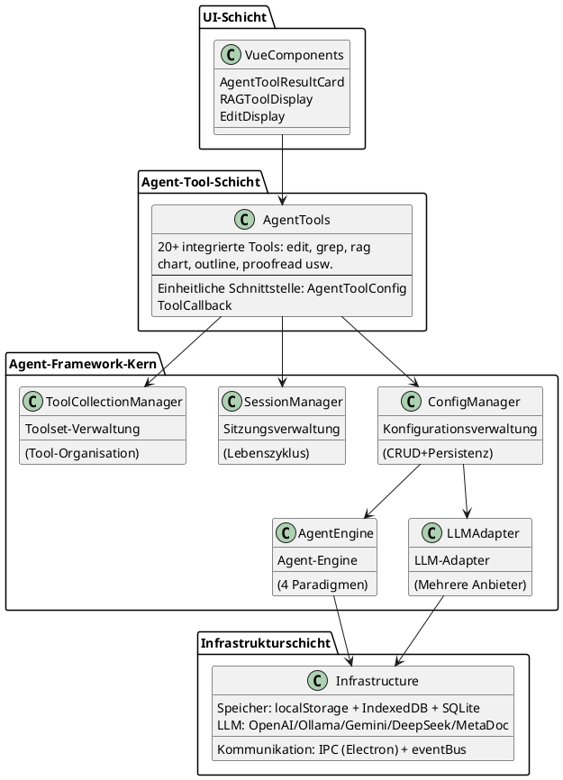
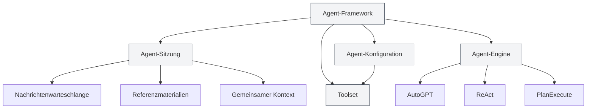
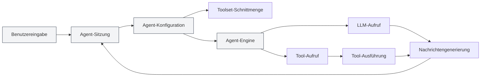
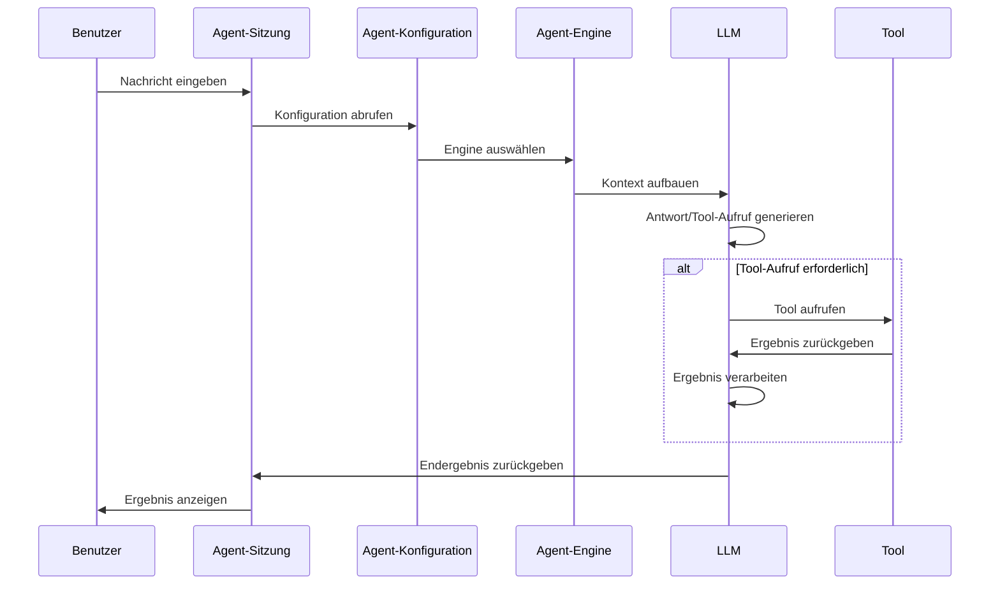

# Agent-Framework-Übersicht

## Übersicht

Das Agent-Framework ist das Kernframework in MetaDoc zum Aufbau und zur Verwaltung intelligenter Agent-Systeme und verwendet ein **geschichtetes Architekturdesign**. Es bietet ein vollständiges Lebenszyklusmanagement für Agents, einschließlich Funktionen wie Sitzungsverwaltung, Konfigurationsverwaltung, Toolset-Management und Engine-Management.

Das Agent-Framework baut auf dem bestehenden Tool-System auf und realisiert durch Kernkomponenten wie Agent-Konfiguration (AgentConfig), Toolsets (ToolCollection) und Agent-Sitzungen (AgentSession) ein flexibles und erweiterbares Agent-System.

<AgentSessionManager mode="demo" />

## Oberflächenvorschau

Das Agent-Framework bietet eine intuitive Oberfläche zur Verwaltung von Agent-Sitzungen und Tools:

<AgentView mode="demo" />

## Technische Architektur

### Architekturschichten



### Kern-Dateipfade

| Kategorie         | Dateipfad                                                              | Erläuterung                     |
| ----------------- | ---------------------------------------------------------------------- | ------------------------------- |
| **Typdefinitionen** | `src/renderer/src/types/agent-framework.ts`                            | Kern-Typdefinitionen des Agent-Frameworks |
| **Typdefinitionen** | `src/renderer/src/types/agent-tool.ts`                                 | Agent-Tool-Typdefinitionen      |
| **Konfigurationsverwaltung** | `src/renderer/src/utils/agent-framework/agent-config-manager.ts`       | CRUD und Persistenz von AgentConfig |
| **Sitzungsverwaltung** | `src/renderer/src/utils/agent-framework/agent-session-manager.ts`      | Lebenszyklusverwaltung von AgentSession |
| **Toolset-Verwaltung** | `src/renderer/src/utils/agent-framework/tool-collection-manager.ts`    | Organisation und Verwaltung von Toolsets |
| **Engine-Verwaltung** | `src/renderer/src/utils/agent-framework/agent-engine-manager.ts`       | Agent-Engine-Konfigurationsverwaltung |
| **Engine-Ausführung** | `src/renderer/src/utils/agent-framework/agent-engine-executor.ts`      | Implementierung der 4 Ausführungsparadigmen |
| **Tool-Ausführung** | `src/renderer/src/utils/agent-framework/tool-runner.ts`                | Einheitlicher Tool-Aufrufeinstieg |
| **LLM-Adapter**   | `src/renderer/src/utils/agent-framework/llm-adapter.ts`                | Adapter für mehrere LLM-Anbieter |



## Kernkonzepte

### Agent-Sitzung (AgentSession)

<AgentView mode="demo" />

Eine Agent-Sitzung ist eine Instanz einer AgentConfig und repräsentiert eine unabhängige, kontextbezogene Agent-Ausführungsumgebung. Implementiert auf Basis von `agent-session-manager.ts`, verwaltet jede Sitzung ihre eigene Nachrichtenhistorie, Referenzmaterialien, gemeinsamen Kontextraum und unterstützt erweiterte Funktionen wie Nachrichtenwarteschlange, Wiederholung, Duplicate usw.

**Typdefinition** (`types/agent-framework.ts` Zeilen 387-424):

```typescript
export interface AgentSession {
  entityType: 'agent-session'
  id: string
  title: string
  agentConfigId: string // Zugehörige AgentConfig
  messages: AgentMessage[] // Nachrichtenhistorie
  messageQueue: QueuedMessage[] // Nachrichtenwarteschlange
  referenceStore: Reference[] // Referenzmaterialien
  publicContext: PublicContext // Gemeinsamer Kontext
  executionNodes: ExecutionNode[] // Ausführungsknoten (für Wiederholung)
  status: AgentSessionStatus // Sitzungsstatus
}
```

**Sitzungsstatusmaschine**:

```
idle → thinking → generating → tool-calling → waiting-input → error
```

Details siehe [[agent.session|Agent-Sitzungsverwaltung]].

### Agent-Konfiguration (AgentConfig)

<CompletionSettingsPanel mode="demo" />

AgentConfig definiert die Identität und Fähigkeiten eines Agents, implementiert auf Basis von `agent-config-manager.ts`.

**Typdefinition** (`types/agent-framework.ts` Zeilen 242-289):

```typescript
export interface AgentConfig {
  entityType: 'agent-config'
  id: string
  name: LocalizedText // Name mit i18n-Unterstützung
  description: LocalizedText // Beschreibung mit i18n-Unterstützung
  toolCollectionIds: string[] // Zugehörige Toolset-IDs (Schnittmenge)
  maxToolCalls?: number | null // Maximale Anzahl Tool-Aufrufe
  llmConfig?: {
    model?: string
    temperature?: number
    systemPrompt?: string // System-Prompt
    injectTimestamp?: boolean
  }
  behavior?: {
    allowToolCalls?: boolean
  }
  scenario?: 'outline' | 'editor' | 'analysis' | 'visualization' | 'custom'
}
```

**Kernfunktionen**:

- **Standardkonfiguration**: `default-agent-config` (integriert, nicht löschbar)
- **Toolset-Schnittmenge**: Bei Verknüpfung mehrerer Toolsets sind die verfügbaren Tools die Schnittmenge aller Toolsets
- **LLM-Parameterüberschreibung**: Globale LLM-Konfiguration kann überschrieben werden
- **Persistenz**: Gespeichert in `localStorage`, Schlüssel `'agent-configs'`

Agent-bezogene Verwaltung ist im **Agent-Ansicht**-Menü gebündelt. Lesen Sie zuerst [[agent.tools|Toolset-Verwaltung]] und [[agent.capabilities|Regeln, Skills & MCP-Verwaltung]]. (Der eigenständige Indexeintrag „Agent-Konfiguration“ wurde entfernt; der Artikel bleibt als Referenz.)

### Toolset (ToolCollection)

<DataAnalysisDisplay mode="demo" />

Ein Toolset ist eine Sammlung von Agent-Tools zur Organisation und Verwaltung der für einen Agent verfügbaren Tools. Eine AgentConfig kann mit mehreren Toolsets verknüpft sein, die verfügbaren Tools sind die Schnittmenge aller verknüpften Toolsets.

Details siehe [[agent.tools|Toolset-Verwaltung]].

### Referenzmaterialien (Reference)

<RAGToolDisplay mode="demo" />

Referenzmaterialien sind Dokumente und Dateien, auf die in einer Agent-Sitzung verwiesen wird. Der Agent kann diese Inhalte wahrnehmen und darauf basierend schlussfolgern und agieren. Unterstützt werden verschiedene Referenztypen wie Dateien, URLs, Wissensdatenbanken usw.

Referenzen werden in Sitzungen genutzt und verwaltet; siehe [[agent.session|Agent-Sitzungsverwaltung]]. (Der eigenständige Eintrag „Referenzmaterialien“ wurde aus dem Index entfernt.)

### Agent-Engine (AgentEngine)

<DiffDisplay mode="demo" />

Die Agent-Engine definiert die Ausführungsstrategie und das Verhalten eines Agents, einschließlich verschiedener Paradigmen wie AutoGPT, ReAct, PlanExecute usw. Unterschiedliche Engines eignen sich für verschiedene Aufgaben-Szenarien.

Ausführungsparadigmen werden aus Sitzungskontext gewählt; siehe [[agent.session|Agent-Sitzungsverwaltung]]. (Der eigenständige Eintrag „Agent-Engine“ wurde aus dem Index entfernt.)

## Systemarchitektur

Die Systemarchitektur des Agent-Frameworks ist wie folgt:



## Ausführungsablauf

Der grundlegende Ausführungsablauf eines Agents:

1. **Benutzereingabe**: Der Benutzer gibt eine Nachricht in die Agent-Sitzung ein.
2. **Absichtserkennung**: Das System erkennt die Benutzerabsicht und aktualisiert die verfügbaren Tool-Beschreibungen.
3. **Engine-Auswahl**: Auswahl der Ausführungs-Engine basierend auf der Agent-Konfiguration.
4. **Kontextaufbau**: Aufbau eines Kontexts, der Nachrichtenhistorie, Referenzmaterialien und Tool-Beschreibungen enthält.
5. **LLM-Aufruf**: Aufruf des LLM zur Generierung einer Antwort oder eines Tool-Aufrufs.
6. **Tool-Ausführung**: Falls das LLM einen Tool-Aufruf entscheidet, wird das entsprechende Tool ausgeführt.
7. **Ergebnisverarbeitung**: Das Tool-Ausführungsergebnis wird als Beobachtung (Observation) an das LLM zurückgegeben.
8. **Iterationsschleife**: Je nach Engine-Typ können mehrere Iterationsrunden erfolgen, bis die Aufgabe abgeschlossen ist.
9. **Ergebnisausgabe**: Das Endergebnis wird dem Benutzer angezeigt.



## Funktionen

### Kernfunktionen

- **Sitzungsverwaltung**: Sitzungen erstellen, löschen, duplizieren, exportieren/importieren
- **Konfigurationsverwaltung**: Flexible Agent-Konfiguration, Unterstützung für Toolset-Schnittmengen
- **Toolset-Verwaltung**: Organisation und Verwaltung von Agent-Tools
- **Referenzmaterialien-Verwaltung**: Verwaltung von Referenzdokumenten und -dateien in Sitzungen
- **Engine-Verwaltung**: Unterstützung mehrerer Ausführungsparadigmen, anpassbare Engines

### Erweiterte Funktionen

- **Nachrichtenwarteschlange**: Einfügen von Nachrichten während der Agent-Ausführung
- **Wiederholungsmechanismus**: Unterstützung für die Wiederholung fehlgeschlagener Ausführungsknoten
- **Duplicate-Funktion**: Duplizieren von Sitzungen oder Ausführungsknoten
- **Gemeinsamer Kontext**: Sitzungsweiter gemeinsamer Kontextraum
- **Ausführungsknoten-Verfolgung**: Protokollierung des Status und der Ergebnisse jedes Ausführungsknotens

## Anwendungsszenarien

Das Agent-Framework eignet sich für folgende Szenarien:

- **Dokumentenbearbeitung**: Verwenden von Agent-Tools zur Dokumentenbearbeitung und -optimierung
- **Datenanalyse**: Verwenden von Datenanalyse-Tools zur Datenverarbeitung und -visualisierung
- **Inhaltsgenerierung**: Verwenden der Agent-Engine mit Toolsets zur Generierung strukturierter Inhalte
- **Wissensrecherche**: Intelligente Recherche und Analyse in Kombination mit Wissensdatenbanken
- **Automatisierungsaufgaben**: Durchführung mehrstufiger Aufgaben durch Agent und Toolsets

## Schnellstart

Um mit dem Agent-Framework zu beginnen, wird empfohlen, in folgender Reihenfolge zu lernen:

1. [[agent.introduction|Agent-Framework-Übersicht]] (dieses Dokument)
2. [[agent.tools|Toolset-Verwaltung]]: Lernen, wie Toolsets verwaltet werden
3. [[agent.capabilities|Regeln, Skills & MCP-Verwaltung]]: Regeln, Workspace-Skills und MCP
4. [[agent.session|Agent-Sitzungsverwaltung]]: Sitzungen erstellen und verwalten

## Häufig gestellte Fragen

### F: Was ist der Unterschied zwischen dem Agent-Framework und einem KI-Chat?

A: Ein KI-Chat ist eine einfache Chat-Funktion, während das Agent-Framework ein vollständiges Agent-System mit erweiterten Funktionen wie Tool-Aufrufen, Referenzmaterialien-Verwaltung usw. bietet. Das Agent-Framework kann komplexe Aufgaben ausführen, nicht nur chatten.

### F: Wie wähle ich die passende Agent-Engine aus?

A:

- **AutoGPT-Engine**: Geeignet für die meisten intelligenten Aufgaben, starke autonome Entscheidungsfähigkeit
- **ReAct-Engine**: Geeignet für Aufgaben, die detaillierte Denkschritte erfordern, expliziter Denkprozess
- **PlanExecute-Engine**: Geeignet für strukturierte Ausführungsaufgaben, erst planen, dann ausführen
- **SimpleChat-Engine**: Geeignet für reine Dialogaufgaben, keine Tool-Aufrufe

### F: Was bedeutet Toolset-Schnittmenge?

A: Wenn eine AgentConfig mit mehreren Toolsets verknüpft ist, sind die verfügbaren Tools die Schnittmenge aller Toolsets. Beispiel: Toolset A enthält `[tool1, tool2, tool3]`, Toolset B enthält `[tool2, tool3, tool4]`, dann sind die verfügbaren Tools für die AgentConfig `[tool2, tool3]`.

## Verwandte Dokumentation

- [[agent.session|Agent-Sitzungsverwaltung]]
- [[agent.tools|Toolset-Verwaltung]]
- [[agent.capabilities|Regeln, Skills & MCP-Verwaltung]]
- [[ai.llm-config|LLM-Konfiguration]]

<QuickStartPanel mode="demo" />