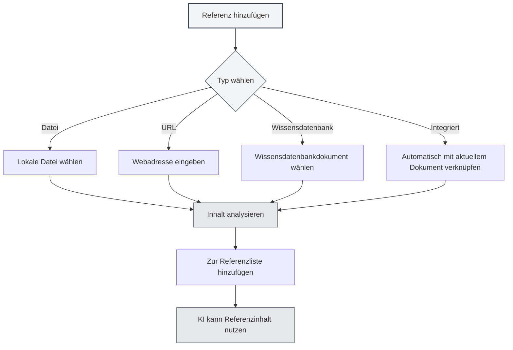

# Referenzmaterialverwaltung

## Übersicht

Referenzmaterial ist eine wichtige Funktion in Agent-Sitzungen, die es Ihnen ermöglicht, externe Dokumente, Webseiten, Dateien und andere Inhalte in das Gespräch einzubringen. Der Agent kann basierend auf diesem Referenzmaterial schlussfolgern und antworten, wodurch die Antworten der KI präziser und relevanter werden.

Mit Referenzmaterial können Sie:

- Die KI auf spezifische Dokumentinhalte verweisen lassen
- Diskussionen basierend auf Webseiteninformationen führen
- Inhalte lokaler Dateien analysieren
- Tiefgehende Fragen und Antworten unter Einbeziehung der Wissensdatenbank durchführen

## Referenzverwaltung öffnen

Klicken Sie in der Agent-Sitzungsoberfläche auf den Tab "Referenzen", um das Verwaltungspanel für Referenzmaterial zu öffnen.

Das Referenzpanel zeigt alle in der aktuellen Sitzung hinzugefügten Referenzmaterialien an, einschließlich:

- Dateiname oder URL
- Referenztyp (Datei/URL/Wissensdatenbank/Integriertes Dokument)
- Aktivierungsstatus
- Inhaltsvorschau

Sie können die Agent-Ansicht über die Seitenleiste aufrufen:

<ReferenceManager mode="demo" />
<ReferenceDisplay mode="demo" />

## Referenzen hinzufügen

### Dateireferenz hinzufügen

Fügen Sie eine lokale Datei als Referenzmaterial hinzu:

1. Klicken Sie im Referenzpanel auf die Schaltfläche "Referenz hinzufügen"
2. Wählen Sie den Typ "Datei"
3. Wählen Sie im Dateiauswahl-Dialog die zu referenzierende Datei aus
4. Bestätigen Sie das Hinzufügen

**Unterstützte Dateiformate**:

- Markdown-Dokumente (.md)
- LaTeX-Dokumente (.tex)
- PDF-Dateien (.pdf)
- Word-Dokumente (.docx)
- Nur-Text-Dateien (.txt)
- Bilddateien (.png, .jpg)

<ReferenceManager mode="demo" />

### URL-Referenz hinzufügen

Referenzieren Sie Webseiteninhalte:

1. Klicken Sie im Referenzpanel auf die Schaltfläche "Referenz hinzufügen"
2. Wählen Sie den Typ "URL"
3. Geben Sie die zu referenzierende Webadresse ein
4. Klicken Sie auf Bestätigen

MetaDoc erfasst automatisch den Webseiteninhalt und fügt ihn als Referenz hinzu.

<ReferenceManager mode="demo" />
<ReferenceDisplay mode="demo" />

### Wissensdatenbank-Referenz hinzufügen

Referenzieren Sie Dokumente aus der Wissensdatenbank:

1. Klicken Sie im Referenzpanel auf die Schaltfläche "Referenz hinzufügen"
2. Wählen Sie den Typ "Wissensdatenbank"
3. Wählen Sie aus der Liste der Wissensdatenbank das zu referenzierende Dokument aus
4. Bestätigen Sie das Hinzufügen

<ReferenceDisplay mode="demo" />

### Integrierte Dokumentreferenz

Jede Agent-Sitzung aktiviert standardmäßig die "Integrierte Dokumentreferenz" (Referenz 0), die dynamisch den Inhalt des aktuell geöffneten Dokuments als Referenzmaterial abruft.



## Referenzen verwalten

### Referenz aktivieren/deaktivieren

Jedes Referenzmaterial kann unabhängig aktiviert oder deaktiviert werden:

- **Aktiviert**: Der referenzierte Inhalt fließt in den Schlussfolgerungsprozess der KI ein
- **Deaktiviert**: Der referenzierte Inhalt wird vorübergehend nicht für Schlussfolgerungen verwendet, bleibt aber in der Liste

Klicken Sie auf den Schalter neben dem Referenzmaterial, um den Status zu wechseln.

<ReferenceDisplay mode="demo" />

### Referenzinhalt vorschauen

Klicken Sie auf ein Referenzmaterial, um dessen Inhalt in der Vorschau zu sehen:

- **Dateireferenz**: Zeigt eine Textvorschau des Dateiinhalts
- **URL-Referenz**: Zeigt den erfassten Webseiteninhalt
- **Wissensdatenbank-Referenz**: Zeigt relevante Ausschnitte aus der Wissensdatenbank
- **Integrierte Referenz**: Zeigt den Inhalt des aktuellen Dokuments

### Referenz löschen

Entfernen Sie nicht mehr benötigte Referenzen aus der Liste:

1. Suchen Sie im Referenzpanel die zu löschende Referenz
2. Klicken Sie auf die Löschen-Schaltfläche (×-Symbol)
3. Bestätigen Sie das Löschen

**Hinweis**: Das Löschen einer Referenz entfernt nur die Referenzbeziehung, nicht die Originaldatei.

<ReferenceManager mode="demo" />

## Rolle von Referenzen im Gespräch

### Referenzbewusstsein

Wenn Sie Referenzen aktivieren, wird der Agent bei seinen Antworten:

1. **Referenzinhalt analysieren**: Die Inhalte der referenzierten Dokumente, Webseiten oder Dateien verstehen
2. **Kontext kombinieren**: Den Referenzinhalt mit dem Gesprächsverlauf verbinden
3. **Antwort generieren**: Basierend auf dem Referenzinhalt präzisere Antworten generieren

### Anwendungsbeispiele

**Szenario 1: Fragen und Antworten basierend auf einem Dokument**

```
Benutzer: [Hat ein technisches Dokument als Referenz hinzugefügt]
Benutzerfrage: Was sind die in diesem Dokument erwähnten Best Practices?
KI: Basierend auf Ihrem referenzierten Dokument umfassen die Best Practices...
```

**Szenario 2: Vergleich mehrerer Dokumente**

```
Benutzer: [Hat zwei wissenschaftliche Arbeiten als Referenzen hinzugefügt]
Benutzerfrage: Vergleichen Sie die Forschungsmethoden dieser beiden Arbeiten
KI: Die erste Arbeit verwendet..., während die zweite Arbeit... einsetzt
```

**Szenario 3: Analyse von Webseiteninhalten**

```
Benutzer: [Hat eine Nachrichtenseite als Referenz hinzugefügt]
Benutzerfrage: Fassen Sie die Hauptpunkte dieses Berichts zusammen
KI: Basierend auf dem Webseiteninhalt berichtet der Artikel hauptsächlich über...
```

## Best Practices

### Effiziente Nutzung von Referenzen

1. **Relevantes Material auswählen**: Fügen Sie nur Referenzen hinzu, die zum aktuellen Thema passen, um Informationsüberlastung zu vermeiden
2. **Anzahl der Referenzen kontrollieren**: Es wird empfohlen, nicht mehr als 5 Referenzen gleichzeitig aktiv zu haben, um die Verarbeitungseffizienz zu gewährleisten
3. **Zeitnah aufräumen**: Löschen Sie nach Gesprächsende nicht mehr benötigte Referenzen, um die Liste übersichtlich zu halten

### Referenzstrategien

1. **Dokumentenanalyse**: Fügen Sie bei der Analyse langer Dokumente eine Dokumentreferenz hinzu und stellen Sie spezifische Fragen
2. **Wissensabfrage**: Nutzen Sie Wissensdatenbank-Referenzen für wissensbasierte Fragen und Antworten
3. **Echtzeitinformationen**: Holen Sie sich über URL-Referenzen aktuelle Webseiteninformationen
4. **Kontextfortführung**: Nutzen Sie die integrierte Referenz, damit die KI das aktuell bearbeitete Dokument versteht

## Anwendungstipps

### Schnelles Hinzufügen

- **Drag & Drop**: Ziehen Sie Dateien direkt in das Referenzpanel
- **Rechtsklick**: Rechtsklicken Sie auf eine Datei oder Webseite und wählen Sie "Zu Referenzen hinzufügen"
- **Tastenkürzel**: Verwenden Sie Tastenkürzel, um das Referenzpanel schnell zu öffnen

<ReferenceManager mode="demo" />

### Referenzkombinationen

Sie können mehrere Referenzen unterschiedlicher Typen gleichzeitig hinzufügen:

- Ein PDF-Dokument + ein Webseitenlink
- Mehrere Wissensdatenbankdokumente
- Lokale Datei + integrierte Dokumentreferenz

Die KI analysiert alle aktivierten Referenzinhalte umfassend.

<ReferenceDisplay mode="demo" />

### Temporäres Deaktivieren

Wenn Sie unsicher sind, ob eine Referenz nützlich ist, können Sie sie zunächst deaktivieren:

1. Beobachten Sie die Antwort der KI ohne diese Referenz
2. Aktivieren Sie dann die Referenz und vergleichen Sie die Antwortunterschiede
3. Entscheiden Sie basierend auf dem Ergebnis, ob sie behalten werden soll

## Häufig gestellte Fragen

### F: Gibt es Größenbeschränkungen für Referenzinhalte?

A: Ja. Sehr große Dateien können gekürzt verarbeitet werden. Empfehlungen:

- Sehr große Dokumente in Kapiteln hinzufügen
- Verwenden Sie die Wissensdatenbank für umfangreiche Dokumente
- Bei langen Dokumenten können zunächst Schlüsselabschnitte extrahiert werden

### F: Warum scheint die KI die hinzugefügte Referenz nicht zu verwenden?

A: Mögliche Gründe:

- Referenz ist nicht aktiviert (Schalterstatus prüfen)
- Referenzinhalt ist für die Frage irrelevant
- Referenzanalyse fehlgeschlagen (Dateiformat prüfen)

### F: Was tun, wenn die URL-Referenz fehlschlägt?

A: Mögliche Gründe:

- Die Webseite erfordert eine Anmeldung
- Die Webseite hat einen Anti-Crawler-Mechanismus
- Netzwerkverbindungsprobleme
  Empfehlung: Speichern Sie den Webseiteninhalt als Datei und fügen Sie diese als Dateireferenz hinzu

### F: Belegen Referenzen Speicherplatz?

A: Referenzen selbst sind nur Verknüpfungen und belegen keinen zusätzlichen Speicherplatz. Die Analyseergebnisse der Referenzen werden jedoch lokal zwischengespeichert.

## Verwandte Dokumentation

- [[agent.session|Agent-Sitzungsverwaltung]]
- [[agent.config|Agent-Konfigurationsverwaltung]]
- [[knowledge-base.usage|Wissensdatenbanknutzung]]
- [[agent.introduction|Agent-Framework-Übersicht]]