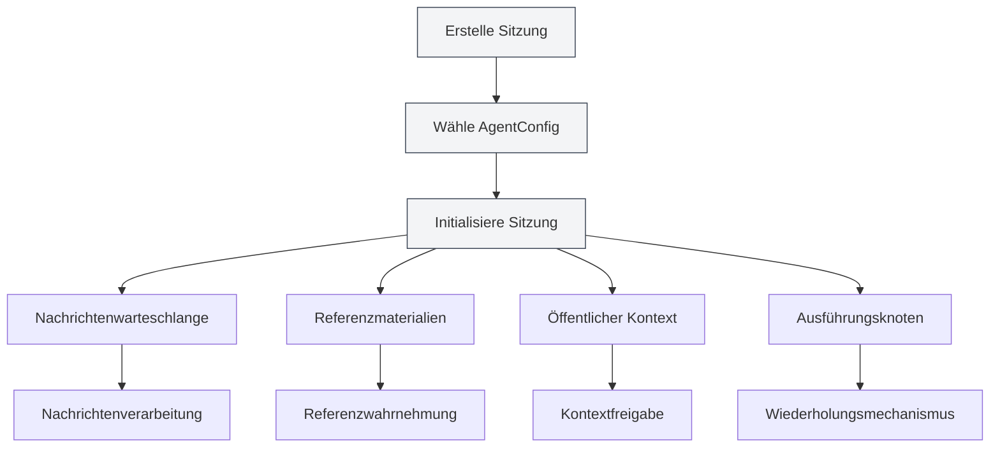
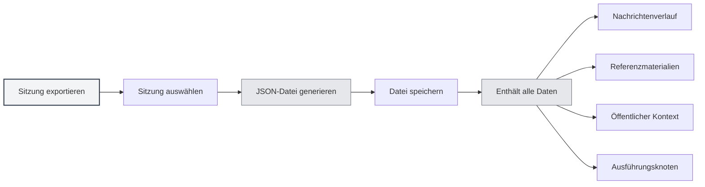
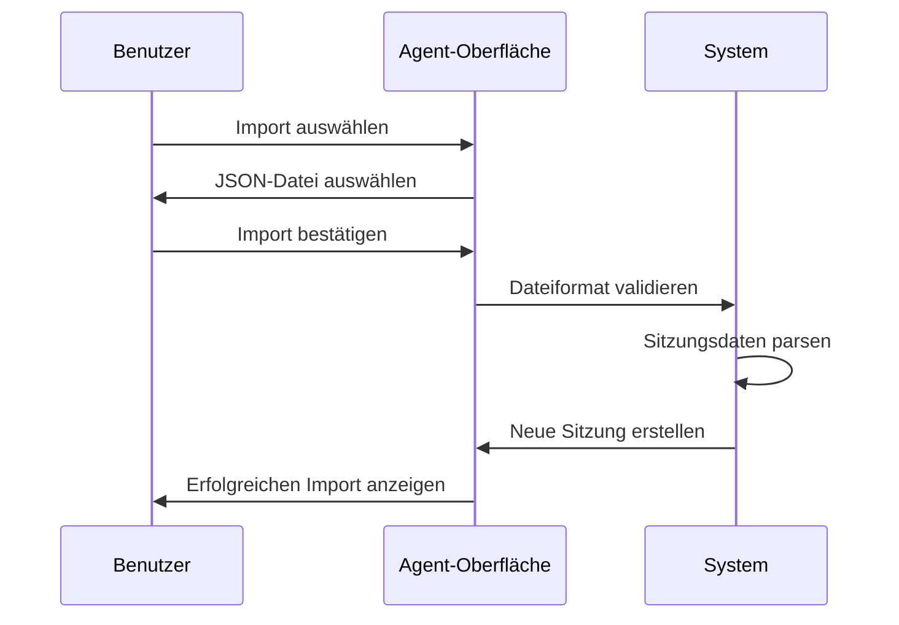
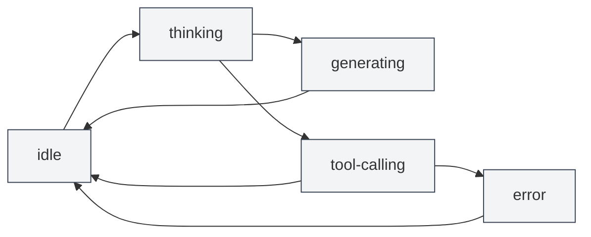

# Agent-Sitzungsverwaltung

## Übersicht

Agent-Sitzungen sind die Kernkomponente des Agent-Frameworks und repräsentieren eine unabhängige, kontextbezogene Agent-Ausführungsumgebung. Jede Sitzung verwaltet ihren eigenen Nachrichtenverlauf, Referenzmaterialien, öffentlichen Kontextraum und unterstützt erweiterte Funktionen wie Nachrichtenwarteschlange, Wiederholungsversuche, Duplizierung usw.

<AgentView mode="demo" />

Agent-Sitzungen werden basierend auf einer AgentConfig erstellt, erben deren Toolset und Fähigkeitsbereich, aber jede Sitzung hat einen unabhängigen Ausführungsstatus und Verlauf.

## Sitzung erstellen

### Neue Sitzung erstellen

Schritte zum Erstellen einer Agent-Sitzung:

<AgentView mode="demo" />

1.  **Agent-Ansicht öffnen**: Klicken Sie in der Menüleiste auf "AI" → "Agent", um die Agent-Ansicht zu öffnen.
2.  **AgentConfig auswählen**: Wählen Sie oben in der Sitzungsliste die zu verwendende AgentConfig aus.
3.  **Sitzung erstellen**: Klicken Sie auf die Schaltfläche "Neue Sitzung".
4.  **Titel eingeben**: Optional einen Sitzungstitel eingeben (standardmäßig wird die erste Nachricht als Titel verwendet).
5.  **Dialog beginnen**: Geben Sie die erste Nachricht ein, um mit dem Agent zu interagieren.

### Sitzungsinitialisierung

Beim Erstellen einer Sitzung führt das System automatisch folgende Schritte aus:

<AgentSessionManager mode="demo" />

-   **Sitzungs-ID erstellen**: Erzeugt einen eindeutigen Sitzungsbezeichner.
-   **AgentConfig verknüpfen**: Bindet an die angegebene AgentConfig.
-   **Nachrichtenwarteschlange initialisieren**: Erstellt eine leere Nachrichtenwarteschlange.
-   **Referenzmaterialien initialisieren**: Erstellt einen leeren Speicher für Referenzmaterialien.
-   **Öffentlichen Kontext initialisieren**: Erstellt einen öffentlichen Kontextraum, der Informationen wie die aktuelle Zeit enthält.
-   **Begrüßung erstellen**: Fügt automatisch eine Begrüßungsnachricht des Agents hinzu.
-   **Interne Referenz aktivieren**: Aktiviert standardmäßig die interne Referenz 0 (dynamisches Abrufen des aktuellen Dokumentinhalts).

## Sitzung umbenennen

### Umbenennungsvorgang

Eine bestehende Sitzung umbenennen:

<AgentView mode="demo" />

1.  **Kontextmenü**: Klicken Sie mit der rechten Maustaste auf die Sitzung und wählen Sie "Umbenennen".
2.  **Neuen Namen eingeben**: Geben Sie im daraufhin angezeigten Dialogfeld den neuen Sitzungsnamen ein.
3.  **Speichern bestätigen**: Klicken Sie auf Bestätigen, um den neuen Namen zu speichern.

Der Sitzungsname dient zur Identifizierung und Unterscheidung verschiedener Sitzungen. Es wird empfohlen, beschreibende Namen zu verwenden.

## Sitzung löschen

### Löschvorgang

Eine nicht benötigte Sitzung löschen:

<AgentSessionManager mode="demo" />

1.  **Kontextmenü**: Klicken Sie mit der rechten Maustaste auf die Sitzung und wählen Sie "Löschen".
2.  **Löschen bestätigen**: Bestätigen Sie den Löschvorgang im Bestätigungsdialog.

**Hinweis**: Das Löschen einer Sitzung entfernt gleichzeitig den gesamten Nachrichtenverlauf, alle Referenzmaterialien und Ausführungsknoten dieser Sitzung. Dieser Vorgang kann nicht rückgängig gemacht werden.

### Massenlöschung

Derzeit wird das Massenlöschen nicht unterstützt. Sitzungen müssen einzeln gelöscht werden.

## Sitzung duplizieren

### Duplizierungsvorgang

Eine bestehende Sitzung duplizieren:

<AgentView mode="demo" />

1.  **Kontextmenü**: Klicken Sie mit der rechten Maustaste auf die Sitzung und wählen Sie "Duplizieren".
2.  **Kopie erstellen**: Das System erstellt eine neue Kopie der Sitzung.

Das Duplizieren einer Sitzung kopiert:

-   **Nachrichtenverlauf**: Alle Nachrichteneinträge.
-   **Referenzmaterialien**: Alle Referenzmaterialien.
-   **Öffentlichen Kontext**: Den Inhalt des öffentlichen Kontextraums.
-   **Ausführungsknoten**: Alle Aufzeichnungen der Ausführungsknoten.

Die duplizierte Sitzung ist unabhängig; Änderungen wirken sich nicht auf die ursprüngliche Sitzung aus.

### Anwendungsfälle

Das Duplizieren einer Sitzung eignet sich für:

-   **Verzweigte Diskussionen**: Fortsetzung der Diskussion zu verschiedenen Themen basierend auf einem bestehenden Dialog.
-   **Experimente/Testen**: Testen verschiedener Agent-Konfigurationen oder Toolsets.
-   **Sicherung**: Speichern wichtiger Sitzungszustände.

## Sitzung exportieren/importieren

### Sitzung exportieren

<AgentView mode="demo" />

Eine Sitzung als JSON-Datei exportieren:

<AgentView mode="demo" />

1.  **Kontextmenü**: Klicken Sie mit der rechten Maustaste auf die Sitzung und wählen Sie "Exportieren".
2.  **Speicherort wählen**: Wählen Sie den Speicherort und Dateinamen.
3.  **Datei speichern**: Klicken Sie auf Speichern, um die Sitzung zu exportieren.

Die exportierte JSON-Datei enthält:

-   Grundlegende Sitzungsinformationen (ID, Titel, Beschreibung usw.)
-   Nachrichtenverlauf
-   Referenzmaterialien
-   Öffentlichen Kontext
-   Ausführungsknoten

### Sitzung importieren

<AgentSessionManager mode="demo" />

Eine Sitzung aus einer JSON-Datei importieren:

1.  **Import öffnen**: Suchen Sie die Importfunktion in der Agent-Ansicht.
2.  **Datei auswählen**: Wählen Sie die zu importierende JSON-Datei aus.
3.  **Daten validieren**: Das System überprüft das Dateiformat und den Inhalt.
4.  **Sitzung importieren**: Nach erfolgreichem Import wird eine neue Sitzung erstellt.

Die importierte Sitzung erhält eine neue Sitzungs-ID und überschreibt keine bestehenden Sitzungen.

## Sitzung wiederholen

### Wiederholungsfunktion

Die Wiederholungsfunktion ermöglicht es Ihnen, fehlgeschlagene Agent-Aufgaben erneut auszuführen:

1.  **Ausführungsknoten anzeigen**: Sehen Sie sich die Liste der Ausführungsknoten in der Sitzung an.
2.  **Knoten auswählen**: Wählen Sie den Ausführungsknoten aus, der wiederholt werden soll.
3.  **Wiederholung ausführen**: Klicken Sie auf die Schaltfläche "Wiederholen", um die Ausführung zu wiederholen.

Die Wiederholung startet die Ausführung erneut ab dem ausgewählten Ausführungsknoten und behält den vorherigen Nachrichtenverlauf bei.

### Ausführungsknoten

Ausführungsknoten zeichnen jeden Schritt während der Agent-Ausführung auf:

-   **Nachrichtenknoten**: Benutzernachricht oder KI-Antwort.
-   **Tool-Aufrufknoten**: Tool-Aufruf und Ausführungsergebnis.
-   **Workflow-Aufrufknoten**: Workflow-Ausführungsprozess.
-   **LLM-Aufrufknoten**: LLM-Aufruf und Antwort.

Jeder Knoten hat einen Status (pending, running, succeeded, failed, cancelled) und ein Ergebnis.

## Sitzungsnachrichtenverwaltung

### Nachrichtenoperationen

Für Sitzungsnachrichten sind folgende Operationen möglich:

-   **Nachricht bearbeiten**: Eine Benutzernachricht bearbeiten und erneut senden.
-   **Neu generieren**: Eine KI-Antwort neu generieren.
-   **Nachricht kopieren**: Den Inhalt einer Nachricht kopieren.
-   **Nachricht löschen**: Eine Nachricht löschen (löscht alle Nachrichten nach dieser Nachricht).

### Nachrichtenwarteschlange

<AgentView mode="demo" />

Die Nachrichtenwarteschlange ermöglicht es, während der Agent-Ausführung Nachrichten einzufügen:

1.  **Einfügezeitpunkt**: Wenn der Agent eine Antwort generiert oder ein Tool aufruft, werden Nachrichten vorübergehend in der Warteschlange gespeichert.
2.  **Verarbeitungszeitpunkt**: Nach Abschluss der aktuellen Aufgabe und vor dem nächsten Schritt werden die Nachrichten in der Warteschlange verarbeitet.
3.  **Anmerkungsinformationen**: Warteschlangennachrichten werden mit dem Einfügezeitpunkt und der Nachrichten-ID zum Zeitpunkt des Einfügens versehen, um dem Agent zu helfen, den Kontext zu verstehen.

Die Nachrichtenwarteschlangenfunktion ermöglicht es Ihnen, während der Agent-Ausführung zusätzliche Informationen oder Anweisungen bereitzustellen.

## Referenzmaterialverwaltung

### Referenz hinzufügen

<ReferenceManager mode="demo" />

Referenzmaterialien zu einer Sitzung hinzufügen:

1.  **Referenzverwaltung öffnen**: Klicken Sie auf den Tab "Referenzen" in der Sitzung.
2.  **Referenz hinzufügen**: Klicken Sie auf die Schaltfläche "Referenz hinzufügen".
3.  **Typ auswählen**: Wählen Sie den Referenztyp (Datei, URL, Text usw.).
4.  **Inhalt auswählen**: Wählen Sie den zu referenzierenden Inhalt aus.

Weitere Details finden Sie unter [[agent.references|Referenzmaterialverwaltung]].

### Referenztypen

Folgende Referenztypen werden unterstützt:

-   **Dateireferenz**: Verweist auf lokale Dateien (Markdown, LaTeX, PDF, Word, Bilder usw.).
-   **URL-Referenz**: Verweist auf eine Web-URL.
-   **Textreferenz**: Verweist auf benutzerdefinierte Textinhalte.
-   **Wissensdatenbank-Referenz**: Verweist auf Inhalte aus der Wissensdatenbank.
-   **Interne Referenz**: Dynamisches Abrufen des aktuellen Dokumentinhalts (standardmäßig aktiviert).

### Referenz aktivieren

<ReferenceManager mode="demo" />

Referenzmaterialien können aktiviert oder deaktiviert werden:

-   **Referenz aktivieren**: Aktivierte Referenzen werden bei der Agent-Ausführung verwendet.
-   **Referenz deaktivieren**: Deaktivierte Referenzen beeinflussen die Agent-Ausführung nicht.

Der Agent kann den Inhalt von Referenzmaterialien wahrnehmen und darauf basierend schlussfolgern und agieren.

## Öffentlicher Kontext

### Kontextraum

Der öffentliche Kontext ist ein sitzungsweiter, gemeinsam genutzter Kontextraum, der Folgendes enthält:

<AgentView mode="demo" />

-   **Aktuelle Zeit**: Automatisch aktualisierter Zeitstempel.
-   **Dokumentinformationen**: Informationen zum aktuell geöffneten Dokument (falls aktiviert).
-   **Benutzerdefinierte Daten**: Vom Benutzer definierte Kontextdaten.

### Anwendungsfälle

Der öffentliche Kontext eignet sich für:

-   **Zeitwahrnehmung**: Dem Agent die aktuelle Zeit mitteilen.
-   **Dokumentwahrnehmung**: Dem Agent das aktuell geöffnete Dokument mitteilen.
-   **Statusfreigabe**: Freigabe von Statusinformationen innerhalb eines Workflows.

## Sitzungsstatus

<AgentSessionManager mode="demo" />

### Statustypen

Eine Sitzung kann folgende Status haben:

-   **idle**: Leerlaufstatus, wartet auf Benutzereingabe.
-   **thinking**: Der Agent denkt nach.
-   **generating**: Der Agent generiert eine Antwort.
-   **tool-calling**: Der Agent ruft ein Tool auf.
-   **waiting-input**: Wartet auf Benutzereingabe.
-   **error**: Ein Fehler ist aufgetreten.

### Statusübergänge

## Verwendungstipps

<AgentView mode="demo" />

### Sitzungsorganisation

1.  **Kategorien verwalten**: Erstellen Sie für verschiedene Themen separate Sitzungen.
2.  **Namenskonventionen**: Verwenden Sie klare Sitzungsnamen.
3.  **Regelmäßige Bereinigung**: Löschen Sie regelmäßig nicht benötigte Sitzungen.

### Nachrichtenverwaltung

1.  **Nachrichten bearbeiten**: Wenn eine KI-Antwort nicht optimal ist, können Sie die Benutzernachricht bearbeiten und erneut senden.
2.  **Referenzen verwenden**: Fügen Sie Referenzmaterialien hinzu, um mehr Kontext bereitzustellen.
3.  **Nachrichtenwarteschlange**: Verwenden Sie die Nachrichtenwarteschlange, um während der Agent-Ausführung zusätzliche Informationen einzufügen.

### Wiederholungsmechanismus

1.  **Knoten anzeigen**: Sehen Sie sich die Ausführungsknoten an, um den Ausführungsprozess des Agents zu verstehen.
2.  **Wiederholung auswählen**: Wählen Sie fehlgeschlagene Knoten für eine Wiederholung aus.
3.  **Konfiguration anpassen**: Bei häufigen Fehlern sollten Sie die AgentConfig oder das Toolset anpassen.

## Häufig gestellte Fragen

<AgentView mode="demo" />

### F: Wie erstelle ich eine neue Sitzung?

A: Wählen Sie in der Agent-Ansicht eine AgentConfig aus und klicken Sie dann auf die Schaltfläche "Neue Sitzung". Geben Sie nach dem Erstellen der Sitzung die erste Nachricht ein, um den Dialog zu beginnen.

### F: Wird der Sitzungsnachrichtenverlauf gespeichert?

A: Ja, der Sitzungsnachrichtenverlauf wird automatisch in den Metadaten des Dokuments gespeichert. Beim erneuten Öffnen des Dokuments werden alle Sitzungen wiederhergestellt.

### F: Wie lösche ich eine Sitzung?

A: Klicken Sie mit der rechten Maustaste auf die Sitzung, wählen Sie "Löschen" und bestätigen Sie den Löschvorgang im Bestätigungsdialog. Der Löschvorgang kann nicht rückgängig gemacht werden.

### F: Was wird beim Duplizieren einer Sitzung kopiert?

A: Beim Duplizieren einer Sitzung werden der Nachrichtenverlauf, die Referenzmaterialien, der öffentliche Kontext und die Ausführungsknoten kopiert. Die duplizierte Sitzung ist un
