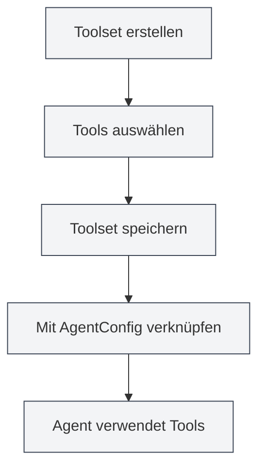

# Toolset-Verwaltung

## Übersicht

Ein Toolset (ToolCollection) ist eine Sammlung zur Organisation und Verwaltung von Agent-Tools im Agent-Framework. Toolsets gruppieren verwandte Tools, um die Verwaltung und Wiederverwendung zu erleichtern. Ein AgentConfig bestimmt über die Verknüpfung mit Toolsets, welche Tools ein Agent verwenden kann.

Toolsets unterstützen das dynamische Hinzufügen und Entfernen von Tools. Es können Toolsets für spezifische Zwecke erstellt oder mehrere Toolsets kombiniert werden.

## Kernkonzepte

### Toolset-Struktur

<AgentView mode="demo" />

Ein Toolset umfasst folgende Hauptbestandteile:

- **Grundinformationen**: ID, Name, Beschreibung, Versionsnummer
- **Tool-Liste**: Liste der enthaltenen Tool-IDs (inkl. interner und externer Tools)
- **Aktivierungsstatus**: Ob das Toolset aktiviert ist
- **Tags**: Tags zur Kategorisierung und Suche
- **Integriert-Kennzeichnung**: Ob es sich um ein integriertes Toolset handelt (kann nicht gelöscht werden)

### Tool-Typen

<GrepDisplay mode="demo" />

Ein Toolset kann folgende Arten von Tools enthalten:

- **Interne Tools**: In MetaDoc integrierte Agent-Tools (z.B. edit-tool, proofread-tool, etc.)
- **Externe Tools**: Benutzerdefinierte externe Tools

### Standard-Toolset

Das System stellt ein Standard-Toolset (`default-tool-set`) bereit, das alle integrierten Agent-Tools enthält. Es kann nicht gelöscht, aber kopiert werden.

## Toolset erstellen

<AgentView mode="demo" />

### Neues Toolset erstellen

Schritte zum Erstellen eines Toolsets:

1.  **Toolset-Verwaltung öffnen**: In der Agent-Ansicht auf "Verwalten" → "Toolsets" klicken
2.  **Toolset erstellen**: Auf die Schaltfläche "Neues Toolset" klicken
3.  **Grundinformationen ausfüllen**:
    - Name: Name des Toolsets (mehrsprachig unterstützt)
    - Beschreibung: Beschreibung des Toolsets (mehrsprachig unterstützt)
4.  **Tools auswählen**: Ein oder mehrere Tools aus der Dropdown-Liste auswählen
    - Toolnamen können durchsucht werden
    - Mehrfachauswahl wird unterstützt
    - Tool-Typ und -Beschreibung werden angezeigt
5.  **Toolset speichern**: Auf die Schaltfläche "Speichern" klicken

Sie können auf die Agent-Ansicht über die Seitenleiste zugreifen:

### Agent-Toolset-Oberfläche

Die folgende Abbildung zeigt die Hauptfunktionen der Toolset-Verwaltungsoberfläche:

<AgentView mode="demo" />

### Tool-Auswahl

Bei der Tool-Auswahl zeigt das System an:

- **Tool-Name**: Der Anzeigename des Tools
- **Tool-ID**: Der eindeutige Bezeichner des Tools
- **Tool-Typ**: Internes Tool, externes Tool oder Workflow-Tool
- **Tool-Beschreibung**: Eine kurze Beschreibung des Tools

<DialogDemo mode="demo" dialogType="tool-select" />

## Toolset bearbeiten

<AgentView mode="demo" />

### Bearbeitungsvorgang

Ein bestehendes Toolset bearbeiten:

1.  **Verwaltungsoberfläche öffnen**: In der Toolset-Verwaltung das zu bearbeitende Toolset finden
2.  **Bearbeiten klicken**: Auf die Schaltfläche "Bearbeiten" auf der Toolset-Karte klicken
3.  **Informationen ändern**: Namen, Beschreibung oder Tool-Liste ändern
4.  **Änderungen speichern**: Auf die Schaltfläche "Speichern" klicken

**Hinweis**: Das Standard-Toolset (`default-tool-set`) kann nicht bearbeitet werden, aber es kann kopiert und die Kopie bearbeitet werden.

### Tool hinzufügen

Einem Toolset ein Tool hinzufügen:

1.  **Bearbeitungsansicht öffnen**: Toolset bearbeiten
2.  **Tool auswählen**: Das hinzuzufügende Tool in der Tool-Dropdown-Liste auswählen
3.  **Änderungen speichern**: Auf die Schaltfläche "Speichern" klicken

### Tool entfernen

Ein Tool aus einem Toolset entfernen:

1.  **Bearbeitungsansicht öffnen**: Toolset bearbeiten
2.  **Auswahl aufheben**: Das zu entfernende Tool in der Tool-Liste abwählen
3.  **Änderungen speichern**: Auf die Schaltfläche "Speichern" klicken

## Toolset löschen

<AgentView mode="demo" />

### Löschvorgang

Ein nicht mehr benötigtes Toolset löschen:

1.  **Verwaltungsoberfläche öffnen**: In der Toolset-Verwaltung das zu löschende Toolset finden
2.  **Löschen klicken**: Auf die Schaltfläche "Löschen" auf der Toolset-Karte klicken
3.  **Löschen bestätigen**: Den Löschvorgang im Bestätigungsdialog bestätigen

**Hinweis**:

- Das Standard-Toolset (`default-tool-set`) kann nicht gelöscht werden.
- Das Löschen eines Toolsets hat keinen Einfluss auf bereits erstellte AgentConfigs, aber AgentConfigs, die mit diesem Toolset verknüpft sind, können es nicht mehr verwenden.
- Falls ein Toolset von einem AgentConfig verwendet wird, erfolgt vor dem Löschen eine Warnung.

## Toolset kopieren

### Kopiervorgang

<OutlineTreeDisplay mode="demo" />

Ein bestehendes Toolset kopieren:

1.  **Verwaltungsoberfläche öffnen**: In der Toolset-Verwaltung das zu kopierende Toolset finden
2.  **Kopieren klicken**: Auf die Schaltfläche "Kopieren" auf der Toolset-Karte klicken
3.  **Kopie bearbeiten**: Das System erstellt eine Kopie, deren Name automatisch das Suffix " (Kopie)" erhält
4.  **Änderungen speichern**: Die Kopie nach Bedarf anpassen und speichern

Beim Kopieren werden alle Tools, inklusive der Tool-Liste und Konfiguration, mitkopiert.

## Toolset importieren/exportieren

### Toolset exportieren

Ein Toolset als JSON-Datei exportieren:

1.  **Verwaltungsoberfläche öffnen**: In der Toolset-Verwaltung das zu exportierende Toolset finden
2.  **Exportieren klicken**: Auf die Schaltfläche "Exportieren" auf der Toolset-Karte klicken
3.  **Speicherort wählen**: Speicherort und Dateinamen auswählen
4.  **Datei speichern**: Klicken, um das Toolset zu exportieren und zu speichern

<DialogDemo mode="demo" dialogType="export-config" />

Die exportierte JSON-Datei enthält alle Informationen des Toolsets und kann zur Sicherung oder Weitergabe verwendet werden.

### Toolset importieren

<DataAnalysisDisplay mode="demo" />

Ein Toolset aus einer JSON-Datei importieren:

1.  **Verwaltungsoberfläche öffnen**: In der Toolset-Verwaltung
2.  **Importieren klicken**: Auf die Schaltfläche "Toolset importieren" klicken
3.  **Datei auswählen**: Die zu importierende JSON-Datei auswählen
4.  **Daten validieren**: Das System prüft das Dateiformat und den Inhalt
5.  **Toolset importieren**: Nach erfolgreichem Import wird ein neues Toolset erstellt

<DialogDemo mode="demo" dialogType="import-config" />

Importierte Toolsets erhalten eine neue ID und überschreiben keine bestehenden Toolsets (es sei denn, der Überschreibmodus wird verwendet).

## Toolset und AgentConfig

### Toolset verknüpfen

Ein AgentConfig bestimmt über die Verknüpfung mit Toolsets die verfügbaren Tools:

1.  **AgentConfig erstellen**: Ein neues AgentConfig erstellen
2.  **Toolset auswählen**: In der AgentConfig ein oder mehrere Toolsets auswählen
3.  **Tool-Schnittmenge**: Werden mehrere Toolsets ausgewählt, sind die verfügbaren Tools die Schnittmenge aller ausgewählten Toolsets.

### Toolset-Schnittmenge

<DiffDisplay mode="demo" />

Wenn ein AgentConfig mit mehreren Toolsets verknüpft ist:

- Toolset A enthält: `[tool1, tool2, tool3]`
- Toolset B enthält: `[tool2, tool3, tool4]`
- Verfügbare Tools für AgentConfig sind: `[tool2, tool3]` (Schnittmenge)

Dieser Mechanismus ermöglicht eine präzise Kontrolle über den Fähigkeitsumfang des Agents.

## Anwendungstipps

### Toolset-Organisation

1.  **Nach Funktion kategorisieren**: Toolsets nach Funktion erstellen, z.B. "Dokumentenbearbeitungs-Toolset", "Datenanalyse-Toolset"
2.  **Nach Szenario kategorisieren**: Toolsets nach Anwendungsfall erstellen, z.B. "Akademisches Schreib-Toolset", "Code-Analyse-Toolset"
3.  **Namenskonventionen**: Klare Namen verwenden, um die Identifikation und Verwaltung zu erleichtern

### Toolset-Design

1.  **Einzelne Verantwortung**: Jedes Toolset auf eine spezifische Funktion oder ein Szenario fokussieren
2.  **Tool-Kombination**: Verwandte Tools sinnvoll kombinieren, zu große Toolsets vermeiden
3.  **Wiederverwendbarkeit**: Wiederverwendbare Toolsets entwerfen, um sie in verschiedenen AgentConfigs nutzen zu können

### Toolset-Verwaltung

1.  **Regelmäßige Bereinigung**: Nicht mehr verwendete Toolsets löschen
2.  **Versionsverwaltung**: Wichtige Toolsets über die Exportfunktion sichern
3.  **Dokumentation**: Verwendungszweck und Anwendungsszenarien in der Toolset-Beschreibung festhalten

## Häufig gestellte Fragen

### F: Wie erstelle ich ein spezialisiertes Toolset?

A: Erstellen Sie ein neues Toolset, wählen Sie die relevanten Tools aus und vergeben Sie einen klaren Namen und eine klare Beschreibung. Zum Beispiel: Erstellen Sie ein "Datenanalyse-Toolset" und wählen Sie datenanalyserelevante Tools aus.

### F: Was ist die Beziehung zwischen Toolset und AgentConfig?

A: Ein AgentConfig bestimmt über die Verknüpfung mit Toolsets, welche Tools verfügbar sind. Ein AgentConfig kann mit mehreren Toolsets verknüpft sein, die verfügbaren Tools sind dann die Schnittmenge aller verknüpften Toolsets.

### F: Kann ich das Standard-Toolset ändern?

A: Das Standard-Toolset (`default-tool-set`) kann nicht bearbeitet werden, aber es kann kopiert und die Kopie bearbeitet werden. Kopieren Sie das Standard-Toolset und passen Sie die Kopie an.

### F: Wie füge ich benutzerdefinierte Tools zu einem Toolset hinzu?

A: Zuerst muss das benutzerdefinierte Tool registriert werden. Dann kann es bei der Erstellung oder Bearbeitung eines Toolsets ausgewählt werden. Benutzerdefinierte Tools müssen den Agent-Tool-Spezifikationen entsprechen.

### F: Beeinflusst das Löschen eines Toolsets ein AgentConfig?

A: Das Löschen eines Toolsets hat keinen Einfluss auf bereits erstellte AgentConfigs, aber AgentConfigs, die mit diesem Toolset verknüpft sind, können es nicht mehr verwenden. Falls ein Toolset gerade verwendet wird, erfolgt vor dem Löschen eine Warnung.

## Verwandte Dokumentation

- [[agent.introduction|Agent-Framework-Übersicht]]
- [[agent.introduction|Agent-Konfigurationsverwaltung]]
- [[agent.session|Agent-Sitzungsverwaltung]]
