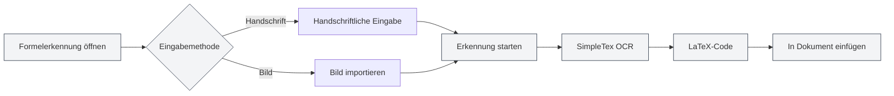

# KI-Assistent-Funktionen

## Übersicht

Die KI-Assistent-Funktionen bieten eine Vielzahl intelligenter Hilfswerkzeuge, die Sie bei Aufgaben wie der Dokumentenerstellung, Formelerkennung, Diagrammgenerierung und Datenanalyse unterstützen. Mit dem KI-Assistenten können Sie verschiedene Dokumentenverarbeitungsarbeiten effizient erledigen.

Zu den KI-Assistent-Funktionen gehören: KI-Chat, Handschriftliche Formelerkennung, Intelligenter Zeichenassistent, Datenanalyse-Tools, OCR-Texterkennung, Anhang-Analyse-Tool, AIGC-Erkennung und mehr.

<AgentView mode="demo" />

## KI-Chat

### Funktionsbeschreibung

Die KI-Chat-Funktion bietet einen intelligenten Chat-Assistenten, der auf Basis des aktuellen Dokumentinhalts Konversationen führen kann:

- **Kontextverständnis**: Versteht den Inhalt und Kontext des aktuellen Dokuments
- **Intelligente Antworten**: Beantwortet relevante Fragen basierend auf dem Dokumentinhalt
- **Dokumentenanalyse**: Analysiert Dokumentstruktur, Inhalt, Stil usw.

Sie können auf die KI-Chat-Funktion über das KI-Assistenten-Menü zugreifen:

<MenuItemsDemo mode="demo" :items='[{"id": "ai-assistant", "items": ["ai-chat"]}]' />

### Interface-Vorschau

Die KI-Chat-Oberfläche enthält eine Sitzungsliste und einen Chatbereich und unterstützt die Verwaltung mehrerer Sitzungen sowie das Referenzieren von Material:

<AIChat mode="demo" />

Siehe auch [[ai.chat|KI-Chat]].

## Handschriftliche Formelerkennung

### Funktionsbeschreibung

Die Funktion zur handschriftlichen Formelerkennung kann handschriftliche mathematische Formeln in LaTeX-Code umwandeln:

<FormulaRecognition mode="demo" />

- **Handschriftliche Eingabe**: Unterstützt Maus-/Touch-Eingabe per Handschrift
- **Bildimport**: Unterstützt den Import von Formelbildern zur Erkennung
- **Echtzeiterkennung**: Nutzt die SimpleTex OCR-API zur Erkennung
- **LaTeX-Ausgabe**: Automatische Konvertierung in das standardmäßige LaTeX-Format

### Verwendung

1. **Formelerkennung öffnen**: Öffnen Sie das Formelerkennungsfenster aus dem KI-Assistenten-Menü
2. **Handschriftliche Eingabe**: Schreiben Sie die mathematische Formel per Hand auf die Leinwand
3. **Oder Bild importieren**: Klicken Sie auf die Import-Schaltfläche und wählen Sie ein Formelbild aus
4. **Erkennung starten**: Klicken Sie auf die Erkennungs-Schaltfläche
5. **Ergebnis anzeigen**: Sehen Sie sich den erkannten LaTeX-Code an
6. **In Dokument einfügen**: Fügen Sie den LaTeX-Code in das Dokument ein

Sie können auf die Funktion zur handschriftlichen Formelerkennung über das KI-Assistenten-Menü zugreifen:

<MenuItemsDemo mode="demo" :items='[{"id": "ai-assistant", "items": ["formula-recognition"]}]' />

### Erkennungsgenauigkeit

- **Hochpräzise Erkennung**: Die SimpleTex OCR-API bietet hochpräzise Erkennung mathematischer Formeln
- **Unterstützt komplexe Formeln**: Unterstützt komplexe Formeln wie Brüche, Wurzeln, Integrale, Summen usw.
- **Automatische Fehlerkorrektur**: Erkennungsergebnisse können manuell bearbeitet und korrigiert werden

## Intelligenter Zeichenassistent

### Funktionsbeschreibung

Der intelligente Zeichenassistent nutzt KI zur Generierung von Diagrammcode und unterstützt verschiedene Diagrammformate:

- **Mermaid-Diagramme**: Flussdiagramme, Sequenzdiagramme, Klassendiagramme, Zustandsdiagramme usw.
- **PlantUML-Diagramme**: UML-Diagramme, Sequenzdiagramme, Aktivitätsdiagramme usw.
- **ECharts-Diagramme**: Liniendiagramme, Balkendiagramme, Kuchendiagramme, Punktdiagramme usw.
- **Direktes Einfügen**: Generierte Diagramme können direkt in Dokumente eingefügt werden

### Interface-Vorschau

Der intelligente Zeichenassistent unterstützt die Verwaltung mehrerer Sitzungen, wählt automatisch die Diagramm-Engine aus und generiert visuelle Diagramme:

<GraphWindow mode="demo" />

<MenuItemsDemo mode="demo" :items='[{"id": "ai-assistant"}]' />

### Verwendung

1. **Zeichenassistent öffnen**: Öffnen Sie den Zeichenassistenten über das Menü oder die Symbolleiste
2. **Anforderung beschreiben**: Beschreiben Sie das gewünschte Diagramm in natürlicher Sprache
3. **Typ auswählen**: Wählen Sie den Diagrammtyp (Mermaid, PlantUML, ECharts usw.)
4. **Diagramm generieren**: Die KI generiert den Diagrammcode basierend auf der Beschreibung
5. **Diagramm vorschauen**: Vorschau des generierten Diagramms
6. **In Dokument einfügen**: Fügen Sie das Diagramm in das Dokument ein

### Unterstützte Diagrammtypen

- **Mermaid**: Flussdiagramme, Sequenzdiagramme, Klassendiagramme, Zustandsdiagramme, ER-Diagramme, Gantt-Diagramme, Kuchendiagramme, Git-Graphen, Journey Maps, Mind Maps, Zeitachsen usw.
- **PlantUML**: UML-Diagramme, Sequenzdiagramme, Aktivitätsdiagramme, Komponentendiagramme, Deployment-Diagramme usw.
- **ECharts**: Liniendiagramme, Balkendiagramme, Kuchendiagramme, Punktdiagramme, Radar-Diagramme, Heatmaps, Baumdiagramme, Treemaps, Sunburst-Diagramme usw.

Siehe auch [[charts.introduction|Diagrammfunktionen]].

## Datenanalyse-Tools

### Funktionsbeschreibung

Die Datenanalyse-Tools können Datentabellen in Dokumenten analysieren und visuelle Diagramme generieren:

- **Tabellenerkennung**: Automatische Erkennung von Tabellendaten in Dokumenten
- **Datenanalyse**: Analyse statistischer Informationen der Tabellendaten
- **Diagrammgenerierung**: Generierung visueller Diagramme basierend auf den Daten
- **Diagrammeinfügung**: Einfügen der generierten Diagramme in Dokumente

<DataAnalysisWindow mode="demo" />

### Verwendung

1. **Datenanalyse öffnen**: Öffnen Sie das Datenanalysefenster über das Menü oder die Symbolleiste
2. **Tabelle auswählen**: Wählen Sie die zu analysierende Tabelle im Dokument aus
3. **Daten analysieren**: Klicken Sie auf die Analyse-Schaltfläche, die KI analysiert die Tabellendaten
4. **Diagramm generieren**: Generieren Sie basierend auf dem Analyseergebnis ein visuelles Diagramm
5. **In Dokument einfügen**: Fügen Sie das Diagramm in das Dokument ein

## OCR-Texterkennung

### Funktionsbeschreibung

Die OCR-Texterkennungsfunktion kann Text in Bildern erkennen und den Textinhalt extrahieren:

- **Bildererkennung**: Erkennung von Textinhalten in Bildern
- **Mehrsprachige Unterstützung**: Unterstützt Chinesisch, Englisch und weitere Sprachen
- **Textextraktion**: Extrahiert den erkannten Textinhalt
- **In Dokument einfügen**: Fügt den extrahierten Text in das Dokument ein

### Interface-Vorschau

Das OCR-Erkennungsfenster unterstützt die Verwaltung mehrerer Bilder, die Anpassung von Bildvorverarbeitungsparametern und die Bearbeitung von Erkennungsergebnissen:

<OcrWindow mode="demo" />

<MenuItemsDemo mode="demo" :items='[{"id": "ai-assistant", "items": ["proofread"]}]' />

### Verwendung

1. **OCR-Erkennung öffnen**: Öffnen Sie das OCR-Erkennungsfenster über das Menü oder die Symbolleiste
2. **Bild importieren**: Importieren Sie das zu erkennende Bild
3. **Erkennung starten**: Klicken Sie auf die Erkennungs-Schaltfläche
4. **Ergebnis anzeigen**: Sehen Sie sich den erkannten Textinhalt an
5. **In Dokument einfügen**: Fügen Sie den Text in das Dokument ein

## Anhang-Analyse-Tool

### Funktionsbeschreibung

Das Anhang-Analyse-Tool kann Anhänge wie PDF- und Word-Dateien analysieren und deren Inhalte extrahieren:

- **Dateianalyse**: Analyse von Dateiformaten wie PDF, Word usw.
- **Inhaltsextraktion**: Extrahiert Text und Bilder aus den Dateien
- **Zur Wissensdatenbank hinzufügen**: Fügt die extrahierten Inhalte der Wissensdatenbank hinzu
- **Dokumentreferenzierung**: Referenziert Anhangsinhalte im Dokument

<KnowledgeBase mode="demo" />

### Verwendung

1. **Anhang-Analyse öffnen**: Öffnen Sie das Anhang-Analysefenster über das Menü oder die Symbolleiste
2. **Datei auswählen**: Wählen Sie die zu analysierende PDF- oder Word-Datei aus
3. **Analyse starten**: Klicken Sie auf die Analyse-Schaltfläche
4. **Ergebnis anzeigen**: Sehen Sie sich die analysierten Inhalte an
5. **Zur Wissensdatenbank hinzufügen**: Fügen Sie die Inhalte der Wissensdatenbank hinzu (optional)

## AIGC-Erkennung

### Funktionsbeschreibung

Die AIGC-Erkennungsfunktion kann prüfen, ob ein Text KI-generierte Inhalte enthält:

- **Texterkennung**: Prüft, ob der Text KI-generiert ist
- **Konfidenzbewertung**: Liefert eine Wahrscheinlichkeitsbewertung für KI-Generierung
- **Erkennungsbericht**: Generiert einen detaillierten Erkennungsbericht

<AigcDetectionWindow mode="demo" />

### Verwendung

1. **AIGC-Erkennung öffnen**: Öffnen Sie das AIGC-Erkennungsfenster über das Menü oder die Symbolleiste
2. **Text auswählen**: Wählen Sie den zu prüfenden Text aus
3. **Erkennung starten**: Klicken Sie auf die Erkennungs-Schaltfläche
4. **Ergebnis anzeigen**: Sehen Sie sich das Erkennungsergebnis und die Konfidenzbewertung an

## Verwendungstipps

### Effiziente Nutzung des KI-Assistenten

1. **Anforderungen klar formulieren**: Beschreiben Sie Ihre Anforderungen klar, um bessere Ergebnisse zu erhalten
2. **Kontext bereitstellen**: Stellen Sie ausreichend Kontextinformationen bereit
3. **Iterative Optimierung**: Optimieren Sie Ihre Anforderungen iterativ basierend auf den Ergebnissen

### Tipps zur Formelerkennung

1. **Klar schreiben**: Schreiben Sie beim handschriftlichen Eingaben klar und vermeiden Sie Ungenauigkeiten
2. **Korrektes Format**: Verwenden Sie das korrekte Format für mathematische Symbole
3. **Ergebnis prüfen**: Prüfen Sie das Erkennungsergebnis und korrigieren Sie es bei Bedarf manuell

### Tipps zur Diagrammgenerierung

1. **Detaillierte Beschreibung**: Beschreiben Sie Ihre Diagrammanforderungen detailliert, einschließlich Datentyp, Stil usw.
2. **Typ auswählen**: Wählen Sie den passenden Diagrammtyp entsprechend Ihrer Anforderungen
3. **Vorschau und Anpassung**: Passen Sie das Diagramm nach der Vorschau bei Bedarf an

## Häufig gestellte Fragen

### F: Formelerkennung ungenau?

A: Die Formelerkennung basiert auf der SimpleTex OCR-API und kann ungenau sein. Es wird empfohlen, beim handschriftlichen Eingaben klar zu schreiben oder Bilder zu importieren.

### F: Diagrammgenerierung entspricht nicht den Erwartungen?

A: Sie können Ihre Anforderungen detaillierter beschreiben oder den generierten Diagrammcode manuell bearbeiten und anpassen.

### F: Welche Sprachen unterstützt die OCR-Erkennung?

A: Die OCR-Erkennung unterstützt Chinesisch, Englisch und weitere Sprachen, abhängig vom verwendeten OCR-Dienst.

### F: Welche Formate unterstützt die Anhang-Analyse?

A: Die Anhang-Analyse unterstützt gängige Formate wie PDF, Word usw., abhängig von den Fähigkeiten des Analyse-Dienstes.

<AgentView mode="demo" />

## Verwandte Dokumente

- [[ai.chat|KI-Chat]]
- [[charts.introduction|Diagrammfunktionen]]
- [[knowledge-base.usage|Nutzung der Wissensdatenbank]]
