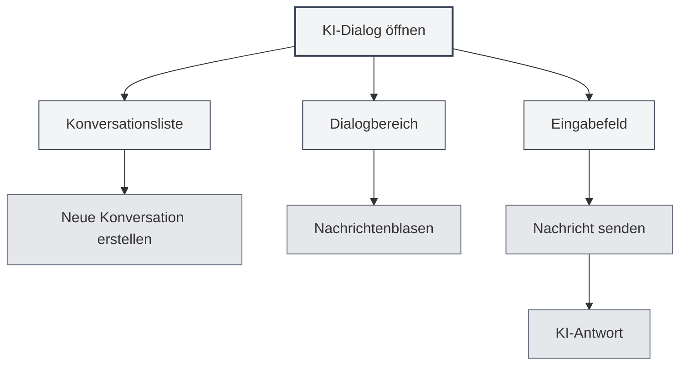
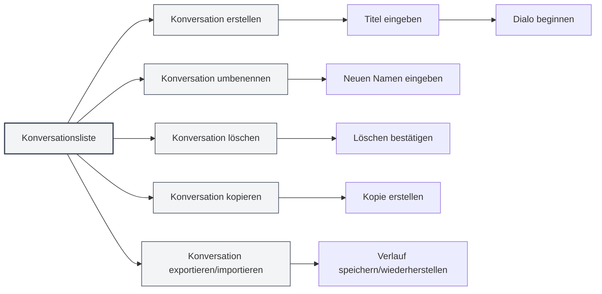
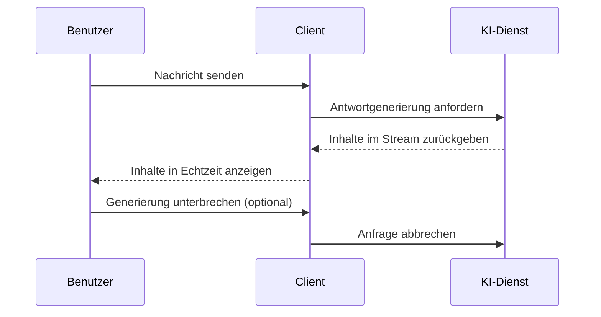
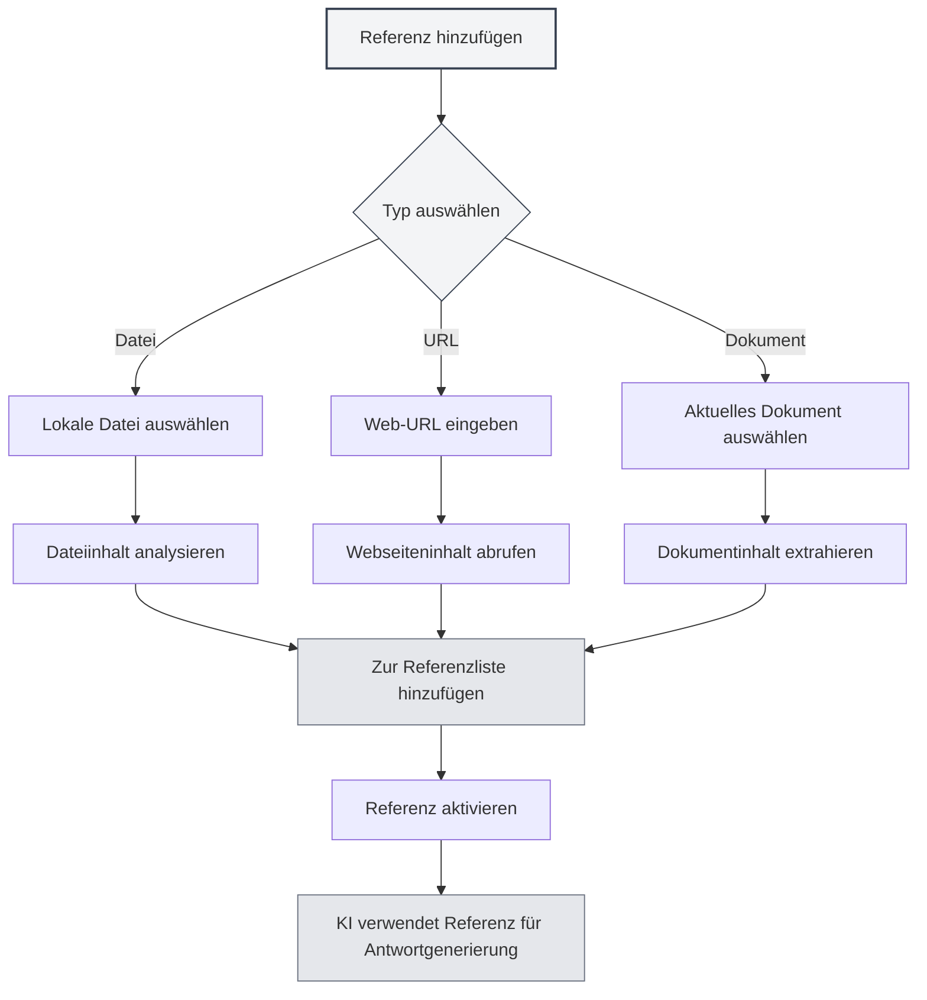

# KI-Dialog

## Übersicht

Die KI-Dialogfunktion bietet einen intelligenten Dialogassistenten, der Ihnen bei der Beantwortung von Fragen, der Erstellung von Inhalten, der Analyse von Dokumenten usw. helfen kann. Durch den KI-Dialog können Sie in natürlicher Sprache mit der KI interagieren und intelligente Hilfe und Ratschläge erhalten.

Der KI-Dialog unterstützt Funktionen wie die Verwaltung mehrerer Konversationen, das Referenzieren von Materialien und die Integration von Wissensdatenbanken, sodass Sie KI effizient zur Unterstützung bei verschiedenen Aufgaben nutzen können.

## KI-Dialog öffnen

### Öffnungsmethoden

Es gibt mehrere Möglichkeiten, den KI-Dialog zu öffnen:

- **Menüleiste**: Klicken Sie auf das Menü "KI" und wählen Sie "KI-Dialog"
- **Tastenkombination**: Verwenden Sie die Tastenkombination zum schnellen Öffnen (falls konfiguriert)
- **Seitenleiste**: Öffnen Sie das KI-Dialog-Panel über die Seitenleiste

Sie können über das KI-Assistenten-Menü in der oberen Menüleiste auf die KI-Dialogfunktion zugreifen:

<MenuItemsDemo mode="demo" :items='[{"id": "ai-assistant", "items": ["ai-chat"]}]' />

### Benutzeroberfläche

Die KI-Dialogoberfläche umfasst folgende Teile:

<AIChat mode="demo" />

- **Konversationsliste**: Links wird die Liste aller Konversationen angezeigt
- **Dialogbereich**: In der Mitte werden die Dialognachrichten angezeigt
- **Eingabefeld**: Unten können Sie Nachrichten eingeben
- **Referenzverwaltung**: Verwalten Sie Referenzmaterialien

## Konversationsverwaltung

Der KI-Dialog unterstützt die Verwaltung mehrerer Konversationen. Sie können Konversationen erstellen, umbenennen, löschen und kopieren.

<AIChat mode="demo" />

### Konversation erstellen

Erstellen Sie eine neue KI-Dialogkonversation:

1. **Auf "Neu" klicken**: Klicken Sie auf die Schaltfläche "Neue Konversation" über der Konversationsliste
2. **Titel eingeben**: Optional einen Konversationstitel eingeben (standardmäßig wird die erste Nachricht verwendet)
3. **Dialog beginnen**: Geben Sie die erste Nachricht ein, um den Dialog zu beginnen

### Konversationsaktionen

### Konversation umbenennen

Benennen Sie eine bestehende Konversation um:

1. **Kontextmenü**: Klicken Sie mit der rechten Maustaste auf die Konversation und wählen Sie "Umbenennen"
2. **Neuen Namen eingeben**: Geben Sie einen neuen Konversationsnamen ein
3. **Speichern bestätigen**: Bestätigen Sie, um den neuen Namen zu speichern

### Konversation löschen

Löschen Sie nicht benötigte Konversationen:

1. **Kontextmenü**: Klicken Sie mit der rechten Maustaste auf die Konversation und wählen Sie "Löschen"
2. **Löschen bestätigen**: Bestätigen Sie, um die Konversation zu löschen

Das Löschen einer Konversation entfernt gleichzeitig den gesamten Nachrichtenverlauf dieser Konversation.

### Konversation kopieren

Kopieren Sie eine bestehende Konversation:

1. **Kontextmenü**: Klicken Sie mit der rechten Maustaste auf die Konversation und wählen Sie "Kopieren"
2. **Kopie erstellen**: Das System erstellt eine neue Kopie der Konversation

Das Kopieren einer Konversation kopiert den gesamten Nachrichtenverlauf, sodass Sie die Diskussion basierend auf einem bestehenden Dialog fortsetzen können.

### Konversation exportieren/importieren

Exportieren und importieren Sie Konversationen:

- **Konversation exportieren**: Klicken Sie mit der rechten Maustaste auf die Konversation, wählen Sie "Exportieren" und speichern Sie sie als JSON-Datei
- **Konversation importieren**: Importieren Sie eine Konversation aus einer Datei, um den Nachrichtenverlauf wiederherzustellen

Die Export-/Importfunktion erleichtert Ihnen das Sichern und Teilen von Dialoginhalten.

<MenuItemsDemo mode="demo" :items='[{"id": "file", "items": ["save", "open"]}]' />

## Nachrichten senden

Der KI-Dialog bietet umfangreiche Funktionen zum Senden von Nachrichten.

<AIChat mode="demo" />

### Nachricht eingeben

Geben Sie eine Nachricht in das Eingabefeld ein:

1. **Text eingeben**: Geben Sie Ihre Frage oder Anfrage in das Eingabefeld ein
2. **Formatieren**: Unterstützt Markdown-Formatierung, Text kann formatiert werden
3. **Nachricht senden**: Klicken Sie auf die Senden-Schaltfläche oder drücken Sie `Enter`, um zu senden

### Nachrichtentypen

Folgende Nachrichtentypen werden unterstützt:

- **Textnachrichten**: Einfache Textnachrichten
- **Markdown-Nachrichten**: Nachrichten mit Markdown-Formatierung
- **Code-Nachrichten**: Nachrichten, die Code enthalten

### Tastenkombinationen

Tastenkombinationen zum Senden von Nachrichten:

- **Enter**: Nachricht senden
- **Shift+Enter**: Zeilenumbruch (nicht senden)
- **Strg+Enter**: Nachricht senden (unter bestimmten Konfigurationen)

## KI-Antwort

Die KI-Antwortfunktion bietet Streaming-Ausgabe und Nachrichtenbearbeitungsfunktionen.

<AIChat mode="demo" />

<AIChat mode="demo" />

### Streaming-Ausgabe

KI-Antworten erfolgen als Streaming-Ausgabe:

- **Echtzeitanzeige**: Von der KI generierte Inhalte werden in Echtzeit angezeigt
- **Schrittweise Generierung**: Inhalte werden schrittweise generiert, kein Warten auf Fertigstellung erforderlich
- **Unterbrechbar**: Die KI-Generierung kann jederzeit unterbrochen werden

### Nachrichtenaktionen

Für KI-Antworten sind folgende Aktionen möglich:

- **Kopieren**: KI-Antwortinhalt kopieren
- **Neu generieren**: KI-Antwort neu generieren
- **Bearbeiten**: KI-Antwort bearbeiten (falls unterstützt)
- **Löschen**: KI-Antwort löschen

### Nachrichtenbearbeitung

Bearbeiten Sie Benutzernachrichten:

1. **Auf "Bearbeiten" klicken**: Klicken Sie auf die Bearbeiten-Schaltfläche neben der Nachricht
2. **Inhalt ändern**: Ändern Sie den Nachrichteninhalt
3. **Erneut senden**: Senden Sie die geänderte Nachricht erneut

Das Bearbeiten einer Nachricht löscht alle darauf folgenden Nachrichten und startet den Dialog neu.

## Referenzmaterialien

Sie können dem KI-Dialog Referenzmaterialien hinzufügen, um der KI zu helfen, den Kontext besser zu verstehen.

<AIChat mode="demo" />

### Referenz hinzufügen

Fügen Sie einer Konversation Referenzmaterialien hinzu:

1. **Referenzverwaltung öffnen**: Klicken Sie auf das Referenz-Label über dem Dialogbereich
2. **Referenz hinzufügen**: Klicken Sie auf die Schaltfläche "Referenz hinzufügen"
3. **Typ auswählen**: Wählen Sie den Referenztyp (Datei, URL usw.)
4. **Inhalt auswählen**: Wählen Sie den zu referenzierenden Inhalt aus

### Referenztypen

Folgende Referenztypen werden unterstützt:

- **Dateireferenz**: Verweist auf lokale Dateien
- **URL-Referenz**: Verweist auf Web-URLs
- **Dokumentreferenz**: Verweist auf aktuell geöffnete Dokumente

### Referenz aktivieren

Referenzen aktivieren und deaktivieren:

- **Referenz aktivieren**: Klicken Sie auf das Referenz-Label, um die Referenz zu aktivieren
- **Referenz deaktivieren**: Erneut klicken, um die Referenz zu deaktivieren
- **Aktivierungsstatus**: Aktivierte Referenzen werden bei der KI-Antwort verwendet

Nach der Aktivierung einer Referenz berücksichtigt die KI den Referenzinhalt bei der Generierung der Antwort.

### Referenzvorschau

Referenzinhalt in der Vorschau anzeigen:

- **Auf Vorschau klicken**: Klicken Sie auf das Referenz-Label, um den Referenzinhalt anzuzeigen
- **Details anzeigen**: Zeigen Sie detaillierte Informationen zur Referenz an
- **Referenz bearbeiten**: Referenz bearbeiten oder löschen

## Wissensdatenbank-Integration

Der KI-Dialog kann mit Wissensdatenbanken integriert werden, um automatisch relevantes Wissen abzurufen.

<KnowledgeBase mode="demo" />

<AIChat mode="demo" />

### Wissensdatenbank aktivieren

Aktivieren Sie die Wissensdatenbankabfrage:

1. **Einstellungen öffnen**: Finden Sie den Wissensdatenbank-Schalter unterhalb des Eingabefelds
2. **Abfrage aktivieren**: Schalten Sie den Schalter um, um die Wissensdatenbankabfrage zu aktivieren
3. **Automatische Suche**: Bei KI-Antworten wird automatisch die Wissensdatenbank durchsucht

### Wissensdatenbanksuche

Funktionen der Wissensdatenbanksuche:

- **Automatische Suche**: Beim Senden einer Nachricht wird automatisch nach relevantem Wissen gesucht
- **Kontextverständnis**: Sucht nach relevanten Inhalten basierend auf dem Dialogkontext
- **Ergebnisintegration**: Integriert Suchergebnisse in die KI-Antwort

### Sucheinstellungen

Einstellungen für die Wissensdatenbanksuche:

- **Konfidenzschwelle**: Legen Sie die Konfidenzschwelle für die Suche fest
- **Anzahl der Ergebnisse**: Legen Sie die Anzahl der Suchergebnisse fest
- **Suchbereich**: Legen Sie den Suchbereich fest

Details siehe [[knowledge-base.config|Wissensdatenbank-Konfiguration]].

## Nachrichtenverwaltung

Verwalten Sie Nachrichten im KI-Dialog.

<AIChat mode="demo" />

### Nachrichtenaktionen

Für Nachrichten sind folgende Aktionen möglich:

- **Nachricht kopieren**: Nachrichteninhalt kopieren
- **Nachricht bearbeiten**: Benutzernachricht bearbeiten
- **Nachricht löschen**: Nachricht löschen
- **Neu generieren**: KI-Antwort neu generieren

### Nachrichtenverlauf

Verwaltung des Nachrichtenverlaufs:

- **Automatische Speicherung**: Der Nachrichtenverlauf wird automatisch gespeichert
- **Konversationsisolierung**: Der Nachrichtenverlauf jeder Konversation ist unabhängig
- **Verlaufswiederherstellung**: Beim erneuten Öffnen einer Konversation wird der Verlauf wiederhergestellt

### Nachrichtenformate

Nachrichten unterstützen folgende Formate:

<AIChat mode="demo" />

- **Markdown**: Unterstützt Markdown-Formatierung
- **Codeblöcke**: Unterstützt Syntaxhervorhebung für Codeblöcke
- **Mathematische Formeln**: Unterstützt LaTeX-Mathematikformeln
- **Tabellen**: Unterstützt die Tabellenanzeige

## Anwendungstipps

Mit den folgenden Tipps können Sie die KI-Dialogfunktion effizienter nutzen.

<AIChat mode="demo" />

### Effiziente Dialogführung

1. **Klare Fragen stellen**: Stellen Sie klare Fragen, um bessere Antworten zu erhalten
2. **Kontext bereitstellen**: Stellen Sie ausreichend Kontextinformationen bereit
3. **Referenzen nutzen**: Verwenden Sie Referenzmaterialien, um mehr Informationen bereitzustellen

### Konversationsorganisation

1. **Kategorien verwalten**: Erstellen Sie für verschiedene Themen separate Konversationen
2. **Namenskonventionen**: Verwenden Sie klare Konversationsnamen
3. **Regelmäßige Bereinigung**: Löschen Sie regelmäßig nicht benötigte Konversationen

### Wissensdatenbanknutzung

1. **Relevante Dokumente hinzufügen**: Fügen Sie relevante Dokumente zur Wissensdatenbank hinzu
2. **Abfrage aktivieren**: Aktivieren Sie die Wissensdatenbankabfrage für bessere Antworten
3. **Einstellungen anpassen**: Passen Sie die Sucheinstellungen nach Bedarf an

## Häufig gestellte Fragen

<AIChat mode="demo" />

<MenuItemsDemo mode="demo" :items='[{"id": "ai-assistant"}]' />

### F: KI-Antworten sind ungenau?

A: KI-Antworten basieren auf Trainingsdaten und können ungenau sein. Sie können die Genauigkeit verbessern, indem Sie mehr Kontextinformationen bereitstellen oder Referenzmaterialien verwenden.

### F: Wie unterbricht man die KI-Generierung?

A: Klicken Sie auf die "Abbrechen"-Schaltfläche, um die KI-Generierung zu unterbrechen. Bereits generierte Inhalte gehen nicht verloren.

### F: Nachrichtenverlauf verloren?

A: Der Nachrichtenverlauf wird automatisch gespeichert. Bei Verlust prüfen Sie, ob die Konversation gelöscht oder Daten gelöscht wurden.

### F: Wie verbessert man die Antwortqualität?

A: Klaren Kontext bereitstellen, Referenzmaterialien verwenden und die Wissensdatenbankabfrage aktivieren können die Antwortqualität verbessern.

### F: Welche LLMs werden unterstützt?

A: Es werden verschiedene LLMs unterstützt, darunter OpenAI, Ollama, DeepSeek usw. Details siehe [[ai.llm-config|LLM-Konfiguration]].

## Verwandte Dokumentation

- [[ai.proofread|KI-Korrekturlesen]]
- [[ai.completion|KI
