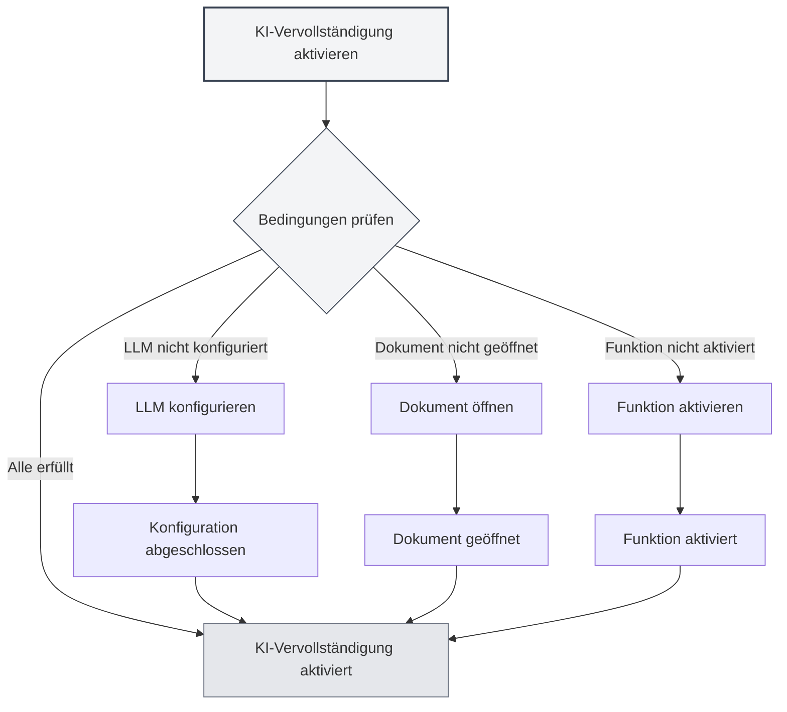
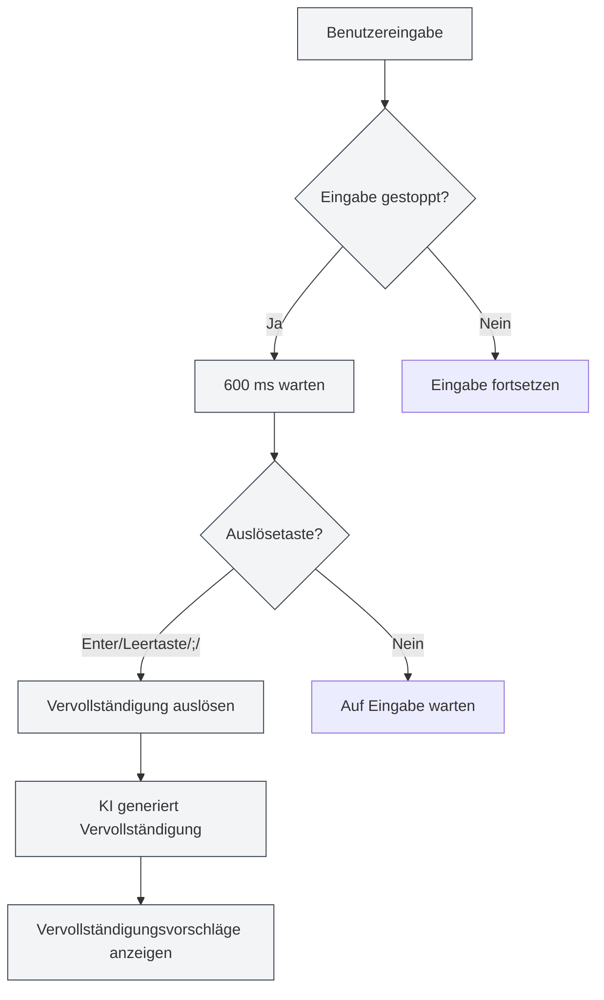
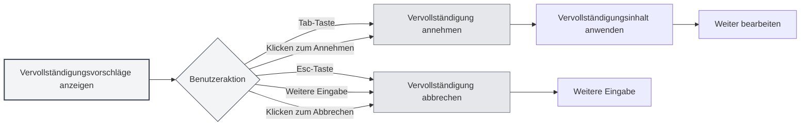

# KI-Autovervollständigung

## Übersicht

Die KI-Autovervollständigungsfunktion nutzt KI-Technologie, um automatisch den von Ihnen eingegebenen Inhalt zu vervollständigen. Wenn Sie mit der Eingabe pausieren, generiert die KI basierend auf dem Kontext automatisch Vervollständigungsvorschläge, um Ihnen beim schnellen Verfassen von Dokumenten zu helfen.

Die KI-Autovervollständigung unterstützt verschiedene Dokumentformate (Markdown, LaTeX, Klartext) und kann den Kontext intelligent verstehen, um Vorschläge zu generieren, die zum Stil und Inhalt des Dokuments passen.

## KI-Vervollständigung aktivieren

### Aktivierungsmethoden

Es gibt mehrere Möglichkeiten, die KI-Autovervollständigung zu aktivieren:

- **Kontextmenü**: Klicken Sie mit der rechten Maustaste im Editor und wählen Sie "KI-Autovervollständigung aktivieren"
- **Einstellungsseite**: Aktivieren Sie die KI-Autovervollständigungsfunktion in den Einstellungen
- **Tastenkombination**: Verwenden Sie eine Tastenkombination zum schnellen Umschalten (falls konfiguriert)

Sie können über die obere Menüleiste auf die Einstellungen zugreifen:

<MenuItemsDemo mode="demo" :items='[{"id": "settings"}]' />

<CompletionSettingsPanel mode="demo" />

### Aktivierungsvoraussetzungen

Um die KI-Autovervollständigung zu aktivieren, müssen folgende Bedingungen erfüllt sein:

- **LLM konfiguriert**: Ein LLM-Dienst muss konfiguriert sein
- **Dokument geöffnet**: Ein Dokument muss im Editor geöffnet sein
- **Funktion aktiviert**: Die KI-Vervollständigungsfunktion muss in den Einstellungen aktiviert sein

Siehe auch [[ai.llm-config|LLM-Konfiguration]].

<CompletionSettingsPanel mode="demo" />

## Automatische Auslösung

<AISuggestionGhost mode="demo" />

### Auslösebedingungen

Die KI-Autovervollständigung wird automatisch in folgenden Situationen ausgelöst:

- **Eingabe stoppt**: Wird automatisch ausgelöst, nachdem die Eingabe für 600 ms pausiert
- **Auslösetasten**: Wird durch Eingabe bestimmter Tasten ausgelöst (Enter, Leertaste, `;`, `,` usw.)

### Auslöseverzögerung

Einstellungen für die Auslöseverzögerung:

- **Standardverzögerung**: 600 ms (0,6 Sekunden)
- **Konfigurierbar**: Die Verzögerungszeit kann in den Einstellungen angepasst werden
- **Abwägung**: Zu kurze Verzögerung löst zu häufig aus, zu lange Verzögerung beeinträchtigt das Erlebnis

<CompletionSettingsPanel mode="demo" />

### Auslösetasten

Unterstützte Auslösetasten:

- **Enter**: Auslösung durch die Eingabetaste
- **Leertaste**: Auslösung durch die Leertaste
- **;**: Auslösung durch Semikolon
- **,**: Auslösung durch Komma

Die Auslösetasten können in den Einstellungen konfiguriert werden, mehrere Tasten können gleichzeitig aktiviert sein.

## Manuelle Auslösung

<AISuggestionGhost mode="demo" />

### Auslösemethoden

Methoden zur manuellen Auslösung der Vervollständigung:

- **Tastenkombination**: Drücken Sie `Umschalt+Tab`, um die Vervollständigung manuell auszulösen
- **Kontextmenü**: Rechtsklick und Auswahl von "Vervollständigung manuell auslösen"

Die manuelle Auslösung startet die Vervollständigung sofort und überspringt die Verzögerung der automatischen Auslösung.

<CompletionSettingsPanel mode="demo" />

### Anwendungsfälle

Geeignete Szenarien für die manuelle Auslösung:

- **Sofortige Vervollständigung benötigt**: Sofortige Vervollständigungsvorschläge werden benötigt
- **Automatische Auslösung fehlgeschlagen**: Die automatische Auslösung hat nicht funktioniert
- **Spezifische Position**: An einer bestimmten Position wird eine Vervollständigung benötigt

## Vervollständigungsinhalt

<AISuggestionGhost mode="demo" />

### Kontextverständnis

Die KI-Vervollständigung versteht folgenden Kontext:

- **Aktueller Absatz**: Versteht den Inhalt des aktuellen Absatzes
- **Dokumentstruktur**: Versteht die Gesamtstruktur des Dokuments
- **Dokumentstil**: Versteht den Schreibstil des Dokuments
- **Dokumentthema**: Versteht das Thema und den Inhalt des Dokuments

### Vervollständigungsmodi

Die KI-Vervollständigung unterstützt zwei Modi:

- **Vollständige Generierung**: Generiert vollständigen Vervollständigungsinhalt
- **Teilweise Generierung**: Generiert nur teilweisen Inhalt (je nach Einstellung)

Der Vervollständigungsmodus kann in den Einstellungen konfiguriert werden.

<CompletionSettingsPanel mode="demo" />

### Vervollständigungslänge

Steuerung der Länge des Vervollständigungsinhalts:

- **Maximale Token-Anzahl**: Die maximale Anzahl von Token für die Vervollständigung kann eingestellt werden
- **Standardwert**: 50 Token
- **Bereich**: 20 Token bis unbegrenzt (0 bedeutet unbegrenzt)

Je mehr Token, desto mehr Inhalt wird vervollständigt, aber die Generierungszeit wird auch länger.

<CompletionSettingsPanel mode="demo" />

## Vervollständigung annehmen

<AISuggestionGhost mode="demo" />

### Annahmemethoden

Methoden zum Annehmen von Vervollständigungsvorschlägen:

- **Tab-Taste**: Drücken Sie die `Tab`-Taste, um den Vorschlag anzunehmen
- **Klicken zum Annehmen**: Klicken Sie auf die Schaltfläche "Annehmen" beim Vervollständigungsvorschlag

### Vervollständigung abbrechen

Methoden zum Abbrechen von Vervollständigungsvorschlägen:

- **Esc-Taste**: Drücken Sie die `Esc`-Taste, um den Vorschlag abzubrechen
- **Weitere Eingabe**: Weitere Eingabe bricht die Vervollständigung automatisch ab
- **Klicken zum Abbrechen**: Klicken Sie auf die Schaltfläche "Abbrechen" beim Vervollständigungsvorschlag

### Vervollständigung bearbeiten

Nach dem Annehmen kann die Vervollständigung weiter bearbeitet werden:

- **Direkte Bearbeitung**: Nach dem Annehmen kann der Inhalt direkt bearbeitet werden
- **Teilweise Annahme**: Nur ein Teil des Vervollständigungsinhalts kann angenommen werden
- **Vervollständigung anpassen**: Der Vervollständigungsinhalt kann vor der Verwendung angepasst werden

## Wissensdatenbank-Integration

### Wissensdatenbank aktivieren

So aktivieren Sie die Wissensdatenbank-Integration:

1. **Einstellungen öffnen**: Aktivieren Sie die Wissensdatenbank-Integration in den Einstellungen
2. **Wissensdatenbank konfigurieren**: Konfigurieren Sie die relevanten Einstellungen für die Wissensdatenbank
3. **Automatische Suche**: Bei der Vervollständigung wird automatisch die Wissensdatenbank durchsucht

Siehe auch [[knowledge-base.config|Wissensdatenbank-Konfiguration]].

### Kontextsuche

Funktionen der Wissensdatenbanksuche:

- **Automatische Suche**: Automatische Suche in der Wissensdatenbank bei Vervollständigung
- **Semantische Übereinstimmung**: Findet relevante Inhalte basierend auf semantischer Ähnlichkeit
- **Ergebnisintegration**: Integriert Suchergebnisse in die Vervollständigungsvorschläge

### Sucheinstellungen

Einstellungen für die Wissensdatenbanksuche:

- **Konfidenzschwelle**: Legt die Konfidenzschwelle für die Suche fest
- **Anzahl der Ergebnisse**: Legt die Anzahl der Suchergebnisse fest
- **Suchbereich**: Legt den Suchbereich fest

## Vervollständigungseinstellungen

### Grundeinstellungen

Grundeinstellungen für die KI-Vervollständigung:

- **Aktivieren/Deaktivieren**: KI-Vervollständigungsfunktion aktivieren oder deaktivieren
- **Auslöseverzögerung**: Verzögerungszeit für die automatische Auslösung einstellen
- **Auslösetasten**: Auslösetasten konfigurieren
- **Maximale Token-Anzahl**: Maximale Anzahl von Token für die Vervollständigung einstellen

<CompletionSettingsPanel mode="demo" />

### Erweiterte Einstellungen

Erweiterte Einstellungen für die KI-Vervollständigung:

- **Vervollständigungsmodus**: Vervollständigungsmodus auswählen (vollständige/teilweise Generierung)
- **Kontextlänge**: Länge des für die Vervollständigung verwendeten Kontexts einstellen
- **Temperatureinstellung**: Temperaturparameter für die KI-Generierung einstellen
- **Wissensdatenbank-Integration**: Optionen für die Wissensdatenbank-Integration konfigurieren

<CompletionSettingsPanel mode="demo" />

### Formateinstellungen

Vervollständigungseinstellungen für verschiedene Formate:

- **Markdown**: Vervollständigungseinstellungen für Markdown-Format
- **LaTeX**: Vervollständigungseinstellungen für LaTeX-Format
- **Klartext**: Vervollständigungseinstellungen für Klartext-Format

Verschiedene Formate können unterschiedliche Vervollständigungsstrategien und Einstellungen haben.

## Anwendungstipps

### Vervollständigungsqualität verbessern

1. **Kontext bereitstellen**: Stellen Sie ausreichend Kontextinformationen im Dokument bereit
2. **Wissensdatenbank aktivieren**: Aktivieren der Wissensdatenbank-Integration kann die Qualität verbessern
3. **Einstellungen anpassen**: Passen Sie die Vervollständigungseinstellungen an Ihre Bedürfnisse an

### Effiziente Nutzung

1. **Angemessene Nutzung**: Verlassen Sie sich nicht übermäßig auf die KI-Vervollständigung
2. **Inhalt prüfen**: Überprüfen Sie nach dem Annehmen, ob der Inhalt korrekt ist
3. **Manuelle Anpassung**: Passen Sie den Vervollständigungsinhalt bei Bedarf manuell an

### Probleme vermeiden

1. **Häufige Auslösung vermeiden**: Vermeiden Sie häufige Auslösungen, die das Eingabeerlebnis beeinträchtigen
2. **Genauigkeit prüfen**: Überprüfen Sie die Genauigkeit des Vervollständigungsinhalts
3. **Rechtzeitig abbrechen**: Brechen Sie unnötige Vervollständigungen rechtzeitig ab

## Häufig gestellte Fragen

### F: Vervollständigung ungenau?

A: Die KI-Vervollständigung basiert auf Kontext und Trainingsdaten und kann ungenau sein. Sie können mehr Kontextinformationen bereitstellen oder die Wissensdatenbank-Integration aktivieren, um die Genauigkeit zu verbessern.

### F: Vervollständigung langsam?

A: Die Geschwindigkeit hängt von der Antwortzeit des KI-Dienstes ab. Sie können die Vervollständigungseinstellungen anpassen oder einen schnelleren LLM-Dienst verwenden.

### F: Wie schalte ich die Autovervollständigung aus?

A: Deaktivieren Sie die KI-Autovervollständigungsfunktion in den Einstellungen oder über das Kontextmenü.

### F: Kann ich Auslösetasten anpassen?

A: Ja. Konfigurieren Sie die Auslösetasten in den Einstellungen, mehrere Tasten können gleichzeitig aktiviert sein.

### F: Vervollständigungsinhalt zu lang?

A: Sie können die maximale Token-Anzahl für die Vervollständigung in den Einstellungen anpassen, um die Länge des Inhalts zu begrenzen.

## Verwandte Dokumente

- [[ai.chat|KI-Chat]]
- [[ai.proofread|KI-Korrekturlesen]]
- [[knowledge-base.config|Wissensdatenbank-Konfiguration]]
- [[ai.llm-config|LLM-Konfiguration]]
