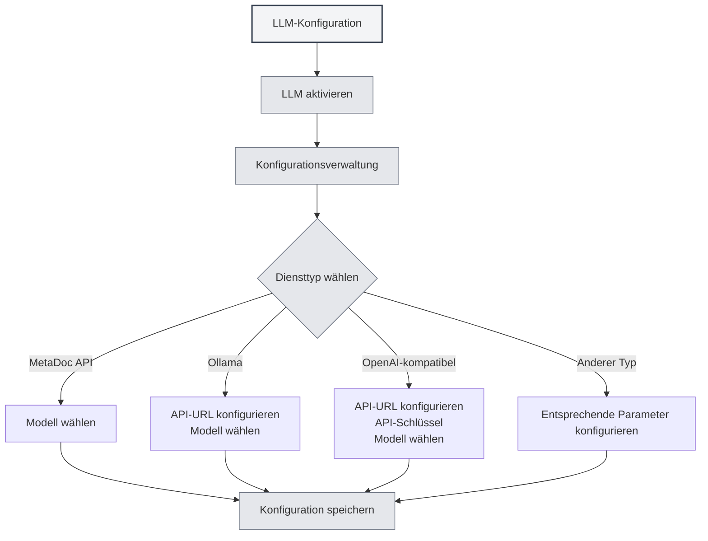

# LLM-Konfigurationsanleitung

## Übersicht

LLM (Large Language Models) bilden die gemeinsame Grundlage für KI-Funktionen in MetaDoc wie KI-Chat, Korrekturlesen, Vervollständigung, Assistenten und Agenten. Dieser Artikel erklärt, warum eine LLM-Konfiguration notwendig ist, welche Funktionen davon betroffen sind und wie Sie zur spezifischen Konfigurationsoberfläche gelangen.

<Demo component="SettingLlmSection" mode="demo" />

## Warum eine LLM-Konfiguration notwendig ist

- **API-Aufrufe**: Funktionen wie Chat, Vervollständigung und Korrekturlesen rufen die von Ihnen gewählte LLM-Schnittstelle auf und erfordern eine korrekte Konfiguration von Adresse und Schlüssel.
- **Modellunterschiede**: Verschiedene Modelle unterscheiden sich erheblich in Qualität, Geschwindigkeit und Kosten. Die Auswahl eines geeigneten Modells für den jeweiligen Anwendungsfall verbessert das Nutzererlebnis und hilft, Kosten zu kontrollieren.
- **Zentraler Zugang**: Im [[settings.llm|LLM-Konfigurationsbereich]] können Sie den Aktivierungsstatus, die Temperatur, Inferenz-Labels usw. zentral verwalten. Eine einmalige Einstellung wirkt sich auf alle KI-Funktionen aus.

## Welche Funktionen von der Konfiguration betroffen sind

Nachdem Sie einen LLM konfiguriert und aktiviert haben, wirkt sich dies auf folgende Fähigkeiten aus:

| Funktion        | Erläuterung                 |
| --------------- | --------------------------- | ------------------------------------------------------------ |
| **KI-Chat**     | [[ai.chat                   | KI-Chat-Funktion]]: Mehrrunden-Dialoge mit der KI, kontextbasierte Antworten |
| **KI-Korrektur**| [[ai.proofread              | KI-Korrekturlese-Funktion]]: Grammatik- und Rechtschreibprüfung, Änderungsvorschläge |
| **KI-Vervollständigung** | [[ai.completion      | KI-Autovervollständigung]]: Intelligente Fortsetzung und Vervollständigung beim Schreiben |
| **KI-Assistent**| [[ai.assistants             | KI-Assistenten-Funktion]]: Formelerkennung, Zeichenassistent, Datenanalyse usw. |
| **Agent**       | [[agent.introduction        | Agenten-Framework]]: Konversation, Werkzeugaufrufe, Workflow-Ausführung |

Wenn der LLM deaktiviert ist oder kein nutzbarer Dienst konfiguriert wurde, sind die oben genannten Funktionen nicht verfügbar oder es erscheint ein Hinweis, die Konfiguration zuerst abzuschließen.

## Wie Sie einen LLM konfigurieren

### Auf die Konfigurationsseite gelangen

1. Öffnen Sie **Einstellungen** → **LLM-Konfiguration** (oder den entsprechenden Einstiegspunkt in der App).
2. Auf der Seite **[[settings.llm|LLM-Konfiguration]]** können Sie:
   - Den LLM aktivieren/deaktivieren
   - Globale Optionen wie Temperatur, automatisches Entfernen von Inferenz-Labels usw. festlegen
   - Mehrere LLM-Konfigurationen verwalten (erstellen, bearbeiten, löschen, sortieren)

Sie können auf die LLM-Einstellungen über die obere Menüleiste zugreifen:

<MenuItemsDemo mode="demo" :items='[{"id": "settings"}]' />

<MenuItemsDemo mode="demo" :items='[{"id": "ai"}]' />

### Spezifischen Dienst konfigurieren

Wählen Sie im Bereich **LLM-Konfigurationsverwaltung** eine bestehende Konfiguration aus oder erstellen Sie eine neue und füllen Sie die Felder entsprechend dem Diensttyp aus:

- **MetaDoc API / Ollama / OpenAI-kompatibel / OpenAI offiziell / DeepSeek / Gemini** usw.  
  Detaillierte Felder und Schritte finden Sie unter [[settings.llm-types|LLM-Typ-Konfiguration]] (API-Adresse, API-Schlüssel, Modellname, maximale Token-Anzahl usw.).

### Nutzungsempfehlungen

- **Erstnutzung**: Schließen Sie zuerst eine funktionsfähige LLM-Konfiguration ab und speichern Sie sie, bevor Sie **LLM aktivieren** einschalten.
- **Mehrfachkonfigurationen**: Sie können mehrere Konfigurationen für verschiedene Szenarien erstellen (z.B. "Alltags-Chat", "Nur Korrekturlesen") und in der entsprechenden Funktion oder Agenten-Konfiguration auswählen.
- **Kosten und Datenschutz**: Die Nutzung von Cloud-APIs verursacht Kosten und kann Inhalte hochladen. Wenn lokaler Betrieb und Datenschutz Priorität haben, sollten Sie lokale Bereitstellungsmethoden wie Ollama bevorzugen (siehe [[settings.llm-types|LLM-Typ-Konfiguration]]).

## Verwandte Dokumentation

- [[settings.llm|LLM-Konfiguration]]
- [[settings.llm-types|LLM-Typ-Konfiguration]]
- [[settings.llm-management|LLM-Konfigurationsverwaltung]]
- [[ai.chat|KI-Chat-Funktion]]
- [[agent.introduction|Agenten-Framework-Übersicht]]

<AIChat mode="demo" />
