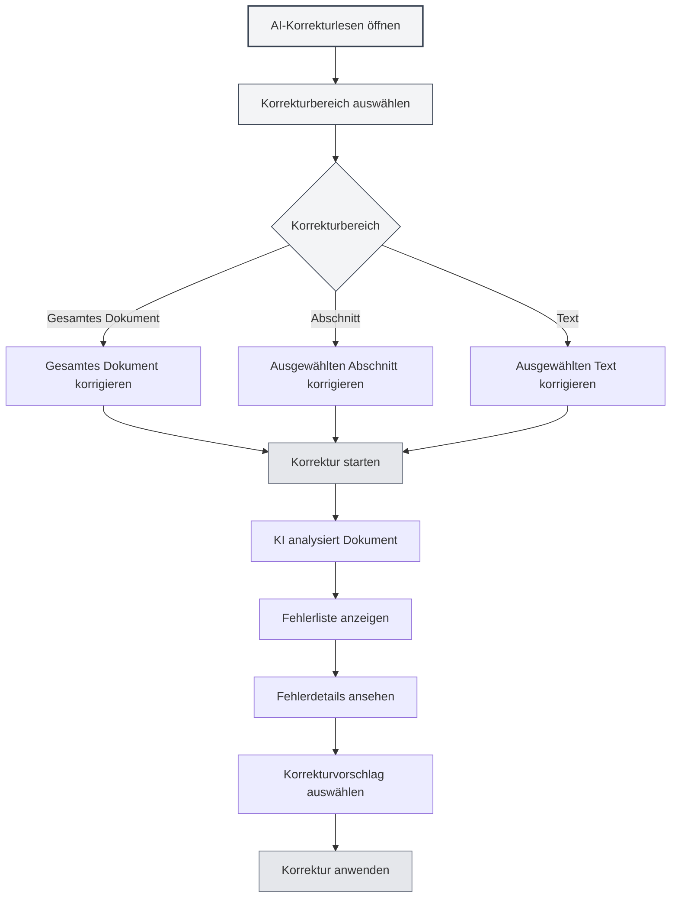
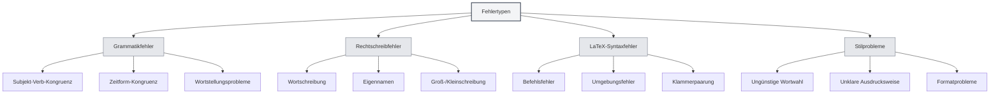
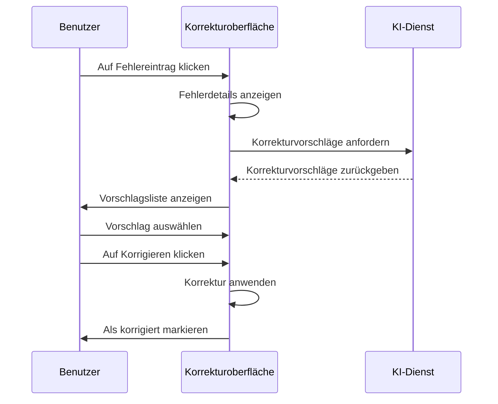

# AI-Korrekturlesen

## Übersicht

Die AI-Korrekturlese-Funktion nutzt KI-Technologie, um Dokumente automatisch auf Grammatikfehler, Rechtschreibfehler, LaTeX-Syntaxfehler und andere Probleme zu überprüfen und bietet Korrekturvorschläge an. Durch das AI-Korrekturlesen können Sie Fehler in Ihren Dokumenten schnell finden und beheben, um die Dokumentqualität zu verbessern.

AI-Korrekturlesen unterstützt verschiedene Dokumentformate (Markdown, LaTeX, reiner Text), kann das gesamte Dokument oder bestimmte Abschnitte prüfen und liefert detaillierte Fehlerinformationen und Korrekturvorschläge.

## AI-Korrekturlesen öffnen

### Öffnungsmethoden

Es gibt mehrere Möglichkeiten, das AI-Korrekturlesen zu öffnen:

- **Menüleiste**: Klicken Sie auf das "AI"-Menü und wählen Sie "AI-Korrekturlesen"
- **Tastenkürzel**: Verwenden Sie das Tastenkürzel zum schnellen Öffnen (falls konfiguriert)
- **Seitenleiste**: Öffnen Sie das AI-Korrekturlesen-Panel über die Seitenleiste

Sie können über das AI-Assistenten-Menü in der oberen Menüleiste auf die AI-Korrekturlese-Funktion zugreifen:

<MenuItemsDemo mode="demo" :items='[{"id": "ai-assistant", "items": ["proofread"]}]' />

### Benutzeroberfläche

Die AI-Korrekturlese-Oberfläche besteht aus folgenden Teilen:

- **Fehlerliste**: Links werden alle Fehler angezeigt
- **Dokumentvorschau**: Rechts wird der Dokumentinhalt angezeigt
- **Fehlerstatistik**: Oben werden Fehlerstatistiken angezeigt
- **Aktionsschaltflächen**: Oben stehen Aktionsschaltflächen zur Verfügung

<ProofreadView mode="demo" />

<ProofreadDisplay mode="demo" />

## Korrekturbereich

### Gesamtes Dokument korrigieren

Das gesamte Dokument korrigieren:

1. **Korrektur öffnen**: AI-Korrekturlesen-Panel öffnen
2. **Auf Start klicken**: Auf "Korrektur starten" klicken
3. **Auf Fertigstellung warten**: Warten, bis die KI die Korrektur abgeschlossen hat

Die Korrektur des gesamten Dokuments prüft automatisch alle Inhalte im Dokument.

<ProofreadView mode="demo" />

<ProofreadDisplay mode="demo" />

### Bestimmten Abschnitt korrigieren

Einen bestimmten Abschnitt des Dokuments korrigieren:

1. **Abschnitt auswählen**: Im Gliederungsansicht den zu korrigierenden Abschnitt auswählen
2. **Korrektur öffnen**: AI-Korrekturlesen-Panel öffnen
3. **Abschnitt angeben**: In den Korrektureinstellungen den Abschnittspfad angeben
4. **Korrektur starten**: Auf "Korrektur starten" klicken

Die Korrektur eines bestimmten Abschnitts prüft nur den Inhalt des ausgewählten Abschnitts und seiner Unterabschnitte.

<ProofreadView mode="demo" />

<ProofreadDisplay mode="demo" />

### Bestimmten Text korrigieren

Bestimmten Textinhalt korrigieren:

1. **Text auswählen**: Im Editor den zu korrigierenden Text auswählen
2. **Korrektur öffnen**: AI-Korrekturlesen-Panel öffnen
3. **Text einfügen**: Text in das Korrektureingabefeld einfügen
4. **Korrektur starten**: Auf "Korrektur starten" klicken

<ProofreadDisplay mode="demo" />

## Fehlertypen

AI-Korrekturlesen kann folgende Fehlertypen erkennen:

### Grammatikfehler

Grammatikfehler im Dokument prüfen:

<ProofreadDisplay mode="demo" />

- **Subjekt-Verb-Kongruenz**: Prüfung auf Kongruenzprobleme zwischen Subjekt und Verb
- **Zeitform-Kongruenz**: Prüfung auf Kongruenzprobleme zwischen Zeitformen
- **Wortstellungsprobleme**: Prüfung auf Wortstellungsprobleme
- **Andere Grammatik**: Prüfung auf andere Grammatikprobleme

### Rechtschreibfehler

Rechtschreibfehler im Dokument prüfen:

- **Wortschreibung**: Prüfung auf Wortschreibfehler
- **Eigennamen**: Prüfung der Schreibung von Eigennamen
- **Groß-/Kleinschreibung**: Prüfung auf Groß-/Kleinschreibungsprobleme

### LaTeX-Syntaxfehler

Syntaxfehler in LaTeX-Dokumenten prüfen:

- **Befehlsfehler**: Prüfung auf LaTeX-Befehlsfehler
- **Umgebungsfehler**: Prüfung auf LaTeX-Umgebungsfehler
- **Klammerpaarung**: Prüfung auf Klammerpaarungsprobleme
- **Andere Syntax**: Prüfung auf andere LaTeX-Syntaxprobleme

### Stilprobleme

Stilprobleme im Dokument prüfen:

- **Ungünstige Wortwahl**: Prüfung, ob die Wortwahl angemessen ist
- **Unklare Ausdrucksweise**: Prüfung, ob die Ausdrucksweise klar ist
- **Formatprobleme**: Prüfung auf Formatprobleme

## Fehlerinformationen

### Fehleranzeige

Fehlerinformationen enthalten folgende Inhalte:

<ProofreadDisplay mode="demo" />

- **Fehlertyp**: Zeigt den Fehlertyp an (Grammatik, Rechtschreibung, LaTeX usw.)
- **Fehlerposition**: Zeigt die Zeilen- und Spaltennummer des Fehlers an
- **Fehlertext**: Zeigt den fehlerhaften Textinhalt an
- **Korrekturvorschlag**: Zeigt Korrekturvorschläge an
- **Schweregrad**: Zeigt den Schweregrad des Fehlers an

### Schweregrad

Fehler werden nach Schweregrad klassifiziert:

- **Fehler (Error)**: Muss behoben werden
- **Warnung (Warning)**: Sollte behoben werden
- **Information (Info)**: Nur zur Information

### Fehlerlokalisierung

Schnelle Lokalisierung der Fehlerposition:

1. **Auf Fehler klicken**: Auf den Fehlereintrag in der Fehlerliste klicken
2. **Automatische Lokalisierung**: Der Editor scrollt automatisch zur Fehlerposition
3. **Hervorhebung**: Die Fehlerposition wird hervorgehoben

## Korrekturvorschläge

### Vorschläge ansehen

Die von der KI bereitgestellten Korrekturvorschläge ansehen:

<ProofreadDisplay mode="demo" />

- **Einzelner Vorschlag**: Wenn nur ein Vorschlag vorhanden ist, wird er direkt angezeigt
- **Mehrere Vorschläge**: Wenn mehrere Vorschläge vorhanden sind, werden sie als Tags angezeigt
- **Vorschlag auswählen**: Auf den Vorschlagstag klicken, um den Vorschlag auszuwählen

### Korrektur anwenden

Korrekturvorschläge anwenden:

<ProofreadDisplay mode="demo" />

1. **Vorschlag auswählen**: Auf den Vorschlagstag klicken, um den Vorschlag auszuwählen
2. **Auf Korrigieren klicken**: Auf die "Korrigieren"-Schaltfläche klicken
3. **Korrektur bestätigen**: Nach Bestätigung wird die Korrektur angewendet

Nach der Korrektur wird der Fehler als "korrigiert" markiert.

### Ein-Klick-Korrektur

Alle Fehler mit einem Klick korrigieren:

1. **Auf "Alle korrigieren" klicken**: Auf die "Ein-Klick-Alles-korrigieren"-Schaltfläche klicken
2. **Korrektur bestätigen**: Nach Bestätigung werden alle Fehler korrigiert

Die Ein-Klick-Korrektur verwendet den ersten Vorschlag, um alle Fehler zu korrigieren.

## Fehlerverwaltung

### Fehler ignorieren

Nicht zu korrigierende Fehler ignorieren:

1. **Fehler auswählen**: Den zu ignorierenden Fehler auswählen
2. **Auf Ignorieren klicken**: Auf die "Ignorieren"-Schaltfläche klicken
3. **Ignorieren bestätigen**: Nach Bestätigung wird der Fehler ignoriert

Ignorierte Fehler werden aus der Fehlerliste entfernt.

### Zum Wörterbuch hinzufügen

Wörter zum Wörterbuch hinzufügen:

1. **Fehler auswählen**: Rechtschreibfehler auswählen
2. **Zum Wörterbuch hinzufügen**: Auf die "Zum Wörterbuch hinzufügen"-Schaltfläche klicken
3. **Hinzufügen bestätigen**: Nach Bestätigung wird das Wort zum Wörterbuch hinzugefügt

Nach dem Hinzufügen zum Wörterbuch wird das Wort nicht mehr als Rechtschreibfehler markiert.

### Korrigierte Fehler leeren

Korrigierte Fehler leeren:

1. **Auf Leeren klicken**: Auf die "Korrigierte leeren"-Schaltfläche klicken
2. **Leeren bestätigen**: Nach Bestätigung werden korrigierte Fehler geleert

Das Leeren korrigierter Fehler macht die Fehlerliste übersichtlicher.

## Anwendungstipps

<ProofreadView mode="demo" />

### Effizientes Korrekturlesen

1. **Zuerst gesamtes Dokument**: Zuerst das gesamte Dokument korrigieren, um einen Überblick zu erhalten
2. **Dann Abschnitte**: Problemabschnitte detailliert korrigieren
3. **Stapelkorrektur**: Ein-Klick-Korrektur für schnelle Behebung häufiger Fehler verwenden

### Fehlerbehandlung

1. **Fehler priorisieren**: Schwere Fehler zuerst behandeln
2. **Vorschläge prüfen**: Korrekturvorschläge sorgfältig prüfen
3. **Manuelle Anpassung**: Bei Bedarf Korrekturinhalt manuell anpassen

### Wörterbuchverwaltung

1. **Fachbegriffe hinzufügen**: Fachbegriffe zum Wörterbuch hinzufügen
2. **Regelmäßig aktualisieren**: Wörterbuchinhalt regelmäßig aktualisieren
3. **Wörterbuch exportieren**: Wörterbuch zur Sicherung exportieren

## Häufig gestellte Fragen

### F: Korrekturergebnisse sind ungenau?

A: AI-Korrekturlesen basiert auf KI-Modellen und kann ungenau sein. Es wird empfohlen, die Korrekturergebnisse manuell zu überprüfen, insbesondere bei Fachbegriffen und speziellen Ausdrücken.

### F: Wie korrigiere ich bestimmte Abschnitte?

A: Geben Sie in den Korrektureinstellungen den Abschnittspfad an (z.B. "1.1") oder wählen Sie den Abschnitt über die Gliederungsansicht aus.

### F: Kann ich bestimmte Fehler ignorieren?

A: Ja. Durch Klicken auf die "Ignorieren"-Schaltfläche können Sie nicht zu korrigierende Fehler ignorieren.

### F: Wie füge ich Wörter zum Wörterbuch hinzu?

A: Wählen Sie einen Rechtschreibfehler aus und klicken Sie auf die "Zum Wörterbuch hinzufügen"-Schaltfläche, um das Wort zum Wörterbuch hinzuzufügen.

### F: Korrekturlesen ist langsam?

A: Die Korrekturgeschwindigkeit hängt von der Dokumentgröße und der Antwortgeschwindigkeit des KI-Dienstes ab. Für große Dokumente wird empfohlen, abschnittsweise zu korrigieren.

## Verwandte Dokumente

- [[ai.chat|AI-Chat]]
- [[ai.completion|AI-Autovervollständigung]]
- [[outline.basics|Gliederungsansicht-Funktionen]]