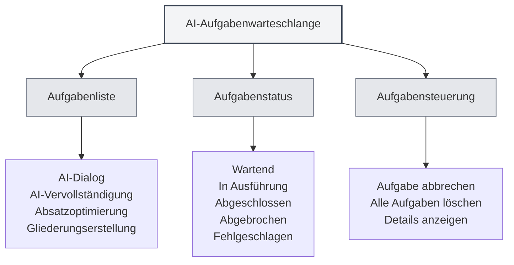

# AI-Aufgabenwarteschlange

## Übersicht

Die AI-Aufgabenwarteschlange dient zur Verwaltung und Überwachung aller ausgeführten AI-Aufgaben. Über die Aufgabenwarteschlange können Sie den Aufgabenstatus einsehen, Aufgaben abbrechen, den Aufgabenfortschritt verfolgen und so einen effizienten Betrieb der AI-Funktionen sicherstellen.

## Einführung in die Aufgabenwarteschlange

<AITaskQueue mode="demo" />

### Was ist eine Aufgabenwarteschlange?

Die AI-Aufgabenwarteschlange ist eine Verwaltungsoberfläche, die alle ausgeführten oder wartenden AI-Aufgaben anzeigt:

- **Aufgabenliste**: Zeigt alle Aufgaben und deren Status an
- **Aufgabenstatus**: Zeigt den Ausführungsstatus der Aufgabe an
- **Aufgabenfortschritt**: Zeigt den Ausführungsfortschritt der Aufgabe an
- **Aufgabensteuerung**: Aufgaben können abgebrochen oder verwaltet werden

### Aufgabentypen

Die Aufgabenwarteschlange kann folgende Aufgabentypen enthalten:

- **AI-Dialog**: AI-Dialogaufgaben
- **AI-Vervollständigung**: Aufgaben zur automatischen AI-Vervollständigung
- **Absatzoptimierung**: Aufgaben zur Absatzoptimierung
- **Gliederungserstellung**: Aufgaben zur Gliederungserstellung
- **Andere AI-Aufgaben**: Weitere AI-bezogene Aufgaben

## Aufgabenwarteschlange öffnen

### Zugriffsmöglichkeiten

Die Aufgabenwarteschlange kann auf folgende Weise geöffnet werden:

- **Seitenleiste**: Möglicherweise gibt es einen Zugang zur Aufgabenwarteschlange in der Seitenleiste
- **Menüoption**: In einigen Menüs kann es eine Option für die Aufgabenwarteschlange geben
- **Tastenkürzel**: In manchen Fällen kann es Tastenkürzel geben (möglicherweise zukünftig unterstützt)

### Aufgabenwarteschlangen-Panel

<AITaskQueue mode="demo" />

Die Aufgabenwarteschlange wird normalerweise als Seitenpanel angezeigt:

- **Aufgabenliste**: Zeigt alle Aufgaben an
- **Aufgabendetails**: Zeigt detaillierte Informationen zur ausgewählten Aufgabe an
- **Steuerungsschaltflächen**: Bieten Funktionen zur Aufgabensteuerung

## Aufgaben anzeigen

<AITaskQueue mode="demo" />

### Aufgabenliste

Die Aufgabenliste zeigt alle Aufgaben an:

- **Aufgabenname**: Zeigt den Namen der Aufgabe an
- **Aufgabenstatus**: Zeigt den aktuellen Status der Aufgabe an
- **Aufgabenfortschritt**: Zeigt den Ausführungsfortschritt der Aufgabe an
- **Aufgabenzeit**: Zeigt die Erstellungszeit der Aufgabe an

### Aufgabenstatus

Eine Aufgabe kann sich in folgenden Zuständen befinden:

- **Wartend**: Aufgabe wurde erstellt, wartet auf Ausführung
- **In Ausführung**: Aufgabe wird gerade ausgeführt
- **Abgeschlossen**: Aufgabe wurde erfolgreich ausgeführt
- **Abgebrochen**: Aufgabe wurde abgebrochen
- **Fehlgeschlagen**: Ausführung der Aufgabe ist fehlgeschlagen

### Aufgabendetails

Detaillierte Informationen zu einer Aufgabe können eingesehen werden:

- **Aufgabenname**: Name der Aufgabe
- **Aufgabentyp**: Typ der Aufgabe
- **Aufgabenparameter**: Parameter der Aufgabe
- **Aufgabenergebnis**: Ergebnis der Aufgabe (falls abgeschlossen)
- **Fehlermeldung**: Fehlermeldung der Aufgabe (falls fehlgeschlagen)

## Aufgabensteuerung

<AITaskQueue mode="demo" />

### Aufgabe abbrechen

Eine laufende Aufgabe kann abgebrochen werden:

1. **Aufgabe auswählen**: Wählen Sie die abzubrechende Aufgabe in der Aufgabenliste aus
2. **Auf "Abbrechen" klicken**: Klicken Sie auf die Schaltfläche "Abbrechen"
3. **Abbruch bestätigen**: Bestätigen Sie den Abbruchvorgang
4. **Aufgabe abgebrochen**: Die Aufgabe wird abgebrochen und entfernt

<AITaskQueue mode="demo" />

### Alle Aufgaben löschen

Alle Aufgaben können gelöscht werden:

1. **Aufgabenwarteschlange öffnen**: Öffnen Sie das Aufgabenwarteschlangen-Panel
2. **Auf "Löschen" klicken**: Klicken Sie auf die Schaltfläche "Löschen"
3. **Löschen bestätigen**: Bestätigen Sie den Löschvorgang
4. **Aufgaben gelöscht**: Alle Aufgaben werden abgebrochen und entfernt

### Aufgabenpriorität

Einige Aufgaben können eine Priorität haben:

- **Hohe Priorität**: Wichtige Aufgaben werden vorrangig ausgeführt
- **Normale Priorität**: Normale Aufgaben werden in der Reihenfolge ausgeführt
- **Niedrige Priorität**: Aufgaben mit niedriger Priorität werden zuletzt ausgeführt

## Anzeige des Aufgabenfortschritts

<AITaskQueue mode="demo" />

### Fortschrittsbalken

Der Aufgabenfortschritt wird über einen Fortschrittsbalken angezeigt:

- **Fortschrittsprozentsatz**: Zeigt den prozentualen Fertigstellungsgrad der Aufgabe an
- **Fortschrittsbalken**: Visualisiert den Aufgabenfortschritt
- **Fortschrittsaktualisierung**: Der Fortschritt wird in Echtzeit aktualisiert

### Fortschrittsinformationen

Fortschrittsinformationen zu einer Aufgabe können eingesehen werden:

- **Aktueller Schritt**: Zeigt den gerade ausgeführten Schritt an
- **Abgeschlossene Schritte**: Zeigt die bereits abgeschlossenen Schritte an
- **Gesamtschrittzahl**: Zeigt die Gesamtzahl der Schritte an
- **Voraussichtliche Zeit**: Zeigt die voraussichtliche Fertigstellungszeit an

<AITaskQueue mode="demo" />

## Aufgabenverzögerung

<AITaskQueue mode="demo" />

### Verzögerte Vervollständigung

AI-Vervollständigungsaufgaben können verzögert werden:

1. **Aufgabenwarteschlange öffnen**: Öffnen Sie das Aufgabenwarteschlangen-Panel
2. **Verzögerungszeit wählen**: Wählen Sie eine Verzögerungszeit (Minuten)
3. **Verzögerung anwenden**: Wenden Sie die Verzögerungseinstellung an
4. **Aufgabe verzögert**: Die Vervollständigungsaufgabe wird verzögert ausgeführt

### Anzeige der Verzögerung

Die Verzögerungszeit wird in der Aufgabenwarteschlange angezeigt:

- **Verbleibende Zeit**: Zeigt die verbleibende Verzögerungszeit an
- **Countdown**: Echtzeit-Countdown-Anzeige
- **Automatische Ausführung**: Automatische Ausführung nach Ablauf der Verzögerungszeit

## Aufgabenverlauf

<AITaskQueue mode="demo" />

### Verlaufsprotokoll

Die Aufgabenwarteschlange kann einen Aufgabenverlauf speichern:

- **Abgeschlossene Aufgaben**: Zeigt abgeschlossene Aufgaben an
- **Fehlgeschlagene Aufgaben**: Zeigt fehlgeschlagene Aufgaben an
- **Abgebrochene Aufgaben**: Zeigt abgebrochene Aufgaben an

### Verlauf anzeigen

Der Aufgabenverlauf kann eingesehen werden:

- **Verlaufsliste**: Zeigt die Liste der historischen Aufgaben an
- **Aufgabendetails**: Zeigt detaillierte Informationen zu historischen Aufgaben an
- **Ergebnis anzeigen**: Zeigt das Ergebnis der Aufgabe an

## Best Practices

<AITaskQueue mode="demo" />

1. **Regelmäßig einsehen**: Sehen Sie regelmäßig in die Aufgabenwarteschlange, um den Ausführungsstatus zu überwachen
2. **Unnötige Aufgaben zeitnah abbrechen**: Brechen Sie nicht benötigte Aufgaben rechtzeitig ab, um Ressourcen freizugeben
3. **Fortschritt überwachen**: Beobachten Sie den Aufgabenfortschritt, um eine normale Ausführung sicherzustellen
4. **Fehlerbehandlung**: Behandeln Sie fehlgeschlagene Aufgaben zeitnah, um Auswirkungen auf nachfolgende Aufgaben zu vermeiden
5. **Ressourcenverwaltung**: Verwalten Sie Aufgaben sinnvoll, um Ressourcenverschwendung zu vermeiden

## Hinweise

1. **Anzahl der Aufgaben**: Zu viele Aufgaben können die Leistung beeinträchtigen
2. **Aufgabenabbruch**: Das Abbrechen einer Aufgabe kann laufende Operationen beeinflussen
3. **Aufgabenstatus**: Der Aufgabenstatus kann sich in Echtzeit ändern
4. **Ressourcenbelegung**: Aufgaben belegen Systemressourcen
5. **Netzwerkabhängigkeit**: Einige Aufgaben benötigen eine Netzwerkverbindung

## Verwandte Dokumentation

- [[ai.chat|AI-Dialogfunktion]]
- [[ai.completion|AI-Autovervollständigung]]
- [[features.paragraph-optimization|Absatzoptimierungsfunktion]]
