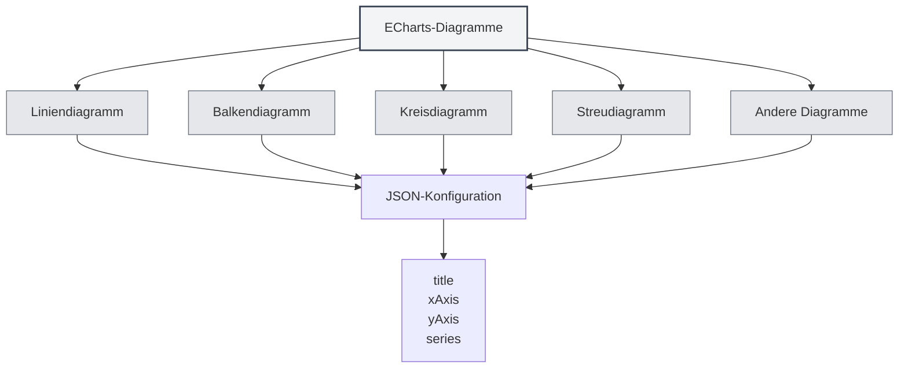

# ECharts-Diagramme

## Übersicht

ECharts ist eine leistungsstarke Datenvisualisierungsbibliothek, die verschiedene Diagrammtypen unterstützt. MetaDoc unterstützt ECharts-Diagramme, sodass Sie in Markdown-Dokumenten mithilfe von ECharts-Konfigurationen verschiedene Datenvisualisierungen erstellen können.

<DataAnalysisWindow mode="demo" />

## ECharts-Syntax

<ChartGenerationDisplay mode="demo" />

### Grundlegende Syntax

ECharts verwendet ein JSON-Konfigurationsformat:

````markdown
```echarts
{
  "title": {
    "text": "Beispieldiagramm"
  },
  "xAxis": {
    "type": "category",
    "data": ["A", "B", "C"]
  },
  "yAxis": {
    "type": "value"
  },
  "series": [{
    "data": [10, 20, 30],
    "type": "bar"
  }]
}
```
````

### Konfigurationsformat

Die ECharts-Konfiguration muss gültiges JSON sein:

- **JSON-Format**: Verwenden Sie das Standard-JSON-Format.
- **Englische Interpunktion**: Verwenden Sie englische Kommas, Doppelpunkte und Anführungszeichen.
- **Vollständige Konfiguration**: Enthalten Sie die erforderlichen Konfigurationselemente.



## Unterstützte Diagrammtypen

<DataAnalysisDisplay mode="demo" />

### Liniendiagramm

Erstellen Sie ein Liniendiagramm:

````markdown
```echarts
{
  "xAxis": {
    "type": "category",
    "data": ["Mon", "Tue", "Wed"]
  },
  "yAxis": {
    "type": "value"
  },
  "series": [{
    "data": [120, 200, 150],
    "type": "line"
  }]
}
```
````

### Balkendiagramm

<ChartGenerationDisplay mode="demo" />

Erstellen Sie ein Balkendiagramm:

````markdown
```echarts
{
  "xAxis": {
    "type": "category",
    "data": ["A", "B", "C"]
  },
  "yAxis": {
    "type": "value"
  },
  "series": [{
    "data": [10, 20, 30],
    "type": "bar"
  }]
}
```
````

### Kreisdiagramm

<DataAnalysisDisplay mode="demo" />

Erstellen Sie ein Kreisdiagramm:

````markdown
```echarts
{
  "series": [{
    "type": "pie",
    "data": [
      {"value": 335, "name": "Kategorie A"},
      {"value": 310, "name": "Kategorie B"},
      {"value": 234, "name": "Kategorie C"}
    ]
  }]
}
```
````

### Streudiagramm

<ChartGenerationDisplay mode="demo" />

Erstellen Sie ein Streudiagramm:

````markdown
```echarts
{
  "xAxis": {
    "type": "value"
  },
  "yAxis": {
    "type": "value"
  },
  "series": [{
    "type": "scatter",
    "data": [[10, 20], [15, 25], [20, 30]]
  }]
}
```
````

### Netzdiagramm (Radar)

<OutlineTreeDisplay mode="demo" />

Erstellen Sie ein Netzdiagramm:

````markdown
```echarts
{
  "radar": {
    "indicator": [
      {"name": "Indikator 1", "max": 100},
      {"name": "Indikator 2", "max": 100}
    ]
  },
  "series": [{
    "type": "radar",
    "data": [{
      "value": [80, 90]
    }]
  }]
}
```
````

### Heatmap

<DataAnalysisDisplay mode="demo" />

Erstellen Sie eine Heatmap:

````markdown
```echarts
{
  "xAxis": {
    "type": "category",
    "data": ["A", "B", "C"]
  },
  "yAxis": {
    "type": "category",
    "data": ["X", "Y", "Z"]
  },
  "series": [{
    "type": "heatmap",
    "data": [[0, 0, 10], [0, 1, 20], [1, 0, 30]]
  }]
}
```
````

## Diagrammkonfiguration

<OutlineTreeDisplay mode="demo" />

### Titelkonfiguration

Legen Sie den Diagrammtitel fest:

```json
{
  "title": {
    "text": "Diagrammtitel",
    "subtext": "Untertitel"
  }
}
```

### Achsenkonfiguration

Konfigurieren Sie die Achsen:

```json
{
  "xAxis": {
    "type": "category",
    "data": ["A", "B", "C"]
  },
  "yAxis": {
    "type": "value"
  }
}
```

### Reihenkonfiguration (Series)

Konfigurieren Sie die Datenreihen:

```json
{
  "series": [
    {
      "name": "Reihenname",
      "type": "bar",
      "data": [10, 20, 30]
    }
  ]
}
```

### Legendenkonfiguration

Konfigurieren Sie die Legende:

```json
{
  "legend": {
    "data": ["Reihe 1", "Reihe 2"]
  }
}
```

### Tooltip-Konfiguration

Konfigurieren Sie den Tooltip:

```json
{
  "tooltip": {
    "trigger": "axis"
  }
}
```

## Erweiterte Funktionen

<ChartGenerationDisplay mode="demo" />

### Diagramme mit mehreren Reihen

Erstellen Sie Diagramme mit mehreren Reihen:

````markdown
```echarts
{
  "xAxis": {
    "type": "category",
    "data": ["Mon", "Tue", "Wed"]
  },
  "yAxis": {
    "type": "value"
  },
  "series": [
    {
      "name": "Reihe 1",
      "type": "bar",
      "data": [10, 20, 30]
    },
    {
      "name": "Reihe 2",
      "type": "line",
      "data": [15, 25, 35]
    }
  ]
}
```
````

### Datenzoom

Fügen Sie einen Datenzoom hinzu:

```json
{
  "dataZoom": [
    {
      "type": "slider",
      "start": 0,
      "end": 100
    }
  ]
}
```

### Visuelle Zuordnung (Visual Map)

Fügen Sie eine visuelle Zuordnung hinzu:

```json
{
  "visualMap": {
    "min": 0,
    "max": 100,
    "inRange": {
      "color": ["#50a3ba", "#eac736", "#d94e5d"]
    }
  }
}
```

## Render-Modi

### Rendering im Hauptprozess

ECharts rendert Diagramme im Hauptprozess:

- **Serverseitiges Rendering**: Diagramme werden im Hauptprozess gerendert.
- **SVG-Format**: Standardmäßig als SVG gerendert.
- **PNG-Format**: Kann in das PNG-Format konvertiert werden.

### Render-Performance

Eigenschaften des ECharts-Renderings:

- **Render-Geschwindigkeit**: Rendering im Hauptprozess ist relativ schnell.
- **Ressourcenverbrauch**: Belegt Ressourcen des Hauptprozesses während des Renderings.
- **Fehlerbehandlung**: Renderfehler werden in der Konsole angezeigt.

## Wichtige Hinweise

### Syntax-Hinweise

1.  **JSON-Format**: Sie müssen ein gültiges JSON-Format verwenden.
2.  **Englische Interpunktion**: Verwenden Sie englische Kommas, Doppelpunkte und Anführungszeichen.
3.  **Vollständige Konfiguration**: Enthalten Sie alle notwendigen Konfigurationselemente.
4.  **Korrekte Syntax**: Stellen Sie sicher, dass die JSON-Syntax korrekt ist, da das Diagramm sonst nicht gerendert werden kann.

### Render-Hinweise

1.  **Konfigurationsvalidierung**: Das Konfigurationsformat wird vor dem Rendering überprüft.
2.  **Syntaxfehler**: Bei JSON-Syntaxfehlern kann das Diagramm nicht gerendert werden.
3.  **Komplexe Diagramme**: Übermäßig komplexe Diagramme können die Render-Performance beeinträchtigen.
4.  **Exportkompatibilität**: Stellen Sie beim Export sicher, dass das Diagramm im Zielformat korrekt angezeigt wird.

## Best Practices

1.  **Konfigurationsstandard**: Befolgen Sie die offiziellen ECharts-Konfigurationsrichtlinien.
2.  **JSON-Format**: Stellen Sie sicher, dass das JSON-Format korrekt ist.
3.  **Klare Code-Struktur**: Halten Sie den Konfigurationscode klar und lesbar.
4.  **Render-Test**: Testen Sie nach der Bearbeitung die Darstellung des Diagramms.
5.  **Dokumentation konsultieren**: Konsultieren Sie die offizielle ECharts-Dokumentation und Beispiele.

## Verwandte Dokumente

- [[charts.introduction|Diagrammfunktionen – Einführung]]
- [[charts.mermaid|Mermaid-Diagramme]]
- [[charts.plantuml|PlantUML-Diagramme]]