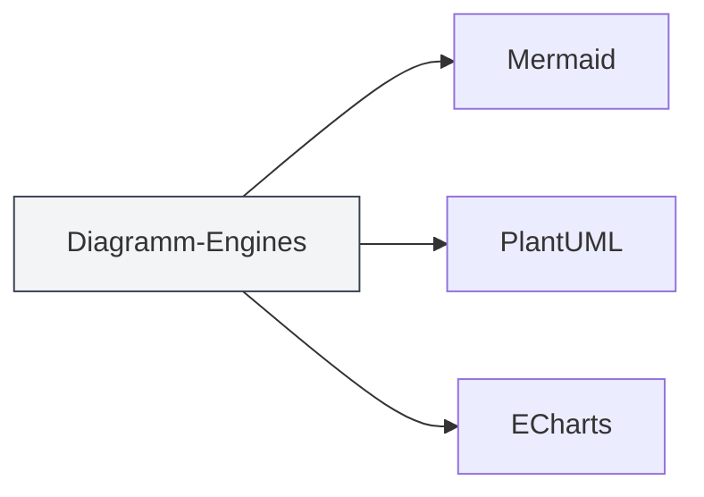
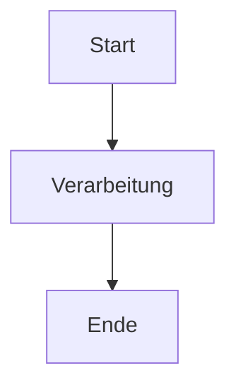

# Diagrammfunktionen

## Übersicht

MetaDoc unterstützt mehrere Diagramm-Erstellungs-Engines, mit denen Sie verschiedene Arten von Diagrammen in Markdown-Dokumente einfügen und rendern können. Die Diagrammfunktionen ermöglichen es Ihnen, Flussdiagramme, UML-Diagramme, Datenvisualisierungen und mehr zu erstellen, um Ihre Dokumente zu bereichern.

<GraphWindow mode="demo" />

## Unterstützte Diagramm-Engines

<ChartGenerationDisplay mode="demo" />

### Diagrammtypen

MetaDoc unterstützt die folgenden Diagramm-Engines:

- **Mermaid**: Flussdiagramme, UML-Diagramme, Gantt-Diagramme usw.
- **PlantUML**: Professionelle UML-Modellierungsdiagramme
- **ECharts**: Datenvisualisierungsdiagramme
- **Flowchart**: Grundlegende Flussdiagramme
- **Graphviz**: Graphvisualisierung
- **Mindmap**: Mindmaps
- **Markmap**: Markdown-Mindmaps
- **SMILES**: Chemische Strukturformeln
- **ABC**: Musiknoten

### Engine-Vergleich

<DataAnalysisDisplay mode="demo" />

| Engine     | Anwendungsbereich                     | Rendering-Methode |
| ---------- | ------------------------------------- | ----------------- |
| Mermaid    | Flussdiagramme, Sequenzdiagramme, Klassendiagramme, Gantt-Diagramme | Browser-Rendering |
| PlantUML   | Professionelle UML-Modellierung       | Hauptprozess-Rendering |
| ECharts    | Datenvisualisierung (Liniendiagramme, Balkendiagramme usw.) | Hauptprozess-Rendering |
| Flowchart  | Grundlegende Flussdiagramme           | Vditor-Rendering  |
| Graphviz   | Graphvisualisierung                   | Vditor-Rendering  |
| Mindmap    | Mindmaps                              | Vditor-Rendering  |

### Engine-Vergleichsdiagramm

<OutlineTreeDisplay mode="demo" />



## Diagramme einfügen

<DataAnalysisWindow mode="demo" />

### Codeblock-Syntax

Verwenden Sie Codeblöcke in Markdown-Dokumenten, um Diagramme einzufügen:

````markdown

````

### Diagrammtyp-Kennzeichnung

Verschiedene Diagrammtypen verwenden unterschiedliche Codeblock-Kennzeichnungen:

- **Mermaid**: ` ```mermaid `
- **PlantUML**: ` ```plantuml `
- **ECharts**: ` ```echarts `
- **Flowchart**: ` ```flowchart `
- **Graphviz**: ` ```graphviz `
- **Mindmap**: ` ```mindmap `

## Diagramm-Rendering

<ChartGenerationDisplay mode="demo" />

### Echtzeit-Rendering

Diagramme werden im Editor in Echtzeit gerendert:

- **Automatisches Rendering**: Automatisches Rendering nach Eingabe des Diagrammcodes
- **Echtzeit-Vorschau**: Diagramm wird im Vorschaufenster in Echtzeit angezeigt
- **Fehlerhinweise**: Syntaxfehler werden mit Fehlermeldungen angezeigt

### Rendering-Methoden

Verschiedene Diagramme verwenden unterschiedliche Rendering-Methoden:

- **Browser-Rendering**: Mermaid usw. verwenden Browser-APIs zum Rendern
- **Hauptprozess-Rendering**: PlantUML, ECharts verwenden Hauptprozess-Rendering
- **Vditor-Rendering**: Flowchart usw. verwenden Vditor-Rendering

### Rendering-Formate

Diagramme können in verschiedenen Formaten gerendert werden:

- **SVG**: Vektorgrafikformat (Standard)
- **PNG**: Rastergrafikformat (konvertierbar)

## Diagramm-Export

<OutlineTreeDisplay mode="demo" />

### Exportunterstützung

Diagramme können in verschiedene Formate exportiert werden:

- **PDF-Export**: Diagramme werden in die PDF-Datei eingebettet
- **HTML-Export**: Diagramme werden in die HTML-Datei eingebettet
- **Bild-Export**: Diagramme können separat als Bild exportiert werden

### Exportqualität

Die Diagrammqualität bleibt beim Export erhalten:

- **Vektorgrafiken**: SVG-Format behält die Schärfe
- **Rastergrafiken**: PNG-Format eignet sich zum Drucken
- **Auflösung**: Die Auflösung wird je nach Exportformat angepasst

## Diagramm-Bearbeitung

<DataAnalysisDisplay mode="demo" />

### Code-Bearbeitung

Diagrammcode kann direkt bearbeitet werden:

- **Syntax-Hervorhebung**: Codeblöcke unterstützen Syntax-Highlighting
- **Auto-Vervollständigung**: Einige Editoren unterstützen Auto-Vervollständigung
- **Fehlerprüfung**: Echtzeit-Syntaxfehlerprüfung

### Vorschau-Aktualisierung

Die Vorschau wird nach Code-Änderungen automatisch aktualisiert:

- **Echtzeit-Aktualisierung**: Vorschau wird sofort nach Code-Änderung aktualisiert
- **Fehleranzeige**: Bei Syntaxfehlern werden Fehlermeldungen angezeigt
- **Rendering-Status**: Zeigt den Rendering-Status des Diagramms an

## Mehrsprachige Unterstützung

<DataAnalysisWindow mode="demo" />

### Mehrsprachiger Diagrammcode

Diagrammcode unterstützt mehrere Sprachen:

- **Chinesisch-Unterstützung**: Chinesische Labels und Texte können verwendet werden
- **Englisch-Unterstützung**: Englische Labels und Texte können verwendet werden
- **Gemischte Verwendung**: Chinesisch und Englisch können gemischt verwendet werden

### Internationalisierung

Die Diagrammfunktionen unterstützen Internationalisierung:

- **Oberflächensprache**: Diagrammbezogene Oberfläche folgt der Systemsprache
- **Fehlermeldungen**: Fehlermeldungen verwenden die aktuelle Sprache
- **Hilfedokumentation**: Hilfedokumentation unterstützt mehrere Sprachen

## Best Practices

1. **Passende Engine wählen**: Wählen Sie je nach Anforderung die passende Diagramm-Engine
2. **Syntax einhalten**: Befolgen Sie die Syntaxvorgaben der jeweiligen Engine
3. **Klaren Code schreiben**: Halten Sie den Diagrammcode klar und lesbar
4. **Rendering testen**: Testen Sie nach der Bearbeitung das Rendering-Ergebnis
5. **Export testen**: Testen Sie vor dem Export die Darstellung des Diagramms im Zielformat

## Wichtige Hinweise

1. **Korrekte Syntax**: Stellen Sie sicher, dass der Diagrammcode syntaktisch korrekt ist, sonst kann er nicht gerendert werden
2. **Rendering-Leistung**: Komplexe Diagramme können die Rendering-Leistung beeinträchtigen
3. **Export-Kompatibilität**: Einige Diagrammformate sind möglicherweise mit bestimmten Exportformaten nicht kompatibel
4. **Code-Sicherheit**: Achten Sie auf die Sicherheit des Diagrammcodes, um bösartigen Code zu vermeiden
5. **Versionskompatibilität**: Unterschiedliche Versionen der Diagramm-Engines können Syntaxunterschiede aufweisen

## Verwandte Dokumentation

- [[charts.mermaid|Mermaid-Diagramme]]
- [[charts.plantuml|PlantUML-Diagramme]]
- [[charts.echarts|ECharts-Diagramme]]
- [[markdown.features|Markdown-Editor-Funktionen]]