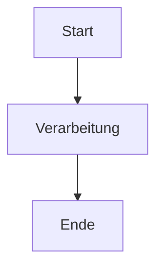
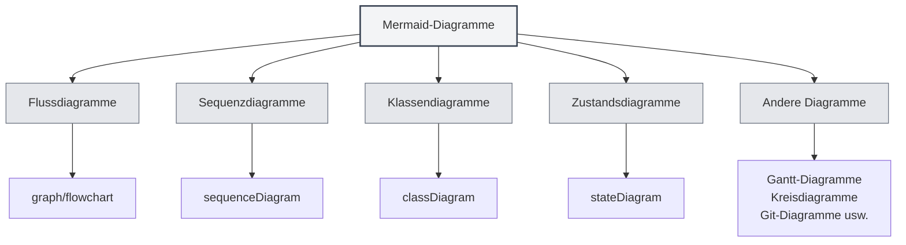
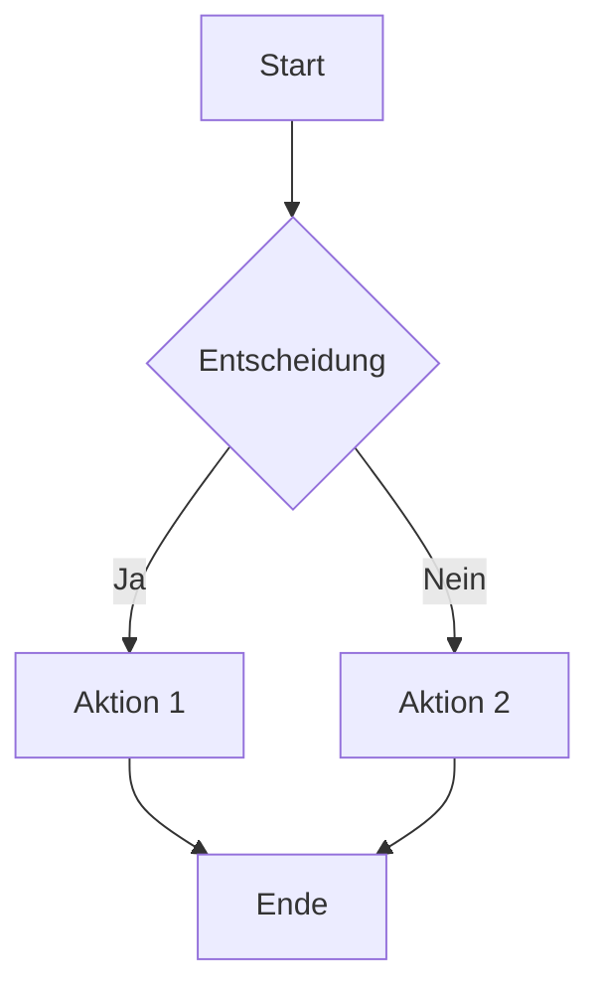
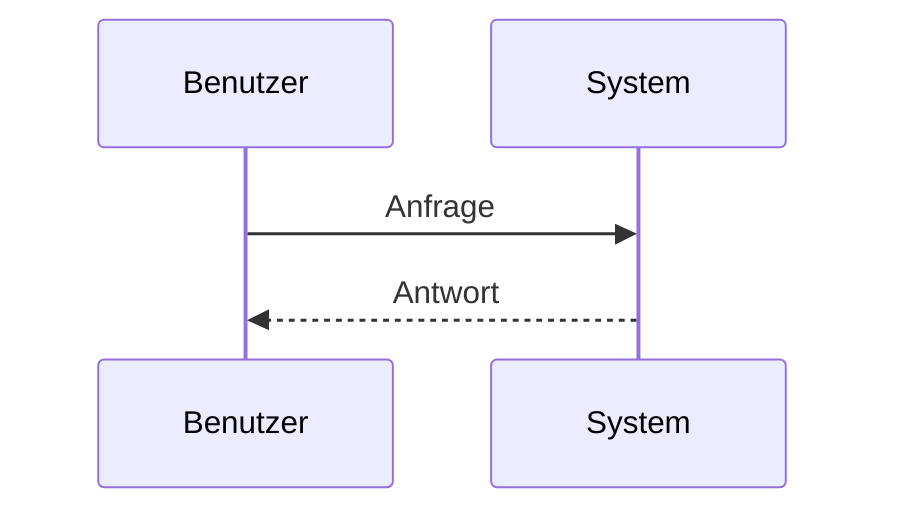
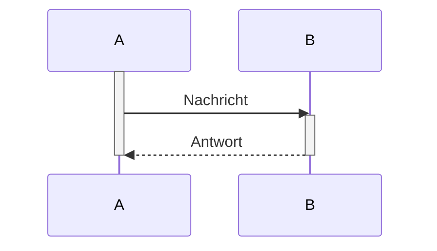
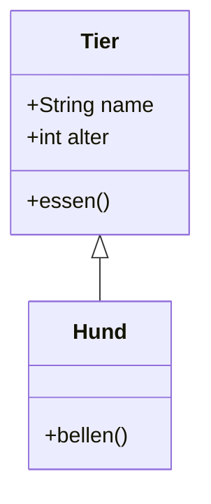
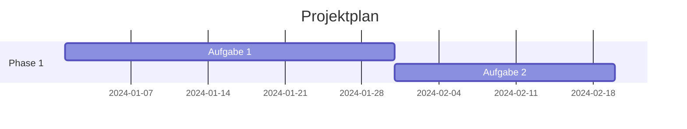
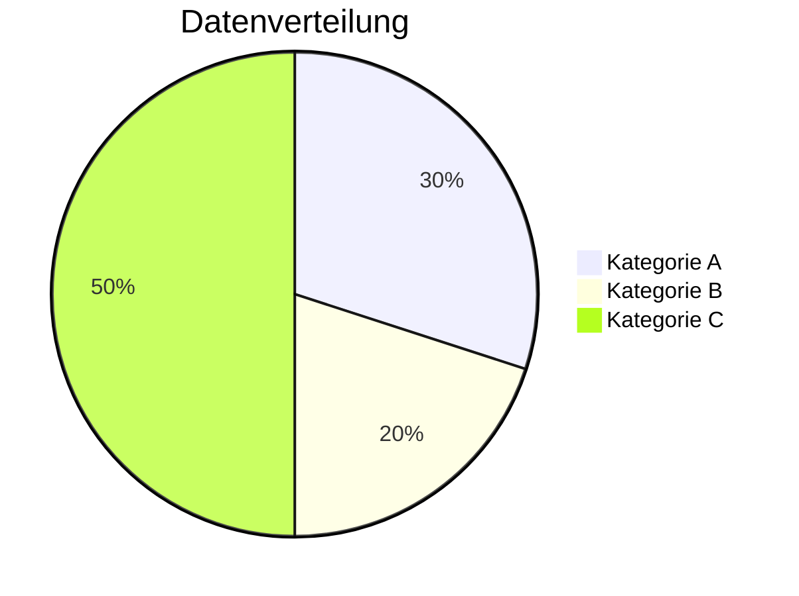
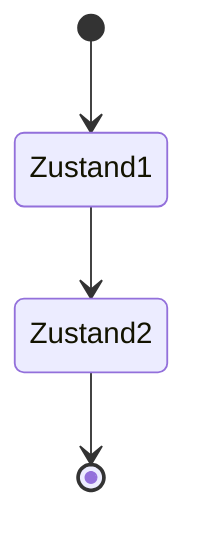
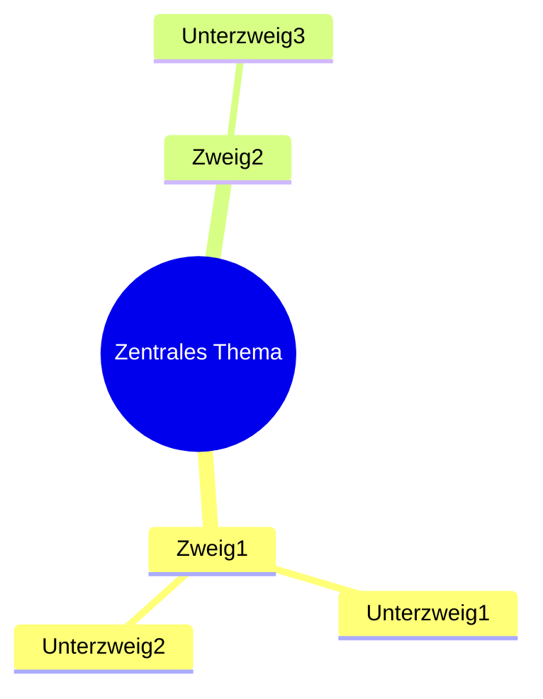

# Mermaid-Diagramme

## Übersicht

Mermaid ist ein beliebtes Diagrammzeichnungstool, das sich gut für das schnelle Erstellen von Flussdiagrammen, Sequenzdiagrammen, Klassendiagrammen, Gantt-Diagrammen usw. eignet. MetaDoc unterstützt Mermaid-Diagramme, sodass Sie mit Mermaid-Syntax direkt in Markdown-Dokumenten verschiedene Diagramme erstellen können.

<GraphWindow mode="demo" initialTool="mermaid" />

## Mermaid-Syntax

<OutlineTreeDisplay mode="demo" />

### Grundlegende Syntax

Mermaid verwendet eine einfache Textsyntax zur Beschreibung von Diagrammen:

````markdown

````

### Diagrammtypen

<ChartGenerationDisplay mode="demo" />

Mermaid unterstützt verschiedene Diagrammtypen:

- **Flussdiagramme** (graph/flowchart)
- **Sequenzdiagramme** (sequenceDiagram)
- **Klassendiagramme** (classDiagram)
- **Zustandsdiagramme** (stateDiagram)
- **Entity-Relationship-Diagramme** (erDiagram)
- **Gantt-Diagramme** (gantt)
- **Kreisdiagramme** (pie)
- **Git-Diagramme** (gitgraph)
- **User-Journey-Diagramme** (journey)
- **Mindmaps** (mindmap)
- **Zeitachsen** (timeline)



## Flussdiagramme

<OutlineTreeDisplay mode="demo" />

### Einfache Flussdiagramme

Erstellen Sie einfache Flussdiagramme:

````markdown

````

### Flussdiagramm-Ausrichtung

Sie können die Ausrichtung des Flussdiagramms festlegen:

- **TD**: Von oben nach unten (Top Down)
- **BT**: Von unten nach oben (Bottom Top)
- **LR**: Von links nach rechts (Left Right)
- **RL**: Von rechts nach links (Right Left)

### Knotenformen

Sie können verschiedene Knotenformen verwenden:

- **Rechteck**: `[Text]`
- **Abgerundetes Rechteck**: `(Text)`
- **Raute**: `{Text}`
- **Kreis**: `((Text))`
- **Sechseck**: `{{Text}}`
- **Trapez**: `[/Text\]`
- **Umgekehrtes Trapez**: `[\Text/]`

## Sequenzdiagramme

<DataAnalysisDisplay mode="demo" />

### Einfache Sequenzdiagramme

Erstellen Sie Sequenzdiagramme:

````markdown

````

### Nachrichtentypen

Sie können verschiedene Nachrichtentypen verwenden:

- **Durchgehender Pfeil**: `->>` Synchrone Nachricht
- **Gestrichelter Pfeil**: `-->>` Asynchrone Nachricht
- **Durchgehende Linie**: `->` Synchrone Nachricht (keine Rückkehr)
- **Gestrichelte Linie**: `-->` Asynchrone Nachricht (keine Rückkehr)

### Aktivierungsboxen

Sie können Aktivierungsboxen hinzufügen, um Objektaktivität darzustellen:

````markdown

````

## Klassendiagramme

<ChartGenerationDisplay mode="demo" />

### Einfache Klassendiagramme

Erstellen Sie Klassendiagramme:

````markdown

````

### Klassenbeziehungen

Sie können verschiedene Klassenbeziehungen darstellen:

- **Vererbung**: `<|--` oder `--|>`
- **Implementierung**: `<|..` oder `..|>`
- **Komposition**: `*--` oder `--*`
- **Aggregation**: `o--` oder `--o`
- **Assoziation**: `-->` oder `<--`
- **Abhängigkeit**: `..>` oder `<..`

### Klassenmitglieder

Sie können Klassenmitglieder definieren:

- **Attribute**: `+name: String` (öffentlich), `-name: String` (privat)
- **Methoden**: `+methode()` (öffentlich), `-methode()` (privat)

## Gantt-Diagramme

<OutlineTreeDisplay mode="demo" />

### Einfache Gantt-Diagramme

Erstellen Sie Gantt-Diagramme:

````markdown

````

### Datumsformate

Sie können Datumsformate festlegen:

- **YYYY-MM-DD**: Jahr-Monat-Tag
- **MM/DD/YYYY**: Monat/Tag/Jahr
- **Andere Formate**: Unterstützt verschiedene Datumsformate

### Aufgabenbeziehungen

Sie können Aufgabenbeziehungen festlegen:

- **after**: Nach einer bestimmten Aufgabe
- **Meilenstein**: Markieren Sie Meilensteine mit `milestone`

## Kreisdiagramme

<DataAnalysisDisplay mode="demo" />

### Einfache Kreisdiagramme

Erstellen Sie Kreisdiagramme:

````markdown

````

## Zustandsdiagramme

<ChartGenerationDisplay mode="demo" />

### Einfache Zustandsdiagramme

Erstellen Sie Zustandsdiagramme:

````markdown

````

## Mindmaps

<OutlineTreeDisplay mode="demo" />

### Einfache Mindmaps

Erstellen Sie Mindmaps:

````markdown

````

## Hinweise

<DataAnalysisDisplay mode="demo" />

### Syntax-Hinweise

1.  **Zeichenkettenumhüllung**: Es wird empfohlen, Zeichenketten mit `["..."]` zu umschließen, um Escape-Fehler zu vermeiden.
2.  **Bezeichner**: Vermeiden Sie in Klassendiagrammen Bezeichner mit Leerzeichen oder Sonderzeichen.
3.  **Unterstützung für Chinesisch**: Chinesisch kann verwendet werden, aber es wird empfohlen, englische Bezeichner zu verwenden.
4.  **Syntax-Version**: Achten Sie auf die Mermaid-Syntaxversion, da sich diese zwischen Versionen unterscheiden kann.

### Render-Hinweise

1.  **Syntaxfehler**: Bei Syntaxfehlern kann das Diagramm nicht gerendert werden.
2.  **Komplexe Diagramme**: Übermäßig komplexe Diagramme können die Renderleistung beeinträchtigen.
3.  **Browserkompatibilität**: Einige Browser unterstützen möglicherweise nicht alle Mermaid-Funktionen.
4.  **Exportkompatibilität**: Stellen Sie beim Export sicher, dass die Diagramme im Zielformat korrekt angezeigt werden.

## Best Practices

1.  **Syntaxkonventionen**: Befolgen Sie die offiziellen Mermaid-Syntaxkonventionen.
2.  **Klare Code-Struktur**: Halten Sie den Diagrammcode klar und lesbar.
3.  **Render-Test**: Testen Sie nach der Bearbeitung die Renderwirkung des Diagramms.
4.  **Beispiele verwenden**: Beziehen Sie sich auf die Beispiele in der offiziellen Mermaid-Dokumentation.
5.  **Versionskompatibilität**: Achten Sie auf die Mermaid-Versionskompatibilität.

## Verwandte Dokumente

- [[charts.introduction|Diagrammfunktionen]]
- [[charts.plantuml|PlantUML-Diagramme]]
- [[charts.echarts|ECharts-Diagramme]]
