# PlantUML-Diagramme

## Übersicht

PlantUML ist ein professionelles UML-Modellierungswerkzeug, das verschiedene UML-Diagrammtypen unterstützt. MetaDoc unterstützt PlantUML-Diagramme, sodass Sie mit PlantUML-Syntax professionelle UML-Diagramme in Markdown-Dokumenten erstellen können.

<GraphWindow mode="demo" initialTool="plantuml" />

## PlantUML-Syntax

<OutlineTreeDisplay mode="demo" />

### Grundlegende Syntax

PlantUML verwendet spezifische Markierungen und Syntax:

````markdown
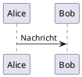
````

### Erforderliche Markierungen

<ChartGenerationDisplay mode="demo" />

PlantUML-Diagramme müssen enthalten:

- **@startuml**: Markierung für Diagrammstart
- **@enduml**: Markierung für Diagrammende

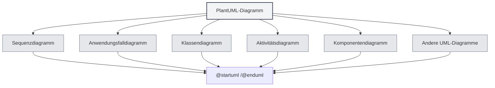

## Unterstützte Diagrammtypen

<DataAnalysisDisplay mode="demo" />

### Sequenzdiagramm

Erstellen eines Sequenzdiagramms:

````markdown
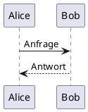
````

### Anwendungsfalldiagramm

<OutlineTreeDisplay mode="demo" />

Erstellen eines Anwendungsfalldiagramms:

````markdown
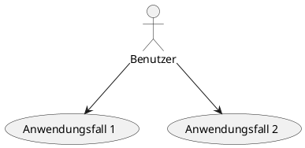
````

### Klassendiagramm

<ChartGenerationDisplay mode="demo" />

Erstellen eines Klassendiagramms:

````markdown
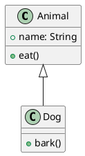
````

### Aktivitätsdiagramm

<DataAnalysisDisplay mode="demo" />

Erstellen eines Aktivitätsdiagramms:

````markdown
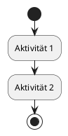
````

### Komponentendiagramm

<OutlineTreeDisplay mode="demo" />

Erstellen eines Komponentendiagramms:

````markdown
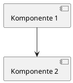
````

### Verteilungsdiagramm

<ChartGenerationDisplay mode="demo" />

Erstellen eines Verteilungsdiagramms:

````markdown
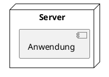
````

### Zustandsdiagramm

<DataAnalysisDisplay mode="demo" />

Erstellen eines Zustandsdiagramms:

````markdown
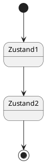
````

## Sequenzdiagramm im Detail

<OutlineTreeDisplay mode="demo" />

### Teilnehmer

Teilnehmer definieren:

````markdown
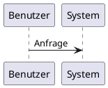
````

### Nachrichtentypen

Verschiedene Nachrichtentypen können verwendet werden:

- **Synchrone Nachricht**: `->`
- **Asynchrone Nachricht**: `-->`
- **Rückantwort**: `<-` oder `<--`
- **Selbstaufruf**: `->` auf sich selbst zeigen

### Aktivierungsbalken

Aktivierungsbalken hinzufügen:

````markdown
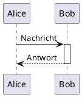
````

## Klassendiagramm im Detail

<ChartGenerationDisplay mode="demo" />

### Klassendefinition

Klasse definieren:

````markdown
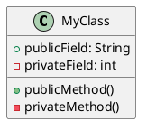
````

### Klassenbeziehungen

Klassenbeziehungen darstellen:

- **Vererbung**: `<|--` oder `--|>`
- **Implementierung**: `<|..` oder `..|>`
- **Komposition**: `*--` oder `--*`
- **Aggregation**: `o--` oder `--o`
- **Assoziation**: `-->` oder `<--`
- **Abhängigkeit**: `..>` oder `<..`

### Schnittstellen und abstrakte Klassen

Schnittstellen und abstrakte Klassen definieren:

````markdown
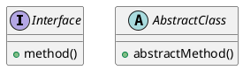
````

## Aktivitätsdiagramm im Detail

### Grundlegende Aktivitäten

Aktivitäten definieren:

````markdown

````

### Entscheidungsknoten

Entscheidung hinzufügen:

````markdown
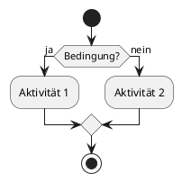
````

### Schleifen

Schleife hinzufügen:

````markdown
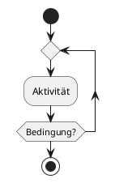
````

## Stile und Themen

### Theme-Einstellung

Theme kann eingestellt werden:

````markdown
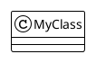
````

### Farbeinstellung

Farben können eingestellt werden:

````markdown
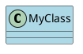
````

## Render-Modi

### Rendering im Hauptprozess

PlantUML verwendet Rendering im Hauptprozess:

- **Serverseitiges Rendering**: Diagramme werden im Hauptprozess gerendert
- **SVG-Format**: Standardmäßig als SVG gerendert
- **PNG-Format**: Kann in PNG konvertiert werden

### Render-Performance

PlantUML-Rendering-Eigenschaften:

- **Render-Geschwindigkeit**: Rendering im Hauptprozess ist relativ schnell
- **Ressourcenverbrauch**: Belegt Hauptprozessressourcen während des Renderings
- **Fehlerbehandlung**: Renderfehler werden in der Konsole angezeigt

## Hinweise

### Syntax-Hinweise

1.  **Erforderliche Markierungen**: Muss `@startuml` und `@enduml` enthalten
2.  **Syntax-Standard**: Offiziellen PlantUML-Syntaxstandard einhalten
3.  **Unterstützung für Chinesisch**: Chinesisch kann verwendet werden, aber englische Bezeichner werden empfohlen
4.  **Versionskompatibilität**: Auf PlantUML-Versionskompatibilität achten

### Render-Hinweise

1.  **Code-Extraktion**: Sicherstellen, dass Code korrekt extrahiert wird, XML-Tags vermeiden
2.  **Syntaxfehler**: Bei Syntaxfehlern kann das Diagramm nicht gerendert werden
3.  **Komplexe Diagramme**: Übermäßig komplexe Diagramme können die Render-Performance beeinträchtigen
4.  **Export-Kompatibilität**: Beim Export sicherstellen, dass Diagramme im Zielformat korrekt angezeigt werden

## Best Practices

1.  **Syntax-Standard**: Offiziellen PlantUML-Syntaxstandard einhalten
2.  **Klare Code-Struktur**: Diagrammcode klar und lesbar halten
3.  **Markierungen verwenden**: Immer `@startuml` und `@enduml` Markierungen verwenden
4.  **Rendering testen**: Nach der Bearbeitung das Diagramm-Rendering testen
5.  **Dokumentation konsultieren**: Auf die offizielle PlantUML-Dokumentation verweisen

## Verwandte Dokumente

- [[charts.introduction|Diagrammfunktionen]]
- [[charts.mermaid|Mermaid-Diagramme]]
- [[charts.echarts|ECharts-Diagramme]]