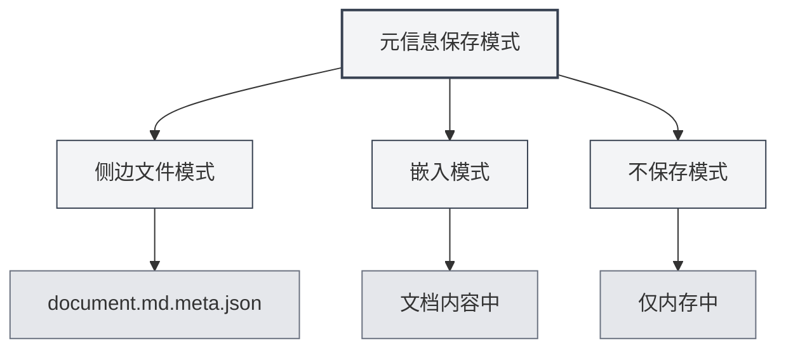

# Dokumenten-Metadaten

## Übersicht

Dokumenten-Metadaten sind Daten, die grundlegende Eigenschaften eines Dokuments beschreiben, einschließlich Titel, Autor, Beschreibung, Schlüsselwörter usw. Eine sinnvolle Einrichtung der Metadaten unterstützt das Dokumentenmanagement und die -suche und diese Informationen werden beim Exportieren eines Dokuments automatisch eingeschlossen.

MetaDoc unterstützt das Setzen von Metadaten für jedes Dokument. Diese Informationen können in einer separaten Datei gespeichert, in den Dokumentinhalt eingebettet oder nicht gespeichert werden. Sie können auch KI nutzen, um Metadaten automatisch zu generieren.

<MetaInfoPanel mode="demo" :meta='{"title": "", "author": "", "description": "", "keywords": []}' :outlineJson='""' />

## Einführung zu Metadaten

### Titel (Title)

Der Titel des Dokuments, wird normalerweise oben im Dokument und im Tab angezeigt.

- **Verwendung**: Identifiziert den Hauptinhalt des Dokuments
- **Anzeigeort**: Tab-Titel, Titelseite exportierter Dokumente
- **Beispiel**: `"MetaDoc-Benutzerhandbuch"`

<MetaInfoPanel mode="demo" :meta='{"title": "MetaDoc用户手册", "author": "", "description": "", "keywords": []}' :outlineJson='""' />

### Autor (Author)

Der Autor oder Ersteller des Dokuments.

- **Verwendung**: Identifiziert den Ersteller des Dokuments
- **Anzeigeort**: Autoreninformationen in exportierten Dokumenten
- **Beispiel**: `"Zhang San"`

<MetaInfoPanel mode="demo" :meta='{"title": "示例文档", "author": "张三", "description": "", "keywords": []}' :outlineJson='""' />

### Beschreibung (Description)

Eine kurze Beschreibung oder Zusammenfassung des Dokuments.

- **Verwendung**: Fasst den Hauptinhalt des Dokuments zusammen
- **Anzeigeort**: Zusammenfassungsabschnitt in exportierten Dokumenten
- **Beispiel**: `"Dieses Dokument beschreibt die grundlegende Verwendung von MetaDoc"`

<MetaInfoPanel mode="demo" :meta='{"title": "示例文档", "author": "作者名", "description": "本文档介绍MetaDoc的基本使用方法", "keywords": []}' :outlineJson='""' />

### Schlüsselwörter (Keywords)

Eine Liste von Schlüsselwörtern für das Dokument, verwendet für die Dokumentensuche und -kategorisierung.

- **Verwendung**: Hilft bei der Suche und Kategorisierung von Dokumenten
- **Format**: Array von Zeichenketten
- **Beispiel**: `["MetaDoc", "Benutzerhandbuch", "Dokumentenbearbeitung"]`

<MetaInfoPanel mode="demo" :meta='{"title": "示例文档", "author": "作者名", "description": "文档描述", "keywords": ["MetaDoc", "用户手册", "文档编辑"]}' :outlineJson='""' />

## Metadaten einrichten

### Manuelle Einrichtung

1. **Metadaten-Panel öffnen**:

   - Klicken Sie im Editor auf die Schaltfläche "Metadaten" in der Symbolleiste
   - Oder verwenden Sie eine Tastenkombination (falls konfiguriert)

2. **Metadaten ausfüllen**:

   - **Titel**: Geben Sie den Dokumenttitel ein
   - **Autor**: Geben Sie den Autorennamen ein
   - **Beschreibung**: Geben Sie die Dokumentbeschreibung ein (mehrzeilig unterstützt)
   - **Schlüsselwörter**: Geben Sie Schlüsselwörter ein, mehrere durch Kommas getrennt

3. **Speichern**: Klicken Sie auf die Schaltfläche "Speichern", um die Metadaten zu speichern

Die Benutzeroberfläche des Metadaten-Panels sieht wie folgt aus:

<MetaInfoPanel mode="demo" :meta='{"title": "示例文档", "author": "作者名", "description": "文档描述", "keywords": ["关键词1", "关键词2"]}' :outlineJson='""' />

### Stapelverarbeitung

Sie können alle Metadatenfelder auf einmal einrichten:

1. Öffnen Sie das Metadaten-Panel
2. Füllen Sie alle Felder aus
3. Klicken Sie auf die Schaltfläche "Speichern"

<MetaInfoPanel mode="demo" :meta='{"title": "批量设置示例", "author": "管理员", "description": "批量设置所有元信息字段的示例", "keywords": ["批量", "设置", "元信息"]}' :outlineJson='""' />

### Metadaten bearbeiten

Bereits eingerichtete Metadaten können jederzeit geändert werden:

1. Öffnen Sie das Metadaten-Panel
2. Ändern Sie die Felder, die angepasst werden müssen
3. Klicken Sie auf die Schaltfläche "Speichern"

Die geänderten Metadaten werden sofort wirksam und beim nächsten Speichern des Dokuments gespeichert.

## Metadaten-Speichermodi

MetaDoc unterstützt drei Metadaten-Speichermodi, die in den [[settings.basic|Grundeinstellungen]] konfiguriert werden können:



### Sidecar-Datei-Modus

Metadaten werden in einer gleichnamigen Sidecar-Datei (`.meta.json`) gespeichert.

<MetaInfoPanel mode="demo" :meta='{"title": "侧边文件模式示例", "author": "系统", "description": "元信息保存在.meta.json文件中", "keywords": ["侧边文件", "元数据"]}' :outlineJson='""' />

**Vorteile**:

- Ändert den ursprünglichen Dokumentinhalt nicht
- Die Sidecar-Datei kann jederzeit gelöscht werden, um das Originaldokument wiederherzustellen
- Geeignet für Versionskontrolle

**Nachteile**:

- Erzeugt zusätzliche Dateien
- Beim Verschieben des Dokuments muss die Sidecar-Datei mitbewegt werden

**Beispiel**:

- Dokument: `document.md`
- Metadatendatei: `document.md.meta.json`

### Einbettungsmodus

Metadaten werden in den Dokumentinhalt eingebettet (Front Matter von Markdown oder Kommentare in LaTeX).

<MetaInfoPanel mode="demo" :meta='{"title": "嵌入模式示例", "author": "嵌入作者", "description": "元信息嵌入在文档中", "keywords": ["嵌入", "front matter"]}' :outlineJson='""' />

**Vorteile**:

- Dokument und Metadaten sind zusammen, was die Verwaltung erleichtert
- Keine zusätzlichen Dateien erforderlich

**Nachteile**:

- Ändert den ursprünglichen Dokumentinhalt
- Einige Formate unterstützen möglicherweise keine Einbettung

**Beispiel** (Markdown):

```markdown
---
title: Dokumenttitel
author: Autorenname
description: Dokumentbeschreibung
keywords: [Schlüsselwort1, Schlüsselwort2]
---

Dokumentinhalt...
```

### Nicht-Speichern-Modus

Metadaten werden nur während der Bearbeitung verwendet und nicht in einer Datei gespeichert.

<MetaInfoPanel mode="demo" :meta='{"title": "不保存模式", "author": "临时", "description": "仅在内存中保存元信息", "keywords": ["临时", "不保存"]}' :outlineJson='""' />

**Vorteile**:

- Beeinflusst das Originaldokument nicht
- Erzeugt keine zusätzlichen Dateien

**Nachteile**:

- Metadaten gehen nach Schließen des Dokuments verloren
- Metadaten können beim Export nicht verwendet werden

## KI-Generierung von Metadaten

MetaDoc unterstützt die automatische Generierung von Dokumenten-Metadaten mithilfe von KI, basierend auf dem Dokumentinhalt und der Gliederungsstruktur.

### Einzelne Felder generieren

Generieren Sie Metadaten für bestimmte Felder:

1. Öffnen Sie das Metadaten-Panel
2. Klicken Sie auf die Schaltfläche "KI generieren" neben dem Feld
3. Warten Sie auf das KI-Generierungsergebnis
4. Überprüfen Sie den generierten Inhalt, Sie können ihn akzeptieren oder neu generieren

### Alle Felder generieren

Generieren Sie alle Metadatenfelder auf einmal:

1. Öffnen Sie das Metadaten-Panel
2. Klicken Sie auf die Schaltfläche "Alle mit KI generieren"
3. Warten Sie auf das KI-Generierungsergebnis
4. Überprüfen Sie den generierten Inhalt, Sie können ihn akzeptieren, ändern oder neu generieren

<MetaInfoPanel mode="demo" :meta='{"title": "AI生成示例", "author": "AI助手", "description": "使用AI自动生成的元信息", "keywords": ["AI", "自动生成", "智能"]}' :outlineJson='""' />

### Generierungsprinzip

Die KI-Generierung von Metadaten basiert auf:

- **Dokumentgliederung**: Analyse der Titelstruktur des Dokuments
- **Dokumentinhalt**: Analyse des Hauptinhalts des Dokuments
- **Kontextverständnis**: Verstehen des Themas und Zwecks des Dokuments

Die generierten Ergebnisse werden automatisch an den Dokumentinhalt angepasst, um sicherzustellen, dass die Metadaten den Inhalt genau widerspiegeln.

## Anwendung von Metadaten beim Export

Exportierte Dokumente enthalten automatisch Metadaten:

### PDF-Export

- **Titel**: Wird in den PDF-Dokumenteigenschaften angezeigt
- **Autor**: Wird in den PDF-Dokumenteigenschaften angezeigt
- **Beschreibung**: Dient als PDF-Thema (Subject)
- **Schlüsselwörter**: Werden in den PDF-Dokumenteigenschaften angezeigt

### DOCX-Export

- **Titel**: Wird in den Word-Dokumenteigenschaften angezeigt
- **Autor**: Wird in den Word-Dokumenteigenschaften angezeigt
- **Beschreibung**: Dient als Word-Zusammenfassung
- **Schlüsselwörter**: Werden in den Word-Dokumenteigenschaften angezeigt

### HTML-Export

- **Titel**: Wird im HTML-`<title>`-Tag angezeigt
- **Autor**: Wird im HTML-`<meta>`-Tag angezeigt
- **Beschreibung**: Wird im HTML-`<meta>`-Tag angezeigt
- **Schlüsselwörter**: Werden im HTML-`<meta>`-Tag angezeigt

## Anwendungstipps

### Sinnvolle Titelvergabe

- **Prägnant und klar**: Der Titel sollte den Dokumentinhalt prägnant zusammenfassen
- **Vermeiden Sie zu lange Titel**: Zu lange Titel beeinträchtigen die Anzeige
- **Verwenden Sie Schlüsselwörter**: Wichtige Schlüsselwörter in den Titel aufnehmen

### Schlüsselwörter einrichten

- **Angemessene Anzahl**: Empfohlen werden 3-10 Schlüsselwörter
- **Hohe Relevanz**: Schlüsselwörter sollten hochrelevant zum Dokumentinhalt sein
- **Wiederholungen vermeiden**: Vermeiden Sie doppelte oder ähnliche Schlüsselwörter

### KI-Generierung optimieren

- **Nach Generierung prüfen**: KI-generierte Inhalte müssen manuell geprüft werden
- **Angemessen anpassen**: Passen Sie generierte Inhalte nach Bedarf an
- **Mehrfach generieren**: Wenn nicht zufrieden, können Sie mehrmals generieren und das beste Ergebnis wählen

<MetaInfoPanel mode="demo" :meta='{"title": "元信息完整示例", "author": "演示用户", "description": "展示完整的元信息配置示例", "keywords": ["元信息", "配置", "示例"]}' :outlineJson='""' />

## Häufig gestellte Fragen

### F: Wo werden Metadaten gespeichert?

A: Je nach Speichermodus können Metadaten in einer Sidecar-Datei, eingebettet im Dokumentinhalt oder gar nicht gespeichert werden. Der Speichermodus kann in den Einstellungen konfiguriert werden.

### F: Wie lösche ich Metadaten?

A: Leeren Sie im Metadaten-Panel alle Felder und speichern Sie, um die Metadaten zu löschen.

### F: Was tun, wenn KI-generierte Inhalte ungenau sind?

A: KI-generierte Inhalte dienen nur als Referenz. Sie können sie manuell ändern oder neu generieren. Es wird empfohlen, sie nach der Generierung zu prüfen und anzupassen.

### F: Beeinflussen Metadaten den Dokumentinhalt?

A: Im Einbettungsmodus werden Metadaten in den Dokumentinhalt eingebettet. Im Sidecar-Datei-Modus oder Nicht-Speichern-Modus wird der ursprüngliche Dokumentinhalt nicht beeinflusst.

### F: Gehen Metadaten beim Export verloren?

A: Nein. Beim Export werden Metadaten automatisch eingeschlossen und in den Eigenschaften des exportierten Dokuments angezeigt.

## Verwandte Dokumentation

- [[core.file-operations|Dateioperationen]]
- [[core.export|Exportfunktion]]
- [[settings.basic|Grundeinstellungen]]
- [[ai.assistants|KI-Assistentenfunktion]]