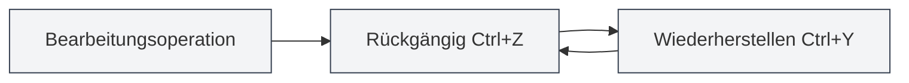
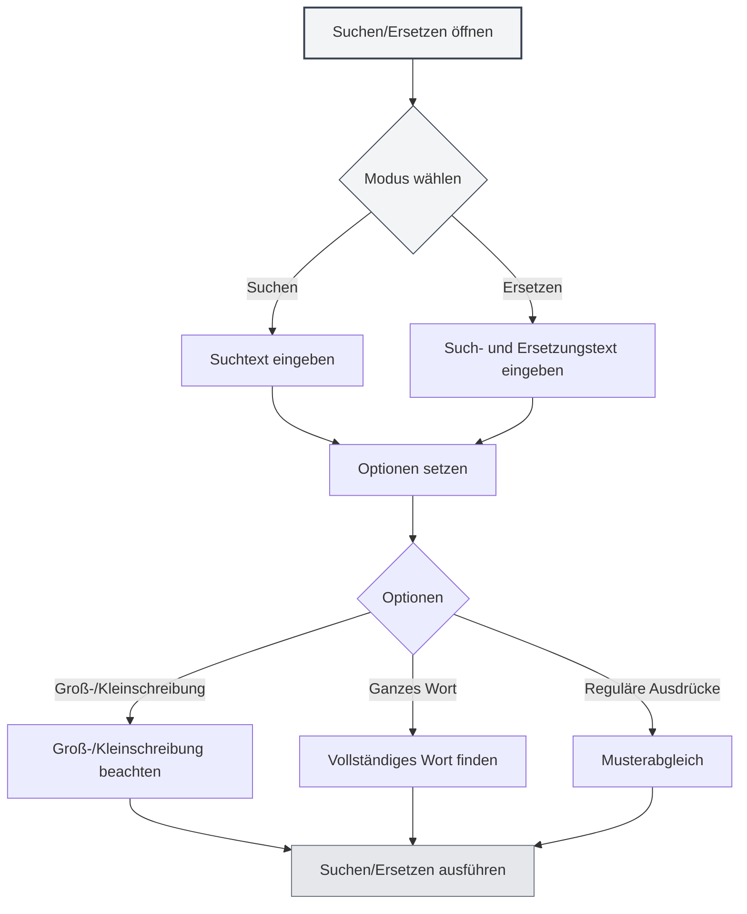

# Grundlegende Editor-Operationen

## Übersicht

Die grundlegenden Editor-Operationen sind die grundlegenden Fähigkeiten zur Bearbeitung von Dokumenten mit MetaDoc. Das Beherrschen dieser Operationen kann Ihre Bearbeitungseffizienz erheblich steigern.

Der MetaDoc-Editor unterstützt Standard-Textbearbeitungsoperationen, einschließlich Funktionen wie Rückgängig, Wiederholen, Kopieren, Einfügen, Ausschneiden, Alles auswählen sowie Suchen und Ersetzen.

<SearchReplaceMenu mode="demo" :position='{"top": 100, "left": 200}' :adapter='null' />

<MenuItemsDemo mode="demo" :items='[{"id": "edit"}]' />

## Rückgängig und Wiederholen

### Rückgängig-Operation

Macht die letzte Bearbeitungsoperation rückgängig:

- **Tastenkürzel**: `Ctrl+Z` (Windows/Linux) oder `Cmd+Z` (macOS)
- **Menü**: Klicken Sie auf "Bearbeiten" → "Rückgängig"

Mehrere Operationen können nacheinander rückgängig gemacht werden, bis der ursprüngliche Zustand des Dokuments wiederhergestellt ist.

### Wiederholen-Operation

<MenuItemsDemo mode="demo" :items='[{"id": "edit"}]' />

Stellt eine rückgängig gemachte Operation wieder her:

- **Tastenkürzel**: `Ctrl+Y` oder `Ctrl+Shift+Z` (Windows/Linux) oder `Cmd+Shift+Z` (macOS)
- **Menü**: Klicken Sie auf "Bearbeiten" → "Wiederholen"

Die Wiederholen-Operation stellt Operationen in umgekehrter Reihenfolge der Rückgängig-Operationen wieder her.

## Kopieren, Einfügen, Ausschneiden

<MenuItemsDemo mode="demo" :items='[{"id": "edit"}]' />

### Kopieren

Kopiert den ausgewählten Text in die Zwischenablage:

- **Tastenkürzel**: `Ctrl+C` (Windows/Linux) oder `Cmd+C` (macOS)
- **Menü**: Klicken Sie auf "Bearbeiten" → "Kopieren"
- **Kontextmenü**: Text auswählen, Rechtsklick und "Kopieren" wählen

### Einfügen

<MenuItemsDemo mode="demo" :items='[{"id": "edit"}]' />

Fügt den Inhalt der Zwischenablage an der aktuellen Position ein:

- **Tastenkürzel**: `Ctrl+V` (Windows/Linux) oder `Cmd+V` (macOS)
- **Menü**: Klicken Sie auf "Bearbeiten" → "Einfügen"
- **Kontextmenü**: Rechtsklick und "Einfügen" wählen

Die Einfügen-Operation fügt den Inhalt an der Cursorposition ein. Falls bereits Text ausgewählt ist, wird dieser ersetzt.

### Ausschneiden

<MenuItemsDemo mode="demo" :items='[{"id": "edit"}]' />

Schneidet den ausgewählten Text aus und kopiert ihn in die Zwischenablage (löscht den Inhalt an der ursprünglichen Position):

- **Tastenkürzel**: `Ctrl+X` (Windows/Linux) oder `Cmd+X` (macOS)
- **Menü**: Klicken Sie auf "Bearbeiten" → "Ausschneiden"
- **Kontextmenü**: Text auswählen, Rechtsklick und "Ausschneiden" wählen

Die Ausschneiden-Operation löscht den Text an der ursprünglichen Position und speichert ihn in der Zwischenablage, von wo aus er an anderer Stelle eingefügt werden kann.

## Alles auswählen

<MenuItemsDemo mode="demo" :items='[{"id": "edit"}]' />

Wählt den gesamten Inhalt des Dokuments aus:

- **Tastenkürzel**: `Ctrl+A` (Windows/Linux) oder `Cmd+A` (macOS)
- **Menü**: Klicken Sie auf "Bearbeiten" → "Alles auswählen"

Nach dem Auswählen können Sie:

- Den gesamten Dokumentinhalt kopieren
- Den gesamten Dokumentinhalt löschen
- Den gesamten Text einheitlich formatieren

## Suchen und Ersetzen

### Suchen

<SearchReplaceMenu mode="demo" :position='{"top": 100, "left": 200}' :adapter='null' />

Sucht nach einem bestimmten Text im Dokument:

- **Tastenkürzel**: `Ctrl+F` (Windows/Linux) oder `Cmd+F` (macOS)
- **Menü**: Klicken Sie auf "Bearbeiten" → "Suchen"

Die Suchfunktion unterstützt:

- **Groß-/Kleinschreibung beachten**: Unterscheidung zwischen Groß- und Kleinschreibung
- **Ganzes Wort**: Nur vollständige Wörter finden
- **Reguläre Ausdrücke**: Erweiterte Suche mit regulären Ausdrücken
- **Hervorhebung**: Gefundene Ergebnisse werden im Dokument hervorgehoben

### Ersetzen

<SearchReplaceMenu mode="demo" :position='{"top": 100, "left": 200}' :adapter='null' />

Sucht nach Text und ersetzt ihn:

- **Tastenkürzel**: `Ctrl+H` (Windows/Linux) oder `Cmd+H` (macOS)
- **Menü**: Klicken Sie auf "Bearbeiten" → "Suchen und Ersetzen"

Die Ersetzen-Funktion unterstützt:

- **Einzeln ersetzen**: Ersetzt gefundene Texte einzeln
- **Alle ersetzen**: Ersetzt alle gefundenen Texte auf einmal
- **Vorschau**: Zeigt eine Vorschau des Ergebnisses vor dem Ersetzen an

### Optionen für Suchen und Ersetzen

Der Dialog "Suchen und Ersetzen" bietet folgende Optionen:

- **Groß-/Kleinschreibung beachten**: Findet nur Texte mit exakt gleicher Groß-/Kleinschreibung
- **Ganzes Wort**: Findet nur vollständige Wörter (keine Wortteile)
- **Reguläre Ausdrücke**: Verwendet reguläre Ausdrücke für Musterabgleich
- **Zirkuläre Suche**: Beginnt automatisch am Dokumentanfang, wenn das Ende erreicht ist

Die Benutzeroberfläche des Such- und Ersetzen-Menüs sieht wie folgt aus:

<SearchReplaceMenu mode="demo" :position='{"top": 100, "left": 200}' :adapter='null' />

## Textauswahl

### Grundlegende Auswahl

- **Einmal klicken**: Setzt den Cursor an die geklickte Position
- **Ziehen**: Wählt Text von der Start- bis zur Endposition aus
- **Doppelklick**: Wählt das gesamte Wort aus
- **Dreifachklick**: Wählt die gesamte Zeile aus

### Erweiterte Auswahl

- **Shift+Klick**: Erweitert die Auswahl bis zur geklickten Position
- **Ctrl+Klick**: Fügt mehrere nicht zusammenhängende Auswahlbereiche hinzu (falls vom Editor unterstützt)
- **Alt+Ziehen**: Spaltenauswahlmodus (falls vom Editor unterstützt)

## Cursor-Bewegung

### Grundlegende Bewegung

- **Pfeiltasten**: Bewegt den Cursor nach oben, unten, links, rechts
- **Home/Ende**: Bewegt zum Zeilenanfang/-ende
- **Ctrl+Home/Ende**: Bewegt zum Dokumentanfang/-ende
- **Bild auf/Bild ab**: Blättert eine Seite nach oben/unten

### Wortweise Bewegung

- **Ctrl+Links-/Rechtspfeil**: Bewegt den Cursor wortweise
- **Ctrl+Auf-/Abwärtspfeil**: Bewegt den Cursor absatzweise nach oben/unten

## Löschoperationen

### Grundlegendes Löschen

- **Rücktaste**: Löscht das Zeichen vor dem Cursor
- **Entf**: Löscht das Zeichen nach dem Cursor
- **Ctrl+Rücktaste**: Löscht das ganze Wort vor dem Cursor
- **Ctrl+Entf**: Löscht das ganze Wort nach dem Cursor

## Editor-Unterschiede

MetaDoc bietet zwei Haupt-Editoren:

### Markdown-Editor (Vditor)

- Unterstützt Echtzeit-Vorschau
- Bietet eine Formatierungs-Symbolleiste
- Unterstützt mehrere Bearbeitungsmodi (IR/WYSIWYG/SV)
- Details unter [[markdown.editor|Markdown-Editor-Anleitung]]

### LaTeX-Editor (Monaco)

- Professionelles Code-Editor-Erlebnis
- Syntax-Hervorhebung und Auto-Vervollständigung
- Unterstützt Code-Faltung
- Details unter [[latex.editor|LaTeX-Editor-Anleitung]]

Die grundlegenden Operationen beider Editoren sind weitgehend identisch, unterscheiden sich jedoch bei erweiterten Funktionen.

## Tastenkürzel-Referenz

### Allgemeine Tastenkürzel

| Operation | Windows/Linux              | macOS         |
| --------- | -------------------------- | ------------- |
| Rückgängig | `Ctrl+Z`                   | `Cmd+Z`       |
| Wiederholen | `Ctrl+Y` oder `Ctrl+Shift+Z` | `Cmd+Shift+Z` |
| Kopieren  | `Ctrl+C`                   | `Cmd+C`       |
| Einfügen  | `Ctrl+V`                   | `Cmd+V`       |
| Ausschneiden | `Ctrl+X`                   | `Cmd+X`       |
| Alles auswählen | `Ctrl+A`                   | `Cmd+A`       |
| Suchen    | `Ctrl+F`                   | `Cmd+F`       |
| Suchen/Ersetzen | `Ctrl+H`                   | `Cmd+H`       |

## Hinweise

1. **Rückgängig-Verlauf**: Der Rückgängig-Verlauf wird nach dem Schließen des Dokuments gelöscht. Es wird empfohlen, Dokumente regelmäßig zu speichern.
2. **Zwischenablage**: Kopierte und ausgeschnittene Inhalte werden in der System-Zwischenablage gespeichert und können nach dem Schließen der Anwendung verloren gehen.
3. **Suchen und Ersetzen**: Achten Sie bei der Verwendung regulärer Ausdrücke auf die Maskierung von Sonderzeichen.
4. **Große Dokumente**: Bei großen Dokumenten können Such- und Ersetzen-Operationen einige Zeit in Anspruch nehmen.

## Verwandte Dokumente

- [[core.file-operations|Dateioperationen]]
- [[core.editor-settings|Editor-Einstellungen]]
- [[markdown.editor|Markdown-Editor-Anleitung]]
- [[latex.editor|LaTeX-Editor-Anleitung]]