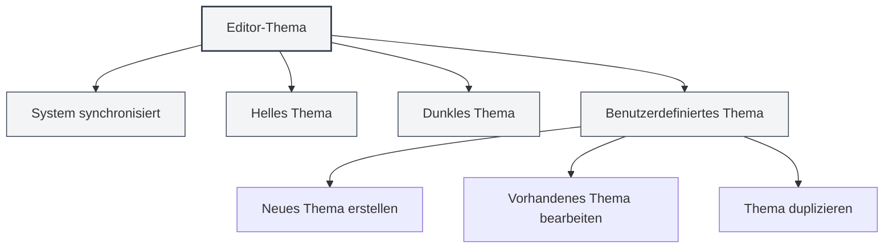
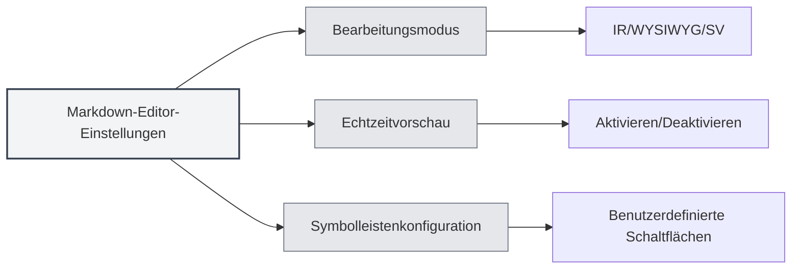

# Editor-Einstellungen

## Übersicht

Die Editor-Einstellungen ermöglichen es Ihnen, das Erscheinungsbild und Verhalten des Editors anzupassen, einschließlich Thema, Schriftart, Zeilennummernanzeige usw. Sinnvolle Einstellungen können Ihr Bearbeitungserlebnis und Ihre Produktivität steigern.

Die Editor-Einstellungen sind unterteilt in globale Einstellungen und editorspezifische Einstellungen. Globale Einstellungen betreffen alle Editoren, während bestimmte Einstellungen möglicherweise nur für bestimmte Editortypen gelten (z. B. Markdown-Editor oder LaTeX-Editor).

<MenuItemsDemo mode="demo" :items='[{"id": "settings"}]' />

## Editor-Thema

<MenuItemsDemo mode="demo" :items='[{"id": "settings"}]' />

### Thementypen

MetaDoc unterstützt mehrere Themenmodi:

- **System synchronisiert**: Folgt automatisch dem Systemthema (Hell/Dunkel)
- **Helles Thema**: Verwendet immer das helle Thema
- **Dunkles Thema**: Verwendet immer das dunkle Thema
- **Benutzerdefiniertes Thema**: Verwendet eine benutzerdefinierte Farbkonfiguration

### Thema einstellen

<SettingThemeSection mode="demo" />

1.  Öffnen Sie die Einstellungsseite (Klicken Sie auf das Menü "Einstellungen" oder verwenden Sie die Tastenkombination)
2.  Gehen Sie zum Abschnitt "Themeneinstellungen"
3.  Wählen Sie Ihr bevorzugtes Thema

Sie können über die obere Menüleiste auf die Einstellungen zugreifen:

Durch Klicken auf das Menü "Einstellungen" in der oberen Menüleiste können Sie das Einstellungsfenster öffnen, um Optionen wie Editor-Thema, Inhalts-Thema, Code-Thema usw. zu konfigurieren.

<MenuItemsDemo mode="demo" :items='[{"id": "settings"}]' />

Themeneinstellungen werden sofort wirksam, ein Neustart der Anwendung ist nicht erforderlich.

### Benutzerdefiniertes Thema

<SettingThemeSection mode="demo" />

Sie können benutzerdefinierte Themen erstellen und bearbeiten:

1.  Klicken Sie auf der Themeneinstellungsseite auf "Neues Thema"
2.  Legen Sie den Themennamen und die Themenfarben fest
3.  Nach dem Speichern kann das Thema verwendet werden

Benutzerdefinierte Themen unterstützen:

-   **Bearbeiten**: Ändern des Themennamens und der Farben
-   **Kopieren**: Ein vorhandenes Thema als Ausgangspunkt für ein neues Thema duplizieren
-   **Löschen**: Nicht benötigte benutzerdefinierte Themen löschen

## Inhalts-Thema

<SettingThemeSection mode="demo" />

Das Inhalts-Thema steuert den Anzeigestil des Dokumentvorschaubereichs:

-   **Automatisch**: Wählt automatisch basierend auf dem globalen Thema aus
-   **Hell**: Verwendet immer den hellen Vorschau-Stil
-   **Dunkel**: Verwendet immer den dunklen Vorschau-Stil

Das Inhalts-Thema beeinflusst hauptsächlich die Darstellung der Markdown-Vorschau und der PDF-Vorschau.

## Code-Thema

<SettingThemeSection mode="demo" />

Das Code-Thema steuert den Syntax-Highlighting-Stil für Codeblöcke:

-   **Automatisch**: Wählt automatisch basierend auf dem globalen Thema aus
-   **Voreingestellte Themen**: Wählen Sie ein voreingestelltes Code-Thema (z. B. GitHub, Monokai, Solarized usw.)

Das Code-Thema beeinflusst:

-   Syntax-Highlighting in Markdown-Codeblöcken
-   Code-Highlighting im LaTeX-Editor
-   Anzeigestil der Konsolenausgabe

## Schriftarteinstellungen

<SettingBasicSection mode="demo" />

### Editor-Schriftart

Die im Editor verwendete Schriftart kann in den Systemeinstellungen konfiguriert werden. Standardmäßig wird eine nichtproportionale Schriftart (Monospace) verwendet, wie z. B.:

-   JetBrains Mono
-   Consolas
-   Courier New
-   Microsoft YaHei Mono

### Schriftgröße

-   **Vergrößern**: Verwenden Sie `Strg+=` oder `Strg+Mausrad hoch`
-   **Verkleinern**: Verwenden Sie `Strg+-` oder `Strg+Mausrad runter`
-   **Zurücksetzen**: Verwenden Sie `Strg+0`, um auf die Standardgröße zurückzusetzen

Die Anpassung der Schriftgröße wird sofort wirksam, wird jedoch nicht in den Einstellungen gespeichert.

## Zeilennummernanzeige

<SettingBasicSection mode="demo" />

### Zeilennummern ein-/ausblenden

Die Einstellung für die Zeilennummernanzeige steuert, ob der Editor Zeilennummern anzeigt:

-   **Aktiviert**: Zeigt Zeilennummern an, um die Positionierung im Code zu erleichtern
-   **Deaktiviert**: Blendet Zeilennummern aus, um einen größeren Bearbeitungsbereich zu erhalten

### Zeilennummernanzeige einstellen

1.  Öffnen Sie die Einstellungsseite
2.  Finden Sie im Abschnitt "Editor-Einstellungen" die Option "Zeilennummernanzeige"
3.  Schalten Sie den Schalter um, um Zeilennummern zu aktivieren oder zu deaktivieren

Die Zeilennummerneinstellung betrifft:

-   LaTeX-Editor
-   Nur-Text-Editor
-   Code-Vorschaubereich

Hinweis: Die Zeilennummernanzeige im Markdown-Editor (Vditor) wird durch dessen eigene Konfiguration gesteuert.

## Minimap-Anzeige

Die Minimap ist eine verkleinerte Codevorschau auf der rechten Seite des Editors, die Ihnen hilft, schnell durch Dokumentinhalte zu navigieren und Positionen zu finden.

### Minimap ein-/ausblenden

Einstellung für die Minimap-Anzeige:

-   **Aktiviert**: Zeigt die Minimap an, um das Durchsuchen langer Dokumente zu erleichtern
-   **Deaktiviert**: Blendet die Minimap aus, um einen größeren Bearbeitungsbereich zu erhalten

### Minimap einstellen

Die Minimap-Einstellungen befinden sich normalerweise im Kontextmenü oder der Symbolleiste des Editors:

1.  Klicken Sie mit der rechten Maustaste in den Editor
2.  Suchen Sie nach der Option "Minimap" oder "Minimap"
3.  Schalten Sie den Anzeigestatus um

Die Minimap-Funktion ist hauptsächlich geeignet für:

-   LaTeX-Editor (Monaco)
-   Nur-Text-Editor (Monaco)

## Editorspezifische Einstellungen

### Markdown-Editor-Einstellungen

Spezifische Einstellungen für den Markdown-Editor (Vditor):

-   **Bearbeitungsmodus**: IR-Modus, WYSIWYG-Modus, SV-Modus
-   **Echtzeitvorschau**: Echtzeitvorschaufunktion aktivieren/deaktivieren
-   **Symbolleistenkonfiguration**: Symbolleistenschaltflächen anpassen

Weitere Details finden Sie unter [[markdown.editor|Markdown-Editor-Benutzerhandbuch]].

### LaTeX-Editor-Einstellungen

Spezifische Einstellungen für den LaTeX-Editor (Monaco):

-   **Code-Faltung**: Code-Faltfunktion aktivieren/deaktivieren
-   **Zeilenumbruch**: Steuert die Anzeige langer Zeilen
-   **Syntaxprüfung**: LaTeX-Syntaxprüfung aktivieren/deaktivieren

Weitere Details finden Sie unter [[latex.editor|LaTeX-Editor-Benutzerhandbuch]].

## Einstellungssynchronisierung

Editor-Einstellungen werden in der lokalen Konfiguration gespeichert, einschließlich:

-   Themenauswahl
-   Präferenz für Zeilennummernanzeige
-   Schriftgröße (aktuelle Sitzung)
-   Minimap-Anzeigestatus

Die Einstellungen werden nach einem Neustart der Anwendung automatisch wiederhergestellt.

## Tastenkombinationen Referenz

### Schriftgrößenanpassung

| Aktion               | Windows/Linux | macOS        |
| -------------------- | ------------- | ------------ |
| Schrift vergrößern   | `Strg+=`      | `Cmd+=`      |
| Schrift verkleinern  | `Strg+-`      | `Cmd+-`      |
| Schrift zurücksetzen | `Strg+0`      | `Cmd+0`      |
| Mausrad-Zoom         | `Strg+Mausrad`| `Cmd+Mausrad`|

## Best Practices

1.  **Themenauswahl**:

    -   Für längeres Bearbeiten wird ein dunkles Thema empfohlen, um die Augenbelastung zu reduzieren
    -   Verwenden Sie für den Druckvorgang ein helles Thema, um bessere Druckergebnisse zu erzielen

2.  **Zeilennummernanzeige**:

    -   Beim Schreiben von Code wird empfohlen, Zeilennummern zu aktivieren, um Fehler leichter zu finden
    -   Bei der Bearbeitung von reinem Text können Zeilennummern deaktiviert werden, um einen größeren Bearbeitungsbereich zu erhalten

3.  **Minimap**:

    -   Aktivieren Sie die Minimap beim Bearbeiten langer Dokumente, um die Dokumentstruktur schnell zu überblicken
    -   Beim Bearbeiten kurzer Dokumente kann die Minimap deaktiviert werden

4.  **Schriftgröße**:
    -   Passen Sie die Schriftgröße an die Bildschirmgröße und persönliche Gewohnheiten an
    -   Eine Schriftgröße von 14-16px wird empfohlen, um Lesbarkeit und Bildschirmplatz auszugleichen

## Wichtige Hinweise

1.  **Themensynchronisierung**: Nach Auswahl von "System synchronisiert" wechselt das Thema automatisch entsprechend den Systemeinstellungen
2.  **Einstellungsbereich**: Bestimmte Einstellungen betreffen nur bestimmte Editoren und nicht andere
3.  **Leistungsauswirkung**: Das Aktivieren bestimmter Funktionen (wie Echtzeitvorschau) kann die Editorleistung beeinträchtigen
4.  **Benutzerdefiniertes Thema**: Die Farben eines benutzerdefinierten Themas beeinflussen das gesamte Farbschema der Anwendung

## Verwandte Dokumentation

-   [[core.editor-basics|Grundlegende Editor-Bedienung]]
-   [[settings.basic|Grundeinstellungen]]
-   [[settings.theme|Themeneinstellungen]]
-   [[markdown.editor|Markdown-Editor-Benutzerhandbuch]]
-   [[latex.editor|LaTeX-Editor-Benutzerhandbuch]]