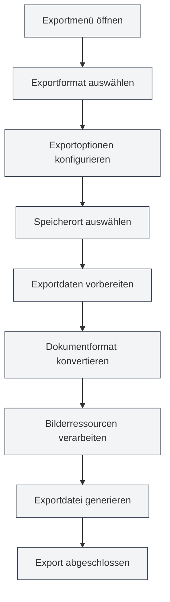

# Exportfunktion

## Übersicht

MetaDoc unterstützt den Export von Dokumenten in verschiedene Formate, einschließlich PDF, HTML, DOCX, LaTeX, Markdown, JSON usw. Die Exportfunktion bietet je nach Dokumentformat unterschiedliche Exportoptionen, um sicherzustellen, dass das exportierte Dokument das ursprüngliche Format und Styling beibehält.

Die Exportfunktion bezieht automatisch Dokument-Metadaten (Titel, Autor, Beschreibung, Schlüsselwörter) ein und verarbeitet während des Exportvorgangs Elemente wie Bilder, Tabellen, mathematische Formeln usw.

<MenuItemsDemo mode="demo" :items='[{"id": "file", "items": ["export"]}]' />

<MetaInfoPanel mode="demo" :meta='{"title": "Exportbeispiel", "author": "Autor", "description": "Dokumentbeschreibung", "keywords": ["Export", "PDF"]}' :outlineJson='""' />

<MenuItemsDemo mode="demo" :items='[{"id": "file", "items": ["export"]}]' />

<MetaInfoPanel mode="demo" :meta='{"title": "Exportformate", "author": "MetaDoc", "description": "Einführung in unterstützte Exportformate", "keywords": ["Export", "Format"]}' :outlineJson='""' />

## Unterstützte Exportformate

<MenuItemsDemo mode="demo" :items='[{"id": "file", "items": ["export"]}]' />

### Markdown-Dokumentexport

Markdown-Dokumente (`.md`) können in folgende Formate exportiert werden:

- **PDF**: Geeignet zum Drucken und Teilen
- **HTML**: Geeignet für die Webdarstellung
- **DOCX**: Geeignet für die Bearbeitung in Word
- **LaTeX**: Geeignet für wissenschaftliche Arbeiten
- **JSON**: Geeignet für die Programmverarbeitung

<MetaInfoPanel mode="demo" :meta='{"title": "LaTeX-Export", "author": "System", "description": "LaTeX-Dokumentexportoptionen", "keywords": ["LaTeX", "Export"]}' :outlineJson='""' />

### LaTeX-Dokumentexport

LaTeX-Dokumente (`.tex`) können in folgende Formate exportiert werden:

- **PDF**: Generiert durch LaTeX-Kompilierung
- **Markdown**: Konvertiert in das Markdown-Format
- **HTML**: Konvertiert in das HTML-Format
- **DOCX**: Konvertiert in das Word-Format

<MenuItemsDemo mode="demo" :items='[{"id": "file", "items": ["export"]}]' />

### JSON-Dokumentexport

JSON-Dokumente (`.json`) können exportiert werden als:

- **JSON**: Beibehaltung des JSON-Formats

## Exportvorgang

### Grundlegender Export

1. **Exportmenü öffnen**:
   - Klicken Sie auf "Datei" → "Exportieren" in der Menüleiste
   - Oder verwenden Sie die Tastenkombination (falls konfiguriert)

Die Exportoptionen im Dateimenü sind wie folgt:

<MenuItemsDemo mode="demo" :items='[{"id": "file", "items": ["export"]}]' />

2. **Exportformat auswählen**:

   - Wählen Sie das Zielformat im Exportmenü
   - Das System zeigt basierend auf dem aktuellen Dokumentformat die verfügbaren Exportoptionen an

3. **Speicherort auswählen**:

   - Wählen Sie den Speicherort im Dateispeichern-Dialog
   - Geben Sie einen Dateinamen ein (das System fügt automatisch die richtige Erweiterung hinzu)

4. **Auf Abschluss des Exports warten**:
   - Während des Exports wird ein Fortschrittsbalken angezeigt
   - Nach Abschluss des Exports wird eine Erfolgsmeldung angezeigt

### Schnellexport

Für häufig verwendete Formate können Tastenkombinationen für einen schnellen Export verwendet werden:

- **Als PDF exportieren**: `Strg+Umschalt+E` (falls konfiguriert)
- **Als HTML exportieren**: Über die Menüauswahl

## Detaillierte Erklärung des Markdown-Exports

<MenuItemsDemo mode="demo" :items='[{"id": "file", "items": ["export"]}]' />

### Export als PDF

Der PDF-Export konvertiert Markdown in das PDF-Format:

- **Enthaltene Inhalte**: Dokumentinhalt, Bilder, Tabellen, mathematische Formeln
- **Enthaltene Metadaten**: Titel, Autor, Beschreibung, Schlüsselwörter
- **Stil**: Verwendung von PDF-spezifischen Stilen, druckgeeignet
- **Bildverarbeitung**: Bilder werden automatisch skaliert, um auf die Seite zu passen

**Anwendungsfälle**:

- Dokumente drucken
- Dokumente mit anderen teilen
- Archivierung

### Export als HTML

<MetaInfoPanel mode="demo" :meta='{"title": "HTML-Export", "author": "System", "description": "HTML-Exporteinstellungen und -optionen", "keywords": ["HTML", "Export"]}' :outlineJson='""' />

Der HTML-Export konvertiert Markdown in das Webseitenformat:

- **Enthaltene Inhalte**: Dokumentinhalt, Bilder, Tabellen, mathematische Formeln
- **Enthaltene Metadaten**: Titel, Autor, Beschreibung, Schlüsselwörter (in den HTML-Meta-Tags)
- **Stil**: Verwendung von HTML-Stilen, geeignet für die Webdarstellung
- **Bildverarbeitung**: Option zum Beibehalten der Original-URL, Konvertierung in Base64 oder Speicherung in einem Ordner

**Anwendungsfälle**:

- Auf einer Website veröffentlichen
- Im Browser anzeigen
- Mit anderen teilen

### Export als DOCX

<MenuItemsDemo mode="demo" :items='[{"id": "file", "items": ["export"]}]' />

Der DOCX-Export konvertiert Markdown in das Word-Format:

- **Enthaltene Inhalte**: Dokumentinhalt, Bilder, Tabellen, mathematische Formeln
- **Enthaltene Metadaten**: Titel, Autor, Beschreibung, Schlüsselwörter (in den Word-Dokumenteigenschaften)
- **Stil**: Verwendung von Word-Stilen, kann in Word weiter bearbeitet werden
- **Bildverarbeitung**: Bilder werden in das Word-Dokument eingebettet

**Anwendungsfälle**:

- Weitere Bearbeitung in Word
- Kollaborative Bearbeitung mit anderen
- Dokumente einreichen

### Export als LaTeX

<MetaInfoPanel mode="demo" :meta='{"title": "LaTeX-Export", "author": "Akademisch", "description": "Markdown-zu-LaTeX-Export", "keywords": ["LaTeX", "Akademisch"]}' :outlineJson='""' />

Der LaTeX-Export konvertiert Markdown in das LaTeX-Format:

- **Enthaltene Inhalte**: Dokumentinhalt, Bilder, Tabellen, mathematische Formeln
- **Enthaltene Metadaten**: Titel, Autor, Beschreibung, Schlüsselwörter (im LaTeX-Dokument)
- **Formatkonvertierung**: Markdown-Syntax wird in entsprechende LaTeX-Befehle umgewandelt
- **Mathematische Formeln**: Beibehaltung des LaTeX-Formelformats

**Anwendungsfälle**:

- Verfassen wissenschaftlicher Arbeiten
- Szenarien, die das LaTeX-Format erfordern
- Weitere Bearbeitung von LaTeX-Dokumenten

### Export als JSON

<MenuItemsDemo mode="demo" :items='[{"id": "file", "items": ["export"]}]' />

Der JSON-Export speichert das Dokument im JSON-Format:

- **Enthaltene Inhalte**: Alle Dokumentdaten (Inhalt, Metadaten, Gliederung usw.)
- **Format**: Strukturierte JSON-Daten
- **Verwendungszweck**: Programmverarbeitung, Datensicherung

## Detaillierte Erklärung des LaTeX-Exports

<MetaInfoPanel mode="demo" :meta='{"title": "Detaillierte Erklärung des LaTeX-Exports", "author": "System", "description": "Detaillierte Anleitung zum LaTeX-Dokumentexport", "keywords": ["LaTeX", "PDF", "Export"]}' :outlineJson='""' />

### Export als PDF

Der Export von LaTeX-Dokumenten als PDF erfordert eine LaTeX-Kompilierung:

1. **LaTeX kompilieren**: Das System kompiliert das LaTeX-Dokument automatisch
2. **PDF generieren**: Nach erfolgreicher Kompilierung wird eine PDF-Datei generiert
3. **Metadaten enthalten**: Die PDF-Dokumenteigenschaften enthalten die Metadaten

**Hinweise**:

- Eine LaTeX-Distribution (z. B. TeX Live) muss installiert sein
- Die Kompilierung kann einige Zeit in Anspruch nehmen
- Bei Kompilierungsfehlern werden Fehlermeldungen angezeigt

### Export als Markdown

LaTeX-Dokumente können in das Markdown-Format konvertiert werden:

- **Formatkonvertierung**: LaTeX-Befehle werden in Markdown-Syntax umgewandelt
- **Mathematische Formeln**: LaTeX-Formeln werden in das Markdown-Formelformat konvertiert
- **Tabellen**: LaTeX-Tabellen werden in Markdown-Tabellen konvertiert

### Export als HTML

LaTeX-Dokumente können in das HTML-Format konvertiert werden:

- **Formatkonvertierung**: LaTeX-Befehle werden in HTML-Tags umgewandelt
- **Mathematische Formeln**: Wiedergabe mit MathJax oder KaTeX
- **Stil**: Darstellung mit HTML-Stilen

### Export als DOCX

LaTeX-Dokumente können in das Word-Format konvertiert werden:

- **Formatkonvertierung**: LaTeX-Befehle werden in das Word-Format umgewandelt
- **Mathematische Formeln**: Konvertierung in das Word-Formelformat
- **Tabellen**: Konvertierung in das Word-Tabellenformat

## Konfiguration der Exportoptionen

### Bildverarbeitungsoptionen

Beim Export kann die Bildverarbeitungsweise konfiguriert werden:

- **Original-URL beibehalten**: Beibehaltung der Original-URL der Bilder (für HTML-Export geeignet)
- **In Base64 konvertieren**: Einbetten der Bilder in das Dokument (für HTML-, DOCX-Export geeignet)
- **In Ordner speichern**: Speichern der Bilder in einem bestimmten Ordner (für HTML-Export geeignet)

### PDF-Exportoptionen

Der PDF-Export unterstützt folgende Optionen:

- **Seitengröße**: A4, Letter usw.
- **Seitenränder**: Benutzerdefinierte Seitenränder
- **Schriftart**: Auswahl von Schriftart und Schriftgröße
- **Bildqualität**: Anpassung der Bildqualität

### HTML-Exportoptionen

Der HTML-Export unterstützt folgende Optionen:

- **Stil**: Auswahl eines HTML-Stilthemas
- **Mathematische Formelwiedergabe**: Auswahl von MathJax oder KaTeX
- **Code-Hervorhebung**: Aktivieren oder Deaktivieren der Code-Hervorhebung

## Exportfortschritt

Während des Exports wird ein Fortschrittsbalken angezeigt:

- **Vorbereitungsphase**: Vorbereiten der Exportdaten
- **Konvertierungsphase**: Konvertieren des Dokumentformats
- **Bildverarbeitung**: Verarbeiten der Bilder im Dokument
- **Dateigenerierung**: Generieren der endgültigen Datei

Wenn der Export länger dauert, können Sie:

- **Fortschritt anzeigen**: Aktuellen Fortschritt im Fortschrittsbalken anzeigen
- **Export abbrechen**: Exportvorgang über die Schaltfläche "Abbrechen" beenden

## Benennung von Exportdateien

Exportierte Dateien werden automatisch benannt:

- **Standardname**: Verwendung des Dokumenttitels oder Dateinamens
- **Automatische Erweiterung**: Automatisches Hinzufügen der Erweiterung basierend auf dem Exportformat
- **Benutzerdefinierter Name**: Benutzerdefinierter Name kann im Speichern-Dialog ausgewählt werden

## Anwendungstipps

### Passendes Format auswählen

- **PDF**: Geeignet für den Druck und formelles Teilen
- **HTML**: Geeignet für die Webdarstellung und Online-Anzeige
- **DOCX**: Geeignet für Szenarien, die weitere Bearbeitung erfordern
- **LaTeX**: Geeignet für wissenschaftliches Schreiben und Szenarien, die das LaTeX-Format erfordern

### Empfehlungen zur Bildverarbeitung

- **HTML-Export**: Für die Darstellung auf Webseiten wird Base64 oder Speicherung in einem Ordner empfohlen
- **DOCX-Export**: Bilder werden automatisch eingebettet, keine zusätzliche Verarbeitung erforderlich
- **PDF-Export**: Bilder werden automatisch skaliert, um auf die Seite zu passen

### Stapelweise Exporte

Falls mehrere Dokumente exportiert werden müssen:

1. Dokumente einzeln öffnen
2. Jeweils in das benötigte Format exportieren
3. Oder Skripte für die Stapelverarbeitung verwenden (für fortgeschrittene Benutzer)

## Häufig gestellte Fragen

### F: Was tun, wenn der Export fehlschlägt?

A: Überprüfen Sie, ob das Dokument Fehler enthält, und stellen Sie sicher, dass alle Bilder und Ressourcen zugänglich sind. Wenn der PDF-Export fehlschlägt, überprüfen Sie, ob LaTeX-Kompilierungsfehler vorliegen.

### F: Das exportierte PDF-Format ist nicht korrekt?

A: Überprüfen Sie die PDF-Exportoptionen, passen Sie die Seitengröße und Seitenränder an. Stellen Sie sicher, dass das Dokumentformat korrekt ist.

### F: Bilder werden nach dem Export nicht angezeigt?

A: Überprüfen Sie, ob der Bildpfad korrekt ist, und stellen Sie sicher, dass die Bilddatei existiert. Wählen Sie für den HTML-Export eine geeignete Bildverarbeitungsweise.

### F: Kann der Exportstil angepasst werden?

A: Einige Formate unterstützen benutzerdefinierte Stile, die in den Exportoptionen konfiguriert werden können. PDF- und HTML-Export unterstützen die Anpassung von Stilen.

### F: Werden Metadaten beim Export eingeschlossen?

A: Ja, beim Export werden automatisch Dokument-Metadaten (Titel, Autor, Beschreibung, Schlüsselwörter) eingeschlossen, die in den Eigenschaften des exportierten Dokuments angezeigt werden.

## Verwandte Dokumentation

- [[core.file-operations|Dateioperationen]]
- [[core.document-metadata|Dokument-Metadaten]]
- [[markdown.basics|Markdown-Syntax]]
- [[latex.basics|LaTeX-Syntax]]
- [[latex.compilation|LaTeX-Kompilierung und -Vorschau]]
