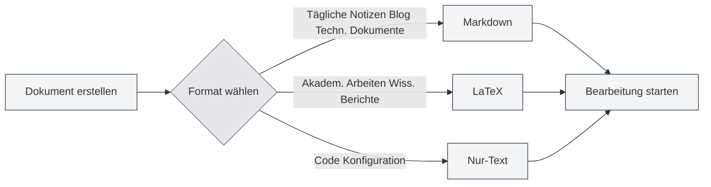
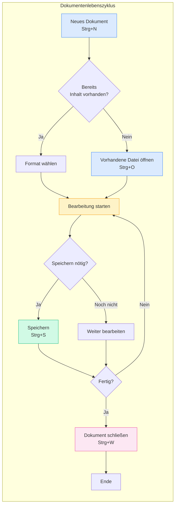

# Dateioperationen

## Übersicht

Dateioperationen sind eine grundlegende Funktion von MetaDoc. Egal, ob Sie technische Dokumentationen verfassen, akademische Arbeiten schreiben oder tägliche Notizen festhalten, sichere Dateioperationen machen den Erstellungsprozess reibungsloser. Dieser Artikel erläutert detailliert, wie Sie Dokumente erstellen, öffnen, speichern und verwalten.

## Neues Dokument

<MainTabs mode="demo" />

<MenuItemsDemo mode="demo" :items='[{"id": "file", "items": ["new"]}]' />

### Leeres Dokument erstellen

MetaDoc bietet mehrere bequeme Möglichkeiten, ein neues Dokument zu erstellen. Sie können die für Ihre aktuelle Arbeitsweise passendste Methode wählen:

**Methode 1: Tastenkürzel (am schnellsten)**

- Drücken Sie `Strg+N`, um sofort ein neues Dokument zu erstellen.
- Ideal, um während der Bearbeitung schnell ein neues Dokument zu erstellen.

**Methode 2: Datei-Menü**

- Klicken Sie auf das "Datei"-Symbol in der linken Menüleiste.
- Wählen Sie "Neu" im aufklappenden Menü.

**Methode 3: Startseiten-Einstieg**

- Klicken Sie auf der Startseite auf die Schaltfläche "Neues Dokument".
- Ideal, um direkt nach dem Öffnen der Anwendung mit der Arbeit zu beginnen.

Unten ist die Benutzeroberfläche des Datei-Menüs dargestellt, die gängige Operationen wie Neu, Öffnen, Speichern usw. enthält:

<MenuItemsDemo mode="demo" :items='[{"id": "file", "items": ["new", "open", "save", "save-as", "save-all", "close"]}]' />

<MainTabs mode="demo" />

**Status nach dem Erstellen eines Dokuments**:

Nach dem Erstellen eines neuen Dokuments sehen Sie:

- Einen neuen Tab oben, dessen Titel "Unbenannt" lautet.
- Das System fragt Sie nach dem gewünschten Dokumentformat (Markdown, LaTeX oder Nur-Text).
- Das Dokument befindet sich zunächst nur im Arbeitsspeicher und muss gespeichert werden, um auf der Festplatte erhalten zu bleiben.

```mermaid
graph LR
    A[Neues Dokument erstellen] --> B{Wahl der Methode}
    B -->|Tastenkürzel| C[Strg+N]
    B -->|Menü| D[Datei→Neu]
    B -->|Startseite| E[Schaltfläche "Neues Dokument"]
    C --> F[Format wählen]
    D --> F
    E --> F
    F --> G[Tab erstellen]
    G --> H[Dokument initialisieren]
    style A fill:#f3f4f6,stroke:#374151
    style B fill:#f3f4f6,stroke:#374151
    style C fill:#f3f4f6,stroke:#374151
    style D fill:#f3f4f6,stroke:#374151
    style E fill:#f3f4f6,stroke:#374151
    style F fill:#f3f4f6,stroke:#374151
    style G fill:#f3f4f6,stroke:#374151
    style H fill:#f3f4f6,stroke:#374151
```

### Dokumentformat wählen

Beim Erstellen eines Dokuments müssen Sie das Dokumentformat wählen. Unterschiedliche Formate eignen sich für verschiedene Szenarien:

**Markdown (.md)** – Das am häufigsten verwendete, leichtgewichtige Format

- **Geeignet für**: Tägliche Notizen, Blogbeiträge, technische Dokumentation, Projekt-Dokumentation
- **Vorteile**: Einfache Syntax, leicht lesbar, reichhaltige Exportformate
- **Beispielszenarien**: Besprechungspunkte notieren, technische Blogs schreiben, Lernnotizen organisieren

**LaTeX (.tex)** – Professionelles Format für akademisches Layout

- **Geeignet für**: Akademische Arbeiten, Dissertationen, wissenschaftliche Berichte, mathematische Dokumente
- **Vorteile**: Hervorragendes Layout, umfassende Formelunterstützung, automatische Generierung von Inhaltsverzeichnissen und Referenzen
- **Beispielszenarien**: Forschungsarbeiten verfassen, Mathematik-Lehrbücher schreiben, akademische Präsentationen vorbereiten

**Nur-Text (.txt)** – Das einfachste Textformat

- **Geeignet für**: Code-Snippets, Konfigurationsdateien, temporäre Notizen
- **Vorteile**: Hohe Kompatibilität, kann mit jedem Editor geöffnet werden
- **Beispielszenarien**: Code-Snippets speichern, temporäre Informationen festhalten



## Dokument öffnen

<MenuItemsDemo mode="demo" :items='[{"id": "file", "items": ["open"]}]' />

### Vorhandene Datei öffnen

1.  **Tastenkürzel**: Drücken Sie `Strg+O`, um den Dateiauswahldialog zu öffnen.
2.  **Menü-Methode**: Klicken Sie auf "Datei" → "Öffnen".
3.  **Startseiten-Methode**: Klicken Sie auf der Startseite auf die Schaltfläche "Datei öffnen".

### Unterstützte Dateiformate

MetaDoc unterstützt das Öffnen von Dateien in folgenden Formaten:

-   `.md` – Markdown-Dokumente
-   `.tex` – LaTeX-Dokumente
-   `.txt` – Nur-Text-Dateien
-   `.json` – JSON-formatierte Dateien

### Liste zuletzt geöffneter Dateien

Die Startseite zeigt eine Liste der zuletzt geöffneten Dokumente an, um Ihnen den schnellen Zugriff zu erleichtern:

-   Klicken Sie auf eine Karte eines kürzlich geöffneten Dokuments, um es schnell zu öffnen.
-   Mit einem Rechtsklick können Sie einen Eintrag aus der Liste entfernen.
-   Es werden maximal 12 zuletzt geöffnete Dokumente angezeigt.

### Dateiverknüpfung

MetaDoc unterstützt Dateiverknüpfungen:

-   Ein Doppelklick auf eine `.md`- oder `.tex`-Datei im System öffnet diese automatisch mit MetaDoc.
-   Wenn die Datei bereits in einem anderen Fenster geöffnet ist, werden Sie darauf hingewiesen.

## Dokument speichern

<MenuItemsDemo mode="demo" :items='[{"id": "file", "items": ["save", "save-as", "save-all"]}]' />

### Aktuelles Dokument speichern

Gewöhnen Sie sich an, regelmäßig zu speichern, um den Verlust von Arbeitsergebnissen durch unerwartete Ereignisse zu vermeiden.

**Speichermethoden**:

-   **Tastenkürzel** (empfohlen): `Strg+S` – Die am häufigsten verwendete Methode, ohne die Hände von der Tastatur nehmen zu müssen.
-   **Menüoperation**: Klicken Sie auf das "Datei"-Menü → "Speichern".

**Erstmaliges Speichern**:
Wenn das Dokument neu erstellt wurde, erscheint beim ersten Speichern der Dialog "Speichern unter". Sie müssen:

1.  Einen Speicherort wählen (z. B. den Ordner "Dokumente").
2.  Einen Dateinamen eingeben (z. B. "Projektplan.md").
3.  Auf die Schaltfläche "Speichern" klicken.

**Aktualisierungsspeicherung für bereits gespeicherte Dokumente**:
Wenn das Dokument zuvor bereits gespeichert wurde, überschreibt `Strg+S` die Originaldatei direkt, ohne dass ein Dialog erscheint.

### Speichern unter – Eine Kopie des Dokuments erstellen

Verwenden Sie die Funktion "Speichern unter", wenn Sie eine neue Version eines Dokuments erstellen möchten, während das Original erhalten bleibt.

**Anwendungsfälle**:

-   Erstellen einer Sicherungskopie vor Änderungen am Dokument.
-   Speichern des Dokuments an einem anderen Ort.
-   Speichern verschiedener Versionen eines Dokuments unter unterschiedlichen Namen.

**Vorgehensweise**:

-   **Tastenkürzel**: `Strg+Umschalt+S`
-   **Menü**: Klicken Sie auf "Datei" → "Speichern unter".

**Beispiel**:
Sie bearbeiten "Berichtv1.md" und möchten eine Sicherungskopie anlegen, bevor Sie größere Änderungen vornehmen:

1.  Drücken Sie `Strg+Umschalt+S`.
2.  Geben Sie den neuen Dateinamen "Berichtv1_Backup.md" ein.
3.  Klicken Sie auf Speichern.
4.  Bearbeiten Sie das Originaldokument weiter und nehmen Sie Änderungen vor.

### Alle speichern – Alle Dokumente mit einem Klick speichern

Wenn Sie mehrere Dokumente gleichzeitig geöffnet haben, können Sie mit der Funktion "Alle speichern" alle Dokumente auf einmal speichern.

**Vorgehensweise**:

-   **Tastenkürzel**: `Strg+K S` (zuerst `Strg+K`, dann `S`)
-   **Menü**: Klicken Sie auf "Datei" → "Alle speichern".

**Anwendungsfälle**:

-   Schnelles Speichern aller geöffneten Dokumente am Ende der Arbeit.
-   Sicherstellen, dass alle Änderungen gespeichert wurden.

### Automatisches Speichern – Lassen Sie das System für Sie speichern

MetaDoc unterstützt die automatische Speicherung, die Ihre Dokumente im Hintergrund speichert, während Sie sich auf das Schreiben konzentrieren.

**Einrichtungsmethode**:
Gehen Sie zu [[settings.basic|Grundlegende Einstellungen]], finden Sie die Option "Automatisch speichern" und wählen Sie ein geeignetes Zeitintervall:

-   **Aus**: Manuelle Kontrolle des Speicherzeitpunkts.
-   **1 Minute**: Am sichersten, erhöht aber die Schreibvorgänge auf die Festplatte.
-   **5 Minuten**: Ausgewogene Lösung (empfohlen).
-   **10 Minuten/30 Minuten/1 Stunde**: Geeignet für lange Dokumente, reduziert die Speicherhäufigkeit.

**Funktionsweise**:

-   Das automatische Speichern erfolgt im Hintergrund und unterbricht Ihre Bearbeitung nicht.
-   Beim automatischen Speichern verschwindet die Markierung "Ungespeichert" auf dem Tab.
-   Sie können jederzeit manuell speichern (`Strg+S`), unabhängig vom automatischen Speichern.

**Empfehlung**:

-   Für wichtige Dokumente wird die Aktivierung der 5-Minuten-Automatik empfohlen.
-   Selbst bei aktivierter Automatik wird empfohlen, an wichtigen Punkten (z. B. nach Abschluss eines Kapitels) manuell zu speichern.

## Datei schließen

<MainTabs mode="demo" />

### Aktuellen Tab schließen

-   **Tastenkürzel**: `Strg+W`
-   **Klick auf Tab-Schließ-Button**: Klicken Sie auf den ×-Button rechts neben dem Tab.

### Hinweis vor dem Schließen

Wenn das Dokument ungespeicherte Änderungen enthält, werden Sie beim Schließen gefragt:

-   **Speichern**: Änderungen speichern und dann schließen.
-   **Nicht speichern**: Änderungen verwerfen und direkt schließen.
-   **Abbrechen**: Schließvorgang abbrechen.

### Geschlossenen Tab wieder öffnen

-   **Tastenkürzel**: `Strg+Umschalt+T`

Kann kürzlich geschlossene Tabs wiederherstellen (bis zu 20).

## Verwaltung mehrerer Tabs

<MainTabs mode="demo" />

MetaDoc unterstützt das gleichzeitige Öffnen mehrerer Dokumente, wobei jedes Dokument in einem separaten Tab angezeigt wird:

Die Tab-Leiste zeigt alle geöffneten Dokumente an und unterstützt Operationen wie Wechseln, Schließen, Ziehen usw.:

<MainTabs mode="demo" />

-   **Tab wechseln**: Verwenden Sie `Strg+Tab`, um zum nächsten Tab zu wechseln, und `Strg+Umschalt+Tab`, um zum vorherigen zu wechseln.
-   **Durch Ziehen sortieren**: Sie können Tabs durch Ziehen neu anordnen.
-   **Tab anheften**: Klicken Sie mit der rechten Maustaste auf einen Tab und wählen Sie "Anheften". Angeheftete Tabs werden immer links angezeigt und können nicht geschlossen werden.

Weitere Tab-Operationen finden Sie unter [[core.multi-tab|Verwaltung mehrerer Tabs]].



## Dateistatusanzeige

Tabs zeigen den Status des Dokuments an:

-   **Ungespeichert**: Neben dem Tab-Titel wird ein Punkt (●) angezeigt, was auf ungespeicherte Änderungen hinweist.
-   **Gespeichert**: Keine besondere Markierung.
-   **Schreibgeschützt**: Ein Schloss-Symbol wird angezeigt, was bedeutet, dass die Datei im schreibgeschützten Modus ist.

## Wichtige Hinweise

1.  **Dateipfad**: Stellen Sie beim Speichern von Dateien sicher, dass genügend Festplattenspeicher und Schreibberechtigungen vorhanden sind.
2.  **Dateiformat**: Achten Sie beim Speichern auf die Wahl des richtigen Dateiformats, um Inkompatibilitäten zu vermeiden.
3.  **Sicherung**: Wichtige Dokumente sollten regelmäßig gesichert werden. Verwenden Sie dazu die Funktion "Speichern unter", um Kopien zu erstellen.
4.  **Dateikonflikte**: Wenn eine Datei extern geändert wurde, erkennt MetaDoc dies und fordert Sie auf, den Konflikt zu behandeln.

## Verwandte Dokumentation

-   [[core.editor-basics|Grundlegende Editor-Operationen]]
-   [[core.multi-tab|Verwaltung mehrerer Tabs]]
-   [[core.document-metadata|Dokument-Metadaten]]
-   [[core.export|Exportfunktionen]]
-   [[settings.basic|Grundlegende Einstellungen]]