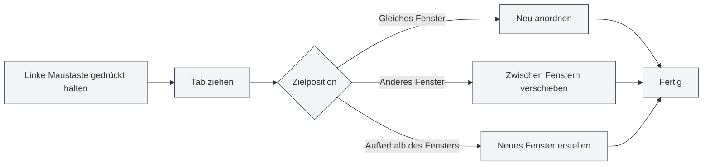

# Mehrfach-Tab-Verwaltung

## Übersicht

MetaDoc unterstützt die Verwaltung mehrerer Tabs, sodass Sie mehrere Dokumente gleichzeitig öffnen können, wobei jedes Dokument in einem separaten Tab angezeigt wird. Das Beherrschen der Tab-Operationen kann Ihre Arbeitseffizienz erheblich steigern.

Die Tab-Verwaltung umfasst Funktionen wie Neu erstellen, Wechseln, Schließen, Ziehen und Ablegen zum Sortieren sowie Fixieren, sodass Sie mehrere Dokumente flexibel organisieren und verwalten können.

<MainTabs mode="demo" />

<AIChat mode="demo" />

<KnowledgeBase mode="demo" />

<ProofreadView mode="demo" />

<QuickStartPanel mode="demo" />

<GraphWindow mode="demo" />

<OcrWindow mode="demo" />

<DataAnalysisWindow mode="demo" />

<AgentView mode="demo" />

<MenuItemsDemo mode="demo" :items='[{"id": "file", "items": ["new", "open", "save"]}]' />

<ViewMenuItemsDemo mode="demo" :items='["editor", "outline"]' />

<Outline mode="demo" />

<ResizableDivider mode="demo" />

<TitleMenu mode="demo" title="Tab-Beispiel" :position='{"top": 100, "left": 200}' path="1" :tree='{}' />

## Neuen Tab erstellen

### Neuen Tab anlegen

Es gibt mehrere Möglichkeiten, einen neuen Tab zu erstellen:

1.  **Tastenkombination**: Drücken Sie `Strg+T`, um schnell einen neuen Tab zu erstellen.
2.  **Schaltfläche klicken**: Klicken Sie auf die "+"-Schaltfläche rechts in der Tab-Leiste.
3.  **Menü**: Klicken Sie auf "Datei" → "Neu".

Die Tab-Leiste zeigt alle geöffneten Dokumente an und unterstützt Operationen wie Neu erstellen, Wechseln, Schließen usw.:

<MainTabs mode="demo" />

Der neu erstellte Tab öffnet ein leeres Dokument. Sie können das Dokumentformat (Markdown/LaTeX/Nur-Text) auswählen.

### Tab aus Datei erstellen

Beim Öffnen einer Datei wird automatisch ein neuer Tab erstellt:

1.  **Tastenkombination**: Drücken Sie `Strg+O`, um den Dateiauswahldialog zu öffnen.
2.  **Menü**: Klicken Sie auf "Datei" → "Öffnen".
3.  **Startseite**: Klicken Sie auf der Startseite auf die Schaltfläche "Datei öffnen".

Die geöffnete Datei wird in einem neuen Tab angezeigt.

## Zwischen Tabs wechseln

### Wechseln per Tastenkombination

-   **Nächster Tab**: `Strg+Tab` wechselt zum nächsten Tab.
-   **Vorheriger Tab**: `Strg+Umschalt+Tab` wechselt zum vorherigen Tab.

Der Wechsel erfolgt zyklisch. Nach dem letzten Tab wird automatisch zum ersten zurückgekehrt.

### Wechseln mit der Maus

-   **Tab anklicken**: Klicken Sie direkt auf den Tab-Titel, um zu diesem Tab zu wechseln.
-   **Mausrad**: Scrollen Sie mit dem Mausrad über der Tab-Leiste, um zwischen Tabs zu wechseln.
    -   **Nach unten scrollen**: Wechselt zum nächsten Tab.
    -   **Nach oben scrollen**: Wechselt zum vorherigen Tab.

### Tab-Wechselanzeige

Bei Verwendung der Tastenkombination zum Tab-Wechsel wird eine Wechselanzeige eingeblendet, die den aktuell ausgewählten Tab anzeigt, um Ihnen eine schnelle Orientierung zu ermöglichen.

## Tab schließen

### Aktuellen Tab schließen

-   **Tastenkombination**: `Strg+W` schließt den aktuell aktiven Tab.
-   **Schließen-Schaltfläche klicken**: Klicken Sie auf die ×-Schaltfläche rechts neben dem Tab.
-   **Mittelklick**: Klicken Sie mit der mittleren Maustaste auf den Tab, um ihn zu schließen.

### Hinweis vor dem Schließen

Wenn das Dokument im Tab ungespeicherte Änderungen enthält, werden Sie beim Schließen gefragt:

-   **Speichern**: Speichert die Änderungen und schließt den Tab.
-   **Nicht speichern**: Verwirft die Änderungen und schließt den Tab direkt.
-   **Abbrechen**: Bricht den Schließvorgang ab und setzt die Bearbeitung fort.

### Geschlossenen Tab wieder öffnen

-   **Tastenkombination**: `Strg+Umschalt+T` öffnet den zuletzt geschlossenen Tab wieder.

Das System speichert die letzten 20 geschlossenen Tabs. Sie können sie in umgekehrter Reihenfolge ihres Schließens wiederherstellen.

## Tabs ziehen und ablegen

### Neu anordnen

Sie können Tabs per Drag & Drop ziehen, um ihre Reihenfolge zu ändern:

1.  **Linke Maustaste gedrückt halten**: Halten Sie die linke Maustaste auf dem Tab-Titel gedrückt.
2.  **Ziehen**: Ziehen Sie den Tab an die Zielposition.
3.  **Loslassen**: Lassen Sie die linke Maustaste los, um die Sortierung abzuschließen.

Beim Ziehen gibt es eine visuelle Rückmeldung, die die Zielposition des Tabs anzeigt.

### Zwischen Fenstern ziehen

Tabs können in andere Fenster gezogen werden:

1.  **Tab ziehen**: Halten Sie die linke Maustaste gedrückt und ziehen Sie den Tab.
2.  **In anderes Fenster bewegen**: Ziehen Sie den Tab in ein anderes MetaDoc-Fenster.
3.  **Loslassen**: Lassen Sie die Maustaste im Zielfenster los. Der Tab wird in dieses Fenster verschoben.

Das Ziehen zwischen Fenstern ermöglicht es Ihnen, Dokumente flexibel zwischen mehreren Fenstern zu organisieren.

### Neues Fenster erstellen

Durch Ziehen eines Tabs außerhalb eines Fensters kann ein neues Fenster erstellt werden:

1.  **Tab ziehen**: Halten Sie die linke Maustaste gedrückt und ziehen Sie den Tab.
2.  **Außerhalb des Fensters bewegen**: Ziehen Sie den Tab außerhalb des aktuellen Fensters.
3.  **Loslassen**: Lassen Sie die Maustaste los. Das System erstellt ein neues Fenster und öffnet den Tab darin.

## Tab fixieren

### Tab fixieren

Ein fixierter Tab wird immer ganz links in der Tab-Leiste angezeigt und kann nicht geschlossen werden:

-   **Tab doppelklicken**: Doppelklicken Sie auf den Tab-Titel, um diesen Tab zu fixieren.
-   **Kontextmenü**: Klicken Sie mit der rechten Maustaste auf den Tab und wählen Sie "Fixieren".

Ein fixierter Tab:

-   Wird ganz links in der Tab-Leiste angezeigt.
-   Zeigt ein Schloss-Symbol an.
-   Kann nicht auf normale Weise geschlossen werden.
-   Kann nicht per Drag & Drop verschoben werden.

### Fixierung aufheben

-   **Kontextmenü**: Klicken Sie mit der rechten Maustaste auf den fixierten Tab und wählen Sie "Fixierung aufheben".

Nach dem Aufheben der Fixierung kehrt der Tab in den normalen, schließbaren und verschiebbaren Zustand zurück.

## Tab-Status

### Ungespeicherter Status

Der Tab zeigt den Speicherstatus des Dokuments an:

-   **Ungespeichert**: Neben dem Tab-Titel wird ein Punkt (●) angezeigt, was auf ungespeicherte Änderungen hinweist.
-   **Gespeichert**: Keine besondere Markierung.

### Schreibgeschützter Status

Wenn ein Dokument schreibgeschützt ist, zeigt der Tab ein Schloss-Symbol an:

-   **Schreibgeschütztes Dokument**: Zeigt ein Schloss-Symbol an, was bedeutet, dass das Dokument nicht bearbeitet werden kann.
-   **Bearbeitbares Dokument**: Keine besondere Markierung.

### Vorschau-Status

Ein Tab im Vorschau-Status:

-   **Vorschaumodus**: Einzelklick-geöffnete Dateien werden im Vorschaumodus angezeigt.
-   **Durch Doppelklick aktivieren**: Doppelklicken Sie auf den Vorschau-Tab, um ihn als regulären Tab zu aktivieren.
-   **Automatische Aktivierung**: Wird nach Bearbeitung oder Ansichtswechsel automatisch aktiviert.

## Tab-Kontextmenü

Ein Rechtsklick auf einen Tab zeigt ein Kontextmenü mit folgenden Aktionen:

-   **Schließen**: Schließt den aktuellen Tab.
-   **Andere schließen**: Schließt alle Tabs außer dem aktuellen.
-   **Rechts schließen**: Schließt alle Tabs rechts vom aktuellen Tab.
-   **Fixieren/Fixierung aufheben**: Fixiert den Tab oder hebt die Fixierung auf.
-   **In neues Fenster verschieben**: Verschiebt den Tab in ein neues Fenster.
-   **Pfad kopieren**: Kopiert den Dokumentpfad in die Zwischenablage.

## Begrenzung der Tab-Anzahl

MetaDoc hat keine strenge Begrenzung für die Anzahl gleichzeitig geöffneter Tabs, aber es wird empfohlen:

-   **Angemessene Anzahl**: Das gleichzeitige Öffnen von 10-20 Tabs ist angemessen.
-   **Leistungsauswirkung**: Zu viele geöffnete Tabs können die Anwendungsleistung beeinträchtigen.
-   **Speicherverbrauch**: Jeder Tab belegt einen gewissen Arbeitsspeicher.

Wenn zu viele Tabs geöffnet sind, sollten Sie nicht benötigte Tabs schließen.

## Tastenkombinationen Referenz

### Tastenkombinationen für Tab-Operationen

| Aktion                     | Windows/Linux      | macOS             |
| -------------------------- | ------------------ | ----------------- |
| Neuen Tab erstellen        | `Strg+T`           | `Cmd+T`           |
| Tab schließen              | `Strg+W`           | `Cmd+W`           |
| Zum nächsten wechseln      | `Strg+Tab`         | `Cmd+Tab`         |
| Zum vorherigen wechseln    | `Strg+Umschalt+Tab`| `Cmd+Umschalt+Tab`|
| Geschlossenen wieder öffnen| `Strg+Umschalt+T`  | `Cmd+Umschalt+T`  |

### Mausoperationen

| Aktion           | Methode                               |
| ---------------- | ------------------------------------- |
| Tab wechseln     | Auf Tab-Titel klicken                 |
| Tab schließen    | Auf ×-Schaltfläche klicken oder Mittelklick |
| Tab fixieren     | Tab-Titel doppelklicken               |
| Per Ziehen sortieren | Linke Maustaste gedrückt halten und ziehen |
| Mit Mausrad wechseln | Mausrad über der Tab-Leiste scrollen |

## Anwendungstipps

### Tabs organisieren

1.  **Häufig genutzte Dokumente fixieren**: Fixieren Sie oft verwendete Dokumente für schnellen Zugriff.
2.  **Nach Projekten gruppieren**: Platzieren Sie zusammengehörige Dokumente zusammen und organisieren Sie sie durch Ziehen und Ablegen.
3.  **Mehrere Fenster nutzen**: Platzieren Sie Dokumente verschiedener Projekte in verschiedenen Fenstern.

### Schnelles Wechseln

1.  **Tastenkombinationen nutzen**: Verwenden Sie `Strg+Tab` routiniert für schnellen Tab-Wechsel.
2.  **Mausrad nutzen**: Scrollen Sie mit dem Mausrad über der Tab-Leiste, um schnell durchzublättern.
3.  **Wechselanzeige nutzen**: Bei Tastenkombinationen wird die Wechselanzeige eingeblendet, was die Orientierung erleichtert.

### Stapeloperationen

1.  **Mehrere Tabs schließen**: Nutzen Sie die Funktionen "Andere schließen" oder "Rechts schließen" im Kontextmenü.
2.  **Alle Tabs speichern**: Verwenden Sie `Strg+K S`, um alle geöffneten Dokumente zu speichern.
3.  **Wieder öffnen**: Verwenden Sie `Strg+Umschalt+T`, um schnell geschlossene Tabs wiederherzustellen.

## Häufig gestellte Fragen

### F: Wie finde ich schnell einen bestimmten Tab?

A: Verwenden Sie die Tastenkombination `Strg+Tab`. Es wird eine Wechselanzeige eingeblendet, die alle Tabs anzeigt. Sie können weiterhin die Tab-Taste drücken, um auszuwählen, oder direkt klicken.

### F: Was tun bei zu vielen Tabs?

A: Sie können häufig genutzte Tabs fixieren, nicht benötigte Tabs schließen oder Dokumente mithilfe mehrerer Fenster gruppieren.

### F: Wie stelle ich einen versehentlich geschlossenen Tab wieder her?

A: Verwenden Sie die Tastenkombination `Strg+Umschalt+T`, um den zuletzt geschlossenen Tab wieder zu öffnen.

### F: Können fixierte Tabs geschlossen werden?

A: Fixierte Tabs können nicht auf normale Weise geschlossen werden. Sie müssen zuerst die Fixierung aufheben. Klicken Sie mit der rechten Maustaste auf den fixierten Tab und wählen Sie "Fixierung aufheben".

### F: Können Tabs zwischen Fenstern gezogen werden?

A: Ja. Ziehen Sie einen Tab in ein anderes MetaDoc-Fenster, um den Tab in dieses Fenster zu verschieben.

## Verwandte Dokumente

-   [[core.file-operations|Dateioperationen]]
-   [[core.multi-window|Mehrfachfenster-Verwaltung]]
-   [[core.editor-basics|Grundlegende Editor-Operationen]]