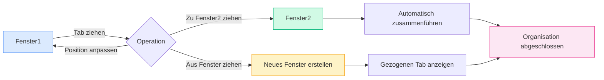

# Multi-Fenster-Verwaltung

## Übersicht

MetaDoc unterstützt die Multi-Fenster-Verwaltung, die es Ihnen ermöglicht, verschiedene Dokumente in verschiedenen Fenstern zu öffnen. Durch die Multi-Fenster-Verwaltung können Sie mehrere Dokumente gleichzeitig anzeigen und bearbeiten, was die Arbeitseffizienz steigert.

## Multi-Fenster-Unterstützung

### Fenstertypen

MetaDoc unterstützt zwei Arten von Fenstern:

- **Hauptfenster**: Beherbergt Hauptfunktionen wie Dokumentbearbeitung, Startseite usw. und unterstützt die Verwaltung mehrerer Tabs.
- **Hilfsfenster**: Werkzeugfenster für Einstellungen, KI-Chat, OCR usw., Einzelinstanz-Fenster.

### Fenstereigenschaften

Eigenschaften des Hauptfensters:

- **Mehrere Tabs**: Jedes Fenster hat eine eigene Tab-Liste.
- **Unabhängiger Status**: Jedes Fenster hat einen unabhängigen Dokumentstatus.
- **Drag & Drop-Unterstützung**: Unterstützt das Ziehen und Ablegen von Tabs zum Trennen und Zusammenführen.
- **Fensterpool**: Vorab erstellte Leerlauffenster für eine schnelle Anzeige.

## Neues Fenster erstellen

### Erstellen durch Ziehen

Durch Ziehen eines Tabs kann ein neues Fenster erstellt werden:

1. **Tab ziehen**: Ziehen Sie einen Tab über die Fenstergrenze hinaus.
2. **Fenster erstellen**: Das System erstellt automatisch ein neues Fenster.
3. **Inhalt anzeigen**: Das neue Fenster zeigt den Inhalt des gezogenen Tabs an.

Die Tab-Leiste unterstützt Drag & Drop-Operationen, sodass Tabs aus dem Fenster gezogen werden können, um ein neues Fenster zu erstellen:

<MainTabs mode="demo" />

**Hinweise**:

- Einzel-Tab-Fenster können nicht durch Ziehen in ein neues Fenster umgewandelt werden.
- Beim Ziehen wird automatisch ein vorab geladenes Fenster aus dem Fensterpool bezogen, um eine schnelle Anzeige zu ermöglichen.

### Erstellen über das Kontextmenü

Ein neues Fenster kann über das Kontextmenü erstellt werden:

1. **Rechtsklick auf Tab**: Klicken Sie mit der rechten Maustaste auf den zu verschiebenden Tab.
2. **Option wählen**: Wählen Sie "In neuem Fenster öffnen".
3. **Fenster erstellen**: Das System erstellt ein neues Fenster und verschiebt den Tab dorthin.

### Fensterpool-Mechanismus

MetaDoc verwendet einen Fensterpool-Mechanismus zur Optimierung der Fenstererstellung:

- **Vorab geladene Fenster**: Das System erstellt vorab 2 Leerlauffenster.
- **Schnelle Anzeige**: Die Verwendung eines vorab geladenen Fensters ermöglicht eine sofortige Anzeige (<100ms).
- **Automatische Auffüllung**: Nach der Verwendung wird automatisch ein neues Fenster zum Pool hinzugefügt.

## Tab-Ziehen zwischen Fenstern

### Zusammenführen durch Ziehen

Tabs können von einem Fenster in ein anderes gezogen werden, um eine flexible Fensterorganisation zu ermöglichen:

**Schritte**:

1. **Tab ziehen**: Ziehen Sie einen Tab im Quellfenster.
2. **Zum Zielfenster ziehen**: Ziehen Sie den Tab zur Tab-Leiste des Zielfensters.
3. **Automatisch zusammenführen**: Der Tab wird automatisch zum Zielfenster hinzugefügt.

### Ziehen an Position

Beim Ziehen kann die Einfügeposition angegeben werden:

- **Automatische Positionierung**: Die Einfügeposition wird automatisch basierend auf der Mausposition bestimmt.
- **Bestimmte Position**: Der Tab kann an einer bestimmten Position eingefügt werden.
- **Am Ende einfügen**: Wird der Tab ans Ende gezogen, wird er dort eingefügt.

### Zusammenführen von Einzel-Tab-Fenstern

Wenn das Quellfenster nur einen Tab hat:

- **Automatisches Zusammenführen**: Beim Ziehen in ein anderes Fenster wird automatisch zusammengeführt.
- **Fenster schließen**: Nach dem Zusammenführen schließt sich das Quellfenster automatisch.
- **Leere Fenster vermeiden**: Verhindert das Auftreten leerer Fenster.

## Fensterverwaltung

### Fensterwechsel

Sie können System-Tastenkombinationen verwenden, um zwischen Fenstern zu wechseln:

- **Alt+Tab** (Windows/Linux): Fenster wechseln.
- **Cmd+Tab** (macOS): Fenster wechseln.

### Fensterstatus

Jedes Fenster hat einen unabhängigen Status:

- **Tab-Liste**: Jedes Fenster hat eine eigene Tab-Liste.
- **Dokumentstatus**: Jedes Fenster hat einen unabhängigen Dokumentstatus.
- **Ansichtsstatus**: Jedes Fenster hat einen unabhängigen Ansichtsstatus.

### Fenster schließen

Möglichkeiten, ein Fenster zu schließen:

- **Schließen-Button**: Klicken Sie auf den Schließen-Button des Fensters.
- **Tastenkombination**: Verwenden Sie eine System-Tastenkombination, um das Fenster zu schließen.
- **Menüoption**: Schließen Sie das Fenster über das Menü.

**Hinweise**:

- Vor dem Schließen eines Fensters werden Sie zum Speichern ungesicherter Dokumente aufgefordert.
- Hilfsfenster werden beim Schließen ausgeblendet und nicht wirklich geschlossen.

## Fenstersynchronisation

### Statussynchronisation

Bestimmte Status werden zwischen Fenstern synchronisiert:

- **Spracheinstellungen**: Sprachwechsel werden mit allen Fenstern synchronisiert.
- **Theme-Einstellungen**: Theme-Wechsel werden mit allen Fenstern synchronisiert.
- **Systemeinstellungen**: Systemeinstellungen werden mit allen Fenstern synchronisiert.

### Dateiverknüpfung

Funktionen der Dateiverknüpfung:

- **Doppelte Öffnung verhindern**: Dieselbe Datei wird nicht gleichzeitig in mehreren Fenstern geöffnet.
- **Fensterlokalisierung**: Wenn eine Datei bereits in einem anderen Fenster geöffnet ist, werden Sie darauf hingewiesen und zu diesem Fenster navigiert.
- **Dateisperre**: Beim Verschieben einer Datei wird sie vorübergehend gesperrt, um Konflikte zu vermeiden.

## Best Practices

1. **Sinnvolle Aufteilung**: Verwenden Sie mehrere Fenster für die Bearbeitung aufgeteilter Bildschirme, um die Effizienz zu steigern.
2. **Fensterorganisation**: Platzieren Sie zusammengehörige Dokumente im selben Fenster, nicht zusammengehörige getrennt.
3. **Tab-Verwaltung**: Verwenden Sie das Ziehen von Tabs sinnvoll, um die Fensteranordnung zu organisieren.
4. **Fensterwechsel**: Nutzen Sie Alt+Tab geübt für schnellen Fensterwechsel.
5. **Status speichern**: Stellen Sie vor dem Schließen eines Fensters sicher, dass wichtige Dokumente gespeichert sind.

## Hinweise

1. **Anzahl der Fenster**: Zu viele Fenster können die Leistung beeinträchtigen; eine sinnvolle Kontrolle wird empfohlen.
2. **Dateisperre**: Beim Verschieben einer Datei wird sie vorübergehend gesperrt, um Konflikte zu vermeiden.
3. **Unabhängiger Status**: Der Status jedes Fensters ist unabhängig und beeinflusst andere nicht.
4. **Fensterpool**: Der Fensterpool-Mechanismus wird automatisch verwaltet und erfordert kein manuelles Eingreifen.
5. **Hilfsfenster**: Hilfsfenster sind Einzelinstanzen und werden beim Schließen ausgeblendet.

## Verwandte Dokumente

- [[core.multi-tab|Multi-Tab-Verwaltung]]
- [[core.file-operations|Dateioperationen]]

<ViewMenuItemsDemo mode="demo" :items='["home", "outline"]' />

<ViewMenuItemsDemo mode="demo" :items='["chat", "agent"]' />

<MenuItemsDemo mode="demo" :items='[{"id": "file"}]' />

<MenuItemsDemo mode="demo" :items='[{"id": "edit"}]' />

<MenuItemsDemo mode="demo" :items='[{"id": "view"}]' />

<LeftMenu mode="demo" />
