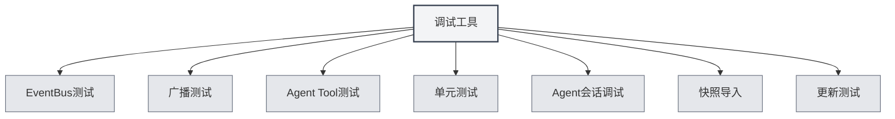

# Debugging-Tools

## Übersicht

Debugging-Tools sind eine Funktion der Entwicklungsumgebung von MetaDoc, die zum Testen und Debuggen von Anwendungsfunktionen dient. Diese Tools sind nur in der Entwicklungsumgebung verfügbar und helfen Entwicklern, Code schnell zu testen und zu debuggen.

<SettingDebugSection mode="demo" />

## Einführung in die Debugging-Tools

<SettingDebugSection mode="demo" />

<ConsoleTerminal mode="demo" consoleKey="debug" :history='[]' />

### Zugriff auf Debugging-Tools

Debugging-Tools sind nur in der Entwicklungsumgebung verfügbar:

1.  **Entwicklungsumgebung**: Stellen Sie sicher, dass Sie in der Entwicklungsumgebung laufen.
2.  **Einstellungsseite**: Öffnen Sie die Einstellungsseite.
3.  **Debugging-Tools**: Finden Sie die Option "Debugging-Tools" auf der Einstellungsseite.
4.  **Tools öffnen**: Klicken Sie, um die Debugging-Tools-Oberfläche zu öffnen.

Sie können über die obere Menüleiste auf die Debugging-Tools zugreifen (nur in der Entwicklungsumgebung):

<MenuItemsDemo mode="demo" :items='[{"id": "settings"}]' />

### Tool-Typen

Die Debugging-Tools umfassen die folgenden Funktionsmodule:

-   **EventBus-Test**: Testet EventBus-Ereignisse.
-   **Broadcast-Test**: Testet Broadcast-Ereignisse.
-   **Agent Tool-Test**: Testet Agent-Tools.
-   **Unit-Tests**: Führt Unit-Tests aus.
-   **Agent-Sitzungs-Debugging**: Debuggt Agent-Sitzungen.
-   **Snapshot-Import**: Importiert Dokument-Snapshots.
-   **Update-Test**: Testet die Update-Funktion.

<SettingDebugSection mode="demo" />

## EventBus-Test

### Ereignis senden

Sie können EventBus-Ereignisse zum Testen senden:

1.  **Ereignisname**: Geben Sie den Namen des zu sendenden Ereignisses ein.
2.  **Ereignisdaten**: Optional, geben Sie die Ereignisdaten im JSON-Format ein.
3.  **Ereignis senden**: Klicken Sie auf die Schaltfläche "Ereignis senden".
4.  **Ergebnis anzeigen**: Sehen Sie sich das Ergebnis des Ereignisversands an.

<ConsoleTerminal mode="demo" consoleKey="debug" :history='[]' />

### Ereignisüberwachung

Sie können EventBus-Ereignisse überwachen:

-   **Ereignisliste**: Zeigt alle gesendeten Ereignisse an.
-   **Ereignisdetails**: Zeigt detaillierte Informationen zum Ereignis an.
-   **Ereignisdaten**: Zeigt den Dateninhalt des Ereignisses an.

## Broadcast-Test

### Broadcast senden

Sie können Broadcast-Ereignisse zum Testen senden:

1.  **Ziel-Fenster**: Wählen Sie das Broadcast-Ziel (all/home/ai-chat usw.).
2.  **Ereignisname**: Geben Sie den Namen des zu broadcastenden Ereignisses ein.
3.  **Ereignisdaten**: Optional, geben Sie die Ereignisdaten im JSON-Format ein.
4.  **Broadcast senden**: Klicken Sie auf die Schaltfläche "Broadcast senden".
5.  **Ergebnis anzeigen**: Sehen Sie sich das Ergebnis des Broadcast-Versands an.

<ConsoleTerminal mode="demo" consoleKey="debug" :history='[]' />

### Broadcast-Überwachung

Sie können Broadcast-Ereignisse überwachen:

-   **Broadcast-Liste**: Zeigt alle gesendeten Broadcasts an.
-   **Broadcast-Details**: Zeigt detaillierte Informationen zum Broadcast an.
-   **Ziel-Fenster**: Zeigt das Ziel-Fenster des Broadcasts an.

## Agent Tool-Test

### Tool testen

Sie können Agent-Tools testen:

1.  **Tool auswählen**: Wählen Sie das zu testende Agent-Tool aus.
2.  **Parameter eingeben**: Geben Sie die Testparameter für das Tool ein (JSON-Format).
3.  **Kontext auswählen**: Wählen Sie die Kontext-Tab-ID für den Test.
4.  **Test ausführen**: Klicken Sie auf die Schaltfläche "Test ausführen".
5.  **Ergebnis anzeigen**: Sehen Sie sich das Testergebnis an.

### Testverlauf

Sie können den Testverlauf einsehen:

-   **Verlaufsliste**: Zeigt den gesamten Testverlauf an.
-   **Testergebnis**: Zeigt das Ergebnis jedes Tests an.
-   **Fehlermeldung**: Zeigt Fehlermeldungen des Tests an.

## Unit-Tests

### Einzeltest

Sie können einen einzelnen Unit-Test ausführen:

1.  **Modul auswählen**: Wählen Sie das zu testende Modul aus.
2.  **Test auswählen**: Wählen Sie die auszuführende Testfunktion aus.
3.  **Parameter bearbeiten**: Bearbeiten Sie die Parameter der Testfunktion.
4.  **Test ausführen**: Klicken Sie auf die Schaltfläche "Test ausführen".
5.  **Ergebnis anzeigen**: Sehen Sie sich das Testergebnis an.

<ConsoleTerminal mode="demo" consoleKey="debug" :history='[]' />

### Batch-Test

Sie können Unit-Tests stapelweise ausführen:

1.  **Modul auswählen**: Wählen Sie ein oder mehrere Module aus.
2.  **Kontext auswählen**: Wählen Sie die Kontext-Tab-ID für den Test.
3.  **Test starten**: Klicken Sie auf die Schaltfläche "Batch-Test starten".
4.  **Fortschritt anzeigen**: Sehen Sie sich den Testfortschritt an.
5.  **Ergebnis anzeigen**: Sehen Sie sich alle Testergebnisse an.

### Testergebnisse

Die Testergebnisse enthalten:

-   **Teststatus**: Zeigt an, ob der Test bestanden wurde.
-   **Testausgabe**: Zeigt die Ausgabeinformationen des Tests an.
-   **Fehlermeldung**: Zeigt Fehlermeldungen des Tests an (falls vorhanden).
-   **Ausführungszeit**: Zeigt die Ausführungszeit des Tests an.

## Agent-Sitzungs-Debugging

### Sitzungs-Debugging

Sie können Agent-Sitzungen debuggen:

1.  **Sitzung auswählen**: Wählen Sie die zu debuggende Agent-Sitzung aus.
2.  **Nachrichten anzeigen**: Sehen Sie sich den Nachrichtenverlauf der Sitzung an.
3.  **Nachricht senden**: Senden Sie eine Testnachricht.
4.  **Antwort anzeigen**: Sehen Sie sich die Antwort des Agents an.

<ConsoleTerminal mode="demo" consoleKey="debug" :history='[]' />

### Debugging-Informationen

Sie können Debugging-Informationen einsehen:

-   **Sitzungsstatus**: Zeigt den aktuellen Status der Sitzung an.
-   **Tool-Aufrufe**: Zeigt den Verlauf der Tool-Aufrufe an.
-   **Fehlermeldung**: Zeigt Fehlermeldungen an.

## Snapshot-Import

### Snapshot importieren

Sie können Dokument-Snapshots importieren:

1.  **Snapshot auswählen**: Wählen Sie die zu importierende Snapshot-Datei aus.
2.  **Snapshot importieren**: Klicken Sie auf die Schaltfläche "Snapshot importieren".
3.  **Ergebnis anzeigen**: Sehen Sie sich das Import-Ergebnis an.

<ConsoleTerminal mode="demo" consoleKey="debug" :history='[]' />

### Snapshot-Format

Das Snapshot-Dateiformat:

-   **JSON-Format**: Die Snapshot-Datei ist im JSON-Format.
-   **Dokumentinhalt**: Enthält den vollständigen Inhalt des Dokuments.
-   **Dokumentstatus**: Enthält Statusinformationen des Dokuments.

## Update-Test

### Update testen

Sie können die Update-Funktion testen:

1.  **Update-Kanal auswählen**: Wählen Sie den Update-Kanal (release/dev).
2.  **Auf Updates prüfen**: Klicken Sie auf die Schaltfläche "Auf Updates prüfen".
3.  **Ergebnis anzeigen**: Sehen Sie sich das Ergebnis der Update-Prüfung an.

<SettingDebugSection mode="demo" />

## Best Practices

1.  **Entwicklungsumgebung**: Verwenden Sie Debugging-Tools nur in der Entwicklungsumgebung.
2.  **Test-Isolation**: Verwenden Sie bei Tests unabhängige Testdaten.
3.  **Fehlerbehandlung**: Achten Sie auf die Behandlung von Fehlern während des Tests.
4.  **Ergebnisprotokollierung**: Protokollieren Sie wichtige Testergebnisse.
5.  **Tool-Nutzung**: Verwenden Sie Debugging-Tools sinnvoll, um die Entwicklungseffizienz zu steigern.

## Wichtige Hinweise

1.  **Entwicklungsumgebung**: Debugging-Tools sind nur in der Entwicklungsumgebung verfügbar.
2.  **Datensicherheit**: Achten Sie bei Tests auf die Datensicherheit, um Produktionsdaten nicht zu beeinträchtigen.
3.  **Leistungsauswirkung**: Einige Tests können die Anwendungsleistung beeinflussen.
4.  **Fehlerbehandlung**: Fehler während des Tests müssen korrekt behandelt werden.
5.  **Tool-Einschränkungen**: Einige Tools können Nutzungsbeschränkungen haben.

## Verwandte Dokumentation

-   [[agent.session|Agent-Sitzungsverwaltung]]
-   [[agent.tools|Toolset-Verwaltung]]
-   [[settings.basic|Grundeinstellungen]]