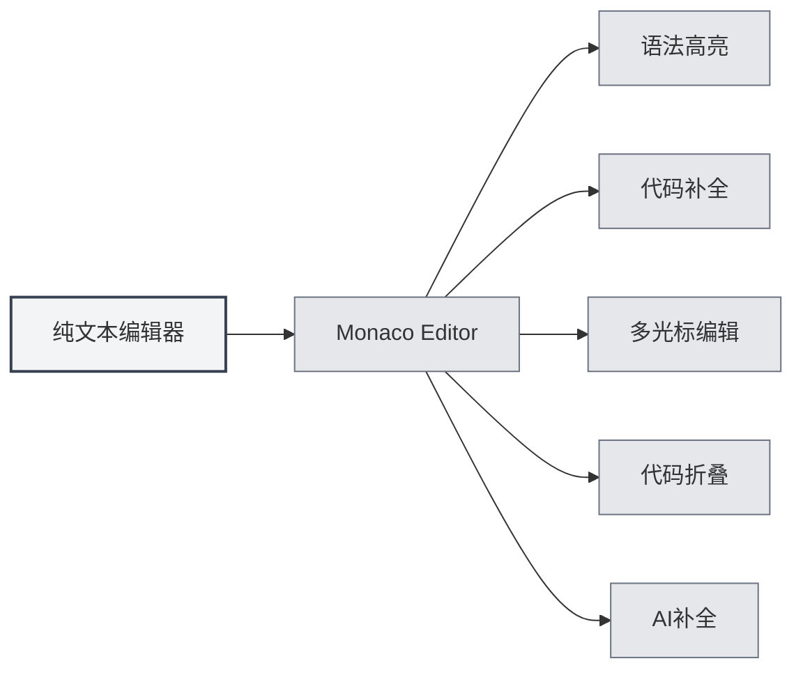
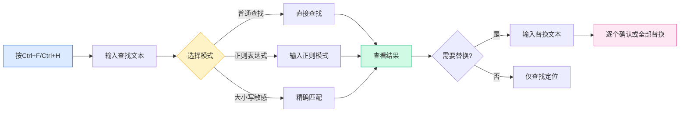

# Nur-Text-Editor

## Übersicht

Der Nur-Text-Editor dient zum Bearbeiten von Nur-Text-Dateien und Code-Dateien. Der Nur-Text-Editor von MetaDoc basiert auf dem Monaco Editor und bietet eine professionelle Code-Editing-Erfahrung mit Funktionen wie Syntaxhervorhebung, Code-Vervollständigung und KI-Vervollständigung.

Der Nur-Text-Editor unterstützt verschiedene Dateiformate, einschließlich Code-Dateien (`.js`, `.py`, `.java` usw.) und Konfigurationsdateien (`.json`, `.yaml`, `.ini` usw.). Die Sprache wird automatisch anhand der Dateierweiterung erkannt und die entsprechende Syntaxhervorhebung angewendet.

## Monaco-Editor-Funktionen

<LaTeXEditorDemo mode="demo" />

<SearchReplaceMenu mode="demo" :position='{"top": 100, "left": 200}' :adapter='null' />

<MenuItemsDemo mode="demo" :items='[{"id": "file"}]' />

<ViewMenuItemsDemo mode="demo" :items='["editor", "outline"]' />

### Editor-Einführung

Der Nur-Text-Editor verwendet den Monaco Editor und zeichnet sich durch folgende Merkmale aus:

- **Professionelles Code-Editing**: Bietet eine ähnliche Editing-Erfahrung wie Visual Studio Code
- **Syntaxhervorhebung**: Wendet automatisch Syntaxhervorhebung basierend auf dem Dateityp an
- **Code-Vervollständigung**: Unterstützt intelligente Code-Vervollständigung
- **Mehrfach-Cursor-Editing**: Ermöglicht gleichzeitiges Bearbeiten mit mehreren Cursorn
- **Code-Faltung**: Unterstützt das Falten von Code-Blöcken

### Unterstützte Dateiformate

Der Nur-Text-Editor unterstützt folgende Dateiformate:

**Code-Dateien**:

- JavaScript/TypeScript: `.js`, `.jsx`, `.ts`, `.tsx`
- Python: `.py`
- Java: `.java`
- C/C++: `.c`, `.cpp`, `.h`, `.hpp`
- C#: `.cs`
- Go: `.go`
- Rust: `.rs`
- Swift: `.swift`
- Kotlin: `.kt`
- Andere: `.php`, `.rb`, `.scala`, `.dart`, `.lua` usw.

**Konfigurationsdateien**:

- JSON: `.json`
- YAML: `.yaml`, `.yml`
- XML: `.xml`
- TOML: `.toml`
- INI: `.ini`, `.conf`
- SQL: `.sql`

**Skriptdateien**:

- Shell: `.sh`, `.bash`, `.zsh`
- PowerShell: `.ps1`
- Andere: `.vim`, `.diff`, `.patch`, `.log`

### Automatische Spracherkennung

Der Editor erkennt die Sprache automatisch anhand der Dateierweiterung:

- **Dateierweiterung**: Wählt den entsprechenden Sprachmodus basierend auf der Dateierweiterung
- **Syntaxhervorhebung**: Wendet automatisch die entsprechenden Syntaxhervorhebungsregeln an
- **Code-Vervollständigung**: Aktiviert die Code-Vervollständigungsfunktion für die entsprechende Sprache

Wenn die Datei keine Erweiterung hat oder die Erweiterung nicht erkannt wird, verwendet der Editor den Nur-Text-Modus.

## Code-Hervorhebung

### Syntaxhervorhebung

Der Editor wendet automatisch Syntaxhervorhebung basierend auf dem Dateityp an:

- **Schlüsselwort-Hervorhebung**: Sprachschlüsselwörter werden in verschiedenen Farben angezeigt
- **Zeichenketten-Hervorhebung**: Zeichenketten werden in einer bestimmten Farbe angezeigt
- **Kommentar-Hervorhebung**: Kommentare werden in Grau angezeigt
- **Funktions-Hervorhebung**: Funktionsnamen werden in einer bestimmten Farbe angezeigt

Syntaxhervorhebung macht die Codestruktur klarer und erleichtert das Lesen und Bearbeiten.

### Themen-Synchronisation

Das Code-Hervorhebungs-Thema folgt dem Editor-Thema:

- **Helles Thema**: Verwendet helle Syntaxhervorhebung im hellen Thema
- **Dunkles Thema**: Verwendet dunkle Syntaxhervorhebung im dunklen Thema
- **Automatische Synchronisation**: Synchronisiert automatisch mit den Editor-Themeneinstellungen

## Zeilennummern-Anzeige

### Zeilennummern anzeigen

Zeilennummern werden auf der linken Seite des Editors angezeigt und helfen Ihnen dabei:

- **Code zu lokalisieren**: Schnell zu einer bestimmten Zeile zu springen
- **Code zu referenzieren**: Einfaches Referenzieren bestimmter Codezeilen in Dokumenten
- **Code zu debuggen**: Schnelles Auffinden von Fehlerpositionen

### Zeilennummern einstellen

Die Anzeige von Zeilennummern kann in den Einstellungen konfiguriert werden:

1. Öffnen Sie die Einstellungsseite
2. Finden Sie "Zeilennummern anzeigen" im Abschnitt "Editor-Einstellungen"
3. Schalten Sie den Schalter um, um Zeilennummern zu aktivieren oder zu deaktivieren

Die Zeilennummern-Einstellung betrifft alle Monaco-Editoren (Nur-Text-Editor, LaTeX-Editor usw.).

<MenuItemsDemo mode="demo" :items='[{"id": "file", "items": ["new", "open", "save"]}]' />

<ViewMenuItemsDemo mode="demo" :items='["editor", "outline"]' />

<MainTabs mode="demo" />

<AISuggestionGhost mode="demo" />

<LaTeXEditorDemo mode="demo" />

## Dateivorschau und Statistikinformationen

### Dateistatistik

Der Editor zeigt Statistikinformationen zur Datei an:

- **Zeichenanzahl**: Zeigt die Gesamtzahl der Zeichen in der Datei
- **Zeilenanzahl**: Zeigt die Gesamtzahl der Zeilen in der Datei
- **Wortanzahl**: Zeigt die Gesamtzahl der Wörter in der Datei (falls zutreffend)

Die Statistik wird in der Statusleiste oder am unteren Rand des Editors angezeigt.

### Dateivorschau

Beim Öffnen einer Datei führt der Editor folgende Schritte aus:

- **Inhalt laden**: Lädt den Dateiinhalt schnell
- **Hervorhebung anwenden**: Wendet Syntaxhervorhebung basierend auf dem Dateityp an
- **Statistik anzeigen**: Zeigt die Statistikinformationen der Datei an

### Dateiformat-Erkennung

Der Editor erkennt das Dateiformat automatisch:

- **Erweiterungs-Erkennung**: Erkennt das Format anhand der Dateierweiterung
- **Inhalts-Erkennung**: Versucht, das Format anhand des Inhalts zu erkennen, wenn die Erweiterung nicht eindeutig ist
- **Manuelle Auswahl**: Das Dateiformat kann manuell ausgewählt werden

## KI-Vervollständigungsfunktion

### KI-Autovervollständigung

Der Nur-Text-Editor unterstützt die KI-Autovervollständigungsfunktion:

- **Automatische Auslösung**: Wird automatisch ausgelöst, nachdem die Eingabe gestoppt wurde
- **Manuelle Auslösung**: Verwenden Sie `Umschalt+Tab`, um die Vervollständigung manuell auszulösen
- **Intelligente Vervollständigung**: Generiert Vervollständigungsvorschläge basierend auf dem Kontext

Die KI-Vervollständigungsfunktion kann Ihnen helfen:

- **Code zu generieren**: Generiert Code basierend auf Kommentaren oder Kontext
- **Funktionen zu vervollständigen**: Vervollständigt Funktionsdefinitionen oder -aufrufe
- **Kommentare zu generieren**: Generiert Codekommentare

### Vervollständigungs-Einstellungen

Die Einstellungen für die KI-Vervollständigung sind dieselben wie beim Markdown-Editor:

- **Aktivieren/Deaktivieren**: Kann in den Einstellungen aktiviert oder deaktiviert werden
- **Auslösetasten**: Die Auslösetasten können konfiguriert werden (Eingabe, Leertaste, `;`, `,`)
- **Vervollständigungsmodus**: Kann zwischen vollständiger oder teilweiser Generierung gewählt werden
- **Maximale Token-Anzahl**: Die maximale Anzahl von Token für die Vervollständigung kann eingestellt werden

Weitere Details finden Sie unter [[ai.completion|KI-Autovervollständigung]].

## Editor-Funktionen

### Code-Faltung

Der Editor unterstützt das Falten von Code-Blöcken:

- **Code-Block falten**: Klicken Sie auf das Faltungssymbol links von der Zeilennummer
- **Code-Block entfalten**: Klicken Sie auf die Faltungsmarkierung zum Entfalten
- **Tastenkürzel**: `Strg+Umschalt+[` zum Falten, `Strg+Umschalt+]` zum Entfalten

Code-Faltung ermöglicht es Ihnen, sich auf den aktuell bearbeiteten Teil zu konzentrieren.

### Suchen und Ersetzen

Der Editor unterstützt leistungsstarke Suchen-und-Ersetzen-Funktionen, die Ihnen helfen, Inhalte im Code schnell zu finden und zu ändern:

**Grundlegende Operationen**:

- **Suchen**: `Strg+F` öffnet das Suchdialogfeld, geben Sie den zu suchenden Text ein
- **Ersetzen**: `Strg+H` öffnet das Suchen-und-Ersetzen-Dialogfeld, geben Sie Such- und Ersetzungstext ein
- **Einzeln ersetzen**: Ersetzen nach individueller Bestätigung
- **Alle ersetzen**: Alle Übereinstimmungen auf einmal ersetzen

**Erweiterte Optionen**:

- **Reguläre Ausdrücke**: Verwenden Sie reguläre Ausdrücke für komplexe Musterabgleiche
- **Groß-/Kleinschreibung beachten**: Unterscheidung zwischen Groß- und Kleinschreibung bei der Suche
- **Ganzes Wort suchen**: Nur vollständige Wörter abgleichen

**Anwendungsfälle**:

- Variablennamen stapelweise ändern
- Bestimmte Funktionsaufrufe finden
- Zeichenketten im Code ersetzen
- Komplexe Ersetzungen mit regulären Ausdrücken durchführen

Die Benutzeroberfläche des Suchen-und-Ersetzen-Panels sieht wie folgt aus:

<SearchReplaceMenu mode="demo" :position='{"top": 100, "left": 200}' :adapter='null' />

### Mehrfach-Cursor-Editing

Der Editor unterstützt gleichzeitiges Bearbeiten mit mehreren Cursorn:

- **Cursor hinzufügen**: `Alt+Klick` fügt einen neuen Cursor an der Klickposition hinzu
- **Cursor oben hinzufügen**: `Strg+Alt+↑` fügt einen Cursor oben hinzu
- **Cursor unten hinzufügen**: `Strg+Alt+↓` fügt einen Cursor unten hinzu
- **Gleiches Wort auswählen**: `Strg+D` wählt das nächste gleiche Wort aus

Mehrfach-Cursor-Editing ermöglicht das gleichzeitige Ändern mehrerer Positionen und steigert die Bearbeitungseffizienz.

## Verwendungstipps

<LaTeXEditorDemo mode="demo" />

<ConsoleTerminal mode="demo" consoleKey="plaintext" :history='[]' />

### Effizientes Bearbeiten

1. **Tastenkürzel verwenden**: Beherrschen Sie gängige Tastenkürzel, um die Bearbeitungseffizienz zu steigern
2. **Code-Faltung verwenden**: Falten Sie Code-Blöcke, die nicht betrachtet werden müssen
3. **Mehrfach-Cursor verwenden**: Verwenden Sie mehrere Cursor, um mehrere Positionen gleichzeitig zu bearbeiten

### Code-Vervollständigung

1. **KI-Vervollständigung aktivieren**: Aktivieren Sie die KI-Vervollständigungsfunktion für intelligente Vorschläge
2. **Manuelle Auslösung verwenden**: Verwenden Sie bei Bedarf `Umschalt+Tab` für die manuelle Auslösung
3. **Einstellungen anpassen**: Passen Sie die Vervollständigungseinstellungen nach Bedarf an

### Dateiverwaltung

1. **Format erkennen**: Stellen Sie sicher, dass die Dateierweiterung korrekt ist, um die automatische Erkennung zu ermöglichen
2. **Statistik anzeigen**: Zeigen Sie Dateistatistiken an, um die Dateigröße zu verstehen
3. **Datei speichern**: Speichern Sie Dateien rechtzeitig, um Änderungsverlust zu vermeiden

## Häufig gestellte Fragen

### F: Syntaxhervorhebung ist nicht korrekt?

A: Überprüfen Sie, ob die Dateierweiterung korrekt ist. Wenn die Erweiterung nicht korrekt ist, kann der Editor den Dateityp möglicherweise nicht erkennen. Sie können das Dateiformat manuell auswählen.

### F: Code-Vervollständigung wird nicht angezeigt?

A: Stellen Sie sicher, dass die KI-Vervollständigungsfunktion aktiviert ist. Einige Dateitypen unterstützen möglicherweise keine Code-Vervollständigung.

### F: Wie wechsle ich das Dateiformat?

A: Das Dateiformat wird automatisch anhand der Dateierweiterung erkannt. Wenn Sie es ändern müssen, können Sie die Datei umbenennen oder das Format manuell auswählen.

### F: Zeilennummern werden nicht angezeigt?

A: Überprüfen Sie, ob die Option "Zeilennummern anzeigen" in den Einstellungen aktiviert ist. Die Zeilennummern-Einstellung betrifft alle Monaco-Editoren.

### F: Datei ist zu groß zum Bearbeiten?

A: Bei sehr großen Dateien kann der Editor bestimmte Funktionen einschränken. Es wird empfohlen, spezielle Texteditoren für sehr große Dateien zu verwenden.

## Verwandte Dokumentation

- [[core.editor-basics|Grundlegende Editor-Operationen]]
- [[core.editor-settings|Editor-Einstellungen]]
- [[latex.editor|LaTeX-Editor-Benutzerhandbuch]]
- [[ai.completion|KI-Autovervollständigung]]