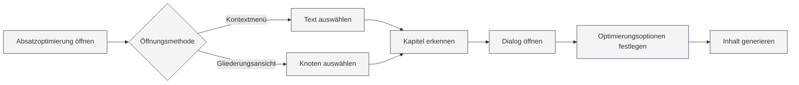

# Absatzoptimierungsfunktion

## Übersicht

Die Absatzoptimierungsfunktion ermöglicht es Ihnen, bestimmte Absätze oder Kapitel in Dokumenten mithilfe von KI zu optimieren. Sie können die Absatzoptimierung über das Kontextmenü oder die Gliederungsansicht öffnen, um Absatzinhalte zu generieren oder zu verbessern.

## Absatzoptimierung öffnen

### Über das Kontextmenü öffnen

Im Editor kann die Absatzoptimierung per Rechtsklick geöffnet werden:

1.  **Text auswählen**: Markieren Sie den zu optimierenden Text im Editor.
2.  **Kontextmenü**: Klicken Sie mit der rechten Maustaste auf den markierten Text.
3.  **Optimierung wählen**: Wählen Sie im Kontextmenü "Absatz optimieren" oder eine ähnliche Option.
4.  **Dialog öffnen**: Der Dialog zur Absatzoptimierung wird geöffnet.

### Über die Gliederung öffnen

In der Gliederungsansicht kann die Absatzoptimierung geöffnet werden:

1.  **Knoten auswählen**: Wählen Sie den zu optimierenden Knoten im Gliederungsbaum.
2.  **Kontextmenü**: Klicken Sie mit der rechten Maustaste auf den Knoten.
3.  **Optimierung wählen**: Wählen Sie im Kontextmenü "Absatz optimieren" oder eine ähnliche Option.
4.  **Dialog öffnen**: Der Dialog zur Absatzoptimierung wird geöffnet.

Sie können auf die Gliederungsansicht über die Seitenleiste zugreifen:

<ViewMenuItemsDemo mode="demo" :items='["outline"]' />

<ViewMenuItemsDemo mode="demo" :items='["chat"]' />

<AIChat mode="demo" />

Die Benutzeroberfläche des Absatzoptimierers sieht wie folgt aus:

<SectionOptimizer mode="demo" title="Beispielkapitel" path="1" :tree='{"text": "Beispielkapitel", "children": []}' language="markdown" :adapter='null' />

### Automatische Kapitelerkennung

Die Absatzoptimierung erkennt automatisch das aktuelle Kapitel:

-   **Cursorposition**: Erkennung basierend auf der Cursorposition.
-   **Markierter Text**: Wenn Text markiert ist, wird dieser verwendet.
-   **Gliederungsknoten**: Wenn über die Gliederung geöffnet, wird der entsprechende Gliederungsknoten verwendet.

## Optimierungsoptionen

### Optimierungsmodus

Es können verschiedene Optimierungsmodi gewählt werden:

-   **Inhalt generieren**: Neuen Absatzinhalt generieren.
-   **Inhalt optimieren**: Vorhandenen Absatzinhalt verbessern.
-   **Inhalt anhängen**: Neuen Inhalt an vorhandenen Inhalt anhängen.
-   **Inhalt ersetzen**: Vorhandenen Absatzinhalt ersetzen.

### Kontextmodus

Es kann ein Kontextmodus gewählt werden:

-   **Volltextkontext**: Das gesamte Dokument als Kontext verwenden.
-   **Kapitelkontext**: Nur das aktuelle Kapitel als Kontext verwenden.
-   **Kein Kontext**: Keine Kontextinformationen verwenden.

### Benutzerdefinierte Eingabeaufforderung

Es kann eine benutzerdefinierte Eingabeaufforderung eingegeben werden:

-   **Optimierungsziel**: Das Optimierungsziel beschreiben.
-   **Inhaltsanforderungen**: Die Inhaltsanforderungen erläutern.
-   **Stilanforderungen**: Den Schreibstil vorgeben.

### Voreingestellte Eingabeaufforderungen

Es können voreingestellte Eingabeaufforderungen verwendet werden:

-   **Inhalt erweitern**: Absatzinhalt erweitern.
-   **Inhalt kürzen**: Absatzinhalt straffen.
-   **Inhalt umschreiben**: Absatzinhalt umformulieren.
-   **Inhalt ergänzen**: Absatzinhalt vervollständigen.

## Inhalt generieren

### Generierungsprozess

Der Prozess der Inhaltsgenerierung:

1.  **Kapitel analysieren**: Struktur und Inhalt des aktuellen Kapitels analysieren.
2.  **Eingabeaufforderung erstellen**: Optimierungsaufforderung basierend auf den Optionen erstellen.
3.  **KI aufrufen**: KI aufrufen, um optimierten Inhalt zu generieren.
4.  **Ergebnis anzeigen**: Den generierten Inhalt im Dialog anzeigen.

### Generierungsergebnis

Der generierte Inhalt wird im Dialog angezeigt:

-   **Inhalt vorschauen**: Der generierte Inhalt kann in einer Vorschau betrachtet werden.
-   **Inhalt bearbeiten**: Der generierte Inhalt kann bearbeitet werden.
-   **Inhalt anwenden**: Der Inhalt kann auf das Dokument angewendet werden.

### Generierungsoptionen

Bei der Generierung können Optionen festgelegt werden:

-   **Streaming-Ausgabe**: Generierungsprozess in Echtzeit anzeigen.
-   **Einmalige Generierung**: Anzeige nach Abschluss der Generierung.
-   **Generierung abbrechen**: Der Generierungsprozess kann jederzeit abgebrochen werden.

## Inhalt anwenden

### Anwendungsmethode

Der generierte Inhalt kann auf das Dokument angewendet werden:

-   **Ersetzen**: Vorhandenen Absatzinhalt ersetzen.
-   **Einfügen**: Inhalt an einer bestimmten Position einfügen.
-   **Anhängen**: Inhalt am Ende des Absatzes anhängen.

### Anwendungsposition

Die Anwendungsposition kann festgelegt werden:

-   **Aktuelle Position**: An der aktuellen Cursorposition anwenden.
-   **Kapitelposition**: Am Anfang des Kapitels anwenden.
-   **Kapitelende**: Am Ende des Kapitels anwenden.

## Dialogfunktion

### Dialog fortsetzen

Nach der Inhaltsgenerierung kann der Dialog fortgesetzt werden:

1.  **Dialog öffnen**: Klicken Sie auf die Schaltfläche "Dialog fortsetzen".
2.  **Dialog betreten**: Wechseln Sie zur KI-Dialogoberfläche.
3.  **Optimierung fortsetzen**: Der Inhalt kann weiter optimiert oder modifiziert werden.

### Dialogkontext

Der Dialog enthält den folgenden Kontext:

-   **Originalinhalt**: Der ursprüngliche Absatzinhalt.
-   **Generierter Inhalt**: Der generierte Inhalt.
-   **Optimierungsverlauf**: Der Verlauf der Optimierungen.

## Best Practices

1.  **Ziel klar definieren**: Optimierungsziel klar festlegen, klare Eingabeaufforderungen verwenden.
2.  **Kontext wählen**: Passenden Kontextmodus je nach Situation auswählen.
3.  **Inhalt vorschauen**: Inhalt nach Generierung in der Vorschau prüfen, um sicherzustellen, dass er den Anforderungen entspricht.
4.  **Bearbeiten und anpassen**: Inhalt nach Generierung weiter bearbeiten und anpassen.
5.  **Mehrfach optimieren**: Inhalt kann mehrfach optimiert werden, um ihn schrittweise zu verbessern.

## Wichtige Hinweise

1.  **Kapitelerkennung**: Sicherstellen, dass das Kapitel korrekt erkannt wird, um Fehloptimierungen zu vermeiden.
2.  **Kontextnutzung**: Kontext angemessen verwenden, um zu lange Inhalte zu vermeiden.
3.  **Inhaltsqualität**: Generierte Inhalte müssen manuell überprüft und angepasst werden.
4.  **Token-Verbrauch**: Die Optimierungsfunktion verbraucht Tokens; achten Sie auf die Nutzungsmenge.
5.  **Dokument speichern**: Dokument nach dem Anwenden von Inhalten speichern.

## Verwandte Dokumentation

-   [[outline.basics|Gliederungsansicht-Funktion]]
-   [[ai.chat|KI-Dialogfunktion]]
-   [[ai.completion|KI-Autovervollständigung]]

<Outline mode="demo" />

<CompletionSettingsPanel mode="demo" />

<MenuItemsDemo mode="demo" :items='[{"id": "ai"}]' />

<ViewMenuItemsDemo mode="demo" :items='["chat"]' />