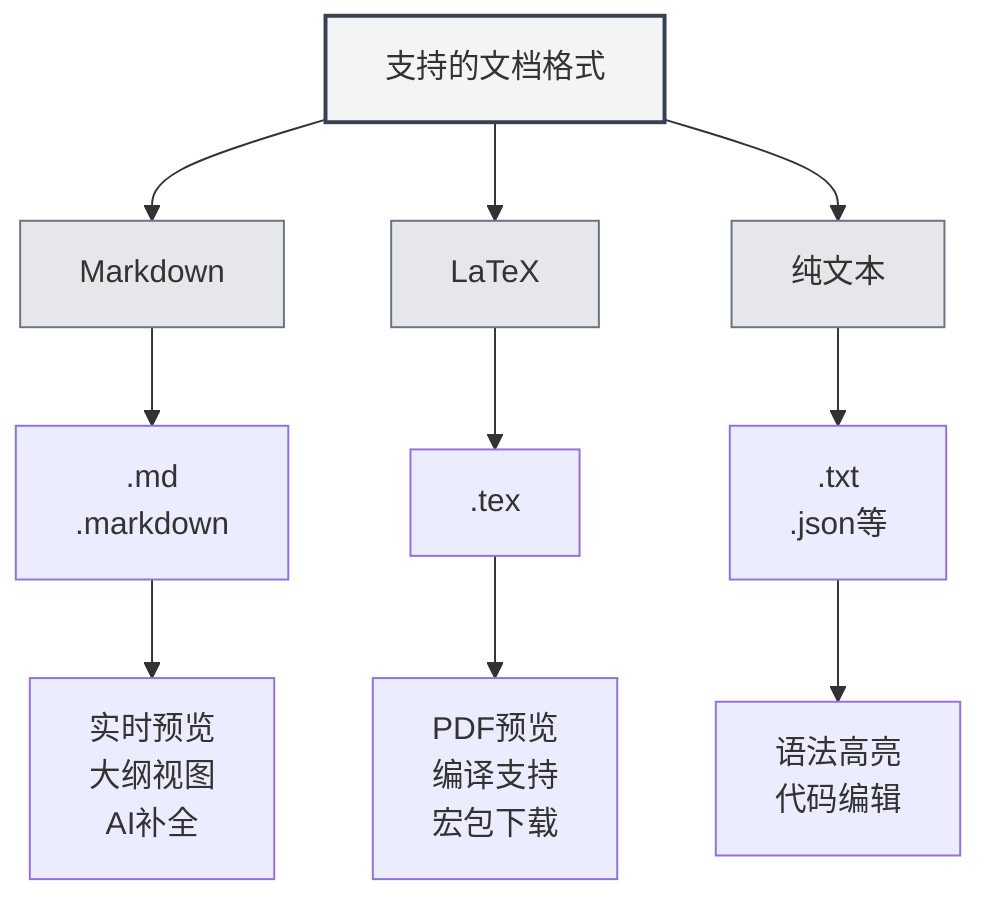

# Unterstützte Dokumentformate

## Übersicht

MetaDoc unterstützt verschiedene Dokumentformate, darunter Markdown, LaTeX und reine Textformate. Das System erkennt Dateiformate automatisch, unterstützt aber auch die manuelle Auswahl des Formats.

<MenuItemsDemo mode="demo" :items='[{"id": "file"}]' />

<MenuItemsDemo mode="demo" :items='[{"id": "edit"}]' />

<MenuItemsDemo mode="demo" :items='[{"id": "view"}]' />

<ViewMenuItemsDemo mode="demo" :items='["home", "outline", "chat"]' />

<MainTabs mode="demo" />

<QuickStartPanel mode="demo" />

<QuickStartMarkdown mode="demo" />

<QuickStartLatex mode="demo" />

## Unterstützte Formate

### Markdown-Format

**Dateierweiterungen**: `.md`, `.markdown`

**Merkmale**:

- Unterstützt Standard-Markdown-Syntax
- Unterstützt erweiterte Syntax (Tabellen, Codeblöcke, mathematische Formeln usw.)
- Unterstützt Echtzeit-Vorschau
- Unterstützt Gliederungsansicht
- Unterstützt KI-Vervollständigung

**Anwendungsfälle**:

- Verfassen technischer Dokumentation
- Erstellen von Blogbeiträgen
- Notizen führen
- Dokumentation schreiben

### LaTeX-Format

**Dateierweiterung**: `.tex`

**Merkmale**:

- Professionelles Format für wissenschaftliche Arbeiten
- Unterstützt mathematische Formeln, Tabellen, Diagramme
- Echtzeit-PDF-Vorschau
- Unterstützt automatischen Download von Paketen
- Unterstützt Hinweise auf Kompilierungsfehler

**Anwendungsfälle**:

- Verfassen wissenschaftlicher Arbeiten
- Erstellen technischer Berichte
- Buchsatz
- Layout komplexer Dokumente

### Reines Textformat

**Dateierweiterungen**: `.txt`, `.json` usw.

**Merkmale**:

- Einfache Textbearbeitung
- Unterstützung für Syntaxhervorhebung
- Code-Editor-Funktionen
- Keine Vorschau und Gliederungsansicht

**Anwendungsfälle**:

- Bearbeiten von Codedateien
- Bearbeiten von Konfigurationsdateien
- Einfache Textbearbeitung
- Bearbeiten von Datendateien

## Dateiformaterkennung

### Automatische Erkennung

MetaDoc erkennt Dateiformate automatisch:

1.  **Erweiterungserkennung**: Priorität hat die Erkennung anhand der Dateierweiterung
    - `.md`, `.markdown` → Markdown-Format
    - `.tex` → LaTeX-Format
    - `.txt`, `.json` usw. → Reines Textformat
2.  **Inhaltserkennung**: Wenn die Erweiterung das Format nicht bestimmen kann, wird der Dateiinhalt geprüft
    - LaTeX-Inhalte werden vorrangig als LaTeX-Format erkannt
    - Andere Inhalte werden standardmäßig als Markdown-Format erkannt
3.  **Standardformat**: Wenn keine Erkennung möglich ist, wird standardmäßig das Markdown-Format verwendet

### Erkennungspriorität

Die Formaterkennung folgt dieser Priorität:

1.  **Dateierweiterung**: Vorrangige Erkennung anhand der Erweiterung
2.  **Dateiinhalt**: Wenn die Erweiterung nicht ausreicht, wird der Inhalt geprüft
3.  **Standardformat**: Bei nicht erkennbarem Format wird das Standardformat verwendet

### Erkennungsregeln

-   **Markdown-Erkennung**: Wird als Markdown erkannt, wenn die Erweiterung `.md` oder `.markdown` lautet
-   **LaTeX-Erkennung**: Wird als LaTeX erkannt, wenn die Erweiterung `.tex` lautet oder der Inhalt LaTeX-Befehle enthält
-   **Reine Text-Erkennung**: Andere Erweiterungen oder nicht bestimmbare Formate werden als reiner Text erkannt

## Manuelle Formatauswahl

### Auswahl beim Öffnen einer Datei

Beim Öffnen einer Datei kann das Format manuell gewählt werden:

1.  **Datei-Öffnen-Dialog**: Im Dialogfeld zum Öffnen von Dateien
2.  **Formatauswahl**: Dateiformat auswählen (falls die automatische Erkennung falsch ist)
3.  **Öffnen bestätigen**: Nach Bestätigung wird die Datei im gewählten Format geöffnet

### Auswahl beim Erstellen einer neuen Datei

Beim Erstellen einer neuen Datei kann das Format gewählt werden:

1.  **Neues Dokument**: Klicken Sie auf die Schaltfläche "Neues Dokument"
2.  **Format auswählen**: Im Format-Auswahl-Dialog das Format wählen
3.  **Dokument erstellen**: Ein Dokument im angegebenen Format erstellen

### Formatwechsel

Das Format eines bereits geöffneten Dokuments kann gewechselt werden:

1.  **Dokument öffnen**: Das Dokument öffnen, dessen Format gewechselt werden soll
2.  **Formatmenü**: Im Menü die Option zum Formatwechsel finden
3.  **Format auswählen**: Das neue Format auswählen
4.  **Wechsel bestätigen**: Den Formatwechsel bestätigen

**Hinweise**:

-   Ein Formatwechsel kann sich auf den Dokumentinhalt auswirken
-   Einige Formateigenschaften lassen sich möglicherweise nicht konvertieren
-   Vor dem Wechsel wird empfohlen, das Dokument zu sichern

## Formatfunktionen im Vergleich

### Funktionsunterstützung

| Funktion        | Markdown | LaTeX      | Reiner Text |
| --------------- | -------- | ---------- | ----------- |
| Echtzeit-Vorschau | ✅        | ✅ (PDF)   | ❌          |
| Gliederungsansicht | ✅        | ✅         | ❌          |
| KI-Vervollständigung | ✅        | ✅         | ✅          |
| Mathematische Formeln | ✅        | ✅         | ❌          |
| Tabellenunterstützung | ✅        | ✅         | ❌          |
| Code-Hervorhebung | ✅        | ✅         | ✅          |
| Metadaten-Unterstützung | ✅        | ✅         | ❌          |

### Editoreigenschaften

| Eigenschaft     | Markdown | LaTeX | Reiner Text |
| --------------- | -------- | ----- | ----------- |
| Syntaxhervorhebung | ✅        | ✅    | ✅          |
| Auto-Vervollständigung | ✅        | ✅    | ✅          |
| Fehlerhinweise  | ✅        | ✅    | ❌          |
| Faltfunktion    | ✅        | ✅    | ✅          |
| Mehrfach-Cursor-Bearbeitung | ✅        | ✅    | ✅          |

## Formatkonvertierung

### Exportformate

Dokumente können in andere Formate exportiert werden:

-   **Markdown → PDF**: Export als PDF-Dokument
-   **Markdown → HTML**: Export als HTML-Dokument
-   **Markdown → DOCX**: Export als Word-Dokument
-   **LaTeX → PDF**: Kompilierung zu einem PDF-Dokument
-   **LaTeX → Markdown**: Konvertierung in das Markdown-Format

### Hinweise zur Konvertierung

Bei der Formatkonvertierung ist Folgendes zu beachten:

-   **Inhaltskompatibilität**: Einige Formateigenschaften lassen sich möglicherweise nicht konvertieren
-   **Stilverlust**: Nach der Konvertierung können Teile der Formatierung verloren gehen
-   **Inhaltsanpassung**: Nach der Konvertierung muss der Inhalt möglicherweise manuell angepasst werden

## Best Practices

1.  **Passendes Format wählen**: Wählen Sie je nach Dokumenttyp das geeignete Format
2.  **Standard-Erweiterungen verwenden**: Verwenden Sie standardmäßige Dateierweiterungen, um die automatische Erkennung zu erleichtern
3.  **Formatkonsistenz**: Verwenden Sie innerhalb eines Projekts ein einheitliches Format
4.  **Dokumente sichern**: Sichern Sie das Originaldokument vor einer Formatkonvertierung
5.  **Konvertierung testen**: Überprüfen Sie nach der Konvertierung, ob der Inhalt korrekt ist

## Wichtige Hinweise

1.  **Formaterkennung**: Die automatische Erkennung kann ungenau sein; eine manuelle Auswahl ist möglich
2.  **Formatwechsel**: Ein Formatwechsel kann sich auf den Dokumentinhalt auswirken
3.  **Kompatibilität**: Unterschiedliche Formate unterstützen unterschiedliche Funktionen
4.  **Dateierweiterungen**: Es wird empfohlen, Standard-Erweiterungen zu verwenden
5.  **Formatkonvertierung**: Bei der Konvertierung können Teile des Inhalts oder der Formatierung verloren gehen

## Verwandte Dokumentation

-   [[markdown.basics|Markdown-Syntax]]
-   [[latex.basics|LaTeX-Syntax]]
-   [[editor.plain-text|Texteditor]]
-   [[core.file-operations|Dateioperationen]]