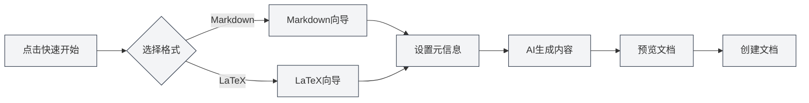

# Startseiten-Funktionen

## Übersicht

Die Startseite ist die Einstiegsoberfläche von MetaDoc und bietet Funktionen wie Schnellstart, Neues Dokument und Datei öffnen. Das Design der Startseite ist klar und ansprechend, um Ihnen einen schnellen Einstieg in die Nutzung von MetaDoc zu ermöglichen.

## Schnellstart

### Schnellstart-Assistent

Klicken Sie auf die Schaltfläche "Schnellstart", um den Schnellstart-Assistenten zu starten:

1.  **Format wählen**: Wählen Sie das Dokumentformat (Markdown oder LaTeX)
2.  **Metadaten festlegen**: Geben Sie Dokumenttitel, Autor usw. ein
3.  **KI-Inhalte generieren**: Nutzen Sie KI-Unterstützung zum Erstellen von Dokumentinhalten
4.  **Dokumentvorschau**: Vorschau der generierten Dokumentinhalte anzeigen
5.  **Dokument erstellen**: Dokument nach Bestätigung anlegen

Die Format-Auswahloberfläche des Schnellstart-Assistenten sieht wie folgt aus:

<QuickStartPanel mode="demo" />

### Markdown-Schnellstart

Nach Auswahl des Markdown-Formats:

-   **Vorlagenauswahl**: Es können Markdown-Vorlagen ausgewählt werden
-   **Inhaltsgenerierung**: KI kann Markdown-Inhalte generieren
-   **Schnellbearbeitung**: Direkter Bearbeitungsstart nach der Erstellung

Die Assistentenoberfläche nach Auswahl von Markdown:

<QuickStartMarkdown mode="demo" />

### LaTeX-Schnellstart

Nach Auswahl des LaTeX-Formats:

-   **Dokumenttyp**: Es können Dokumenttypen (article, book usw.) ausgewählt werden
-   **Inhaltsgenerierung**: KI kann LaTeX-Inhalte generieren
-   **Kompilierungsvorschau**: Nach der Erstellung kann eine PDF-Vorschau kompiliert werden

Die Assistentenoberfläche nach Auswahl von LaTeX:

<QuickStartLatex mode="demo" />

## Neues Dokument

### Leeres Dokument erstellen

Klicken Sie auf die Schaltfläche "Neues Dokument", um schnell ein leeres Dokument zu erstellen:

1.  Klicken Sie auf die Schaltfläche "Neues Dokument"
2.  Wählen Sie das Dokumentformat (Markdown/LaTeX/Reiner Text)
3.  Das Dokument wird in einem neuen Tab geöffnet

**Tastenkürzel**: Sie können auch `Strg+N` (Windows/Linux) oder `Cmd+N` (macOS) zum schnellen Erstellen verwenden.

## Datei öffnen

### Vorhandene Datei öffnen

Klicken Sie auf die Schaltfläche "Datei öffnen", um eine vorhandene Datei zu öffnen:

1.  Klicken Sie auf die Schaltfläche "Datei öffnen"
2.  Wählen Sie die Datei im Dateiauswahldialog
3.  Die Datei wird in einem neuen Tab geöffnet

**Tastenkürzel**: Sie können auch `Strg+O` (Windows/Linux) oder `Cmd+O` (macOS) zum schnellen Öffnen verwenden.

### Unterstützte Dateiformate

-   **Markdown** (.md)
-   **LaTeX** (.tex)
-   **Reiner Text** (.txt)
-   **JSON** (.json)

## Benutzerhandbuch

### Benutzerhandbuch öffnen

Klicken Sie auf die Schaltfläche "Benutzerhandbuch", um das Benutzerhandbuch zu öffnen:

1.  Klicken Sie auf die Schaltfläche "Benutzerhandbuch"
2.  Das Benutzerhandbuch wird in einem neuen Tab geöffnet
3.  Sie können verschiedene Funktionen durchsuchen und kennenlernen

**Tastenkürzel**: Sie können auch die Taste `F1` drücken, um das Benutzerhandbuch schnell zu öffnen.

## Liste zuletzt geöffneter Dokumente

### Zuletzt geöffnete Dokumente anzeigen

Die Startseite zeigt eine Liste der zuletzt geöffneten Dokumente:

-   **Anzahl**: Zeigt maximal 12 zuletzt geöffnete Dokumente an
-   **Dokumentkarten**: Jedes Dokument wird als Karte angezeigt
-   **Schnellöffnen**: Klicken Sie auf eine Karte, um das Dokument schnell zu öffnen

### Aktionen für zuletzt geöffnete Dokumente

-   **Dokument öffnen**: Klicken Sie auf die Dokumentkarte, um das Dokument zu öffnen
-   **Eintrag löschen**: Klicken Sie auf die Löschen-Schaltfläche auf der Karte, um den Eintrag zu entfernen
-   **Kontextmenü**: Rechtsklick auf die Karte kann weitere Optionen bieten

### Verwaltung zuletzt geöffneter Dokumente

-   **Automatische Aktualisierung**: Die Liste wird nach dem Öffnen eines Dokuments automatisch aktualisiert
-   **Eintragsspeicherung**: Die Einträge zuletzt geöffneter Dokumente werden gespeichert
-   **Listenreihenfolge**: Sortiert in umgekehrter chronologischer Reihenfolge (neueste zuerst)

## Benutzerprofil-Dialog

### Benutzerprofil öffnen

Die Startseite kann den Benutzerprofil-Dialog anzeigen:

-   **Erstnutzung**: Bei der ersten Nutzung kann die Einrichtung des Benutzerprofils vorgeschlagen werden
-   **Profileinstellung**: Benutzerprofil und Nutzungspräferenzen können festgelegt werden
-   **KI-Optimierung**: Das Benutzerprofil kann der KI helfen, Ihre Anforderungen besser zu verstehen

### Inhalt des Benutzerprofils

Das Benutzerprofil kann enthalten:

-   **Grundinformationen**: Name, Beruf usw.
-   **Nutzungspräferenzen**: Bearbeitungsgewohnheiten, häufig genutzte Funktionen usw.
-   **Benutzerprofil**: Hilft der KI, Ihre Nutzungsszenarien zu verstehen

## Startseiten-Oberfläche

### Oberflächenlayout

Die Startseite verwendet ein zentriertes Layout:

-   **Oben**: MetaDoc-Titel und Untertitel
-   **Mitte**: Bereich mit Aktionsschaltflächen
-   **Unten**: Liste zuletzt geöffneter Dokumente

### Visuelles Design

Die Startseite verwendet ein klares, modernes Design:

-   **Dynamischer Hintergrund**: Animationseffekt mit dynamischem Hintergrund
-   **Rasterdekoration**: Minimalistische Rasterdekoration
-   **Kartendesign**: Aktionsschaltflächen verwenden ein Kartendesign

## Best Practices

1.  **Schnellstart**: Bei der ersten Nutzung wird der Schnellstart-Assistent empfohlen
2.  **Tastenkürzel**: Nutzen Sie Tastenkürzel, um die Effizienz zu steigern
3.  **Zuletzt geöffnete Dokumente**: Nutzen Sie die Liste für schnellen Zugriff auf häufig verwendete Dokumente
4.  **Benutzerprofil**: Richten Sie ein Benutzerprofil für ein besseres KI-Erlebnis ein
5.  **Benutzerhandbuch**: Konsultieren Sie das Benutzerhandbuch bei Problemen

## Hinweise

1.  **Startseitenanzeige**: Die Startseite wird nur angezeigt, wenn kein Dokument geöffnet ist
2.  **Schnellstart**: Der Schnellstart-Assistent kann jederzeit geschlossen werden
3.  **Zuletzt geöffnete Dokumente**: Die Liste zeigt maximal 12 Einträge an
4.  **Benutzerprofil**: Die Einrichtung des Benutzerprofils ist optional
5.  **Oberflächensprache**: Die Sprache der Startseitenoberfläche folgt den Systemspracheinstellungen

## Verwandte Dokumente

-   [[quick-start.guide|Schnellstart-Anleitung]]
-   [[core.file-operations|Dateioperationen]]
-   [[user.profile|Benutzerprofil]]
-   [[views.types|Ansichtstypen]]

<MenuItemsDemo mode="demo" :items='[{"id": "file"}]' />

<MenuItemsDemo mode="demo" :items='[{"id": "edit"}]' />

<MenuItemsDemo mode="demo" :items='[{"id": "view"}]' />

<ViewMenuItemsDemo mode="demo" :items='["home", "outline", "chat", "agent"]' />

<MainTabs mode="demo" />

<UserProfileView mode="demo" />