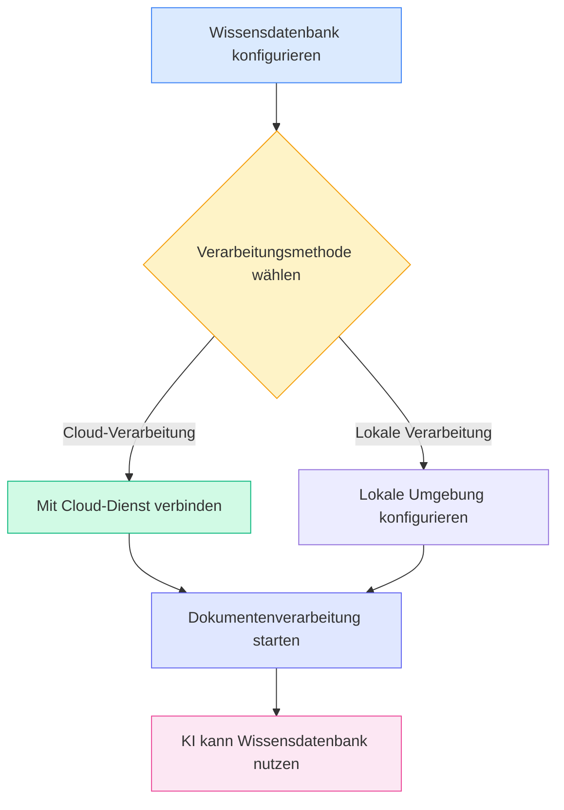
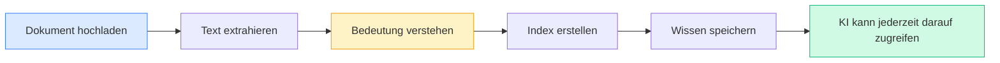
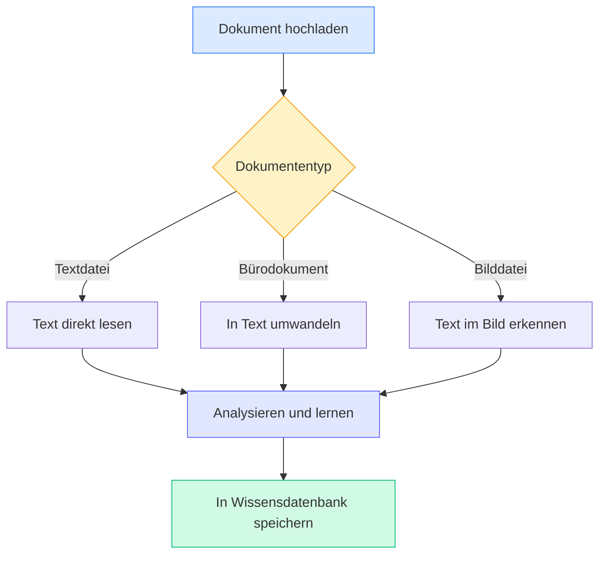
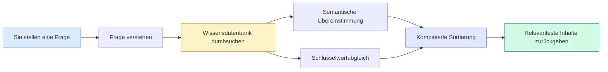

# Wissensdatenbank-Konfiguration

## Übersicht

Die Wissensdatenbank ist das intelligente Dokumentenmanagementsystem von MetaDoc. Indem Sie Ihre Dokumente in die Wissensdatenbank "einlernen", kann die KI diese Inhalte verstehen und darauf verweisen, um Ihnen genauere Antworten und Vorschläge zu liefern.

Diese Anleitung hilft Ihnen bei der Konfiguration der Wissensdatenbank, damit sie optimal für Sie arbeitet.

## Wissensdatenbank-Funktion aktivieren

Auf der Seite für die Wissensdatenbank-Einstellungen müssen Sie zunächst die Wissensdatenbank-Funktion aktivieren:

1.  Finden Sie den Schalter "Wissensdatenbank aktivieren"
2.  Schalten Sie den Schalter in den Zustand "Aktiviert"
3.  Konfigurieren Sie die relevanten Parameter für die Wissensdatenbank

Sie können über die obere Menüleiste auf die Wissensdatenbank-Verwaltung zugreifen:

<KnowledgeBase mode="demo" />

Die obige Abbildung zeigt die Hauptfunktionsbereiche der Wissensdatenbank-Verwaltungsoberfläche:

-   **Linkes Panel**: Wissensdatenbank-Liste und Suchfunktion
-   **Mittlerer Bereich**: Liste der hinzugefügten Dokumente
-   **Rechte Detailansicht**: Detaillierte Informationen und Verarbeitungsstatus des ausgewählten Dokuments
-   **Toolbar unten**: Aktionsschaltflächen wie Dokument hinzufügen, Verarbeitung starten, löschen usw.

## Verarbeitungsmethode auswählen

### Einführung der beiden Methoden

MetaDoc bietet zwei Methoden zur Dokumentenverarbeitung an:

**Cloud-Verarbeitung (empfohlen)**

-   Dokumente werden zur Analyse an einen Cloud-Dienst gesendet
-   Schnelle Verarbeitung, beansprucht keine lokalen Ressourcen
-   Internetverbindung erforderlich

**Lokale Verarbeitung (in Entwicklung)**

-   Dokumente werden direkt auf Ihrem Computer verarbeitet
-   Daten bleiben vollständig lokal, Datenschutz gewährleistet
-   Leistungsstarke Computerkonfiguration erforderlich

Die aktuelle Version unterstützt nur die Cloud-Verarbeitungsmethode. Sie können diese in den Einstellungen auswählen:

<MenuItemsDemo mode="demo" :items='[{"id": "settings"}]' />

### Vorteile der Cloud-Verarbeitung

Für die meisten Benutzer empfehlen wir die Cloud-Verarbeitung:

-   **Schneller Einstieg**: Keine Konfiguration einer komplexen lokalen Umgebung erforderlich
-   **Zeitersparnis**: Schneller bei der Verarbeitung großer Dokumentenmengen
-   **Ressourcenschonend**: Beansprucht keinen Arbeitsspeicher oder Prozessor des Computers
-   **Einfache Wartung**: Automatische Updates, keine manuelle Verwaltung nötig

### Wann lokale Verarbeitung benötigt wird

Wenn Sie folgende Anforderungen haben, können Sie auf die lokale Verarbeitungsfunktion warten:

-   Verarbeitung hochsensibler, vertraulicher Dokumente
-   Häufiges Arbeiten in Umgebungen ohne Netzwerkverbindung
-   Besitz einer leistungsstarken Computerkonfiguration (mit dedizierter Grafikkarte)
-   Verarbeitung sehr großer Dokumentenmengen (über 10 GB)

<SettingKnowledgeBaseSection mode="demo" />

## Funktionsweise der Wissensdatenbank verstehen

### Wie Dokumente "gelernt" werden

<RAGToolDisplay mode="demo" />

Wenn Sie ein Dokument zur Wissensdatenbank hinzufügen, führt MetaDoc die folgenden Schritte aus:

1.  **Dokumentinhalt lesen**

    -   Extrahiert Text aus Formaten wie PDF, Word, Bildern usw.
    -   Behält die Struktur und Formatierung des Dokuments bei

2.  **Bedeutung des Dokuments verstehen**

    -   Wandelt Text in eine "semantische Repräsentation" um, die die KI versteht
    -   Dies ist wie das Anbringen intelligenter Tags am Dokument

3.  **Index erstellen**

    -   Erstellt einen Index für schnelles Nachschlagen
    -   Ermöglicht der KI, relevante Inhalte sofort zu finden

4.  **Wissen speichern**
    -   Speichert das Verarbeitungsergebnis in der lokalen Datenbank
    -   Kann jederzeit abgerufen werden

<KnowledgeBase mode="demo" />

## Unterstützte Dokumenttypen

### Direkt verarbeitbare Formate

Die MetaDoc-Wissensdatenbank unterstützt viele gängige Dokumentformate:

**Textdokumente**

-   Markdown-Dokumente (.md) – Bevorzugtes Format für technische Dokumentation
-   LaTeX-Dokumente (.tex) – Häufig für akademische Arbeiten verwendet
-   Reine Textdateien (.txt) – Einfache Textaufzeichnungen

**Bürodokumente**

-   PDF-Dateien (.pdf) – Universellstes Dokumentenformat
-   Word-Dokumente (.docx) – Microsoft Office-Format

**Bilddateien**

-   PNG-Bilder (.png) – Screenshots, Diagramme
-   JPEG-Bilder (.jpg, .jpeg) – Fotos, Scans

### Verarbeitungsweise verschiedener Dokumente

Verschiedene Dokumententypen werden von MetaDoc unterschiedlich verarbeitet:

**Textdokumente** (Markdown, LaTeX, TXT)

-   Textinhalt wird direkt gelesen
-   Titelstruktur und Formatierung bleiben erhalten
-   Schnellste Verarbeitungsgeschwindigkeit

**Bürodokumente** (PDF, Word)

-   Zuerst in reinen Text umgewandelt
-   Strukturen wie Überschriften, Absätze usw. werden extrahiert
-   Logische Hierarchie des Dokuments bleibt erhalten

**Bilddokumente** (PNG, JPG)

-   OCR-Technologie erkennt Text in den Bildern
-   Geeignet für gescannte Papierdokumente
-   Verarbeitungszeit relativ länger

<RAGToolDisplay mode="demo" />

## Intelligenter Abrufmechanismus

### Wie die Wissensdatenbank relevante Inhalte findet

Wenn die KI die Wissensdatenbank nutzen muss, verwendet MetaDoc eine intelligente Abrufstrategie:

**Semantische Übereinstimmung**

-   Stimmt nicht nur Schlüsselwörter ab, sondern versteht auch die Bedeutung der Frage
-   Beispiel: Eine Suche nach "Wie installiere ich" findet auch relevante Inhalte wie "Installationsschritte", "Bereitstellungsanleitung" usw.

**Hybridabruf**

-   Kombiniert semantisches Verständnis mit Schlüsselwortabgleich
-   Gewährleistet Genauigkeit und erhöht die Trefferquote
-   Automatische Sortierung, relevanteste Inhalte zuerst

**Schnelle Reaktion**

-   Verwendet effiziente Indexierungsalgorithmen
-   Reaktion in Millisekunden, beeinträchtigt nicht die Gesprächsflüssigkeit

<KnowledgeBase mode="demo" />

## Erläuterung zur Chunk-Verarbeitung

### Warum Chunking notwendig ist

Für eine effizientere Suche teilt MetaDoc lange Dokumente in kleinere Blöcke (Chunks) auf:

**Vorteile des Chunkings**

-   **Präzise Lokalisierung**: Ermöglicht das Finden konkreter Absätze innerhalb eines Dokuments
-   **Geschwindigkeitssteigerung**: Kleinere Blöcke werden schneller verarbeitet und durchsucht
-   **Kontexterhalt**: Überlappung zwischen benachbarten Blöcken, semantische Zusammenhänge bleiben erhalten

**Standardeinstellungen**

-   Jeder Block enthält etwa 500 Zeichen (ca. 250 chinesische Schriftzeichen)
-   Überlappung von 50 Zeichen zwischen benachbarten Blöcken
-   Diese Einstellung bietet einen Ausgleich zwischen Genauigkeit und Effizienz

### Beispiel für Chunking

Angenommen, es gibt einen langen Artikel:

Original: [Einleitung... Mittelteil... Schluss...]

Nach dem Chunking:

-   Block 1: Einleitung + Teil des Mittelteils
-   Block 2: Teil des Mittelteils (Überlappungsbereich) + weiterer Mittelteil
-   Block 3: Weiterer Mittelteil + Schluss

So können auch bei Fragen, die nur den "Mittelteil" betreffen, die relevanten Abschnitte genau gefunden werden.

<SettingKnowledgeBaseSection mode="demo" />

## Konfigurationsempfehlungen

### Empfohlene Einstellungen für Erstbenutzer

Wenn Sie die Wissensdatenbank zum ersten Mal verwenden, empfehlen wir folgende Einstellungen:

-   **Verarbeitungsmethode**: Cloud-Verarbeitung (Standard)
-   **Suchsensitivität**: Mittel (Standardwert)
    -   Zu hohe Sensitivität: Kann zu viele irrelevante Inhalte zurückgeben
    -   Zu niedrige Sensitivität: Kann einige relevante Inhalte übersehen
    -   Mittlere Einstellung: Ausgewogenes Verhältnis

### Für verschiedene Dokumententypen

**Technische Dokumentation/Handbücher**

-   Gut geeignet für eine spezielle Wissensdatenbank
-   KI kann technische Fragen genau beantworten
-   Unterstützt die Suche nach Code-Snippets

**Akademische Arbeiten**

-   Vollständige Zitatinformationen bleiben erhalten
-   Unterstützt Wissensverknüpfung über Dokumente hinweg
-   Geeignet für Literaturrecherche und Studien

**Persönliche Notizen**

-   Persönliche Wissensdatenbank aufbauen
-   Schnelle Suche in vergangenen Aufzeichnungen
-   Unterstützung als Referenz beim kreativen Schreiben

### Nutzungsempfehlungen

**1. Regelmäßige Wartung**

-   Veraltete oder nicht mehr benötigte Dokumente löschen
-   Neue Versionen vorhandener Dokumente aktualisieren
-   Wissensdatenbank sauber und genau halten

**2. Sinnvolle Kategorisierung**

-   Dokumente verwandter Themen zusammenfassen
-   Klare Benennung für Wissensdatenbanken festlegen
-   Erleichtert Verwaltung und Nutzung

**3. Datenschutzaspekte**

-   Vorsicht beim Hochladen vertraulicher Dokumente
-   Verstehen der Datenverarbeitungsweise
-   Passende Verarbeitungsmethode wählen

<RAGToolDisplay mode="demo" />

## Wichtige Hinweise

### Vor der Nutzung zu beachten

1.  **Verarbeitungszeit**

    -   Kleine Dokumente (1-10 Seiten): Einige Sekunden
    -   Mittlere Dokumente (10-50 Seiten): Einige Dutzend Sekunden
    -   Große Dokumente (über 50 Seiten): Kann einige Minuten dauern
    -   Bitte warten Sie geduldig auf den Abschluss der Verarbeitung

2.  **Speicherplatz**

    -   Die Wissensdatenbank beansprucht etwas Festplattenspeicher
    -   Etwa das 2-3-fache der ursprünglichen Dokumentengröße
    -   Regelmäßiges Bereinigen ungenutzter Dokumente kann Speicher freigeben

3.  **Netzwerkanforderungen**

    -   Beim Hinzufügen von Dokumenten ist eine Netzwerkverbindung erforderlich
    -   Beim Abrufen ist keine Netzwerkverbindung nötig (lokal gespeichert)
    -   Instabiles Netzwerk kann die Verarbeitungsgeschwindigkeit beeinflussen

4.  **Dateiformat**
    -   Stellen Sie sicher, dass hochgeladene Dateien das korrekte Format haben
    -   Beschädigte Dateien können möglicherweise nicht verarbeitet werden
    -   Verschlüsselte PDFs müssen zuerst entschlüsselt werden

### Häufig gestellte Fragen (FAQ)

**F: Sind Dokumente in der Wissensdatenbank sicher?**
A: Die Vektordaten der verarbeiteten Dokumente werden lokal gespeichert. Bei Cloud-Verarbeitung werden die Originaldokumente zur Verarbeitung an den Cloud-Dienst gesendet und nach Abschluss gelöscht. Es wird empfohlen, keine hochsensiblen Inhalte hochzuladen.

**F: Wie große Dokumente können verarbeitet werden?**
A: Einzelne Dokumente sollten idealerweise nicht größer als 100 MB sein. Sehr große Dokumente können in mehrere kleinere Dokumente aufgeteilt und verarbeitet werden.

**F: Können verarbeitete Dokumente noch bearbeitet werden?**
A: Die Inhalte in der Wissensdatenbank sind eine "Momentaufnahme" des Originaldokuments. Wenn ein Dokument aktualisiert wurde, muss es erneut zur Wissensdatenbank hinzugefügt werden.

**F: Warum werden manche Inhalte nicht gefunden?**
A: Mögliche Gründe: 1) Dokument noch nicht vollständig verarbeitet; 2) Inhalt befindet sich in einem Bild und die OCR-Erkennung ist fehlgeschlagen; 3) Suchbegriffe und Dokumenteninhalte unterscheiden sich stark in der Ausdrucksweise.

## Verwandte Dokumentation

-   [[knowledge-base.management|Wissensdatenbank-Verwaltung]] – Erfahren Sie, wie Sie Dokumente in der Wissensdatenbank hinzufügen, löschen und verwalten
-   [[knowledge-base.usage|Wissensdatenbank-Nutzung]] – Erfahren Sie, wie Sie die Wissensdatenbank in KI-Gesprächen nutzen
-   [[ai.chat|KI-Chat-Funktion]] – Entdecken Sie die erweiterten Funktionen des KI-Chats