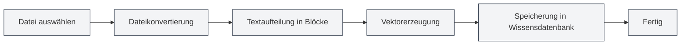

# Wissensdatenbank-Verwaltung

## Übersicht

<KnowledgeBase mode="demo" />

Die Wissensdatenbank-Verwaltung ist eine Kernfunktion des MetaDoc RAG (Retrieval-Augmented Generation) Systems. Sie ermöglicht es Ihnen, Dokumente zur Wissensdatenbank hinzuzufügen, um über Vektorsuche Kontextinformationen für KI-Dialoge bereitzustellen. Die Wissensdatenbank hilft der KI, den Inhalt Ihrer Dokumente besser zu verstehen und präzisere Antworten zu liefern.

## Wissensdatenbank aktivieren

### Wissensdatenbank-Funktion einschalten

Auf der Seite für die Wissensdatenbank-Einstellungen müssen Sie zunächst die Wissensdatenbank-Funktion aktivieren:

1.  Finden Sie den Schalter "Wissensdatenbank aktivieren"
2.  Schalten Sie den Schalter auf "Aktiviert"
3.  Konfigurieren Sie die relevanten Parameter für die Wissensdatenbank

Sie können über die obere Menüleiste auf die Wissensdatenbank-Verwaltung zugreifen:

<MenuItemsDemo mode="demo" :items='[{"id": "settings"}]' />

### Wissensdatenbank-Einstellungen

<SettingKnowledgeBaseSection mode="demo" />

Bevor Sie die Wissensdatenbank aktivieren, können Sie auf der Einstellungsseite relevante Parameter konfigurieren:

Die obige Abbildung zeigt die Hauptoptionen der Wissensdatenbank-Einstellungsoberfläche:

-   **Wissensdatenbank aktivieren**: Schaltet die Wissensdatenbank-Funktion ein oder aus
-   **Embedding-Modus**: Wählen Sie Cloud-Verarbeitung oder lokale Verarbeitung (in Entwicklung)
-   **Konfidenzschwelle**: Steuert die Relevanzfilterung der Suchergebnisse
-   **Maximale Anzahl Suchergebnisse**: Begrenzt die maximale Anzahl der pro Suche zurückgegebenen Ergebnisse

### Wissensdatenbank-Verwaltungsoberfläche

<KnowledgeBase mode="demo" />

Nachdem Sie die Wissensdatenbank aktiviert haben, können Sie im Verwaltungsinterface Dokumente hinzufügen und verwalten:

Die Wissensdatenbank-Verwaltungsoberfläche bietet folgende Funktionen:

-   **Dokumentenliste**: Zeigt alle zur Wissensdatenbank hinzugefügten Dokumente an
-   **Dokument hinzufügen**: Unterstützt verschiedene Formate wie PDF, Word, Bilder, Markdown usw.
-   **Verarbeitungsstatus**: Zeigt den Verarbeitungsfortschritt der Dokumente in Echtzeit an
-   **Suche testen**: Testet die Suchleistung der Wissensdatenbank

Nach Aktivierung der Wissensdatenbank nutzen KI-Funktionen (wie KI-Dialog, KI-Vervollständigung) automatisch die Informationen aus der Wissensdatenbank, um die Antwortqualität zu verbessern.

**Wichtige Hinweise**:

-   Nach Aktivierung der Wissensdatenbank durchsucht die KI-Funktion deren Inhalte, was die Antwortgeschwindigkeit beeinflussen kann
-   Die Wissensdatenbank muss zuerst mit Dateien gefüllt werden, um wirksam zu sein
-   Es wird empfohlen, die Wissensdatenbank erst nach dem Hinzufügen von Dateien zu aktivieren

<RAGToolDisplay mode="demo" />

## Konfidenzschwelle einstellen

### Die Konfidenzschwelle verstehen

Die Konfidenzschwelle (Score Threshold) steuert die Filterkriterien für die Suchergebnisse der Wissensdatenbank:

-   **Niedrige Schwelle (0,1-0,3)**: Gibt mehr Ergebnisse zurück, kann aber irrelevante Inhalte enthalten
-   **Mittlere Schwelle (0,4-0,6)**: Ausgewogenes Verhältnis zwischen Relevanz und Menge, empfohlene Einstellung
-   **Hohe Schwelle (0,7-0,9)**: Gibt nur hochrelevante Ergebnisse zurück, kann aber relevante Informationen übersehen

### Einstellungsempfehlungen

-   **Allgemeine Szenarien**: Empfohlen 0,5 für ein Gleichgewicht zwischen Genauigkeit und Abdeckung
-   **Hohe Präzisionsanforderungen**: Empfohlen 0,7-0,8, um hochrelevante Ergebnisse sicherzustellen
-   **Explorative Suche**: Empfohlen 0,3-0,4, um mehr relevante Informationen zu erhalten

Die Schwellenwerteinstellung beeinflusst alle KI-Funktionen, die die Wissensdatenbank nutzen, einschließlich KI-Dialog, KI-Vervollständigung usw.

<SettingKnowledgeBaseSection mode="demo" />

## Wissensdatenbank-Dateiverwaltung

### Dateien zur Wissensdatenbank hinzufügen

1.  Klicken Sie auf der Wissensdatenbank-Verwaltungsseite auf die Schaltfläche "Datei hinzufügen"
2.  Wählen Sie die hinzuzufügende Datei aus (mehrere Formate werden unterstützt)
3.  Das System verarbeitet die Datei automatisch:
    -   Konvertiert die Datei in Text
    -   Teilt den Text in Blöcke auf
    -   Erzeugt Vektorembeddings
    -   Speichert sie in der Wissensdatenbank

**Unterstützte Dateiformate**:

-   Markdown (.md)
-   LaTeX (.tex)
-   PDF (.pdf)
-   Word (.docx)
-   Bilder (.png, .jpg usw., über OCR-Erkennung)
-   Klartext (.txt)

### Dateiverarbeitungsablauf

### Dateilistenverwaltung

<KnowledgeBase mode="demo" />

Die Wissensdatenbank-Verwaltungsseite zeigt alle hinzugefügten Dateien an:

-   **Dateiname**: Zeigt den Namen der Datei an
-   **Status**: Zeigt an, ob die Datei aktiviert ist
-   **Anzahl Blöcke**: Zeigt, in wie viele Blöcke die Datei aufgeteilt wurde
-   **Anzahl Vektoren**: Zeigt die Anzahl der erzeugten Vektoren an
-   **Aktionen**: Bietet Dateiverwaltungsaktionen

### Dateien aktivieren/deaktivieren

Sie können eine Datei vorübergehend deaktivieren, ohne sie zu löschen:

1.  Finden Sie die zu bearbeitende Datei in der Dateiliste
2.  Klicken Sie auf die Schaltfläche "Aktivieren" oder "Deaktivieren"
3.  Nach der Deaktivierung wird die Datei nicht durchsucht, die Daten bleiben jedoch erhalten

**Anwendungsszenarien**:

-   Vorübergehendes Ausschließen bestimmter Dateien
-   Testen der Effekte verschiedener Dateikombinationen
-   Dateien behalten, aber vorübergehend nicht nutzen

### Dateien löschen

1.  Finden Sie die zu löschende Datei in der Dateiliste
2.  Klicken Sie auf die Schaltfläche "Löschen"
3.  Bestätigen Sie den Löschvorgang

Das Löschen einer Datei bewirkt:

-   Löscht den Dateieintrag
-   Löscht alle zugehörigen Datenblöcke
-   Löscht alle zugehörigen Vektoren
-   Der Vorgang ist nicht wiederherstellbar

**Wichtige Hinweise**:

-   Der Löschvorgang ist nicht wiederherstellbar, bitte gehen Sie vorsichtig vor
-   Das Löschen großer Dateien kann einige Zeit in Anspruch nehmen
-   Gelöschte Dateien müssen erneut hinzugefügt werden, um sie wiederherzustellen

### Dateien umbenennen

1.  Finden Sie die umzubenennende Datei in der Dateiliste
2.  Klicken Sie auf die Schaltfläche "Umbenennen"
3.  Geben Sie den neuen Dateinamen ein
4.  Bestätigen Sie die Umbenennung

Die Umbenennung ändert nur den Anzeigenamen und hat keinen Einfluss auf den Dateiinhalt oder die Vektordaten.

### Dateivorschau

Sie können den Inhalt von Dateien in der Wissensdatenbank in einer Vorschau anzeigen:

1.  Finden Sie die Datei, die Sie in der Vorschau ansehen möchten, in der Dateiliste
2.  Klicken Sie auf die Schaltfläche "Vorschau"
3.  Sehen Sie sich den Textinhalt der Datei an

Die Vorschaufunktion kann Ihnen helfen:

-   Zu bestätigen, ob der Dateiinhalt korrekt ist
-   Zu prüfen, ob die Datei korrekt verarbeitet wurde
-   Die Textstruktur der Datei zu verstehen

### Dateien herunterladen

Sie können Dateien aus der Wissensdatenbank herunterladen:

1.  Finden Sie die herunterzuladende Datei in der Dateiliste
2.  Klicken Sie auf die Schaltfläche "Herunterladen"
3.  Wählen Sie den Speicherort

Die heruntergeladene Datei ist eine Kopie der Originaldatei und kann für Backups oder zum Teilen verwendet werden.

<RAGToolDisplay mode="demo" />

## Vektorneuerstellung

### Vektoren neu erstellen

Wenn Probleme mit den Vektordaten einer Datei auftreten oder das Embedding-Modell aktualisiert wurde, können Sie die Vektoren neu erstellen:

1.  Finden Sie die Datei, deren Vektoren neu erstellt werden sollen, in der Dateiliste
2.  Klicken Sie auf die Schaltfläche "Vektoren neu erstellen"
3.  Warten Sie, bis die Neuerstellung abgeschlossen ist

Die Vektorneuerstellung bewirkt:

-   Erneute Verarbeitung des Dateitextes
-   Neue Erzeugung der Vektorembeddings
-   Aktualisierung des Vektorindex

**Anwendungsszenarien**:

-   Wechsel des Embedding-Modells
-   Beschädigte Vektordaten
-   Aktualisierung der Vektordarstellung erforderlich

### Alle Vektoren neu erstellen

Wenn Sie die Vektoren aller Dateien neu erstellen müssen:

1.  Klicken Sie auf die Schaltfläche "Alle Vektoren neu erstellen"
2.  Bestätigen Sie den Vorgang
3.  Warten Sie, bis die Neuerstellung aller Dateien abgeschlossen ist

Die Neuerstellung aller Vektoren kann einige Zeit in Anspruch nehmen, insbesondere bei vielen Dateien.

<KnowledgeBase mode="demo" />

## Wissensdatenbank-Suche testen

### Suchfunktion testen

Sie können die Suchfunktion auf der Wissensdatenbank-Verwaltungsseite testen:

1.  Geben Sie den Suchtext in das Suchfeld ein
2.  Klicken Sie auf die Schaltfläche "Suchen"
3.  Sehen Sie sich die Suchergebnisse an

Die Suchergebnisse zeigen:

-   Passende Textausschnitte
-   Ähnlichkeits-Score
-   Quelldatei
-   Kontextinformationen

### Suchparameter

Beim Testen der Suche können Sie anpassen:

-   **Suchtext**: Geben Sie den zu suchenden Inhalt ein
-   **Anzahl Ergebnisse**: Legen Sie die Anzahl der zurückgegebenen Ergebnisse fest
-   **Schwelle**: Legen Sie den minimalen Ähnlichkeitsschwellenwert fest

<RAGToolDisplay mode="demo" />

## Wissensdatenbank leeren

### Alle Daten löschen

Wenn Sie die gesamte Wissensdatenbank leeren müssen:

1.  Klicken Sie auf die Schaltfläche "Wissensdatenbank leeren"
2.  Bestätigen Sie den Vorgang
3.  Warten Sie, bis das Leeren abgeschlossen ist

Das Leeren der Wissensdatenbank bewirkt:

-   Löscht alle Dateieinträge
-   Löscht alle Datenblöcke
-   Löscht alle Vektoren
-   Der Vorgang ist nicht wiederherstellbar

**Wichtige Hinweise**:

-   Der Leerungsvorgang ist nicht wiederherstellbar, bitte gehen Sie vorsichtig vor
-   Es wird empfohlen, wichtige Dateien vor dem Leeren zu sichern
-   Nach dem Leeren müssen Dateien erneut hinzugefügt werden

## Best Practices

1.  **Dateiorganisation**: Organisieren Sie Dateien nach Thema oder Projekt für einfachere Verwaltung
2.  **Regelmäßige Aktualisierung**: Nach Aktualisierungen des Dateiinhalts sollten Sie die Vektoren zeitnah neu erstellen
3.  **Schwellenwertanpassung**: Passen Sie die Konfidenzschwelle basierend auf den tatsächlichen Nutzungsergebnissen an
4.  **Dateibereinigung**: Löschen Sie regelmäßig nicht mehr benötigte Dateien, um die Wissensdatenbank übersichtlich zu halten
5.  **Wichtige Dateien sichern**: Sichern Sie wichtige Dateien, bevor Sie sie zur Wissensdatenbank hinzufügen

## Wichtige Hinweise

1.  **Dateigröße**: Die Verarbeitung großer Dateien dauert länger, bitte haben Sie Geduld
2.  **Speicherplatz**: Die Wissensdatenbank belegt einen gewissen Speicherplatz
3.  **Verarbeitungszeit**: Das Hinzufügen von Dateien und die Verarbeitung von Vektoren benötigen Zeit, unterbrechen Sie den Vorgang nicht
4.  **Dateiformat**: Stellen Sie sicher, dass das Dateiformat korrekt ist, andernfalls kann die Verarbeitung fehlschlagen
5.  **Netzwerkverbindung**: Für die Vektorerzeugung im API-Modus ist eine Netzwerkverbindung erforderlich

## Verwandte Dokumentation

-   [[knowledge-base.config|Wissensdatenbank-Konfiguration]]
-   [[knowledge-base.usage|Wissensdatenbank-Nutzung]]
-   [[settings.llm|LLM-Konfiguration]]
-   [[ai.chat|KI-Dialogfunktion]]
