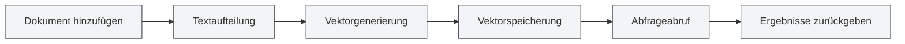
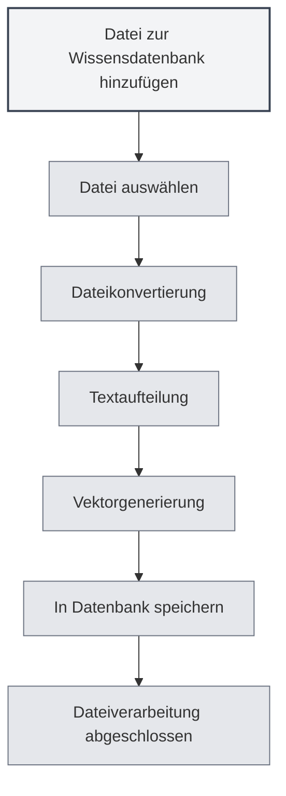

# Wissensdatenbank-Nutzung

## Übersicht

Die Wissensdatenbank ist das RAG-System (Retrieval-Augmented Generation) von MetaDoc, das über Vektorsuche Kontextinformationen für KI-Funktionen bereitstellt. Die sinnvolle Nutzung der Wissensdatenbank kann die Genauigkeit und Relevanz von KI-Antworten erheblich verbessern.

<KnowledgeBase mode="demo" />

## Einführung in die Wissensdatenbank

### Was ist eine Wissensdatenbank?

Eine Wissensdatenbank ist ein Dokumentenspeicher- und Abrufsystem, das folgende Funktionen bietet:

- **Dokumente speichern**: Dokumente in Vektoren umwandeln und speichern
- **Semantische Suche**: Inhalte basierend auf semantischer Ähnlichkeit suchen
- **KI-Verstärkung**: KI-Dialogen Kontextinformationen bereitstellen

### Funktionsweise

<RAGToolDisplay mode="demo" />

Die Wissensdatenbank nutzt Vektoreinbettungstechnologie:

1. **Dokumentverarbeitung**: Dokumente in Textblöcke aufteilen
2. **Vektorisierung**: Für jeden Textblock Vektoreinbettungen generieren
3. **Speicherung**: Vektoren in der Datenbank speichern
4. **Abruf**: Basierend auf der Abfrage Vektoren generieren und ähnliche Inhalte suchen

<KnowledgeBase mode="demo" />

## Dateien zur Wissensdatenbank hinzufügen

### Dateien hinzufügen

1. Öffnen Sie die Verwaltungsseite der Wissensdatenbank
2. Klicken Sie auf die Schaltfläche "Datei hinzufügen"
3. Wählen Sie die hinzuzufügende Datei aus
4. Warten Sie, bis die Dateiverarbeitung abgeschlossen ist

### Unterstützte Dateiformate

Die Wissensdatenbank unterstützt folgende Dateiformate:

- **Markdown** (.md): Markdown-Dokumente
- **LaTeX** (.tex): LaTeX-Dokumente
- **PDF** (.pdf): PDF-Dokumente
- **Word** (.docx): Word-Dokumente
- **Bilder** (.png, .jpg usw.): Texterkennung via OCR
- **Nur-Text** (.txt): Nur-Text-Dateien

### Dateiverarbeitung

<RAGToolDisplay mode="demo" />

Nach dem Hinzufügen einer Datei führt das System automatisch folgende Schritte aus:

1. **Textkonvertierung**: Datei in Textinhalt umwandeln
2. **Textaufteilung**: Text in Blöcke fester Größe aufteilen
3. **Vektorgenerierung**: Für jeden Block Vektoreinbettungen generieren
4. **Datenspeicherung**: Vektoren und Text in der Datenbank speichern

Die Verarbeitungszeit hängt von der Dateigröße ab; große Dateien können längere Zeit benötigen.

<KnowledgeBase mode="demo" />

## Verwaltung von Wissensdatenbank-Dateien

### Dateiliste

Die Verwaltungsseite der Wissensdatenbank zeigt alle hinzugefügten Dateien an:

- **Dateiname**: Name der Datei
- **Größe/Anzahl Blöcke**: Dateigröße und Anzahl der Datenblöcke
- **Status**: Ob die Datei aktiviert ist

### Dateioperationen

<RAGToolDisplay mode="demo" />

#### Dateien aktivieren/deaktivieren

- **Aktivieren**: Datei wird abgerufen und für KI-Funktionen genutzt
- **Deaktivieren**: Datei wird nicht abgerufen, Daten bleiben erhalten

#### Dateivorschau

Klicken Sie auf eine Datei, um ihren Inhalt in der Vorschau anzuzeigen:

- **Inhalt anzeigen**: Dateitext im Vorschaufenster ansehen
- **Editor öffnen**: Datei im Editor öffnen

#### Datei umbenennen

1. Wählen Sie die umzubenennende Datei aus
2. Klicken Sie auf die Bearbeitungsschaltfläche neben dem Dateinamen
3. Geben Sie den neuen Dateinamen ein
4. Bestätigen Sie die Umbenennung

#### Datei löschen

1. Wählen Sie die zu löschende Datei aus
2. Klicken Sie auf die Schaltfläche "Löschen"
3. Bestätigen Sie den Löschvorgang

Das Löschen einer Datei entfernt alle zugehörigen Vektoren und Datenblöcke.

#### Datei herunterladen

Sie können Dateien aus der Wissensdatenbank herunterladen:

1. Wählen Sie die herunterzuladende Datei aus
2. Klicken Sie auf die Schaltfläche "Herunterladen"
3. Wählen Sie den Speicherort

<KnowledgeBase mode="demo" />

## Vektorsuche

### Suchprinzip

Die Vektorsuche verwendet den ANN-Algorithmus (Approximate Nearest Neighbor):

- **Vektorähnlichkeit**: Berechnet die Ähnlichkeit zwischen Abfragevektor und Dokumentvektor
- **Kosinusähnlichkeit**: Nutzt Kosinusähnlichkeit zur Messung der Ähnlichkeit
- **Ergebnis-Sortierung**: Gibt Ergebnisse nach Ähnlichkeit sortiert zurück

### Suchmethoden

<RAGToolDisplay mode="demo" />

Die Wissensdatenbank unterstützt zwei Suchmethoden:

- **Vektorsuche**: Basierend auf semantischer Ähnlichkeit
- **Hybridabruf**: Kombiniert Vektorsuche und Schlüsselwortabgleich

### Suchtest

Auf der Verwaltungsseite der Wissensdatenbank können Sie die Suchfunktion testen:

1. Geben Sie den Suchtext in das Suchfeld ein
2. Passen Sie den Konfidenzschwellenwert an
3. Klicken Sie auf die Schaltfläche "Suchen"
4. Sehen Sie sich die Suchergebnisse an

### Konfidenzschwellenwert

Der Konfidenzschwellenwert steuert die Filterung der Suchergebnisse:

- **Niedriger Schwellenwert (0,1-0,3)**: Gibt mehr Ergebnisse zurück, kann aber irrelevante Inhalte enthalten
- **Mittlerer Schwellenwert (0,4-0,6)**: Ausgewogen zwischen Relevanz und Menge (empfohlen)
- **Hoher Schwellenwert (0,7-0,9)**: Gibt nur hochrelevante Ergebnisse zurück

<KnowledgeBase mode="demo" />

## Hybridabruf

### Abrufmechanismus

Hybridabruf kombiniert zwei Methoden:

- **Vektorsuche**: Basierend auf semantischer Ähnlichkeit
- **Schlüsselwortabgleich**: Basierend auf Textabgleich

### Bewertungsmechanismus

Hybridabruf verwendet eine kombinierte Bewertung:

- **Vektorähnlichkeit**: Semantische Ähnlichkeitspunktzahl
- **Schlüsselwortabgleich**: Textabgleich-Punktzahl
- **Kombinierte Bewertung**: Endpunktzahl, die beide Punktzahlen kombiniert

### Vorteile

Vorteile des Hybridabrufs:

- **Genauigkeit**: Vektorsuche bietet semantisches Verständnis
- **Präzision**: Schlüsselwortabgleich bietet exakte Übereinstimmung
- **Ausgewogenheit**: Kombiniert die Vorteile beider Methoden

<RAGToolDisplay mode="demo" />

## Suchtest

### Suche testen

Auf der Verwaltungsseite der Wissensdatenbank können Sie die Suche testen:

1. **Abfrage eingeben**: Geben Sie den zu suchenden Inhalt in das Suchfeld ein
2. **Schwellenwert anpassen**: Verwenden Sie den Schieberegler, um den Konfidenzschwellenwert anzupassen
3. **Suche ausführen**: Klicken Sie auf die Schaltfläche "Suchen" oder drücken Sie die Eingabetaste
4. **Ergebnisse anzeigen**: Sehen Sie sich die Suchergebnisse im Ergebnisbereich an

### Suchergebnisse

Suchergebnisse zeigen:

- **Übereinstimmender Text**: Textabschnitte, die mit der Abfrage zusammenhängen
- **Ähnlichkeit**: Ähnlichkeitspunktzahl zwischen Text und Abfrage
- **Quelldatei**: Datei, aus der der Text stammt

### Ergebnis-Sortierung

Suchergebnisse werden nach Ähnlichkeit sortiert:

- **Am relevantesten**: Ergebnisse mit der höchsten Ähnlichkeit stehen vorne
- **Abnehmende Relevanz**: Sortierung nach abnehmender Ähnlichkeit

## Vektor-Rekonstruktion

### Vektoren rekonstruieren

Wenn Probleme mit den Vektordaten einer Datei auftreten, können Sie die Vektoren rekonstruieren:

1. Wählen Sie die zu rekonstruierende Datei aus
2. Klicken Sie auf die Schaltfläche "Vektoren rekonstruieren"
3. Warten Sie, bis die Rekonstruktion abgeschlossen ist

### Alle Vektoren rekonstruieren

Sie können die Vektoren aller Dateien rekonstruieren:

1. Klicken Sie auf die Schaltfläche "Alle Vektoren rekonstruieren"
2. Bestätigen Sie den Vorgang
3. Warten Sie, bis die Rekonstruktion aller Dateien abgeschlossen ist

### Rekonstruktionsszenarien

Szenarien, in denen eine Vektor-Rekonstruktion erforderlich ist:

- **Embedding-Modell wechseln**: Nach Modellwechsel erforderlich
- **Vektordaten beschädigt**: Bei Problemen mit Vektordaten
- **Vektordarstellung aktualisieren**: Wenn die Vektordarstellung aktualisiert werden muss

## Wissensdatenbank leeren

### Leerungsvorgang

Wenn Sie die gesamte Wissensdatenbank leeren müssen:

1. Klicken Sie auf die Schaltfläche "Wissensdatenbank leeren"
2. Bestätigen Sie den Vorgang
3. Warten Sie, bis die Leerung abgeschlossen ist

### Auswirkungen der Leerung

Das Leeren der Wissensdatenbank führt zu:

- Löschen aller Dateieinträge
- Löschen aller Datenblöcke
- Löschen aller Vektoren
- Unwiderruflicher Operation

**Hinweise**:

- Der Leerungsvorgang ist unwiderruflich, bitte gehen Sie vorsichtig vor
- Vor der Leerung wird empfohlen, wichtige Dateien zu sichern
- Nach der Leerung müssen Dateien neu hinzugefügt werden

<KnowledgeBase mode="demo" />

## Verwendung in KI-Funktionen

### KI-Dialog

Die Wissensdatenbank stellt automatisch Kontext für KI-Dialoge bereit:

- **Automatischer Abruf**: Ruft automatisch relevantes Wissen basierend auf dem Dialoginhalt ab
- **Kontext-Injektion**: Injiziert Abrufergebnisse in den Dialogkontext
- **Antwortverstärkung**: Generiert genauere Antworten basierend auf Wissensdatenbank-Inhalten

### KI-Vervollständigung

Die Wissensdatenbank kann die KI-Vervollständigungsfunktion verbessern:

- **Kontextverständnis**: Versteht Kontext basierend auf Wissensdatenbank-Inhalten
- **Inhaltsgenerierung**: Generiert Inhalte, die mit Wissensdatenbank-Inhalten zusammenhängen
- **Genauigkeitssteigerung**: Verbessert die Genauigkeit von Vervollständigungsinhalten

### Agent-Tools

Die Wissensdatenbank kann als Agent-Tool verwendet werden:

- **RAG-Tool**: Nutzt RAG-Abruf in Agent-Workflows
- **Kontextbereitstellung**: Stellt Agenten relevante Kontextinformationen bereit
- **Aufgabenausführung**: Hilft Agenten bei wissensbasierten Aufgaben

## Best Practices

1. **Dateiorganisation**: Organisieren Sie Dateien nach Thema oder Projekt
2. **Regelmäßige Aktualisierung**: Rekonstruieren Sie Vektoren zeitnah nach Dateiaktualisierungen
3. **Schwellenwertanpassung**: Passen Sie den Konfidenzschwellenwert basierend auf der Nutzungswirksamkeit an
4. **Dateibereinigung**: Löschen Sie regelmäßig nicht mehr benötigte Dateien
5. **Suchtest**: Testen Sie regelmäßig die Suchfunktion, um eine gute Wirkung sicherzustellen

## Hinweise

1. **Wissensdatenbank aktivieren**: Vor der Nutzung muss die Wissensdatenbankfunktion aktiviert werden
2. **Dateiverarbeitung**: Große Dateien benötigen Verarbeitungszeit, bitte haben Sie Geduld
3. **Speicherplatz**: Die Wissensdatenbank belegt Speicherplatz
4. **Netzwerkverbindung**: Im API-Modus ist eine Netzwerkverbindung erforderlich
5. **Datensicherheit**: Achten Sie auf den Schutz sensibler Informationen in der Wissensdatenbank

## Verwandte Dokumentation

- [[knowledge-base.management|Wissensdatenbank-Verwaltung]]
- [[knowledge-base.config|Wissensdatenbank-Konfiguration]]
- [[settings.llm|LLM-Konfiguration]]
- [[ai.chat|KI-Dialogfunktion]]

<KnowledgeBase mode="demo" />

<RAGToolDisplay mode="demo" />
