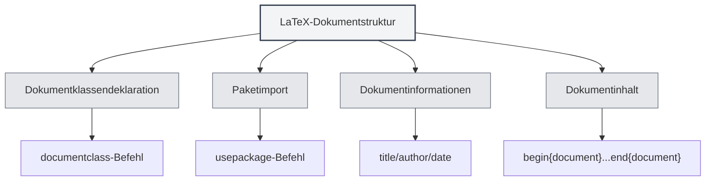

# LaTeX-Syntax

## Übersicht

LaTeX ist ein auf TeX basierendes Satzsystem, das häufig für das Verfassen von wissenschaftlichen Arbeiten und technischen Dokumenten verwendet wird. MetaDoc bietet umfassende Unterstützung für die Bearbeitung, Kompilierung und Vorschau von LaTeX.

<LaTeXEditorDemo mode="demo" />

<PdfPreviewPanel mode="demo" />

<LaTeXCompilerPanel mode="demo" />

<LaTeXConsole mode="demo" />

## Grundlegende Syntax

### Dokumentstruktur

Die grundlegende Struktur eines LaTeX-Dokuments:

```latex
\documentclass{article}
\usepackage[utf8]{inputenc}

\title{Dokumenttitel}
\author{Autor}
\date{\today}

\begin{document}
\maketitle

\section{Kapiteltitel}
Inhalt...

\end{document}
```



### Mathematische Formeln

**Inline-Formeln**:

```latex
Dies ist eine Inline-Formel: $E = mc^2$
```

**Block-Formeln**:

```latex
\begin{equation}
\int_{-\infty}^{\infty} e^{-x^2} dx = \sqrt{\pi}
\end{equation}
```

**Mehrzeilige Formeln**:

```latex
\begin{align}
x &= a + b \\
y &= c + d
\end{align}
```

### Tabellen

Verwenden Sie die `tabular`-Umgebung:

```latex
\begin{tabular}{|c|c|c|}
\hline
Spalte1 & Spalte2 & Spalte3 \\
\hline
Daten1 & Daten2 & Daten3 \\
\hline
\end{tabular}
```

### Bilder einfügen

Verwenden Sie die `figure`-Umgebung:

```latex
\begin{figure}[h]
\centering
\includegraphics[width=0.8\textwidth]{image.png}
\caption{Bildunterschrift}
\label{fig:example}
\end{figure}
```

### Literaturverzeichnis

Verwenden Sie `BibTeX` oder `natbib`:

```latex
\bibliographystyle{plain}
\bibliography{references}
```

## Kompilierung und Vorschau

LaTeX-Dokumente müssen kompiliert werden, um ein PDF zu erzeugen. Weitere Details finden Sie unter [[latex.compilation|LaTeX-Kompilierung und -Vorschau]].

Nach der Kompilierung können Sie das Ergebnis in der [[latex.pdf-preview|PDF-Vorschaufunktion]] anzeigen.

## Verwandte Dokumente

- [[latex.editor|LaTeX-Editor-Benutzerhandbuch]]
- [[latex.compilation|LaTeX-Kompilierung und -Vorschau]]
- [[latex.pdf-preview|PDF-Vorschaufunktion]]
- [[latex.console|Konsolenausgabe]]
