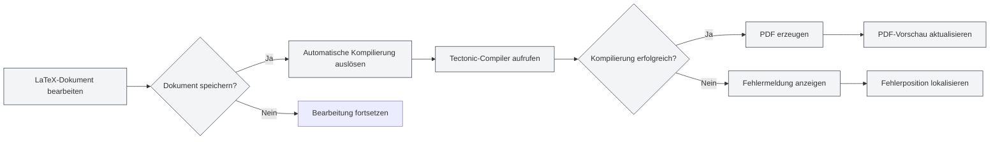
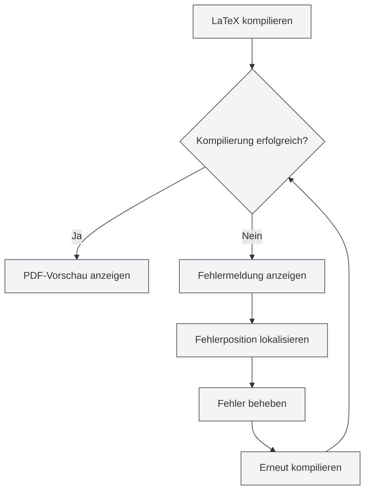

# LaTeX-Kompilierung und Vorschau

## Übersicht

LaTeX-Dokumente müssen kompiliert werden, um PDFs zu erzeugen. MetaDoc verwendet den Tectonic-Compiler und unterstützt Funktionen wie automatische Kompilierung, Echtzeitvorschau und Fehlerlokalisierung, um Ihnen ein effizientes Schreiben und Debuggen von LaTeX-Dokumenten zu ermöglichen.

Der Kompilierungsprozess lädt automatisch benötigte Pakete herunter, erfordert keine manuelle Konfiguration und vereinfacht den LaTeX-Workflow erheblich.

## LaTeX-Dokumente kompilieren

<LaTeXCompilerPanel mode="demo" />

### Automatische Kompilierung

MetaDoc unterstützt automatische Kompilierung:

- **Bei Speichern**: Die Kompilierung wird automatisch ausgelöst, wenn ein LaTeX-Dokument gespeichert wird.
- **Manuelle Kompilierung**: Manuelles Auslösen der Kompilierung durch Klicken auf die "Kompilieren"-Schaltfläche in der Symbolleiste.
- **Kompilierungsstatus**: Während der Kompilierung werden Fortschritt und Status angezeigt.

### Kompilierungsprozess

<LaTeXConsole mode="demo" />

Der Kompilierungsprozess umfasst folgende Schritte:

1. **Kompilierungsumgebung vorbereiten**: Prüfen, ob der Tectonic-Compiler verfügbar ist.
2. **Pakete herunterladen**: Automatisches Herunterladen der im Dokument verwendeten LaTeX-Pakete.
3. **Kompilierung ausführen**: Ausführen des Tectonic-Compilers zur PDF-Erzeugung.
4. **Ausgabe verarbeiten**: Verarbeiten der Kompilierungsprotokolle und Fehlermeldungen.
5. **Vorschau aktualisieren**: Bei erfolgreicher Kompilierung wird die PDF-Vorschau aktualisiert.

### Kompilierungsoptionen

<LaTeXEditorDemo mode="demo" />

Die Kompilierung unterstützt folgende Optionen:

- **Compiler**: Verwendung des Tectonic-Compilers (Standard)
- **Kompilierungsmodus**: Nicht-interaktiver Modus, stoppt bei Fehlern
- **Ausgabeverzeichnis**: PDF-Dateien werden im selben Verzeichnis wie das Dokument gespeichert

### Kompilierungszeit

<ConsoleTerminal mode="demo" consoleKey="demo" :history='[{"content": "Tectonic-Compiler startet...", "type": "out"}, {"content": "Dokumentstruktur wird analysiert", "type": "out"}]' />

Die Kompilierungszeit hängt ab von:

- **Dokumentgröße**: Je größer das Dokument, desto länger die Kompilierungszeit.
- **Anzahl der Pakete**: Je mehr Pakete verwendet werden, desto länger die erste Kompilierung (wegen des Downloads).
- **Anzahl der Bilder**: Je mehr Bilder enthalten sind, desto länger die Kompilierungszeit.

Die erste Kompilierung kann länger dauern, da Pakete heruntergeladen werden müssen. Nachfolgende Kompilierungen sind schneller.

## PDF-Vorschau

<PdfPreviewPanel mode="demo" pdfUrl="" />

### Automatische Aktualisierung

Die PDF-Vorschau wird nach erfolgreicher Kompilierung automatisch aktualisiert:

- **Echtzeitvorschau**: PDF-Vorschau wird sofort nach erfolgreicher Kompilierung angezeigt.
- **Automatische Aktualisierung**: Die Vorschau wird automatisch aktualisiert, wenn sich der PDF-Inhalt ändert.
- **Synchronisiertes Scrollen**: Unterstützt die synchrone Positionierung zwischen PDF und Code.

### Vorschaufunktionen

<LaTeXCompilerPanel mode="demo" />

Das PDF-Vorschaufenster bietet folgende Funktionen:

- **Seitennavigation**: Vorherige Seite, nächste Seite, Sprung zu einer bestimmten Seite.
- **Zoomsteuerung**: Vergrößern, Verkleinern, Zoom zurücksetzen.
- **Vorschau aktualisieren**: Manuelle Aktualisierung der PDF-Vorschau.
- **Zum Code springen**: Von einer PDF-Position zum entsprechenden LaTeX-Code springen.

Weitere Details unter [[latex.pdf-preview|PDF-Vorschaufunktionen]].

Die Benutzeroberfläche des PDF-Vorschaufensters sieht wie folgt aus:

<PdfPreviewPanel mode="demo" pdfUrl="" />

## Konsolenausgabe

<LaTeXConsole mode="demo" />

### Kompilierungsprotokoll

Die Protokolle während des Kompilierungsprozesses werden im Konsolenausgabefenster angezeigt:

- **Standardausgabe**: Normale Ausgabe des Kompilierungsprozesses.
- **Fehlermeldungen**: Kompilierungsfehler und Warnungen.
- **Echtzeitaktualisierung**: Protokolle werden während der Kompilierung in Echtzeit aktualisiert.

Die Benutzeroberfläche des Konsolenausgabefensters sieht wie folgt aus:

<ConsoleTerminal mode="demo" consoleKey="demo" :history='[{"content": "Kompilierung startet...", "type": "out"}, {"content": "Paket wird heruntergeladen: amsmath", "type": "out"}, {"content": "Warnung: Undefinierter Verweis", "type": "warn"}, {"content": "Kompilierung abgeschlossen", "type": "out"}]' />

### Fehlermeldungen

<ConsoleTerminal mode="demo" consoleKey="demo" :history='[{"content": "Fehler: Undefinierter Befehl", "type": "error"}, {"content": "Warnung: Hypertext-Referenz nicht gefunden", "type": "warn"}]' />

Kompilierungsfehler werden in verschiedenen Farben angezeigt:

- **Fehler**: Rot, zeigt einen Kompilierungsfehler an.
- **Warnung**: Gelb, zeigt mögliche Probleme an.
- **Information**: Grau, zeigt allgemeine Informationen an.

### Fehlerlokalisierung

Kompilierungsfehler zeigen:

- **Fehlerposition**: Zeilennummer und Spaltennummer, an der der Fehler auftrat.
- **Fehlertyp**: Art und Beschreibung des Fehlers.
- **Schnellsprung**: Durch Klicken auf die Fehlermeldung springt man zur entsprechenden Codeposition.

Weitere Details unter [[latex.console|Konsolenausgabe]].

## Zu PDF springen

<LaTeXEditorDemo mode="demo" />

### Von Code zu PDF springen

Im LaTeX-Editor können Sie:

1. **Code auswählen**: LaTeX-Code auswählen.
2. **Kontextmenü**: Rechtsklick und Auswahl von "Zu PDF springen".
3. **Zur Vorschau springen**: Die PDF-Vorschau springt automatisch zur entsprechenden Position.

### Von PDF zu Code springen

In der PDF-Vorschau können Sie:

1. **PDF-Position anklicken**: Auf eine Position im PDF klicken.
2. **Automatischer Sprung**: Der Editor springt automatisch zur entsprechenden LaTeX-Codeposition.

Diese Funktion ermöglicht einen schnellen Wechsel zwischen PDF und Code, was das Debuggen und Bearbeiten erleichtert.

## Behandlung von Kompilierungsfehlern

<LaTeXConsole mode="demo" />

### Häufige Fehlertypen

Bei der LaTeX-Kompilierung können folgende Fehler auftreten:

- **Syntaxfehler**: Falsche LaTeX-Syntax.
- **Fehlendes Paket**: Verwendung eines nicht installierten Pakets (Tectonic lädt es automatisch herunter).
- **Fehlende Datei**: Referenzierte Datei existiert nicht.
- **Kodierungsfehler**: Falsche Dateikodierung.

### Fehlerbehandlungsablauf

### Debugging-Tipps

1. **Konsole prüfen**: Fehlermeldungen in der Konsolenausgabe sorgfältig lesen.
2. **Fehler lokalisieren**: Fehlerlokalisierungsfunktion nutzen, um problematischen Code schnell zu finden.
3. **Schrittweise beheben**: Fehler beginnend mit dem ersten nacheinander beheben.
4. **Syntax prüfen**: Sicherstellen, dass die LaTeX-Syntax korrekt ist.
5. **Dateien prüfen**: Sicherstellen, dass referenzierte Dateien existieren und der Pfad korrekt ist.

## Tectonic-Compiler

<LaTeXCompilerPanel mode="demo" />

### Compiler-Einführung

MetaDoc verwendet den Tectonic-Compiler mit folgenden Eigenschaften:

- **Keine TeX-Distribution nötig**: Tectonic ist eine eigenständige Binärdatei.
- **Automatischer Paketdownload**: Benötigte Pakete werden während der Kompilierung automatisch von CTAN heruntergeladen.
- **Schnelle Kompilierung**: Schneller als traditionelle TeX-Distributionen.
- **Plattformübergreifende Unterstützung**: Vollständige Unterstützung für Windows, macOS und Linux.

### Paketverwaltung

Tectonic verwaltet LaTeX-Pakete automatisch:

- **Automatischer Download**: Automatisches Herunterladen bei erstmaliger Verwendung.
- **Cache-Verwaltung**: Heruntergeladene Pakete werden gecached, was spätere Kompilierungen beschleunigt.
- **Versionsverwaltung**: Automatische Verwaltung der Paketversionen.

Sie müssen keine Pakete manuell herunterladen oder konfigurieren. Verwenden Sie einfach den `\usepackage{}`-Befehl in Ihrem Dokument.

## Anwendungstipps

<LaTeXEditorDemo mode="demo" />

### Kompilierungsgeschwindigkeit erhöhen

1. **Bilder reduzieren**: Anzahl der Bilder im Dokument reduzieren.
2. **Code optimieren**: Struktur des LaTeX-Codes optimieren.
3. **Cache nutzen**: Paket-Cache von Tectonic nutzen.

### Kompilierungsfehler debuggen

1. **Vollständiges Protokoll ansehen**: Vollständiges Kompilierungsprotokoll in der Konsole prüfen.
2. **Syntax prüfen**: LaTeX-Syntax sorgfältig überprüfen.
3. **Schrittweise kompilieren**: Codeabschnitte auskommentieren, um Probleme schrittweise zu lokalisieren.
4. **Dokumentation konsultieren**: Dokumentation der LaTeX-Pakete nachschlagen.

### Kompilierungsablauf optimieren

1. **Kompilierung beim Speichern**: Automatische Kompilierung beim Speichern aktivieren.
2. **Vorschau nutzen**: PDF-Vorschau zur schnellen Ergebnisprüfung nutzen.
3. **Lokalisierungsfunktion**: Lokalisierungsfunktion für schnellen Wechsel zwischen Code und PDF nutzen.

## Häufig gestellte Fragen

### F: Was tun, wenn die Kompilierung fehlschlägt?

A: Prüfen Sie die Fehlermeldungen in der Konsolenausgabe und beheben Sie den Code gemäß den Hinweisen. Häufige Probleme sind Syntaxfehler, fehlende Dateien usw.

### F: Die Kompilierung dauert sehr lange?

A: Die erste Kompilierung benötigt Zeit zum Herunterladen von Paketen, das ist normal. Spätere Kompilierungen sind schneller. Bei anhaltender Langsamkeit die Dokumentgröße und Bildanzahl prüfen.

### F: Paketdownload fehlgeschlagen?

A: Netzwerkverbindung prüfen und sicherstellen, dass CTAN erreichbar ist. Tectonic versucht den Download automatisch erneut.

### F: PDF-Vorschau aktualisiert sich nicht?

A: Klicken Sie auf die "Aktualisieren"-Schaltfläche für eine manuelle Aktualisierung oder prüfen Sie, ob die Kompilierung erfolgreich war.

### F: Wie kann ich das Kompilierungsprotokoll einsehen?

A: Das Kompilierungsprotokoll wird im Konsolenausgabefenster angezeigt, wo Sie Standardausgabe, Fehlermeldungen und Warnungen sehen können.

## Verwandte Dokumentation

- [[latex.editor|LaTeX-Editor Benutzerhandbuch]]
- [[latex.basics|LaTeX-Syntax]]
- [[latex.pdf-preview|PDF-Vorschaufunktionen]]
- [[latex.console|Konsolenausgabe]]

<LaTeXCompilerPanel mode="demo" />

<LaTeXEditorDemo mode="demo" />