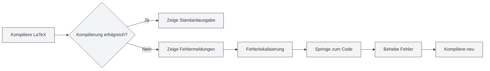

# Konsolenausgabe

## Übersicht

Das Konsolenausgabe-Panel zeigt Protokollinformationen während des LaTeX-Kompilierungsprozesses an, einschließlich Standardausgabe, Fehlermeldungen, Warnungen usw. Durch das Betrachten der Konsolenausgabe können Sie den Kompilierungsprozess verstehen, Fehler lokalisieren und Probleme debuggen.

Die Konsolenausgabe wird mit dem Monaco-Editor angezeigt und unterstützt Funktionen wie Syntax-Highlighting, Fehlerlokalisierung und Protokollfilterung, sodass Sie Kompilierungsprotokolle effizient einsehen und analysieren können.

## LaTeX-Kompilierungsausgabe

<LaTeXConsole mode="demo" />

### Standardausgabe

Die Standardausgabe während des Kompilierungsprozesses wird in der Konsole angezeigt:

- **Kompilierungsfortschritt**: Zeigt die verschiedenen Phasen der Kompilierung an
- **Paketdownload**: Zeigt Informationen zu heruntergeladenen Paketen an
- **Kompilierungsinformationen**: Zeigt detaillierte Informationen zum Kompilierungsprozess an

Die Standardausgabe wird als normaler Text angezeigt und hilft Ihnen, den Kompilierungsprozess zu verstehen.

Die Benutzeroberfläche des Konsolenausgabe-Panels sieht wie folgt aus:

<ConsoleTerminal mode="demo" consoleKey="demo" :history='[{"content": "编译开始...", "type": "out"}, {"content": "警告：未定义的引用", "type": "warn"}, {"content": "编译完成", "type": "out"}]' />

### Ausgabeformat

<ConsoleTerminal mode="demo" consoleKey="demo" :history='[{"content": "标准输出信息", "type": "out"}, {"content": "警告信息", "type": "warn"}, {"content": "错误信息", "type": "error"}]' />

Die Konsolenausgabe verwendet verschiedene Farben, um verschiedene Arten von Informationen zu unterscheiden:

- **Standardausgabe**: Grauer Text, zeigt normale Kompilierungsinformationen an
- **Fehlermeldungen**: Roter Text, zeigt Kompilierungsfehler an
- **Warnmeldungen**: Gelber Text, zeigt Kompilierungswarnungen an
- **Debug-Informationen**: Dunkelgrauer Text, zeigt Debug-Informationen an

## Anzeige von Fehlermeldungen

<LaTeXConsole mode="demo" />

### Fehlerformat

Kompilierungsfehler werden in einem bestimmten Format angezeigt:

- **Fehlerposition**: Zeigt den Dateinamen, die Zeilennummer und die Spaltennummer an, an der der Fehler aufgetreten ist
- **Fehlertyp**: Zeigt den Fehlertyp an (z.B. Syntaxfehler, fehlende Datei usw.)
- **Fehlerbeschreibung**: Zeigt eine detaillierte Beschreibung des Fehlers an

### Fehlerlokalisierung

Die Konsolenausgabe unterstützt die Fehlerlokalisierungsfunktion:

- **Fehler anklicken**: Durch Klicken auf die Fehlermeldung springen Sie zur entsprechenden Codeposition
- **Hervorhebung**: Die entsprechende Codezeile des Fehlers wird hervorgehoben
- **Schnelle Fehlerbehebung**: Schnelles Auffinden der Fehlerposition zur einfachen Behebung

### Häufige Fehlertypen

Bei der LaTeX-Kompilierung können folgende Fehler auftreten:

- **Syntaxfehler**: LaTeX-Syntax ist nicht korrekt
- **Befehl nicht definiert**: Es wurde ein undefinierter LaTeX-Befehl verwendet
- **Umgebung nicht geschlossen**: Eine Umgebung wurde nicht korrekt geschlossen
- **Datei fehlt**: Eine referenzierte Datei existiert nicht
- **Paketfehler**: Paket konnte nicht geladen werden oder es gibt Konflikte

## Anzeige von Warnmeldungen

<ConsoleTerminal mode="demo" consoleKey="demo" :history='[{"content": "警告: 未定义的引用", "type": "warn"}]' />

### Warnformat

Kompilierungswarnungen werden in einem bestimmten Format angezeigt:

- **Warnposition**: Zeigt die Position an, an der die Warnung aufgetreten ist
- **Warntyp**: Zeigt den Typ der Warnung an
- **Warnbeschreibung**: Zeigt eine detaillierte Beschreibung der Warnung an

### Behandlung von Warnungen

Warnmeldungen verhindern normalerweise nicht die Kompilierung, können aber das Endergebnis beeinflussen:

- **Warnungen ansehen**: Warnmeldungen sorgfältig prüfen, um mögliche Probleme zu verstehen
- **Warnungen beheben**: Code gemäß der Warnmeldungen korrigieren
- **Warnungen ignorieren**: Wenn die Warnung das Ergebnis nicht beeinflusst, kann sie vorübergehend ignoriert werden

## Protokollfilterung

<LaTeXConsole mode="demo" />

### Filterfunktion

Die Konsolenausgabe unterstützt die Protokollfilterfunktion:

- **Nach Typ filtern**: Nur Fehler, Warnungen oder Standardausgabe anzeigen
- **Nach Schlüsselwort filtern**: Protokolle filtern, die bestimmte Schlüsselwörter enthalten
- **Nach Zeit filtern**: Protokolle eines bestimmten Zeitraums filtern

### Filtereinstellungen

Die Protokollfilterung kann im Konsolen-Panel konfiguriert werden:

1. Öffnen Sie das Konsolenausgabe-Panel
2. Verwenden Sie die Filteroptionen, um den anzuzeigenden Inhalt auszuwählen
3. Geben Sie ein Schlüsselwort für die Suchfilterung ein

### Protokolle löschen

Konsolenausgabe löschen:

- **Löschen-Button**: Klicken Sie auf den "Löschen"-Button in der Konsole
- **Tastenkürzel**: `Strg+L` (falls konfiguriert)

Das Löschen der Protokolle entfernt alle angezeigten Protokollinformationen.

## Protokolloperationen

<ConsoleTerminal mode="demo" consoleKey="demo" :history='[{"content": "编译日志内容...", "type": "out"}]' />

### Protokolle kopieren

Konsolenausgabe in die Zwischenablage kopieren:

- **Kopieren-Button**: Klicken Sie auf den "Kopieren"-Button in der Konsole
- **Tastenkürzel**: `Strg+C` (nach Auswahl des Textes)

Kopierte Protokolle können an anderen Orten gespeichert oder mit anderen geteilt werden.

### Protokolle speichern

Konsolenausgabe in einer Datei speichern:

- **Speichern-Button**: Klicken Sie auf den "Protokoll speichern"-Button in der Konsole
- **Dateiauswahl**: Speicherort und Dateinamen auswählen

Gespeicherte Protokolldateien können für spätere Analysen oder Problemberichte verwendet werden.

### KI-Analyse

Die Konsolenausgabe unterstützt die KI-Analysefunktion:

- **KI-Analyse aktivieren**: Schalter für KI-Analyse im Konsolen-Panel aktivieren
- **Automatische Analyse**: Die KI analysiert automatisch Fehlermeldungen und bietet Lösungsvorschläge
- **Vorschläge ansehen**: Die von der KI bereitgestellten Fehlerbehebungsvorschläge ansehen

Die KI-Analysefunktion kann Ihnen helfen, Kompilierungsfehler schnell zu verstehen und zu beheben.

## Konsoleneinstellungen

<LaTeXConsole mode="demo" />

### Anzeigeoptionen

Die Konsolenausgabe unterstützt folgende Anzeigeoptionen:

- **Zeilennummernanzeige**: Zeigt die Zeilennummern der Protokollzeilen an
- **Automatischer Zeilenumbruch**: Lange Zeilen werden automatisch umgebrochen
- **Schriftgröße**: Schriftgröße der Protokollanzeige anpassen

### Theme-Einstellungen

Die Konsolenausgabe folgt dem Editor-Theme:

- **Helles Theme**: Verwendet einen hellen Hintergrund im hellen Theme
- **Dunkles Theme**: Verwendet einen dunklen Hintergrund im dunklen Theme
- **Automatische Synchronisierung**: Synchronisiert automatisch mit den Editor-Theme-Einstellungen

## Verwendungstipps

<ConsoleTerminal mode="demo" consoleKey="demo" :history='[{"content": "定位到错误位置...", "type": "out"}]' />

### Schnelle Fehlerlokalisierung

1. **Fehlermeldungen ansehen**: Format und Inhalt der Fehlermeldungen sorgfältig prüfen
2. **Lokalisierungsfunktion verwenden**: Auf Fehlermeldung klicken, um schnell zur Codeposition zu springen
3. **Kontext prüfen**: Kontextcode an der Fehlerposition ansehen

### Kompilierungsprotokolle verstehen

1. **Standardausgabe lesen**: Die verschiedenen Phasen des Kompilierungsprozesses verstehen
2. **Auf Fehlermeldungen achten**: Priorität auf Fehlermeldungen legen und diese zuerst beheben
3. **Warnmeldungen ansehen**: Warnmeldungen prüfen, um mögliche Probleme zu verstehen

### Debugging-Tipps

1. **Schrittweise kompilieren**: Teile des Codes auskommentieren, um Probleme schrittweise zu lokalisieren
2. **Vollständiges Protokoll ansehen**: Vollständiges Kompilierungsprotokoll ansehen, um den Prozess zu verstehen
3. **KI-Analyse verwenden**: KI-Analysefunktion aktivieren, um Lösungsvorschläge zu erhalten

## Häufig gestellte Fragen

<LaTeXConsole mode="demo" />

### F: Konsolenausgabe wird nicht angezeigt?

A: Stellen Sie sicher, dass das Konsolenausgabe-Panel geöffnet ist. Beim Kompilieren eines LaTeX-Dokuments öffnet sich das Konsolen-Panel automatisch.

### F: Wie finde ich schnell einen Fehler?

A: Fehlermeldungen werden in Rot angezeigt. Durch Klicken auf die Fehlermeldung können Sie schnell zur Codeposition springen.

### F: Was tun bei zu vielen Protokollen?

A: Verwenden Sie die Filterfunktion, um unerwünschte Protokolle auszublenden, oder die Löschfunktion, um alte Protokolle zu entfernen.

### F: Wie speichere ich Kompilierungsprotokolle?

A: Klicken Sie auf den "Protokoll speichern"-Button in der Konsole und wählen Sie den Speicherort, um die Protokolldatei zu speichern.

### F: KI-Analyse ist ungenau?

A: Die KI-Analyse dient nur als Referenz. Es wird empfohlen, sie in Kombination mit Fehlermeldungen und Codekontext zu beurteilen. Manuelle Fehlerbehebung oder erneute Analyse sind möglich.

## Verwandte Dokumentation

- [[latex.compilation|LaTeX-Kompilierung und Vorschau]]
- [[latex.editor|LaTeX-Editor-Benutzerhandbuch]]
- [[latex.pdf-preview|PDF-Vorschaufunktion]]

<PdfPreviewPanel mode="demo" pdfUrl="" />

<LaTeXCompilerPanel mode="demo" />

<LaTeXEditorDemo mode="demo" />
