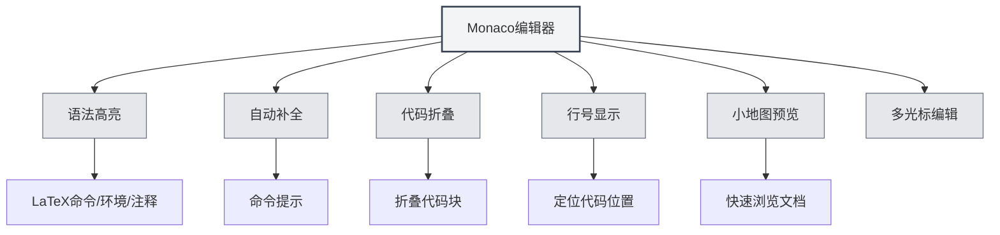

# LaTeX-Editor Benutzerhandbuch

## Übersicht

Der LaTeX-Editor von MetaDoc basiert auf dem Monaco Editor und bietet eine professionelle LaTeX-Code-Editing-Erfahrung. Der Editor unterstützt Syntax-Highlighting, Auto-Vervollständigung, Code-Faltung und weitere Funktionen, um Ihnen beim effizienten Schreiben von LaTeX-Dokumenten zu helfen.

Der Monaco Editor ist die Editor-Kernkomponente, die von Visual Studio Code verwendet wird, und verfügt über leistungsstarke Code-Editing-Fähigkeiten sowie umfangreiche Funktionen.

<PdfPreviewPanel mode="demo" pdfUrl="" />

<ConsoleTerminal mode="demo" consoleKey="demo" :history='[{"content": "编译完成", "type": "out"}]' />

<LaTeXEditor mode="demo" />

## Einführung in den Monaco Editor

Der Monaco Editor bietet die folgenden Funktionen für die LaTeX-Bearbeitung:

- **Syntax-Highlighting**: LaTeX-Befehle, Umgebungen, Kommentare und andere Syntaxelemente werden in verschiedenen Farben angezeigt.
- **Auto-Vervollständigung**: Automatische Anzeige von Vervollständigungsvorschlägen bei der Eingabe von LaTeX-Befehlen.
- **Code-Faltung**: Unterstützt das Falten von Codeblöcken, um das Durchsuchen langer Dokumente zu erleichtern.
- **Zeilennummern-Anzeige**: Zeigt Zeilennummern an, um die Positionierung im Code zu erleichtern.
- **Minimap-Vorschau**: Zeigt auf der rechten Seite eine Miniaturansicht des Codes für einen schnellen Überblick über die Dokumentstruktur.
- **Mehrfach-Cursor-Bearbeitung**: Unterstützt die gleichzeitige Bearbeitung mit mehreren Cursorn.

<LaTeXEditorDemo mode="demo" />

## Code-Highlighting und Syntax-Hinweise

### Syntax-Highlighting

Der LaTeX-Editor erkennt und hebt automatisch hervor:

- **Befehle**: LaTeX-Befehle wie `\documentclass`, `\usepackage` usw.
- **Umgebungen**: Umgebungsmarkierungen wie `\begin{document}`, `\end{document}` usw.
- **Kommentare**: Kommentarzeilen, die mit `%` beginnen.
- **Mathematische Formeln**: Von `$` oder `$$` umschlossene mathematische Formelbereiche.
- **Sonderzeichen**: Sonderzeichen wie `&`, `#`, `$` usw.

Syntax-Highlighting macht die Codestruktur klarer und erleichtert das Lesen und Bearbeiten.

### Syntax-Hinweise

Der Editor zeigt Syntax-Hinweise in folgenden Situationen an:

- **Befehlseingabe**: Automatische Anzeige verfügbarer LaTeX-Befehle nach Eingabe von `\`.
- **Umgebungseingabe**: Anzeige verfügbarer Umgebungsnamen nach Eingabe von `\begin{`.
- **Paketnameingabe**: Anzeige gängiger Paketnamen nach Eingabe von `\usepackage{`.

Syntax-Hinweise helfen Ihnen, schnell korrekte LaTeX-Befehle einzugeben und Tippfehler zu reduzieren.

<LaTeXEditor mode="demo" />

## Zeilennummern-Anzeige

### Zeilennummern anzeigen

Zeilennummern werden auf der linken Seite des Editors angezeigt und helfen Ihnen dabei:

- **Code zu lokalisieren**: Schnelles Navigieren zu einer bestimmten Zeile.
- **Fehler zu finden**: Kompilierungsfehler zeigen Zeilennummern an, was die Problembehebung erleichtert.
- **Code zu referenzieren**: Einfaches Referenzieren bestimmter Codezeilen im Dokument.

### Zeilennummern einstellen

Die Anzeige der Zeilennummern kann in den Einstellungen konfiguriert werden:

1. Öffnen Sie die Einstellungsseite.
2. Finden Sie die Option "Zeilennummern anzeigen".
3. Schalten Sie den Schalter um, um Zeilennummern zu aktivieren oder zu deaktivieren.

Die Zeilennummern-Einstellung betrifft alle Monaco-Editoren (LaTeX-Editor, Texteditor usw.).

<LaTeXEditorDemo mode="demo" />

## Minimap-Vorschau

### Minimap-Funktion

Die Minimap ist eine Miniaturansicht des Codes auf der rechten Seite des Editors:

- **Schnelles Überblicken**: In der Minimap ist die gesamte Dokumentstruktur sichtbar.
- **Schnelle Navigation**: Klicken Sie in der Minimap, um schnell zur entsprechenden Position zu springen.
- **Strukturvorschau**: Verstehen Sie verschiedene Dokumentteile anhand von Farbunterschieden.

### Minimap ein-/ausblenden

Die Minimap kann auf folgende Weise gesteuert werden:

1. Klicken Sie mit der rechten Maustaste in den Editor.
2. Suchen Sie die Option "Minimap" oder "Minimap".
3. Schalten Sie den Anzeigestatus um.

Die Minimap eignet sich besonders gut für die Bearbeitung langer Dokumente und hilft Ihnen, die Dokumentstruktur schnell zu erfassen.

## Code-Faltung

### Faltfunktion

Die Code-Faltung ermöglicht es Ihnen, Codeblöcke zu falten und Teile, die Sie nicht sehen müssen, auszublenden:

- **Umgebungen falten**: Falten Sie `\begin{...}...\end{...}`-Umgebungsblöcke.
- **Funktionen falten**: Falten Sie benutzerdefinierte Befehlsdefinitionen.
- **Kommentare falten**: Falten Sie längere Kommentarabschnitte.

### Faltung verwenden

- **Falten**: Klicken Sie auf das Faltungssymbol links neben der Zeilennummer oder verwenden Sie die Tastenkombination `Strg+Umschalt+[`.
- **Entfalten**: Klicken Sie auf die Faltungsmarkierung oder verwenden Sie die Tastenkombination `Strg+Umschalt+]`.
- **Alles falten**: Verwenden Sie die Tastenkombination `Strg+K Strg+0`, um alle Codeblöcke zu falten.
- **Alles entfalten**: Verwenden Sie die Tastenkombination `Strg+K Strg+J`, um alle Codeblöcke zu entfalten.

Die Code-Faltung ermöglicht es Ihnen, sich auf den aktuell bearbeiteten Teil zu konzentrieren und steigert die Bearbeitungseffizienz.

<LaTeXEditorDemo mode="demo" />

## Auto-Vervollständigung

### Auslösung der Vervollständigung

Der Editor zeigt automatisch Vervollständigungsvorschläge in folgenden Situationen an:

- **Befehlseingabe**: Anzeige einer LaTeX-Befehlsliste nach Eingabe von `\`.
- **Umgebungseingabe**: Anzeige von Umgebungsnamen nach Eingabe von `\begin{`.
- **Paketnameingabe**: Anzeige gängiger Paketnamen nach Eingabe von `\usepackage{`.
- **Andere Zeichen**: Mögliche Anzeige relevanter Vorschläge nach Eingabe anderer Zeichen.

### Vervollständigung annehmen

- **Eingabetaste**: Nimmt den aktuell ausgewählten Vervollständigungsvorschlag an.
- **Tabulatortaste**: Nimmt den aktuell ausgewählten Vervollständigungsvorschlag an.
- **Pfeiltasten**: Bewegen die Auswahl in der Vervollständigungsliste nach oben/unten.
- **Esc-Taste**: Bricht die Vervollständigungsvorschläge ab.

### Vervollständigungseinstellungen

Die Auto-Vervollständigungsfunktion kann in den Editoreinstellungen konfiguriert werden:

- **Schnelle Vorschläge**: Automatische Anzeige von Vervollständigungsvorschlägen nach anderen Zeichen.
- **Auslösezeichen**: Automatische Anzeige der Vervollständigung nach bestimmten Zeichen (z.B. `\`).
- **Annahmezeichen**: Automatische Annahme der Vervollständigung bei Eingabe von Commit-Zeichen.

<LaTeXEditor mode="demo" />

## Bearbeitungsfunktionen

### Mehrfach-Cursor-Bearbeitung

Der Monaco Editor unterstützt die gleichzeitige Bearbeitung mit mehreren Cursorn:

- **Alt+Klick**: Fügt an der Klickposition einen neuen Cursor hinzu.
- **Strg+Alt+Pfeil oben/unten**: Fügt einen Cursor oberhalb/unterhalb hinzu.
- **Strg+D**: Wählt das nächste identische Wort aus und fügt einen Cursor hinzu.
- **Strg+Umschalt+L**: Wählt alle identischen Wörter aus und fügt Cursor hinzu.

Die Mehrfach-Cursor-Bearbeitung ermöglicht die gleichzeitige Änderung mehrerer Positionen und erhöht die Bearbeitungseffizienz.

### Spaltenauswahl

Unterstützt den Spaltenauswahlmodus:

- **Alt+Umschalt+Ziehen**: Wählt einen rechteckigen Bereich aus.
- **Alt+Umschalt+Pfeiltasten**: Erweitert die Spaltenauswahl.

Die Spaltenauswahl eignet sich für die Bearbeitung von Tabellen oder ausgerichtetem Code.

### Code-Formatierung

Der Editor unterstützt grundlegende Code-Formatierung:

- **Automatische Einrückung**: Automatische Einrückung basierend auf der Codestruktur.
- **Automatischer Zeilenumbruch**: Lange Zeilen werden automatisch umgebrochen.
- **Einrückungsart**: Unterstützt verschiedene Einrückungsarten (Leerzeichen, Tabulator).

<LaTeXEditorDemo mode="demo" />

## Suchen und Ersetzen

### Suchfunktion

- **Tastenkombination**: `Strg+F` öffnet das Suchdialogfeld.
- **Hervorhebung**: Suchergebnisse werden im Dokument hervorgehoben.
- **Zyklische Suche**: Springt nach Erreichen des Dokumentsendes automatisch zum Anfang zurück.

### Ersetzfunktion

- **Tastenkombination**: `Strg+H` öffnet das Suchen-und-Ersetzen-Dialogfeld.
- **Einzeln ersetzen**: Ersetzt übereinstimmenden Text schrittweise.
- **Alle ersetzen**: Ersetzt alle übereinstimmenden Texte auf einmal.

### Erweiterte Optionen

Die Suche/Ersetzung unterstützt folgende Optionen:

- **Groß-/Kleinschreibung beachten**: Passt nur auf Text mit exakt gleicher Groß-/Kleinschreibung.
- **Ganzes Wort**: Passt nur auf vollständige Wörter.
- **Regulärer Ausdruck**: Verwendet reguläre Ausdrücke für Musterabgleich.

<LaTeXEditorDemo mode="demo" />

## Tastenkombinationen Referenz

### Bearbeitungs-Tastenkombinationen

| Aktion | Windows/Linux | macOS   |
| ------ | ------------- | ------- |
| Rückgängig | `Strg+Z`      | `Cmd+Z` |
| Wiederholen | `Strg+Y`      | `Cmd+Y` |
| Kopieren | `Strg+C`      | `Cmd+C` |
| Einfügen | `Strg+V`      | `Cmd+V` |
| Alles auswählen | `Strg+A`      | `Cmd+A` |
| Suchen | `Strg+F`      | `Cmd+F` |
| Ersetzen | `Strg+H`      | `Cmd+H` |

### Code-Faltungs-Tastenkombinationen

| Aktion     | Windows/Linux   | macOS          |
| ---------- | --------------- | -------------- |
| Falten     | `Strg+Umschalt+[`  | `Cmd+Option+[` |
| Entfalten  | `Strg+Umschalt+]`  | `Cmd+Option+]` |
| Alles falten | `Strg+K Strg+0` | `Cmd+K Cmd+0`  |
| Alles entfalten | `Strg+K Strg+J` | `Cmd+K Cmd+J`  |

### Mehrfach-Cursor-Tastenkombinationen

| Aktion               | Windows/Linux  | macOS          |
| -------------------- | -------------- | -------------- |
| Cursor hinzufügen    | `Alt+Klick`    | `Option+Klick` |
| Cursor oberhalb hinzufügen | `Strg+Alt+↑`   | `Cmd+Option+↑` |
| Cursor unterhalb hinzufügen | `Strg+Alt+↓`   | `Cmd+Option+↓` |
| Nächstes gleiches Wort auswählen | `Strg+D`       | `Cmd+D`        |
| Alle gleichen Wörter auswählen | `Strg+Umschalt+L` | `Cmd+Umschalt+L`  |

<LaTeXEditor mode="demo" />

## Anwendungstipps

### Schnelle Eingabe

1. **Befehlsvervollständigung**: Nach Eingabe von `\` mit den Pfeiltasten einen Befehl auswählen und mit Enter annehmen.
2. **Umgebungsvervollständigung**: Nach Eingabe von `\begin{` einen Umgebungsnamen auswählen, der Editor vervollständigt automatisch `\end{...}`.
3. **Paketnamevervollständigung**: Nach Eingabe von `\usepackage{` einen Paketnamen auswählen, um schnell ein Paket hinzuzufügen.

<LaTeXEditor mode="demo" />

### Code-Organisation

1. **Faltung verwenden**: Falten Sie nicht benötigte Codeblöcke, um den Bearbeitungsbereich übersichtlich zu halten.
2. **Kommentare verwenden**: Fügen Sie Kommentare hinzu, um die Codefunktionalität zu erklären und die spätere Wartung zu erleichtern.
3. **Konsequente Einrückung**: Halten Sie die Code-Einrückung konsistent, um die Lesbarkeit zu verbessern.

<LaTeXEditorDemo mode="demo" />

### Fehlerlokalisierung

1. **Zeilennummern prüfen**: Kompilierungsfehler zeigen Zeilennummern an, um sie im Editor schnell zu finden.
2. **Suchfunktion verwenden**: Verwenden Sie die Suchfunktion, um schnell bestimmte Befehle oder Textstellen zu finden.
3. **Minimap verwenden**: Überblicken Sie die Dokumentstruktur schnell in der Minimap.

## Häufig gestellte Fragen

### F: Warum wird die Auto-Vervollständigung nicht angezeigt?

A: Überprüfen Sie, ob die Option "Schnelle Vorschläge" in den Editoreinstellungen aktiviert ist. Nach Eingabe von `\` sollten automatisch Vervollständigungsvorschläge erscheinen.

### F: Wie falte ich Code?

A: Klicken Sie auf das Faltungssymbol links neben der Zeilennummer oder verwenden Sie die Tastenkombination `Strg+Umschalt+[`. Gefaltete Umgebungsblöcke zeigen eine Faltungsmarkierung links neben der Zeilennummer an.

### F: Warum wird die Minimap nicht angezeigt?

A: Überprüfen Sie, ob die Option "Minimap" in den Editoreinstellungen aktiviert ist. Die Minimap wird auf der rechten Seite des Editors angezeigt.

### F: Wie springe ich schnell zu einer bestimmten Zeile?

A: Verwenden Sie die Tastenkombination `Strg+G` (Windows/Linux) oder `Cmd+G` (macOS), um das "Gehe zu Zeile"-Dialogfeld zu öffnen, geben Sie die Zeilennummer ein und springen Sie dorthin.

### F: Die Code-Formatierung ist nicht korrekt?

A: Der Monaco Editor führt automatische Einrückungen basierend auf der LaTeX-Syntax durch. Wenn die Einrückung nicht korrekt ist, können Sie sie manuell anpassen oder die Tabulatortaste verwenden.

## Verwandte Dokumentation

- [[latex.basics|LaTeX-Syntax]]
- [[latex.compilation|LaTeX-Kompilierung und Vorschau]]
- [[latex.pdf-preview|PDF-Vorschaufunktion]]
- [[latex.console|Konsolenausgabe]]
- [[core.editor-basics|Editor-Grundlagen]]
- [[core.editor-settings|Editor-Einstellungen]]
