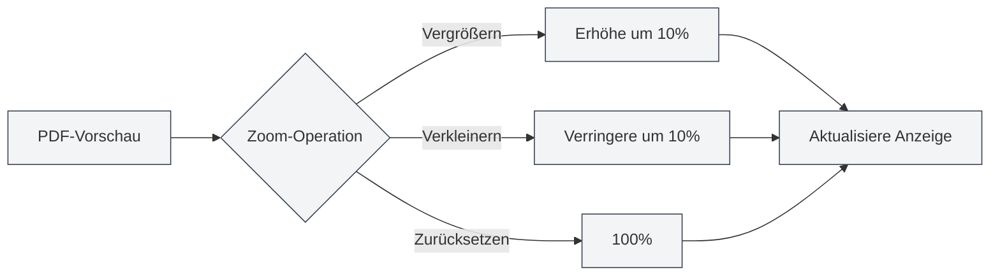

# PDF-Vorschaufunktion

## Übersicht

Die PDF-Vorschaufunktion ermöglicht es Ihnen, während der Bearbeitung von LaTeX-Dokumenten den kompilierten PDF-Effekt in Echtzeit zu betrachten. Das Vorschaufenster bietet umfangreiche Interaktionsfunktionen, einschließlich Zoom, Blättern, Positionierung usw., sodass Sie LaTeX-Dokumente effizient bearbeiten und debuggen können.

Die PDF-Vorschau wird automatisch nach erfolgreicher LaTeX-Kompilierung angezeigt und unterstützt die bidirektionale Positionierung mit dem Code-Editor, was einen schnellen Wechsel zwischen PDF und Code erleichtert.

<PdfPreviewPanel mode="demo" pdfUrl="" />

## Einführung in die PDF-Vorschau

### Vorschaufenster

Das PDF-Vorschaufenster wird rechts oder unterhalb des LaTeX-Editors angezeigt und enthält:

- **PDF-Inhaltsbereich**: Zeigt den Inhalt der PDF-Seiten an
- **Werkzeugleiste**: Bietet Bedienknöpfe für Zoom, Blättern, Aktualisieren usw.
- **Seiteninformationen**: Zeigt die aktuelle Seitenzahl und die Gesamtseitenzahl an

Die Benutzeroberfläche des PDF-Vorschaufensters sieht wie folgt aus:

<PdfPreviewPanel mode="demo" pdfUrl="" />

<LaTeXCompilerPanel mode="demo" />

### Automatische Anzeige

Die PDF-Vorschau wird automatisch in folgenden Fällen angezeigt:

- **Erfolgreiche Kompilierung**: Automatische Anzeige der PDF-Vorschau nach erfolgreicher LaTeX-Kompilierung
- **Dokument öffnen**: Automatische Anzeige der Vorschau beim Öffnen eines vorhandenen LaTeX-Dokuments mit PDF
- **Manuelles Öffnen**: Manuelles Öffnen der Vorschau durch Klicken auf die "Vorschau"-Schaltfläche in der Werkzeugleiste

<PdfPreviewPanel mode="demo" pdfUrl="" />

## PDF-Zoom

### PDF vergrößern

PDF-Vorschau vergrößern:

- **Werkzeugleistenschaltfläche**: Klicken Sie auf die "Vergrößern"-Schaltfläche (+ Symbol) in der Werkzeugleiste
- **Mausrad**: Halten Sie die `Strg`-Taste gedrückt und scrollen Sie mit dem Mausrad nach oben
- **Tastenkürzel**: `Strg+=` (falls konfiguriert)

Jede Vergrößerung erhöht den Zoomfaktor um 10%.

<LaTeXEditorDemo mode="demo" />

### PDF verkleinern

PDF-Vorschau verkleinern:

- **Werkzeugleistenschaltfläche**: Klicken Sie auf die "Verkleinern"-Schaltfläche (- Symbol) in der Werkzeugleiste
- **Mausrad**: Halten Sie die `Strg`-Taste gedrückt und scrollen Sie mit dem Mausrad nach unten
- **Tastenkürzel**: `Strg+-` (falls konfiguriert)

Jede Verkleinerung verringert den Zoomfaktor um 10%.

### Zoom zurücksetzen

PDF-Zoom auf 100% zurücksetzen:

- **Werkzeugleistenschaltfläche**: Klicken Sie auf die "Zoom zurücksetzen"-Schaltfläche in der Werkzeugleiste
- **Tastenkürzel**: `Strg+0` (falls konfiguriert)

### Zoombereich

Der unterstützte Bereich für den PDF-Zoom:

- **Mindestwert**: 20% (0,2-fach)
- **Höchstwert**: 500% (5-fach)
- **Standardwert**: 100% (1-fach)

Der Zoomfaktor wird automatisch auf den gültigen Bereich beschränkt.

<PdfPreviewPanel mode="demo" pdfUrl="" />

## PDF-Aktualisierung

### Manuelle Aktualisierung

PDF-Vorschau manuell aktualisieren:

- **Werkzeugleistenschaltfläche**: Klicken Sie auf die "Aktualisieren"-Schaltfläche in der Werkzeugleiste
- **Tastenkürzel**: `F5` (falls konfiguriert)

Die Aktualisierung lädt die PDF-Datei neu und zeigt die neuesten Kompilierungsergebnisse an.

### Automatische Aktualisierung

Die PDF-Vorschau wird in folgenden Fällen automatisch aktualisiert:

- **Erfolgreiche Kompilierung**: Automatische Aktualisierung der Vorschau nach erfolgreicher LaTeX-Kompilierung
- **PDF-Datei-Update**: Automatische Aktualisierung bei Erkennung einer Aktualisierung der PDF-Datei

### Aktualisierungszeitpunkt

Es wird empfohlen, die PDF-Vorschau in folgenden Fällen zu aktualisieren:

- **Nach Codeänderungen**: Nach Änderung des LaTeX-Codes und erneuter Kompilierung
- **Bei Vorschauanomalien**: Wenn die PDF-Vorschau Anomalien anzeigt oder der Inhalt nicht korrekt ist
- **Nach längerer Bearbeitung**: Wenn nach längerer Bearbeitung die neuesten Effekte betrachtet werden müssen

<LaTeXEditorDemo mode="demo" />

## PDF-Positionierung zum Code

### Von PDF zum Code positionieren

Durch Klicken auf eine Position in der PDF-Vorschau springt der Editor automatisch zur entsprechenden LaTeX-Codeposition:

1. **PDF-Position anklicken**: Klicken Sie in der PDF-Vorschau auf die zu betrachtende Position
2. **Automatischer Sprung**: Der Editor springt automatisch zum entsprechenden LaTeX-Code
3. **Hervorhebung**: Die entsprechende Codezeile wird hervorgehoben

Diese Funktion ermöglicht es Ihnen, schnell von der PDF-Darstellung zum Quellcode zu gelangen, was das Debuggen und Ändern erleichtert.

<PdfPreviewPanel mode="demo" pdfUrl="" />

### Von Code zu PDF positionieren

Im LaTeX-Editor können Sie:

1. **Code auswählen**: Wählen Sie den zu betrachtenden LaTeX-Code aus
2. **Kontextmenü**: Rechtsklick und Auswahl von "Zu PDF positionieren"
3. **Zur Vorschau springen**: Die PDF-Vorschau springt automatisch zur entsprechenden Position

### Bidirektionale Positionierung

Bidirektionale Positionierungsfunktion zwischen PDF und Code:

- **PDF → Code**: Klicken Sie auf eine PDF-Position, um zum Code zu springen
- **Code → PDF**: Wählen Sie Code aus, um zur PDF-Position zu springen
- **Synchrones Scrollen**: Unterstützt synchrones Scrollen von PDF und Code

<ConsoleTerminal mode="demo" consoleKey="demo" :history='[{"content": "PDF-Seitennavigation...", "type": "out"}]' />

## PDF-Seitennavigation

### Blätteroperationen

Die PDF-Vorschau unterstützt folgende Blätteroperationen:

- **Vorherige Seite**: Klicken Sie auf die "Vorherige Seite"-Schaltfläche in der Werkzeugleiste oder verwenden Sie die Pfeiltasten
- **Nächste Seite**: Klicken Sie auf die "Nächste Seite"-Schaltfläche in der Werkzeugleiste oder verwenden Sie die Pfeiltasten
- **Zu Seite springen**: Geben Sie die Seitenzahl in das Seitenzahl-Eingabefeld ein und drücken Sie die Eingabetaste

### Seiteninformationen

Die PDF-Vorschau zeigt folgende Seiteninformationen an:

- **Aktuelle Seitenzahl**: Zeigt die aktuell betrachtete Seitenzahl an
- **Gesamtseitenzahl**: Zeigt die Gesamtseitenzahl der PDF an
- **Seitenzahl-Eingabefeld**: Direkte Eingabe der Seitenzahl zum Springen

### Mehrseitenanzeige

Die PDF-Vorschau unterstützt den Mehrseitenanzeigemodus:

- **Einzelseitenmodus**: Zeigt jeweils eine Seite an
- **Mehrseitenmodus**: Zeigt mehrere Seiten gleichzeitig an (in der Hauptseitenvorschau)

Der Mehrseitenmodus eignet sich zum schnellen Durchblättern des gesamten Dokuments.

<PdfPreviewPanel mode="demo" pdfUrl="" />

## PDF-Speicherung

### PDF speichern

Aktuelle PDF-Datei speichern:

- **Werkzeugleistenschaltfläche**: Klicken Sie auf die "Speichern"-Schaltfläche in der Werkzeugleiste
- **Menü**: Klicken Sie auf "Datei" → "PDF speichern"
- **Tastenkürzel**: `Strg+S` (falls PDF das aktive Dokument ist)

Das Speichern der PDF speichert die PDF-Datei im selben Verzeichnis wie das Dokument.

### PDF-Verzeichnis öffnen

Das Verzeichnis öffnen, in dem sich die PDF-Datei befindet:

- **Werkzeugleistenschaltfläche**: Klicken Sie auf die "Verzeichnis öffnen"-Schaltfläche in der Werkzeugleiste
- **Menü**: Klicken Sie auf "Datei" → "PDF-Verzeichnis öffnen"

Nach dem Öffnen des Verzeichnisses können Sie die PDF-Datei im Dateimanager anzeigen und verwalten.

<LaTeXEditorDemo mode="demo" />

## PDF-Interaktionsmodus

### Zeigermodus

Der Zeigermodus ist der standardmäßige Interaktionsmodus:

- **Text auswählen**: Kann Text in der PDF auswählen
- **Text kopieren**: Kann ausgewählten Text kopieren
- **Klickpositionierung**: Durch Klicken auf eine PDF-Position kann zum Code positioniert werden

### Handmodus

Der Handmodus wird zum Ziehen der PDF verwendet:

- **PDF ziehen**: Halten Sie die linke Maustaste gedrückt, um den PDF-Inhalt zu ziehen
- **Ansicht verschieben**: Verschiebt die Position der PDF-Ansicht
- **Geeignet für große PDFs**: Geeignet zum Betrachten von PDFs mit großen Abmessungen

Modus wechseln:

- **Werkzeugleistenschaltfläche**: Klicken Sie auf die Modus-Umschaltfläche in der Werkzeugleiste
- **Tastenkürzel**: `H`-Taste zum Umschalten in den Handmodus

## Verwendungstipps

### Effiziente Vorschau

1. **Zoom verwenden**: Passen Sie den geeigneten Zoomfaktor entsprechend dem Inhalt an
2. **Positionierung verwenden**: Verwenden Sie die Positionierungsfunktion für schnelles Wechseln zwischen Code und PDF
3. **Aktualisierung verwenden**: Aktualisieren Sie nach Codeänderungen rechtzeitig, um den Effekt zu betrachten

### Debugging-Tipps

1. **Fehler positionieren**: Von der PDF zum Code positionieren, um Problemstellen schnell zu finden
2. **Effekte vergleichen**: Vergleichen Sie PDF-Effekte und Code, um die Formatierung zu überprüfen
3. **Mehrseitiges Durchsuchen**: Verwenden Sie den Mehrseitenmodus zum schnellen Durchblättern des gesamten Dokuments

### Leistungsoptimierung

1. **Angemessener Zoom**: Verwenden Sie keine zu großen Zoomfaktoren
2. **Vorschau schließen**: Schließen Sie das Vorschaufenster, wenn nicht benötigt, um Ressourcen zu sparen
3. **Aktualisierungsstrategie**: Wählen Sie je nach Bedarf automatische oder manuelle Aktualisierung

## Häufig gestellte Fragen

### F: PDF-Vorschau wird nicht angezeigt?

A: Stellen Sie sicher, dass das LaTeX-Dokument erfolgreich kompiliert wurde. Bei Kompilierungsfehlern wird die PDF-Vorschau nicht angezeigt. Überprüfen Sie die Fehlermeldungen in der Konsolenausgabe.

### F: PDF-Vorschau aktualisiert sich nicht?

A: Klicken Sie auf die "Aktualisieren"-Schaltfläche, um die Vorschau manuell zu aktualisieren, oder kompilieren Sie das LaTeX-Dokument erneut. Stellen Sie sicher, dass die PDF-Datei erfolgreich generiert wurde.

### F: Wie positioniere ich von PDF zum Code?

A: Klicken Sie in der PDF-Vorschau auf die zu betrachtende Position, der Editor springt automatisch zum entsprechenden LaTeX-Code.

### F: Wie positioniere ich von Code zu PDF?

A: Wählen Sie den LaTeX-Code aus, klicken Sie mit der rechten Maustaste und wählen Sie "Zu PDF positionieren", die PDF-Vorschau springt automatisch zur entsprechenden Position.

### F: PDF-Zoom funktioniert nicht?

A: Stellen Sie sicher, dass das PDF-Vorschaufenster vollständig geladen ist. Falls das Problem weiterhin besteht, versuchen Sie, die PDF-Vorschau zu aktualisieren.

## Verwandte Dokumentation

- [[latex.compilation|LaTeX-Kompilierung und -Vorschau]]
- [[latex.editor|LaTeX-Editor-Benutzerhandbuch]]
- [[latex.console|Konsolenausgabe]]

<LaTeXCompilerPanel mode="demo" />

<LaTeXEditorDemo mode="demo" />

<ConsoleTerminal mode="demo" consoleKey="demo" :history='[{"content": "Kompilierungsprotokoll...", "type": "out"}]' />
