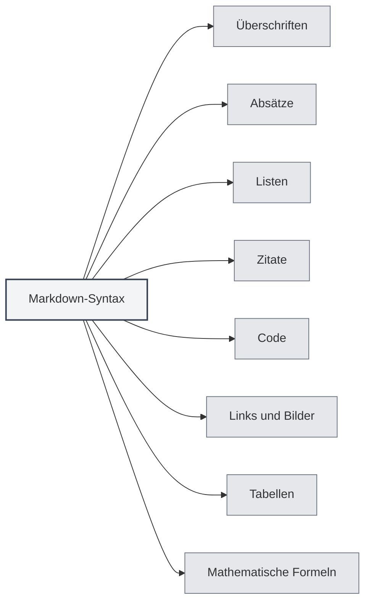

# Markdown-Syntax

## Übersicht

Markdown ist eine leichtgewichtige Auszeichnungssprache, die es Ihnen ermöglicht, Dokumente in einem einfach lesbaren und schreibbaren Klartextformat zu verfassen. MetaDoc bietet umfassende Unterstützung für die Bearbeitung und Vorschau von Markdown.

<ViewMenuItemsDemo mode="demo" :items='["outline", "preview"]' />

## Grundlegende Syntax

### Überschriften

Verwenden Sie das `#`-Symbol, um Überschriften zu erstellen. Die Anzahl der `#` gibt die Überschriftenebene an:

```markdown
# Überschrift Ebene 1

## Überschrift Ebene 2

### Überschrift Ebene 3
```



### Absätze

Trennen Sie Absätze durch eine Leerzeile.

### Listen

**Ungeordnete Listen** verwenden `-`, `*` oder `+`:

```markdown
- Punkt 1
- Punkt 2
- Punkt 3
```

**Geordnete Listen** verwenden Zahlen:

```markdown
1. Erster Punkt
2. Zweiter Punkt
3. Dritter Punkt
```

### Zitate

Verwenden Sie `>`, um ein Zitat zu erstellen:

```markdown
> Dies ist ein Zitattext
```

### Code

**Inline-Code** wird mit Backticks gekennzeichnet:

```markdown
Verwenden Sie `console.log()`, um Inhalte auszugeben
```

**Codeblöcke** verwenden drei Backticks:

````markdown
```javascript
function hello() {
  console.log('Hello, World!')
}
```
````

### Links und Bilder

**Links**:

```markdown
[Linktext](https://example.com)
```

**Bilder**:

```markdown

```

### Tabellen

```markdown
| Spalte 1 | Spalte 2 | Spalte 3 |
| -------- | -------- | -------- |
| Daten 1  | Daten 2  | Daten 3  |
```

## Mathematische Formeln

### Inline-Formeln

Verwenden Sie `$` als Begrenzer:

```markdown
Dies ist eine Inline-Formel: $E = mc^2$
```

### Block-Formeln

Verwenden Sie `$$` als Begrenzer:

```markdown
$$
\int_{-\infty}^{\infty} e^{-x^2} dx = \sqrt{\pi}
$$
```

## Erweiterte Funktionen

### LaTeX-Formelkonvertierung

MetaDoc unterstützt die Konvertierung mathematischer Formeln in Markdown in das LaTeX-Format. Weitere Details finden Sie unter [[latex.basics|LaTeX-Syntax]].

### Diagramm-Unterstützung

MetaDoc unterstützt verschiedene Diagrammformate:

- [[charts.mermaid|Mermaid-Diagramme]]
- [[charts.plantuml|PlantUML-Diagramme]]
- [[charts.echarts|ECharts-Diagramme]]

## Verwandte Dokumentation

- [[markdown.editor|Markdown-Editor Benutzerhandbuch]]
- [[markdown.advanced|Erweiterte Markdown-Funktionen]]
- [[markdown.features|Markdown-Editor-Funktionen]]
- [[core.editor-basics|Grundlegende Editor-Bedienung]]

<LaTeXEditorDemo mode="demo" />

<Outline mode="demo" />

<ViewMenuItemsDemo mode="demo" :items='["outline"]' />

<MenuItemsDemo mode="demo" :items='[{"id": "file", "items": ["new", "open", "save"]}]' />

<TitleMenu mode="demo" title="Markdown-Dokumentbeispiel" path="1" :tree='{}' />

<ViewMenuItemsDemo mode="demo" :items='["editor", "preview"]' />