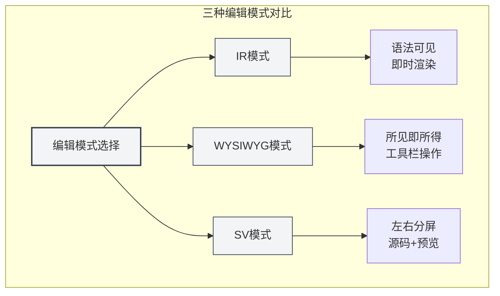
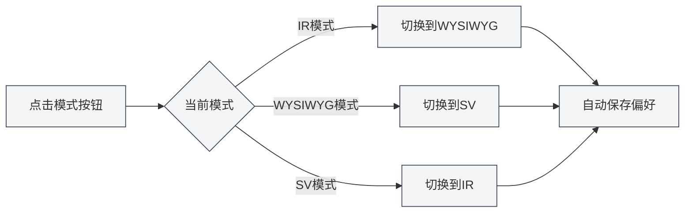
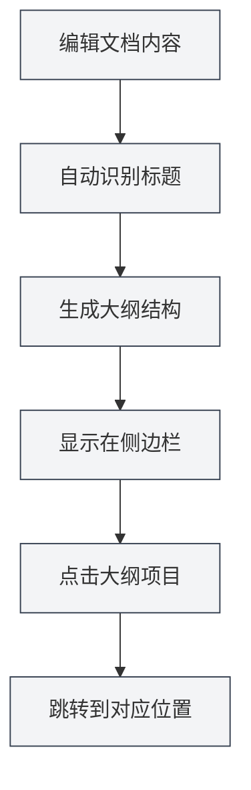
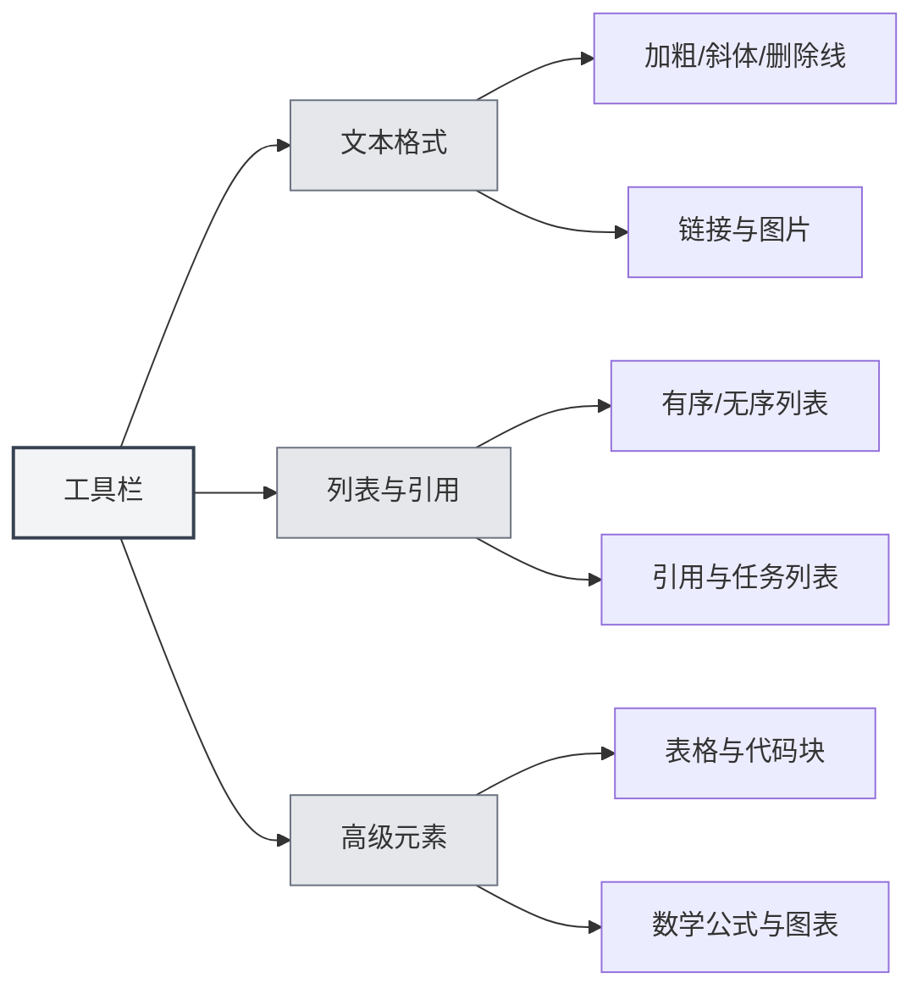

# Markdown-Editor Benutzerhandbuch

## Übersicht

Der Markdown-Editor von MetaDoc bietet Ihnen eine professionelle und elegante Schreibumgebung. Es ist nicht nur ein einfaches Texteingabefeld, sondern ein tief optimierter Kreativraum – er unterstützt drei flexible Bearbeitungsmodi, eine Echtzeit-Vorschau und umfangreiche Formatierungswerkzeuge, sodass Sie sich auf den Inhalt konzentrieren können, ohne sich um das Format kümmern zu müssen.

Egal, ob Sie einen technischen Blog schreiben, Lernnotizen erstellen oder Projektdokumentationen verfassen, dieser Editor erfüllt Ihre Anforderungen. Besonders die tief integrierte KI-Fähigkeit kann während des Schreibens intelligente Vervollständigungen und Vorschläge liefern, um den kreativen Prozess flüssiger zu gestalten.

<TitleMenu mode="demo" title="Markdown编辑器示例" path="1" :tree='{}' />

<SectionOptimizer mode="demo" title="段落优化示例" path="1" :tree='{}' language="markdown" :adapter='null' />


## Drei Bearbeitungsmodi

MetaDoc versteht, dass verschiedene Nutzer unterschiedliche Bearbeitungsgewohnheiten haben, und bietet daher drei Modi zur Auswahl:

### IR-Modus (Instant Rendering)

Dies ist der Standard-Bearbeitungsmodus und die bevorzugte Wahl für die meisten Markdown-Nutzer. In diesem Modus:

-   **Sofortiges Feedback**: Während Sie die Markdown-Syntax eingeben, wird der Inhalt sofort formatiert angezeigt.
-   **Sichtbare Syntax**: Die Markdown-Symbole (wie `#`, ` **`) bleiben sichtbar, was eine präzise Formatierungskontrolle ermöglicht.
-   **Flüssiges Bearbeiten**: Schnelles Rendering, selbst bei langen Dokumenten ohne Verzögerungen.
-   **Lernfreundlich**: Für Nutzer, die Markdown-Syntax lernen, ist die direkte Beziehung zwischen Syntax und Effekt sofort erkennbar.

**Anwendungsfälle**:

-   Nutzer, die mit Markdown-Syntax vertraut sind.
-   Szenarien, die eine präzise Kontrolle über das Dokumentformat erfordern.
-   Bearbeitung längerer technischer Dokumente oder Blogbeiträge.

### WYSIWYG-Modus (What You See Is What You Get)

Wenn Sie eine Word-ähnliche Bearbeitungserfahrung bevorzugen, fühlen Sie sich in diesem Modus wohl:

-   **Direktes Bearbeiten**: Was Sie sehen, ist das Endergebnis; Sie können direkt klicken und bearbeiten.
-   **Keine Syntax auswendig lernen**: Fettdruck, Überschriften, Listen usw. werden über Symbolleistenschaltflächen ausgeführt.
-   **Intuitive Bedienung**: Markieren Sie Text und klicken Sie auf eine Schaltfläche, um die Formatierung anzuwenden.
-   **Geringere Einstiegshürde**: Auch Nutzer, die mit Markdown-Syntax nicht vertraut sind, können schnell einsteigen.

**Anwendungsfälle**:

-   Nutzer, die zum ersten Mal mit Markdown in Berührung kommen.
-   Szenarien, die schnelles Formatieren erfordern, ohne auf die zugrunde liegende Syntax zu achten.
-   Nutzer, die visuelle Bearbeitung bevorzugen.

### SV-Modus (Split View)

Dieser Modus teilt den Bearbeitungsbereich in zwei Hälften:

-   **Gegenüberstellung links/rechts**: Links wird der Markdown-Quellcode angezeigt, rechts das gerenderte Ergebnis.
-   **Echtzeit-Synchronisierung**: Während Sie links bearbeiten, wird die Vorschau rechts sofort aktualisiert.
-   **Hilfreiches Lernwerkzeug**: Sie können Syntax und Endergebnis gleichzeitig sehen, um Ihr Markdown-Verständnis zu vertiefen.
-   **Präzises Korrekturlesen**: Einfache Überprüfung, ob komplexe Formate (wie Tabellen, verschachtelte Listen) korrekt sind.

**Anwendungsfälle**:

-   Nutzer, die Markdown-Syntax lernen.
-   Szenarien, die das gleichzeitige Betrachten von Quellcode und Ergebnis zum Korrekturlesen erfordern.
-   Bearbeitung von Dokumenten mit komplexen Formaten.



### Wie man den Modus wechselt

Das Wechseln des Bearbeitungsmodus ist sehr einfach:

1.  **Symbolleistenschaltfläche**: Finden Sie die Modus-Umschaltfläche in der Symbolleiste oben im Editor.
2.  **Zyklisches Wechseln**: Ein Klick auf die Schaltfläche wechselt zyklisch zwischen den drei Modi.
3.  **Präferenzspeicherung**: Das System merkt sich den zuletzt verwendeten Modus und stellt ihn beim nächsten Öffnen des Dokuments automatisch wieder her.



## Echtzeit-Vorschau

Die Echtzeit-Vorschaufunktion von MetaDoc macht das Schreiben zum Vergnügen:

-   **Automatisches Rendering**: Während Sie links Inhalt eingeben, wird das gerenderte Ergebnis sofort rechts (oder unten) angezeigt.
-   **Vollständige Unterstützung**: Von grundlegenden Überschriften und Listen bis hin zu komplexen mathematischen Formeln und Diagrammen – alles wird korrekt gerendert.
-   **Code-Hervorhebung**: Codeblöcke erhalten automatisch eine Syntaxhervorhebung basierend auf der Sprache, was den Code besser lesbar macht.
-   **Mathematische Formeln**: Unterstützt mathematische Formeln in LaTeX-Syntax, sowohl Inline-Formeln `$E=mc^2$` als auch eigenständige Formelblöcke werden perfekt angezeigt.
-   **Bildanpassung**: Eingefügte Bilder passen sich automatisch an die Editorbreite an; ein Klick ermöglicht die Vergrößerung.

## Gliederungssynchronisierung

Die Navigation in langen Dokumenten war noch nie so einfach:

-   **Automatische Extraktion**: Der Editor erkennt automatisch Überschriften im Dokument und erzeugt eine hierarchische Gliederung.
-   **Echtzeit-Aktualisierung**: Wenn Sie Überschriften hinzufügen, ändern oder löschen, wird die Gliederung synchron aktualisiert.
-   **Direktsprung**: Ein Klick auf eine beliebige Überschrift in der Gliederung springt sofort zur entsprechenden Position im Editor.
-   **Strukturvorschau**: Die Gliederung bietet einen schnellen Überblick über die gesamte Dokumentstruktur.

Sie können die Gliederungsansicht über die Seitenleiste aufrufen:

<ViewMenuItemsDemo mode="demo" :items='["editor", "outline"]' />



Eine detaillierte Einführung in die Gliederungsfunktion finden Sie unter [[outline.basics|大纲视图功能]].

## Symbolleistenfunktionen

Die Symbolleiste oben im Editor bündelt die am häufigsten verwendeten Formatierungsfunktionen:



### Textformatierung

-   **Fett** (`Strg+B`): Macht wichtige Inhalte auffälliger.
-   **Kursiv** (`Strg+I`): Wird zur Betonung oder für spezielle Bedeutungen verwendet.
-   **Durchgestrichen**: Zeigt veraltete oder geänderte Inhalte an.
-   **Inline-Code**: Markiert Code-Snippets oder Fachbegriffe.
-   **Link** (`Strg+K`): Fügt einen klickbaren Hyperlink ein.
-   **Bild**: Fügt lokale oder Web-Bilder ein.

### Listen und Zitate

-   **Ungeordnete Liste**: Listet Inhalte mit Aufzählungszeichen auf.
-   **Geordnete Liste**: Listet Inhalte mit Nummerierung auf.
-   **Zitatblock**: Zitiert Aussagen anderer oder wichtige Hinweise.
-   **Aufgabenliste**: To-Do-Liste mit Kontrollkästchen.

### Erweiterte Elemente

-   **Tabelle**: Erstellt strukturierte Datentabellen, unterstützt Ausrichtung und Verschachtelung.
-   **Codeblock**: Fügt mehrzeiligen Code ein, unterstützt Syntaxhervorhebung für Dutzende Programmiersprachen.
-   **Mathematische Formel**: Fügt mathematische Formeln mit LaTeX-Syntax ein.
-   **Diagramm**: Fügt Diagramme wie Mermaid, PlantUML, ECharts usw. ein.

## Tastenkürzel

Die Beherrschung von Tastenkürzeln kann die Schreibeffizienz erheblich steigern:

### Formatierungs-Tastenkürzel

| Aktion         | Windows/Linux | macOS         |
| -------------- | ------------- | ------------- |
| Fett           | `Strg+B`      | `Cmd+B`       |
| Kursiv         | `Strg+I`      | `Cmd+I`       |
| Link einfügen  | `Strg+K`      | `Cmd+K`       |
| Code einfügen  | `Strg+Umsch+K`| `Cmd+Umsch+K` |

### Bearbeitungs-Tastenkürzel

| Aktion | Windows/Linux | macOS         |
| ------ | ------------- | ------------- |
| Rückgängig | `Strg+Z`  | `Cmd+Z`       |
| Wiederholen | `Strg+Y`  | `Cmd+Umsch+Z` |
| Alles auswählen | `Strg+A`| `Cmd+A`       |
| Suchen     | `Strg+F`  | `Cmd+F`       |

## Anwendungstipps

### Schnelleingabe

1.  **Schnelle Überschrifterstellung**: Geben Sie `#` gefolgt von Leertaste ein, um automatisch das Überschriftenformat zu erhalten.
2.  **Schnelle Listerstellung**: Geben Sie `-` oder `*` gefolgt von Leertaste ein, um automatisch einen Listeneintrag zu erstellen.
3.  **Schnelles Einfügen eines Codeblocks**: Geben Sie drei Backticks ` ``` ` gefolgt von Enter ein.
4.  **Schnelles Einfügen einer Trennlinie**: Geben Sie drei Bindestriche `---` gefolgt von Enter ein.

### Formatierungstipps

1.  **Formatieren nach Textauswahl**: Wählen Sie zuerst den Text aus, dann klicken Sie auf die Symbolleistenschaltfläche oder verwenden Sie das Tastenkürzel.
2.  **Massenersetzung**: Verwenden Sie die Suchen-und-Ersetzen-Funktion (`Strg+H`), um Formate stapelweise zu ändern.
3.  **Code-Hervorhebung**: Geben Sie die Sprache in der ersten Zeile des Codeblocks an, z.B. ````python`.

### Vorschautechniken

1.  **Vorschau durch Moduswechsel**: Im SV-Modus können Sie Quellcode und Effekt gleichzeitig sehen.
2.  **Vorschau mathematischer Formeln**: Geben Sie Formeln in `$` ein, um den Rendering-Effekt in Echtzeit zu sehen.
3.  **Echtzeit-Rendering von Diagrammen**: Mermaid-Diagramme werden automatisch nach Abschluss der Bearbeitung gerendert.

## Häufig gestellte Fragen

### F: Wie füge ich Bilder ein?

A: Es gibt drei Möglichkeiten:

1.  Klicken Sie auf die Bildschaltfläche in der Symbolleiste.
2.  Verwenden Sie das Tastenkürzel `Strg+Umsch+I`.
3.  Fügen Sie das Bild direkt aus der Zwischenablage ein.

Bilder können im lokalen Dokumentverzeichnis gespeichert oder auf einen Image-Hosting-Dienst hochgeladen werden.

### F: Wie erstelle ich eine Tabelle?

A: Es wird empfohlen, die Tabellenschaltfläche in der Symbolleiste zu verwenden, um Tabellen visuell zu erstellen. Sie können auch die Markdown-Tabellensyntax manuell eingeben:

```markdown
| Spalte1 | Spalte2 | Spalte3 |
| ------- | ------- | ------- |
| Inhalt  | Inhalt  | Inhalt  |
```

### F: Was tun, wenn mathematische Formeln nicht angezeigt werden?

A: Überprüfen Sie, ob die Syntax korrekt ist:

-   Inline-Formel: Mit einem einzelnen `$` umschließen, z.B. `$E=mc^2$`.
-   Eigenständige Formel: Mit zwei `$$` umschließen, alleinstehende Zeile.

### F: Wie kann ich die Dokumentgliederung anzeigen?

A: Klicken Sie auf das "Gliederung"-Symbol in der Seitenleiste oder schalten Sie mit einem Tastenkürzel zur Gliederungsansicht um. Überschriften im Dokument werden automatisch zur Gliederung extrahiert.

### F: Geht der Inhalt verloren, wenn ich den Bearbeitungsmodus wechsle?

A: Nein. Alle drei Modi teilen sich denselben Dokumentinhalt. Der Moduswechsel ändert nur die Anzeige- und Bearbeitungsweise, der Inhalt bleibt vollständig erhalten.

## Verwandte Dokumentation

-   [[markdown.basics|Markdown-Syntax]] - Grundlagen der Markdown-Syntax lernen
-   [[markdown.features|Markdown-Editor-Funktionen]] - Weitere erweiterte Funktionen kennenlernen
-   [[core.editor-basics|Editor-Grundlagen]] - Allgemeine Bearbeitungstechniken
-   [[core.editor-settings|Editor-Einstellungen]] - Persönliche Konfiguration
-   [[outline.basics|Gliederungsansicht-Funktion]] - Tiefere Einblicke in die Gliederungsfunktion

<LaTeXEditorDemo mode="demo" />

<Outline mode="demo" />

<MenuItemsDemo mode="demo" :items='[{"id": "file", "items": ["new", "open", "save"]}]' />

<TitleMenu mode="demo" title="Markdown编辑器示例" path="1" :tree='{}' />

<SectionOptimizer mode="demo" title="段落优化示例" path="1" :tree='{}' language="markdown" :adapter='null' />
