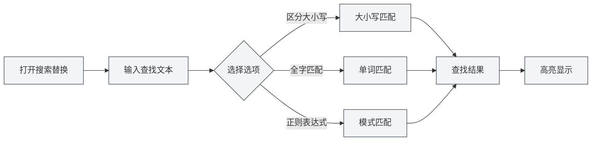
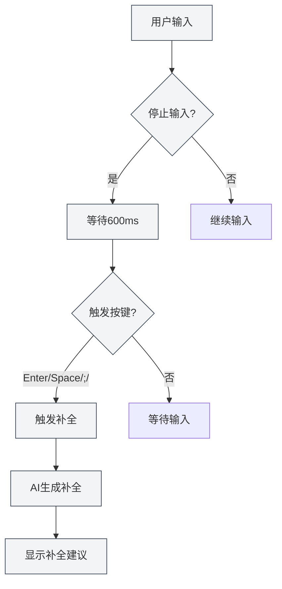

# Markdown-Editor-Funktionen

## Übersicht

Der Markdown-Editor bietet umfangreiche Funktionen, darunter Suchen und Ersetzen, Kontextmenü, KI-Autovervollständigung, Wissensdatenbank-Integration und mehr. Diese Funktionen können Ihre Bearbeitungseffizienz und Dokumentqualität erheblich steigern.

Dieses Dokument stellt die verschiedenen Funktionen des Markdown-Editors und deren Verwendung vor.

## Suchen und Ersetzen

### Suchen und Ersetzen öffnen

Es gibt mehrere Möglichkeiten, die Funktion "Suchen und Ersetzen" zu öffnen:

- **Tastenkombination**: `Strg+F` zum Öffnen der Suche, `Strg+H` zum Öffnen von Suchen und Ersetzen
- **Menü**: Klicken Sie auf "Bearbeiten" → "Suchen" oder "Suchen und Ersetzen"
- **Symbolleiste**: Klicken Sie auf das Suchsymbol in der Symbolleiste

Über das Dateimenü in der oberen Menüleiste können Sie auf Dateioperationen zugreifen, über das Bearbeiten-Menü auf Bearbeitungsfunktionen:

<MenuItemsDemo mode="demo" :items='[{"id": "file", "items": ["new", "open", "save"]}]' />

### Suchfunktion

Die Suchfunktion unterstützt folgende Optionen:

- **Groß-/Kleinschreibung beachten**: Nur Texte mit exakt übereinstimmender Groß-/Kleinschreibung werden gefunden.
- **Ganzes Wort suchen**: Nur vollständige Wörter werden gefunden (keine Wortteile).
- **Regulärer Ausdruck**: Verwendung regulärer Ausdrücke für Musterabgleich.
- **Groß-/Kleinschreibung beibehalten**: Beim Ersetzen wird die Groß-/Kleinschreibung des Originaltextes beibehalten.

Die Benutzeroberfläche des Such- und Ersetzen-Menüs sieht wie folgt aus:

<SearchReplaceMenu mode="demo" :adapter='null' />

### Ersetzungsfunktion

Die Ersetzungsfunktion unterstützt:

- **Einzeln ersetzen**: Gefundene Texte einzeln ersetzen.
- **Alle ersetzen**: Alle gefundenen Texte auf einmal ersetzen.
- **Vorschau**: Vor dem Ersetzen das Ergebnis in einer Vorschau anzeigen.

### Trefferliste

Das Such- und Ersetzen-Panel zeigt eine Trefferliste an:

- **Position anzeigen**: Zeigt Zeilen- und Spaltennummer jedes Treffers an.
- **Kontextvorschau**: Zeigt den Kontext des Treffers an.
- **Schneller Sprung**: Klicken Sie auf einen Treffer, um direkt zur entsprechenden Position zu springen.

### Verwendungstipps

1. **Reguläre Ausdrücke**: Mit regulären Ausdrücken können komplexe Such- und Ersetzungsmuster realisiert werden.
2. **Stapelersetzung**: Verwenden Sie "Alle ersetzen", um Dokumente schnell stapelweise zu ändern.
3. **Format beibehalten**: Die Option "Groß-/Kleinschreibung beibehalten" bewahrt die ursprüngliche Groß-/Kleinschreibung.

## Kontextmenü (Rechtsklick)

### Grundlegende Bearbeitungsoperationen

Das Kontextmenü bietet folgende grundlegende Bearbeitungsoperationen:

- **Ausschneiden**: `Strg+X` oder Rechtsklick und "Ausschneiden" wählen.
- **Kopieren**: `Strg+C` oder Rechtsklick und "Kopieren" wählen.
- **Einfügen**: `Strg+V` oder Rechtsklick und "Einfügen" wählen.
- **Alles auswählen**: `Strg+A` oder Rechtsklick und "Alles auswählen" wählen.

### KI-Funktionen

Das Kontextmenü bietet folgende KI-Funktionen:

- **KI-Analyse**: Analysiert den aktuellen Dokumentinhalt und öffnet das KI-Dialogfenster.
- **Absatz optimieren**: Optimiert den Inhalt des aktuellen Absatzes.
- **Diagramm einfügen**: Lässt die KI Diagrammcode generieren und in das Dokument einfügen.

### Funktionsschalter

Das Kontextmenü ermöglicht das schnelle Ein- und Ausschalten folgender Funktionen:

- **KI-Autovervollständigung**: KI-Autovervollständigungsfunktion aktivieren/deaktivieren.
- **Wissensdatenbank-Integration**: Wissensdatenbank-Integrationsfunktion aktivieren/deaktivieren.

### Manuelle Vervollständigung auslösen

Das Kontextmenü bietet die Option "Manuelle Vervollständigung auslösen":

- **Tastenkombination**: `Umschalt+Tab`
- **Kontextmenü**: Rechtsklick und "Manuelle Vervollständigung auslösen" wählen.

Die manuelle Auslösung startet die KI-Vervollständigung sofort, ohne auf die automatische Auslösung zu warten.

## KI-Autovervollständigung

### Aktivieren/Deaktivieren

Die KI-Autovervollständigungsfunktion kann an folgenden Stellen aktiviert oder deaktiviert werden:

- **Kontextmenü**: Rechtsklick und "KI-Autovervollständigung aktivieren/deaktivieren" wählen.
- **Einstellungsseite**: KI-Autovervollständigungsoptionen in den Einstellungen konfigurieren.

### Automatische Auslösung

Die KI-Autovervollständigung wird automatisch in folgenden Situationen ausgelöst:

- **Eingabe stoppt**: Wird automatisch ausgelöst, 600 ms nachdem die Eingabe stoppt.
- **Auslösetasten**: Wird nach Eingabe bestimmter Tasten ausgelöst (Eingabe, Leertaste, `;`, `,`).

### Manuelle Auslösung

Möglichkeiten zur manuellen Auslösung der Vervollständigung:

- **Tastenkombination**: `Umschalt+Tab`
- **Kontextmenü**: Rechtsklick und "Manuelle Vervollständigung auslösen" wählen.

Die manuelle Auslösung startet die Vervollständigung sofort und überspringt die Verzögerung der automatischen Auslösung.

### Vervollständigungsmodi

Die KI-Autovervollständigung unterstützt zwei Modi:

- **Vollständige Generierung**: Generiert vollständigen Vervollständigungsinhalt.
- **Teilweise Generierung**: Generiert nur teilweisen Inhalt (je nach Einstellung).

Der Vervollständigungsmodus kann in den Einstellungen konfiguriert werden.

### Auslösetasten-Einstellung

Die Tasten zur Auslösung der Vervollständigung können in den Einstellungen konfiguriert werden:

- **Eingabe**: Auslösung durch die Eingabetaste.
- **Leertaste**: Auslösung durch die Leertaste.
- **;**: Auslösung durch das Semikolon.
- **,**: Auslösung durch das Komma.

Mehrere Auslösetasten können gleichzeitig aktiviert werden.

### Maximale Token-Anzahl für Vervollständigung

Die maximale Token-Anzahl für die Vervollständigung kann in den Einstellungen konfiguriert werden:

- **Mindestwert**: 20 Token
- **Höchstwert**: Unbegrenzt (0 bedeutet unbegrenzt)
- **Standardwert**: 50 Token

Je höher die Token-Anzahl, desto mehr Inhalt wird vervollständigt, aber die Generierungszeit wird auch länger.

### Vervollständigung annehmen

Nachdem Vervollständigungsvorschläge angezeigt werden, können Sie:

- **Tab-Taste**: Vervollständigungsvorschlag annehmen.
- **Esc-Taste**: Vervollständigungsvorschlag abbrechen.
- **Weitertippen**: Vervollständigung abbrechen und weitertippen.

<TitleMenu mode="demo" title="Markdown编辑器示例" path="1" :tree='{}' />

<SectionOptimizer mode="demo" title="段落优化示例" path="1" :tree='{}' language="markdown" :adapter='null' />

<QuickStartMarkdown mode="demo" />

<ViewMenuItemsDemo mode="demo" :items='["editor", "outline", "agent"]' />

## Wissensdatenbank-Integration

### Aktivieren/Deaktivieren

Die Wissensdatenbank-Integrationsfunktion kann an folgenden Stellen aktiviert oder deaktiviert werden:

- **Kontextmenü**: Rechtsklick und "Wissensdatenbank aktivieren/deaktivieren" wählen.
- **Einstellungsseite**: Wissensdatenbankoptionen in den Einstellungen konfigurieren.

### Kontextabfrage

Nach Aktivierung der Wissensdatenbank-Integration ruft die KI-Funktion automatisch relevante Inhalte aus der Wissensdatenbank ab:

- **KI-Vervollständigung**: Bezieht bei der Vervollständigung relevante Inhalte aus der Wissensdatenbank mit ein.
- **KI-Analyse**: Verwendet bei der Dokumentenanalyse Wissen aus der Wissensdatenbank.
- **Absatzoptimierung**: Bezieht bei der Absatzoptimierung Inhalte aus der Wissensdatenbank mit ein.

### Abfrageprinzip

Die Wissensdatenbankabfrage verwendet Vektorsuchtechnologie:

- **Semantische Übereinstimmung**: Findet relevante Inhalte basierend auf semantischer Ähnlichkeit.
- **Schlüsselwortübereinstimmung**: Verwendet gleichzeitig Schlüsselwortabgleich zur Erhöhung der Genauigkeit.
- **Hybridsuche**: Kombiniert Vektorsuche und Schlüsselwortabgleich.

### Konfidenzschwelle

Die Wissensdatenbankabfrage unterstützt die Einstellung einer Konfidenzschwelle:

- **Schwellenwertbereich**: 0.0 - 1.0
- **Standardwert**: 0.5
- **Funktion**: Gibt nur Inhalte mit einer Ähnlichkeit über dem Schwellenwert zurück.

Die Konfidenzschwelle kann in den Einstellungen konfiguriert werden, siehe [[knowledge-base.config|Wissensdatenbank-Konfiguration]].

## Kombinierte Funktionsnutzung

### Suchen und Ersetzen + KI-Vervollständigung

Kombinierte Nutzung von Suchen und Ersetzen mit KI-Vervollständigung:

1. Verwenden Sie Suchen und Ersetzen, um zu ändernde Inhalte zu finden.
2. Verwenden Sie KI-Vervollständigung, um neuen Inhalt zu generieren.
3. Verwenden Sie die Ersetzungsfunktion für stapelweise Aktualisierungen.

### Kontextmenü + Wissensdatenbank

Kombinierte Nutzung von Kontextmenü und Wissensdatenbank:

1. Aktivieren Sie die Wissensdatenbank-Integration.
2. Verwenden Sie die KI-Funktionen im Kontextmenü.
3. Die KI-Funktionen verwenden automatisch Inhalte aus der Wissensdatenbank.

### KI-Analyse + Absatzoptimierung

Kombinierte Nutzung von KI-Analyse und Absatzoptimierung:

1. Verwenden Sie KI-Analyse, um den Dokumentinhalt zu verstehen.
2. Verwenden Sie Absatzoptimierung, um bestimmte Absätze zu verbessern.
3. Optimieren Sie basierend auf den Vorschlägen der KI-Analyse.

## Verwendungstipps

### Vervollständigungsqualität verbessern

1. **Wissensdatenbank aktivieren**: Aktivieren der Wissensdatenbank-Integration kann die Vervollständigungsqualität erhöhen.
2. **Token-Anzahl anpassen**: Passen Sie die maximale Token-Anzahl für die Vervollständigung an Ihre Bedürfnisse an.
3. **Manuelle Auslösung**: Verwenden Sie bei Bedarf die manuelle Auslösung für bessere Vervollständigungsergebnisse.

### Effizientes Suchen und Ersetzen

1. **Reguläre Ausdrücke verwenden**: Verwenden Sie für komplexe Muster reguläre Ausdrücke.
2. **Ersetzungsvorschau**: Vorschau des Ersetzungsergebnisses vor dem Ersetzen.
3. **Stapeloperationen**: Verwenden Sie "Alle ersetzen" für schnelle stapelweise Änderungen.

### Wissensdatenbanknutzung

1. **Relevante Dokumente hinzufügen**: Fügen Sie relevante Dokumente zur Wissensdatenbank hinzu.
2. **Konfidenz anpassen**: Passen Sie die Konfidenzschwelle an Ihre Bedürfnisse an.
3. **Regelmäßig aktualisieren**: Aktualisieren Sie den Wissensdatenbankinhalt regelmäßig.

## Häufig gestellte Fragen (FAQ)

### F: KI-Vervollständigung wird nicht angezeigt?

A: Prüfen Sie, ob die KI-Autovervollständigung aktiviert ist, und stellen Sie sicher, dass die LLM-Konfiguration korrekt ist. Versuchen Sie, die Vervollständigung manuell auszulösen (`Umschalt+Tab`).

### F: Suchen und Ersetzen findet keinen Inhalt?

A: Prüfen Sie, ob die Optionen "Groß-/Kleinschreibung beachten" oder "Ganzes Wort suchen" aktiviert sind. Wenn Sie reguläre Ausdrücke verwenden, prüfen Sie, ob der Ausdruck korrekt ist.

### F: Wissensdatenbank-Integration funktioniert nicht?

A: Prüfen Sie, ob die Wissensdatenbank aktiviert ist, und stellen Sie sicher, dass sich relevante Dokumente in der Wissensdatenbank befinden. Das Anpassen der Konfidenzschwelle kann helfen, mehr Inhalte zu finden.

### F: Wie schalte ich die KI-Vervollständigung aus?

A: Wählen Sie im Kontextmenü "KI-Autovervollständigung deaktivieren" oder deaktivieren Sie die KI-Autovervollständigungsoption in den Einstellungen.

### F: Vervollständigungsinhalt ist ungenau?

A: Versuchen Sie, die Wissensdatenbank-Integration zu aktivieren, die maximale Token-Anzahl für die Vervollständigung anzupassen oder die manuelle Auslösung für bessere Ergebnisse zu verwenden.

## Verwandte Dokumente

- [[markdown.editor|Markdown-Editor-Benutzerhandbuch]]
- [[markdown.basics|Markdown-Syntax]]
- [[ai.completion|KI-Autovervollständigung]]
- [[knowledge-base.usage|Wissensdatenbank-Nutzung]]
- [[core.editor-basics|Grundlegende Editor-Operationen]]

<LaTeXEditorDemo mode="demo" />

<Outline mode="demo" />

<MenuItemsDemo mode="demo" :items='[{"id": "file", "items": ["new", "open", "save"]}]' />

<TitleMenu mode="demo" title="Markdown编辑器功能示例" path="1" :tree='{}' />

<SearchReplaceMenu mode="demo" :adapter='null' />

<ViewMenuItemsDemo mode="demo" :items='["editor", "outline", "agent"]' />

<QuickStartMarkdown mode="demo" />

<MenuItemsDemo mode="demo" :items='[{"id": "edit", "items": ["find", "replace"]}]' />