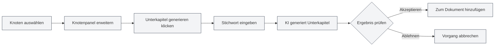
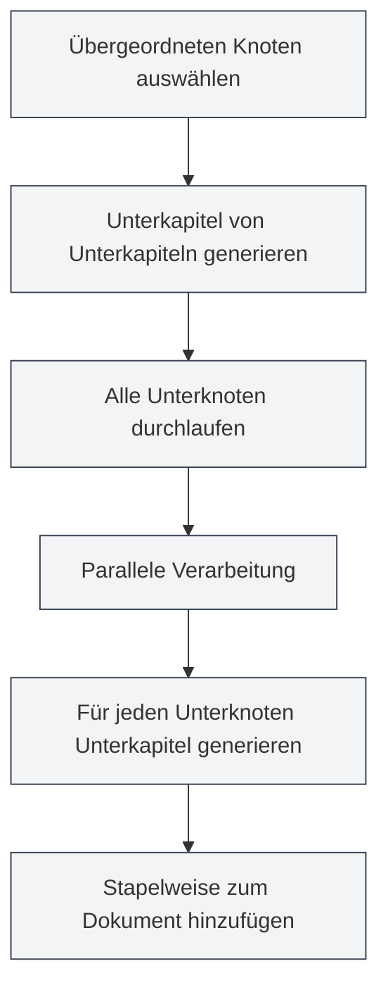

# Gliederungs-AI-Funktionen

## Übersicht

Die Gliederungs-AI-Funktionen nutzen KI-Technologie, um Ihnen beim schnellen Erstellen und Optimieren von Dokumentstrukturen zu helfen. Mit den KI-Funktionen können Sie Unterkapitel generieren, Kapitelinhalte erstellen, die Gliederungsstruktur optimieren und so die Effizienz der Dokumenterstellung erheblich steigern.

<Outline mode="demo" />

Die Gliederungs-AI-Funktionen unterstützen verschiedene Betriebsmodi, einschließlich Einzelknoten-Operationen und Stapelverarbeitung, sodass Sie KI flexibel zur Unterstützung der Dokumenterstellung nutzen können.

<Outline mode="demo" />

## Unterkapitel generieren

### Unterkapitel für einen Knoten generieren

So generieren Sie Unterkapitel für einen bestimmten Knoten:

<OutlineAiToolbar mode="demo" />

1.  **Knoten auswählen**: Wählen Sie den Knoten in der Gliederungsansicht aus, für den Unterkapitel generiert werden sollen.
2.  **Knoten erweitern**: Klicken Sie auf den Knoten, um das Detailpanel zu öffnen.
3.  **Unterkapitel generieren**: Klicken Sie auf die Schaltfläche "Unterkapitel generieren".
4.  **Eingabeaufforderung**: Optional können Sie ein Stichwort eingeben, um die KI-Generierung zu steuern.
5.  **Auf Generierung warten**: Die KI generiert Unterkapitel basierend auf dem Knotentitel und dem Inhalt.
6.  **Bestätigen und übernehmen**: Überprüfen Sie das generierte Ergebnis und übernehmen Sie es nach Bestätigung.

Sie können über die Seitenleiste auf die Gliederungsansicht zugreifen:

<ViewMenuItemsDemo mode="demo" :items='["outline"]' />

Die generierten Unterkapitel werden automatisch zum Dokument hinzugefügt und die Gliederungsstruktur wird aktualisiert.

### Generierungsprinzip

<OutlineTreeDisplay mode="demo" />

Bei der Generierung von Unterkapiteln berücksichtigt die KI:

-   **Knotentitel**: Versteht das Kapitelthema basierend auf dem Knotentitel.
-   **Dokumentstruktur**: Berücksichtigt die Gesamtstruktur des Dokuments.
-   **Benutzerhinweis**: Passt den generierten Inhalt basierend auf dem Benutzer-Stichwort an.
-   **Formatierungsanforderungen**: Generiert korrekte Titelformate entsprechend dem Dokumentformat (Markdown/LaTeX).

### Verwendungstipps

1.  **Klare Stichwörter angeben**: Geben Sie klare Stichwörter ein, um die KI bei der Generierung passender Unterkapitel zu leiten.
2.  **Auf bestehende Struktur verweisen**: Die KI berücksichtigt die bestehende Dokumentstruktur, um einen konsistenten Stil beizubehalten.
3.  **Mehrfach generieren**: Wenn Sie nicht zufrieden sind, können Sie mehrfach generieren und das beste Ergebnis auswählen.

## Kapitelinhalte generieren

<Outline mode="demo" />

### Inhalte für einen Knoten generieren

So generieren Sie Textinhalte für einen bestimmten Knoten:

1.  **Knoten auswählen**: Wählen Sie den Knoten in der Gliederungsansicht aus, für den Inhalte generiert werden sollen.
2.  **Knoten erweitern**: Klicken Sie auf den Knoten, um das Detailpanel zu öffnen.
3.  **Inhalte generieren**: Klicken Sie auf die Schaltfläche "Inhalte generieren".
4.  **Eingabeaufforderung**: Optional können Sie ein Stichwort eingeben, um die KI-Generierung zu steuern.
5.  **Wortzahl festlegen**: Optional können Sie eine Zielwortzahl festlegen.
6.  **Auf Generierung warten**: Die KI generiert Inhalte basierend auf dem Knotentitel und der Dokumentstruktur.
7.  **Bestätigen und übernehmen**: Überprüfen Sie das generierte Ergebnis und übernehmen Sie es nach Bestätigung.

Die generierten Inhalte werden automatisch dem entsprechenden Kapitel im Dokument hinzugefügt.

### Inhaltsgenerierungsmodi

<OutlineAiToolbar mode="demo" />

Die Inhaltsgenerierung unterstützt folgende Modi:

-   **Vollständige Generierung**: Generiert vollständige Kapitelinhalte.
-   **Teilweise Generierung**: Generiert nur Teile des Inhalts (basierend auf den Einstellungen).
-   **Inhalte anhängen**: Fügt neuen Inhalt zu bestehendem Inhalt hinzu.

### Wortzahlkontrolle

Bei der Inhaltsgenerierung kann eine Zielwortzahl festgelegt werden:

-   **Wortzahl festlegen**: Geben Sie die Zielwortzahl im Generierungsdialog ein.
-   **KI-Anpassung**: Die KI passt den Detaillierungsgrad des generierten Inhalts an die Wortzahlanforderung an.
-   **Flexible Kontrolle**: Unterschiedliche Wortzahlen können je nach Kapitelbedeutung festgelegt werden.

<OutlineTreeDisplay mode="demo" />

## Unterkapitel von Unterkapiteln generieren

### Unterkapitel stapelweise generieren

Generieren Sie stapelweise Unterkapitel für alle Unterknoten eines bestimmten Knotens:

1.  **Knoten auswählen**: Wählen Sie den Knoten für die Stapeloperation aus.
2.  **Knoten erweitern**: Klicken Sie auf den Knoten, um das Detailpanel zu öffnen.
3.  **Unterkapitel von Unterkapiteln generieren**: Klicken Sie auf die Schaltfläche "Unterkapitel von Unterkapiteln generieren".
4.  **Eingabeaufforderung**: Geben Sie ein Stichwort ein, um die KI-Generierung zu steuern.
5.  **Auf Generierung warten**: Die KI verarbeitet alle Unterknoten parallel und generiert für jeden Unterknoten Unterkapitel.
6.  **Bestätigen und übernehmen**: Überprüfen Sie das generierte Ergebnis und übernehmen Sie es nach Bestätigung.

Diese Funktion nutzt einen Parallelverarbeitungsmechanismus, um schnell für mehrere Kapitel stapelweise Unterkapitel zu generieren.

### Vorteile der Parallelverarbeitung

<OutlineAiToolbar mode="demo" />

Die Stapelgenerierung nutzt einen Parallelverarbeitungsmechanismus:

-   **Effiziente Verarbeitung**: Gleichzeitige Verarbeitung mehrerer Knoten, Geschwindigkeitssteigerung um das Zehnfache.
-   **Automatische Synchronisation**: Automatische Synchronisation mit dem Dokument nach Abschluss der Generierung.
-   **Fortschrittsanzeige**: Zeigt den Generierungsfortschritt für jeden Knoten an.

### Anwendungsszenarien

Geeignet für folgende Szenarien:

-   **Großangelegte Generierung**: Wenn für mehrere Kapitel Unterkapitel generiert werden müssen.
-   **Stapeloperationen**: Ein-Klick-Generierung von Unterkapiteln für alle Kapitel.
-   **Strukturierte Generierung**: Stapelweise Inhaltsgenerierung gemäß der Gliederungsstruktur.

## Inhalte für Unterkapitel generieren

### Inhalte stapelweise generieren

Generieren Sie stapelweise Inhalte für alle Unterknoten eines bestimmten Knotens:

1.  **Knoten auswählen**: Wählen Sie den Knoten für die Stapeloperation aus.
2.  **Knoten erweitern**: Klicken Sie auf den Knoten, um das Detailpanel zu öffnen.
3.  **Unterkapitelinhalte generieren**: Klicken Sie auf die Schaltfläche "Unterkapitelinhalte generieren".
4.  **Eingabeaufforderung**: Geben Sie ein Stichwort ein, um die KI-Generierung zu steuern.
5.  **Wortzahl festlegen**: Optional können Sie eine Zielwortzahl festlegen.
6.  **Auf Generierung warten**: Die KI verarbeitet alle Unterknoten parallel und generiert für jeden Unterknoten Inhalte.
7.  **Bestätigen und übernehmen**: Überprüfen Sie das generierte Ergebnis und übernehmen Sie es nach Bestätigung.

Diese Funktion kann schnell Inhalte für alle Kapitel eines gesamten Dokuments generieren.

### Rekursive Generierung

Die Generierung von Unterkapitelinhalten erfolgt rekursiv:

-   **Alle Unterknoten durchlaufen**: Rekursives Durchlaufen aller Unterknoten.
-   **Inhalte generieren**: Generiert Inhalte für jeden Unterknoten.
-   **Struktur beibehalten**: Beibehaltung der hierarchischen Dokumentstruktur.

### Fortschrittsverfolgung

Bei der Stapelgenerierung wird der Fortschritt angezeigt:

-   **Knotenfortschritt**: Zeigt den aktuell verarbeiteten Knoten an.
-   **Gesamtfortschritt**: Zeigt den Gesamtgenerierungsfortschritt an.
-   **Echtzeitaktualisierung**: Aktualisiert die generierten Inhalte in Echtzeit.

<Outline mode="demo" />

## Gliederungsoptimierung

### Optimierungsfunktionen

Die Gliederungsoptimierungsfunktion kann Ihnen helfen bei:

-   **Strukturanpassung**: Optimierung der Dokumentstruktur und -hierarchie.
-   **Titeloptimierung**: Optimierung der Titelbenennung und -formatierung.
-   **Strukturneugliederung**: Neuorganisation der Dokumentstruktur.

### Optimierungsoperationen

Die Gliederungsoptimierung unterstützt folgende Operationen:

-   **Knoten verschieben**: Verschiebt einen Knoten an eine neue Position.
-   **Knoten löschen**: Löscht nicht benötigte Knoten.
-   **Hierarchieebene anpassen**: Passt die Hierarchiebeziehung von Knoten an.
-   **Knoten zusammenführen**: Führt ähnliche Knoten zusammen.

### Optimierung verwenden

<OutlineTreeDisplay mode="demo" />

1.  **Struktur analysieren**: Die KI analysiert die aktuelle Dokumentstruktur.
2.  **Vorschläge liefern**: Liefert Optimierungsvorschläge.
3.  **Optimierung anwenden**: Wendet das Optimierungsergebnis nach Bestätigung an.

## KI-Funktionskonfiguration

### Temperatureinstellung

Bei der KI-Generierung kann der Temperaturparameter eingestellt werden:

-   **Temperaturbereich**: 0.0 - 1.0
-   **Standardwert**: Gemäß Konfiguration.
-   **Wirkung**: Steuert die Kreativität der KI-Generierung (höhere Temperatur = kreativer).

### Stichworteinstellung

Für jede Operation können Stichwörter festgelegt werden:

-   **Allgemeines Stichwort**: Festlegen eines allgemeinen Stichworts.
-   **Operationsspezifisches Stichwort**: Festlegen spezifischer Stichwörter für jede Operation.
-   **Wortzahlanforderung**: Einbeziehen von Wortzahlanforderungen in das Stichwort.

### Formaterkennung

Die KI erkennt automatisch das Dokumentformat:

-   **Markdown-Format**: Generiert Titel und Inhalte im Markdown-Format.
-   **LaTeX-Format**: Generiert Titel und Inhalte im LaTeX-Format.
-   **Automatische Anpassung**: Passt den generierten Inhalt automatisch an das Dokumentformat an.

## Verwendungstipps

### Effiziente Generierung

1.  **Stapeloperationen verwenden**: Verwenden Sie Stapeloperationen, um die Effizienz bei der Generierung großer Inhaltsmengen zu steigern.
2.  **Klare Stichwörter angeben**: Geben Sie klare Stichwörter ein, um bessere Generierungsergebnisse zu erhalten.
3.  **Schrittweise Generierung**: Zuerst Struktur generieren, dann Inhalte, um das Dokument schrittweise zu vervollständigen.

### Qualitätskontrolle

1.  **Generierungsergebnisse prüfen**: Überprüfen Sie die Ergebnisse nach der Generierung sorgfältig, um die Einhaltung der Anforderungen sicherzustellen.
2.  **Mehrfach generieren**: Wenn Sie nicht zufrieden sind, können Sie mehrfach generieren und das beste Ergebnis auswählen.
3.  **Manuelle Anpassung**: Nach der Generierung können Inhalte manuell angepasst und vervollständigt werden.

### Strukturplanung

1.  **Zuerst Struktur planen**: Nutzen Sie die KI, um mit der Generierung von Unterkapiteln die Dokumentstruktur zu planen.
2.  **Dann Inhalte generieren**: Generieren Sie konkrete Inhalte, nachdem die Struktur festgelegt ist.
3.  **Schrittweise Vervollständigung**: Vervollständigen Sie das Dokument schrittweise, generieren Sie nicht alle Inhalte auf einmal.

## Häufig gestellte Fragen (FAQ)

### F: Sind die von der KI generierten Inhalte ungenau?

A: KI-generierte Inhalte dienen nur als Referenz. Es wird empfohlen, sie nach der Generierung zu überprüfen und anzupassen. Detailliertere Stichwörter können zu besseren Ergebnissen führen.

### F: Die Stapelgenerierung ist sehr langsam?

A: Die Stapelgenerierung nutzt Parallelverarbeitung und ist bereits sehr schnell. Falls sie dennoch langsam ist, könnte es an Netzwerkproblemen oder einer langsamen Antwort des KI-Dienstes liegen.

### F: Wie kann ich die Generierung abbrechen?

A: Während der Generierung können Sie auf die Schaltfläche "Abbrechen" klicken, um den Vorgang zu stoppen. Bereits generierte Inhalte gehen nicht verloren.

### F: Das Format der generierten Inhalte ist falsch?

A: Die KI erkennt das Dokumentformat automatisch. Wenn das Format falsch ist, überprüfen Sie die Dokumentformateinstellungen oder passen Sie den generierten Inhalt manuell an.

### F: Kann ich generierte Inhalte bearbeiten?

A: Ja. Generierte Inhalte können jederzeit bearbeitet und geändert werden. Die Generierung dient nur der Unterstützung des kreativen Prozesses, der endgültige Inhalt liegt in Ihrer Hand.

## Verwandte Dokumentation

-   [[outline.basics|Gliederungsansicht-Funktionen]]
-   [[ai.llm-config|LLM-Konfiguration]]
-   [[markdown.editor|Markdown-Editor Benutzerhandbuch]]
-   [[latex.editor|LaTeX-Editor Benutzerhandbuch]]

<Outline mode="demo" />

<OutlineAiToolbar mode="demo" />

<ViewMenuItemsDemo mode="demo" :items='["ai"]' />
