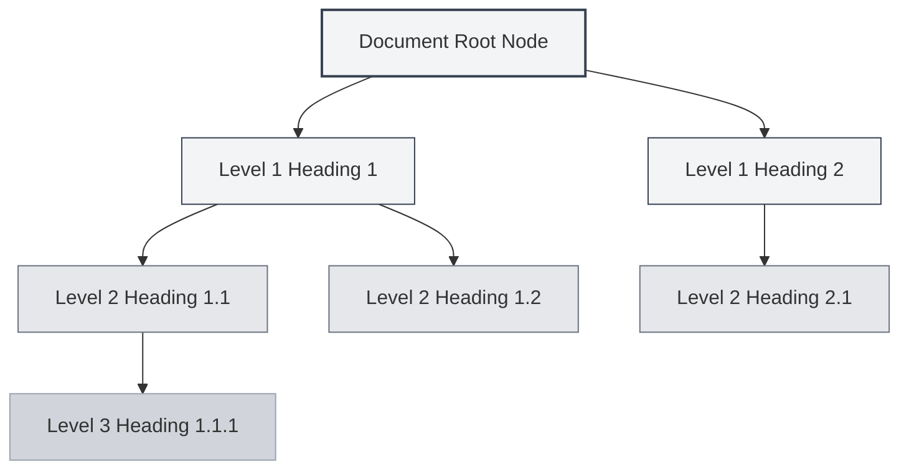
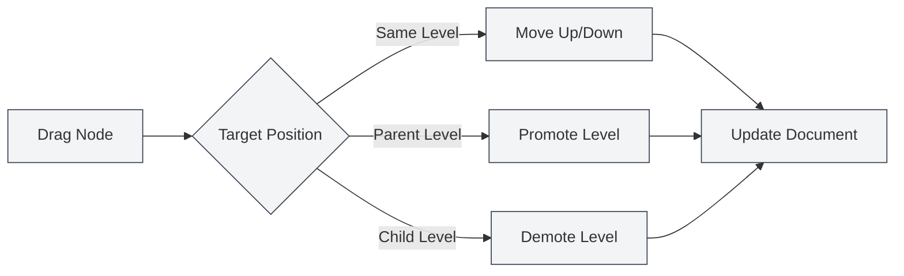

# Gliederungsansicht-Funktion

## Übersicht

Die Gliederungsansicht zeigt die Titelhierarchie eines Dokuments in einer Baumstruktur an und hilft Ihnen, die Dokumentstruktur schnell zu überblicken und zu bearbeiten. Über die Gliederungsansicht können Sie schnell zu beliebigen Stellen im Dokument springen, die Dokumentstruktur bearbeiten und KI-Funktionen zur Inhaltsgenerierung nutzen.

Die Gliederungsansicht von MetaDoc unterstützt Funktionen wie automatische Extraktion, manuelle Bearbeitung, Drag & Drop-Sortierung und KI-Generierung, sodass Sie Dokumentstrukturen effizient organisieren und verwalten können.

## Einführung in die Gliederungsansicht

### Ansichtsposition

Die Gliederungsansicht wird normalerweise in der Seitenleiste links oder rechts des Editors angezeigt:

- **Seitenleiste**: Die Gliederungsansicht wird als Teil der Seitenleiste angezeigt.
- **Unabhängiges Panel**: Die Gliederungsansicht kann unabhängig ein- oder ausgeblendet werden.
- **Breitenanpassung**: Die Breite der Gliederungsansicht kann angepasst werden.

Sie können über die Seitenleiste auf die Gliederungsansicht zugreifen. Die Seitenleiste bietet einen Wechsel zwischen Ansichten wie Editor und Gliederung:

<ViewMenuItemsDemo mode="demo" :items='["editor", "outline"]' />

### Interface-Vorschau

Die Gliederungsansicht zeigt die Titelhierarchie des Dokuments in einer Baumstruktur und unterstützt Drag & Drop-Sortierung und Knotenbearbeitung:

<Outline mode="demo" />

<ViewMenuItemsDemo mode="demo" :items='["outline"]' />

### Gliederungsstruktur

Die Gliederungsansicht zeigt die Titelhierarchie des Dokuments in einer Baumstruktur:

- **Wurzelknoten**: Der Wurzelknoten des Dokuments (normalerweise nicht sichtbar)
- **Überschrift Ebene 1**: Die Hauptüberschriften des Dokuments (H1)
- **Überschrift Ebene 2**: Die Unterüberschriften des Dokuments (H2)
- **Mehrstufige Verschachtelung**: Unterstützt die verschachtelte Anzeige mehrstufiger Überschriften

### Automatische Extraktion

Die Gliederungsansicht extrahiert automatisch die Titelstruktur aus dem Dokument:

- **Markdown-Dokumente**: Extrahiert aus Markdown-Überschriften (`#`, `##`, usw.)
- **LaTeX-Dokumente**: Extrahiert aus LaTeX-Kapitelbefehlen (`\section`, `\subsection`, usw.)
- **Echtzeit-Aktualisierung**: Die Gliederungsstruktur wird automatisch beim Bearbeiten des Dokuments aktualisiert.

## Gliederungsknoten-Operationen

### Unterknoten hinzufügen

Neue Unterknoten zur Gliederung hinzufügen:

1. **Knoten auswählen**: Klicken Sie auf den Knoten, unter dem ein Unterknoten hinzugefügt werden soll.
2. **Hinzufügen-Button**: Klicken Sie auf den Button "Unterknoten hinzufügen" (+ Symbol) neben dem Knoten.
3. **Titel eingeben**: Geben Sie den Titel des neuen Knotens ein.
4. **Erstellung bestätigen**: Bestätigen Sie, um den neuen Knoten zu erstellen.

Der neue Knoten wird an der entsprechenden Stelle im Dokument hinzugefügt und der Dokumentinhalt automatisch aktualisiert.

<Outline mode="demo" />

### Knoten bearbeiten

Den Titel eines Gliederungsknotens bearbeiten:

1. **Knoten auswählen**: Klicken Sie auf den zu bearbeitenden Knoten.
2. **Bearbeiten-Button**: Klicken Sie auf den "Bearbeiten"-Button neben dem Knoten.
3. **Titel ändern**: Ändern Sie den Knotentitel.
4. **Änderungen speichern**: Bestätigen Sie, um die Änderungen zu speichern.

Das Bearbeiten des Knotentitels aktualisiert automatisch den entsprechenden Titel im Dokument.

<TitleMenu mode="demo" title="Beispieltitel" path="1" :tree='{}' />

<ViewMenuItemsDemo mode="demo" :items='["outline"]' />

### Knoten löschen

Einen Gliederungsknoten löschen:

1. **Knoten auswählen**: Klicken Sie auf den zu löschenden Knoten.
2. **Löschen-Button**: Klicken Sie auf den "Löschen"-Button neben dem Knoten.
3. **Löschen bestätigen**: Bestätigen Sie, um den Knoten zu löschen.

Das Löschen eines Knotens entfernt gleichzeitig den entsprechenden Titel und Inhalt im Dokument (falls konfiguriert).

<SectionOptimizer mode="demo" title="Beispiel zur Gliederungsknoten-Optimierung" path="1" :tree='{}' language="markdown" :adapter='null' />

<OutlineTreeDisplay mode="demo" />

### Knoten verschieben

Die Position eines Gliederungsknotens ändern:

- **Hoch/Runter verschieben**: Verwenden Sie die Buttons "Nach oben" und "Nach unten", um die Reihenfolge der Knoten zu ändern.
- **Links/Rechts verschieben**: Verwenden Sie die Buttons "Nach links" und "Nach rechts", um die Hierarchieebene des Knotens zu ändern.
- **Per Drag & Drop verschieben**: Ziehen Sie den Knoten direkt an die Zielposition.

Das Verschieben eines Knotens aktualisiert automatisch die Dokumentstruktur.

<OutlineTreeDisplay mode="demo" />

## Gliederungsknoten Drag & Drop

### Drag & Drop-Operation

Die Gliederungsansicht unterstützt Drag & Drop-Operationen zum Neuorganisieren der Dokumentstruktur:

1. **Maus gedrückt halten**: Halten Sie die linke Maustaste auf einem Knoten gedrückt.
2. **Knoten ziehen**: Ziehen Sie den Knoten an die Zielposition.
3. **Maus loslassen**: Lassen Sie die Maustaste los, um die Verschiebung abzuschließen.

Während des Ziehens gibt es visuelles Feedback, das die Zielposition des Knotens anzeigt.

### Drag & Drop-Modi

Drag & Drop unterstützt folgende Modi:

- **Hoch/Runter verschieben**: Knoten innerhalb derselben Ebene nach oben oder unten bewegen.
- **Links/Rechts verschieben**: Die Hierarchieebene eines Knotens ändern (erhöhen oder verringern).
- **Über Ebenen hinweg verschieben**: Einen Knoten in eine andere Ebene verschieben.

### Drag & Drop-Einschränkungen

Die Drag & Drop-Operation unterliegt folgenden Einschränkungen:

- **Wurzelknoten**: Der Wurzelknoten kann nicht gezogen werden.
- **Selbstenthaltend**: Ein Knoten kann nicht in einen seiner eigenen Unterknoten gezogen werden (vermeidet Zyklen).
- **Hierarchiebeschränkungen**: Bestimmte Operationen können durch Hierarchiebeschränkungen eingeschränkt sein.

<Outline mode="demo" />

## Gliederung aufklappen/zuklappen

### Knoten aufklappen

Knoten aufklappen, um Unterknoten anzuzeigen:

- **Auf Knoten klicken**: Klicken Sie auf den Knotentitel, um ihn auf- oder zuzuklappen.
- **Aufklappen-Symbol**: Klicken Sie auf das Aufklappen-Symbol vor dem Knoten.
- **Alle aufklappen**: Verwenden Sie die Funktion "Alle aufklappen", um alle Knoten zu öffnen.

### Knoten zuklappen

Knoten zuklappen, um Unterknoten auszublenden:

- **Auf Knoten klicken**: Klicken Sie erneut auf einen bereits aufgeklappten Knoten, um ihn zuzuklappen.
- **Zuklappen-Symbol**: Klicken Sie auf das Zuklappen-Symbol vor dem Knoten.
- **Alle zuklappen**: Verwenden Sie die Funktion "Alle zuklappen", um alle Knoten zu schließen.

### Aufklappstatus

Der Aufklappstatus der Gliederung wird gespeichert:

- **Automatische Speicherung**: Der Aufklappstatus wird automatisch gespeichert.
- **Status wiederherstellen**: Beim nächsten Öffnen des Dokuments wird der Aufklappstatus wiederhergestellt.
- **Unabhängiger Status**: Der Aufklappstatus wird für jedes Dokument unabhängig gespeichert.

## Gliederungsbreite anpassen

### Breite anpassen

Die Breite der Gliederungsansicht kann angepasst werden:

1. **Rand ziehen**: Bewegen Sie die Maus an den Rand der Gliederungsansicht.
2. **Gedrückt halten und ziehen**: Halten Sie die linke Maustaste gedrückt und ziehen Sie, um die Breite anzupassen.
3. **Maus loslassen**: Lassen Sie die Maustaste los, um die Anpassung abzuschließen.

### Breitenbeschränkungen

Die Breite der Gliederung unterliegt folgenden Beschränkungen:

- **Mindestbreite**: Kann nicht kleiner als die Mindestbreite sein (normalerweise 150px).
- **Maximalbreite**: Kann nicht größer als die Maximalbreite sein (normalerweise 50% der Bildschirmbreite).
- **Automatische Anpassung**: Die Breite passt sich automatisch an den Inhalt an.

<ResizableDivider mode="demo" />

## Schnelles Navigieren

### Per Klick springen

Durch Klicken auf einen Gliederungsknoten können Sie schnell zur entsprechenden Stelle im Dokument springen:

- **Auf Knoten klicken**: Klicken Sie auf den Knotentitel, um zur entsprechenden Position zu springen.
- **Hervorhebung**: Nach dem Springen wird der entsprechende Titel hervorgehoben.
- **Scroll-Positionierung**: Der Editor scrollt automatisch zur entsprechenden Position.

### Synchronisiertes Scrollen

Die Gliederungsansicht unterstützt synchronisiertes Scrollen mit dem Editor:

- **Synchron beim Bearbeiten**: Während der Dokumentbearbeitung hebt die Gliederung automatisch die aktuelle Bearbeitungsposition hervor.
- **Synchron beim Scrollen**: Beim Scrollen im Editor hebt die Gliederung automatisch die sichtbaren Überschriften hervor.
- **Bidirektionale Synchronisation**: Die Gliederung und der Editor sind bidirektional synchronisiert.

## Knoteninformationen anzeigen

### Knotentitel

Der Gliederungsknoten zeigt folgende Informationen an:

- **Titeltext**: Zeigt den Textinhalt des Titels an.
- **Titelebene**: Zeigt die Hierarchieebene des Titels durch Einrückung an.
- **Knotenstatus**: Zeigt den Status des Knotens an (aufgeklappt/zugeklappt).

### Knotenoperationen

Jeder Knoten bietet folgende Operationsbuttons:

- **Unterknoten hinzufügen**: Fügt einen Unterknoten unter dem aktuellen Knoten hinzu.
- **Bearbeiten**: Bearbeitet den Knotentitel.
- **Löschen**: Löscht den Knoten.
- **Verschieben**: Verschiebt den Knoten nach oben, unten, links oder rechts.

Die Operationsbuttons werden beim Mouseover oder bei Auswahl des Knotens angezeigt.

<OutlineTreeDisplay mode="demo" />

<ViewMenuItemsDemo mode="demo" :items='["editor", "outline"]' />

## Anwendungstipps

### Dokumentstruktur organisieren

1. **Mit Gliederung planen**: Planen Sie zuerst die Dokumentstruktur in der Gliederung, bevor Sie Inhalte einfügen.
2. **Ebenen anpassen**: Verwenden Sie Drag & Drop, um Titelhierarchien schnell anzupassen.
3. **Stapeloperationen**: Verwenden Sie die Gliederungsansicht, um mehrere Titel stapelweise zu verwalten.

### Schnelle Navigation

1. **Springen verwenden**: Klicken Sie auf Gliederungsknoten, um schnell zu Dokumentpositionen zu springen.
2. **Suche verwenden**: Suchen Sie in der Gliederung nach Titeln, um sie schnell zu finden.
3. **Zuklappen verwenden**: Klappen Sie nicht benötigte Abschnitte zu, um sich auf den aktuellen Inhalt zu konzentrieren.

### Bearbeitungseffizienz

1. **Drag & Drop-Sortierung**: Verwenden Sie Drag & Drop, um die Dokumentstruktur schnell anzupassen.
2. **Stapelbearbeitung**: Bearbeiten Sie mehrere Titel stapelweise in der Gliederung.
3. **Strukturvorschau**: Verwenden Sie die Gliederung, um die gesamte Dokumentstruktur zu überblicken.

<OutlineTreeDisplay mode="demo" />

## Häufig gestellte Fragen

### F: Gliederung aktualisiert sich nicht?

A: Die Gliederung aktualisiert sich automatisch. Falls keine Aktualisierung erfolgt, versuchen Sie, die Ansicht zu wechseln oder das Dokument zu aktualisieren. Stellen Sie sicher, dass das Dokument korrekte Titelformate enthält.

### F: Wie füge ich schnell mehrere Titel hinzu?

A: Verwenden Sie die Funktion "Unterknoten hinzufügen", um Titel schnell hinzuzufügen, oder geben Sie Titel direkt im Editor ein – die Gliederung wird automatisch aktualisiert.

### F: Knoten-Drag & Drop schlägt fehl?

A: Prüfen Sie, ob Sie den Knoten in einen seiner eigenen Unterknoten ziehen (würde einen Zyklus verursachen). Stellen Sie sicher, dass die Zielposition gültig ist.

### F: Gliederung wird falsch angezeigt?

A: Überprüfen Sie, ob die Titelformate im Dokument korrekt sind. Markdown verwendet `#`, LaTeX verwendet Befehle wie `\section`, usw.

### F: Wie setze ich die Gliederung zurück?

A: Die Gliederung wird automatisch aus dem Dokument extrahiert. Zum Zurücksetzen können Sie das Dokument neu öffnen oder die Dokumentstruktur manuell bearbeiten.

## Verwandte Dokumentation

- [[outline.ai-features|Gliederungs-KI-Funktionen]]
- [[markdown.editor|Markdown-Editor-Benutzerhandbuch]]
- [[latex.editor|LaTeX-Editor-Benutzerhandbuch]]
- [[core.editor-basics|Editor-Grundlagen]]