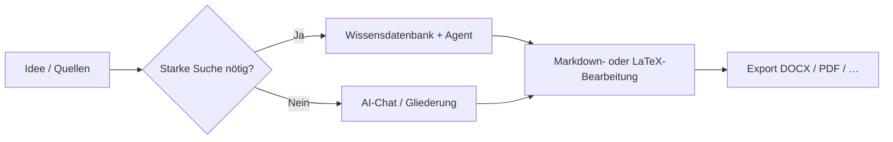

# 🚀 MetaDoc – Best Practices

MetaDoc ist keine Software mit genau einem starren Ablauf.

Es ist eher eine **Werkzeugkombination**: Dieselbe Aufgabe – Text, Diagramme, Übersetzung – lässt sich auf **mehreren Wegen** erledigen.

👉 Das bedeutet:

* Viele Aufgaben haben **mehrere Routen**
* Die Routen unterscheiden sich bei **Tempo, Kosten und Kontrolle**
* Die **Wahl der Route** ist oft wichtiger als jedes einzelne Menü

Dieses Kapitel ist kein Funktionskatalog. Es beantwortet eine pragmatische Frage:

> 👉 **Welchen Weg soll ich in meiner Situation zuerst gehen?**

---

## 🧭 Legende

| Symbol     | Bedeutung                                      |
| ---------- | ---------------------------------------------- |
| ⭐⭐⭐⭐⭐ | Erste Wahl für die meisten Fälle               |
| ⭐⭐⭐⭐   | Sehr solide, ggf. ein zusätzlicher Schritt     |
| ⭐⭐⭐     | Besonders bei bestimmten Szenarien sinnvoll    |
| ⚠️       | Qualität, Compliance oder Risiko beachten      |
| 💰         | Höherer Token- bzw. API-Verbrauch möglich      |

---

Registerkarten im Hauptfenster (Beispiel):

<MainTabs mode="demo" />

---

# 📝 1. Schreiben: von der Idee zum fertigen Text

Typischerweise gibt es drei Hauptpfade. Einer reicht, wenn er zu Ihrem Ziel passt.

---

## ⭐⭐⭐⭐⭐ Pfad 1 (Standardempfehlung)

### Entwurf im AI-Chat → Markdown bearbeiten → exportieren

**Ablauf**:
[[ai.chat|AI-Chat]] → Markdown-Bearbeitung → [[core.export|Export]]

**Passt, wenn Sie:**

* schnell starten möchten
* mehrere Überarbeitungsrunden erwarten
* Word, PDF oder LaTeX als Zielformat brauchen

---

**Warum dieser Pfad vorn liegt**

* Markdown hält **Layout-Rauschen gering** – Fokus auf Inhalt
* Zuerst Struktur und Text, Formatierung danach
* Nach dem Export Feinschliff in Word oder LaTeX

👉 Kurz: **Inhalt zuerst, Layout danach**

---

**Hinweise**

* Fakten, Zitate und Zahlen aus KI-Entwürfen **immer prüfen**
* Export kurz auf Darstellung prüfen

---

AI-Chat (Beispielansicht):

<AIChat mode="demo" />

---

## ⭐⭐⭐⭐ Pfad 2

### Schreiben mit Wissensdatenbank (v. a. fachlich / belegt)

**Ablauf**:
[[knowledge-base.usage|Wissensdatenbank]] → [[agent.introduction|Agent]] → im Editor zusammenführen

---

**Passt, wenn Sie:**

* belegpflichtige Texte schreiben (Papers, Reviews, Reports)
* bereits PDFs, Dokumente oder Notizen haben

---

**Vorteile**

* Generierung kann sich an hochgeladenen Quellen orientieren
* Einfacher, Aussagen an **nachvollziehbare Quellen** zu binden

---

**Zu beachten**

* ⚠️ Qualität hängt von Dateien und Chunking ab
* 💰 Mehrstufige Dialoge verbrauchen oft mehr Tokens

---

👉 Kurzfassung:

> Wenn Sie **quellenbasiert** schreiben müssen, starten Sie hier.

---

Wissensdatenbank (Beispielansicht):

<KnowledgeBase mode="demo" />

---

## ⭐⭐⭐ Pfad 3

### Agent erzeugt ein komplettes LaTeX-Projekt

**Ablauf**:
Agent → LaTeX-Projekt → PDF kompilieren

---

**Passt, wenn Sie:**

* eine klassische Paper-Struktur brauchen
* LaTeX fest eingeplant haben
* wenig Zeit haben

---

### ⚠️ Vor dem Einsatz

* 💰 Meist teurer in Tokens als kurze Chats oder kleine Kontextmenü-Aktionen
* Pakete, Pfade oder Kodierung können nachbearbeitet werden
* Hochsensible oder stark regulierte Inhalte nicht vollständig automatisieren

---

Agent (Beispielansicht):

<AgentView mode="demo" />

---

**Prompt-Vorlage (Titel einsetzen)**

```text
Du bist LaTeX-Technikredakteur. Erzeuge für das Thema „(Titel der Arbeit hier)“ ein im aktuellen Workspace kompilierbares LaTeX-Projekt.

Anforderungen:
1) article oder angegebene Dokumentklasse; Hauptdatei main.tex; Kapitel als mehrere .tex mit \input.
2) Klare Ordner: figures/, sections/, bib/; Platzhaltergrafiken und Beispiel-Bib-Einträge.
3) Standardpakete für Mathe (z. B. amsmath), Grafiken (graphicx), Zitate (biblatex oder natbib); zusätzlich nötige Pakete nennen.
4) Build-Empfehlung (latexmk -pdf; bei Unicode/CJK XeLaTeX/LuaLaTeX).
5) Dateiinhalte nicht weglassen; Pfade konsistent halten. Bei fehlenden Infos zuerst Annahmen nennen, dann generieren.
```

---

# 📊 2. Diagramme und Visualisierung

Die bessere Frage lautet nicht „Wo ist der Button?“, sondern:

> 👉 **Tempo oder Feinkontrolle?**

---


| Weg | Vorgehen | Bewertung | Wann sinnvoll |
| --- | -------- | --------- | ------------- |
| A | Im AI-Chat oder per Agent Mermaid/PlantUML/ECharts-Code erzeugen und in Markdown einfügen | ⭐⭐⭐⭐ | Schnelle Iteration neben dem Text |
| B | Diagrammfenster nutzen ([[charts.introduction|Diagramme]]) | ⭐⭐⭐⭐ | Wenn Sie lieber eine Oberfläche nutzen |
| C | Text markieren → Kontextmenü → Diagramm einfügen | ⭐⭐⭐⭐⭐ | Eng am aktuellen Absatz |

Siehe auch: [[ai.chat|AI-Chat]], [[agent.introduction|Agent]].

---

**Kurztipps**

* Alltagsschreiben → Kontextmenü ist oft am schnellsten
* Komplexe Grafiken → Diagrammwerkzeug
* Varianten testen → KI-Code generieren

---

Diagrammfenster (Beispielansicht):

<GraphWindow mode="demo" />

---

# 🌐 3. Übersetzung

Auf einen Satz:

> 👉 **Je kürzer der Text, desto einfacher das Werkzeug**

---


| Weg | Bewertung | Geeignet für |
| --- | --------- | ------------ |
| Übersetzen im Kontextmenü | ⭐⭐⭐⭐⭐ | Sätze / kurze Absätze |
| AI-Chat | ⭐⭐⭐⭐   | mehrere Blöcke |
| Agent | ⭐⭐⭐⭐   | lange Dokumente |

---

👉 Faustregel:

* Kurz → Kontextmenü
* Lang → AI-Chat oder Agent

---

Ziehbare Trennleiste (Beispiel):

<ResizableDivider mode="demo" />

---

# ✨ 4. Absätze glätten

Den ganzen Text auf einmal zu schicken, ist oft langsam und teuer.

Besser:

---


| Weg | Bewertung | Grund |
| --- | --------- | ----- |
| Rechtsklick im Absatz optimieren | ⭐⭐⭐⭐⭐ | kleiner Kontext, geringere Kosten |
| Über den Gliederungsbaum | ⭐⭐⭐⭐   | Struktur sortieren |
| AI-Chat / Agent | ⭐⭐⭐⭐   | große Umschreibungen |

---

👉 Kernidee:

> **In kleinen Stücken arbeiten**

---

Gliederungsansicht (Beispiel):

<Outline mode="demo" />

---

# 🎯 5. Nach Szenario wählen

Wenn Sie unsicher sind, lesen Sie nur diesen Abschnitt.

---

## 🎒 Vorlesungsnotizen

**Empfehlung**

* ⭐⭐⭐⭐⭐ Schnell Markdown in der Vorlesung → danach mit KI ausbauen
* ⭐⭐⭐⭐ Folien/PDF in die Wissensdatenbank → Merkzettel erzeugen

👉 Zuerst festhalten, dann ordnen

---

## 🧪 Laborberichte

**Empfehlung**

* ⭐⭐⭐⭐⭐ Markdown → DOCX-Export für Entwürfe
* ⭐⭐⭐⭐ Wissensdatenbank für Analyse-/Diskussionsteile

⚠️ Messwerte immer selbst prüfen

---

## 🛠️ Technische Dokumentation

**Empfehlung**

* ⭐⭐⭐⭐⭐ Markdown + lokaler Rechtsklick-Feinschliff
* ⭐⭐⭐⭐ Agent + Wissensdatenbank beim Abgleich mit Altbeständen

👉 Klarheit und Einheitlichkeit zuerst

---

## 💬 Q&A und Blogartikel

**Empfehlung**

* ⭐⭐⭐⭐⭐ Zuerst Gliederung → dann Fließtext
* ⭐⭐⭐⭐ Gliederungsbaum für lange Texte

👉 Struktur vor Wortzahl

---

## 📱 Newsletter / Creator-Workflows

**Empfehlung**

* ⭐⭐⭐⭐⭐ In Markdown fertigstellen → exportieren → im Publishing-Tool layouten
* ⭐⭐⭐⭐ KI für Überschriften- und Teaser-Varianten

⚠️ „Alles in einem Rutsch“ ist teuer und schwer stilistisch zu steuern

---

# 🔁 Ablaufüberblick



---

# 📚 Weiterlesen

* [[quick-start.guide|Schnellstart]]
* [[core.export|Export]]
* [[features.paragraph-optimization|Absatzoptimierung]]
* [[charts.introduction|Diagramme – Einführung]]
