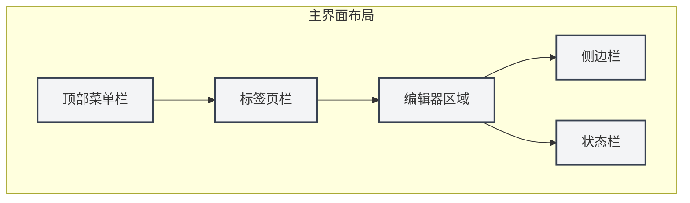
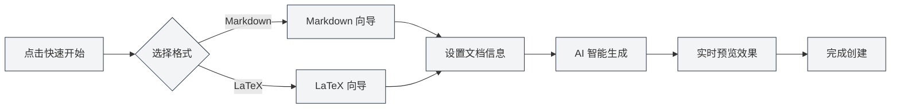

# Schnellstartanleitung

## Übersicht

Willkommen bei MetaDoc! Dies ist ein intelligentes Dokumentenverarbeitungstool, das für Wissensarbeiter entwickelt wurde. Egal, ob Sie einen technischen Blog schreiben, Lernnotizen organisieren oder akademische Arbeiten vorbereiten – MetaDoc bietet Ihnen ein professionelles und elegantes Bearbeitungserlebnis.

MetaDoc ist tief mit KI-Fähigkeiten integriert und unterstützt die beiden gängigen Dokumentenformate Markdown und LaTeX. Es ist nicht nur ein Texteditor, sondern auch Ihr intelligenter Schreibassistent – integrierte Funktionen wie KI-Chat, automatische Vervollständigung und intelligente Korrektur machen das Erstellen von Dokumenten effizienter und angenehmer.

## Erste Schritte

### Anwendung starten

Nach dem Start von MetaDoc sehen Sie zunächst die Startseite. Dies ist ein sorgfältig gestalteter Ausgangspunkt, um schnell mit der Arbeit zu beginnen:

-   **Schnellstart**: Ein intelligenter Assistent führt Sie durch die Auswahl des Dokumentenformats und die Erstellung eines neuen Dokuments.
-   **Neues Dokument**: Erstellen Sie direkt ein leeres Dokument und wählen Sie das gewünschte Format.
-   **Datei öffnen**: Durchsuchen und öffnen Sie vorhandene Dokumente.
-   **Benutzerhandbuch**: Konsultieren Sie jederzeit die detaillierte Anleitung.

### Benutzeroberfläche im Überblick

Das Design der MetaDoc-Oberfläche folgt dem Layoutkonzept moderner Editoren – klar und intuitiv:

1.  **Menüleiste oben**

    Sie befindet sich ganz oben im Fenster und bündelt Kernfunktionen wie Datei, Bearbeiten und Ansicht. Egal, ob Sie ein neues Dokument erstellen, Text suchen und ersetzen oder den Ansichtsmodus wechseln möchten – hier finden Sie den Zugang. Die Menüleiste ist anpassbar, Sie können die Anzeige und Reihenfolge der Menüpunkte nach Ihren Gewohnheiten einstellen.

2.  **Registerkartenleiste**

    Sie befindet sich unter der Menüleiste und zeigt alle aktuell geöffneten Dokumente an. Jedes Dokument entspricht einer Registerkarte, ein Klick genügt zum Wechseln. Registerkarten können per Drag & Drop sortiert, häufig verwendete Dokumente können angeheftet werden, um ein versehentliches Schließen zu vermeiden. Bei vielen Registerkarten können Dokumente auch fensterübergreifend organisiert werden.

3.  **Editorbereich**

    Dies ist Ihr Hauptarbeitsbereich. MetaDoc bietet für verschiedene Dokumententypen spezielle Bearbeitungsumgebungen:

    -   **Markdown-Editor**: WYSIWYG-Bearbeitungserlebnis mit Echtzeitvorschau, mathematischen Formeln, Diagrammen und vielen weiteren Funktionen.
    -   **LaTeX-Editor**: Professionelle Umgebung für akademisches Schreiben mit Syntax-Highlighting, intelligenten Vorschlägen, Kompilierungsvorschau usw.

4.  **Seitenleiste**

    Sie befindet sich links vom Editor und ist Ihr Dokumenten-Navigationszentrum. Hier können Sie:

    -   Zwischen verschiedenen Ansichten wie Editor, Gliederung, Agent usw. wechseln.
    -   Die Dokumentstruktur und Gliederung einsehen.
    -   Wissensdatenbanken und Referenzmaterialien verwalten.

5.  **Statusleiste**

    Sie befindet sich am unteren Fensterrand und zeigt in Echtzeit Statusinformationen zum aktuellen Dokument an, wie Wortzahl, Speicherstatus, Spracheinstellungen usw., sodass Sie Ihren Arbeitsfortschritt auf einen Blick erfassen.

Unten sehen Sie die entsprechenden echten Benutzeroberflächen-Steuerelemente zur Veranschaulichung und zum einfachen Nachvollziehen der Schritte:

**Menüleiste oben**

Sie befindet sich ganz oben im Fenster und enthält Hauptmenüs wie Datei, Bearbeiten, Ansicht, die anwendungsweite Aktionszugänge bieten. Über die Menüleiste können Sie neue Dokumente erstellen, öffnen, speichern sowie auf verschiedene Bearbeitungs- und Ansichtsfunktionen zugreifen.

<MenuItemsDemo mode="demo" :items='[{"id": "file", "items": ["new", "open", "save"]}, {"id": "edit", "items": ["undo", "redo", "find"]}, {"id": "view", "items": ["editor", "outline"]}]' />

**Registerkartenleiste**

Sie befindet sich unter der Menüleiste und zeigt alle aktuell geöffneten Dokumentenregisterkarten an. Sie können durch Klicken auf eine Karte zwischen Dokumenten wechseln, Karten per Drag & Drop sortieren oder mit der rechten Maustaste auf eine Karte klicken, um weitere Aktionen auszuführen (wie Schließen, Anheften, In neues Fenster verschieben usw.).

<MainTabs mode="demo" />

**Seitenleiste**

Sie befindet sich links vom Editor und bietet Zugang zu verschiedenen Hilfsfunktions-Bedienfeldern. Über die Seitenleiste können Sie schnell zwischen Editor-Ansicht, Gliederungsansicht, Agent-Ansicht usw. wechseln und so die Effizienz der Dokumentenbearbeitung steigern.

<ViewMenuItemsDemo mode="demo" :items='["editor", "outline", "home"]' />

## Schnelles Erstellen von Dokumenten

### Methode 1: Den Schnellstart-Assistenten verwenden

Der Schnellstart-Assistent von MetaDoc ist eine durchdachte Funktion. Er erstellt nicht nur einfach leere Dokumente, sondern führt Sie wie ein erfahrener Assistent durch jeden Schritt der Dokumentenerstellung:

1.  Klicken Sie auf der Startseite auf die Schaltfläche "Schnellstart".
2.  Wählen Sie entsprechend Ihren Anforderungen das Dokumentenformat:
    -   **Markdown**: Die leichteste Wahl, wenn Sie Blogs, technische Dokumentation, Sitzungsprotokolle oder beliebige alltägliche Textinhalte verfassen möchten. Die Markdown-Syntax ist einfach und intuitiv und erfüllt gleichzeitig anspruchsvolle Formatierungsbedürfnisse.
    -   **LaTeX**: Wenn Sie akademische Arbeiten, Dissertationen oder technische Dokumente mit präziser Formatierung vorbereiten, ist LaTeX der in der Wissenschaft anerkannte Standard. MetaDoc macht das komplexe LaTeX-Kompilieren einfach verständlich.
3.  Basierend auf Ihrer Auswahl bietet der Assistent entsprechende Vorlagen und KI-Hilfsfunktionen.

#### Format-Auswahloberfläche

Der erste Schritt des Assistenten ist die Auswahl des Dokumentenformats. MetaDoc empfiehlt intelligent passende Optionen basierend auf Ihrem Anwendungsszenario:

<QuickStartPanel mode="demo" />

#### Schnellstart mit Markdown

Nach der Auswahl von Markdown bietet der Assistent:

-   **Intelligente Titelvorschläge**: Die KI schlägt basierend auf Ihrer ersten Eingabe passende Dokumententitel vor.
-   **Strukturierte Gliederung**: Automatische Generierung eines Dokumentengerüsts, das Ihnen hilft, Ihre Gedanken zu organisieren.
-   **Echtzeitvorschau**: Schreiben und gleichzeitig sehen, wie das Dokument letztendlich aussieht.

<QuickStartMarkdown mode="demo" />

#### Schnellstart mit LaTeX

Nach der Auswahl von LaTeX bietet der Assistent:

-   **Professionelle Vorlagen**: Für verschiedene akademische Szenarien optimierte Vorlagen (Arbeiten, Berichte, Präsentationen usw.).
-   **Strukturhilfe**: Automatische Generierung einer standardmäßigen LaTeX-Dokumentenstruktur.
-   **Intelligente Vervollständigung**: KI-unterstützte Generierung von LaTeX-Code, um die Einstiegshürde zu senken.

<QuickStartLatex mode="demo" />

#### Der Kernnutzen des Assistenten

Die Essenz des Schnellstart-Assistenten liegt darin, **die Einstiegshürde zu senken und die Effizienz zu steigern**:

-   **Einsteigerfreundlich**: Kein Auswendiglernen komplexer Syntax nötig, der Assistent führt Sie Schritt für Schritt.
-   **Für Experten effizient**: KI-Hilfsfunktionen können schnell Dokumentengerüste generieren und wiederkehrende Arbeit sparen.
-   **Kontextbewusst**: Wenn Sie bereits einige Ideen haben, können Sie diese direkt der KI mitteilen, sie hilft Ihnen, daraus eine vollständige Dokumentenstruktur zu entwickeln.

#### Arbeitsablauf des Assistenten

### Methode 2: Direkt ein neues Dokument erstellen

Wenn Sie MetaDoc bereits kennen, können Sie direkt mit einem leeren Dokument beginnen:

1.  Klicken Sie auf der Startseite auf die Schaltfläche "Neues Dokument" oder drücken Sie die Tastenkombination `Strg+N`.
2.  Wählen Sie das Dokumentenformat (Markdown / LaTeX / Nur Text).
3.  Das Dokument wird sofort im Editor geöffnet und Sie können mit dem Verfassen beginnen.

Diese Methode eignet sich für erfahrene Benutzer oder Szenarien mit einem klaren Schreibplan.

### Methode 3: Vorhandene Datei öffnen

Die Fortsetzung Ihrer vorherigen Arbeit ist ebenfalls einfach:

1.  Klicken Sie auf der Startseite auf die Schaltfläche "Datei öffnen" oder drücken Sie `Strg+O`.
2.  Finden Sie Ihr Dokument im Datei-Explorer.
3.  Die ausgewählte Datei wird in einer neuen Registerkarte geöffnet und Sie können nahtlos mit der Bearbeitung fortfahren.

MetaDoc merkt sich automatisch Ihre zuletzt geöffneten Dokumente, sodass Sie schnell zum Arbeitsstand zurückkehren können.

## Grundlegende Operationen

### Dokumente bearbeiten

Das Bearbeitungserlebnis von MetaDoc ist sorgfältig gestaltet, damit Sie sich auf den Inhalt konzentrieren können:

-   **Flüssige Eingabe**: Egal, ob Sie schnell Ideen notieren oder Texte sorgfältig verfeinern – der Editor hält mit Ihren Gedanken Schritt.
-   **Intelligente Formatierung**: Der Markdown-Editor unterstützt WYSIWYG, der LaTeX-Editor bietet Syntax-Highlighting und intelligente Vorschläge.
-   **Viele Elemente**: Einfaches Einfügen von Bildern, Tabellen, Codeblöcken, mathematischen Formeln usw., um Dokumente lebendiger und professioneller zu gestalten.
-   **Echtzeitvorschau**: Markdown-Dokumente können während des Schreibens in der Vorschau betrachtet werden, um sofort das Endergebnis zu sehen.

### Dokumente speichern

MetaDoc bietet verschiedene Speichermethoden, um sicherzustellen, dass Ihre Arbeit nicht verloren geht:

-   **Sofort speichern**: `Strg+S` speichert schnell das aktuelle Dokument – die am häufigsten verwendete Aktion.
-   **Speichern unter**: `Strg+Umschalt+S` verwenden Sie, wenn Sie das aktuelle Dokument als Kopie speichern möchten.
-   **Alle speichern**: `Strg+K S` speichert alle geöffneten Dokumente auf einmal, ideal zum Abschluss der Arbeit.

Darüber hinaus können Sie in den Einstellungen die automatische Speicherfunktion aktivieren, damit MetaDoc Ihre Dokumente regelmäßig automatisch speichert.

### Ansicht wechseln

MetaDoc bietet verschiedene Ansichtsmodi, die den Anforderungen verschiedener Arbeitsphasen gerecht werden:

-   **Editor-Ansicht**: Der Hauptarbeitsbereich für die Dokumentenbearbeitung mit vollständigen Bearbeitungsfunktionen.
-   **Gliederungsansicht**: Zeigt die Titelhierarchie des Dokuments als Baumstruktur an, ideal für schnelle Navigation und Strukturanpassungen.
-   **PDF-Vorschau**: Vorschau des kompilierten LaTeX-Dokuments, praktisch zur Überprüfung des endgültigen Layouts.

Über die Seitenleiste oder Tastenkombinationen können Sie schnell zwischen den verschiedenen Ansichten wechseln.

## Hilfe erhalten

MetaDoc enthält ein detailliertes Benutzerhandbuch, das Ihnen jederzeit Fragen beantwortet:

1.  Drücken Sie die Taste `F1` oder klicken Sie auf der Startseite auf die Schaltfläche "Benutzerhandbuch".
2.  Das Handbuch ist nach Themen kategorisiert und umfasst alles von Grundoperationen bis zu erweiterten Funktionen.
3.  Verwenden Sie die Suchfunktion, um schnell zu den benötigten Inhalten zu gelangen.

Das Handbuch behandelt unter anderem:

-   Detaillierte Anleitung zur Verwendung des Editors.
-   Tipps zur Datei- und Projektverwaltung.
-   Vertiefende Tutorials zu KI-Funktionen.
-   Funktionsweise des Agent-Frameworks.
-   Optionen für persönliche Einstellungen.

## Mehr entdecken

Den Schnellstart abzuschließen ist nur der erste Schritt. MetaDoc hat noch viele leistungsstarke Funktionen, die es zu erkunden gilt:

1.  **Bearbeitungstechniken beherrschen**: Lernen Sie die [[core.editor-basics|grundlegenden Editor-Operationen]] kennen, um die Schreibeffizienz zu steigern.
2.  **Dateiverwaltung meistern**: Erlernen Sie die Best Practices für [[core.file-operations|Dateioperationen]].
3.  **Editorfunktionen vertiefen**:
    -   Markdown-Benutzer: Sehen Sie sich die [[markdown.editor|Anleitung zur Verwendung des Markdown-Editors]] an.
    -   LaTeX-Benutzer: Sehen Sie sich die [[latex.editor|Anleitung zur Verwendung des LaTeX-Editors]] an.
4.  **KI-Fähigkeiten erleben**: Probieren Sie die Funktionen [[ai.chat|KI-Chat]] und [[ai.completion|KI-Autovervollständigung]] aus.

Das Designkonzept von MetaDoc ist es, **die Technik unsichtbar zu machen und die Kreativität frei zu lassen**. Wir hoffen, dass dieses Tool ein wertvoller Assistent für Ihre Wissensarbeit wird.

## Verwandte Dokumentation

-   [[core.file-operations|Dateioperationen]]
-   [[core.editor-basics|Grundlegende Editor-Operationen]]
-   [[markdown.editor|Anleitung zur Verwendung des Markdown-Editors]]
-   [[latex.editor|Anleitung zur Verwendung des LaTeX-Editors]]
-   [[settings.basic|Grundeinstellungen]]